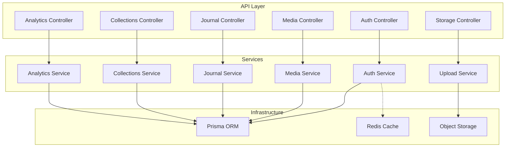
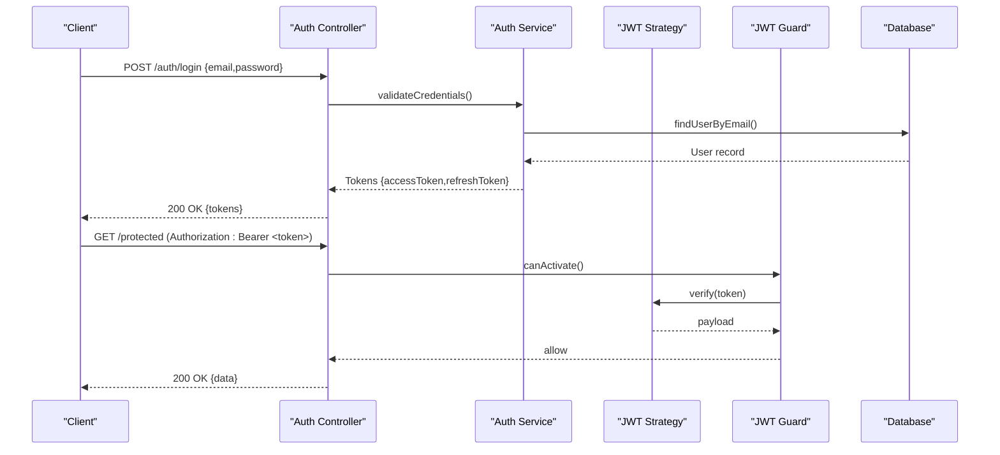
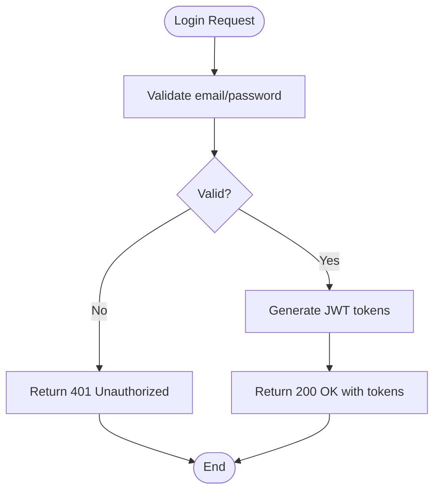
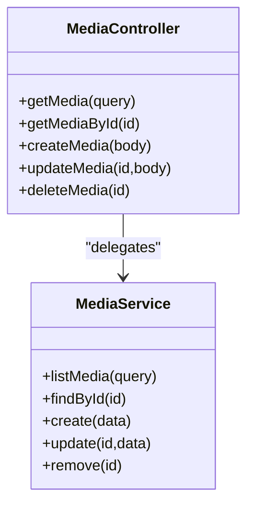
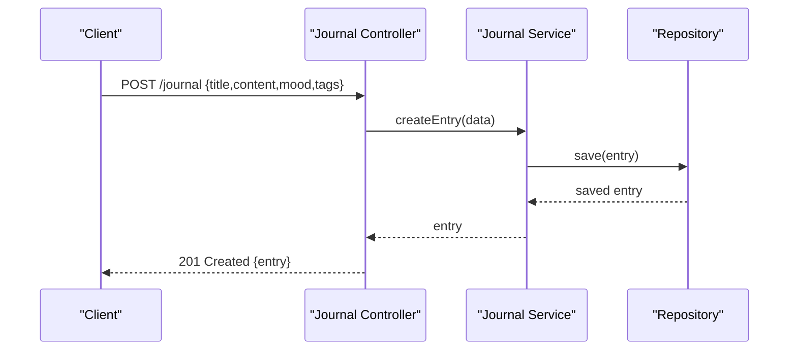
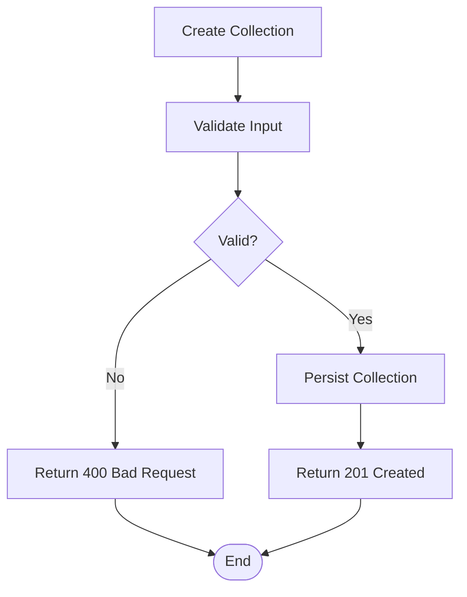
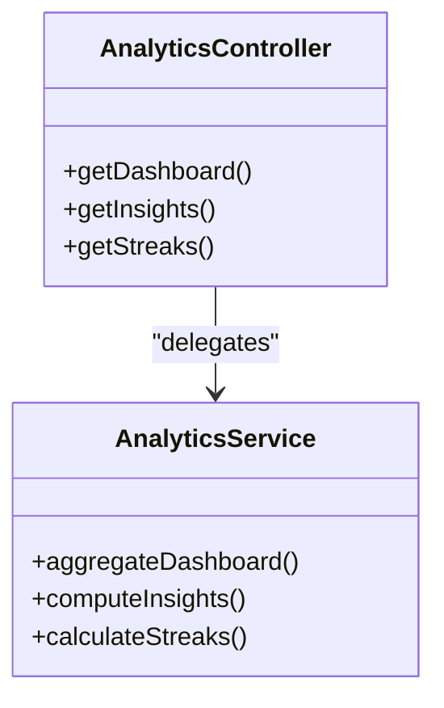
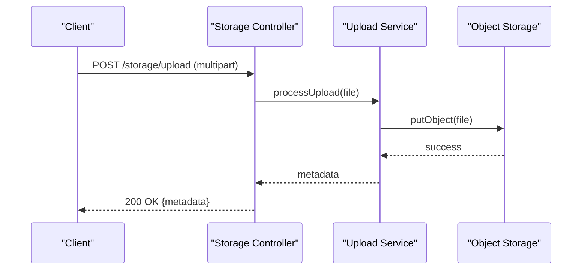
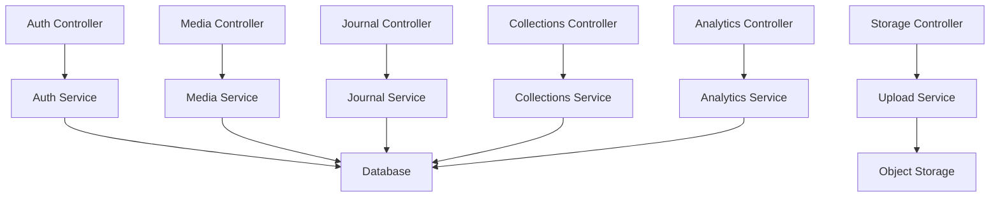

# API Reference

<cite>
**Referenced Files in This Document**
- [app.module.ts](file://apps/backend/src/app.module.ts)
- [main.ts](file://apps/backend/src/main.ts)
- [auth.controller.ts](file://apps/backend/src/auth/auth.controller.ts)
- [auth.service.ts](file://apps/backend/src/auth/auth.service.ts)
- [jwt.strategy.ts](file://apps/backend/src/auth/strategies/jwt.strategy.ts)
- [jwt-auth.guard.ts](file://apps/backend/src/auth/guards/jwt-auth.guard.ts)
- [media.controller.ts](file://apps/backend/src/media/media.controller.ts)
- [media.service.ts](file://apps/backend/src/media/media.service.ts)
- [journal.controller.ts](file://apps/backend/src/journal/journal.controller.ts)
- [journal.service.ts](file://apps/backend/src/journal/journal.service.ts)
- [collections.controller.ts](file://apps/backend/src/collections/collections.controller.ts)
- [collections.service.ts](file://apps/backend/src/collections/collections.service.ts)
- [analytics.controller.ts](file://apps/backend/src/analytics/analytics.controller.ts)
- [analytics.service.ts](file://apps/backend/src/analytics/analytics.service.ts)
- [storage.controller.ts](file://apps/backend/src/storage/storage.controller.ts)
- [upload.service.ts](file://apps/backend/src/storage/upload.service.ts)
- [pagination.interceptor.ts](file://apps/backend/src/common/pagination/pagination.interceptor.ts)
- [rate-limit-audit.service.ts](file://apps/backend/src/hardening/rate-limit-audit.service.ts)
- [configuration.ts](file://apps/backend/src/config/configuration.ts)
- [env.validation.ts](file://apps/backend/src/config/env.validation.ts)
</cite>

## Table of Contents
1. [Introduction](#introduction)
2. [Project Structure](#project-structure)
3. [Core Components](#core-components)
4. [Architecture Overview](#architecture-overview)
5. [Detailed Component Analysis](#detailed-component-analysis)
6. [Dependency Analysis](#dependency-analysis)
7. [Performance Considerations](#performance-considerations)
8. [Troubleshooting Guide](#troubleshooting-guide)
9. [Conclusion](#conclusion)
10. [Appendices](#appendices)

## Introduction
This document provides a comprehensive API reference for the Chronicle Your Media Story backend. It covers authentication (JWT-based), media management, journal entries, collections CRUD, and analytics retrieval endpoints. For each endpoint group, you will find HTTP methods, URL patterns, request/response schemas, authentication requirements, error handling, pagination, filtering/sorting, rate limiting, and client implementation guidelines with common use cases.

## Project Structure
The backend is a NestJS application organized by feature modules:
- Authentication module handles JWT login, registration, token refresh, and protected routes via guards and strategies.
- Media module manages media items and metadata.
- Journal module supports journal entry operations.
- Collections module implements collection CRUD and statistics.
- Analytics module exposes aggregated insights and dashboard data.
- Storage module provides upload and signed URL capabilities.
- Common utilities include pagination interceptors and response wrappers.

**Diagram sources**
- [app.module.ts](file://apps/backend/src/app.module.ts)
- [auth.controller.ts](file://apps/backend/src/auth/auth.controller.ts)
- [media.controller.ts](file://apps/backend/src/media/media.controller.ts)
- [journal.controller.ts](file://apps/backend/src/journal/journal.controller.ts)
- [collections.controller.ts](file://apps/backend/src/collections/collections.controller.ts)
- [analytics.controller.ts](file://apps/backend/src/analytics/analytics.controller.ts)
- [storage.controller.ts](file://apps/backend/src/storage/storage.controller.ts)

**Section sources**
- [app.module.ts](file://apps/backend/src/app.module.ts)
- [main.ts](file://apps/backend/src/main.ts)

## Core Components
- Authentication: JWT strategy and guard enforce authorization; controllers expose login/register/token refresh endpoints.
- Media: Controllers manage media lifecycle; services handle business logic and repository interactions.
- Journal: Controllers provide CRUD for journal entries; services compute statistics and events.
- Collections: Controllers implement full CRUD and smart collections; services aggregate statistics and events.
- Analytics: Controllers serve dashboard and insight endpoints; services perform aggregation and streak calculations.
- Storage: Controllers handle uploads and signed URLs; services integrate with storage providers.

Key cross-cutting concerns:
- Pagination: Centralized interceptor normalizes list responses.
- Rate Limiting: Audit service tracks and enforces limits.
- Configuration: Environment validation ensures required settings.

**Section sources**
- [auth.controller.ts](file://apps/backend/src/auth/auth.controller.ts)
- [auth.service.ts](file://apps/backend/src/auth/auth.service.ts)
- [jwt.strategy.ts](file://apps/backend/src/auth/strategies/jwt.strategy.ts)
- [jwt-auth.guard.ts](file://apps/backend/src/auth/guards/jwt-auth.guard.ts)
- [media.controller.ts](file://apps/backend/src/media/media.controller.ts)
- [media.service.ts](file://apps/backend/src/media/media.service.ts)
- [journal.controller.ts](file://apps/backend/src/journal/journal.controller.ts)
- [journal.service.ts](file://apps/backend/src/journal/journal.service.ts)
- [collections.controller.ts](file://apps/backend/src/collections/collections.controller.ts)
- [collections.service.ts](file://apps/backend/src/collections/collections.service.ts)
- [analytics.controller.ts](file://apps/backend/src/analytics/analytics.controller.ts)
- [analytics.service.ts](file://apps/backend/src/analytics/analytics.service.ts)
- [storage.controller.ts](file://apps/backend/src/storage/storage.controller.ts)
- [upload.service.ts](file://apps/backend/src/storage/upload.service.ts)
- [pagination.interceptor.ts](file://apps/backend/src/common/pagination/pagination.interceptor.ts)
- [rate-limit-audit.service.ts](file://apps/backend/src/hardening/rate-limit-audit.service.ts)
- [configuration.ts](file://apps/backend/src/config/configuration.ts)
- [env.validation.ts](file://apps/backend/src/config/env.validation.ts)

## Architecture Overview
Authentication flow using JWT:
- Clients authenticate via login to receive access and refresh tokens.
- Protected endpoints require a valid Bearer token validated by the JWT strategy and guard.
- Token refresh endpoint reissues tokens without re-authentication.

**Diagram sources**
- [auth.controller.ts](file://apps/backend/src/auth/auth.controller.ts)
- [auth.service.ts](file://apps/backend/src/auth/auth.service.ts)
- [jwt.strategy.ts](file://apps/backend/src/auth/strategies/jwt.strategy.ts)
- [jwt-auth.guard.ts](file://apps/backend/src/auth/guards/jwt-auth.guard.ts)

## Detailed Component Analysis

### Authentication APIs
- Base path: /auth
- Methods:
  - POST /auth/login
    - Request body: email, password
    - Response: accessToken, refreshToken
    - Status codes: 200 OK, 401 Unauthorized, 400 Bad Request
  - POST /auth/register
    - Request body: email, password, profile fields
    - Response: user object, tokens
    - Status codes: 201 Created, 409 Conflict, 400 Bad Request
  - POST /auth/refresh
    - Request body: refreshToken
    - Response: new accessToken
    - Status codes: 200 OK, 401 Unauthorized
  - POST /auth/logout
    - Requires: Authorization header (Bearer token)
    - Response: success message
    - Status codes: 200 OK, 401 Unauthorized
- Authentication: Public endpoints for login/register/refresh; logout requires token.
- Error handling: Standardized error responses with code and message.

**Diagram sources**
- [auth.controller.ts](file://apps/backend/src/auth/auth.controller.ts)
- [auth.service.ts](file://apps/backend/src/auth/auth.service.ts)

**Section sources**
- [auth.controller.ts](file://apps/backend/src/auth/auth.controller.ts)
- [auth.service.ts](file://apps/backend/src/auth/auth.service.ts)
- [jwt.strategy.ts](file://apps/backend/src/auth/strategies/jwt.strategy.ts)
- [jwt-auth.guard.ts](file://apps/backend/src/auth/guards/jwt-auth.guard.ts)

### Media Management APIs
- Base path: /media
- Methods:
  - GET /media
    - Query params: page, limit, sort, filter (e.g., type, status)
    - Response: paginated list of media items
    - Status codes: 200 OK, 400 Bad Request
  - GET /media/:id
    - Response: single media item
    - Status codes: 200 OK, 404 Not Found
  - POST /media
    - Request body: media metadata
    - Response: created media item
    - Status codes: 201 Created, 400 Bad Request
  - PUT /media/:id
    - Request body: updated fields
    - Response: updated media item
    - Status codes: 200 OK, 404 Not Found, 400 Bad Request
  - DELETE /media/:id
    - Response: success message
    - Status codes: 200 OK, 404 Not Found
- Authentication: Protected endpoints require Bearer token.
- Pagination: Standardized via interceptor; returns total, page, limit, hasNext.
- Filtering/Sorting: Supported via query parameters; see controller/service implementations.

**Diagram sources**
- [media.controller.ts](file://apps/backend/src/media/media.controller.ts)
- [media.service.ts](file://apps/backend/src/media/media.service.ts)

**Section sources**
- [media.controller.ts](file://apps/backend/src/media/media.controller.ts)
- [media.service.ts](file://apps/backend/src/media/media.service.ts)
- [pagination.interceptor.ts](file://apps/backend/src/common/pagination/pagination.interceptor.ts)

### Journal Entry Operations
- Base path: /journal
- Methods:
  - GET /journal
    - Query params: page, limit, sort, filter (date range, mood)
    - Response: paginated journal entries
    - Status codes: 200 OK, 400 Bad Request
  - GET /journal/:id
    - Response: single journal entry
    - Status codes: 200 OK, 404 Not Found
  - POST /journal
    - Request body: title, content, tags, mood
    - Response: created entry
    - Status codes: 201 Created, 400 Bad Request
  - PUT /journal/:id
    - Request body: updated fields
    - Response: updated entry
    - Status codes: 200 OK, 404 Not Found, 400 Bad Request
  - DELETE /journal/:id
    - Response: success message
    - Status codes: 200 OK, 404 Not Found
- Authentication: Protected endpoints require Bearer token.
- Statistics: Additional endpoints may return counts and trends via service layer.

**Diagram sources**
- [journal.controller.ts](file://apps/backend/src/journal/journal.controller.ts)
- [journal.service.ts](file://apps/backend/src/journal/journal.service.ts)

**Section sources**
- [journal.controller.ts](file://apps/backend/src/journal/journal.controller.ts)
- [journal.service.ts](file://apps/backend/src/journal/journal.service.ts)

### Collection CRUD Operations
- Base path: /collections
- Methods:
  - GET /collections
    - Query params: page, limit, sort, filter (type, visibility)
    - Response: paginated collections
    - Status codes: 200 OK, 400 Bad Request
  - GET /collections/:id
    - Response: single collection
    - Status codes: 200 OK, 404 Not Found
  - POST /collections
    - Request body: name, description, type, visibility
    - Response: created collection
    - Status codes: 201 Created, 400 Bad Request
  - PUT /collections/:id
    - Request body: updated fields
    - Response: updated collection
    - Status codes: 200 OK, 404 Not Found, 400 Bad Request
  - DELETE /collections/:id
    - Response: success message
    - Status codes: 200 OK, 404 Not Found
- Smart Collections: Additional logic handled by service for dynamic grouping.
- Statistics: Aggregated metrics available through service layer.

**Diagram sources**
- [collections.controller.ts](file://apps/backend/src/collections/collections.controller.ts)
- [collections.service.ts](file://apps/backend/src/collections/collections.service.ts)

**Section sources**
- [collections.controller.ts](file://apps/backend/src/collections/collections.controller.ts)
- [collections.service.ts](file://apps/backend/src/collections/collections.service.ts)

### Analytics Retrieval Endpoints
- Base path: /analytics
- Methods:
  - GET /analytics/dashboard
    - Response: aggregated dashboard metrics
    - Status codes: 200 OK
  - GET /analytics/insights
    - Response: insights derived from media/journal/collections
    - Status codes: 200 OK
  - GET /analytics/streaks
    - Response: streak calculations over time
    - Status codes: 200 OK
- Authentication: Protected endpoints require Bearer token.
- Data Sources: Services aggregate data from repositories and caches.

**Diagram sources**
- [analytics.controller.ts](file://apps/backend/src/analytics/analytics.controller.ts)
- [analytics.service.ts](file://apps/backend/src/analytics/analytics.service.ts)

**Section sources**
- [analytics.controller.ts](file://apps/backend/src/analytics/analytics.controller.ts)
- [analytics.service.ts](file://apps/backend/src/analytics/analytics.service.ts)

### Storage and Upload Endpoints
- Base path: /storage
- Methods:
  - POST /storage/upload
    - Request: multipart form with file(s)
    - Response: uploaded file metadata or signed URL
    - Status codes: 200 OK, 400 Bad Request, 413 Payload Too Large
  - GET /storage/signed-url
    - Query params: fileName, contentType
    - Response: presigned URL for direct upload/download
    - Status codes: 200 OK, 400 Bad Request
- Authentication: Protected endpoints require Bearer token.
- Integration: Upload service interacts with object storage provider.

**Diagram sources**
- [storage.controller.ts](file://apps/backend/src/storage/storage.controller.ts)
- [upload.service.ts](file://apps/backend/src/storage/upload.service.ts)

**Section sources**
- [storage.controller.ts](file://apps/backend/src/storage/storage.controller.ts)
- [upload.service.ts](file://apps/backend/src/storage/upload.service.ts)

## Dependency Analysis
Module-level dependencies and coupling:
- Controllers depend on their respective services for business logic.
- Services interact with repositories and external systems (database, cache, storage).
- Authentication components are shared across protected endpoints via guards and strategies.
- Pagination and response formatting are centralized in common modules.

**Diagram sources**
- [app.module.ts](file://apps/backend/src/app.module.ts)

**Section sources**
- [app.module.ts](file://apps/backend/src/app.module.ts)

## Performance Considerations
- Pagination: Use page and limit parameters to avoid large payloads; default limits recommended.
- Filtering/Sorting: Apply server-side filters to reduce client processing; ensure indexes on filtered columns.
- Caching: Leverage Redis where applicable for read-heavy analytics endpoints.
- Rate Limiting: Enforce per-client limits to protect against abuse; monitor audit logs.
- Storage: Use presigned URLs for large files to offload bandwidth to storage provider.

[No sources needed since this section provides general guidance]

## Troubleshooting Guide
Common issues and resolutions:
- Authentication failures: Verify token presence and validity; check expiration and signing configuration.
- Validation errors: Inspect request bodies for missing or invalid fields; ensure DTO constraints match.
- Not found errors: Confirm resource IDs exist and belong to the authenticated user.
- Rate limiting: Monitor audit logs and adjust limits based on usage patterns.
- Storage errors: Check storage provider credentials and bucket permissions.

**Section sources**
- [rate-limit-audit.service.ts](file://apps/backend/src/hardening/rate-limit-audit.service.ts)
- [configuration.ts](file://apps/backend/src/config/configuration.ts)
- [env.validation.ts](file://apps/backend/src/config/env.validation.ts)

## Conclusion
This API reference outlines the core endpoints for authentication, media, journal, collections, analytics, and storage. By following the documented schemas, authentication requirements, and best practices, clients can reliably integrate with the Chronicle Your Media Story backend.

[No sources needed since this section summarizes without analyzing specific files]

## Appendices

### Authentication Requirements
- All protected endpoints require an Authorization header with a valid Bearer token.
- Tokens are issued by the authentication endpoints and must be refreshed before expiration.

**Section sources**
- [jwt.strategy.ts](file://apps/backend/src/auth/strategies/jwt.strategy.ts)
- [jwt-auth.guard.ts](file://apps/backend/src/auth/guards/jwt-auth.guard.ts)

### Pagination Patterns
- Standard query parameters: page (default 1), limit (default 20).
- Responses include total count, current page, limit, and hasNext flag.

**Section sources**
- [pagination.interceptor.ts](file://apps/backend/src/common/pagination/pagination.interceptor.ts)

### Filtering and Sorting
- Filtering: Use query parameters aligned with entity fields (e.g., type, status, date ranges).
- Sorting: Specify field and direction via query parameters (e.g., sortBy=createdAt&sortDir=desc).

**Section sources**
- [media.controller.ts](file://apps/backend/src/media/media.controller.ts)
- [journal.controller.ts](file://apps/backend/src/journal/journal.controller.ts)
- [collections.controller.ts](file://apps/backend/src/collections/collections.controller.ts)

### Error Codes and Messages
- 200 OK: Successful operation.
- 201 Created: Resource created successfully.
- 400 Bad Request: Invalid input or validation failure.
- 401 Unauthorized: Missing or invalid token.
- 403 Forbidden: Insufficient permissions.
- 404 Not Found: Resource does not exist.
- 409 Conflict: Duplicate resource.
- 413 Payload Too Large: File size exceeds limit.
- 429 Too Many Requests: Rate limit exceeded.
- 500 Internal Server Error: Unexpected server failure.

[No sources needed since this section provides general guidance]

### Client Implementation Guidelines
- Always include Authorization header for protected endpoints.
- Handle pagination by respecting page and limit parameters.
- Implement retry logic with exponential backoff for transient errors.
- Validate responses and handle error codes gracefully.

[No sources needed since this section provides general guidance]

### Common Use Cases
- Login and store tokens securely; attach tokens to subsequent requests.
- Create and manage media items with metadata and optional attachments.
- Write journal entries with mood and tags; retrieve timelines and statistics.
- Organize media into collections; apply smart rules for dynamic grouping.
- Fetch analytics dashboards and insights for reporting and visualization.

[No sources needed since this section provides general guidance]