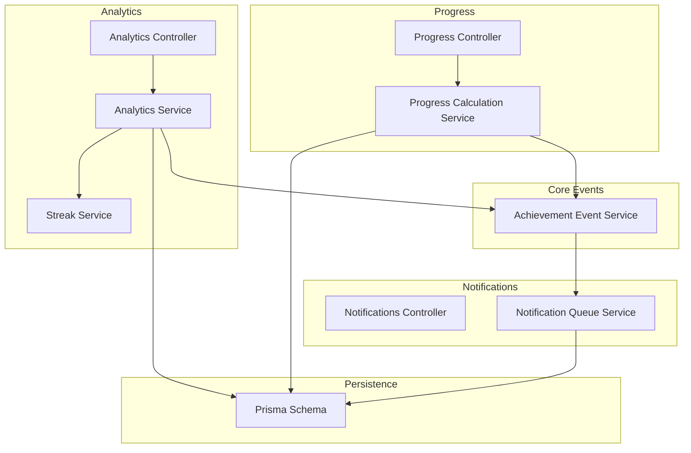
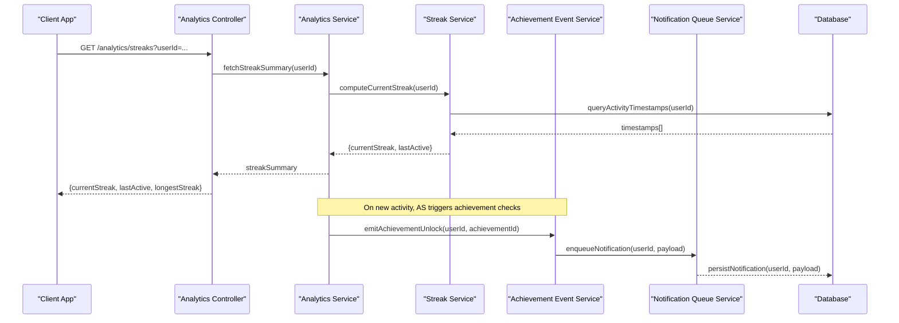
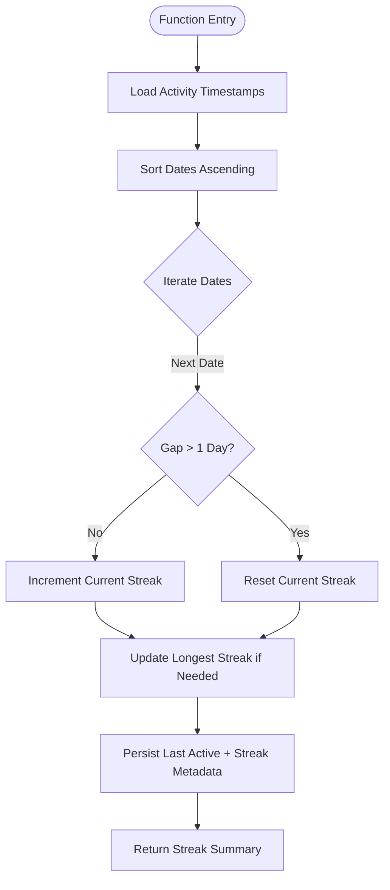
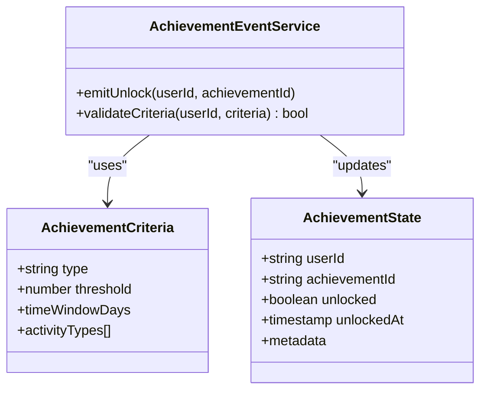
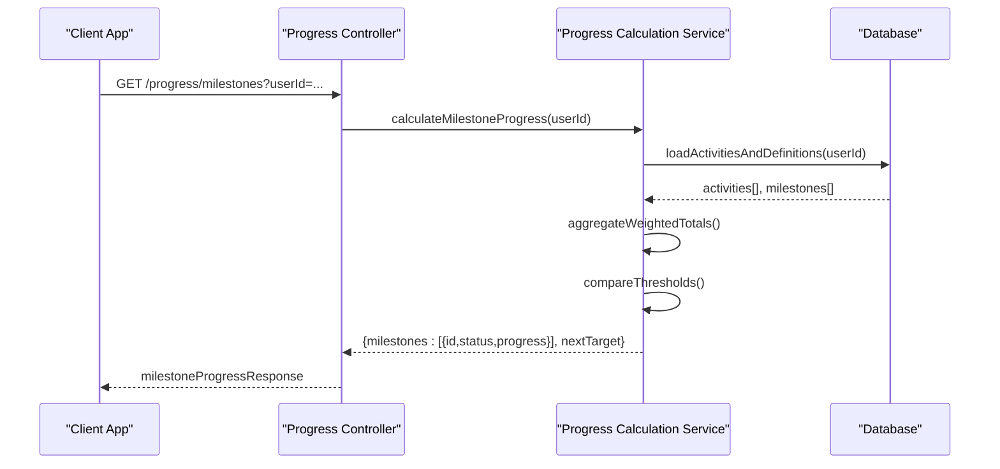
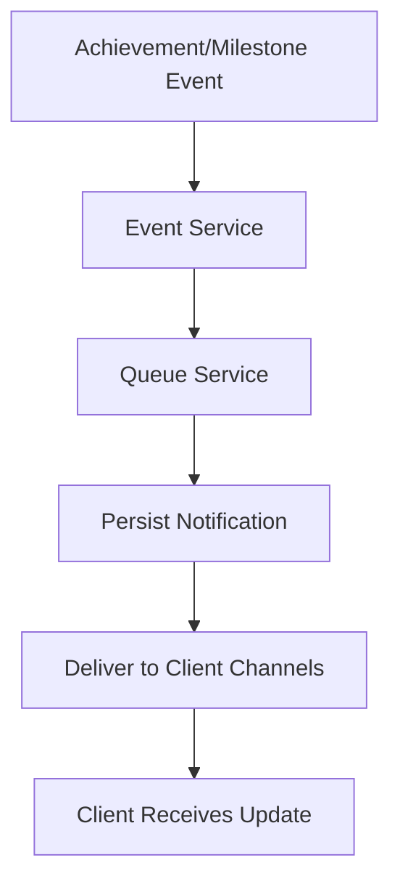
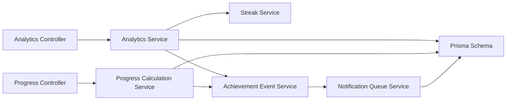

# Achievements & Milestones API

<cite>
**Referenced Files in This Document**
- [streak.service.ts](file://apps/backend/src/analytics/streak.service.ts)
- [analytics.controller.ts](file://apps/backend/src/analytics/analytics.controller.ts)
- [analytics.service.ts](file://apps/backend/src/analytics/analytics.service.ts)
- [progress-calculation.service.ts](file://apps/backend/src/progress/progress-calculation.service.ts)
- [progress.controller.ts](file://apps/backend/src/progress/progress.controller.ts)
- [notifications.controller.ts](file://apps/backend/src/notifications/notifications.controller.ts)
- [notification-queue.service.ts](file://apps/backend/src/notifications/notification-queue.service.ts)
- [achievement-event.service.ts](file://apps/backend/src/core/events/achievement-event.service.ts)
- [achievement.repository.ts](file://apps/backend/src/core/repository/achievement.repository.ts)
- [schema.prisma](file://apps/backend/prisma/schema.prisma)
</cite>

## Table of Contents
1. [Introduction](#introduction)
2. [Project Structure](#project-structure)
3. [Core Components](#core-components)
4. [Architecture Overview](#architecture-overview)
5. [Detailed Component Analysis](#detailed-component-analysis)
6. [Dependency Analysis](#dependency-analysis)
7. [Performance Considerations](#performance-considerations)
8. [Troubleshooting Guide](#troubleshooting-guide)
9. [Conclusion](#conclusion)
10. [Appendices](#appendices)

## Introduction
This document provides detailed API documentation for achievement tracking and milestone endpoints, focusing on streak calculations, achievement unlocking logic, milestone detection, and progress tracking. It explains how user activities drive achievement states, how real-time updates are delivered, and how historical achievement data is maintained. The guide includes specifications for streak maintenance, achievement criteria validation, milestone notifications, and examples of queries and calculations.

## Project Structure
The achievement and milestone system spans analytics, progress, notifications, core events, and persistence layers:
- Analytics module computes streaks and aggregates activity metrics.
- Progress module calculates granular progress toward goals and milestones.
- Notifications module emits milestone and achievement notifications via queues.
- Core events provide domain-driven eventing for achievements.
- Persistence uses Prisma schema to store achievement states and history.

**Diagram sources**
- [analytics.controller.ts](file://apps/backend/src/analytics/analytics.controller.ts)
- [analytics.service.ts](file://apps/backend/src/analytics/analytics.service.ts)
- [streak.service.ts](file://apps/backend/src/analytics/streak.service.ts)
- [progress.controller.ts](file://apps/backend/src/progress/progress.controller.ts)
- [progress-calculation.service.ts](file://apps/backend/src/progress/progress-calculation.service.ts)
- [notifications.controller.ts](file://apps/backend/src/notifications/notifications.controller.ts)
- [notification-queue.service.ts](file://apps/backend/src/notifications/notification-queue.service.ts)
- [achievement-event.service.ts](file://apps/backend/src/core/events/achievement-event.service.ts)
- [schema.prisma](file://apps/backend/prisma/schema.prisma)

**Section sources**
- [analytics.controller.ts](file://apps/backend/src/analytics/analytics.controller.ts)
- [analytics.service.ts](file://apps/backend/src/analytics/analytics.service.ts)
- [streak.service.ts](file://apps/backend/src/analytics/streak.service.ts)
- [progress.controller.ts](file://apps/backend/src/progress/progress.controller.ts)
- [progress-calculation.service.ts](file://apps/backend/src/progress/progress-calculation.service.ts)
- [notifications.controller.ts](file://apps/backend/src/notifications/notifications.controller.ts)
- [notification-queue.service.ts](file://apps/backend/src/notifications/notification-queue.service.ts)
- [achievement-event.service.ts](file://apps/backend/src/core/events/achievement-event.service.ts)
- [schema.prisma](file://apps/backend/prisma/schema.prisma)

## Core Components
- Streak Service: Computes daily streaks based on user activity timestamps, handles continuity checks, and maintains current streak length and last active date.
- Analytics Service: Aggregates activity metrics, exposes endpoints for streak summaries, and coordinates with the Streak Service.
- Progress Calculation Service: Calculates progress toward milestones using weighted activity types and thresholds; supports incremental updates and batch recalculations.
- Achievement Event Service: Emits domain events when achievements unlock or milestones are reached, enabling decoupled processing.
- Notification Queue Service: Queues and dispatches milestone and achievement notifications asynchronously.
- Controllers: Expose REST endpoints for querying streaks, progress, achievements, and triggering milestone notifications.

Key responsibilities:
- Streak maintenance: validate consecutive days, handle resets, and compute longest streaks.
- Achievement criteria validation: check thresholds, time windows, and activity composition rules.
- Milestone detection: evaluate cumulative progress against milestone definitions.
- Real-time updates: emit events and queue notifications for immediate client reactions.
- Historical data: persist achievement states and milestone history for reporting.

**Section sources**
- [streak.service.ts](file://apps/backend/src/analytics/streak.service.ts)
- [analytics.service.ts](file://apps/backend/src/analytics/analytics.service.ts)
- [progress-calculation.service.ts](file://apps/backend/src/progress/progress-calculation.service.ts)
- [achievement-event.service.ts](file://apps/backend/src/core/events/achievement-event.service.ts)
- [notification-queue.service.ts](file://apps/backend/src/notifications/notification-queue.service.ts)

## Architecture Overview
The system follows a layered architecture with clear separation of concerns:
- Controllers handle HTTP requests and responses.
- Services implement business logic (streak calculation, progress computation, event emission).
- Repositories and Prisma manage persistence.
- Event-driven design ensures scalability and decoupling between achievement state changes and notifications.

**Diagram sources**
- [analytics.controller.ts](file://apps/backend/src/analytics/analytics.controller.ts)
- [analytics.service.ts](file://apps/backend/src/analytics/analytics.service.ts)
- [streak.service.ts](file://apps/backend/src/analytics/streak.service.ts)
- [achievement-event.service.ts](file://apps/backend/src/core/events/achievement-event.service.ts)
- [notification-queue.service.ts](file://apps/backend/src/notifications/notification-queue.service.ts)
- [schema.prisma](file://apps/backend/prisma/schema.prisma)

## Detailed Component Analysis

### Streak Calculations and Maintenance
- Inputs: user ID, activity timestamps, day boundaries.
- Logic:
  - Sort timestamps by date.
  - Detect consecutive days; reset streak if gap > 1 day.
  - Update current streak and longest streak.
  - Persist last active date and streak metadata.
- Outputs: current streak length, last active date, longest streak, streak history.

**Diagram sources**
- [streak.service.ts](file://apps/backend/src/analytics/streak.service.ts)

**Section sources**
- [streak.service.ts](file://apps/backend/src/analytics/streak.service.ts)

### Achievement Unlocking Logic
- Criteria validation:
  - Threshold-based: total count of specific activities within a time window.
  - Composition-based: mix of activity types (e.g., watch + journal entries).
  - Recency-based: actions within defined periods.
- Process:
  - Evaluate user activity against achievement definitions.
  - If criteria met and not previously unlocked, mark as unlocked.
  - Emit achievement unlock event for downstream processing.
- Outputs: unlocked achievement IDs, timestamps, and associated metadata.

**Diagram sources**
- [achievement-event.service.ts](file://apps/backend/src/core/events/achievement-event.service.ts)

**Section sources**
- [achievement-event.service.ts](file://apps/backend/src/core/events/achievement-event.service.ts)

### Milestone Detection and Progress Tracking
- Inputs: user ID, activity streams, milestone definitions (thresholds, weights).
- Logic:
  - Aggregate weighted activity counts per category.
  - Compare cumulative totals against milestone thresholds.
  - Mark milestones as achieved when thresholds are met.
  - Record progress snapshots for historical analysis.
- Outputs: milestone status, progress percentages, next milestone targets.

**Diagram sources**
- [progress.controller.ts](file://apps/backend/src/progress/progress.controller.ts)
- [progress-calculation.service.ts](file://apps/backend/src/progress/progress-calculation.service.ts)
- [schema.prisma](file://apps/backend/prisma/schema.prisma)

**Section sources**
- [progress.controller.ts](file://apps/backend/src/progress/progress.controller.ts)
- [progress-calculation.service.ts](file://apps/backend/src/progress/progress-calculation.service.ts)

### Notifications and Real-Time Updates
- Triggers:
  - Achievement unlocked events.
  - Milestone reached events.
- Processing:
  - Event service emits structured payloads.
  - Queue service persists and schedules delivery.
  - Clients subscribe to real-time channels for instant updates.
- Outputs: notification records with type, payload, and delivery status.

**Diagram sources**
- [achievement-event.service.ts](file://apps/backend/src/core/events/achievement-event.service.ts)
- [notification-queue.service.ts](file://apps/backend/src/notifications/notification-queue.service.ts)
- [notifications.controller.ts](file://apps/backend/src/notifications/notifications.controller.ts)

**Section sources**
- [notifications.controller.ts](file://apps/backend/src/notifications/notifications.controller.ts)
- [notification-queue.service.ts](file://apps/backend/src/notifications/notification-queue.service.ts)
- [achievement-event.service.ts](file://apps/backend/src/core/events/achievement-event.service.ts)

## Dependency Analysis
- Controllers depend on services for business logic.
- Services depend on repositories and Prisma for data access.
- Event-driven components decouple achievement state changes from notification delivery.
- Potential circular dependencies are avoided by separating event emission from state mutation.

**Diagram sources**
- [analytics.controller.ts](file://apps/backend/src/analytics/analytics.controller.ts)
- [analytics.service.ts](file://apps/backend/src/analytics/analytics.service.ts)
- [streak.service.ts](file://apps/backend/src/analytics/streak.service.ts)
- [progress.controller.ts](file://apps/backend/src/progress/progress.controller.ts)
- [progress-calculation.service.ts](file://apps/backend/src/progress/progress-calculation.service.ts)
- [achievement-event.service.ts](file://apps/backend/src/core/events/achievement-event.service.ts)
- [notification-queue.service.ts](file://apps/backend/src/notifications/notification-queue.service.ts)
- [schema.prisma](file://apps/backend/prisma/schema.prisma)

**Section sources**
- [analytics.controller.ts](file://apps/backend/src/analytics/analytics.controller.ts)
- [analytics.service.ts](file://apps/backend/src/analytics/analytics.service.ts)
- [streak.service.ts](file://apps/backend/src/analytics/streak.service.ts)
- [progress.controller.ts](file://apps/backend/src/progress/progress.controller.ts)
- [progress-calculation.service.ts](file://apps/backend/src/progress/progress-calculation.service.ts)
- [achievement-event.service.ts](file://apps/backend/src/core/events/achievement-event.service.ts)
- [notification-queue.service.ts](file://apps/backend/src/notifications/notification-queue.service.ts)
- [schema.prisma](file://apps/backend/prisma/schema.prisma)

## Performance Considerations
- Batch activity queries to reduce database round trips.
- Cache streak summaries and milestone progress for frequent reads.
- Use asynchronous queues for notifications to avoid blocking request cycles.
- Optimize timestamp sorting and date gap detection algorithms.
- Implement pagination for large activity histories.

[No sources needed since this section provides general guidance]

## Troubleshooting Guide
Common issues and resolutions:
- Streak resets unexpectedly: verify timezone handling and day boundary logic.
- Achievement not unlocking: check criteria thresholds and time window configurations.
- Missing milestone notifications: inspect queue service logs and delivery status.
- Slow progress calculations: review activity aggregation queries and indexes.

**Section sources**
- [streak.service.ts](file://apps/backend/src/analytics/streak.service.ts)
- [achievement-event.service.ts](file://apps/backend/src/core/events/achievement-event.service.ts)
- [notification-queue.service.ts](file://apps/backend/src/notifications/notification-queue.service.ts)
- [progress-calculation.service.ts](file://apps/backend/src/progress/progress-calculation.service.ts)

## Conclusion
The Achievements & Milestones API provides robust streak calculations, achievement unlocking logic, milestone detection, and progress tracking. Through an event-driven architecture and asynchronous notifications, it ensures real-time updates and scalable performance. Proper configuration of criteria and thresholds, along with optimized data access patterns, enables accurate and responsive achievement experiences.

[No sources needed since this section summarizes without analyzing specific files]

## Appendices

### API Endpoints Reference
- GET /analytics/streaks: Retrieve streak summary for a user.
- GET /progress/milestones: Fetch milestone progress and next targets.
- POST /achievements/unlock: Trigger achievement validation and unlock flow.
- GET /notifications: List recent achievement and milestone notifications.

**Section sources**
- [analytics.controller.ts](file://apps/backend/src/analytics/analytics.controller.ts)
- [progress.controller.ts](file://apps/backend/src/progress/progress.controller.ts)
- [notifications.controller.ts](file://apps/backend/src/notifications/notifications.controller.ts)

### Data Models
- AchievementState: tracks user achievement unlocks and metadata.
- MilestoneProgress: stores cumulative progress and thresholds.
- StreakMetadata: holds current and longest streak values with last active date.

**Section sources**
- [schema.prisma](file://apps/backend/prisma/schema.prisma)