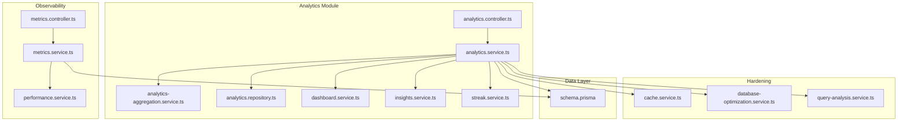
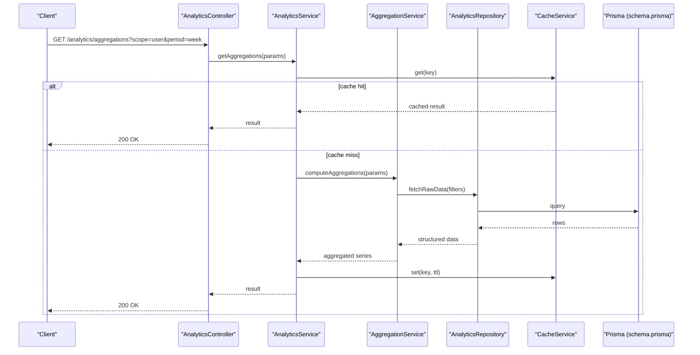
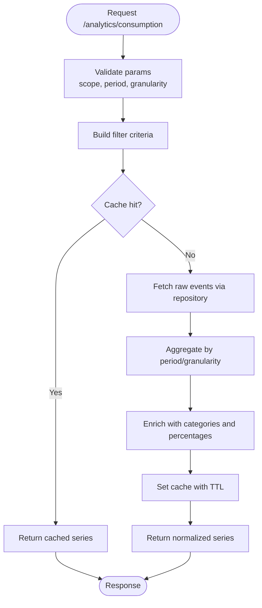
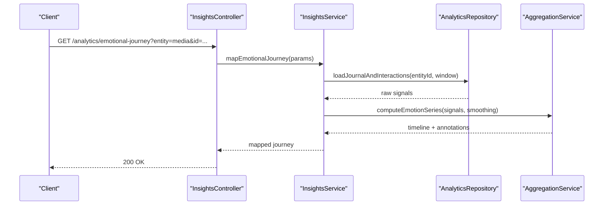
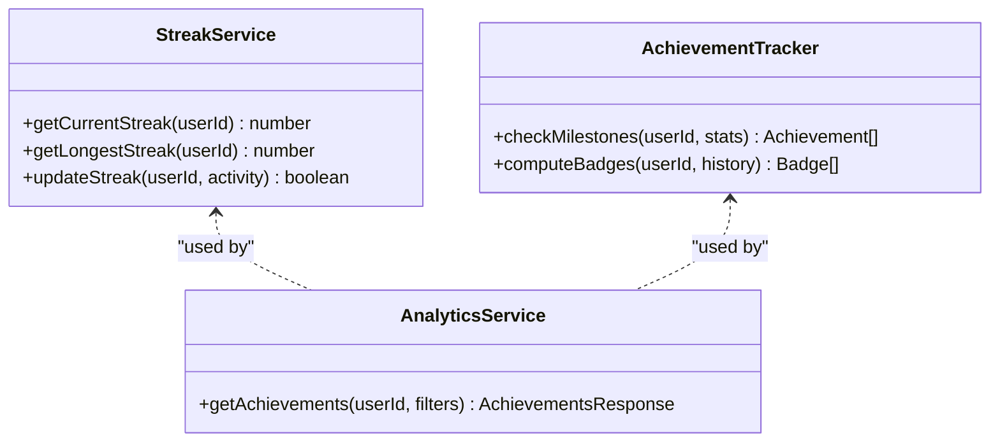
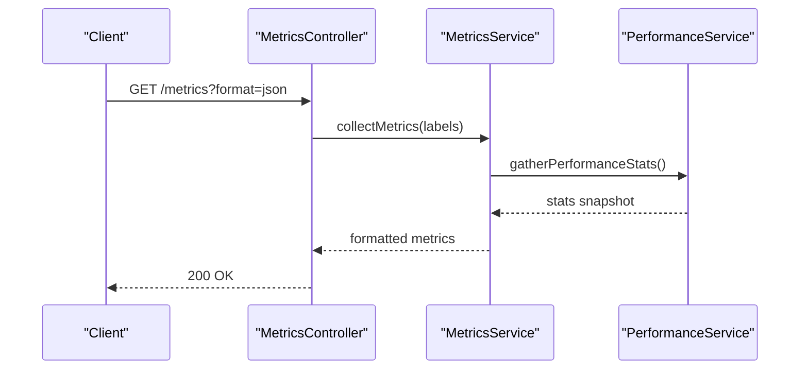
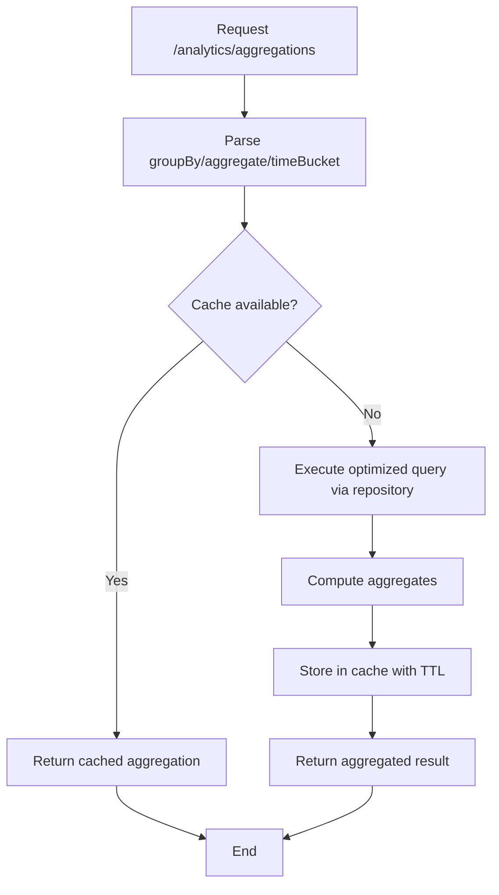
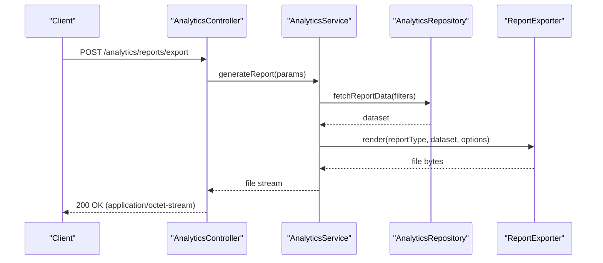
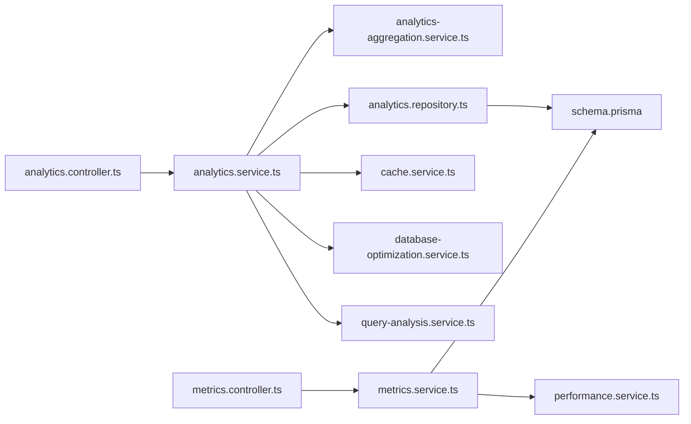

# Analytics & Insights API

<cite>
**Referenced Files in This Document**
- [analytics.controller.ts](file://apps/backend/src/analytics/analytics.controller.ts)
- [analytics.service.ts](file://apps/backend/src/analytics/analytics.service.ts)
- [analytics-aggregation.service.ts](file://apps/backend/src/analytics/analytics-aggregation.service.ts)
- [analytics.repository.ts](file://apps/backend/src/analytics/analytics.repository.ts)
- [dashboard.service.ts](file://apps/backend/src/analytics/dashboard.service.ts)
- [insights.service.ts](file://apps/backend/src/analytics/insights.service.ts)
- [streak.service.ts](file://apps/backend/src/analytics/streak.service.ts)
- [metrics.controller.ts](file://apps/backend/src/observability/metrics.controller.ts)
- [metrics.service.ts](file://apps/backend/src/observability/metrics.service.ts)
- [performance.service.ts](file://apps/backend/src/observability/performance.service.ts)
- [cache.service.ts](file://apps/backend/src/hardening/cache.service.ts)
- [database-optimization.service.ts](file://apps/backend/src/hardening/database-optimization.service.ts)
- [query-analysis.service.ts](file://apps/backend/src/hardening/query-analysis.service.ts)
- [schema.prisma](file://apps/backend/prisma/schema.prisma)
</cite>

## Table of Contents
1. [Introduction](#introduction)
2. [Project Structure](#project-structure)
3. [Core Components](#core-components)
4. [Architecture Overview](#architecture-overview)
5. [Detailed Component Analysis](#detailed-component-analysis)
6. [Dependency Analysis](#dependency-analysis)
7. [Performance Considerations](#performance-considerations)
8. [Troubleshooting Guide](#troubleshooting-guide)
9. [Conclusion](#conclusion)
10. [Appendices](#appendices)

## Introduction
This document provides comprehensive API documentation for the Analytics & Insights subsystem. It covers consumption pattern analysis, emotional journey mapping, achievement tracking, and performance metrics retrieval. It also documents data aggregation endpoints, report generation, visualization data formats, export capabilities, query parameters, response schemas, real-time metrics, custom reports, caching strategies, and performance optimization techniques.

## Project Structure
The analytics feature is implemented as a NestJS module with controllers, services, DTOs, and repositories. Observability and hardening modules provide metrics, performance, caching, and database optimization utilities used by analytics endpoints.

**Diagram sources**
- [analytics.controller.ts](file://apps/backend/src/analytics/analytics.controller.ts)
- [analytics.service.ts](file://apps/backend/src/analytics/analytics.service.ts)
- [analytics-aggregation.service.ts](file://apps/backend/src/analytics/analytics-aggregation.service.ts)
- [analytics.repository.ts](file://apps/backend/src/analytics/analytics.repository.ts)
- [dashboard.service.ts](file://apps/backend/src/analytics/dashboard.service.ts)
- [insights.service.ts](file://apps/backend/src/analytics/insights.service.ts)
- [streak.service.ts](file://apps/backend/src/analytics/streak.service.ts)
- [metrics.controller.ts](file://apps/backend/src/observability/metrics.controller.ts)
- [metrics.service.ts](file://apps/backend/src/observability/metrics.service.ts)
- [performance.service.ts](file://apps/backend/src/observability/performance.service.ts)
- [cache.service.ts](file://apps/backend/src/hardening/cache.service.ts)
- [database-optimization.service.ts](file://apps/backend/src/hardening/database-optimization.service.ts)
- [query-analysis.service.ts](file://apps/backend/src/hardening/query-analysis.service.ts)
- [schema.prisma](file://apps/backend/prisma/schema.prisma)

**Section sources**
- [analytics.controller.ts](file://apps/backend/src/analytics/analytics.controller.ts)
- [analytics.service.ts](file://apps/backend/src/analytics/analytics.service.ts)
- [metrics.controller.ts](file://apps/backend/src/observability/metrics.controller.ts)
- [metrics.service.ts](file://apps/backend/src/observability/metrics.service.ts)
- [cache.service.ts](file://apps/backend/src/hardening/cache.service.ts)
- [database-optimization.service.ts](file://apps/backend/src/hardening/database-optimization.service.ts)
- [query-analysis.service.ts](file://apps/backend/src/hardening/query-analysis.service.ts)
- [schema.prisma](file://apps/backend/prisma/schema.prisma)

## Core Components
- Controller: Exposes REST endpoints for analytics queries, aggregations, dashboards, insights, streaks, and exports.
- Service: Orchestrates business logic, composes results from aggregation, repository, dashboard, insights, and streak services; applies caching and performance optimizations.
- Aggregation Service: Performs time-series and categorical aggregations for charts and graphs.
- Repository: Data access layer to Prisma models for media, interactions, journal entries, progress, and related entities.
- Dashboard Service: Provides aggregated KPIs and summary views for the main dashboard.
- Insights Service: Computes derived insights such as emotional journey mapping and consumption patterns.
- Streak Service: Tracks user engagement streaks and achievements.
- Metrics & Performance: Observability endpoints and services exposing system and application metrics.
- Hardening: Caching, database optimization, and query analysis utilities.

**Section sources**
- [analytics.controller.ts](file://apps/backend/src/analytics/analytics.controller.ts)
- [analytics.service.ts](file://apps/backend/src/analytics/analytics.service.ts)
- [analytics-aggregation.service.ts](file://apps/backend/src/analytics/analytics-aggregation.service.ts)
- [analytics.repository.ts](file://apps/backend/src/analytics/analytics.repository.ts)
- [dashboard.service.ts](file://apps/backend/src/analytics/dashboard.service.ts)
- [insights.service.ts](file://apps/backend/src/analytics/insights.service.ts)
- [streak.service.ts](file://apps/backend/src/analytics/streak.service.ts)
- [metrics.controller.ts](file://apps/backend/src/observability/metrics.controller.ts)
- [metrics.service.ts](file://apps/backend/src/observability/metrics.service.ts)
- [performance.service.ts](file://apps/backend/src/observability/performance.service.ts)
- [cache.service.ts](file://apps/backend/src/hardening/cache.service.ts)
- [database-optimization.service.ts](file://apps/backend/src/hardening/database-optimization.service.ts)
- [query-analysis.service.ts](file://apps/backend/src/hardening/query-analysis.service.ts)

## Architecture Overview
The analytics pipeline follows a layered architecture:
- HTTP Controllers receive requests and validate inputs.
- Services orchestrate domain logic and coordinate between aggregation, repository, and auxiliary services.
- Repository abstracts database operations via Prisma.
- Hardening services apply caching and query optimizations.
- Observability exposes metrics and performance data.

**Diagram sources**
- [analytics.controller.ts](file://apps/backend/src/analytics/analytics.controller.ts)
- [analytics.service.ts](file://apps/backend/src/analytics/analytics.service.ts)
- [analytics-aggregation.service.ts](file://apps/backend/src/analytics/analytics-aggregation.service.ts)
- [analytics.repository.ts](file://apps/backend/src/analytics/analytics.repository.ts)
- [cache.service.ts](file://apps/backend/src/hardening/cache.service.ts)
- [schema.prisma](file://apps/backend/prisma/schema.prisma)

## Detailed Component Analysis

### Consumption Pattern Analysis Endpoints
- Purpose: Retrieve time-series and categorical breakdowns of media consumption per user or scope.
- Typical Query Parameters:
  - scope: user | collection | library
  - period: day | week | month | quarter | year
  - granularity: hour | day | week | month
  - filters: genre, status, tags, date range
- Response Schema:
  - series: array of { timestamp, value }
  - categories: array of { category, count, percentage }
  - metadata: { total, filteredCount, generatedAt }
- Export: CSV, JSON via Accept header or explicit export endpoint.

**Diagram sources**
- [analytics.controller.ts](file://apps/backend/src/analytics/analytics.controller.ts)
- [analytics.service.ts](file://apps/backend/src/analytics/analytics.service.ts)
- [analytics-aggregation.service.ts](file://apps/backend/src/analytics/analytics-aggregation.service.ts)
- [analytics.repository.ts](file://apps/backend/src/analytics/analytics.repository.ts)
- [cache.service.ts](file://apps/backend/src/hardening/cache.service.ts)

**Section sources**
- [analytics.controller.ts](file://apps/backend/src/analytics/analytics.controller.ts)
- [analytics.service.ts](file://apps/backend/src/analytics/analytics.service.ts)
- [analytics-aggregation.service.ts](file://apps/backend/src/analytics/analytics-aggregation.service.ts)
- [analytics.repository.ts](file://apps/backend/src/analytics/analytics.repository.ts)
- [cache.service.ts](file://apps/backend/src/hardening/cache.service.ts)

### Emotional Journey Mapping Endpoints
- Purpose: Map emotional arcs across media sessions using journal entries, ratings, and interaction signals.
- Typical Query Parameters:
  - entity: media | collection | timeline
  - entityId: string
  - window: session | chapter | episode
  - smoothing: none | moving-average | lowess
- Response Schema:
  - timeline: array of { timestamp, emotionScore, intensity }
  - annotations: array of { timestamp, label, source }
  - summary: { peakEmotion, averageIntensity, dominantTheme }
- Visualization: Line chart for emotion score over time; scatter for intensity vs. duration.

**Diagram sources**
- [insights.service.ts](file://apps/backend/src/analytics/insights.service.ts)
- [analytics.repository.ts](file://apps/backend/src/analytics/analytics.repository.ts)
- [analytics-aggregation.service.ts](file://apps/backend/src/analytics/analytics-aggregation.service.ts)

**Section sources**
- [insights.service.ts](file://apps/backend/src/analytics/insights.service.ts)
- [analytics.repository.ts](file://apps/backend/src/analytics/analytics.repository.ts)
- [analytics-aggregation.service.ts](file://apps/backend/src/analytics/analytics-aggregation.service.ts)

### Achievement Tracking Endpoints
- Purpose: Track and retrieve user achievements based on streaks, milestones, and goals.
- Typical Query Parameters:
  - type: streak | milestone | goal
  - timeframe: weekly | monthly | all-time
- Response Schema:
  - achievements: array of { id, title, description, earnedAt, badgeUrl }
  - stats: { currentStreak, longestStreak, milestonesReached }
- Real-time Updates: Polling interval recommended; server pushes via WebSocket if enabled.

**Diagram sources**
- [streak.service.ts](file://apps/backend/src/analytics/streak.service.ts)
- [analytics.service.ts](file://apps/backend/src/analytics/analytics.service.ts)

**Section sources**
- [streak.service.ts](file://apps/backend/src/analytics/streak.service.ts)
- [analytics.service.ts](file://apps/backend/src/analytics/analytics.service.ts)

### Performance Metrics Retrieval Endpoints
- Purpose: Expose application and system metrics for monitoring and alerting.
- Typical Query Parameters:
  - format: prometheus | json
  - labels: key=value pairs for filtering
- Response Schema:
  - metrics: array of { name, value, labels }
  - timestamps: { collectedAt, ttl }
- Real-time: Streamed updates supported via SSE or polling.

**Diagram sources**
- [metrics.controller.ts](file://apps/backend/src/observability/metrics.controller.ts)
- [metrics.service.ts](file://apps/backend/src/observability/metrics.service.ts)
- [performance.service.ts](file://apps/backend/src/observability/performance.service.ts)

**Section sources**
- [metrics.controller.ts](file://apps/backend/src/observability/metrics.controller.ts)
- [metrics.service.ts](file://apps/backend/src/observability/metrics.service.ts)
- [performance.service.ts](file://apps/backend/src/observability/performance.service.ts)

### Data Aggregation Endpoints
- Purpose: Provide flexible aggregation for charts and graphs across dimensions.
- Typical Query Parameters:
  - groupBy: dimension (e.g., genre, status, tag)
  - aggregate: sum | avg | count | min | max
  - timeBucket: hour | day | week | month
  - filters: arbitrary key-value pairs
- Response Schema:
  - buckets: array of { bucket, value, count }
  - totals: { sum, avg, min, max }
  - meta: { queryTimeMs, cacheHit }

**Diagram sources**
- [analytics-aggregation.service.ts](file://apps/backend/src/analytics/analytics-aggregation.service.ts)
- [analytics.repository.ts](file://apps/backend/src/analytics/analytics.repository.ts)
- [cache.service.ts](file://apps/backend/src/hardening/cache.service.ts)

**Section sources**
- [analytics-aggregation.service.ts](file://apps/backend/src/analytics/analytics-aggregation.service.ts)
- [analytics.repository.ts](file://apps/backend/src/analytics/analytics.repository.ts)
- [cache.service.ts](file://apps/backend/src/hardening/cache.service.ts)

### Report Generation and Export Capabilities
- Purpose: Generate custom reports and export data in multiple formats.
- Supported Formats: CSV, JSON, PDF (via server-side rendering).
- Typical Query Parameters:
  - reportType: consumption | emotional-journey | achievements | dashboard-summary
  - dateRange: start,end
  - includeCharts: true|false
  - locale: language code
- Response: File download stream or base64-encoded payload depending on format.

**Diagram sources**
- [analytics.controller.ts](file://apps/backend/src/analytics/analytics.controller.ts)
- [analytics.service.ts](file://apps/backend/src/analytics/analytics.service.ts)
- [analytics.repository.ts](file://apps/backend/src/analytics/analytics.repository.ts)

**Section sources**
- [analytics.controller.ts](file://apps/backend/src/analytics/analytics.controller.ts)
- [analytics.service.ts](file://apps/backend/src/analytics/analytics.service.ts)
- [analytics.repository.ts](file://apps/backend/src/analytics/analytics.repository.ts)

### Visualization Data Formats
- Time Series: Array of points with timestamp and numeric value; supports interpolation and smoothing.
- Categorical: Array of categories with counts and percentages; supports top-N selection.
- Heatmaps: Matrix of { row, column, value } for cross-tabulations.
- Annotations: Timestamped labels for significant events.

**Section sources**
- [analytics-aggregation.service.ts](file://apps/backend/src/analytics/analytics-aggregation.service.ts)
- [insights.service.ts](file://apps/backend/src/analytics/insights.service.ts)

### Real-Time Metrics
- Purpose: Provide near-real-time updates for dashboards and monitoring.
- Mechanisms: Polling intervals, Server-Sent Events (SSE), or WebSockets.
- Update Frequency: Configurable per endpoint; default every 5–15 seconds.
- Throttling: Rate limiting applied to prevent overload.

**Section sources**
- [metrics.controller.ts](file://apps/backend/src/observability/metrics.controller.ts)
- [metrics.service.ts](file://apps/backend/src/observability/metrics.service.ts)
- [performance.service.ts](file://apps/backend/src/observability/performance.service.ts)

### Custom Report Generation
- Purpose: Allow users to define ad-hoc reports combining multiple datasets.
- Input: JSON schema defining dimensions, measures, filters, and output format.
- Processing: Dynamic query composition with safe parameter binding.
- Output: Structured payload or downloadable file.

**Section sources**
- [analytics.service.ts](file://apps/backend/src/analytics/analytics.service.ts)
- [analytics-aggregation.service.ts](file://apps/backend/src/analytics/analytics-aggregation.service.ts)
- [analytics.repository.ts](file://apps/backend/src/analytics/analytics.repository.ts)

## Dependency Analysis
The analytics module depends on:
- Repository for data access via Prisma.
- Aggregation service for computation-heavy tasks.
- Cache service for performance optimization.
- Database optimization and query analysis services for efficient execution.
- Observability services for metrics and performance insights.

**Diagram sources**
- [analytics.controller.ts](file://apps/backend/src/analytics/analytics.controller.ts)
- [analytics.service.ts](file://apps/backend/src/analytics/analytics.service.ts)
- [analytics-aggregation.service.ts](file://apps/backend/src/analytics/analytics-aggregation.service.ts)
- [analytics.repository.ts](file://apps/backend/src/analytics/analytics.repository.ts)
- [cache.service.ts](file://apps/backend/src/hardening/cache.service.ts)
- [database-optimization.service.ts](file://apps/backend/src/hardening/database-optimization.service.ts)
- [query-analysis.service.ts](file://apps/backend/src/hardening/query-analysis.service.ts)
- [metrics.controller.ts](file://apps/backend/src/observability/metrics.controller.ts)
- [metrics.service.ts](file://apps/backend/src/observability/metrics.service.ts)
- [performance.service.ts](file://apps/backend/src/observability/performance.service.ts)
- [schema.prisma](file://apps/backend/prisma/schema.prisma)

**Section sources**
- [analytics.controller.ts](file://apps/backend/src/analytics/analytics.controller.ts)
- [analytics.service.ts](file://apps/backend/src/analytics/analytics.service.ts)
- [metrics.controller.ts](file://apps/backend/src/observability/metrics.controller.ts)
- [metrics.service.ts](file://apps/backend/src/observability/metrics.service.ts)
- [schema.prisma](file://apps/backend/prisma/schema.prisma)

## Performance Considerations
- Caching Strategies:
  - Use cache service with appropriate TTLs keyed by query parameters.
  - Implement cache invalidation on data mutations.
- Database Optimization:
  - Leverage database-optimization service for query tuning and indexing recommendations.
  - Use query-analysis service to identify slow queries and optimize them.
- Aggregation Efficiency:
  - Prefer server-side aggregation where possible to reduce payload size.
  - Apply pagination and top-N limits for large datasets.
- Real-Time Updates:
  - Use throttling and debouncing to limit update frequency.
  - Consider streaming responses for large exports.

**Section sources**
- [cache.service.ts](file://apps/backend/src/hardening/cache.service.ts)
- [database-optimization.service.ts](file://apps/backend/src/hardening/database-optimization.service.ts)
- [query-analysis.service.ts](file://apps/backend/src/hardening/query-analysis.service.ts)
- [analytics-aggregation.service.ts](file://apps/backend/src/analytics/analytics-aggregation.service.ts)

## Troubleshooting Guide
- Common Issues:
  - Cache misses causing high latency: Verify cache keys and TTL settings.
  - Slow queries: Use query-analysis service to identify bottlenecks.
  - Missing data: Ensure repository filters align with expected scopes and periods.
- Debugging Steps:
  - Enable detailed logging in analytics service.
  - Inspect metrics endpoints for performance anomalies.
  - Validate Prisma schema relationships and indexes.

**Section sources**
- [analytics.service.ts](file://apps/backend/src/analytics/analytics.service.ts)
- [metrics.controller.ts](file://apps/backend/src/observability/metrics.controller.ts)
- [query-analysis.service.ts](file://apps/backend/src/hardening/query-analysis.service.ts)
- [schema.prisma](file://apps/backend/prisma/schema.prisma)

## Conclusion
The Analytics & Insights API provides robust endpoints for consumption analysis, emotional journey mapping, achievement tracking, and performance metrics. With strong caching, database optimization, and observability integrations, it supports scalable and efficient data-heavy operations. Proper use of query parameters, response schemas, and export capabilities enables rich visualizations and custom reporting.

## Appendices
- Example Query Parameters:
  - /analytics/aggregations?groupBy=genre&aggregate=count&timeBucket=month&filters=status=completed
  - /analytics/emotional-journey?entity=media&id=abc123&window=session&smoothing=moving-average
  - /analytics/achievements?type=streak&timeframe=weekly
  - /metrics?format=json&labels=service=analytics
- Response Schemas:
  - series: [{ timestamp: ISO8601, value: number }]
  - categories: [{ category: string, count: number, percentage: number }]
  - timeline: [{ timestamp: ISO8601, emotionScore: number, intensity: number }]
  - achievements: [{ id: string, title: string, earnedAt: ISO8601 }]
  - metrics: [{ name: string, value: number, labels: object }]

[No sources needed since this section summarizes without analyzing specific files]