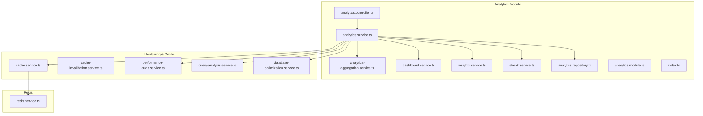
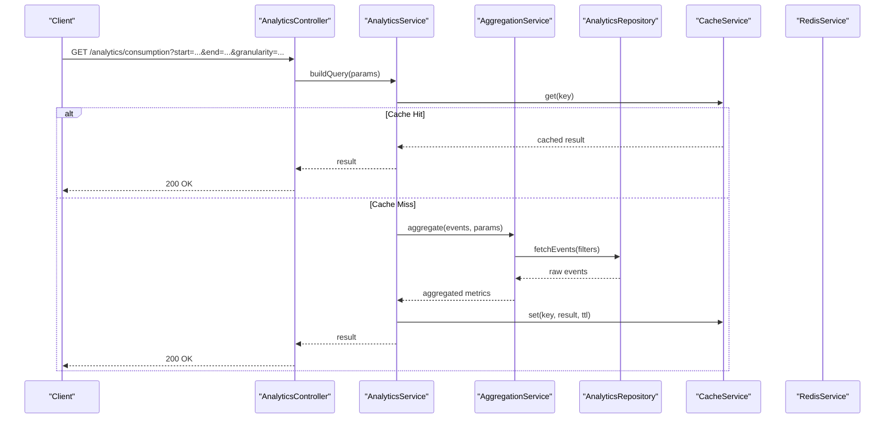
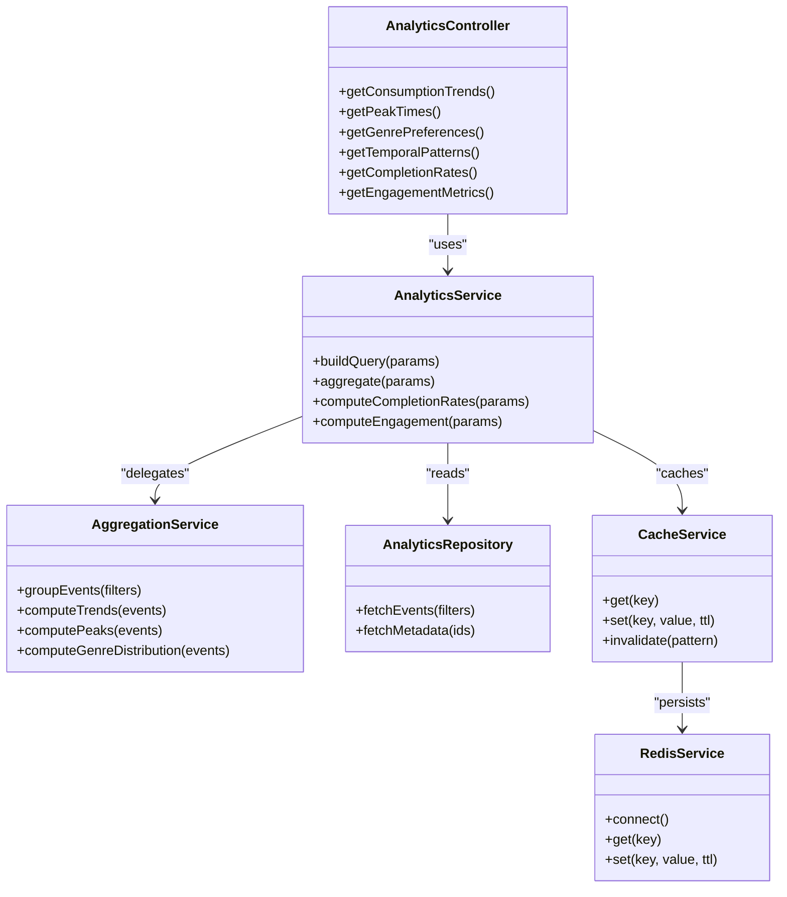

# Consumption Patterns API

<cite>
**Referenced Files in This Document**
- [analytics.controller.ts](file://apps/backend/src/analytics/analytics.controller.ts)
- [analytics.service.ts](file://apps/backend/src/analytics/analytics.service.ts)
- [analytics-aggregation.service.ts](file://apps/backend/src/analytics/analytics-aggregation.service.ts)
- [dashboard.service.ts](file://apps/backend/src/analytics/dashboard.service.ts)
- [insights.service.ts](file://apps/backend/src/analytics/insights.service.ts)
- [streak.service.ts](file://apps/backend/src/analytics/streak.service.ts)
- [analytics.repository.ts](file://apps/backend/src/analytics/analytics.repository.ts)
- [analytics.module.ts](file://apps/backend/src/analytics/analytics.module.ts)
- [index.ts](file://apps/backend/src/analytics/index.ts)
- [dto](file://apps/backend/src/analytics/dto)
- [cache.service.ts](file://apps/backend/src/hardening/cache.service.ts)
- [cache-invalidation.service.ts](file://apps/backend/src/hardening/cache-invalidation.service.ts)
- [redis.service.ts](file://apps/backend/src/redis/redis.service.ts)
- [performance-audit.service.ts](file://apps/backend/src/hardening/performance-audit.service.ts)
- [query-analysis.service.ts](file://apps/backend/src/hardening/query-analysis.service.ts)
- [database-optimization.service.ts](file://apps/backend/src/hardening/database-optimization.service.ts)
</cite>

## Table of Contents
1. [Introduction](#introduction)
2. [Project Structure](#project-structure)
3. [Core Components](#core-components)
4. [Architecture Overview](#architecture-overview)
5. [Detailed Component Analysis](#detailed-component-analysis)
6. [Dependency Analysis](#dependency-analysis)
7. [Performance Considerations](#performance-considerations)
8. [Troubleshooting Guide](#troubleshooting-guide)
9. [Conclusion](#conclusion)
10. [Appendices](#appendices)

## Introduction
This document provides detailed API documentation for consumption pattern analysis endpoints. It covers media consumption tracking, viewing habits analysis, genre preferences, and temporal patterns. It includes specifications for time-based queries, frequency analysis, completion rates, and engagement metrics. Examples of query parameters for date ranges, media types, and user segments are provided, along with response schemas for consumption trends, peak usage times, and preference distributions. Caching strategies for frequently accessed analytics data are also documented.

## Project Structure
The analytics feature is implemented under the backend application’s analytics module. Key files include controllers, services, repositories, DTOs, and supporting modules for aggregation, dashboard insights, streaks, and caching.

**Diagram sources**
- [analytics.controller.ts](file://apps/backend/src/analytics/analytics.controller.ts)
- [analytics.service.ts](file://apps/backend/src/analytics/analytics.service.ts)
- [analytics-aggregation.service.ts](file://apps/backend/src/analytics/analytics-aggregation.service.ts)
- [dashboard.service.ts](file://apps/backend/src/analytics/dashboard.service.ts)
- [insights.service.ts](file://apps/backend/src/analytics/insights.service.ts)
- [streak.service.ts](file://apps/backend/src/analytics/streak.service.ts)
- [analytics.repository.ts](file://apps/backend/src/analytics/analytics.repository.ts)
- [analytics.module.ts](file://apps/backend/src/analytics/analytics.module.ts)
- [index.ts](file://apps/backend/src/analytics/index.ts)
- [cache.service.ts](file://apps/backend/src/hardening/cache.service.ts)
- [cache-invalidation.service.ts](file://apps/backend/src/hardening/cache-invalidation.service.ts)
- [performance-audit.service.ts](file://apps/backend/src/hardening/performance-audit.service.ts)
- [query-analysis.service.ts](file://apps/backend/src/hardening/query-analysis.service.ts)
- [database-optimization.service.ts](file://apps/backend/src/hardening/database-optimization.service.ts)
- [redis.service.ts](file://apps/backend/src/redis/redis.service.ts)

**Section sources**
- [analytics.controller.ts](file://apps/backend/src/analytics/analytics.controller.ts)
- [analytics.service.ts](file://apps/backend/src/analytics/analytics.service.ts)
- [analytics-aggregation.service.ts](file://apps/backend/src/analytics/analytics-aggregation.service.ts)
- [dashboard.service.ts](file://apps/backend/src/analytics/dashboard.service.ts)
- [insights.service.ts](file://apps/backend/src/analytics/insights.service.ts)
- [streak.service.ts](file://apps/backend/src/analytics/streak.service.ts)
- [analytics.repository.ts](file://apps/backend/src/analytics/analytics.repository.ts)
- [analytics.module.ts](file://apps/backend/src/analytics/analytics.module.ts)
- [index.ts](file://apps/backend/src/analytics/index.ts)
- [cache.service.ts](file://apps/backend/src/hardening/cache.service.ts)
- [cache-invalidation.service.ts](file://apps/backend/src/hardening/cache-invalidation.service.ts)
- [performance-audit.service.ts](file://apps/backend/src/hardening/performance-audit.service.ts)
- [query-analysis.service.ts](file://apps/backend/src/hardening/query-analysis.service.ts)
- [database-optimization.service.ts](file://apps/backend/src/hardening/database-optimization.service.ts)
- [redis.service.ts](file://apps/backend/src/redis/redis.service.ts)

## Core Components
- Controller: Exposes HTTP endpoints for consumption analytics (time windows, media types, user segments).
- Service: Orchestrates analytics logic, composes aggregations, computes trends, completion rates, and engagement metrics.
- Aggregation Service: Performs grouped computations over events (e.g., by day, hour, genre).
- Repository: Data access layer for raw event and metadata retrieval.
- Dashboard/Insights/Streak Services: Specialized analytics for dashboards, insights, and streaks.
- Cache Layer: Redis-backed caching for frequent analytics queries with invalidation hooks.

Key responsibilities:
- Time-based queries: support start/end timestamps, granularity (day/hour), and timezone handling.
- Frequency analysis: counts per period, rolling averages, and peak detection.
- Completion rates: ratio of completed sessions to total sessions per media or category.
- Engagement metrics: session duration, rewatch rate, skip rate, and interaction density.

**Section sources**
- [analytics.controller.ts](file://apps/backend/src/analytics/analytics.controller.ts)
- [analytics.service.ts](file://apps/backend/src/analytics/analytics.service.ts)
- [analytics-aggregation.service.ts](file://apps/backend/src/analytics/analytics-aggregation.service.ts)
- [analytics.repository.ts](file://apps/backend/src/analytics/analytics.repository.ts)
- [dashboard.service.ts](file://apps/backend/src/analytics/dashboard.service.ts)
- [insights.service.ts](file://apps/backend/src/analytics/insights.service.ts)
- [streak.service.ts](file://apps/backend/src/analytics/streak.service.ts)

## Architecture Overview
The API follows a layered architecture: controller handles request validation and routing; service orchestrates business logic; repository abstracts data access; cache accelerates repeated queries; specialized services provide focused analytics.

**Diagram sources**
- [analytics.controller.ts](file://apps/backend/src/analytics/analytics.controller.ts)
- [analytics.service.ts](file://apps/backend/src/analytics/analytics.service.ts)
- [analytics-aggregation.service.ts](file://apps/backend/src/analytics/analytics-aggregation.service.ts)
- [analytics.repository.ts](file://apps/backend/src/analytics/analytics.repository.ts)
- [cache.service.ts](file://apps/backend/src/hardening/cache.service.ts)
- [redis.service.ts](file://apps/backend/src/redis/redis.service.ts)

## Detailed Component Analysis

### Consumption Trends Endpoint
Purpose: Retrieve consumption trends over a specified time window with optional filters for media type and user segment.

Request
- Method: GET
- Path: /analytics/consumption/trends
- Query Parameters:
  - start: ISO timestamp (required)
  - end: ISO timestamp (required)
  - granularity: day | hour | week (default: day)
  - mediaType: string[] (optional)
  - userId: string (optional)
  - segment: string (optional)
  - timezone: string (optional)
  - limit: number (optional)

Response Schema
- consumptionTrends: array of {
    - period: string (ISO date/time based on granularity)
    - count: number
    - durationMinutes: number
    - completionRate: number (0..1)
    - rewatchRate: number (0..1)
    - avgSessionDurationMinutes: number
  }
- summary: {
    - totalSessions: number
    - totalDurationMinutes: number
    - overallCompletionRate: number
    - overallRewatchRate: number
    - peakPeriod: string
  }

Example Response
- consumptionTrends: [
    { period: "2025-01-01", count: 12, durationMinutes: 360, completionRate: 0.75, rewatchRate: 0.12, avgSessionDurationMinutes: 30 },
    { period: "2025-01-02", count: 15, durationMinutes: 450, completionRate: 0.80, rewatchRate: 0.15, avgSessionDurationMinutes: 30 }
  ]
- summary: { totalSessions: 27, totalDurationMinutes: 810, overallCompletionRate: 0.78, overallRewatchRate: 0.14, peakPeriod: "2025-01-02" }

Caching Strategy
- Key: analytics:consumption:trends:{hash(start,end,granularity,mediaType,userId,segment,timezone)}
- TTL: configurable (e.g., 5–15 minutes)
- Invalidation: on write events affecting consumption (see cache invalidation service)

**Section sources**
- [analytics.controller.ts](file://apps/backend/src/analytics/analytics.controller.ts)
- [analytics.service.ts](file://apps/backend/src/analytics/analytics.service.ts)
- [analytics-aggregation.service.ts](file://apps/backend/src/analytics/analytics-aggregation.service.ts)
- [analytics.repository.ts](file://apps/backend/src/analytics/analytics.repository.ts)
- [cache.service.ts](file://apps/backend/src/hardening/cache.service.ts)
- [cache-invalidation.service.ts](file://apps/backend/src/hardening/cache-invalidation.service.ts)

### Peak Usage Times Endpoint
Purpose: Identify peak usage periods within a time window, optionally filtered by media type and user segment.

Request
- Method: GET
- Path: /analytics/consumption/peak-times
- Query Parameters:
  - start: ISO timestamp (required)
  - end: ISO timestamp (required)
  - granularity: hour | day (default: hour)
  - mediaType: string[] (optional)
  - userId: string (optional)
  - segment: string (optional)
  - timezone: string (optional)
  - topN: number (default: 5)

Response Schema
- peakTimes: array of {
    - period: string (based on granularity)
    - count: number
    - durationMinutes: number
    - activeUsers: number
  }
- distribution: object mapping period buckets to normalized values (0..1)

Example Response
- peakTimes: [
    { period: "2025-01-01T19:00", count: 45, durationMinutes: 1350, activeUsers: 30 },
    { period: "2025-01-01T20:00", count: 42, durationMinutes: 1260, activeUsers: 28 }
  ]
- distribution: { "18:00": 0.6, "19:00": 1.0, "20:00": 0.9, "21:00": 0.7 }

Caching Strategy
- Key: analytics:consumption:peak-times:{hash(start,end,granularity,mediaType,userId,segment,timezone,topN)}
- TTL: configurable (e.g., 5–10 minutes)

**Section sources**
- [analytics.controller.ts](file://apps/backend/src/analytics/analytics.controller.ts)
- [analytics.service.ts](file://apps/backend/src/analytics/analytics.service.ts)
- [analytics-aggregation.service.ts](file://apps/backend/src/analytics/analytics-aggregation.service.ts)
- [analytics.repository.ts](file://apps/backend/src/analytics/analytics.repository.ts)
- [cache.service.ts](file://apps/backend/src/hardening/cache.service.ts)

### Genre Preferences Endpoint
Purpose: Analyze genre preferences across a time window with optional filters.

Request
- Method: GET
- Path: /analytics/consumption/genre-preferences
- Query Parameters:
  - start: ISO timestamp (required)
  - end: ISO timestamp (required)
  - mediaType: string[] (optional)
  - userId: string (optional)
  - segment: string (optional)
  - topN: number (default: 10)

Response Schema
- preferences: array of {
    - genre: string
    - count: number
    - durationMinutes: number
    - completionRate: number (0..1)
    - share: number (0..1)
  }
- summary: {
    - totalGenres: number
    - dominantGenre: string
    - diversityIndex: number
  }

Example Response
- preferences: [
    { genre: "Sci-Fi", count: 20, durationMinutes: 600, completionRate: 0.85, share: 0.35 },
    { genre: "Drama", count: 15, durationMinutes: 450, completionRate: 0.78, share: 0.25 }
  ]
- summary: { totalGenres: 8, dominantGenre: "Sci-Fi", diversityIndex: 0.62 }

Caching Strategy
- Key: analytics:consumption:genre-preferences:{hash(start,end,mediaType,userId,segment,topN)}
- TTL: configurable (e.g., 10–20 minutes)

**Section sources**
- [analytics.controller.ts](file://apps/backend/src/analytics/analytics.controller.ts)
- [analytics.service.ts](file://apps/backend/src/analytics/analytics.service.ts)
- [analytics-aggregation.service.ts](file://apps/backend/src/analytics/analytics-aggregation.service.ts)
- [analytics.repository.ts](file://apps/backend/src/analytics/analytics.repository.ts)
- [cache.service.ts](file://apps/backend/src/hardening/cache.service.ts)

### Temporal Patterns Endpoint
Purpose: Detect temporal patterns such as weekly cycles and daily rhythms.

Request
- Method: GET
- Path: /analytics/consumption/temporal-patterns
- Query Parameters:
  - start: ISO timestamp (required)
  - end: ISO timestamp (required)
  - granularity: day | hour (default: day)
  - mediaType: string[] (optional)
  - userId: string (optional)
  - segment: string (optional)

Response Schema
- patterns: array of {
    - period: string
    - count: number
    - durationMinutes: number
    - weekday: string (if applicable)
    - hour: number (if applicable)
  }
- insights: {
    - peakDayOfWeek: string
    - peakHourOfDay: number
    - weeklyTrend: string ("increasing" | "stable" | "decreasing")
  }

Example Response
- patterns: [
    { period: "2025-01-01", count: 12, durationMinutes: 360, weekday: "Wednesday", hour: null },
    { period: "2025-01-02", count: 15, durationMinutes: 450, weekday: "Thursday", hour: null }
  ]
- insights: { peakDayOfWeek: "Wednesday", peakHourOfDay: 20, weeklyTrend: "stable" }

Caching Strategy
- Key: analytics:consumption:temporal-patterns:{hash(start,end,granularity,mediaType,userId,segment)}
- TTL: configurable (e.g., 10–15 minutes)

**Section sources**
- [analytics.controller.ts](file://apps/backend/src/analytics/analytics.controller.ts)
- [analytics.service.ts](file://apps/backend/src/analytics/analytics.service.ts)
- [analytics-aggregation.service.ts](file://apps/backend/src/analytics/analytics-aggregation.service.ts)
- [analytics.repository.ts](file://apps/backend/src/analytics/analytics.repository.ts)
- [cache.service.ts](file://apps/backend/src/hardening/cache.service.ts)

### Completion Rates Endpoint
Purpose: Compute completion rates per media or category over a time window.

Request
- Method: GET
- Path: /analytics/consumption/completion-rates
- Query Parameters:
  - start: ISO timestamp (required)
  - end: ISO timestamp (required)
  - mediaType: string[] (optional)
  - userId: string (optional)
  - segment: string (optional)
  - groupBy: media | category (default: media)

Response Schema
- completionRates: array of {
    - id: string
    - name: string
    - totalSessions: number
    - completedSessions: number
    - completionRate: number (0..1)
  }
- summary: {
    - averageCompletionRate: number
    - medianCompletionRate: number
    - topCompletingMedia: string
  }

Example Response
- completionRates: [
    { id: "m1", name: "Movie A", totalSessions: 10, completedSessions: 8, completionRate: 0.8 },
    { id: "m2", name: "Series B", totalSessions: 12, completedSessions: 9, completionRate: 0.75 }
  ]
- summary: { averageCompletionRate: 0.775, medianCompletionRate: 0.775, topCompletingMedia: "Movie A" }

Caching Strategy
- Key: analytics:consumption:completion-rates:{hash(start,end,mediaType,userId,segment,groupBy)}
- TTL: configurable (e.g., 10–20 minutes)

**Section sources**
- [analytics.controller.ts](file://apps/backend/src/analytics/analytics.controller.ts)
- [analytics.service.ts](file://apps/backend/src/analytics/analytics.service.ts)
- [analytics-aggregation.service.ts](file://apps/backend/src/analytics/analytics-aggregation.service.ts)
- [analytics.repository.ts](file://apps/backend/src/analytics/analytics.repository.ts)
- [cache.service.ts](file://apps/backend/src/hardening/cache.service.ts)

### Engagement Metrics Endpoint
Purpose: Measure engagement through session duration, rewatch rate, and interaction density.

Request
- Method: GET
- Path: /analytics/consumption/engagement
- Query Parameters:
  - start: ISO timestamp (required)
  - end: ISO timestamp (required)
  - mediaType: string[] (optional)
  - userId: string (optional)
  - segment: string (optional)

Response Schema
- metrics: {
    - totalSessions: number
    - totalDurationMinutes: number
    - avgSessionDurationMinutes: number
    - rewatchRate: number (0..1)
    - interactionDensity: number (events per minute)
  }
- breakdown: array of {
    - period: string
    - sessions: number
    - durationMinutes: number
    - rewatchRate: number
    - interactionDensity: number
  }

Example Response
- metrics: { totalSessions: 50, totalDurationMinutes: 1500, avgSessionDurationMinutes: 30, rewatchRate: 0.15, interactionDensity: 0.8 }
- breakdown: [
    { period: "2025-01-01", sessions: 20, durationMinutes: 600, rewatchRate: 0.12, interactionDensity: 0.75 },
    { period: "2025-01-02", sessions: 30, durationMinutes: 900, rewatchRate: 0.18, interactionDensity: 0.85 }
  ]

Caching Strategy
- Key: analytics:consumption:engagement:{hash(start,end,mediaType,userId,segment)}
- TTL: configurable (e.g., 5–10 minutes)

**Section sources**
- [analytics.controller.ts](file://apps/backend/src/analytics/analytics.controller.ts)
- [analytics.service.ts](file://apps/backend/src/analytics/analytics.service.ts)
- [analytics-aggregation.service.ts](file://apps/backend/src/analytics/analytics-aggregation.service.ts)
- [analytics.repository.ts](file://apps/backend/src/analytics/analytics.repository.ts)
- [cache.service.ts](file://apps/backend/src/hardening/cache.service.ts)

## Dependency Analysis
The analytics module depends on core hardening services for performance and caching, and on Redis for distributed caching. The repository abstracts database interactions, while aggregation services compute metrics efficiently.

**Diagram sources**
- [analytics.controller.ts](file://apps/backend/src/analytics/analytics.controller.ts)
- [analytics.service.ts](file://apps/backend/src/analytics/analytics.service.ts)
- [analytics-aggregation.service.ts](file://apps/backend/src/analytics/analytics-aggregation.service.ts)
- [analytics.repository.ts](file://apps/backend/src/analytics/analytics.repository.ts)
- [cache.service.ts](file://apps/backend/src/hardening/cache.service.ts)
- [redis.service.ts](file://apps/backend/src/redis/redis.service.ts)

**Section sources**
- [analytics.controller.ts](file://apps/backend/src/analytics/analytics.controller.ts)
- [analytics.service.ts](file://apps/backend/src/analytics/analytics.service.ts)
- [analytics-aggregation.service.ts](file://apps/backend/src/analytics/analytics-aggregation.service.ts)
- [analytics.repository.ts](file://apps/backend/src/analytics/analytics.repository.ts)
- [cache.service.ts](file://apps/backend/src/hardening/cache.service.ts)
- [redis.service.ts](file://apps/backend/src/redis/redis.service.ts)

## Performance Considerations
- Use granular caching with appropriate TTLs to reduce database load for frequent queries.
- Implement pagination and limits for large datasets to avoid memory pressure.
- Optimize queries using indexes on timestamp and media type fields.
- Monitor performance with audit services and adjust TTLs based on traffic patterns.

[No sources needed since this section provides general guidance]

## Troubleshooting Guide
Common issues and resolutions:
- Cache misses causing latency: verify TTL settings and key generation consistency.
- Slow queries: use query analysis and database optimization services to identify bottlenecks.
- Incorrect timezone handling: ensure timezone parameter is correctly applied in aggregation.
- Stale data: trigger cache invalidation on relevant write operations.

**Section sources**
- [cache.service.ts](file://apps/backend/src/hardening/cache.service.ts)
- [cache-invalidation.service.ts](file://apps/backend/src/hardening/cache-invalidation.service.ts)
- [performance-audit.service.ts](file://apps/backend/src/hardening/performance-audit.service.ts)
- [query-analysis.service.ts](file://apps/backend/src/hardening/query-analysis.service.ts)
- [database-optimization.service.ts](file://apps/backend/src/hardening/database-optimization.service.ts)

## Conclusion
The Consumption Patterns API provides comprehensive analytics for media consumption, including trends, peak times, genre preferences, temporal patterns, completion rates, and engagement metrics. With robust caching and performance optimizations, it delivers efficient and scalable analytics capabilities for diverse user segments and media types.

[No sources needed since this section summarizes without analyzing specific files]

## Appendices

### Query Parameter Reference
- start: ISO timestamp marking the beginning of the analysis window.
- end: ISO timestamp marking the end of the analysis window.
- granularity: day | hour | week controlling time bucketing.
- mediaType: array of media types to filter results.
- userId: single user identifier for personalized analytics.
- segment: user segment label for cohort analysis.
- timezone: IANA timezone string for accurate period alignment.
- limit/topN: maximum number of results returned.

**Section sources**
- [analytics.controller.ts](file://apps/backend/src/analytics/analytics.controller.ts)
- [analytics.service.ts](file://apps/backend/src/analytics/analytics.service.ts)

### Caching Strategies Summary
- Key generation: hash of all query parameters for uniqueness.
- TTL configuration: adjustable per endpoint based on volatility.
- Invalidation: triggered on write operations affecting consumption data.
- Fallback: direct database queries when cache is unavailable.

**Section sources**
- [cache.service.ts](file://apps/backend/src/hardening/cache.service.ts)
- [cache-invalidation.service.ts](file://apps/backend/src/hardening/cache-invalidation.service.ts)
- [redis.service.ts](file://apps/backend/src/redis/redis.service.ts)