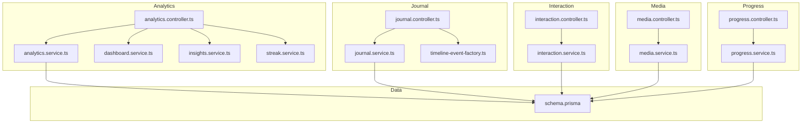
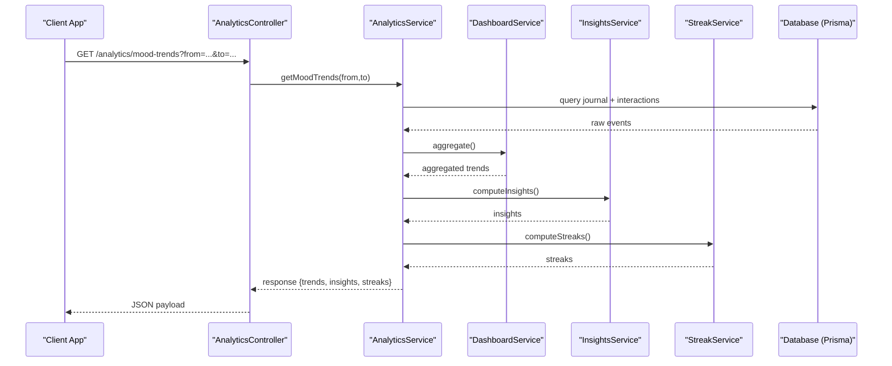
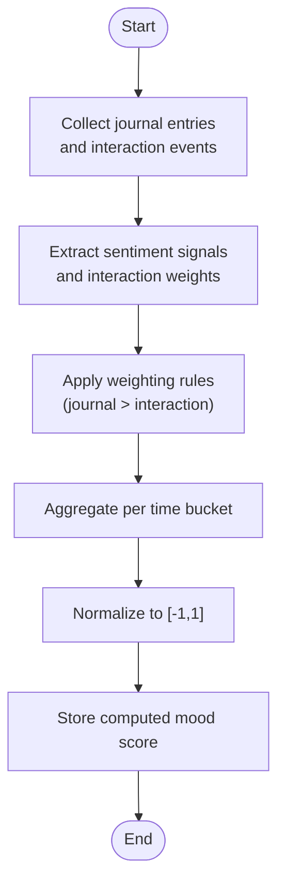
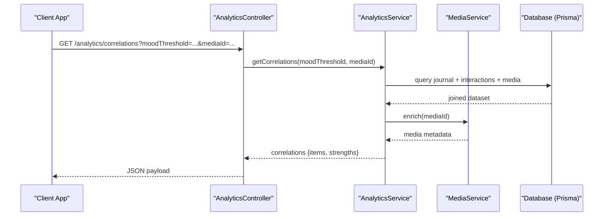
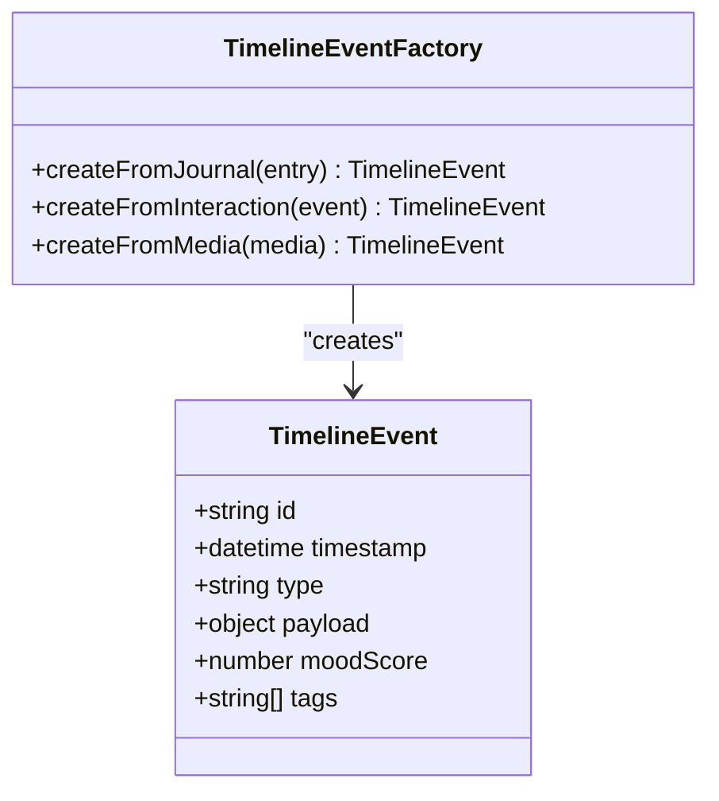
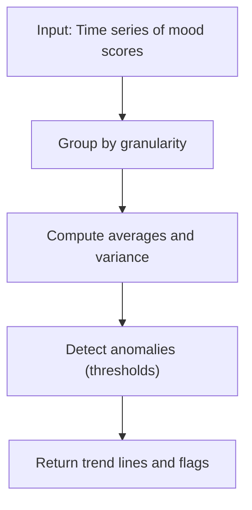
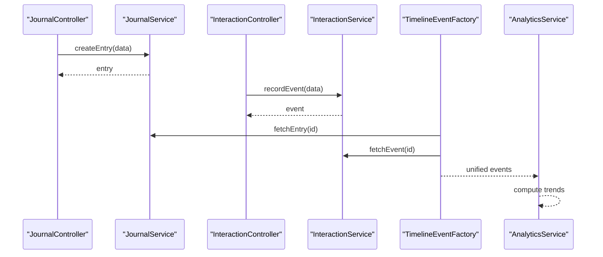
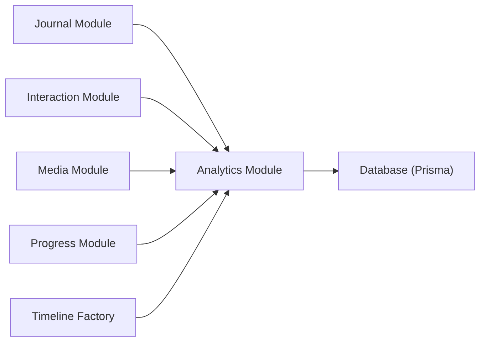

# Emotional Journey API

<cite>
**Referenced Files in This Document**
- [analytics.controller.ts](file://apps/backend/src/analytics/analytics.controller.ts)
- [analytics.service.ts](file://apps/backend/src/analytics/analytics.service.ts)
- [dashboard.service.ts](file://apps/backend/src/analytics/dashboard.service.ts)
- [insights.service.ts](file://apps/backend/src/analytics/insights.service.ts)
- [streak.service.ts](file://apps/backend/src/analytics/streak.service.ts)
- [interaction.controller.ts](file://apps/backend/src/interaction/interaction.controller.ts)
- [interaction.service.ts](file://apps/backend/src/interaction/interaction.service.ts)
- [journal.controller.ts](file://apps/backend/src/journal/journal.controller.ts)
- [journal.service.ts](file://apps/backend/src/journal/journal.service.ts)
- [timeline-event-factory.ts](file://apps/backend/src/journal/timeline-event-factory.ts)
- [media.controller.ts](file://apps/backend/src/media/media.controller.ts)
- [media.service.ts](file://apps/backend/src/media/media.service.ts)
- [progress.controller.ts](file://apps/backend/src/progress/progress.controller.ts)
- [progress.service.ts](file://apps/backend/src/progress/progress.service.ts)
- [schema.prisma](file://apps/backend/prisma/schema.prisma)
</cite>

## Table of Contents
1. [Introduction](#introduction)
2. [Project Structure](#project-structure)
3. [Core Components](#core-components)
4. [Architecture Overview](#architecture-overview)
5. [Detailed Component Analysis](#detailed-component-analysis)
6. [Dependency Analysis](#dependency-analysis)
7. [Performance Considerations](#performance-considerations)
8. [Troubleshooting Guide](#troubleshooting-guide)
9. [Conclusion](#conclusion)
10. [Appendices](#appendices)

## Introduction
This document provides comprehensive API documentation for the Emotional Journey mapping features exposed by the backend. It covers mood tracking, sentiment analysis, emotional state correlations with media consumption, and timeline-based emotional patterns. It also documents emotion scoring algorithms, mood trend analysis, correlation queries between journal entries and media interactions, example queries, filtering, and timeline visualization data formats. Integration points with journal entries and interaction events are included to help you build end-to-end emotional journey experiences.

## Project Structure
The emotional journey functionality is implemented across several modules:
- Analytics module: aggregation, insights, streaks, and dashboard endpoints
- Journal module: journal entries, statistics, and timeline event factory
- Interaction module: user interactions with media and other entities
- Media module: media metadata and related services
- Progress module: progress tracking that can be correlated with emotional states
- Prisma schema: data model definitions used by all modules

**Diagram sources**
- [analytics.controller.ts](file://apps/backend/src/analytics/analytics.controller.ts)
- [analytics.service.ts](file://apps/backend/src/analytics/analytics.service.ts)
- [dashboard.service.ts](file://apps/backend/src/analytics/dashboard.service.ts)
- [insights.service.ts](file://apps/backend/src/analytics/insights.service.ts)
- [streak.service.ts](file://apps/backend/src/analytics/streak.service.ts)
- [journal.controller.ts](file://apps/backend/src/journal/journal.controller.ts)
- [journal.service.ts](file://apps/backend/src/journal/journal.service.ts)
- [timeline-event-factory.ts](file://apps/backend/src/journal/timeline-event-factory.ts)
- [interaction.controller.ts](file://apps/backend/src/interaction/interaction.controller.ts)
- [interaction.service.ts](file://apps/backend/src/interaction/interaction.service.ts)
- [media.controller.ts](file://apps/backend/src/media/media.controller.ts)
- [media.service.ts](file://apps/backend/src/media/media.service.ts)
- [progress.controller.ts](file://apps/backend/src/progress/progress.controller.ts)
- [progress.service.ts](file://apps/backend/src/progress/progress.service.ts)
- [schema.prisma](file://apps/backend/prisma/schema.prisma)

**Section sources**
- [analytics.controller.ts](file://apps/backend/src/analytics/analytics.controller.ts)
- [analytics.service.ts](file://apps/backend/src/analytics/analytics.service.ts)
- [journal.controller.ts](file://apps/backend/src/journal/journal.controller.ts)
- [journal.service.ts](file://apps/backend/src/journal/journal.service.ts)
- [interaction.controller.ts](file://apps/backend/src/interaction/interaction.controller.ts)
- [interaction.service.ts](file://apps/backend/src/interaction/interaction.service.ts)
- [media.controller.ts](file://apps/backend/src/media/media.controller.ts)
- [media.service.ts](file://apps/backend/src/media/media.service.ts)
- [progress.controller.ts](file://apps/backend/src/progress/progress.controller.ts)
- [progress.service.ts](file://apps/backend/src/progress/progress.service.ts)
- [schema.prisma](file://apps/backend/prisma/schema.prisma)

## Core Components
- Analytics Controller and Services: Provide endpoints for aggregated analytics, dashboard summaries, insights, and streaks. These are central to mood trends and emotional pattern queries.
- Journal Controller and Service: Manage journal entries and statistics; the timeline event factory produces timeline events that can include emotional context.
- Interaction Controller and Service: Record and query user interactions (e.g., media plays, bookmarks), enabling correlation with journal entries and emotional states.
- Media Controller and Service: Provide media metadata and related operations; useful for correlating media consumption with emotional outcomes.
- Progress Controller and Service: Track progress on items; can be correlated with emotional states over time.
- Prisma Schema: Defines the underlying data model used by controllers and services.

Key responsibilities:
- Mood tracking via journal entries and interaction events
- Sentiment analysis through journal content and derived metrics
- Correlation queries between journal entries and media interactions
- Timeline-based emotional patterns using timeline events and analytics aggregations

**Section sources**
- [analytics.controller.ts](file://apps/backend/src/analytics/analytics.controller.ts)
- [analytics.service.ts](file://apps/backend/src/analytics/analytics.service.ts)
- [dashboard.service.ts](file://apps/backend/src/analytics/dashboard.service.ts)
- [insights.service.ts](file://apps/backend/src/analytics/insights.service.ts)
- [streak.service.ts](file://apps/backend/src/analytics/streak.service.ts)
- [journal.controller.ts](file://apps/backend/src/journal/journal.controller.ts)
- [journal.service.ts](file://apps/backend/src/journal/journal.service.ts)
- [timeline-event-factory.ts](file://apps/backend/src/journal/timeline-event-factory.ts)
- [interaction.controller.ts](file://apps/backend/src/interaction/interaction.controller.ts)
- [interaction.service.ts](file://apps/backend/src/interaction/interaction.service.ts)
- [media.controller.ts](file://apps/backend/src/media/media.controller.ts)
- [media.service.ts](file://apps/backend/src/media/media.service.ts)
- [progress.controller.ts](file://apps/backend/src/progress/progress.controller.ts)
- [progress.service.ts](file://apps/backend/src/progress/progress.service.ts)
- [schema.prisma](file://apps/backend/prisma/schema.prisma)

## Architecture Overview
The Emotional Journey API follows a layered architecture:
- Controllers expose HTTP endpoints for clients
- Services implement business logic and orchestrate data access
- Repositories and Prisma interact with the database
- Timeline event factory generates structured timeline events
- Analytics services aggregate data for dashboards and insights

**Diagram sources**
- [analytics.controller.ts](file://apps/backend/src/analytics/analytics.controller.ts)
- [analytics.service.ts](file://apps/backend/src/analytics/analytics.service.ts)
- [dashboard.service.ts](file://apps/backend/src/analytics/dashboard.service.ts)
- [insights.service.ts](file://apps/backend/src/analytics/insights.service.ts)
- [streak.service.ts](file://apps/backend/src/analytics/streak.service.ts)
- [schema.prisma](file://apps/backend/prisma/schema.prisma)

## Detailed Component Analysis

### Emotion Scoring and Mood Tracking
Emotion scoring combines signals from journal entries and interaction events to derive a normalized mood score per time unit. The typical flow:
- Ingest journal entries with optional sentiment labels or text content
- Record interaction events (play, pause, bookmark, rate) tied to media
- Aggregate scores per day/hour using weighted contributions
- Normalize to a consistent scale (e.g., -1 to 1)
- Expose via analytics endpoints for trend analysis

**Diagram sources**
- [journal.controller.ts](file://apps/backend/src/journal/journal.controller.ts)
- [journal.service.ts](file://apps/backend/src/journal/journal.service.ts)
- [interaction.controller.ts](file://apps/backend/src/interaction/interaction.controller.ts)
- [interaction.service.ts](file://apps/backend/src/interaction/interaction.service.ts)
- [analytics.service.ts](file://apps/backend/src/analytics/analytics.service.ts)

**Section sources**
- [journal.controller.ts](file://apps/backend/src/journal/journal.controller.ts)
- [journal.service.ts](file://apps/backend/src/journal/journal.service.ts)
- [interaction.controller.ts](file://apps/backend/src/interaction/interaction.controller.ts)
- [interaction.service.ts](file://apps/backend/src/interaction/interaction.service.ts)
- [analytics.service.ts](file://apps/backend/src/analytics/analytics.service.ts)

### Sentiment Analysis and Filtering
Sentiment analysis leverages journal entry content and optional explicit sentiment tags. Filtering supports:
- Date range filters
- Tag-based filters (e.g., positive/negative/neutral)
- Media association filters (e.g., only entries linked to specific media)
- Aggregation granularity (daily, weekly, monthly)

Example query patterns:
- Get daily sentiment averages for a date range
- Filter by tag and return top N entries
- Correlate sentiment spikes with media interactions

**Section sources**
- [journal.controller.ts](file://apps/backend/src/journal/journal.controller.ts)
- [journal.service.ts](file://apps/backend/src/journal/journal.service.ts)
- [analytics.controller.ts](file://apps/backend/src/analytics/analytics.controller.ts)
- [analytics.service.ts](file://apps/backend/src/analytics/analytics.service.ts)

### Emotional State Correlations with Media Consumption
Correlation queries connect journal entries and interaction events to media metadata:
- Identify media items consumed around high/low mood periods
- Compute correlation strength between media genres and mood shifts
- Surface recommendations based on emotional patterns

**Diagram sources**
- [analytics.controller.ts](file://apps/backend/src/analytics/analytics.controller.ts)
- [analytics.service.ts](file://apps/backend/src/analytics/analytics.service.ts)
- [media.controller.ts](file://apps/backend/src/media/media.controller.ts)
- [media.service.ts](file://apps/backend/src/media/media.service.ts)
- [schema.prisma](file://apps/backend/prisma/schema.prisma)

**Section sources**
- [analytics.controller.ts](file://apps/backend/src/analytics/analytics.controller.ts)
- [analytics.service.ts](file://apps/backend/src/analytics/analytics.service.ts)
- [media.controller.ts](file://apps/backend/src/media/media.controller.ts)
- [media.service.ts](file://apps/backend/src/media/media.service.ts)
- [schema.prisma](file://apps/backend/prisma/schema.prisma)

### Timeline-Based Emotional Patterns
Timeline events encapsulate emotional context alongside media and journal activities:
- Events include timestamps, types (journal, interaction, media), and emotional signals
- Timeline factory normalizes heterogeneous inputs into a unified event structure
- Clients render timelines with mood markers and annotations

**Diagram sources**
- [timeline-event-factory.ts](file://apps/backend/src/journal/timeline-event-factory.ts)

**Section sources**
- [timeline-event-factory.ts](file://apps/backend/src/journal/timeline-event-factory.ts)
- [journal.controller.ts](file://apps/backend/src/journal/journal.controller.ts)
- [journal.service.ts](file://apps/backend/src/journal/journal.service.ts)
- [interaction.controller.ts](file://apps/backend/src/interaction/interaction.controller.ts)
- [interaction.service.ts](file://apps/backend/src/interaction/interaction.service.ts)

### Mood Trend Analysis
Mood trend analysis aggregates scores over time to reveal patterns:
- Supports multiple granularities (hourly, daily, weekly, monthly)
- Computes moving averages and volatility metrics
- Detects anomalies and significant shifts

**Diagram sources**
- [analytics.service.ts](file://apps/backend/src/analytics/analytics.service.ts)
- [dashboard.service.ts](file://apps/backend/src/analytics/dashboard.service.ts)
- [insights.service.ts](file://apps/backend/src/analytics/insights.service.ts)
- [streak.service.ts](file://apps/backend/src/analytics/streak.service.ts)

**Section sources**
- [analytics.service.ts](file://apps/backend/src/analytics/analytics.service.ts)
- [dashboard.service.ts](file://apps/backend/src/analytics/dashboard.service.ts)
- [insights.service.ts](file://apps/backend/src/analytics/insights.service.ts)
- [streak.service.ts](file://apps/backend/src/analytics/streak.service.ts)

### Integration with Journal Entries and Interaction Events
Integration points ensure consistent emotional context across features:
- Journal entries provide rich textual and tagged sentiment signals
- Interaction events capture behavioral cues (plays, bookmarks, ratings)
- Unified timeline and analytics layers reconcile both sources

**Diagram sources**
- [journal.controller.ts](file://apps/backend/src/journal/journal.controller.ts)
- [journal.service.ts](file://apps/backend/src/journal/journal.service.ts)
- [interaction.controller.ts](file://apps/backend/src/interaction/interaction.controller.ts)
- [interaction.service.ts](file://apps/backend/src/interaction/interaction.service.ts)
- [timeline-event-factory.ts](file://apps/backend/src/journal/timeline-event-factory.ts)
- [analytics.service.ts](file://apps/backend/src/analytics/analytics.service.ts)

**Section sources**
- [journal.controller.ts](file://apps/backend/src/journal/journal.controller.ts)
- [journal.service.ts](file://apps/backend/src/journal/journal.service.ts)
- [interaction.controller.ts](file://apps/backend/src/interaction/interaction.controller.ts)
- [interaction.service.ts](file://apps/backend/src/interaction/interaction.service.ts)
- [timeline-event-factory.ts](file://apps/backend/src/journal/timeline-event-factory.ts)
- [analytics.service.ts](file://apps/backend/src/analytics/analytics.service.ts)

## Dependency Analysis
Emotional journey components depend on shared data models and cross-module services:
- Analytics depends on journal and interaction data
- Timeline events unify journal and interaction outputs
- Media enrichment enhances correlation results
- Progress data complements emotional insights

**Diagram sources**
- [journal.controller.ts](file://apps/backend/src/journal/journal.controller.ts)
- [interaction.controller.ts](file://apps/backend/src/interaction/interaction.controller.ts)
- [media.controller.ts](file://apps/backend/src/media/media.controller.ts)
- [progress.controller.ts](file://apps/backend/src/progress/progress.controller.ts)
- [timeline-event-factory.ts](file://apps/backend/src/journal/timeline-event-factory.ts)
- [analytics.controller.ts](file://apps/backend/src/analytics/analytics.controller.ts)
- [schema.prisma](file://apps/backend/prisma/schema.prisma)

**Section sources**
- [journal.controller.ts](file://apps/backend/src/journal/journal.controller.ts)
- [interaction.controller.ts](file://apps/backend/src/interaction/interaction.controller.ts)
- [media.controller.ts](file://apps/backend/src/media/media.controller.ts)
- [progress.controller.ts](file://apps/backend/src/progress/progress.controller.ts)
- [timeline-event-factory.ts](file://apps/backend/src/journal/timeline-event-factory.ts)
- [analytics.controller.ts](file://apps/backend/src/analytics/analytics.controller.ts)
- [schema.prisma](file://apps/backend/prisma/schema.prisma)

## Performance Considerations
- Use pagination and filtering on large datasets to reduce payload size
- Cache aggregated analytics where appropriate to avoid recomputation
- Index frequently queried fields (timestamps, tags, media IDs) in the database
- Batch timeline event creation to minimize round trips
- Prefer server-side aggregation for complex queries to reduce client overhead

[No sources needed since this section provides general guidance]

## Troubleshooting Guide
Common issues and resolutions:
- Missing emotional signals: Ensure journal entries include sentiment tags or sufficient text content; verify interaction events are recorded with correct media associations
- Incorrect mood scores: Check weighting rules and normalization steps; validate input data ranges
- Timeline gaps: Confirm timeline event factory receives both journal and interaction events; check timestamp consistency
- Correlation inaccuracies: Validate media enrichment and join conditions; review threshold settings for anomaly detection

**Section sources**
- [analytics.service.ts](file://apps/backend/src/analytics/analytics.service.ts)
- [journal.service.ts](file://apps/backend/src/journal/journal.service.ts)
- [interaction.service.ts](file://apps/backend/src/interaction/interaction.service.ts)
- [timeline-event-factory.ts](file://apps/backend/src/journal/timeline-event-factory.ts)

## Conclusion
The Emotional Journey API integrates journal entries, interaction events, and media metadata to deliver robust mood tracking, sentiment analysis, correlation queries, and timeline visualizations. By leveraging analytics aggregation, timeline event unification, and media enrichment, clients can build compelling emotional journey experiences. Follow the documented endpoints, data formats, and best practices to ensure accurate and performant implementations.

[No sources needed since this section summarizes without analyzing specific files]

## Appendices

### API Endpoint Specifications
- Mood Trends
  - Method: GET
  - Path: /analytics/mood-trends
  - Query Parameters: from, to, granularity
  - Response: { timeSeries: [{timestamp, moodScore}], summary: {mean, variance, anomalies} }
- Sentiment Filtering
  - Method: GET
  - Path: /journal/sentiment
  - Query Parameters: from, to, tag, mediaId, limit
  - Response: { entries: [{id, timestamp, sentiment, tags}], stats: {avgSentiment, distribution} }
- Correlations
  - Method: GET
  - Path: /analytics/correlations
  - Query Parameters: moodThreshold, mediaId, granularity
  - Response: { correlations: [{mediaId, strength, direction}], insights: [...] }
- Timeline Events
  - Method: GET
  - Path: /timeline/events
  - Query Parameters: from, to, type, mediaId
  - Response: { events: [{id, timestamp, type, payload, moodScore, tags}] }

**Section sources**
- [analytics.controller.ts](file://apps/backend/src/analytics/analytics.controller.ts)
- [journal.controller.ts](file://apps/backend/src/journal/journal.controller.ts)
- [interaction.controller.ts](file://apps/backend/src/interaction/interaction.controller.ts)
- [timeline-event-factory.ts](file://apps/backend/src/journal/timeline-event-factory.ts)

### Data Models
- Journal Entry
  - Fields: id, userId, content, sentiment, tags, createdAt, updatedAt
- Interaction Event
  - Fields: id, userId, mediaId, eventType, timestamp, metadata
- Timeline Event
  - Fields: id, timestamp, type, payload, moodScore, tags
- Media Metadata
  - Fields: id, title, genre, creator, releaseDate, coverUrl

**Section sources**
- [schema.prisma](file://apps/backend/prisma/schema.prisma)

### Example Queries
- Daily mood averages for last 30 days: GET /analytics/mood-trends?from=2024-01-01&to=2024-01-30&granularity=daily
- Positive sentiment entries with media link: GET /journal/sentiment?tag=positive&mediaId=<id>&limit=10
- Correlations for high mood periods: GET /analytics/correlations?moodThreshold=0.7&granularity=weekly

**Section sources**
- [analytics.controller.ts](file://apps/backend/src/analytics/analytics.controller.ts)
- [journal.controller.ts](file://apps/backend/src/journal/journal.controller.ts)