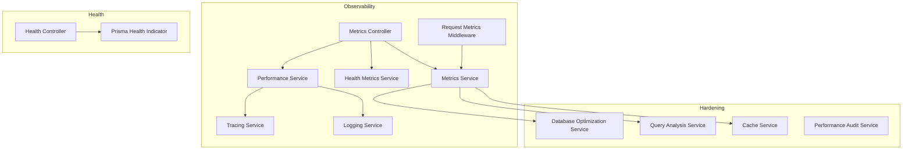
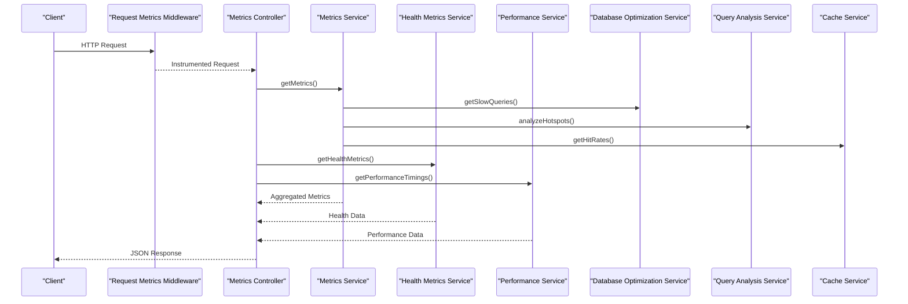
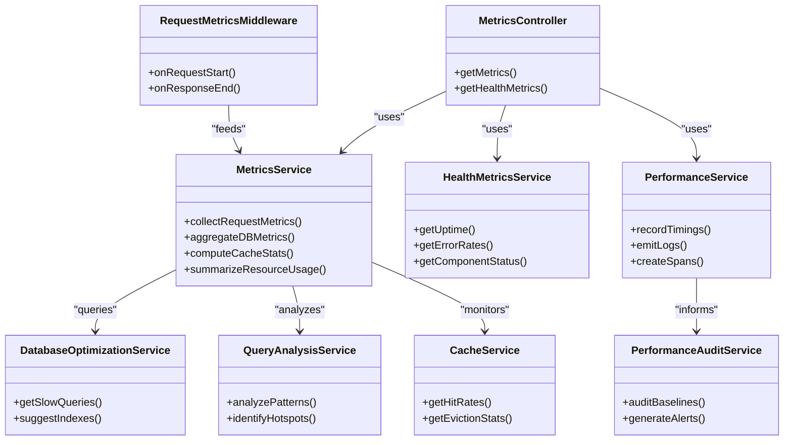

# Performance Metrics API

<cite>
**Referenced Files in This Document**
- [metrics.controller.ts](file://apps/backend/src/observability/metrics.controller.ts)
- [metrics.service.ts](file://apps/backend/src/observability/metrics.service.ts)
- [health-metrics.service.ts](file://apps/backend/src/observability/health-metrics.service.ts)
- [performance.service.ts](file://apps/backend/src/observability/performance.service.ts)
- [request-metrics.middleware.ts](file://apps/backend/src/observability/request-metrics.middleware.ts)
- [tracing.service.ts](file://apps/backend/src/observability/tracing.service.ts)
- [logging.service.ts](file://apps/backend/src/observability/logging.service.ts)
- [observability.module.ts](file://apps/backend/src/observability/observability.module.ts)
- [health.controller.ts](file://apps/backend/src/health/health.controller.ts)
- [prisma-health.indicator.ts](file://apps/backend/src/health/prisma-health.indicator.ts)
- [database-optimization.service.ts](file://apps/backend/src/hardening/database-optimization.service.ts)
- [query-analysis.service.ts](file://apps/backend/src/hardening/query-analysis.service.ts)
- [cache.service.ts](file://apps/backend/src/hardening/cache.service.ts)
- [performance-audit.service.ts](file://apps/backend/src/hardening/performance-audit.service.ts)
- [configuration.ts](file://apps/backend/src/config/configuration.ts)
- [env.validation.ts](file://apps/backend/src/config/env.validation.ts)
</cite>

## Table of Contents
1. [Introduction](#introduction)
2. [Project Structure](#project-structure)
3. [Core Components](#core-components)
4. [Architecture Overview](#architecture-overview)
5. [Detailed Component Analysis](#detailed-component-analysis)
6. [Dependency Analysis](#dependency-analysis)
7. [Performance Considerations](#performance-considerations)
8. [Troubleshooting Guide](#troubleshooting-guide)
9. [Conclusion](#conclusion)
10. [Appendices](#appendices)

## Introduction
This document provides comprehensive API documentation for performance metrics and system health endpoints. It covers application performance monitoring, database query metrics, cache hit rates, and resource utilization tracking. It also specifies metric collection intervals, aggregation methods, alerting thresholds, example dashboard queries, bottleneck identification techniques, optimization recommendations, and integration with observability tools and custom metric definitions.

## Project Structure
The performance and health capabilities are implemented under the observability module and related hardening services:
- Observability module exposes controllers and services for metrics, tracing, logging, and performance.
- Health endpoints are provided by a dedicated health controller and Prisma health indicator.
- Hardening services provide database optimization, query analysis, cache management, and performance auditing utilities.

**Diagram sources**
- [metrics.controller.ts](file://apps/backend/src/observability/metrics.controller.ts)
- [metrics.service.ts](file://apps/backend/src/observability/metrics.service.ts)
- [health-metrics.service.ts](file://apps/backend/src/observability/health-metrics.service.ts)
- [performance.service.ts](file://apps/backend/src/observability/performance.service.ts)
- [request-metrics.middleware.ts](file://apps/backend/src/observability/request-metrics.middleware.ts)
- [tracing.service.ts](file://apps/backend/src/observability/tracing.service.ts)
- [logging.service.ts](file://apps/backend/src/observability/logging.service.ts)
- [health.controller.ts](file://apps/backend/src/health/health.controller.ts)
- [prisma-health.indicator.ts](file://apps/backend/src/health/prisma-health.indicator.ts)
- [database-optimization.service.ts](file://apps/backend/src/hardening/database-optimization.service.ts)
- [query-analysis.service.ts](file://apps/backend/src/hardening/query-analysis.service.ts)
- [cache.service.ts](file://apps/backend/src/hardening/cache.service.ts)
- [performance-audit.service.ts](file://apps/backend/src/hardening/performance-audit.service.ts)

**Section sources**
- [observability.module.ts](file://apps/backend/src/observability/observability.module.ts)
- [metrics.controller.ts](file://apps/backend/src/observability/metrics.controller.ts)
- [health.controller.ts](file://apps/backend/src/health/health.controller.ts)

## Core Components
- Metrics Controller: Exposes HTTP endpoints to retrieve aggregated metrics and health data.
- Metrics Service: Aggregates request-level metrics, DB query stats, cache statistics, and resource usage.
- Health Metrics Service: Provides health-oriented metrics such as uptime, error rates, and component status.
- Performance Service: Captures performance timings and integrates with tracing and logging.
- Request Metrics Middleware: Intercepts requests to collect latency, throughput, and error counts.
- Tracing Service: Adds distributed tracing context and spans for request flows.
- Logging Service: Centralizes structured logging for performance events.
- Database Optimization Service: Surfaces slow queries, index suggestions, and query plan insights.
- Query Analysis Service: Analyzes query patterns and identifies hotspots.
- Cache Service: Tracks cache hits, misses, and eviction behavior.
- Performance Audit Service: Periodic audits for performance regressions and capacity planning.

**Section sources**
- [metrics.controller.ts](file://apps/backend/src/observability/metrics.controller.ts)
- [metrics.service.ts](file://apps/backend/src/observability/metrics.service.ts)
- [health-metrics.service.ts](file://apps/backend/src/observability/health-metrics.service.ts)
- [performance.service.ts](file://apps/backend/src/observability/performance.service.ts)
- [request-metrics.middleware.ts](file://apps/backend/src/observability/request-metrics.middleware.ts)
- [tracing.service.ts](file://apps/backend/src/observability/tracing.service.ts)
- [logging.service.ts](file://apps/backend/src/observability/logging.service.ts)
- [database-optimization.service.ts](file://apps/backend/src/hardening/database-optimization.service.ts)
- [query-analysis.service.ts](file://apps/backend/src/hardening/query-analysis.service.ts)
- [cache.service.ts](file://apps/backend/src/hardening/cache.service.ts)
- [performance-audit.service.ts](file://apps/backend/src/hardening/performance-audit.service.ts)

## Architecture Overview
The metrics architecture combines middleware-driven request instrumentation, service-layer aggregation, and health indicators into a cohesive observability surface.

**Diagram sources**
- [metrics.controller.ts](file://apps/backend/src/observability/metrics.controller.ts)
- [metrics.service.ts](file://apps/backend/src/observability/metrics.service.ts)
- [health-metrics.service.ts](file://apps/backend/src/observability/health-metrics.service.ts)
- [performance.service.ts](file://apps/backend/src/observability/performance.service.ts)
- [request-metrics.middleware.ts](file://apps/backend/src/observability/request-metrics.middleware.ts)
- [database-optimization.service.ts](file://apps/backend/src/hardening/database-optimization.service.ts)
- [query-analysis.service.ts](file://apps/backend/src/hardening/query-analysis.service.ts)
- [cache.service.ts](file://apps/backend/src/hardening/cache.service.ts)

## Detailed Component Analysis

### Metrics Controller
- Purpose: Exposes endpoints for retrieving aggregated metrics and health information.
- Typical endpoints:
  - GET /metrics: Returns application-wide metrics including request latency, error rates, DB query stats, cache hit rates, and resource utilization.
  - GET /metrics/health: Returns health-oriented metrics such as uptime, component statuses, and error rate summaries.
- Response structure:
  - Aggregated metrics object containing sections for request metrics, database metrics, cache metrics, and resource metrics.
  - Health metrics object containing uptime, error rates, and component health flags.
- Error handling:
  - Returns standardized error responses when underlying services fail or return invalid data.

**Section sources**
- [metrics.controller.ts](file://apps/backend/src/observability/metrics.controller.ts)

### Metrics Service
- Purpose: Aggregates metrics from multiple sources (middleware, DB, cache, performance).
- Key responsibilities:
  - Collects request-level metrics (latency percentiles, throughput, error counts).
  - Gathers database query metrics (slow queries, query counts, error rates).
  - Computes cache hit rates and eviction statistics.
  - Summarizes resource utilization (CPU, memory, disk I/O).
- Aggregation methods:
  - Rolling windows for time-based aggregation.
  - Percentile calculations for latency distributions.
  - Rate computations for errors and throughput.
- Configuration:
  - Collection intervals and retention policies are driven by configuration files.

**Section sources**
- [metrics.service.ts](file://apps/backend/src/observability/metrics.service.ts)
- [configuration.ts](file://apps/backend/src/config/configuration.ts)
- [env.validation.ts](file://apps/backend/src/config/env.validation.ts)

### Health Metrics Service
- Purpose: Provides health-focused metrics and status checks.
- Key responsibilities:
  - Tracks uptime and process stability.
  - Monitors error rates across components.
  - Reports component health flags (e.g., DB connectivity, cache availability).
- Integration:
  - Consumes health indicators (e.g., Prisma health indicator) to validate subsystem readiness.

**Section sources**
- [health-metrics.service.ts](file://apps/backend/src/observability/health-metrics.service.ts)
- [prisma-health.indicator.ts](file://apps/backend/src/health/prisma-health.indicator.ts)

### Performance Service
- Purpose: Captures performance timings and correlates them with tracing and logging.
- Key responsibilities:
  - Records request lifecycle timings.
  - Emits structured logs for performance events.
  - Integrates with tracing service to create spans for critical operations.
- Output:
  - Timings for key operations, correlation IDs, and contextual metadata.

**Section sources**
- [performance.service.ts](file://apps/backend/src/observability/performance.service.ts)
- [tracing.service.ts](file://apps/backend/src/observability/tracing.service.ts)
- [logging.service.ts](file://apps/backend/src/observability/logging.service.ts)

### Request Metrics Middleware
- Purpose: Instruments incoming requests to collect latency, throughput, and error metrics.
- Behavior:
  - Starts timers on request entry and stops on response completion.
  - Records status codes and categorizes errors.
  - Attaches correlation IDs for traceability.
- Impact:
  - Enables accurate percentile calculations and error rate tracking.

**Section sources**
- [request-metrics.middleware.ts](file://apps/backend/src/observability/request-metrics.middleware.ts)

### Database Optimization Service
- Purpose: Surfaces database performance insights and optimization recommendations.
- Capabilities:
  - Identifies slow queries and frequent patterns.
  - Suggests indexes and query rewrites.
  - Aggregates query execution times and error rates.
- Usage:
  - Integrated by metrics service to enrich DB metrics.

**Section sources**
- [database-optimization.service.ts](file://apps/backend/src/hardening/database-optimization.service.ts)

### Query Analysis Service
- Purpose: Analyzes query patterns to identify bottlenecks and hotspots.
- Capabilities:
  - Detects high-cost queries and repeated scans.
  - Correlates query frequency with latency spikes.
  - Produces actionable insights for optimization.

**Section sources**
- [query-analysis.service.ts](file://apps/backend/src/hardening/query-analysis.service.ts)

### Cache Service
- Purpose: Tracks cache performance metrics and behavior.
- Capabilities:
  - Measures hit rates, miss rates, and eviction counts.
  - Monitors cache size and memory usage.
  - Provides breakdowns by cache keys or namespaces.

**Section sources**
- [cache.service.ts](file://apps/backend/src/hardening/cache.service.ts)

### Performance Audit Service
- Purpose: Performs periodic audits to detect performance regressions and capacity issues.
- Capabilities:
  - Compares current metrics against baselines.
  - Generates alerts for threshold breaches.
  - Recommends scaling or optimization actions.

**Section sources**
- [performance-audit.service.ts](file://apps/backend/src/hardening/performance-audit.service.ts)

## Dependency Analysis
The metrics pipeline depends on middleware instrumentation, service aggregators, and specialized hardening services. The following diagram illustrates core dependencies:

**Diagram sources**
- [metrics.controller.ts](file://apps/backend/src/observability/metrics.controller.ts)
- [metrics.service.ts](file://apps/backend/src/observability/metrics.service.ts)
- [health-metrics.service.ts](file://apps/backend/src/observability/health-metrics.service.ts)
- [performance.service.ts](file://apps/backend/src/observability/performance.service.ts)
- [request-metrics.middleware.ts](file://apps/backend/src/observability/request-metrics.middleware.ts)
- [database-optimization.service.ts](file://apps/backend/src/hardening/database-optimization.service.ts)
- [query-analysis.service.ts](file://apps/backend/src/hardening/query-analysis.service.ts)
- [cache.service.ts](file://apps/backend/src/hardening/cache.service.ts)
- [performance-audit.service.ts](file://apps/backend/src/hardening/performance-audit.service.ts)

**Section sources**
- [metrics.controller.ts](file://apps/backend/src/observability/metrics.controller.ts)
- [metrics.service.ts](file://apps/backend/src/observability/metrics.service.ts)

## Performance Considerations
- Metric collection intervals:
  - Configure rolling window sizes to balance accuracy and overhead.
  - Use sampling for high-volume metrics to reduce storage pressure.
- Aggregation methods:
  - Prefer sliding windows for latency percentiles.
  - Compute error rates over fixed intervals to avoid skew.
- Alerting thresholds:
  - Set dynamic thresholds based on historical baselines.
  - Implement multi-stage alerts (warning, critical) to reduce noise.
- Resource utilization:
  - Monitor CPU, memory, and disk I/O with appropriate sampling rates.
  - Correlate resource spikes with request load and DB query patterns.
- Observability integration:
  - Export metrics in Prometheus-compatible formats where applicable.
  - Emit structured logs with correlation IDs for tracing.
  - Use distributed tracing to map request flows across services.

[No sources needed since this section provides general guidance]

## Troubleshooting Guide
Common issues and resolutions:
- Missing metrics:
  - Verify middleware is registered and active.
  - Check configuration for enabled collectors and intervals.
- Inaccurate latency percentiles:
  - Ensure timers start/end correctly around request processing.
  - Validate that error responses are included in latency calculations.
- High error rates:
  - Inspect error categorization logic and status code mapping.
  - Review upstream dependencies (DB, cache) for failures.
- Cache hit rate anomalies:
  - Confirm cache key strategies and namespace isolation.
  - Check eviction policies and memory limits.
- DB query bottlenecks:
  - Use slow query reports to identify problematic statements.
  - Apply index suggestions and rewrite complex joins.

**Section sources**
- [request-metrics.middleware.ts](file://apps/backend/src/observability/request-metrics.middleware.ts)
- [metrics.service.ts](file://apps/backend/src/observability/metrics.service.ts)
- [database-optimization.service.ts](file://apps/backend/src/hardening/database-optimization.service.ts)
- [query-analysis.service.ts](file://apps/backend/src/hardening/query-analysis.service.ts)
- [cache.service.ts](file://apps/backend/src/hardening/cache.service.ts)

## Conclusion
The performance metrics and health endpoints provide a robust observability surface for monitoring application performance, database efficiency, cache effectiveness, and resource utilization. By leveraging middleware instrumentation, service aggregation, and hardening services, teams can identify bottlenecks, optimize queries, and maintain healthy system operation. Integration with observability tools enables centralized dashboards and alerting, supporting proactive maintenance and rapid incident response.

[No sources needed since this section summarizes without analyzing specific files]

## Appendices

### API Endpoints Specification
- GET /metrics
  - Description: Returns aggregated application metrics.
  - Response fields:
    - request_metrics: latency percentiles, throughput, error counts.
    - database_metrics: slow queries, query counts, error rates.
    - cache_metrics: hit rates, miss rates, eviction stats.
    - resource_metrics: CPU, memory, disk I/O usage.
- GET /metrics/health
  - Description: Returns health-oriented metrics.
  - Response fields:
    - uptime_seconds: process uptime.
    - error_rates: overall and per-component error rates.
    - component_status: flags indicating readiness of subsystems.

**Section sources**
- [metrics.controller.ts](file://apps/backend/src/observability/metrics.controller.ts)
- [health-metrics.service.ts](file://apps/backend/src/observability/health-metrics.service.ts)

### Metric Collection Intervals and Aggregation Methods
- Intervals:
  - Request metrics: per-request with rolling window aggregation.
  - DB metrics: periodic snapshots with sliding window percentiles.
  - Cache metrics: continuous counters with interval-based rollups.
  - Resource metrics: sampled at configurable cadence.
- Aggregation:
  - Latency: p50, p90, p95, p99 computed over rolling windows.
  - Throughput: requests per second calculated from timestamps.
  - Error rates: ratio of error responses to total requests.
  - Cache hit rate: hits divided by total lookups.

**Section sources**
- [metrics.service.ts](file://apps/backend/src/observability/metrics.service.ts)
- [configuration.ts](file://apps/backend/src/config/configuration.ts)

### Alerting Thresholds
- Request latency:
  - Warning: p95 exceeds baseline by X%.
  - Critical: p99 exceeds baseline by Y% or sustained above Z ms.
- Error rate:
  - Warning: > A% over B minutes.
  - Critical: > C% over D minutes.
- Cache hit rate:
  - Warning: < E% over F minutes.
  - Critical: < G% over H minutes.
- DB slow queries:
  - Warning: > I queries/sec above threshold J ms.
  - Critical: > K queries/sec above threshold L ms.

**Section sources**
- [performance-audit.service.ts](file://apps/backend/src/hardening/performance-audit.service.ts)

### Example Dashboard Queries
- Top slow queries:
  - Filter by duration > threshold and group by query text.
  - Sort by average duration and count.
- Cache effectiveness:
  - Plot hit rate over time with moving averages.
  - Segment by cache namespace.
- Resource saturation:
  - Overlay CPU, memory, and disk I/O with request throughput.
  - Highlight periods of concurrent spikes.

**Section sources**
- [database-optimization.service.ts](file://apps/backend/src/hardening/database-optimization.service.ts)
- [cache.service.ts](file://apps/backend/src/hardening/cache.service.ts)

### Bottleneck Identification Queries
- Identify hot endpoints:
  - Group by route path and compute p95 latency.
  - Flag endpoints exceeding latency thresholds.
- Detect query hotspots:
  - Aggregate query frequency and cost.
  - Correlate with latency spikes.
- Cache contention:
  - Measure miss rates by key pattern.
  - Investigate eviction storms.

**Section sources**
- [query-analysis.service.ts](file://apps/backend/src/hardening/query-analysis.service.ts)
- [metrics.service.ts](file://apps/backend/src/observability/metrics.service.ts)

### Optimization Recommendations
- Database:
  - Add missing indexes for frequent filters.
  - Rewrite complex joins and reduce N+1 queries.
- Cache:
  - Tune TTLs and partition keys to improve locality.
  - Increase cache size to reduce evictions.
- Application:
  - Optimize hot paths and reduce synchronous calls.
  - Implement backpressure and circuit breakers.

**Section sources**
- [database-optimization.service.ts](file://apps/backend/src/hardening/database-optimization.service.ts)
- [cache.service.ts](file://apps/backend/src/hardening/cache.service.ts)
- [performance.service.ts](file://apps/backend/src/observability/performance.service.ts)

### Integration with Observability Tools
- Metrics export:
  - Format metrics for Prometheus scraping or pushgateway ingestion.
- Structured logging:
  - Include correlation IDs and contextual metadata.
- Distributed tracing:
  - Create spans for critical operations and propagate trace context.

**Section sources**
- [tracing.service.ts](file://apps/backend/src/observability/tracing.service.ts)
- [logging.service.ts](file://apps/backend/src/observability/logging.service.ts)

### Custom Metric Definitions
- Define custom metrics for domain-specific KPIs.
- Tag metrics with relevant dimensions (user, region, feature flag).
- Ensure consistent naming conventions and units.

**Section sources**
- [metrics.service.ts](file://apps/backend/src/observability/metrics.service.ts)