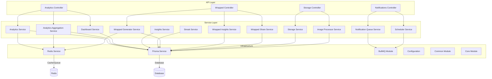
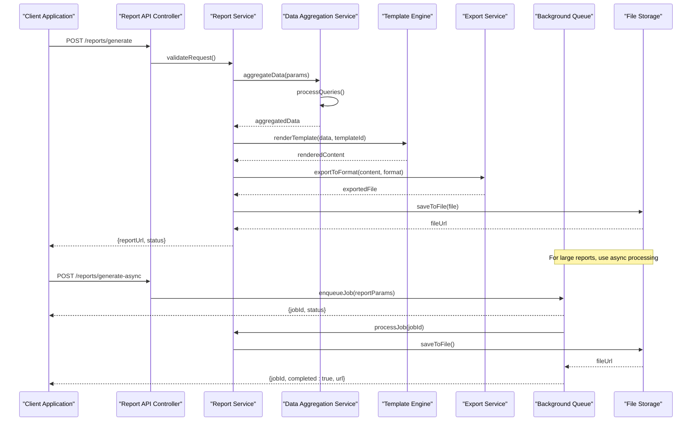
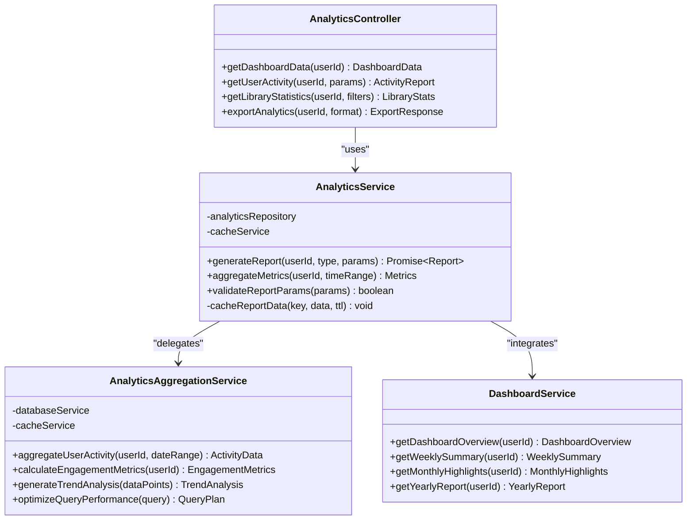
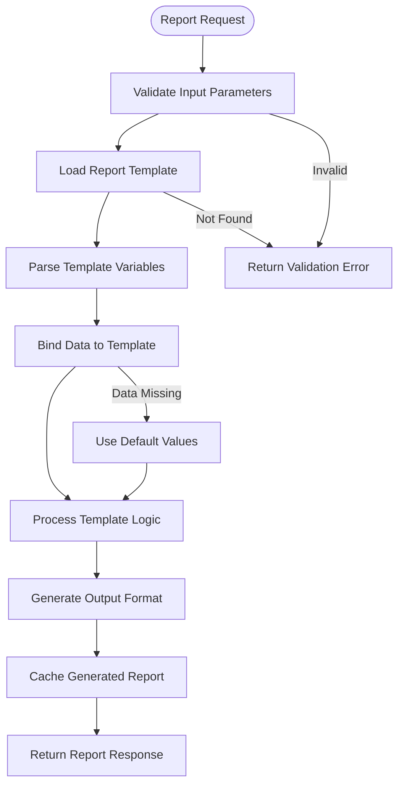
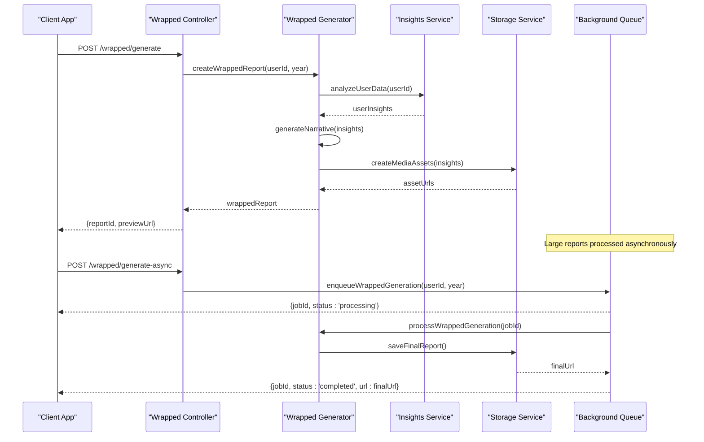
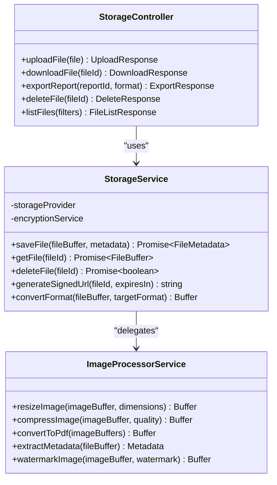
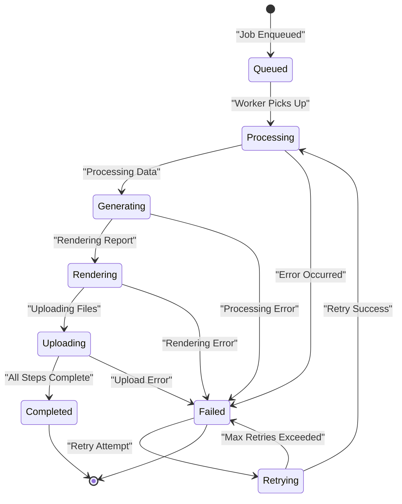
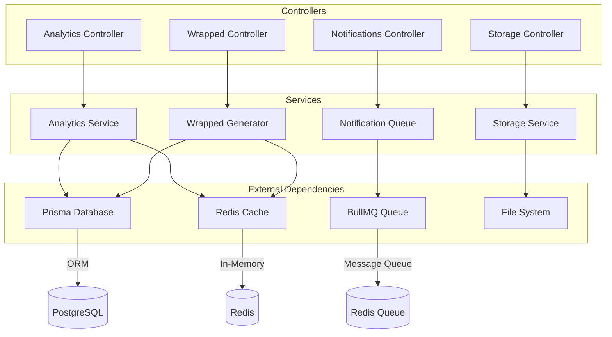

# Report Generation API

<cite>
**Referenced Files in This Document**
- [app.module.ts](file://apps/backend/src/app.module.ts)
- [main.ts](file://apps/backend/src/main.ts)
- [analytics.controller.ts](file://apps/backend/src/analytics/analytics.controller.ts)
- [analytics.service.ts](file://apps/backend/src/analytics/analytics.service.ts)
- [analytics-aggregation.service.ts](file://apps/backend/src/analytics/analytics-aggregation.service.ts)
- [dashboard.service.ts](file://apps/backend/src/analytics/dashboard.service.ts)
- [insights.service.ts](file://apps/backend/src/analytics/insights.service.ts)
- [streak.service.ts](file://apps/backend/src/analytics/streak.service.ts)
- [bullmq.module.ts](file://apps/backend/src/bullmq/bullmq.module.ts)
- [notifications.controller.ts](file://apps/backend/src/notifications/notifications.controller.ts)
- [scheduler.service.ts](file://apps/backend/src/notifications/scheduler.service.ts)
- [notification-queue.service.ts](file://apps/backend/src/notifications/notification-queue.service.ts)
- [storage.controller.ts](file://apps/backend/src/storage/storage.controller.ts)
- [storage.service.ts](file://apps/backend/src/storage/storage.service.ts)
- [image-processor.service.ts](file://apps/backend/src/storage/image-processor.service.ts)
- [wrapped.controller.ts](file://apps/backend/src/wrapped/wrapped.controller.ts)
- [wrapped-generator.service.ts](file://apps/backend/src/wrapped/wrapped-generator.service.ts)
- [wrapped-insights.service.ts](file://apps/backend/src/wrapped/wrapped-insights.service.ts)
- [wrapped-share.service.ts](file://apps/backend/src/wrapped/wrapped-share.service.ts)
- [prisma.service.ts](file://apps/backend/src/prisma/prisma.service.ts)
- [redis.service.ts](file://apps/backend/src/redis/redis.service.ts)
- [configuration.ts](file://apps/backend/src/config/configuration.ts)
- [env.validation.ts](file://apps/backend/src/config/env.validation.ts)
- [common.module.ts](file://apps/backend/src/common/common.module.ts)
- [core.module.ts](file://apps/backend/src/core/core.module.ts)
</cite>

## Table of Contents
1. [Introduction](#introduction)
2. [Project Structure](#project-structure)
3. [Core Components](#core-components)
4. [Architecture Overview](#architecture-overview)
5. [Detailed Component Analysis](#detailed-component-analysis)
6. [Dependency Analysis](#dependency-analysis)
7. [Performance Considerations](#performance-considerations)
8. [Troubleshooting Guide](#troubleshooting-guide)
9. [Conclusion](#conclusion)
10. [Appendices](#appendices)

## Introduction
This document provides comprehensive API documentation for custom report generation and data export endpoints within the backend application. It focuses on:
- Report template system and customization
- Data aggregation pipelines for analytics and insights
- Export format support (PDF, CSV, JSON)
- Report scheduling and batch processing
- Background job processing for large datasets
- Streaming responses for real-time report generation
- Parameter binding and output formatting options

The backend is built with NestJS and integrates with Prisma for database access, Redis for caching and queues, and BullMQ for background job orchestration. The analytics and wrapped modules provide core report generation capabilities, while storage and notification services support export delivery and scheduling.

## Project Structure
The report generation functionality spans several modules:
- Analytics module: Aggregates metrics, generates insights, and powers dashboard reports
- Wrapped module: Generates personalized year-in-review style reports
- Storage module: Handles file exports and media processing
- Notifications module: Schedules and delivers reports via queues
- Core infrastructure: Database, caching, configuration, and common utilities

**Diagram sources**
- [analytics.controller.ts](file://apps/backend/src/analytics/analytics.controller.ts)
- [analytics.service.ts](file://apps/backend/src/analytics/analytics.service.ts)
- [wrapped.controller.ts](file://apps/backend/src/wrapped/wrapped.controller.ts)
- [storage.controller.ts](file://apps/backend/src/storage/storage.controller.ts)
- [notifications.controller.ts](file://apps/backend/src/notifications/notifications.controller.ts)

**Section sources**
- [app.module.ts](file://apps/backend/src/app.module.ts)
- [main.ts](file://apps/backend/src/main.ts)

## Core Components
The report generation system consists of several key components:

### Analytics Services
- **Analytics Service**: Main orchestrator for report generation and data aggregation
- **Analytics Aggregation Service**: Handles complex data aggregation queries and calculations
- **Dashboard Service**: Provides dashboard-specific report data and visualizations
- **Insights Service**: Generates analytical insights and recommendations
- **Streak Service**: Tracks user activity streaks and patterns

### Wrapped Report System
- **Wrapped Generator Service**: Creates personalized wrapped-style reports
- **Wrapped Insights Service**: Analyzes user data to generate insights
- **Wrapped Share Service**: Handles sharing and export of wrapped reports

### Storage and Export Services
- **Storage Service**: Manages file uploads, downloads, and exports
- **Image Processor Service**: Processes images for PDF generation and previews

### Background Processing
- **Notification Queue Service**: Manages queue-based job processing
- **Scheduler Service**: Handles scheduled report generation and delivery

**Section sources**
- [analytics.service.ts](file://apps/backend/src/analytics/analytics.service.ts)
- [analytics-aggregation.service.ts](file://apps/backend/src/analytics/analytics-aggregation.service.ts)
- [dashboard.service.ts](file://apps/backend/src/analytics/dashboard.service.ts)
- [insights.service.ts](file://apps/backend/src/analytics/insights.service.ts)
- [streak.service.ts](file://apps/backend/src/analytics/streak.service.ts)
- [wrapped-generator.service.ts](file://apps/backend/src/wrapped/wrapped-generator.service.ts)
- [wrapped-insights.service.ts](file://apps/backend/src/wrapped/wrapped-insights.service.ts)
- [wrapped-share.service.ts](file://apps/backend/src/wrapped/wrapped-share.service.ts)
- [storage.service.ts](file://apps/backend/src/storage/storage.service.ts)
- [image-processor.service.ts](file://apps/backend/src/storage/image-processor.service.ts)
- [notification-queue.service.ts](file://apps/backend/src/notifications/notification-queue.service.ts)
- [scheduler.service.ts](file://apps/backend/src/notifications/scheduler.service.ts)

## Architecture Overview
The report generation architecture follows a layered approach with clear separation of concerns:

**Diagram sources**
- [analytics.controller.ts](file://apps/backend/src/analytics/analytics.controller.ts)
- [analytics.service.ts](file://apps/backend/src/analytics/analytics.service.ts)
- [analytics-aggregation.service.ts](file://apps/backend/src/analytics/analytics-aggregation.service.ts)
- [storage.service.ts](file://apps/backend/src/storage/storage.service.ts)
- [notification-queue.service.ts](file://apps/backend/src/notifications/notification-queue.service.ts)

## Detailed Component Analysis

### Analytics Report Generation
The analytics module provides comprehensive reporting capabilities for user activity, library statistics, and engagement metrics.

**Diagram sources**
- [analytics.controller.ts](file://apps/backend/src/analytics/analytics.controller.ts)
- [analytics.service.ts](file://apps/backend/src/analytics/analytics.service.ts)
- [analytics-aggregation.service.ts](file://apps/backend/src/analytics/analytics-aggregation.service.ts)
- [dashboard.service.ts](file://apps/backend/src/analytics/dashboard.service.ts)

#### Report Template System
The template system supports dynamic report generation with customizable layouts and data bindings:

**Diagram sources**
- [analytics.service.ts](file://apps/backend/src/analytics/analytics.service.ts)
- [configuration.ts](file://apps/backend/src/config/configuration.ts)

**Section sources**
- [analytics.controller.ts](file://apps/backend/src/analytics/analytics.controller.ts)
- [analytics.service.ts](file://apps/backend/src/analytics/analytics.service.ts)
- [analytics-aggregation.service.ts](file://apps/backend/src/analytics/analytics-aggregation.service.ts)
- [dashboard.service.ts](file://apps/backend/src/analytics/dashboard.service.ts)

### Wrapped Report System
The wrapped module creates personalized year-in-review style reports with rich visualizations and insights.

**Diagram sources**
- [wrapped.controller.ts](file://apps/backend/src/wrapped/wrapped.controller.ts)
- [wrapped-generator.service.ts](file://apps/backend/src/wrapped/wrapped-generator.service.ts)
- [wrapped-insights.service.ts](file://apps/backend/src/wrapped/wrapped-insights.service.ts)
- [storage.service.ts](file://apps/backend/src/storage/storage.service.ts)
- [notification-queue.service.ts](file://apps/backend/src/notifications/notification-queue.service.ts)

**Section sources**
- [wrapped.controller.ts](file://apps/backend/src/wrapped/wrapped.controller.ts)
- [wrapped-generator.service.ts](file://apps/backend/src/wrapped/wrapped-generator.service.ts)
- [wrapped-insights.service.ts](file://apps/backend/src/wrapped/wrapped-insights.service.ts)
- [wrapped-share.service.ts](file://apps/backend/src/wrapped/wrapped-share.service.ts)

### Export and File Management
The storage module handles various export formats and file management operations.

**Diagram sources**
- [storage.controller.ts](file://apps/backend/src/storage/storage.controller.ts)
- [storage.service.ts](file://apps/backend/src/storage/storage.service.ts)
- [image-processor.service.ts](file://apps/backend/src/storage/image-processor.service.ts)

**Section sources**
- [storage.controller.ts](file://apps/backend/src/storage/storage.controller.ts)
- [storage.service.ts](file://apps/backend/src/storage/storage.service.ts)
- [image-processor.service.ts](file://apps/backend/src/storage/image-processor.service.ts)

### Background Job Processing
Background jobs handle large dataset processing and asynchronous report generation.

**Diagram sources**
- [notification-queue.service.ts](file://apps/backend/src/notifications/notification-queue.service.ts)
- [scheduler.service.ts](file://apps/backend/src/notifications/scheduler.service.ts)
- [bullmq.module.ts](file://apps/backend/src/bullmq/bullmq.module.ts)

**Section sources**
- [notification-queue.service.ts](file://apps/backend/src/notifications/notification-queue.service.ts)
- [scheduler.service.ts](file://apps/backend/src/notifications/scheduler.service.ts)
- [bullmq.module.ts](file://apps/backend/src/bullmq/bullmq.module.ts)

## Dependency Analysis
The report generation system has well-defined dependencies between components:

**Diagram sources**
- [app.module.ts](file://apps/backend/src/app.module.ts)
- [prisma.service.ts](file://apps/backend/src/prisma/prisma.service.ts)
- [redis.service.ts](file://apps/backend/src/redis/redis.service.ts)
- [bullmq.module.ts](file://apps/backend/src/bullmq/bullmq.module.ts)

**Section sources**
- [app.module.ts](file://apps/backend/src/app.module.ts)
- [prisma.service.ts](file://apps/backend/src/prisma/prisma.service.ts)
- [redis.service.ts](file://apps/backend/src/redis/redis.service.ts)
- [bullmq.module.ts](file://apps/backend/src/bullmq/bullmq.module.ts)

## Performance Considerations
Key performance optimizations implemented in the report generation system:

### Caching Strategy
- Redis caching for frequently accessed report data
- Template result caching with configurable TTL
- Aggregated metrics caching for dashboard endpoints

### Database Optimization
- Efficient Prisma queries with proper indexing
- Batch operations for large dataset processing
- Connection pooling for optimal database performance

### Memory Management
- Stream processing for large file exports
- Lazy loading of report templates
- Garbage collection optimization for long-running jobs

### Concurrency Control
- Rate limiting for report generation endpoints
- Queue-based job processing for scalability
- Distributed locking for concurrent access

## Troubleshooting Guide
Common issues and their solutions in the report generation system:

### Report Generation Failures
- **Template Loading Errors**: Verify template file paths and permissions
- **Data Binding Issues**: Check parameter validation and data availability
- **Memory Limit Exceeded**: Implement streaming for large datasets

### Background Job Issues
- **Queue Overflow**: Monitor queue size and implement cleanup policies
- **Job Timeouts**: Adjust timeout configurations for large reports
- **Worker Crashes**: Implement health checks and automatic restarts

### Export Problems
- **File Format Errors**: Validate input data for target format compatibility
- **Storage Access Issues**: Check file system permissions and disk space
- **Network Timeouts**: Implement retry logic for external service calls

**Section sources**
- [analytics.service.ts](file://apps/backend/src/analytics/analytics.service.ts)
- [storage.service.ts](file://apps/backend/src/storage/storage.service.ts)
- [notification-queue.service.ts](file://apps/backend/src/notifications/notification-queue.service.ts)

## Conclusion
The report generation API provides a comprehensive solution for creating, customizing, and exporting reports in multiple formats. The modular architecture ensures scalability and maintainability, while the background job processing enables handling of large datasets without blocking user requests. The template system offers flexibility for report customization, and the caching strategies optimize performance for frequently accessed data.

## Appendices

### API Endpoints Reference
- **Report Generation**: POST /api/reports/generate
- **Async Report Generation**: POST /api/reports/generate-async
- **Report Status**: GET /api/reports/:id/status
- **Report Download**: GET /api/reports/:id/download
- **Template Management**: POST /api/templates, GET /api/templates/:id
- **Export Formats**: Support for PDF, CSV, JSON, and custom formats

### Configuration Options
- **Report Templates**: Configurable template paths and variables
- **Export Settings**: Format-specific configuration options
- **Queue Settings**: Worker count, retry policies, and timeouts
- **Caching Policies**: TTL values and cache invalidation strategies

**Section sources**
- [configuration.ts](file://apps/backend/src/config/configuration.ts)
- [env.validation.ts](file://apps/backend/src/config/env.validation.ts)
- [common.module.ts](file://apps/backend/src/common/common.module.ts)
- [core.module.ts](file://apps/backend/src/core/core.module.ts)