# Authentication API

<cite>
**Referenced Files in This Document**
- [auth.controller.ts](file://apps/backend/src/auth/auth.controller.ts)
- [auth.service.ts](file://apps/backend/src/auth/auth.service.ts)
- [auth.module.ts](file://apps/backend/src/auth/auth.module.ts)
- [auth.repository.ts](file://apps/backend/src/auth/auth.repository.ts)
- [auth.controller.ts](file://apps/backend/src/auth/controllers/auth.controller.ts)
- [auth.service.ts](file://apps/backend/src/auth/services/auth.service.ts)
- [jwt.strategy.ts](file://apps/backend/src/auth/strategies/jwt.strategy.ts)
- [local.strategy.ts](file://apps/backend/src/auth/strategies/local.strategy.ts)
- [oauth.strategy.ts](file://apps/backend/src/auth/strategies/oauth.strategy.ts)
- [jwt.guard.ts](file://apps/backend/src/auth/guards/jwt.guard.ts)
- [roles.guard.ts](file://apps/backend/src/auth/guards/roles.guard.ts)
- [rate-limit.guard.ts](file://apps/backend/src/auth/guards/rate-limit.guard.ts)
- [auth.dto.ts](file://apps/backend/src/auth/dto/auth.dto.ts)
- [register.dto.ts](file://apps/backend/src/auth/dto/register.dto.ts)
- [login.dto.ts](file://apps/backend/src/auth/dto/login.dto.ts)
- [refresh.dto.ts](file://apps/backend/src/auth/dto/refresh.dto.ts)
- [password.dto.ts](file://apps/backend/src/auth/dto/password.dto.ts)
- [email-verify.dto.ts](file://apps/backend/src/auth/dto/email-verify.dto.ts)
- [user.service.ts](file://apps/backend/src/users/services/user.service.ts)
- [users.controller.ts](file://apps/backend/src/users/users.controller.ts)
- [configuration.ts](file://apps/backend/src/config/configuration.ts)
- [env.validation.ts](file://apps/backend/src/config/env.validation.ts)
- [schema.prisma](file://apps/backend/prisma/schema.prisma)
</cite>

## Table of Contents
1. [Introduction](#introduction)
2. [Project Structure](#project-structure)
3. [Core Components](#core-components)
4. [Architecture Overview](#architecture-overview)
5. [Detailed Component Analysis](#detailed-component-analysis)
6. [Dependency Analysis](#dependency-analysis)
7. [Performance Considerations](#performance-considerations)
8. [Troubleshooting Guide](#troubleshooting-guide)
9. [Conclusion](#conclusion)
10. [Appendices](#appendices)

## Introduction
This document provides comprehensive API documentation for the authentication subsystem, covering user registration, login, logout, password management, email verification, and OAuth integration. It specifies HTTP methods, URL patterns, request/response schemas, JWT token structure, refresh token flow, role-based authorization, session management, security considerations (password policies, token expiration, rate limiting), and error handling.

## Project Structure
The authentication system is implemented as a NestJS module with controllers, services, DTOs, guards, strategies, and repositories. Key areas:
- Controllers expose HTTP endpoints for auth flows.
- Services implement business logic (registration, login, password reset, email verification, OAuth).
- Guards enforce JWT validation, roles, and rate limits.
- Strategies handle JWT and OAuth authentication.
- Repositories interact with persistence (Prisma).
- Configuration defines environment variables and validation.

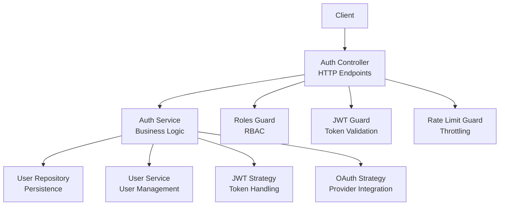

**Diagram sources**
- [auth.controller.ts](file://apps/backend/src/auth/auth.controller.ts)
- [auth.service.ts](file://apps/backend/src/auth/auth.service.ts)
- [auth.repository.ts](file://apps/backend/src/auth/auth.repository.ts)
- [jwt.guard.ts](file://apps/backend/src/auth/guards/jwt.guard.ts)
- [roles.guard.ts](file://apps/backend/src/auth/guards/roles.guard.ts)
- [rate-limit.guard.ts](file://apps/backend/src/auth/guards/rate-limit.guard.ts)
- [jwt.strategy.ts](file://apps/backend/src/auth/strategies/jwt.strategy.ts)
- [oauth.strategy.ts](file://apps/backend/src/auth/strategies/oauth.strategy.ts)

**Section sources**
- [auth.module.ts](file://apps/backend/src/auth/auth.module.ts)
- [configuration.ts](file://apps/backend/src/config/configuration.ts)
- [env.validation.ts](file://apps/backend/src/config/env.validation.ts)

## Core Components
- Auth Controller: Defines HTTP routes for register, login, logout, refresh, password change/reset, email verification, and OAuth callbacks.
- Auth Service: Orchestrates registration, credential validation, token issuance, refresh, password operations, email verification, and OAuth flows.
- Guards: JWT guard validates tokens; Roles guard enforces RBAC; Rate Limit guard throttles requests.
- Strategies: JWT strategy decodes and validates tokens; OAuth strategy integrates with providers.
- Repositories: Data access layer for users, sessions, and tokens using Prisma.
- DTOs: Request/response schemas for all endpoints.

Key responsibilities:
- Registration: Validate input, create user, send verification email, return success or errors.
- Login: Verify credentials, issue access and refresh tokens, set session state if applicable.
- Logout: Invalidate refresh tokens and revoke sessions.
- Password Management: Enforce policy, hash passwords, support reset via email.
- Email Verification: Generate and validate verification codes/tokens.
- OAuth: Handle provider redirects, callback processing, linking accounts, issuing tokens.

**Section sources**
- [auth.controller.ts](file://apps/backend/src/auth/auth.controller.ts)
- [auth.service.ts](file://apps/backend/src/auth/auth.service.ts)
- [auth.repository.ts](file://apps/backend/src/auth/auth.repository.ts)
- [jwt.guard.ts](file://apps/backend/src/auth/guards/jwt.guard.ts)
- [roles.guard.ts](file://apps/backend/src/auth/guards/roles.guard.ts)
- [rate-limit.guard.ts](file://apps/backend/src/auth/guards/rate-limit.guard.ts)
- [jwt.strategy.ts](file://apps/backend/src/auth/strategies/jwt.strategy.ts)
- [oauth.strategy.ts](file://apps/backend/src/auth/strategies/oauth.strategy.ts)
- [auth.dto.ts](file://apps/backend/src/auth/dto/auth.dto.ts)
- [register.dto.ts](file://apps/backend/src/auth/dto/register.dto.ts)
- [login.dto.ts](file://apps/backend/src/auth/dto/login.dto.ts)
- [refresh.dto.ts](file://apps/backend/src/auth/dto/refresh.dto.ts)
- [password.dto.ts](file://apps/backend/src/auth/dto/password.dto.ts)
- [email-verify.dto.ts](file://apps/backend/src/auth/dto/email-verify.dto.ts)

## Architecture Overview
The authentication architecture follows a layered approach:
- HTTP Layer: Controllers define REST endpoints.
- Business Layer: Services encapsulate domain logic.
- Security Layer: Guards and strategies manage authentication and authorization.
- Persistence Layer: Repositories use Prisma to read/write data.
- Configuration: Environment-driven settings for secrets, token lifetimes, and rate limits.

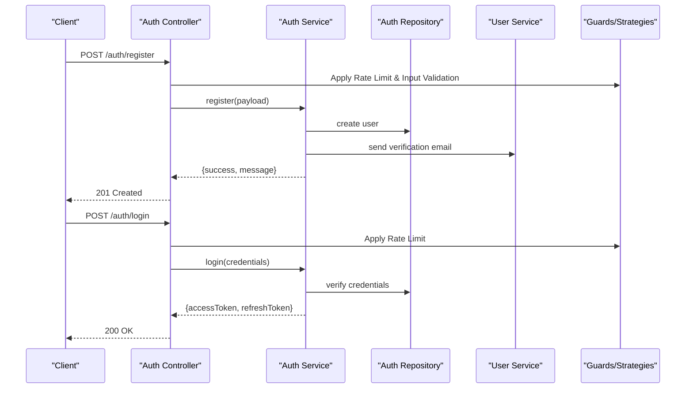

**Diagram sources**
- [auth.controller.ts](file://apps/backend/src/auth/auth.controller.ts)
- [auth.service.ts](file://apps/backend/src/auth/auth.service.ts)
- [auth.repository.ts](file://apps/backend/src/auth/auth.repository.ts)
- [user.service.ts](file://apps/backend/src/users/services/user.service.ts)
- [jwt.guard.ts](file://apps/backend/src/auth/guards/jwt.guard.ts)
- [rate-limit.guard.ts](file://apps/backend/src/auth/guards/rate-limit.guard.ts)

## Detailed Component Analysis

### Registration Endpoint
- Method: POST
- URL: /auth/register
- Request Body: Defined by Register DTO (username, email, password, optional fields).
- Response: Success with message; error responses for validation failures, duplicate email/username.
- Behavior: Creates user, hashes password, sends verification email, returns status.

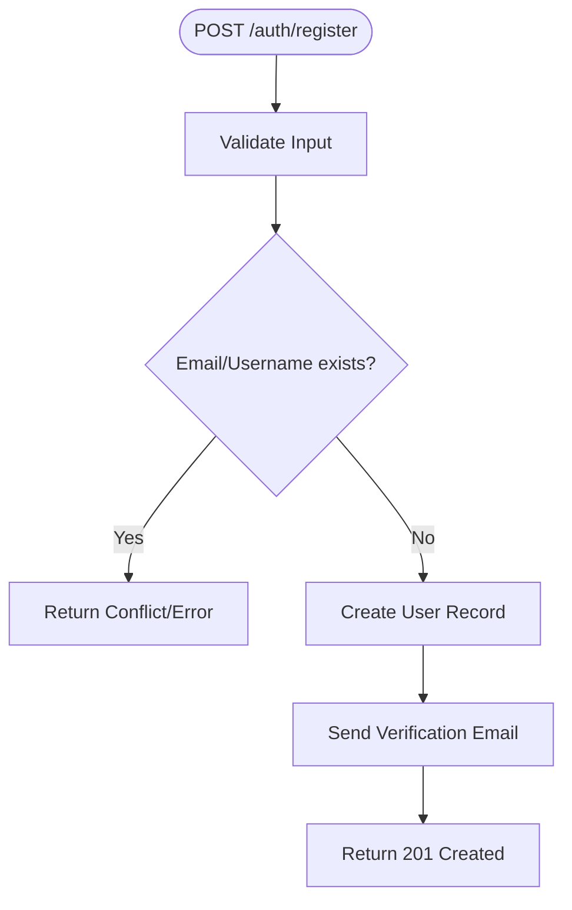

**Diagram sources**
- [auth.controller.ts](file://apps/backend/src/auth/auth.controller.ts)
- [auth.service.ts](file://apps/backend/src/auth/auth.service.ts)
- [register.dto.ts](file://apps/backend/src/auth/dto/register.dto.ts)

**Section sources**
- [auth.controller.ts](file://apps/backend/src/auth/auth.controller.ts)
- [auth.service.ts](file://apps/backend/src/auth/auth.service.ts)
- [register.dto.ts](file://apps/backend/src/auth/dto/register.dto.ts)

### Login Endpoint
- Method: POST
- URL: /auth/login
- Request Body: Defined by Login DTO (email/username, password).
- Response: Access token and refresh token; error on invalid credentials.
- Behavior: Validates credentials, issues JWT access token and refresh token, may set session state.

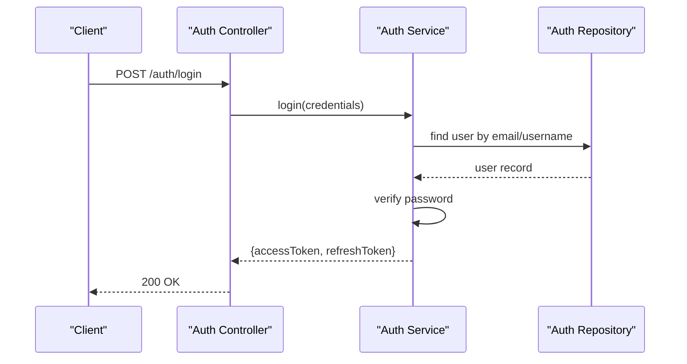

**Diagram sources**
- [auth.controller.ts](file://apps/backend/src/auth/auth.controller.ts)
- [auth.service.ts](file://apps/backend/src/auth/auth.service.ts)
- [login.dto.ts](file://apps/backend/src/auth/dto/login.dto.ts)
- [auth.repository.ts](file://apps/backend/src/auth/auth.repository.ts)

**Section sources**
- [auth.controller.ts](file://apps/backend/src/auth/auth.controller.ts)
- [auth.service.ts](file://apps/backend/src/auth/auth.service.ts)
- [login.dto.ts](file://apps/backend/src/auth/dto/login.dto.ts)

### Refresh Token Flow
- Method: POST
- URL: /auth/refresh
- Request Body: Defined by Refresh DTO (refreshToken).
- Response: New accessToken; error if refresh token invalid/expired.
- Behavior: Validates refresh token, issues new access token, rotates refresh token if configured.

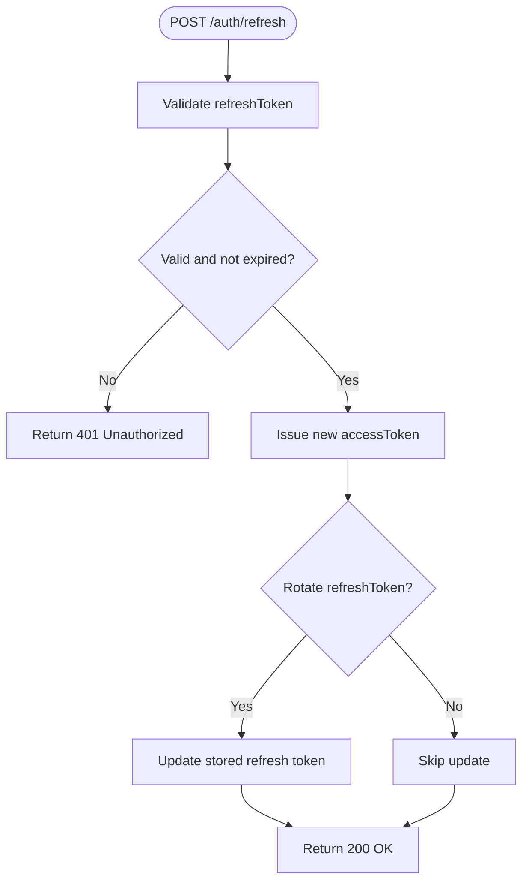

**Diagram sources**
- [auth.controller.ts](file://apps/backend/src/auth/auth.controller.ts)
- [auth.service.ts](file://apps/backend/src/auth/auth.service.ts)
- [refresh.dto.ts](file://apps/backend/src/auth/dto/refresh.dto.ts)

**Section sources**
- [auth.controller.ts](file://apps/backend/src/auth/auth.controller.ts)
- [auth.service.ts](file://apps/backend/src/auth/auth.service.ts)
- [refresh.dto.ts](file://apps/backend/src/auth/dto/refresh.dto.ts)

### Logout Endpoint
- Method: POST
- URL: /auth/logout
- Request Body: Optional payload including refreshToken or sessionId.
- Response: Success message; error if token/session not found.
- Behavior: Invalidates refresh tokens, revokes sessions, clears server-side state.

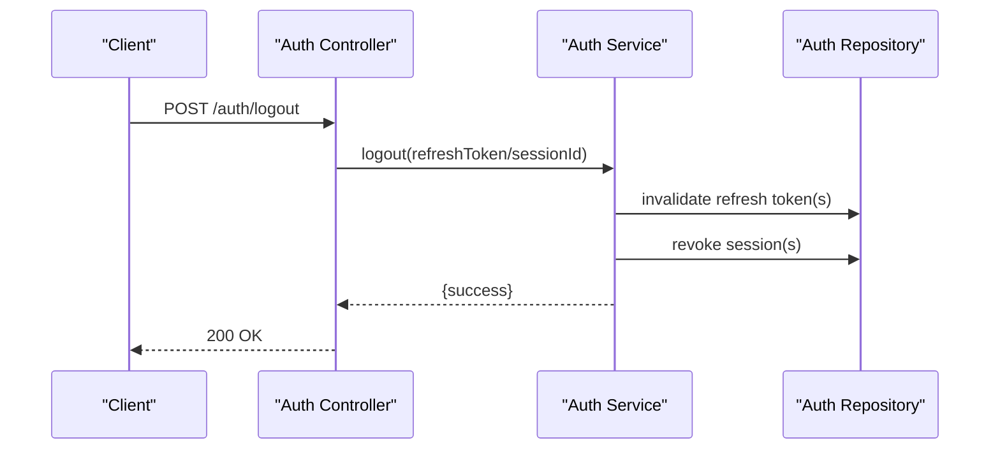

**Diagram sources**
- [auth.controller.ts](file://apps/backend/src/auth/auth.controller.ts)
- [auth.service.ts](file://apps/backend/src/auth/auth.service.ts)
- [auth.repository.ts](file://apps/backend/src/auth/auth.repository.ts)

**Section sources**
- [auth.controller.ts](file://apps/backend/src/auth/auth.controller.ts)
- [auth.service.ts](file://apps/backend/src/auth/auth.service.ts)

### Password Management
- Change Password:
  - Method: PUT/PATCH
  - URL: /auth/password/change
  - Request Body: Defined by Password DTO (currentPassword, newPassword).
  - Response: Success or error for invalid current password or policy violation.
- Reset Password:
  - Method: POST
  - URL: /auth/password/reset
  - Request Body: Email address to initiate reset.
  - Response: Success message; verification email sent.
- Confirm Reset:
  - Method: POST
  - URL: /auth/password/reset/confirm
  - Request Body: Reset token and new password.
  - Response: Success or error for invalid/expired token.

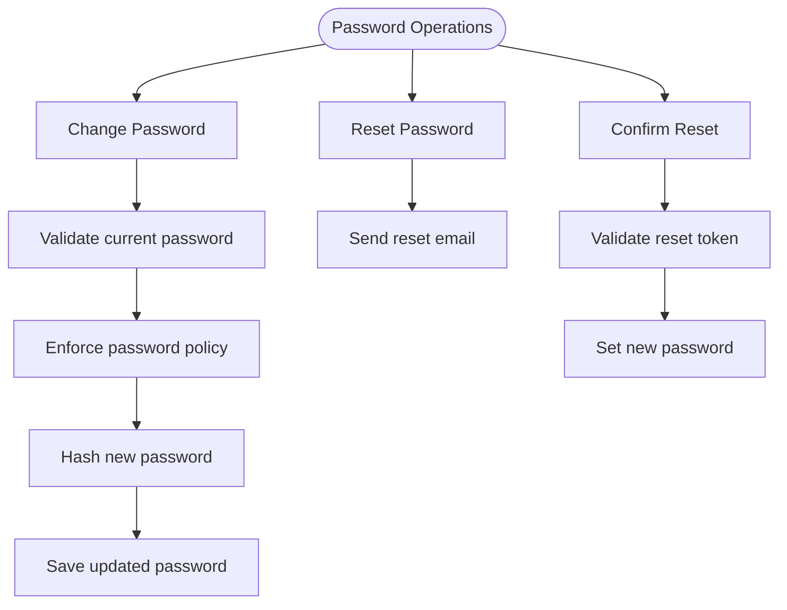

**Diagram sources**
- [auth.controller.ts](file://apps/backend/src/auth/auth.controller.ts)
- [auth.service.ts](file://apps/backend/src/auth/auth.service.ts)
- [password.dto.ts](file://apps/backend/src/auth/dto/password.dto.ts)

**Section sources**
- [auth.controller.ts](file://apps/backend/src/auth/auth.controller.ts)
- [auth.service.ts](file://apps/backend/src/auth/auth.service.ts)
- [password.dto.ts](file://apps/backend/src/auth/dto/password.dto.ts)

### Email Verification
- Send Verification:
  - Method: POST
  - URL: /auth/email/verify/send
  - Request Body: Email address.
  - Response: Success message; verification email sent.
- Confirm Verification:
  - Method: POST
  - URL: /auth/email/verify/confirm
  - Request Body: Defined by Email Verify DTO (token/code).
  - Response: Success or error for invalid/expired token.

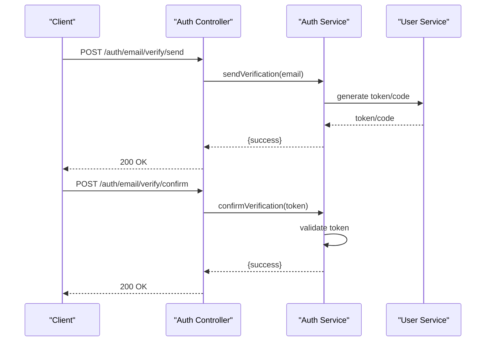

**Diagram sources**
- [auth.controller.ts](file://apps/backend/src/auth/auth.controller.ts)
- [auth.service.ts](file://apps/backend/src/auth/auth.service.ts)
- [email-verify.dto.ts](file://apps/backend/src/auth/dto/email-verify.dto.ts)
- [user.service.ts](file://apps/backend/src/users/services/user.service.ts)

**Section sources**
- [auth.controller.ts](file://apps/backend/src/auth/auth.controller.ts)
- [auth.service.ts](file://apps/backend/src/auth/auth.service.ts)
- [email-verify.dto.ts](file://apps/backend/src/auth/dto/email-verify.dto.ts)

### OAuth Integration
- Initiate OAuth:
  - Method: GET
  - URL: /auth/oauth/:provider
  - Response: Redirect to provider authorization page.
- OAuth Callback:
  - Method: GET
  - URL: /auth/oauth/:provider/callback
  - Query Parameters: Provider-specific code/state.
  - Response: Redirect with tokens or sets cookies; may link existing account.
- Behavior: Validates provider response, creates or links user, issues JWT tokens.

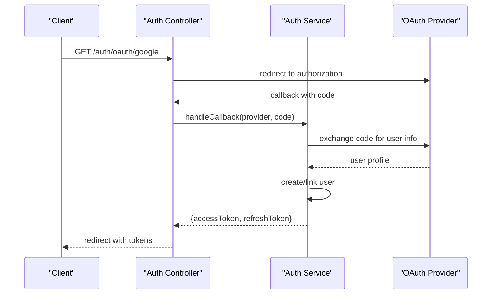

**Diagram sources**
- [auth.controller.ts](file://apps/backend/src/auth/auth.controller.ts)
- [auth.service.ts](file://apps/backend/src/auth/auth.service.ts)
- [oauth.strategy.ts](file://apps/backend/src/auth/strategies/oauth.strategy.ts)

**Section sources**
- [auth.controller.ts](file://apps/backend/src/auth/auth.controller.ts)
- [auth.service.ts](file://apps/backend/src/auth/auth/service.ts)
- [oauth.strategy.ts](file://apps/backend/src/auth/strategies/oauth.strategy.ts)

### Role-Based Authorization
- Mechanism: Roles guard checks user roles from JWT payload or session.
- Usage: Applied to protected endpoints requiring specific roles.
- Policies: Define role hierarchy and permissions per endpoint.

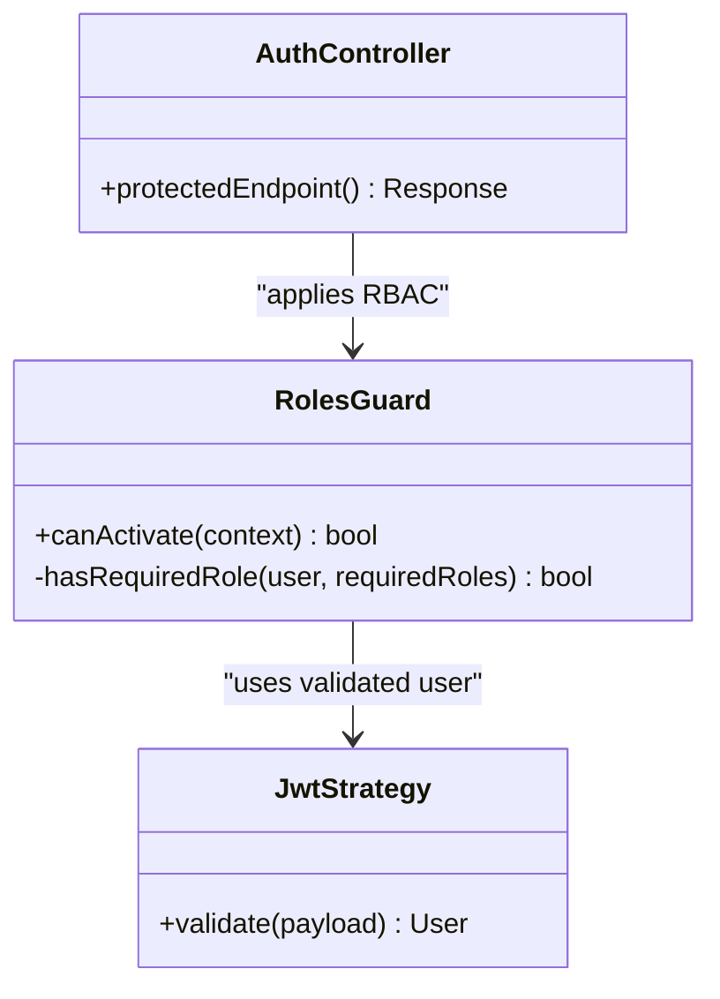

**Diagram sources**
- [roles.guard.ts](file://apps/backend/src/auth/guards/roles.guard.ts)
- [jwt.strategy.ts](file://apps/backend/src/auth/strategies/jwt.strategy.ts)
- [auth.controller.ts](file://apps/backend/src/auth/auth.controller.ts)

**Section sources**
- [roles.guard.ts](file://apps/backend/src/auth/guards/roles.guard.ts)
- [jwt.strategy.ts](file://apps/backend/src/auth/strategies/jwt.strategy.ts)
- [auth.controller.ts](file://apps/backend/src/auth/auth.controller.ts)

### Session Management
- Stateful Sessions: May be used alongside JWT for additional context.
- Storage: Server-side session store (e.g., Redis) linked to user identity.
- Lifecycle: Created on login, updated on activity, invalidated on logout.

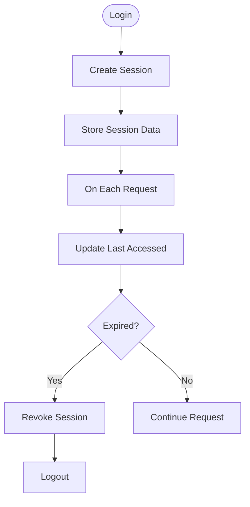

**Diagram sources**
- [auth.service.ts](file://apps/backend/src/auth/auth.service.ts)
- [auth.repository.ts](file://apps/backend/src/auth/auth.repository.ts)

**Section sources**
- [auth.service.ts](file://apps/backend/src/auth/auth.service.ts)
- [auth.repository.ts](file://apps/backend/src/auth/auth.repository.ts)

## Dependency Analysis
Authentication components depend on configuration, user management, and persistence layers. Guards and strategies are integrated into controllers to enforce security policies.

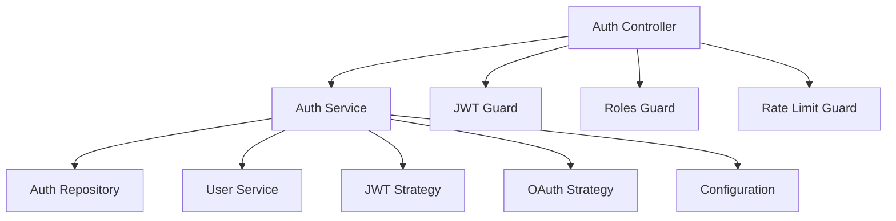

**Diagram sources**
- [auth.controller.ts](file://apps/backend/src/auth/auth.controller.ts)
- [auth.service.ts](file://apps/backend/src/auth/auth.service.ts)
- [auth.repository.ts](file://apps/backend/src/auth/auth.repository.ts)
- [user.service.ts](file://apps/backend/src/users/services/user.service.ts)
- [jwt.guard.ts](file://apps/backend/src/auth/guards/jwt.guard.ts)
- [roles.guard.ts](file://apps/backend/src/auth/guards/roles.guard.ts)
- [rate-limit.guard.ts](file://apps/backend/src/auth/guards/rate-limit.guard.ts)
- [jwt.strategy.ts](file://apps/backend/src/auth/strategies/jwt.strategy.ts)
- [oauth.strategy.ts](file://apps/backend/src/auth/strategies/oauth.strategy.ts)
- [configuration.ts](file://apps/backend/src/config/configuration.ts)

**Section sources**
- [auth.module.ts](file://apps/backend/src/auth/auth.module.ts)
- [configuration.ts](file://apps/backend/src/config/configuration.ts)
- [env.validation.ts](file://apps/backend/src/config/env.validation.ts)

## Performance Considerations
- Token Issuance: Minimize cryptographic overhead by caching public keys and optimizing JWT signing.
- Rate Limiting: Configure appropriate thresholds to prevent abuse without impacting legitimate traffic.
- Database Queries: Use efficient lookups and indexes for user retrieval and token validation.
- Session Storage: Choose fast storage (e.g., Redis) for high-throughput environments.
- Email Queues: Offload email sending to background jobs to reduce latency.

[No sources needed since this section provides general guidance]

## Troubleshooting Guide
Common issues and resolutions:
- Invalid Credentials: Ensure correct email/username and password; check hashing algorithm consistency.
- Token Expired: Implement automatic refresh token rotation; handle 401 responses gracefully.
- Rate Limited: Adjust rate limit configurations; monitor client request patterns.
- Email Not Received: Verify email service configuration; check spam filters; retry mechanisms.
- OAuth Failures: Validate provider secrets; ensure correct redirect URIs; inspect callback payloads.

**Section sources**
- [auth.service.ts](file://apps/backend/src/auth/auth.service.ts)
- [configuration.ts](file://apps/backend/src/config/configuration.ts)
- [env.validation.ts](file://apps/backend/src/config/env.validation.ts)

## Conclusion
The authentication API provides robust features for user lifecycle management, secure token handling, and flexible authorization. By following the documented endpoints, schemas, and security practices, clients can integrate seamlessly while maintaining high security and performance standards.

[No sources needed since this section summarizes without analyzing specific files]

## Appendices

### JWT Token Structure
- Access Token: Short-lived, contains user identity and roles; signed with server secret.
- Refresh Token: Longer-lived, stored securely; used to obtain new access tokens.
- Claims: Include user ID, roles, issued at, expiration, and optional metadata.

**Section sources**
- [jwt.strategy.ts](file://apps/backend/src/auth/strategies/jwt.strategy.ts)
- [configuration.ts](file://apps/backend/src/config/configuration.ts)

### Password Policies
- Minimum length, complexity requirements, history enforcement.
- Secure hashing algorithm (e.g., bcrypt, argon2).
- Regular audits and updates to policy compliance.

**Section sources**
- [password.dto.ts](file://apps/backend/src/auth/dto/password.dto.ts)
- [auth.service.ts](file://apps/backend/src/auth/auth.service.ts)

### Rate Limiting
- Configurable limits per IP/user.
- Throttling middleware applied to sensitive endpoints.
- Monitoring and alerting for abuse detection.

**Section sources**
- [rate-limit.guard.ts](file://apps/backend/src/auth/guards/rate-limit.guard.ts)
- [configuration.ts](file://apps/backend/src/config/configuration.ts)

### Schema Definitions
- Users: Identity, email, hashed password, roles, verification status.
- Tokens: Refresh tokens with expiry and revocation flags.
- Sessions: Active sessions with last accessed timestamps.

**Section sources**
- [schema.prisma](file://apps/backend/prisma/schema.prisma)