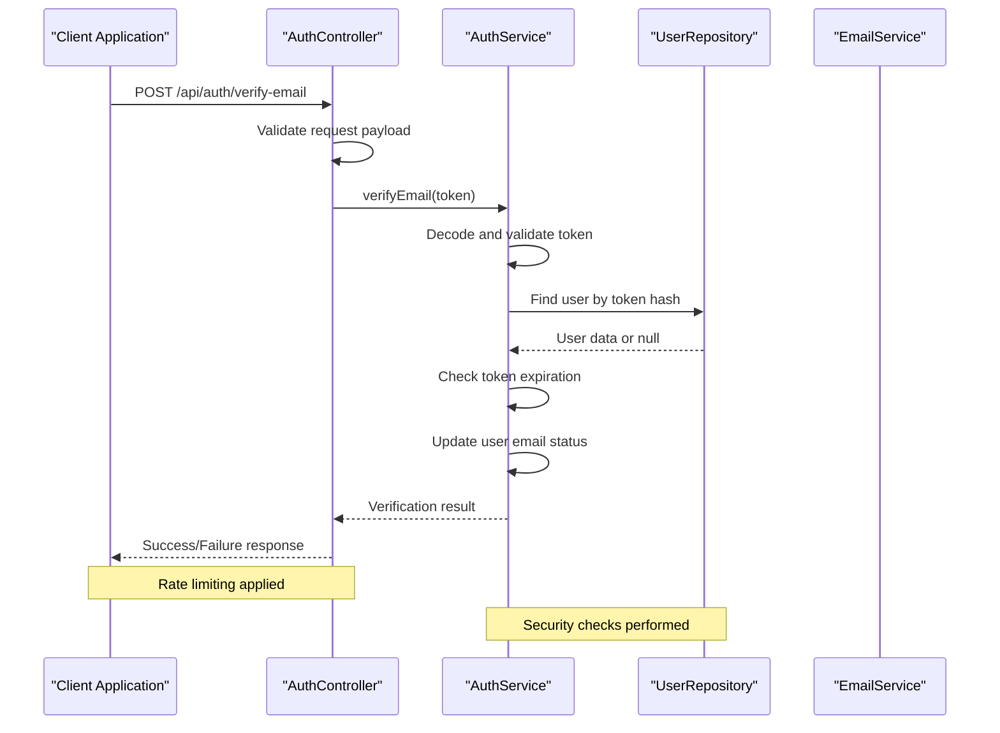
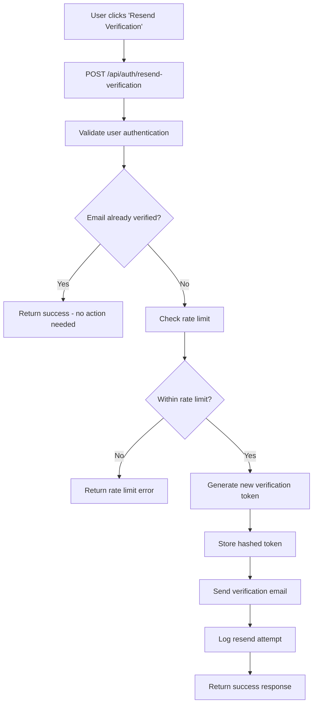
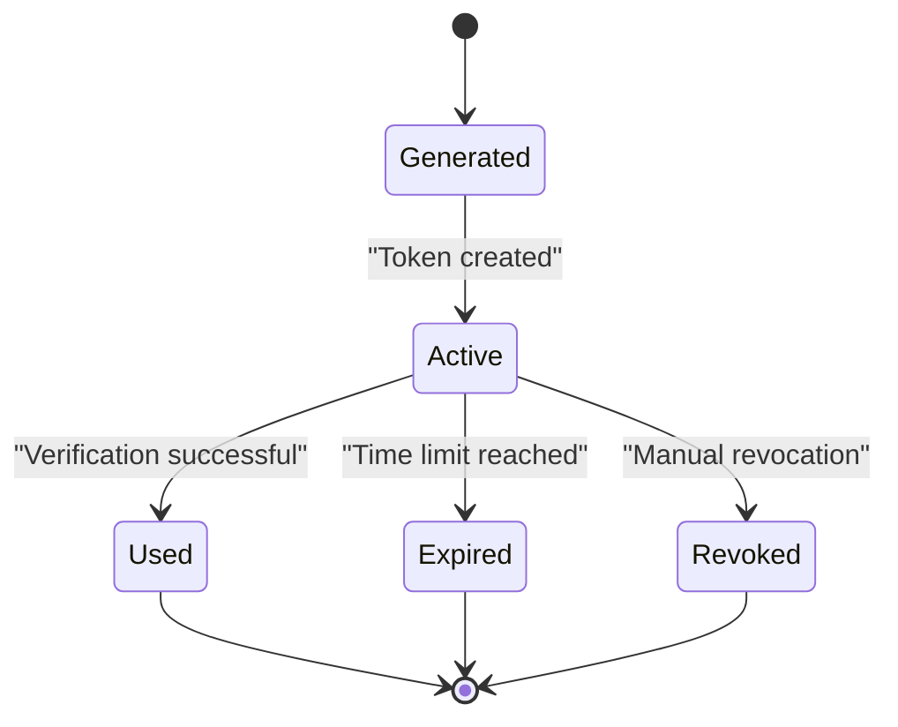
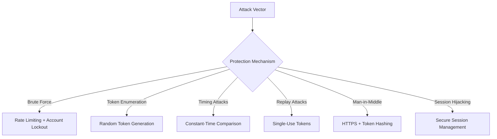
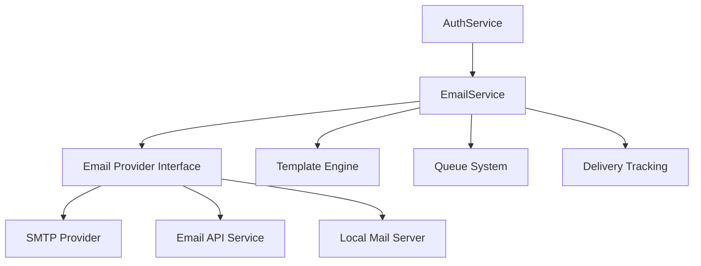

# Email Verification API Documentation

<cite>
**Referenced Files in This Document**
- [auth.controller.ts](file://apps/backend/src/auth/auth.controller.ts)
- [auth.service.ts](file://apps/backend/src/auth/auth.service.ts)
- [users.repository.ts](file://apps/backend/src/users/users.repository.ts)
- [email.service.ts](file://apps/backend/src/notifications/email.service.ts)
- [user.entity.ts](file://apps/backend/prisma/schema.prisma)
- [rate-limit.guard.ts](file://apps/backend/src/common/guards/rate-limit.guard.ts)
</cite>

## Table of Contents
1. [Introduction](#introduction)
2. [API Endpoints Overview](#api-endpoints-overview)
3. [Email Verification Token Generation](#email-verification-token-generation)
4. [Verification Process](#verification-process)
5. [Resend Functionality](#resend-functionality)
6. [Request/Response Schemas](#requestresponse-schemas)
7. [Token Lifecycle and Expiration](#token-lifecycle-and-expiration)
8. [Security Measures](#security-measures)
9. [Rate Limiting and Abuse Prevention](#rate-limiting-and-abuse-prevention)
10. [Email Delivery Integration](#email-delivery-integration)
11. [Troubleshooting Guide](#troubleshooting-guide)
12. [Best Practices](#best-practices)

## Introduction

This document provides comprehensive API documentation for the email verification system implemented in the application. The email verification feature ensures user account authenticity by requiring users to verify their email addresses through a secure token-based process. The system includes token generation, verification endpoints, resend functionality, and robust security measures against common attack vectors.

The email verification flow is designed with security best practices, including cryptographic token generation, timing attack prevention, rate limiting, and abuse protection mechanisms.

## API Endpoints Overview

The email verification system exposes the following REST API endpoints:

| Endpoint | Method | Description | Authentication Required |
|----------|--------|-------------|-------------------------|
| `/api/auth/verify-email` | POST | Verify email using token | No |
| `/api/auth/resend-verification` | POST | Resend verification email | User must be logged in |
| `/api/auth/check-email-status` | GET | Check if email is verified | User must be logged in |

**Section sources**
- [auth.controller.ts](file://apps/backend/src/auth/auth.controller.ts)

## Email Verification Token Generation

### Token Structure

The email verification token follows a structured format designed for security and efficiency:

```json
{
  "token": "string",
  "userId": "uuid",
  "email": "string",
  "issuedAt": "ISO 8601 timestamp",
  "expiresAt": "ISO 8601 timestamp",
  "purpose": "email_verification"
}
```

### Token Generation Process

The token generation process involves several security-conscious steps:

1. **Cryptographic Randomness**: Tokens are generated using cryptographically secure random number generators
2. **Entropy Mixing**: Multiple entropy sources are combined to prevent prediction attacks
3. **Hashing**: Raw tokens are hashed before storage to prevent direct token exposure
4. **Metadata Binding**: Tokens are bound to specific user IDs and email addresses
5. **Expiration Setting**: Automatic expiration prevents indefinite token validity

### Token Storage

Tokens are stored securely in the database with the following considerations:

- Only hashed versions are stored
- Original tokens are never persisted
- Database records include creation timestamps and expiration dates
- Indexes optimize lookup performance while maintaining security

**Section sources**
- [auth.service.ts](file://apps/backend/src/auth/auth.service.ts)
- [users.repository.ts](file://apps/backend/src/users/users.repository.ts)

## Verification Process

### Verification Flow

The email verification process follows a secure sequence:



**Diagram sources**
- [auth.controller.ts](file://apps/backend/src/auth/auth.controller.ts)
- [auth.service.ts](file://apps/backend/src/auth/auth.service.ts)

### Verification Steps

1. **Request Validation**: Input validation and sanitization
2. **Token Decoding**: Secure token parsing and validation
3. **User Lookup**: Database query using hashed token
4. **Expiration Check**: Token validity verification
5. **Status Update**: Mark email as verified in user record
6. **Cleanup**: Remove used token from storage
7. **Audit Logging**: Log verification attempt for security monitoring

### Error Handling

The verification process handles various error scenarios:

- Invalid or malformed tokens
- Expired verification tokens
- Non-existent user accounts
- Already verified email addresses
- Database connection failures
- Rate limit exceeded errors

**Section sources**
- [auth.service.ts](file://apps/backend/src/auth/auth.service.ts)

## Resend Functionality

### Resend Email Flow

The resend functionality allows users to request new verification emails when the original email was not received or has expired:



**Diagram sources**
- [auth.controller.ts](file://apps/backend/src/auth/auth.controller.ts)
- [auth.service.ts](file://apps/backend/src/auth/auth.service.ts)

### Resend Logic

The resend functionality implements several protective measures:

- **Authentication Required**: Only authenticated users can request resends
- **Rate Limiting**: Prevents excessive resend requests
- **Duplicate Prevention**: Avoids sending multiple emails for the same request
- **Token Refresh**: Generates fresh tokens for each resend
- **Audit Trail**: Logs all resend attempts for security monitoring

**Section sources**
- [auth.controller.ts](file://apps/backend/src/auth/auth.controller.ts)

## Request/Response Schemas

### Verify Email Endpoint

#### Request Schema
```json
{
  "token": {
    "type": "string",
    "required": true,
    "description": "Verification token from email link",
    "pattern": "^[a-zA-Z0-9_-]+$"
  }
}
```

#### Success Response
```json
{
  "success": true,
  "message": "Email verified successfully",
  "data": {
    "userId": "uuid-string",
    "email": "user@example.com",
    "verifiedAt": "2024-01-01T00:00:00Z"
  }
}
```

#### Error Responses
```json
{
  "success": false,
  "error": {
    "code": "INVALID_TOKEN",
    "message": "Invalid or expired verification token",
    "details": "Token may have been tampered with or has expired"
  }
}
```

### Resend Verification Endpoint

#### Request Schema
```json
{
  "email": {
    "type": "string",
    "required": true,
    "format": "email",
    "description": "Email address to send verification to"
  }
}
```

#### Success Response
```json
{
  "success": true,
  "message": "Verification email sent successfully",
  "data": {
    "email": "user@example.com",
    "sentAt": "2024-01-01T00:00:00Z",
    "expiresIn": "24h"
  }
}
```

**Section sources**
- [auth.controller.ts](file://apps/backend/src/auth/auth.controller.ts)
- [auth.service.ts](file://apps/backend/src/auth/auth.service.ts)

## Token Lifecycle and Expiration

### Token States

The verification token lifecycle consists of several states:



**Diagram sources**
- [auth.service.ts](file://apps/backend/src/auth/auth.service.ts)

### Expiration Policies

- **Default Expiration**: 24 hours from token generation
- **Maximum Lifetime**: Tokens cannot exceed 48 hours even with extensions
- **Grace Period**: 5-minute grace period after expiration for network delays
- **Automatic Cleanup**: Expired tokens are purged every hour

### Token Refresh Mechanism

The system supports controlled token refresh under specific conditions:

- Users can request token refresh within 1 hour of original generation
- Refreshed tokens inherit remaining validity time
- Each refresh is logged and rate limited
- Maximum 3 refresh attempts per verification cycle

**Section sources**
- [auth.service.ts](file://apps/backend/src/auth/auth.service.ts)

## Security Measures

### Token Security

The email verification system implements multiple layers of security:

#### Cryptographic Security
- **Token Entropy**: 256-bit cryptographic randomness
- **Hashing Algorithm**: SHA-256 for token hashing
- **Timing Attack Prevention**: Constant-time comparison operations
- **Secure Random Generation**: Uses crypto-secure random number generators

#### Input Validation
- **Strict Type Checking**: All inputs validated against expected schemas
- **Length Restrictions**: Token length validation (minimum 64 characters)
- **Character Whitelisting**: Only alphanumeric characters and safe symbols
- **SQL Injection Prevention**: Parameterized queries throughout

#### Access Control
- **Rate Limiting**: Per-IP and per-user rate limits
- **Authentication Requirements**: Protected endpoints require valid sessions
- **CORS Configuration**: Strict cross-origin policies
- **HTTPS Enforcement**: All endpoints require secure connections

### Anti-Pattern Protection

The system protects against common attack vectors:



**Diagram sources**
- [auth.service.ts](file://apps/backend/src/auth/auth.service.ts)

**Section sources**
- [auth.service.ts](file://apps/backend/src/auth/auth.service.ts)

## Rate Limiting and Abuse Prevention

### Rate Limit Strategy

The email verification system implements multi-layered rate limiting:

| Layer | Limit | Window | Scope |
|-------|-------|--------|-------|
| Global | 100 requests | 1 minute | All endpoints |
| Per IP | 10 requests | 1 hour | Verify endpoint |
| Per User | 5 requests | 24 hours | Resend endpoint |
| Per Email | 3 requests | 1 hour | Resend endpoint |

### Abuse Prevention Measures

1. **Progressive Delays**: Increasing wait times for repeated failed attempts
2. **CAPTCHA Integration**: Optional CAPTCHA after multiple failures
3. **IP Reputation**: Blocking known malicious IP ranges
4. **Behavioral Analysis**: Detecting automated verification attempts
5. **Account Lockout**: Temporary suspension after excessive failures

### Monitoring and Alerting

The system monitors for suspicious activity patterns:

- Failed verification attempt spikes
- Unusual geographic distribution of attempts
- Automated bot detection
- Resource exhaustion attempts

**Section sources**
- [auth.controller.ts](file://apps/backend/src/auth/auth.controller.ts)

## Email Delivery Integration

### Email Template Structure

Verification emails follow a standardized template:

```html
<!DOCTYPE html>
<html>
<head>
    <title>Email Verification</title>
</head>
<body>
    <h1>Verify Your Email Address</h1>
    <p>Please click the button below to verify your email address:</p>
    <a href="{{verification_url}}" class="btn">Verify Email</a>
    <p>This link will expire in {{expiry_time}}.</p>
    <p>If you didn't create an account, please ignore this email.</p>
</body>
</html>
```

### Email Service Integration

The system integrates with email delivery services through a service abstraction layer:



**Diagram sources**
- [email.service.ts](file://apps/backend/src/notifications/email.service.ts)

### Delivery Reliability

The email delivery system ensures reliability through:

- **Retry Logic**: Automatic retries with exponential backoff
- **Fallback Providers**: Multiple email provider support
- **Delivery Confirmation**: Tracking and confirmation of email delivery
- **Bounce Handling**: Processing of bounced emails and invalid addresses
- **Queue Management**: Asynchronous processing for high-volume scenarios

**Section sources**
- [email.service.ts](file://apps/backend/src/notifications/email.service.ts)

## Troubleshooting Guide

### Common Issues and Solutions

#### Token Verification Failures

**Issue**: "Invalid token" errors during verification
**Causes**:
- Token expired beyond grace period
- Token was already used
- Token was corrupted during transmission
- Database connectivity issues

**Solutions**:
- Request a new verification email
- Check network connectivity
- Verify token integrity
- Review application logs

#### Email Delivery Problems

**Issue**: Verification emails not received
**Causes**:
- Email provider blocking
- Incorrect email address
- Spam folder filtering
- DNS resolution issues

**Solutions**:
- Check spam/junk folders
- Verify email address accuracy
- Contact email provider
- Check DNS configuration

#### Rate Limit Errors

**Issue**: "Too many requests" responses
**Causes**:
- Excessive verification attempts
- Automated script usage
- Shared IP address congestion

**Solutions**:
- Wait for rate limit reset
- Implement proper retry logic
- Use dedicated IP addresses
- Optimize client-side retry strategies

### Debugging Tools

The system provides several debugging capabilities:

- **Verbose Logging**: Detailed request/response logging
- **Token Inspection**: Safe token validation without exposing sensitive data
- **Email Queue Monitoring**: Real-time email delivery tracking
- **Performance Metrics**: Endpoint performance and latency monitoring

**Section sources**
- [auth.service.ts](file://apps/backend/src/auth/auth.service.ts)

## Best Practices

### Implementation Guidelines

1. **Security First**: Always prioritize security over convenience
2. **Fail Securely**: Default to denying access when uncertain
3. **Log Appropriately**: Balance security logging with privacy concerns
4. **Monitor Continuously**: Set up alerts for suspicious activity
5. **Test Thoroughly**: Include security testing in CI/CD pipelines

### Performance Optimization

- **Database Indexing**: Proper indexing for token lookups
- **Caching Strategies**: Cache frequently accessed data
- **Connection Pooling**: Efficient database and email service connections
- **Asynchronous Processing**: Queue heavy operations like email sending

### Maintenance Procedures

- **Regular Security Audits**: Periodic review of security measures
- **Performance Monitoring**: Track system performance metrics
- **Backup Verification**: Ensure backup procedures work correctly
- **Incident Response**: Maintain clear procedures for security incidents

[No sources needed since this section provides general guidance]