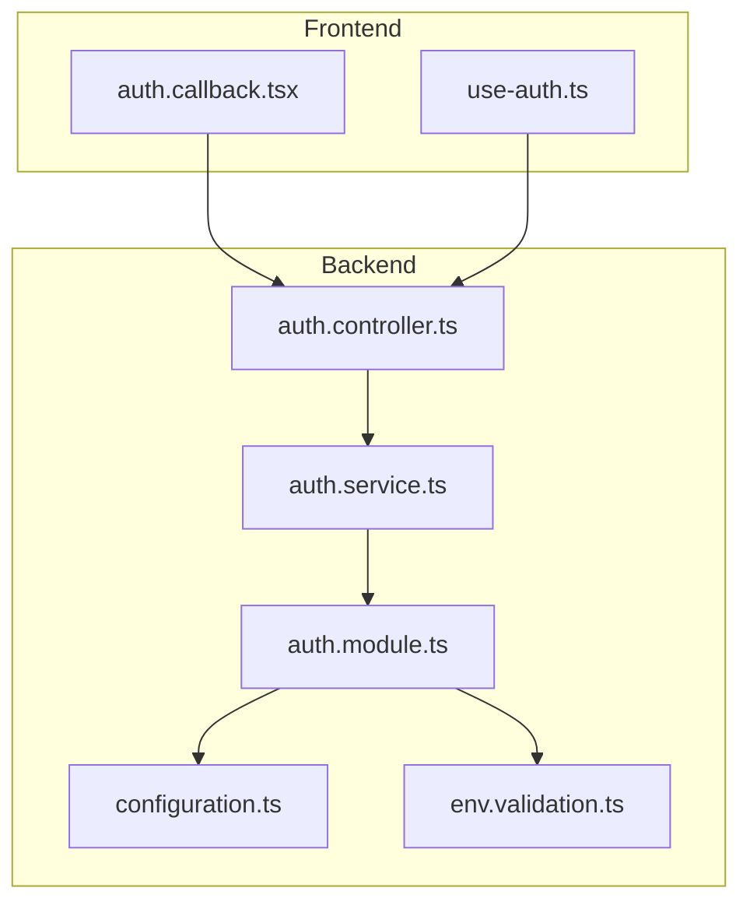
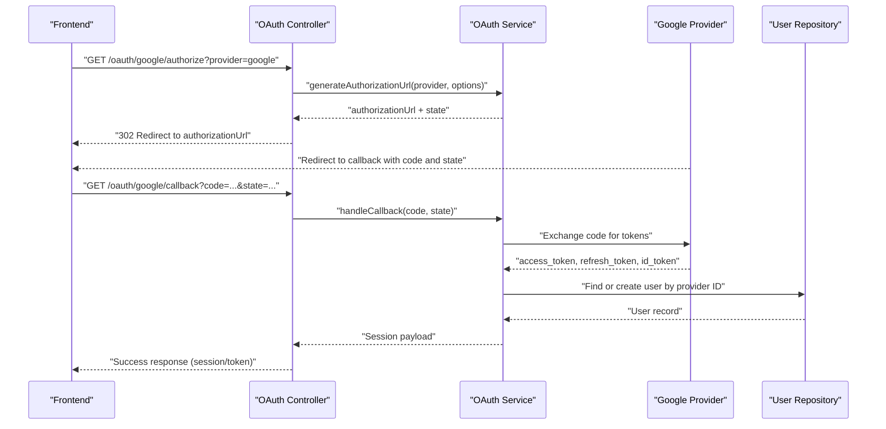
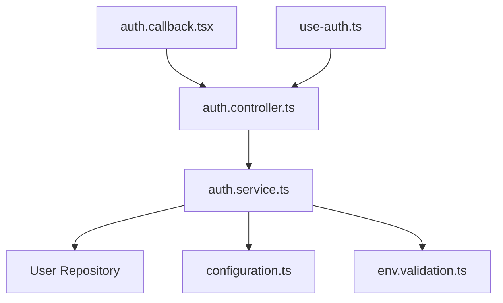

# OAuth Integration

<cite>
**Referenced Files in This Document**
- [auth.controller.ts](file://apps/backend/src/auth/auth.controller.ts)
- [auth.service.ts](file://apps/backend/src/auth/auth.service.ts)
- [auth.module.ts](file://apps/backend/src/auth/auth.module.ts)
- [configuration.ts](file://apps/backend/src/config/configuration.ts)
- [env.validation.ts](file://apps/backend/src/config/env.validation.ts)
- [auth.callback.tsx](file://src/routes/auth.callback.tsx)
- [use-auth.ts](file://src/hooks/use-auth.ts)
- [auth.e2e.spec.ts](file://apps/backend/test/auth.e2e.spec.ts)
</cite>

## Table of Contents
1. [Introduction](#introduction)
2. [Project Structure](#project-structure)
3. [Core Components](#core-components)
4. [Architecture Overview](#architecture-overview)
5. [Detailed Component Analysis](#detailed-component-analysis)
6. [Dependency Analysis](#dependency-analysis)
7. [Performance Considerations](#performance-considerations)
8. [Troubleshooting Guide](#troubleshooting-guide)
9. [Conclusion](#conclusion)
10. [Appendices](#appendices)

## Introduction
This document provides detailed API documentation for OAuth integration endpoints, focusing on Google OAuth implementation. It covers the authorization flow, callback handling, user profile synchronization, request/response schemas, state management, CSRF protection, secure token exchange, configuration examples, error handling, account linking scenarios, and multi-provider support architecture. Security considerations such as scope management, token storage, and user consent handling are also addressed.

## Project Structure
The OAuth functionality is implemented primarily in the backend NestJS application under the auth module, with frontend routes and hooks coordinating the client-side flow. Key areas include:
- Backend controllers and services for OAuth endpoints and business logic
- Configuration and environment validation for provider settings
- Frontend callback route and authentication hook for client-side orchestration
- End-to-end tests validating OAuth flows

**Diagram sources**
- [auth.callback.tsx](file://src/routes/auth.callback.tsx)
- [use-auth.ts](file://src/hooks/use-auth.ts)
- [auth.controller.ts](file://apps/backend/src/auth/auth.controller.ts)
- [auth.service.ts](file://apps/backend/src/auth/auth.service.ts)
- [auth.module.ts](file://apps/backend/src/auth/auth.module.ts)
- [configuration.ts](file://apps/backend/src/config/configuration.ts)
- [env.validation.ts](file://apps/backend/src/config/env.validation.ts)

**Section sources**
- [auth.controller.ts](file://apps/backend/src/auth/auth.controller.ts)
- [auth.service.ts](file://apps/backend/src/auth/auth.service.ts)
- [auth.module.ts](file://apps/backend/src/auth/auth.module.ts)
- [configuration.ts](file://apps/backend/src/config/configuration.ts)
- [env.validation.ts](file://apps/backend/src/config/env.validation.ts)
- [auth.callback.tsx](file://src/routes/auth.callback.tsx)
- [use-auth.ts](file://src/hooks/use-auth.ts)

## Core Components
- OAuth Controller: Exposes endpoints to initiate OAuth flows and handle provider callbacks.
- OAuth Service: Implements core logic for token exchange, profile retrieval, and user synchronization.
- Auth Module: Wires providers, guards, strategies, and dependencies.
- Configuration: Loads provider credentials, scopes, and redirect URIs from environment variables.
- Environment Validation: Ensures required OAuth settings are present and valid at startup.
- Frontend Callback Route: Processes the provider callback and exchanges tokens securely.
- Authentication Hook: Manages client-side state, redirects, and session handling.

**Section sources**
- [auth.controller.ts](file://apps/backend/src/auth/auth.controller.ts)
- [auth.service.ts](file://apps/backend/src/auth/auth.service.ts)
- [auth.module.ts](file://apps/backend/src/auth/auth.module.ts)
- [configuration.ts](file://apps/backend/src/config/configuration.ts)
- [env.validation.ts](file://apps/backend/src/config/env.validation.ts)
- [auth.callback.tsx](file://src/routes/auth.callback.tsx)
- [use-auth.ts](file://src/hooks/use-auth.ts)

## Architecture Overview
The OAuth flow involves the following steps:
1. Client initiates OAuth by calling the backend controller endpoint.
2. Controller delegates to the service to generate an authorization URL with state and nonce.
3. User authenticates with the provider and is redirected back to the callback endpoint.
4. The callback validates state, exchanges the code for tokens, and retrieves the user profile.
5. The service synchronizes or creates a local user record and returns session information.
6. The frontend processes the callback and establishes a session.

**Diagram sources**
- [auth.controller.ts](file://apps/backend/src/auth/auth.controller.ts)
- [auth.service.ts](file://apps/backend/src/auth/auth.service.ts)
- [auth.callback.tsx](file://src/routes/auth.callback.tsx)

## Detailed Component Analysis

### OAuth Controller
Responsibilities:
- Define endpoints for initiating OAuth authorization and handling provider callbacks.
- Validate incoming parameters and ensure secure state handling.
- Return appropriate HTTP responses and redirects.

Key behaviors:
- Authorization initiation: Generates provider-specific authorization URLs with state and optional nonce.
- Callback processing: Validates state, forwards code to the service, and returns session data.
- Error handling: Returns standardized error responses for invalid states, missing codes, and provider errors.

Request/Response Schemas:
- Initiate Authorization Request
  - Query parameters: provider (string), redirect_uri (optional string), scope (optional string array)
  - Response: 302 Redirect to provider authorization URL
- Callback Request
  - Query parameters: code (string), state (string), error (optional string)
  - Success Response: JSON object containing session token and user profile mapping
  - Error Response: JSON object with error code and message

Security considerations:
- State parameter validation to prevent CSRF attacks.
- Strict redirect URI validation against configured allowed values.
- Minimal scope requests based on feature requirements.

**Section sources**
- [auth.controller.ts](file://apps/backend/src/auth/auth.controller.ts)

### OAuth Service
Responsibilities:
- Implement token exchange with the provider using the authorization code.
- Retrieve and normalize user profile data from the provider.
- Synchronize user records in the local database, supporting account linking.
- Manage secure storage of tokens and refresh mechanisms.

Key behaviors:
- Token Exchange: Securely exchanges the authorization code for access and refresh tokens.
- Profile Retrieval: Fetches user profile fields and maps them to internal schema.
- User Sync: Creates or updates user records; handles conflicts during account linking.
- Session Management: Produces session payloads including tokens and user identifiers.

Data Structures:
- OAuthToken: Contains access_token, refresh_token, token_type, expires_in.
- UserProfile: Normalized fields such as id, email, name, avatar_url.
- SessionPayload: Includes user identifier, roles, and token metadata.

Error Handling:
- Invalid grant or expired codes.
- Network failures when contacting the provider.
- Profile mismatch or duplicate accounts requiring manual resolution.

**Section sources**
- [auth.service.ts](file://apps/backend/src/auth/auth.service.ts)

### Auth Module
Responsibilities:
- Configure OAuth providers and strategies.
- Register guards for protected routes.
- Inject dependencies for repositories and services.

Key behaviors:
- Provider registration: Adds Google OAuth strategy with client credentials and scopes.
- Guard wiring: Protects endpoints requiring authenticated users.
- Dependency injection: Connects controller and service layers with repositories and config.

**Section sources**
- [auth.module.ts](file://apps/backend/src/auth/auth.module.ts)

### Configuration and Environment Validation
Responsibilities:
- Load OAuth configuration from environment variables.
- Validate presence and format of required settings.

Key behaviors:
- Configuration keys: client_id, client_secret, redirect_uri, scopes, allowed_redirect_uris.
- Validation rules: Ensure non-empty secrets, valid URIs, and correct scope formats.
- Defaults: Provide safe defaults where applicable and fail fast if critical settings are missing.

**Section sources**
- [configuration.ts](file://apps/backend/src/config/configuration.ts)
- [env.validation.ts](file://apps/backend/src/config/env.validation.ts)

### Frontend Callback Route
Responsibilities:
- Handle provider callback in the browser context.
- Exchange authorization code for tokens securely via backend.
- Establish client session and redirect to app dashboard.

Key behaviors:
- Extract code and state from query parameters.
- Call backend callback endpoint and validate state.
- Store session tokens securely and navigate to protected routes.

**Section sources**
- [auth.callback.tsx](file://src/routes/auth.callback.tsx)

### Authentication Hook
Responsibilities:
- Manage client-side authentication state.
- Trigger OAuth initiation and process callback results.
- Handle logout and token refresh workflows.

Key behaviors:
- Initiate OAuth flow by redirecting to authorization endpoint.
- Process callback responses and update local state.
- Provide utilities for checking authentication status and permissions.

**Section sources**
- [use-auth.ts](file://src/hooks/use-auth.ts)

## Dependency Analysis
The OAuth system relies on several internal and external dependencies:
- Internal: Controllers depend on services; services depend on repositories and configuration modules.
- External: Google OAuth provider APIs for authorization and token exchange.
- Storage: Database for user records and token persistence.
- Frontend: Routes and hooks coordinate user interactions and session management.

**Diagram sources**
- [auth.controller.ts](file://apps/backend/src/auth/auth.controller.ts)
- [auth.service.ts](file://apps/backend/src/auth/auth.service.ts)
- [configuration.ts](file://apps/backend/src/config/configuration.ts)
- [env.validation.ts](file://apps/backend/src/config/env.validation.ts)
- [auth.callback.tsx](file://src/routes/auth.callback.tsx)
- [use-auth.ts](file://src/hooks/use-auth.ts)

**Section sources**
- [auth.controller.ts](file://apps/backend/src/auth/auth.controller.ts)
- [auth.service.ts](file://apps/backend/src/auth/auth.service.ts)
- [configuration.ts](file://apps/backend/src/config/configuration.ts)
- [env.validation.ts](file://apps/backend/src/config/env.validation.ts)
- [auth.callback.tsx](file://src/routes/auth.callback.tsx)
- [use-auth.ts](file://src/hooks/use-auth.ts)

## Performance Considerations
- Minimize network calls by caching provider profile data when appropriate.
- Use connection pooling for database operations during user synchronization.
- Implement retry logic with exponential backoff for transient provider errors.
- Avoid excessive logging of sensitive data such as tokens or user secrets.

[No sources needed since this section provides general guidance]

## Troubleshooting Guide
Common issues and resolutions:
- Invalid state parameter: Ensure state is generated server-side and validated on callback.
- Missing authorization code: Verify redirect URI configuration and provider settings.
- Token exchange failure: Check client credentials, scopes, and network connectivity.
- Profile synchronization errors: Inspect user record constraints and duplicate account handling.
- CSRF attacks: Enforce strict state validation and same-site cookie policies.

Validation and testing:
- Use end-to-end tests to simulate full OAuth flows and verify error paths.
- Validate environment configuration at startup to catch misconfigurations early.

**Section sources**
- [auth.e2e.spec.ts](file://apps/backend/test/auth.e2e.spec.ts)

## Conclusion
The OAuth integration provides a secure and extensible foundation for Google authentication. By adhering to best practices in state management, CSRF protection, and token handling, the system ensures robust user authentication and profile synchronization. The modular design supports multi-provider expansion and maintains clear separation of concerns across controller, service, and configuration layers.

[No sources needed since this section summarizes without analyzing specific files]

## Appendices

### OAuth Configuration Example
- Required environment variables:
  - GOOGLE_CLIENT_ID: Provider client identifier
  - GOOGLE_CLIENT_SECRET: Provider secret
  - GOOGLE_REDIRECT_URI: Authorized callback URL
  - GOOGLE_SCOPES: Comma-separated list of requested scopes
- Allowed redirect URIs should be explicitly configured to prevent open redirect vulnerabilities.

**Section sources**
- [configuration.ts](file://apps/backend/src/config/configuration.ts)
- [env.validation.ts](file://apps/backend/src/config/env.validation.ts)

### Request/Response Schemas Summary
- Initiate Authorization
  - Request: GET /oauth/google/authorize?provider=google&redirect_uri=<uri>&scope=<scopes>
  - Response: 302 Redirect to provider authorization URL
- Callback Processing
  - Request: GET /oauth/google/callback?code=<code>&state=<state>
  - Success Response: { "token": "<jwt>", "user": { "id": "<uuid>", "email": "<email>", "name": "<name>" } }
  - Error Response: { "error": "invalid_grant", "message": "Authorization code is invalid or expired" }

**Section sources**
- [auth.controller.ts](file://apps/backend/src/auth/auth.controller.ts)
- [auth.service.ts](file://apps/backend/src/auth/auth.service.ts)

### Security Considerations
- Scope Management: Request only necessary scopes to minimize risk.
- Token Storage: Store tokens securely using httpOnly cookies or encrypted storage.
- User Consent: Clearly communicate requested permissions and allow users to revoke access.
- Multi-Provider Support: Abstract provider interfaces to enable consistent behavior across different OAuth providers.

**Section sources**
- [auth.service.ts](file://apps/backend/src/auth/auth.service.ts)
- [auth.module.ts](file://apps/backend/src/auth/auth.module.ts)