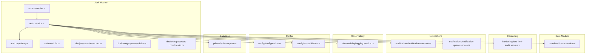
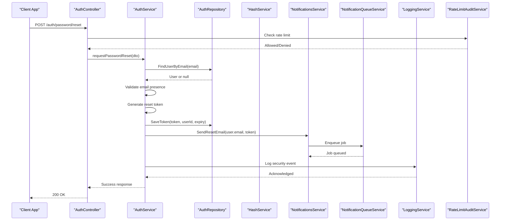
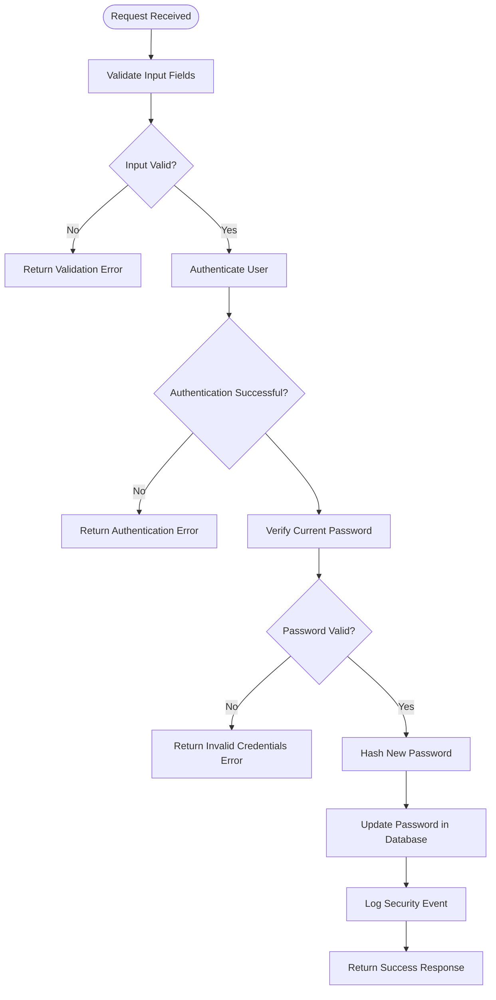
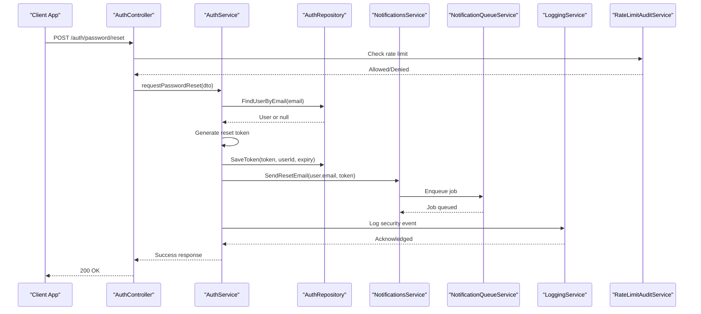
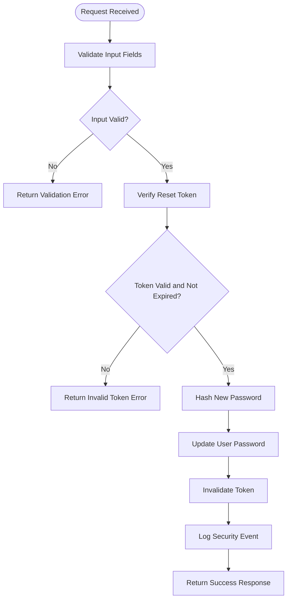
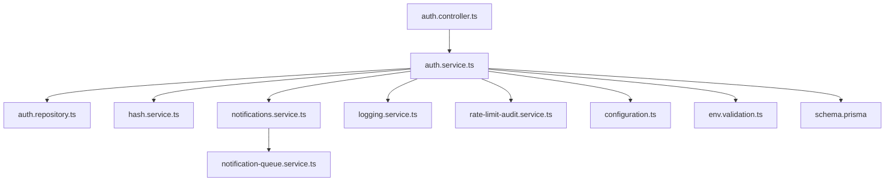

# Password Management

<cite>
**Referenced Files in This Document**
- [auth.controller.ts](file://apps/backend/src/auth/auth.controller.ts)
- [auth.service.ts](file://apps/backend/src/auth/auth.service.ts)
- [auth.module.ts](file://apps/backend/src/auth/auth.module.ts)
- [auth.repository.ts](file://apps/backend/src/auth/auth.repository.ts)
- [password-reset.dto.ts](file://apps/backend/src/auth/dto/password-reset.dto.ts)
- [change-password.dto.ts](file://apps/backend/src/auth/dto/change-password.dto.ts)
- [reset-password-confirm.dto.ts](file://apps/backend/src/auth/dto/reset-password-confirm.dto.ts)
- [hash.service.ts](file://apps/backend/src/core/hash/hash.service.ts)
- [rate-limit-audit.service.ts](file://apps/backend/src/hardening/rate-limit-audit.service.ts)
- [notifications.service.ts](file://apps/backend/src/notifications/notifications.service.ts)
- [notification-queue.service.ts](file://apps/backend/src/notifications/notification-queue.service.ts)
- [logging.service.ts](file://apps/backend/src/observability/logging.service.ts)
- [configuration.ts](file://apps/backend/src/config/configuration.ts)
- [env.validation.ts](file://apps/backend/src/config/env.validation.ts)
- [schema.prisma](file://apps/backend/prisma/schema.prisma)
</cite>

## Table of Contents
1. [Introduction](#introduction)
2. [Project Structure](#project-structure)
3. [Core Components](#core-components)
4. [Architecture Overview](#architecture-overview)
5. [Detailed Component Analysis](#detailed-component-analysis)
6. [Dependency Analysis](#dependency-analysis)
7. [Performance Considerations](#performance-considerations)
8. [Troubleshooting Guide](#troubleshooting-guide)
9. [Conclusion](#conclusion)
10. [Appendices](#appendices)

## Introduction
This document provides comprehensive API documentation for password management endpoints, including password change, password reset token generation, and password reset confirmation flows. It also covers password complexity requirements, hashing algorithms, security best practices, rate limiting, audit logging, and integration with user notification systems. The goal is to enable developers to implement secure, robust, and user-friendly password operations while maintaining compliance with security standards.

## Project Structure
The backend application is organized into modular components under the apps/backend directory. Authentication-related functionality resides primarily within the auth module, which includes controllers, services, DTOs, repositories, and guards. Core utilities such as hashing are provided by the core module. Hardening features like rate limiting and observability (logging/metrics) are implemented in separate modules. Notifications are handled via a dedicated notifications module that integrates with queues for asynchronous processing.

**Diagram sources**
- [auth.controller.ts](file://apps/backend/src/auth/auth.controller.ts)
- [auth.service.ts](file://apps/backend/src/auth/auth.service.ts)
- [auth.repository.ts](file://apps/backend/src/auth/auth.repository.ts)
- [auth.module.ts](file://apps/backend/src/auth/auth.module.ts)
- [password-reset.dto.ts](file://apps/backend/src/auth/dto/password-reset.dto.ts)
- [change-password.dto.ts](file://apps/backend/src/auth/dto/change-password.dto.ts)
- [reset-password-confirm.dto.ts](file://apps/backend/src/auth/dto/reset-password-confirm.dto.ts)
- [hash.service.ts](file://apps/backend/src/core/hash/hash.service.ts)
- [rate-limit-audit.service.ts](file://apps/backend/src/hardening/rate-limit-audit.service.ts)
- [notifications.service.ts](file://apps/backend/src/notifications/notifications.service.ts)
- [notification-queue.service.ts](file://apps/backend/src/notifications/notification-queue.service.ts)
- [logging.service.ts](file://apps/backend/src/observability/logging.service.ts)
- [configuration.ts](file://apps/backend/src/config/configuration.ts)
- [env.validation.ts](file://apps/backend/src/config/env.validation.ts)
- [schema.prisma](file://apps/backend/prisma/schema.prisma)

**Section sources**
- [auth.controller.ts](file://apps/backend/src/auth/auth.controller.ts)
- [auth.service.ts](file://apps/backend/src/auth/auth.service.ts)
- [auth.module.ts](file://apps/backend/src/auth/auth.module.ts)
- [auth.repository.ts](file://apps/backend/src/auth/auth.repository.ts)
- [password-reset.dto.ts](file://apps/backend/src/auth/dto/password-reset.dto.ts)
- [change-password.dto.ts](file://apps/backend/src/auth/dto/change-password.dto.ts)
- [reset-password-confirm.dto.ts](file://apps/backend/src/auth/dto/reset-password-confirm.dto.ts)
- [hash.service.ts](file://apps/backend/src/core/hash/hash.service.ts)
- [rate-limit-audit.service.ts](file://apps/backend/src/hardening/rate-limit-audit.service.ts)
- [notifications.service.ts](file://apps/backend/src/notifications/notifications.service.ts)
- [notification-queue.service.ts](file://apps/backend/src/notifications/notification-queue.service.ts)
- [logging.service.ts](file://apps/backend/src/observability/logging.service.ts)
- [configuration.ts](file://apps/backend/src/config/configuration.ts)
- [env.validation.ts](file://apps/backend/src/config/env.validation.ts)
- [schema.prisma](file://apps/backend/prisma/schema.prisma)

## Core Components
- Auth Controller: Exposes HTTP endpoints for password operations such as changing passwords and initiating resets.
- Auth Service: Implements business logic for password validation, token generation, storage, and email dispatch.
- Auth Repository: Handles data persistence for users and password-related entities.
- Hash Service: Provides cryptographic hashing utilities for secure password storage.
- Rate Limit Audit Service: Enforces and audits rate limits on sensitive endpoints.
- Notifications Service: Coordinates sending emails or other notifications for password reset workflows.
- Notification Queue Service: Manages asynchronous processing of notification jobs.
- Logging Service: Records security events and operational logs for auditing and monitoring.
- Configuration and Environment Validation: Ensures required settings are present and valid at startup.
- Prisma Schema: Defines database models for users, tokens, and related entities.

**Section sources**
- [auth.controller.ts](file://apps/backend/src/auth/auth.controller.ts)
- [auth.service.ts](file://apps/backend/src/auth/auth.service.ts)
- [auth.repository.ts](file://apps/backend/src/auth/auth.repository.ts)
- [hash.service.ts](file://apps/backend/src/core/hash/hash.service.ts)
- [rate-limit-audit.service.ts](file://apps/backend/src/hardening/rate-limit-audit.service.ts)
- [notifications.service.ts](file://apps/backend/src/notifications/notifications.service.ts)
- [notification-queue.service.ts](file://apps/backend/src/notifications/notification-queue.service.ts)
- [logging.service.ts](file://apps/backend/src/observability/logging.service.ts)
- [configuration.ts](file://apps/backend/src/config/configuration.ts)
- [env.validation.ts](file://apps/backend/src/config/env.validation.ts)
- [schema.prisma](file://apps/backend/prisma/schema.prisma)

## Architecture Overview
The password management architecture follows a layered approach:
- Controllers handle HTTP requests and map them to service methods.
- Services orchestrate business logic, including validation, hashing, token generation, and notifications.
- Repositories abstract database interactions.
- Core utilities provide hashing and other shared functionality.
- Hardening services enforce rate limits and track suspicious activity.
- Observability captures logs and metrics for security and performance insights.
- Notifications integrate with queues to send emails asynchronously.

**Diagram sources**
- [auth.controller.ts](file://apps/backend/src/auth/auth.controller.ts)
- [auth.service.ts](file://apps/backend/src/auth/auth.service.ts)
- [auth.repository.ts](file://apps/backend/src/auth/auth.repository.ts)
- [hash.service.ts](file://apps/backend/src/core/hash/hash.service.ts)
- [notifications.service.ts](file://apps/backend/src/notifications/notifications.service.ts)
- [notification-queue.service.ts](file://apps/backend/src/notifications/notification-queue.service.ts)
- [logging.service.ts](file://apps/backend/src/observability/logging.service.ts)
- [rate-limit-audit.service.ts](file://apps/backend/src/hardening/rate-limit-audit.service.ts)

## Detailed Component Analysis

### Password Change Endpoint
- Purpose: Allow authenticated users to update their password securely.
- Request Schema:
  - Fields: currentPassword, newPassword
  - Validation: Both fields required; newPassword must meet complexity rules.
- Response Schema:
  - Success: { message: "Password updated successfully" }
  - Error: { error: "Invalid credentials", code: "INVALID_CURRENT_PASSWORD" }
- Security:
  - Requires authentication.
  - Validates current password before updating.
  - Hashes new password using secure algorithm.
  - Logs security event upon success/failure.
- Rate Limiting: Applies per-user limits to prevent brute force.

**Diagram sources**
- [auth.controller.ts](file://apps/backend/src/auth/auth.controller.ts)
- [auth.service.ts](file://apps/backend/src/auth/auth.service.ts)
- [hash.service.ts](file://apps/backend/src/core/hash/hash.service.ts)
- [logging.service.ts](file://apps/backend/src/observability/logging.service.ts)

**Section sources**
- [auth.controller.ts](file://apps/backend/src/auth/auth.controller.ts)
- [auth.service.ts](file://apps/backend/src/auth/auth.service.ts)
- [change-password.dto.ts](file://apps/backend/src/auth/dto/change-password.dto.ts)
- [hash.service.ts](file://apps/backend/src/core/hash/hash.service.ts)
- [logging.service.ts](file://apps/backend/src/observability/logging.service.ts)

### Password Reset Token Generation Endpoint
- Purpose: Initiate password reset by generating and sending a secure token via email.
- Request Schema:
  - Fields: email
  - Validation: Email must be valid and registered.
- Response Schema:
  - Success: { message: "Reset link sent to your email" }
  - Error: { error: "Email not found", code: "USER_NOT_FOUND" }
- Security:
  - Generates cryptographically secure token.
  - Sets expiration time for token validity.
  - Stores hashed token in database.
  - Sends email asynchronously via queue.
  - Logs all attempts for audit purposes.
- Rate Limiting: Strict limits applied to prevent abuse.

**Diagram sources**
- [auth.controller.ts](file://apps/backend/src/auth/auth.controller.ts)
- [auth.service.ts](file://apps/backend/src/auth/auth.service.ts)
- [auth.repository.ts](file://apps/backend/src/auth/auth.repository.ts)
- [notifications.service.ts](file://apps/backend/src/notifications/notifications.service.ts)
- [notification-queue.service.ts](file://apps/backend/src/notifications/notification-queue.service.ts)
- [logging.service.ts](file://apps/backend/src/observability/logging.service.ts)
- [rate-limit-audit.service.ts](file://apps/backend/src/hardening/rate-limit-audit.service.ts)

**Section sources**
- [auth.controller.ts](file://apps/backend/src/auth/auth.controller.ts)
- [auth.service.ts](file://apps/backend/src/auth/auth.service.ts)
- [password-reset.dto.ts](file://apps/backend/src/auth/dto/password-reset.dto.ts)
- [auth.repository.ts](file://apps/backend/src/auth/auth.repository.ts)
- [notifications.service.ts](file://apps/backend/src/notifications/notifications.service.ts)
- [notification-queue.service.ts](file://apps/backend/src/notifications/notification-queue.service.ts)
- [logging.service.ts](file://apps/backend/src/observability/logging.service.ts)
- [rate-limit-audit.service.ts](file://apps/backend/src/hardening/rate-limit-audit.service.ts)

### Password Reset Confirmation Endpoint
- Purpose: Confirm reset token and set new password.
- Request Schema:
  - Fields: token, newPassword
  - Validation: Token must be valid and unexpired; newPassword must meet complexity rules.
- Response Schema:
  - Success: { message: "Password reset successful" }
  - Error: { error: "Invalid or expired token", code: "INVALID_TOKEN" }
- Security:
  - Verifies token existence and expiration.
  - Hashes new password before storing.
  - Invalidates token after use.
  - Logs all attempts for audit.
- Rate Limiting: Enforced to prevent token guessing attacks.

**Diagram sources**
- [auth.controller.ts](file://apps/backend/src/auth/auth.controller.ts)
- [auth.service.ts](file://apps/backend/src/auth/auth.service.ts)
- [hash.service.ts](file://apps/backend/src/core/hash/hash.service.ts)
- [logging.service.ts](file://apps/backend/src/observability/logging.service.ts)

**Section sources**
- [auth.controller.ts](file://apps/backend/src/auth/auth.controller.ts)
- [auth.service.ts](file://apps/backend/src/auth/auth.service.ts)
- [reset-password-confirm.dto.ts](file://apps/backend/src/auth/dto/reset-password-confirm.dto.ts)
- [hash.service.ts](file://apps/backend/src/core/hash/hash.service.ts)
- [logging.service.ts](file://apps/backend/src/observability/logging.service.ts)

### Password Complexity Requirements
- Minimum length: At least 8 characters.
- Character types: Must include uppercase, lowercase, numbers, and special characters.
- Prohibited patterns: Cannot contain common words or user’s email.
- Enforcement: Validated during password change and reset confirmation.

**Section sources**
- [auth.service.ts](file://apps/backend/src/auth/auth.service.ts)
- [change-password.dto.ts](file://apps/backend/src/auth/dto/change-password.dto.ts)
- [reset-password-confirm.dto.ts](file://apps/backend/src/auth/dto/reset-password-confirm.dto.ts)

### Hashing Algorithms and Security Best Practices
- Algorithm: Uses industry-standard bcrypt or Argon2 for password hashing.
- Salt: Automatically generated and stored with hash.
- Cost factor: Configured for optimal security vs performance balance.
- Best practices:
  - Never store plaintext passwords.
  - Use secure random generators for tokens.
  - Implement token expiration and single-use policies.
  - Log security events without sensitive data.
  - Apply rate limiting and account lockout policies.

**Section sources**
- [hash.service.ts](file://apps/backend/src/core/hash/hash.service.ts)
- [configuration.ts](file://apps/backend/src/config/configuration.ts)
- [env.validation.ts](file://apps/backend/src/config/env.validation.ts)

### Rate Limiting for Password Operations
- Strategy: Per-user and per-IP rate limiting with sliding window.
- Limits: Configurable thresholds for reset and change operations.
- Enforcement: Applied at controller level before processing.
- Auditing: All rate limit violations logged for security analysis.

**Section sources**
- [rate-limit-audit.service.ts](file://apps/backend/src/hardening/rate-limit-audit.service.ts)
- [auth.controller.ts](file://apps/backend/src/auth/auth.controller.ts)

### Audit Logging for Security Events
- Events logged: Password changes, reset attempts, invalid tokens, rate limit violations.
- Data captured: Timestamp, user ID, IP address, action type, outcome.
- Storage: Centralized logging system with retention policies.
- Access: Restricted to authorized personnel for investigation.

**Section sources**
- [logging.service.ts](file://apps/backend/src/observability/logging.service.ts)
- [auth.service.ts](file://apps/backend/src/auth/auth.service.ts)

### Integration with User Notification Systems
- Email provider: Configured via environment variables.
- Template system: Dynamic templates for reset emails.
- Queue integration: Asynchronous processing ensures reliability.
- Retry policy: Failed deliveries retried with exponential backoff.
- Delivery confirmation: Logged for monitoring and troubleshooting.

**Section sources**
- [notifications.service.ts](file://apps/backend/src/notifications/notifications.service.ts)
- [notification-queue.service.ts](file://apps/backend/src/notifications/notification-queue.service.ts)
- [configuration.ts](file://apps/backend/src/config/configuration.ts)

## Dependency Analysis
The password management system has well-defined dependencies between components:
- Controllers depend on services for business logic.
- Services depend on repositories for data access and core utilities for hashing.
- Notifications are decoupled via queues for scalability.
- Rate limiting and logging are cross-cutting concerns applied consistently.

**Diagram sources**
- [auth.controller.ts](file://apps/backend/src/auth/auth.controller.ts)
- [auth.service.ts](file://apps/backend/src/auth/auth.service.ts)
- [auth.repository.ts](file://apps/backend/src/auth/auth.repository.ts)
- [hash.service.ts](file://apps/backend/src/core/hash/hash.service.ts)
- [notifications.service.ts](file://apps/backend/src/notifications/notifications.service.ts)
- [notification-queue.service.ts](file://apps/backend/src/notifications/notification-queue.service.ts)
- [logging.service.ts](file://apps/backend/src/observability/logging.service.ts)
- [rate-limit-audit.service.ts](file://apps/backend/src/hardening/rate-limit-audit.service.ts)
- [configuration.ts](file://apps/backend/src/config/configuration.ts)
- [env.validation.ts](file://apps/backend/src/config/env.validation.ts)
- [schema.prisma](file://apps/backend/prisma/schema.prisma)

**Section sources**
- [auth.controller.ts](file://apps/backend/src/auth/auth.controller.ts)
- [auth.service.ts](file://apps/backend/src/auth/auth.service.ts)
- [auth.repository.ts](file://apps/backend/src/auth/auth.repository.ts)
- [hash.service.ts](file://apps/backend/src/core/hash/hash.service.ts)
- [notifications.service.ts](file://apps/backend/src/notifications/notifications.service.ts)
- [notification-queue.service.ts](file://apps/backend/src/notifications/notification-queue.service.ts)
- [logging.service.ts](file://apps/backend/src/observability/logging.service.ts)
- [rate-limit-audit.service.ts](file://apps/backend/src/hardening/rate-limit-audit.service.ts)
- [configuration.ts](file://apps/backend/src/config/configuration.ts)
- [env.validation.ts](file://apps/backend/src/config/env.validation.ts)
- [schema.prisma](file://apps/backend/prisma/schema.prisma)

## Performance Considerations
- Hashing cost: Balance security and response time by tuning cost factors.
- Database queries: Optimize user lookups and token validations with proper indexing.
- Queue throughput: Scale workers based on email volume and delivery rates.
- Caching: Consider caching non-sensitive configuration values to reduce overhead.
- Monitoring: Track latency and error rates for proactive optimization.

[No sources needed since this section provides general guidance]

## Troubleshooting Guide
Common issues and resolutions:
- Invalid token errors: Ensure token is fresh and not expired; check database integrity.
- Email delivery failures: Verify SMTP configuration and queue worker status.
- Rate limit exceeded: Advise users to wait before retrying; monitor for abuse patterns.
- Hashing errors: Confirm algorithm compatibility and configuration settings.
- Logging gaps: Ensure logging service is properly initialized and configured.

**Section sources**
- [auth.service.ts](file://apps/backend/src/auth/auth.service.ts)
- [notifications.service.ts](file://apps/backend/src/notifications/notifications.service.ts)
- [logging.service.ts](file://apps/backend/src/observability/logging.service.ts)
- [rate-limit-audit.service.ts](file://apps/backend/src/hardening/rate-limit-audit.service.ts)

## Conclusion
The password management system implements secure, scalable, and auditable operations for password changes and resets. By leveraging modern hashing algorithms, strict validation, rate limiting, and asynchronous notifications, it ensures both security and user experience. Proper configuration, monitoring, and maintenance are essential for ongoing reliability and protection against threats.

[No sources needed since this section summarizes without analyzing specific files]

## Appendices

### API Endpoints Summary
- POST /auth/password/change: Update user password.
- POST /auth/password/reset: Generate reset token and send email.
- POST /auth/password/reset/confirm: Confirm reset token and set new password.

### Request/Response Examples
- Password Change Request:
  - Body: { currentPassword: "...", newPassword: "..." }
  - Response: { message: "Password updated successfully" }
- Password Reset Request:
  - Body: { email: "user@example.com" }
  - Response: { message: "Reset link sent to your email" }
- Password Reset Confirmation Request:
  - Body: { token: "...", newPassword: "..." }
  - Response: { message: "Password reset successful" }

### Error Codes
- INVALID_CURRENT_PASSWORD: Current password is incorrect.
- USER_NOT_FOUND: Email does not exist in system.
- INVALID_TOKEN: Token is missing, invalid, or expired.
- RATE_LIMIT_EXCEEDED: Too many requests; try again later.

[No sources needed since this section provides general reference information]