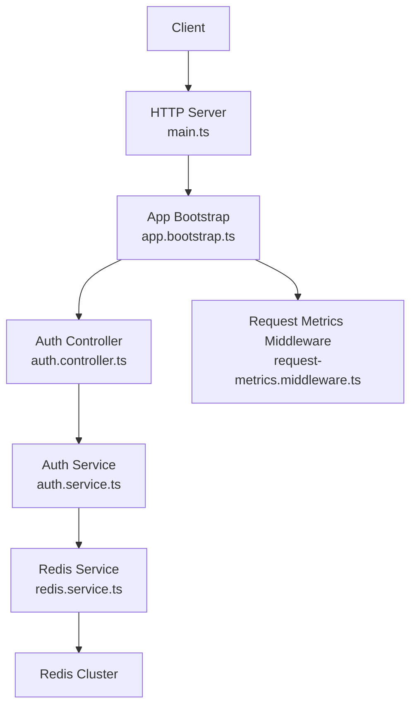
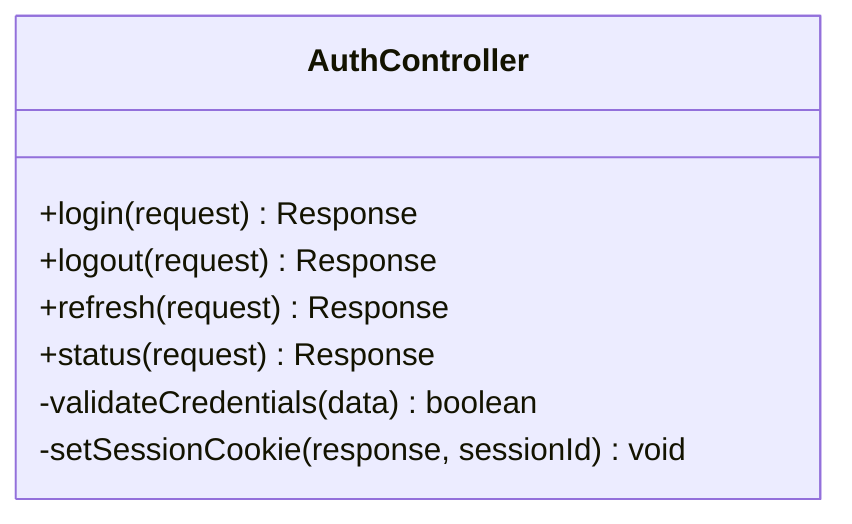
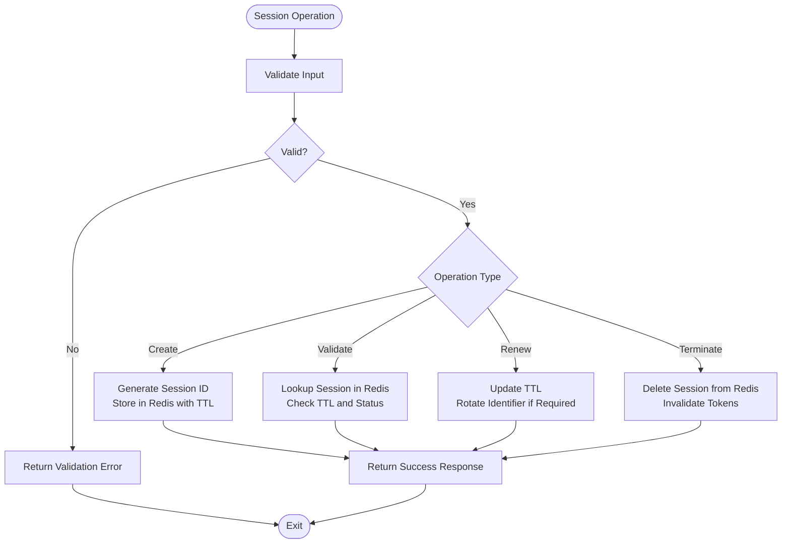
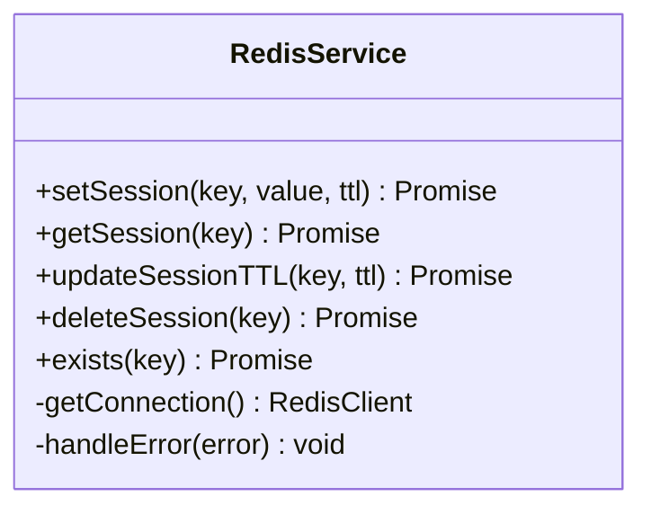
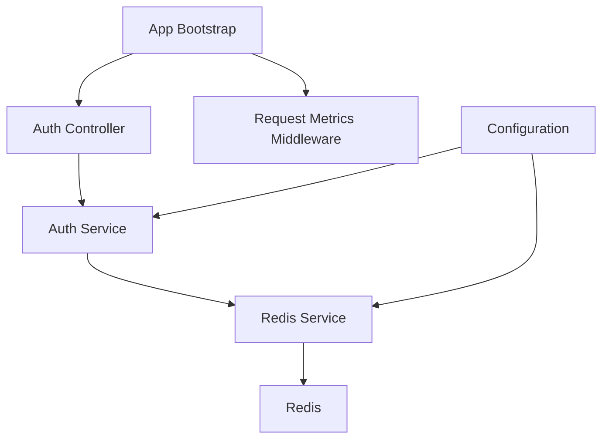

# Session Management

<cite>
**Referenced Files in This Document**
- [auth.controller.ts](file://apps/backend/src/auth/auth.controller.ts)
- [auth.service.ts](file://apps/backend/src/auth/auth.service.ts)
- [auth.module.ts](file://apps/backend/src/auth/auth.module.ts)
- [redis.service.ts](file://apps/backend/src/redis/redis.service.ts)
- [redis.module.ts](file://apps/backend/src/redis/redis.module.ts)
- [configuration.ts](file://apps/backend/src/config/configuration.ts)
- [env.validation.ts](file://apps/backend/src/config/env.validation.ts)
- [request-metrics.middleware.ts](file://apps/backend/src/observability/request-metrics.middleware.ts)
- [app.bootstrap.ts](file://apps/backend/src/app.bootstrap.ts)
- [main.ts](file://apps/backend/src/main.ts)
- [load.yml](file://apps/backend/loadtests/artillery/load.yml)
- [smoke.yml](file://apps/backend/loadtests/artillery/smoke.yml)
</cite>

## Table of Contents
1. [Introduction](#introduction)
2. [Project Structure](#project-structure)
3. [Core Components](#core-components)
4. [Architecture Overview](#architecture-overview)
5. [Detailed Component Analysis](#detailed-component-analysis)
6. [Dependency Analysis](#dependency-analysis)
7. [Performance Considerations](#performance-considerations)
8. [Troubleshooting Guide](#troubleshooting-guide)
9. [Conclusion](#conclusion)
10. [Appendices](#appendices)

## Introduction
This document provides comprehensive API documentation for session management endpoints and functionality within the backend application. It covers session creation, validation, and termination; cookie-based session handling; storage strategies (including Redis-backed distributed sessions); concurrent session management; lifecycle and timeout policies; and security measures such as CSRF protection and session fixation prevention. It also includes examples for initialization, middleware usage, and cleanup procedures, along with performance optimization techniques for high-concurrency environments.

## Project Structure
The session management features are primarily implemented under the authentication module and integrated with Redis for distributed storage. The key files include:
- Authentication controller exposing HTTP endpoints
- Authentication service implementing business logic
- Redis service for distributed session storage
- Configuration and environment validation for session settings
- Bootstrap and main entry points where global middleware is configured
- Observability middleware for request metrics



**Diagram sources**
- [main.ts](file://apps/backend/src/main.ts)
- [app.bootstrap.ts](file://apps/backend/src/app.bootstrap.ts)
- [auth.controller.ts](file://apps/backend/src/auth/auth.controller.ts)
- [auth.service.ts](file://apps/backend/src/auth/auth.service.ts)
- [redis.service.ts](file://apps/backend/src/redis/redis.service.ts)

**Section sources**
- [auth.controller.ts](file://apps/backend/src/auth/auth.controller.ts)
- [auth.service.ts](file://apps/backend/src/auth/auth.service.ts)
- [auth.module.ts](file://apps/backend/src/auth/auth.module.ts)
- [redis.service.ts](file://apps/backend/src/redis/redis.service.ts)
- [redis.module.ts](file://apps/backend/src/redis/redis.module.ts)
- [configuration.ts](file://apps/backend/src/config/configuration.ts)
- [env.validation.ts](file://apps/backend/src/config/env.validation.ts)
- [request-metrics.middleware.ts](file://apps/backend/src/observability/request-metrics.middleware.ts)
- [app.bootstrap.ts](file://apps/backend/src/app.bootstrap.ts)
- [main.ts](file://apps/backend/src/main.ts)

## Core Components
- Authentication Controller: Exposes endpoints for login, logout, refresh, and session status checks. Handles HTTP requests/responses and integrates with the auth service.
- Authentication Service: Implements session lifecycle operations including creation, validation, renewal, and termination. Coordinates with Redis for persistence and concurrency control.
- Redis Service: Provides a typed interface to Redis for storing session data, managing TTLs, atomic operations, and distributed locks when necessary.
- Configuration: Centralizes session-related settings such as cookie options, TTLs, secure flags, and Redis connection parameters.
- Bootstrap/Main: Registers global middleware (e.g., CSRF, rate limiting, observability) and configures session handling at the application level.

Key responsibilities:
- Create sessions on successful authentication and set secure cookies
- Validate sessions per request using middleware or guards
- Renew sessions based on configurable policies
- Terminate sessions securely on logout and invalidate tokens
- Persist sessions in Redis for horizontal scaling and failover

**Section sources**
- [auth.controller.ts](file://apps/backend/src/auth/auth.controller.ts)
- [auth.service.ts](file://apps/backend/src/auth/auth.service.ts)
- [redis.service.ts](file://apps/backend/src/redis/redis.service.ts)
- [configuration.ts](file://apps/backend/src/config/configuration.ts)
- [app.bootstrap.ts](file://apps/backend/src/app.bootstrap.ts)
- [main.ts](file://apps/backend/src/main.ts)

## Architecture Overview
The session architecture follows a layered approach:
- HTTP layer: Controllers handle incoming requests and return responses with appropriate cookies
- Service layer: Business logic orchestrates session operations and interacts with storage
- Storage layer: Redis stores session payloads with TTLs and supports atomic updates
- Middleware: Global handlers enforce security (CSRF), observability, and rate limiting

```mermaid
sequenceDiagram
participant C as "Client"
participant M as "HTTP Server"
participant A as "Auth Controller"
participant S as "Auth Service"
participant R as "Redis Service"
participant D as "Redis"
C->>M : POST /auth/login
M->>A : Route to login handler
A->>S : createSession(credentials)
S->>R : storeSession(sessionId, payload, ttl)
R->>D : SET session : <id> payload EX ttl
D-->>R : OK
R-->>S : success
S-->>A : {sessionId, token}
A-->>C : Set-Cookie : session=...; HttpOnly; Secure; SameSite
```

**Diagram sources**
- [auth.controller.ts](file://apps/backend/src/auth/auth.controller.ts)
- [auth.service.ts](file://apps/backend/src/auth/auth.service.ts)
- [redis.service.ts](file://apps/backend/src/redis/redis.service.ts)

## Detailed Component Analysis

### Authentication Controller
Responsibilities:
- Define endpoints for session lifecycle: login, logout, refresh, status
- Parse and validate request bodies and headers
- Return standardized responses and set cookies for session persistence
- Integrate with CSRF protection via middleware configuration

Security considerations:
- Enforce HTTPS-only cookies
- Use HttpOnly and Secure flags
- Apply SameSite policy to mitigate cross-site attacks
- Ensure proper error responses without leaking sensitive information



**Diagram sources**
- [auth.controller.ts](file://apps/backend/src/auth/auth.controller.ts)

**Section sources**
- [auth.controller.ts](file://apps/backend/src/auth/auth.controller.ts)

### Authentication Service
Responsibilities:
- Implement session creation, validation, renewal, and termination
- Manage session metadata (user ID, roles, timestamps)
- Coordinate with Redis for persistence and concurrency control
- Enforce timeout policies and rotation of session identifiers

Concurrency and consistency:
- Use atomic Redis operations to prevent race conditions
- Implement distributed locks for critical sections if needed
- Handle retries and backoff for transient failures



**Diagram sources**
- [auth.service.ts](file://apps/backend/src/auth/auth.service.ts)
- [redis.service.ts](file://apps/backend/src/redis/redis.service.ts)

**Section sources**
- [auth.service.ts](file://apps/backend/src/auth/auth.service.ts)

### Redis Service
Responsibilities:
- Provide methods for setting, getting, updating, and deleting session data
- Manage TTLs and expiration policies
- Support atomic operations and conditional updates
- Handle connection pooling and error recovery

Performance optimizations:
- Use pipelining for batch operations
- Implement connection reuse and health checks
- Configure timeouts and retry policies



**Diagram sources**
- [redis.service.ts](file://apps/backend/src/redis/redis.service.ts)

**Section sources**
- [redis.service.ts](file://apps/backend/src/redis/redis.service.ts)
- [redis.module.ts](file://apps/backend/src/redis/redis.module.ts)

### Configuration and Environment Validation
Responsibilities:
- Define session-related configuration keys (cookie settings, TTLs, Redis URLs)
- Validate environment variables at startup
- Provide defaults for development and production environments

Security settings:
- Enforce secure cookie flags
- Configure CSRF tokens and origins
- Set appropriate CORS policies

**Section sources**
- [configuration.ts](file://apps/backend/src/config/configuration.ts)
- [env.validation.ts](file://apps/backend/src/config/env.validation.ts)

### Bootstrap and Main Entry Points
Responsibilities:
- Register global middleware (CSRF, rate limiting, observability)
- Configure session handling at the application level
- Initialize Redis connections and health checks

Middleware integration:
- Apply CSRF protection to state-changing endpoints
- Enable request metrics collection
- Set up error handling and logging

**Section sources**
- [app.bootstrap.ts](file://apps/backend/src/app.bootstrap.ts)
- [main.ts](file://apps/backend/src/main.ts)
- [request-metrics.middleware.ts](file://apps/backend/src/observability/request-metrics.middleware.ts)

## Dependency Analysis
The session management system has clear dependencies between layers:
- Controllers depend on services for business logic
- Services depend on Redis for persistence
- Configuration drives behavior across components
- Middleware affects request processing globally



**Diagram sources**
- [auth.controller.ts](file://apps/backend/src/auth/auth.controller.ts)
- [auth.service.ts](file://apps/backend/src/auth/auth.service.ts)
- [redis.service.ts](file://apps/backend/src/redis/redis.service.ts)
- [app.bootstrap.ts](file://apps/backend/src/app.bootstrap.ts)
- [configuration.ts](file://apps/backend/src/config/configuration.ts)

**Section sources**
- [auth.controller.ts](file://apps/backend/src/auth/auth.controller.ts)
- [auth.service.ts](file://apps/backend/src/auth/auth.service.ts)
- [redis.service.ts](file://apps/backend/src/redis/redis.service.ts)
- [app.bootstrap.ts](file://apps/backend/src/app.bootstrap.ts)
- [configuration.ts](file://apps/backend/src/config/configuration.ts)

## Performance Considerations
For high-concurrency environments:
- Use connection pooling for Redis to minimize overhead
- Implement caching strategies for frequently accessed session data
- Optimize TTL values to balance memory usage and session longevity
- Monitor Redis latency and adjust timeouts accordingly
- Use load testing tools to validate performance under stress

Load testing resources:
- Artillery configurations for load and smoke tests
- K6 scripts for detailed performance analysis

**Section sources**
- [load.yml](file://apps/backend/loadtests/artillery/load.yml)
- [smoke.yml](file://apps/backend/loadtests/artillery/smoke.yml)

## Troubleshooting Guide
Common issues and solutions:
- Redis connection failures: Verify network connectivity and credentials
- Session expiration: Check TTL configuration and client-side cookie handling
- CSRF errors: Ensure proper token generation and validation
- Memory leaks: Monitor Redis memory usage and implement cleanup policies
- Performance degradation: Analyze request metrics and optimize hot paths

Debugging utilities:
- Request metrics middleware for performance insights
- Logging service for error tracking and audit trails

**Section sources**
- [request-metrics.middleware.ts](file://apps/backend/src/observability/request-metrics.middleware.ts)

## Conclusion
The session management system provides a robust foundation for secure, scalable, and maintainable user sessions. By leveraging Redis for distributed storage, implementing strong security measures, and optimizing for performance, the system can handle high-concurrency workloads effectively. Proper configuration, monitoring, and testing ensure reliability and security in production environments.

## Appendices

### API Endpoints Reference
- POST /auth/login: Creates a new session and sets authentication cookies
- POST /auth/logout: Terminates the current session and clears cookies
- POST /auth/refresh: Renews session validity without re-authentication
- GET /auth/status: Validates current session state

### Security Best Practices
- Always use HTTPS for session transmission
- Implement CSRF protection for all state-changing endpoints
- Rotate session identifiers after privilege changes
- Set appropriate cookie attributes (HttpOnly, Secure, SameSite)
- Monitor and log suspicious session activity

### Integration Examples
- Session initialization in client applications
- Middleware usage for session validation
- Cleanup procedures for graceful shutdown

[No sources needed since this section provides general guidance]