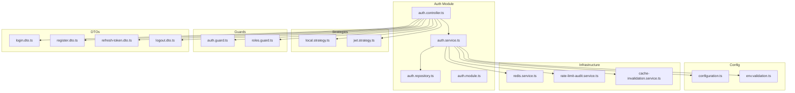
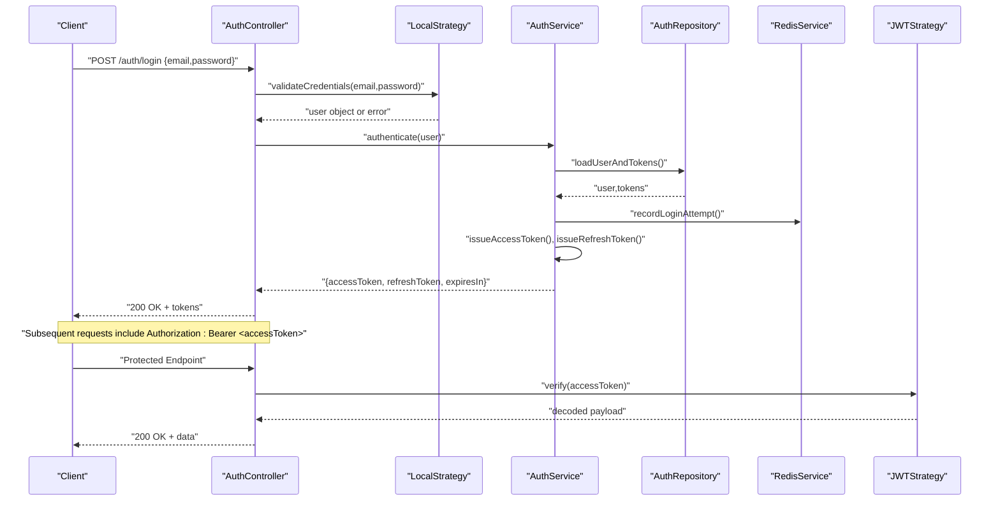
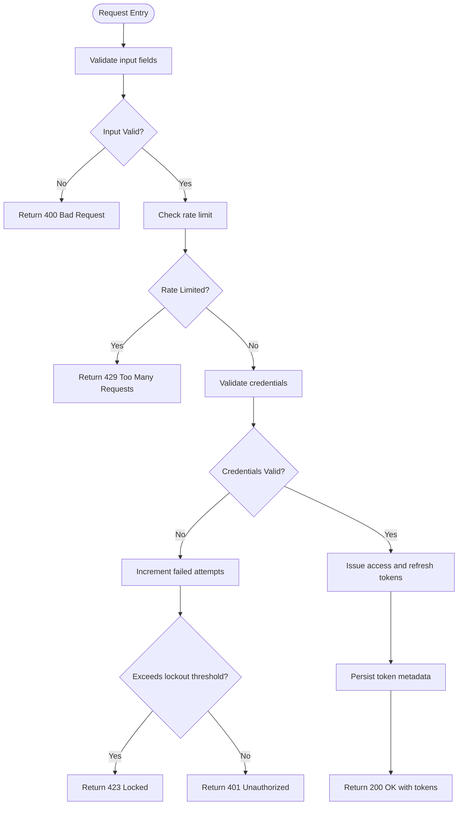
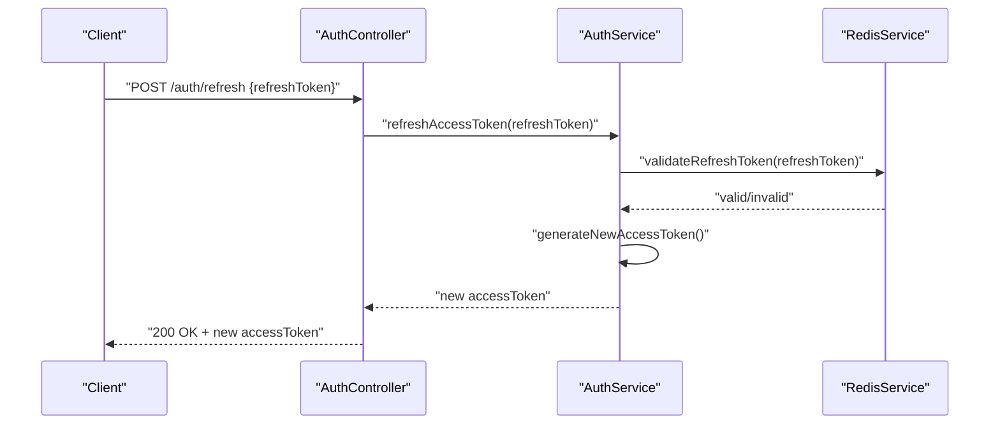
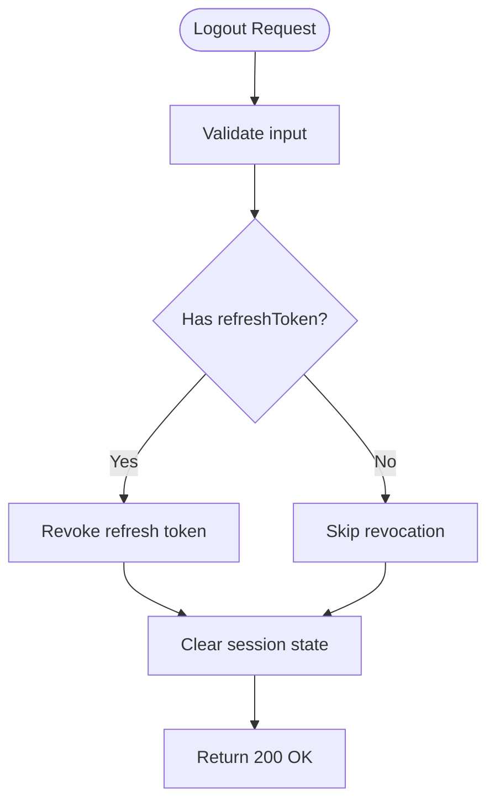
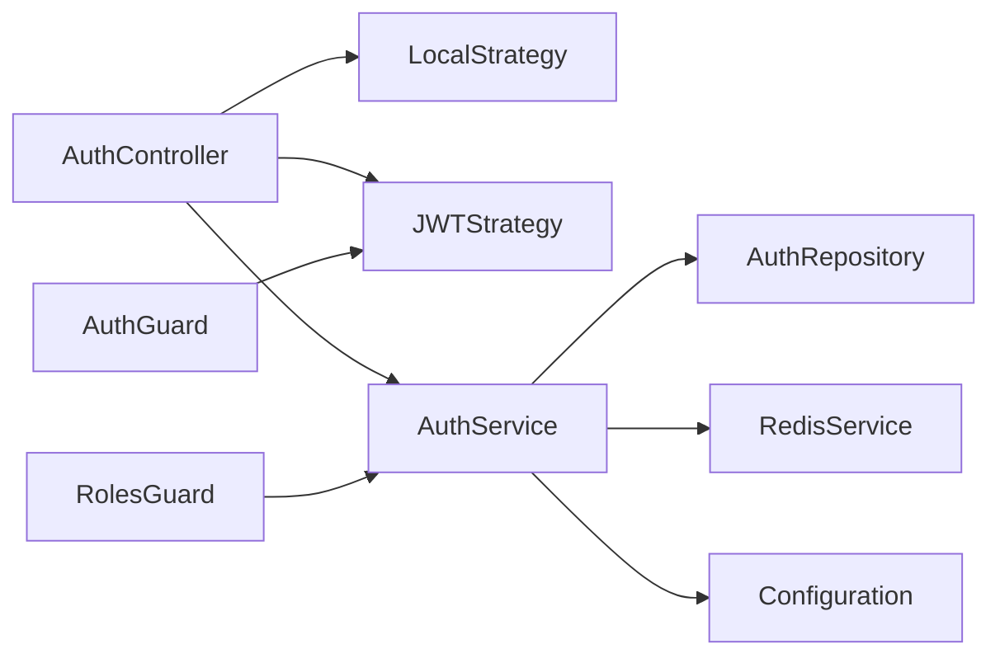

# User Login & Authentication

<cite>
**Referenced Files in This Document**
- [auth.controller.ts](file://apps/backend/src/auth/auth.controller.ts)
- [auth.service.ts](file://apps/backend/src/auth/auth.service.ts)
- [auth.module.ts](file://apps/backend/src/auth/auth.module.ts)
- [auth.repository.ts](file://apps/backend/src/auth/auth.repository.ts)
- [jwt.strategy.ts](file://apps/backend/src/auth/strategies/jwt.strategy.ts)
- [local.strategy.ts](file://apps/backend/src/auth/strategies/local.strategy.ts)
- [auth.guard.ts](file://apps/backend/src/auth/guards/auth.guard.ts)
- [roles.guard.ts](file://apps/backend/src/auth/guards/roles.guard.ts)
- [login.dto.ts](file://apps/backend/src/auth/dto/login.dto.ts)
- [register.dto.ts](file://apps/backend/src/auth/dto/register.dto.ts)
- [refresh-token.dto.ts](file://apps/backend/src/auth/dto/refresh-token.dto.ts)
- [logout.dto.ts](file://apps/backend/src/auth/dto/logout.dto.ts)
- [configuration.ts](file://apps/backend/src/config/configuration.ts)
- [env.validation.ts](file://apps/backend/src/config/env.validation.ts)
- [redis.service.ts](file://apps/backend/src/redis/redis.service.ts)
- [rate-limit-audit.service.ts](file://apps/backend/src/hardening/rate-limit-audit.service.ts)
- [cache-invalidation.service.ts](file://apps/backend/src/hardening/cache-invalidation.service.ts)
- [auth.e2e.spec.ts](file://apps/backend/test/auth.e2e.spec.ts)
</cite>

## Table of Contents
1. [Introduction](#introduction)
2. [Project Structure](#project-structure)
3. [Core Components](#core-components)
4. [Architecture Overview](#architecture-overview)
5. [Detailed Component Analysis](#detailed-component-analysis)
6. [Dependency Analysis](#dependency-analysis)
7. [Performance Considerations](#performance-considerations)
8. [Troubleshooting Guide](#troubleshooting-guide)
9. [Conclusion](#conclusion)
10. [Appendices](#appendices)

## Introduction
This document provides comprehensive API documentation for user login and authentication endpoints, focusing on credential-based authentication via POST /auth/login. It details request/response schemas, JWT token structure, access and refresh token management, session handling, token expiration policies, logout functionality, token refresh mechanisms, automatic token renewal strategies, and security measures including brute force protection, account lockout policies, and secure token storage recommendations.

## Project Structure
The authentication subsystem is implemented within the backend NestJS application under apps/backend/src/auth with supporting modules for configuration, Redis caching, hardening (rate limiting), and testing. The key files include controllers, services, repositories, DTOs, guards, and strategies that collectively implement secure authentication flows.

**Diagram sources**
- [auth.controller.ts](file://apps/backend/src/auth/auth.controller.ts)
- [auth.service.ts](file://apps/backend/src/auth/auth.service.ts)
- [auth.repository.ts](file://apps/backend/src/auth/auth.repository.ts)
- [auth.module.ts](file://apps/backend/src/auth/auth.module.ts)
- [local.strategy.ts](file://apps/backend/src/auth/strategies/local.strategy.ts)
- [jwt.strategy.ts](file://apps/backend/src/auth/strategies/jwt.strategy.ts)
- [auth.guard.ts](file://apps/backend/src/auth/guards/auth.guard.ts)
- [roles.guard.ts](file://apps/backend/src/auth/guards/roles.guard.ts)
- [login.dto.ts](file://apps/backend/src/auth/dto/login.dto.ts)
- [register.dto.ts](file://apps/backend/src/auth/dto/register.dto.ts)
- [refresh-token.dto.ts](file://apps/backend/src/auth/dto/refresh-token.dto.ts)
- [logout.dto.ts](file://apps/backend/src/auth/dto/logout.dto.ts)
- [configuration.ts](file://apps/backend/src/config/configuration.ts)
- [env.validation.ts](file://apps/backend/src/config/env.validation.ts)
- [redis.service.ts](file://apps/backend/src/redis/redis.service.ts)
- [rate-limit-audit.service.ts](file://apps/backend/src/hardening/rate-limit-audit.service.ts)
- [cache-invalidation.service.ts](file://apps/backend/src/hardening/cache-invalidation.service.ts)

**Section sources**
- [auth.controller.ts](file://apps/backend/src/auth/auth.controller.ts)
- [auth.service.ts](file://apps/backend/src/auth/auth.service.ts)
- [auth.module.ts](file://apps/backend/src/auth/auth.module.ts)

## Core Components
- Controller: Defines HTTP endpoints for authentication operations such as login, register, logout, and token refresh.
- Service: Implements business logic for authentication workflows, including credential validation, token issuance, refresh, revocation, and rate limiting integration.
- Repository: Handles persistence interactions for users and tokens.
- Strategies: Local strategy validates credentials; JWT strategy validates access tokens.
- Guards: Auth guard enforces authentication; roles guard enforces authorization.
- DTOs: Define request/response schemas for login, register, refresh, and logout.
- Configuration: Centralized environment configuration and validation for secrets and token settings.
- Infrastructure: Redis service for caching and token state; rate limit audit and cache invalidation services for security and performance.

**Section sources**
- [auth.controller.ts](file://apps/backend/src/auth/auth.controller.ts)
- [auth.service.ts](file://apps/backend/src/auth/auth.service.ts)
- [auth.repository.ts](file://apps/backend/src/auth/auth.repository.ts)
- [local.strategy.ts](file://apps/backend/src/auth/strategies/local.strategy.ts)
- [jwt.strategy.ts](file://apps/backend/src/auth/strategies/jwt.strategy.ts)
- [auth.guard.ts](file://apps/backend/src/auth/guards/auth.guard.ts)
- [roles.guard.ts](file://apps/backend/src/auth/guards/roles.guard.ts)
- [login.dto.ts](file://apps/backend/src/auth/dto/login.dto.ts)
- [register.dto.ts](file://apps/backend/src/auth/dto/register.dto.ts)
- [refresh-token.dto.ts](file://apps/backend/src/auth/dto/refresh-token.dto.ts)
- [logout.dto.ts](file://apps/backend/src/auth/dto/logout.dto.ts)
- [configuration.ts](file://apps/backend/src/config/configuration.ts)
- [env.validation.ts](file://apps/backend/src/config/env.validation.ts)
- [redis.service.ts](file://apps/backend/src/redis/redis.service.ts)
- [rate-limit-audit.service.ts](file://apps/backend/src/hardening/rate-limit-audit.service.ts)
- [cache-invalidation.service.ts](file://apps/backend/src/hardening/cache-invalidation.service.ts)

## Architecture Overview
The authentication flow uses a layered architecture:
- Client sends credentials to POST /auth/login.
- Controller delegates to the local strategy for credential validation.
- Service issues JWT access and refresh tokens, persists token metadata, and applies rate limiting.
- Subsequent requests use JWT access tokens validated by the JWT strategy and auth guard.
- Token refresh uses the refresh token endpoint to obtain new access tokens without re-authentication.
- Logout revokes tokens and clears session state.

**Diagram sources**
- [auth.controller.ts](file://apps/backend/src/auth/auth.controller.ts)
- [local.strategy.ts](file://apps/backend/src/auth/strategies/local.strategy.ts)
- [auth.service.ts](file://apps/backend/src/auth/auth.service.ts)
- [auth.repository.ts](file://apps/backend/src/auth/auth.repository.ts)
- [redis.service.ts](file://apps/backend/src/redis/redis.service.ts)
- [jwt.strategy.ts](file://apps/backend/src/auth/strategies/jwt.strategy.ts)

## Detailed Component Analysis

### POST /auth/login
- Purpose: Authenticate a user using email and password and return JWT tokens.
- Request schema:
  - email: string (required)
  - password: string (required)
- Response schema (success):
  - accessToken: string (JWT)
  - refreshToken: string (opaque or JWT)
  - expiresIn: number (seconds until access token expiry)
  - tokenType: string (typically "Bearer")
- Error responses:
  - 401 Unauthorized: Invalid credentials
  - 423 Locked: Account locked due to too many failed attempts
  - 429 Too Many Requests: Rate limit exceeded
  - 500 Internal Server Error: Unexpected server failure

**Diagram sources**
- [auth.controller.ts](file://apps/backend/src/auth/auth.controller.ts)
- [auth.service.ts](file://apps/backend/src/auth/auth.service.ts)
- [rate-limit-audit.service.ts](file://apps/backend/src/hardening/rate-limit-audit.service.ts)

**Section sources**
- [auth.controller.ts](file://apps/backend/src/auth/auth.controller.ts)
- [auth.service.ts](file://apps/backend/src/auth/auth.service.ts)
- [login.dto.ts](file://apps/backend/src/auth/dto/login.dto.ts)
- [rate-limit-audit.service.ts](file://apps/backend/src/hardening/rate-limit-audit.service.ts)

### JWT Token Structure
- Access Token:
  - Contains user identity claims (e.g., userId, roles)
  - Short-lived (e.g., minutes)
  - Used in Authorization header as Bearer token
- Refresh Token:
  - Long-lived (e.g., days)
  - Stored securely (httpOnly cookie or secure storage)
  - Used to obtain new access tokens without re-authentication
- Expiration Policies:
  - Access token expires quickly to minimize risk
  - Refresh token has longer lifespan but can be revoked
  - Rotation recommended for enhanced security

**Section sources**
- [jwt.strategy.ts](file://apps/backend/src/auth/strategies/jwt.strategy.ts)
- [configuration.ts](file://apps/backend/src/config/configuration.ts)
- [env.validation.ts](file://apps/backend/src/config/env.validation.ts)

### Token Refresh Mechanism
- Endpoint: POST /auth/refresh
- Request schema:
  - refreshToken: string (required)
- Response schema (success):
  - accessToken: string (new JWT)
  - expiresIn: number (seconds)
- Error responses:
  - 401 Unauthorized: Invalid or expired refresh token
  - 429 Too Many Requests: Rate limit exceeded

**Diagram sources**
- [auth.controller.ts](file://apps/backend/src/auth/auth.controller.ts)
- [auth.service.ts](file://apps/backend/src/auth/auth.service.ts)
- [redis.service.ts](file://apps/backend/src/redis/redis.service.ts)
- [refresh-token.dto.ts](file://apps/backend/src/auth/dto/refresh-token.dto.ts)

**Section sources**
- [auth.controller.ts](file://apps/backend/src/auth/auth.controller.ts)
- [auth.service.ts](file://apps/backend/src/auth/auth.service.ts)
- [refresh-token.dto.ts](file://apps/backend/src/auth/dto/refresh-token.dto.ts)

### Logout Functionality
- Endpoint: POST /auth/logout
- Request schema:
  - refreshToken?: string (optional, for explicit revocation)
- Behavior:
  - Revokes refresh token if provided
  - Clears session state
  - Returns success response

**Diagram sources**
- [auth.controller.ts](file://apps/backend/src/auth/auth.controller.ts)
- [auth.service.ts](file://apps/backend/src/auth/auth.service.ts)
- [logout.dto.ts](file://apps/backend/src/auth/dto/logout.dto.ts)

**Section sources**
- [auth.controller.ts](file://apps/backend/src/auth/auth.controller.ts)
- [auth.service.ts](file://apps/backend/src/auth/auth.service.ts)
- [logout.dto.ts](file://apps/backend/src/auth/dto/logout.dto.ts)

### Automatic Token Renewal Strategies
- Client-side renewal:
  - Monitor access token expiration
  - Automatically call refresh endpoint before expiry
  - Handle refresh failures gracefully
- Server-side rotation:
  - Rotate refresh tokens on each use
  - Invalidate old refresh tokens immediately
- Best practices:
  - Use short-lived access tokens
  - Securely store refresh tokens
  - Implement retry logic with exponential backoff

**Section sources**
- [auth.service.ts](file://apps/backend/src/auth/auth.service.ts)
- [redis.service.ts](file://apps/backend/src/redis/redis.service.ts)

### Security Measures
- Brute Force Protection:
  - Rate limiting on login attempts
  - Progressive delays after failed attempts
- Account Lockout Policies:
  - Temporary lockout after exceeding thresholds
  - Configurable lockout duration
- Secure Token Storage:
  - Store refresh tokens in httpOnly cookies
  - Use HTTPS for all communications
  - Implement token binding where possible

**Section sources**
- [rate-limit-audit.service.ts](file://apps/backend/src/hardening/rate-limit-audit.service.ts)
- [cache-invalidation.service.ts](file://apps/backend/src/hardening/cache-invalidation.service.ts)
- [configuration.ts](file://apps/backend/src/config/configuration.ts)

## Dependency Analysis
The authentication system has clear dependencies between components:
- Controller depends on strategies, service, and DTOs
- Service depends on repository, Redis, and configuration
- Guards depend on strategies for token validation
- Hardening services provide cross-cutting concerns like rate limiting

**Diagram sources**
- [auth.controller.ts](file://apps/backend/src/auth/auth.controller.ts)
- [auth.service.ts](file://apps/backend/src/auth/auth.service.ts)
- [auth.repository.ts](file://apps/backend/src/auth/auth.repository.ts)
- [local.strategy.ts](file://apps/backend/src/auth/strategies/local.strategy.ts)
- [jwt.strategy.ts](file://apps/backend/src/auth/strategies/jwt.strategy.ts)
- [auth.guard.ts](file://apps/backend/src/auth/guards/auth.guard.ts)
- [roles.guard.ts](file://apps/backend/src/auth/guards/roles.guard.ts)
- [redis.service.ts](file://apps/backend/src/redis/redis.service.ts)
- [configuration.ts](file://apps/backend/src/config/configuration.ts)

**Section sources**
- [auth.module.ts](file://apps/backend/src/auth/auth.module.ts)
- [auth.controller.ts](file://apps/backend/src/auth/auth.controller.ts)
- [auth.service.ts](file://apps/backend/src/auth/auth.service.ts)

## Performance Considerations
- Token validation should be fast and stateless when possible
- Use Redis for rate limiting and token state to reduce database load
- Implement connection pooling for database and Redis
- Cache frequently accessed user data
- Monitor and optimize query performance

[No sources needed since this section provides general guidance]

## Troubleshooting Guide
Common issues and solutions:
- Invalid credentials: Verify email/password format and user existence
- Account locked: Check failed attempt counters and unlock policies
- Rate limited: Implement proper retry logic with backoff
- Token expired: Ensure automatic refresh mechanism is working
- Redis connectivity: Verify Redis service availability and configuration

**Section sources**
- [auth.e2e.spec.ts](file://apps/backend/test/auth.e2e.spec.ts)
- [rate-limit-audit.service.ts](file://apps/backend/src/hardening/rate-limit-audit.service.ts)
- [redis.service.ts](file://apps/backend/src/redis/redis.service.ts)

## Conclusion
The authentication system provides a robust, secure foundation for user login and token management. With proper implementation of JWT tokens, refresh mechanisms, and security measures, it ensures safe and efficient authentication flows. Following the documented best practices will help maintain security and performance while providing a seamless user experience.

[No sources needed since this section summarizes without analyzing specific files]

## Appendices

### API Endpoints Summary
- POST /auth/login: Authenticate user and get tokens
- POST /auth/refresh: Refresh access token using refresh token
- POST /auth/logout: Logout and revoke tokens
- Protected endpoints require valid JWT access token

### Error Codes Reference
- 400: Bad Request - Invalid input
- 401: Unauthorized - Invalid credentials or token
- 403: Forbidden - Insufficient permissions
- 423: Locked - Account locked due to failed attempts
- 429: Too Many Requests - Rate limit exceeded
- 500: Internal Server Error - Unexpected failure

**Section sources**
- [auth.controller.ts](file://apps/backend/src/auth/auth.controller.ts)
- [auth.service.ts](file://apps/backend/src/auth/auth.service.ts)