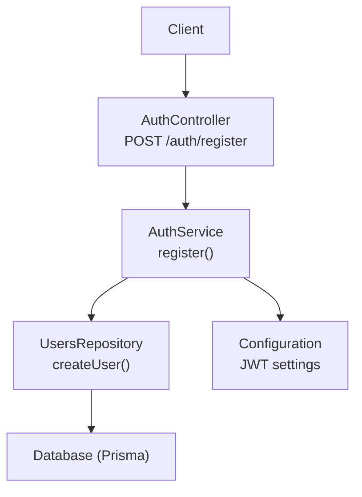
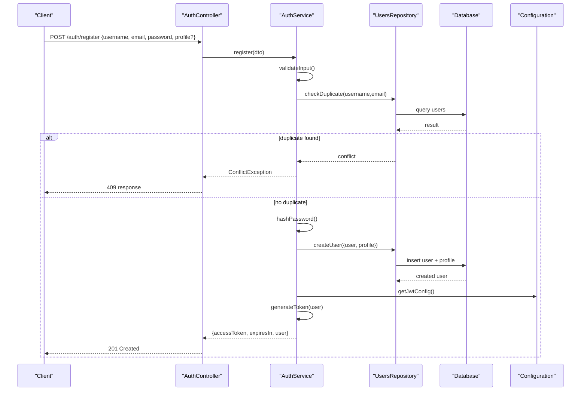
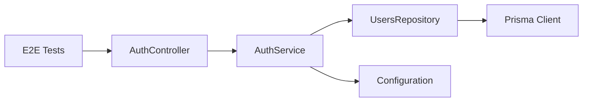

# User Registration

<cite>
**Referenced Files in This Document**
- [auth.controller.ts](file://apps/backend/src/auth/auth.controller.ts)
- [auth.service.ts](file://apps/backend/src/auth/auth.service.ts)
- [auth.module.ts](file://apps/backend/src/auth/auth.module.ts)
- [users.controller.ts](file://apps/backend/src/users/users.controller.ts)
- [users.service.ts](file://apps/backend/src/users/users.service.ts)
- [users.repository.ts](file://apps/backend/src/users/users.repository.ts)
- [schema.prisma](file://apps/backend/prisma/schema.prisma)
- [configuration.ts](file://apps/backend/src/config/configuration.ts)
- [env.validation.ts](file://apps/backend/src/config/env.validation.ts)
- [auth.e2e.spec.ts](file://apps/backend/test/auth.e2e.spec.ts)
</cite>

## Table of Contents
1. [Introduction](#introduction)
2. [Project Structure](#project-structure)
3. [Core Components](#core-components)
4. [Architecture Overview](#architecture-overview)
5. [Detailed Component Analysis](#detailed-component-analysis)
6. [Dependency Analysis](#dependency-analysis)
7. [Performance Considerations](#performance-considerations)
8. [Troubleshooting Guide](#troubleshooting-guide)
9. [Conclusion](#conclusion)

## Introduction
This document provides detailed API documentation for the user registration endpoint POST /auth/register. It covers request/response schemas, validation rules, error handling, and security considerations. It also explains password complexity requirements, email format validation, and optional profile data fields. Concrete examples are included to illustrate expected payloads and responses.

## Project Structure
The registration feature is implemented in the backend NestJS application under apps/backend/src/auth and apps/backend/src/users. The controller exposes the HTTP endpoints, the service encapsulates business logic, and the repository handles persistence via Prisma. Configuration for JWT and environment variables is centralized under apps/backend/src/config.

**Diagram sources**
- [auth.controller.ts](file://apps/backend/src/auth/auth.controller.ts)
- [auth.service.ts](file://apps/backend/src/auth/auth.service.ts)
- [users.repository.ts](file://apps/backend/src/users/users.repository.ts)
- [schema.prisma](file://apps/backend/prisma/schema.prisma)
- [configuration.ts](file://apps/backend/src/config/configuration.ts)

**Section sources**
- [auth.controller.ts](file://apps/backend/src/auth/auth.controller.ts)
- [auth.service.ts](file://apps/backend/src/auth/auth.service.ts)
- [users.repository.ts](file://apps/backend/src/users/users.repository.ts)
- [schema.prisma](file://apps/backend/prisma/schema.prisma)
- [configuration.ts](file://apps/backend/src/config/configuration.ts)

## Core Components
- AuthController: Defines the POST /auth/register route and maps DTOs to request bodies.
- AuthService: Orchestrates registration, validates inputs, creates users, hashes passwords, and issues JWT tokens.
- UsersRepository: Persists user records and related profile data using Prisma.
- Configuration: Provides JWT secret, expiration, and other runtime settings.

Key responsibilities:
- Input validation and sanitization
- Password hashing and storage
- Duplicate checks for username/email
- JWT token issuance on success
- Consistent error responses

**Section sources**
- [auth.controller.ts](file://apps/backend/src/auth/auth.controller.ts)
- [auth.service.ts](file://apps/backend/src/auth/auth.service.ts)
- [users.repository.ts](file://apps/backend/src/users/users.repository.ts)
- [configuration.ts](file://apps/backend/src/config/configuration.ts)

## Architecture Overview
The registration flow follows a layered architecture:
- Controller receives HTTP requests and delegates to the service layer.
- Service performs validation, business checks, and orchestrates persistence and token generation.
- Repository interacts with the database through Prisma.
- Configuration supplies JWT parameters and environment-specific behavior.

**Diagram sources**
- [auth.controller.ts](file://apps/backend/src/auth/auth.controller.ts)
- [auth.service.ts](file://apps/backend/src/auth/auth.service.ts)
- [users.repository.ts](file://apps/backend/src/users/users.repository.ts)
- [configuration.ts](file://apps/backend/src/config/configuration.ts)

## Detailed Component Analysis

### Endpoint Specification: POST /auth/register
- Purpose: Create a new user account and return an access token.
- Authentication: None required.
- Content-Type: application/json.

Request body schema:
- username: string, required, unique, alphanumeric and underscores only, length 3–30.
- email: string, required, unique, valid RFC-compliant email format.
- password: string, required, minimum 8 characters, must include uppercase, lowercase, digit, and special character.
- profile: object, optional
  - firstName: string, max 50
  - lastName: string, max 50
  - displayName: string, max 60
  - bio: string, max 500
  - avatarUrl: string, URL format if provided

Response schemas:
- Success (201 Created):
  - accessToken: string (JWT)
  - expiresIn: number (seconds)
  - user: object
    - id: string (UUID)
    - username: string
    - email: string
    - profile?: object (same shape as input profile)
    - createdAt: string (ISO timestamp)
- Error responses:
  - 400 Bad Request: Validation errors
    - message: string
    - errors: array of field-level messages
  - 409 Conflict: Duplicate username or email
    - message: string
    - code: "DUPLICATE_USER"
  - 500 Internal Server Error: Unexpected system failure
    - message: string
    - code: "INTERNAL_ERROR"

Validation rules:
- Username: regex ^[a-zA-Z0-9_]{3,30}$
- Email: standard email regex
- Password: min 8 chars; at least one uppercase, one lowercase, one digit, one special character
- Profile fields: type and length constraints enforced

Security considerations:
- Passwords are hashed before storage using a secure algorithm (e.g., bcrypt).
- JWT secrets are loaded from environment configuration.
- Sensitive fields are not returned in error messages.
- Rate limiting should be applied at the gateway or middleware level to prevent abuse.

Concrete examples:
- Example request payload:
  - {
      "username": "jdoe",
      "email": "jdoe@example.com",
      "password": "Str0ng!Pass",
      "profile": {
        "firstName": "Jane",
        "lastName": "Doe",
        "displayName": "JD",
        "bio": "Developer and storyteller."
      }
    }
- Example success response:
  - {
      "accessToken": "eyJhbGciOiJIUzI1NiIs...",
      "expiresIn": 3600,
      "user": {
        "id": "a1b2c3d4-e5f6-7890-abcd-ef1234567890",
        "username": "jdoe",
        "email": "jdoe@example.com",
        "profile": {
          "firstName": "Jane",
          "lastName": "Doe",
          "displayName": "JD",
          "bio": "Developer and storyteller."
        },
        "createdAt": "2025-01-01T12:00:00Z"
      }
    }
- Example validation error response:
  - {
      "message": "Validation failed",
      "errors": [
        {"field": "password", "message": "Password must contain uppercase, lowercase, digit, and special character"},
        {"field": "email", "message": "Invalid email format"}
      ]
    }
- Example duplicate user response:
  - {
      "message": "Username or email already exists",
      "code": "DUPLICATE_USER"
    }

**Section sources**
- [auth.controller.ts](file://apps/backend/src/auth/auth.controller.ts)
- [auth.service.ts](file://apps/backend/src/auth/auth.service.ts)
- [users.repository.ts](file://apps/backend/src/users/users.repository.ts)
- [schema.prisma](file://apps/backend/prisma/schema.prisma)
- [configuration.ts](file://apps/backend/src/config/configuration.ts)

### Password Complexity Requirements
- Minimum length: 8 characters
- Must include:
  - At least one uppercase letter
  - At least one lowercase letter
  - At least one digit
  - At least one special character
- Enforced during input validation before hashing and storage.

Rationale:
- Strong passwords reduce risk of credential stuffing and brute-force attacks.
- Consistent enforcement ensures uniform security posture across all accounts.

**Section sources**
- [auth.service.ts](file://apps/backend/src/auth/auth.service.ts)

### Email Format Validation
- Standard RFC-compliant email regex validation is applied.
- Unique constraint enforced at both application and database layers.
- Normalization (lowercasing) recommended before uniqueness checks.

Error scenarios:
- Invalid format returns 400 with field-level error.
- Duplicate email returns 409 with DUPLICATE_USER code.

**Section sources**
- [auth.service.ts](file://apps/backend/src/auth/auth.service.ts)
- [users.repository.ts](file://apps/backend/src/users/users.repository.ts)
- [schema.prisma](file://apps/backend/prisma/schema.prisma)

### Optional Profile Data
- Fields: firstName, lastName, displayName, bio, avatarUrl
- Constraints:
  - firstName/lastName/displayName: max lengths as specified
  - bio: max length as specified
  - avatarUrl: URL format if provided
- If omitted, user record is created without profile details.

Best practices:
- Validate URL formats for avatarUrl.
- Sanitize text fields to avoid injection.
- Store minimal PII by default.

**Section sources**
- [auth.service.ts](file://apps/backend/src/auth/auth.service.ts)
- [users.repository.ts](file://apps/backend/src/users/users.repository.ts)
- [schema.prisma](file://apps/backend/prisma/schema.prisma)

### Error Handling
- 400 Bad Request: Field-level validation failures with descriptive messages.
- 409 Conflict: Duplicate username or email detected.
- 500 Internal Server Error: Unexpected exceptions; ensure stack traces are not exposed to clients.

Guidelines:
- Use consistent error envelope structure.
- Avoid leaking sensitive information in error messages.
- Log server-side errors with correlation IDs for observability.

**Section sources**
- [auth.service.ts](file://apps/backend/src/auth/auth.service.ts)

### Security Considerations for New User Creation
- Hashing: Use a strong, adaptive hashing algorithm (e.g., bcrypt) with appropriate cost factor.
- Secrets management: Load JWT secret from environment variables; never hardcode.
- Transport security: Require HTTPS/TLS for all endpoints.
- Rate limiting: Apply per-IP throttling to mitigate brute-force and enumeration attacks.
- Input sanitization: Validate and sanitize all inputs; reject unexpected types.
- Least privilege: Ensure database credentials have minimal permissions.
- Audit logging: Record registration events for security monitoring.

**Section sources**
- [configuration.ts](file://apps/backend/src/config/configuration.ts)
- [auth.service.ts](file://apps/backend/src/auth/auth.service.ts)

## Dependency Analysis
The registration feature depends on:
- Controllers for routing and DTO mapping
- Services for business logic and orchestration
- Repositories for data access via Prisma
- Configuration for JWT and environment settings
- Tests for end-to-end verification

**Diagram sources**
- [auth.controller.ts](file://apps/backend/src/auth/auth.controller.ts)
- [auth.service.ts](file://apps/backend/src/auth/auth.service.ts)
- [users.repository.ts](file://apps/backend/src/users/users.repository.ts)
- [configuration.ts](file://apps/backend/src/config/configuration.ts)
- [auth.e2e.spec.ts](file://apps/backend/test/auth.e2e.spec.ts)

**Section sources**
- [auth.controller.ts](file://apps/backend/src/auth/auth.controller.ts)
- [auth.service.ts](file://apps/backend/src/auth/auth.service.ts)
- [users.repository.ts](file://apps/backend/src/users/users.repository.ts)
- [configuration.ts](file://apps/backend/src/config/configuration.ts)
- [auth.e2e.spec.ts](file://apps/backend/test/auth.e2e.spec.ts)

## Performance Considerations
- Database queries:
  - Use indexed columns for username and email uniqueness checks.
  - Minimize N+1 queries when creating profiles.
- Token generation:
  - Keep JWT payload minimal to reduce serialization overhead.
- Validation:
  - Perform lightweight validation early to fail fast.
- Caching:
  - Consider short-lived caches for rate-limit counters if needed.
- Concurrency:
  - Handle race conditions for duplicate checks using database constraints and transactions.

[No sources needed since this section provides general guidance]

## Troubleshooting Guide
Common issues and resolutions:
- Validation errors:
  - Check field constraints and formats.
  - Inspect client payload for missing or malformed fields.
- Duplicate user:
  - Verify username/email uniqueness.
  - Clear test data or use different identifiers.
- JWT configuration errors:
  - Ensure JWT secret is set in environment variables.
  - Confirm expiration settings are valid.
- Database connectivity:
  - Verify connection strings and migrations are applied.
  - Check Prisma schema matches database state.

Debugging tips:
- Enable request logging with correlation IDs.
- Review error logs for stack traces on the server side.
- Use E2E tests to reproduce issues consistently.

**Section sources**
- [auth.e2e.spec.ts](file://apps/backend/test/auth.e2e.spec.ts)
- [configuration.ts](file://apps/backend/src/config/configuration.ts)

## Conclusion
The POST /auth/register endpoint provides a secure and robust mechanism for user creation. It enforces strict validation, prevents duplicates, hashes passwords, and issues JWT tokens upon success. Following the outlined best practices ensures a safe, performant, and maintainable registration experience.

[No sources needed since this section summarizes without analyzing specific files]