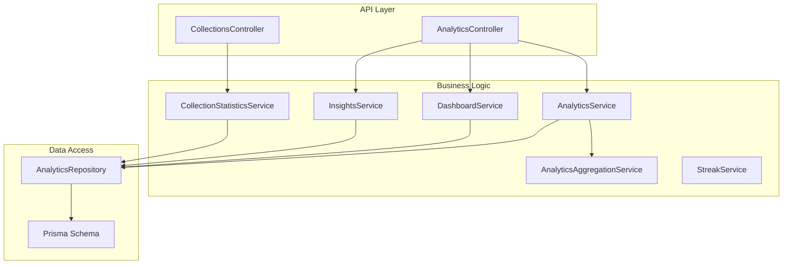
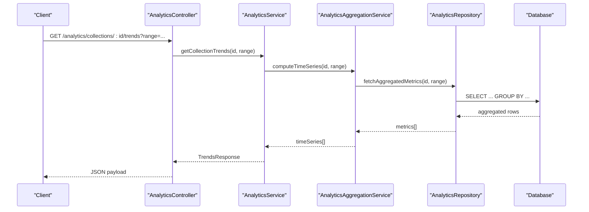
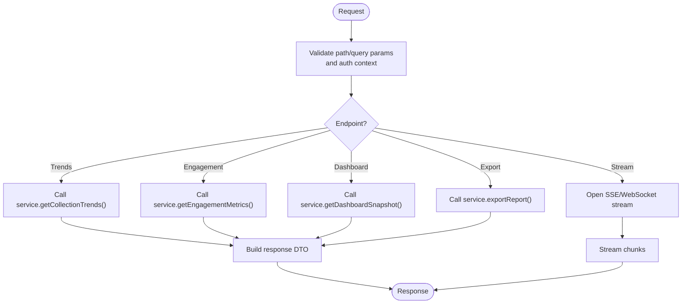
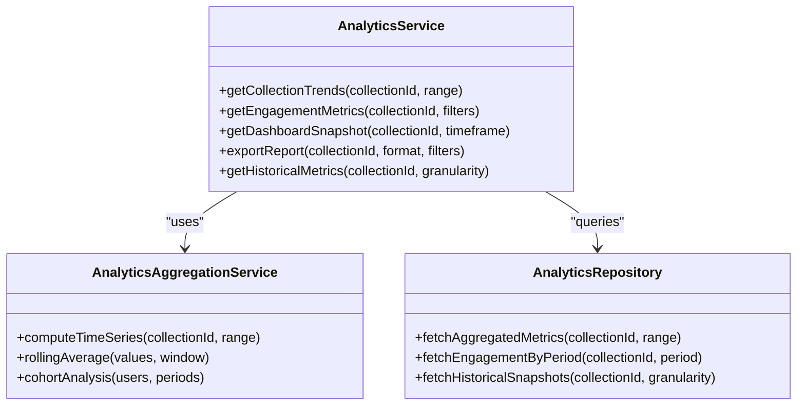
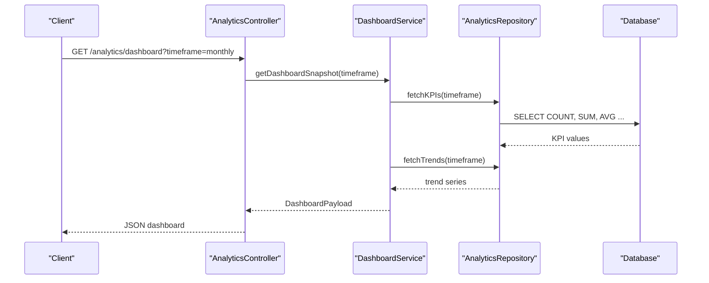
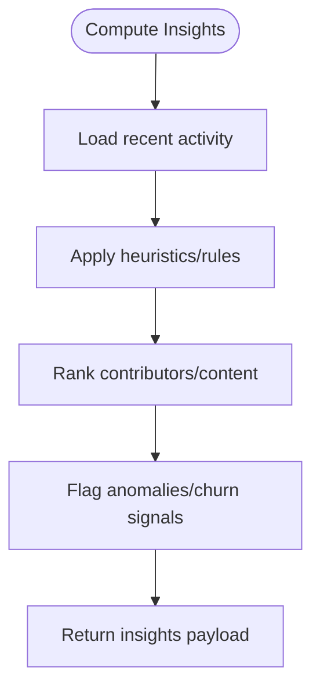
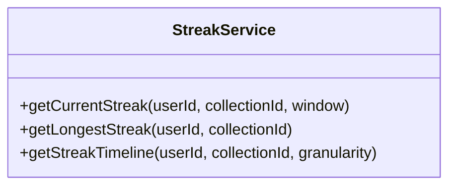
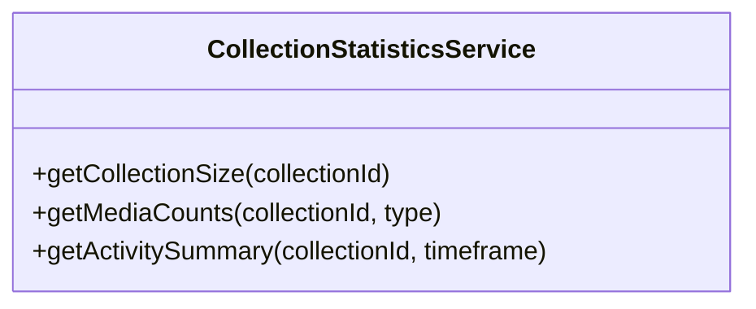
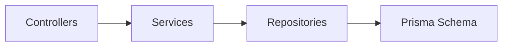

# Collection Analytics & Insights

<cite>
**Referenced Files in This Document**
- [analytics.controller.ts](file://apps/backend/src/analytics/analytics.controller.ts)
- [analytics.service.ts](file://apps/backend/src/analytics/analytics.service.ts)
- [analytics-aggregation.service.ts](file://apps/backend/src/analytics/analytics-aggregation.service.ts)
- [analytics.repository.ts](file://apps/backend/src/analytics/analytics.repository.ts)
- [dashboard.service.ts](file://apps/backend/src/analytics/dashboard.service.ts)
- [insights.service.ts](file://apps/backend/src/analytics/insights.service.ts)
- [streak.service.ts](file://apps/backend/src/analytics/streak.service.ts)
- [collections.controller.ts](file://apps/backend/src/collections/collections.controller.ts)
- [collection-statistics.service.ts](file://apps/backend/src/collections/collection-statistics.service.ts)
- [schema.prisma](file://apps/backend/prisma/schema.prisma)
</cite>

## Table of Contents
1. [Introduction](#introduction)
2. [Project Structure](#project-structure)
3. [Core Components](#core-components)
4. [Architecture Overview](#architecture-overview)
5. [Detailed Component Analysis](#detailed-component-analysis)
6. [Dependency Analysis](#dependency-analysis)
7. [Performance Considerations](#performance-considerations)
8. [Troubleshooting Guide](#troubleshooting-guide)
9. [Conclusion](#conclusion)
10. [Appendices](#appendices)

## Introduction
This document provides comprehensive API documentation for collection analytics and insights endpoints. It covers statistical data aggregation, engagement metrics, performance indicators, growth trends, member activity patterns, content consumption analytics, report generation, data export, historical metrics, real-time streaming, custom metric calculations, visualization data formats, common queries, dashboard structures, and integration patterns for third-party analytics tools.

## Project Structure
The analytics subsystem is implemented as a NestJS module with controllers, services, repositories, DTOs, and supporting utilities. Key areas include:
- Controllers exposing REST endpoints for analytics and dashboards
- Services implementing business logic for aggregation, insights, streaks, and dashboard composition
- Repositories encapsulating data access and query construction
- DTOs defining request/response contracts
- Prisma schema defining core entities used by analytics

**Diagram sources**
- [analytics.controller.ts](file://apps/backend/src/analytics/analytics.controller.ts)
- [collections.controller.ts](file://apps/backend/src/collections/collections.controller.ts)
- [analytics.service.ts](file://apps/backend/src/analytics/analytics.service.ts)
- [analytics-aggregation.service.ts](file://apps/backend/src/analytics/analytics-aggregation.service.ts)
- [dashboard.service.ts](file://apps/backend/src/analytics/dashboard.service.ts)
- [insights.service.ts](file://apps/backend/src/analytics/insights.service.ts)
- [streak.service.ts](file://apps/backend/src/analytics/streak.service.ts)
- [collection-statistics.service.ts](file://apps/backend/src/collections/collection-statistics.service.ts)
- [analytics.repository.ts](file://apps/backend/src/analytics/analytics.repository.ts)
- [schema.prisma](file://apps/backend/prisma/schema.prisma)

**Section sources**
- [analytics.controller.ts](file://apps/backend/src/analytics/analytics.controller.ts)
- [collections.controller.ts](file://apps/backend/src/collections/collections.controller.ts)
- [analytics.service.ts](file://apps/backend/src/analytics/analytics.service.ts)
- [analytics-aggregation.service.ts](file://apps/backend/src/analytics/analytics-aggregation.service.ts)
- [dashboard.service.ts](file://apps/backend/src/analytics/dashboard.service.ts)
- [insights.service.ts](file://apps/backend/src/analytics/insights.service.ts)
- [streak.service.ts](file://apps/backend/src/analytics/streak.service.ts)
- [collection-statistics.service.ts](file://apps/backend/src/collections/collection-statistics.service.ts)
- [analytics.repository.ts](file://apps/backend/src/analytics/analytics.repository.ts)
- [schema.prisma](file://apps/backend/prisma/schema.prisma)

## Core Components
- AnalyticsController: Exposes endpoints for collection analytics, growth trends, engagement metrics, and dashboard payloads.
- AnalyticsService: Orchestrates analytics computations, aggregates metrics, and composes response models.
- AnalyticsAggregationService: Implements time-series aggregation, rolling windows, and cohort analysis helpers.
- DashboardService: Builds dashboard-ready responses combining multiple metrics into cohesive views.
- InsightsService: Derives higher-level insights (e.g., top contributors, trending topics, churn signals).
- StreakService: Computes user or collection streaks to reflect consistent engagement over time.
- CollectionStatisticsService: Provides collection-specific statistics such as size, media counts, and activity summaries.
- AnalyticsRepository: Encapsulates database queries and aggregations against the analytics data model.

**Section sources**
- [analytics.controller.ts](file://apps/backend/src/analytics/analytics.controller.ts)
- [analytics.service.ts](file://apps/backend/src/analytics/analytics.service.ts)
- [analytics-aggregation.service.ts](file://apps/backend/src/analytics/analytics-aggregation.service.ts)
- [dashboard.service.ts](file://apps/backend/src/analytics/dashboard.service.ts)
- [insights.service.ts](file://apps/backend/src/analytics/insights.service.ts)
- [streak.service.ts](file://apps/backend/src/analytics/streak.service.ts)
- [collection-statistics.service.ts](file://apps/backend/src/collections/collection-statistics.service.ts)
- [analytics.repository.ts](file://apps/backend/src/analytics/analytics.repository.ts)

## Architecture Overview
The analytics architecture follows a layered design:
- Controller layer handles HTTP requests, validates inputs, and returns structured responses.
- Service layer implements domain logic, including aggregation, insight derivation, and dashboard composition.
- Repository layer abstracts data access, performing efficient SQL/Prisma queries and aggregations.
- Data model defined via Prisma schema underpins all analytics computations.

**Diagram sources**
- [analytics.controller.ts](file://apps/backend/src/analytics/analytics.controller.ts)
- [analytics.service.ts](file://apps/backend/src/analytics/analytics.service.ts)
- [analytics-aggregation.service.ts](file://apps/backend/src/analytics/analytics-aggregation.service.ts)
- [analytics.repository.ts](file://apps/backend/src/analytics/analytics.repository.ts)
- [schema.prisma](file://apps/backend/prisma/schema.prisma)

## Detailed Component Analysis

### Analytics Controller Endpoints
- Purpose: Provide REST endpoints for collection analytics, growth trends, engagement metrics, and dashboard data.
- Typical operations:
  - Retrieve collection growth trends over configurable time ranges
  - Fetch engagement metrics (views, interactions, completion rates)
  - Generate dashboard snapshots combining multiple metrics
  - Export reports and historical metrics
  - Stream real-time analytics events (if enabled)

**Diagram sources**
- [analytics.controller.ts](file://apps/backend/src/analytics/analytics.controller.ts)
- [analytics.service.ts](file://apps/backend/src/analytics/analytics.service.ts)
- [dashboard.service.ts](file://apps/backend/src/analytics/dashboard.service.ts)

**Section sources**
- [analytics.controller.ts](file://apps/backend/src/analytics/analytics.controller.ts)

### Analytics Service
- Responsibilities:
  - Orchestrate trend computation across time windows
  - Aggregate engagement metrics per collection and user segments
  - Compose dashboard payloads from multiple sources
  - Coordinate export jobs and historical retrieval
- Common methods:
  - getCollectionTrends(collectionId, range)
  - getEngagementMetrics(collectionId, filters)
  - getDashboardSnapshot(collectionId, timeframe)
  - exportReport(collectionId, format, filters)
  - getHistoricalMetrics(collectionId, granularity)

**Diagram sources**
- [analytics.service.ts](file://apps/backend/src/analytics/analytics.service.ts)
- [analytics-aggregation.service.ts](file://apps/backend/src/analytics/analytics-aggregation.service.ts)
- [analytics.repository.ts](file://apps/backend/src/analytics/analytics.repository.ts)

**Section sources**
- [analytics.service.ts](file://apps/backend/src/analytics/analytics.service.ts)
- [analytics-aggregation.service.ts](file://apps/backend/src/analytics/analytics-aggregation.service.ts)
- [analytics.repository.ts](file://apps/backend/src/analytics/analytics.repository.ts)

### Dashboard Service
- Purpose: Assemble dashboard-ready responses that combine growth, engagement, and performance indicators.
- Typical outputs:
  - Summary KPIs (total members, active users, content consumption)
  - Trend lines (daily/weekly/monthly)
  - Cohort retention curves
  - Top-performing content and contributors

**Diagram sources**
- [dashboard.service.ts](file://apps/backend/src/analytics/dashboard.service.ts)
- [analytics.repository.ts](file://apps/backend/src/analytics/analytics.repository.ts)
- [schema.prisma](file://apps/backend/prisma/schema.prisma)

**Section sources**
- [dashboard.service.ts](file://apps/backend/src/analytics/dashboard.service.ts)

### Insights Service
- Purpose: Derive actionable insights such as trending topics, churn signals, and contributor rankings.
- Methods may include:
  - getTopContributors(collectionId, limit)
  - detectChurnSignals(collectionId, window)
  - identifyTrendingContent(collectionId, window)

**Diagram sources**
- [insights.service.ts](file://apps/backend/src/analytics/insights.service.ts)

**Section sources**
- [insights.service.ts](file://apps/backend/src/analytics/insights.service.ts)

### Streak Service
- Purpose: Compute streaks reflecting consistent engagement over consecutive periods.
- Outputs:
  - Current streak length
  - Longest streak
  - Streak history timeline

**Diagram sources**
- [streak.service.ts](file://apps/backend/src/analytics/streak.service.ts)

**Section sources**
- [streak.service.ts](file://apps/backend/src/analytics/streak.service.ts)

### Collection Statistics Service
- Purpose: Provide collection-specific statistics like size, media counts, and activity summaries.
- Typical methods:
  - getCollectionSize(collectionId)
  - getMediaCounts(collectionId, type)
  - getActivitySummary(collectionId, timeframe)

**Diagram sources**
- [collection-statistics.service.ts](file://apps/backend/src/collections/collection-statistics.service.ts)

**Section sources**
- [collection-statistics.service.ts](file://apps/backend/src/collections/collection-statistics.service.ts)

## Dependency Analysis
- Controllers depend on services for business logic.
- Services depend on repositories for data access.
- Repositories depend on the Prisma schema for entity definitions and queries.
- Potential circular dependencies are avoided by keeping repository logic isolated and service orchestration unidirectional.

**Diagram sources**
- [analytics.controller.ts](file://apps/backend/src/analytics/analytics.controller.ts)
- [analytics.service.ts](file://apps/backend/src/analytics/analytics.service.ts)
- [analytics.repository.ts](file://apps/backend/src/analytics/analytics.repository.ts)
- [schema.prisma](file://apps/backend/prisma/schema.prisma)

**Section sources**
- [analytics.controller.ts](file://apps/backend/src/analytics/analytics.controller.ts)
- [analytics.service.ts](file://apps/backend/src/analytics/analytics.service.ts)
- [analytics.repository.ts](file://apps/backend/src/analytics/analytics.repository.ts)
- [schema.prisma](file://apps/backend/prisma/schema.prisma)

## Performance Considerations
- Use indexed columns for frequent filter fields (e.g., collectionId, timestamp).
- Prefer server-side pagination and filtering to reduce payload sizes.
- Cache hot dashboard snapshots using appropriate TTL strategies.
- Batch aggregations and avoid N+1 queries by leveraging joins and group-by operations.
- Stream large exports asynchronously and notify clients upon completion.

[No sources needed since this section provides general guidance]

## Troubleshooting Guide
- Validation errors: Ensure required parameters (collectionId, timeframe, granularity) are present and valid.
- Empty datasets: Verify data availability within requested ranges; adjust filters or expand time windows.
- Slow queries: Check indexes and query plans; consider materialized views for heavy aggregations.
- Export failures: Confirm storage permissions and file format support; handle partial writes gracefully.

**Section sources**
- [analytics.controller.ts](file://apps/backend/src/analytics/analytics.controller.ts)
- [analytics.service.ts](file://apps/backend/src/analytics/analytics.service.ts)
- [analytics.repository.ts](file://apps/backend/src/analytics/analytics.repository.ts)

## Conclusion
The analytics subsystem provides robust endpoints for collection growth trends, engagement metrics, performance indicators, dashboard snapshots, reports, exports, historical metrics, and streaming capabilities. By following the documented interfaces and best practices, integrators can build rich analytics experiences and integrate seamlessly with third-party analytics tools.

[No sources needed since this section summarizes without analyzing specific files]

## Appendices

### API Endpoint Reference
- Growth Trends
  - Method: GET
  - Path: /analytics/collections/{id}/trends
  - Query params: range (daily/weekly/monthly), startDate, endDate
  - Response: time series of growth metrics (members added, active users)
- Engagement Metrics
  - Method: GET
  - Path: /analytics/collections/{id}/engagement
  - Query params: period (day/week/month), filters (userSegment, contentType)
  - Response: aggregated engagement counts and rates
- Dashboard Snapshot
  - Method: GET
  - Path: /analytics/dashboard
  - Query params: timeframe (daily/weekly/monthly), collectionId
  - Response: KPIs, trend lines, cohort retention, top performers
- Report Export
  - Method: POST
  - Path: /analytics/export
  - Body: collectionId, format (csv/json), filters, timeframe
  - Response: job id and download link when ready
- Historical Metrics
  - Method: GET
  - Path: /analytics/collections/{id}/historical
  - Query params: granularity (hour/day/week/month), limit
  - Response: historical snapshots array

**Section sources**
- [analytics.controller.ts](file://apps/backend/src/analytics/analytics.controller.ts)
- [analytics.service.ts](file://apps/backend/src/analytics/analytics.service.ts)
- [dashboard.service.ts](file://apps/backend/src/analytics/dashboard.service.ts)

### Real-Time Streaming
- Mechanism: Server-Sent Events (SSE) or WebSocket streams for live updates
- Topics: new interactions, membership changes, content consumption events
- Usage: subscribe to stream, parse incremental updates, update UI in real time

**Section sources**
- [analytics.controller.ts](file://apps/backend/src/analytics/analytics.controller.ts)
- [analytics.service.ts](file://apps/backend/src/analytics/analytics.service.ts)

### Custom Metric Calculations
- Rolling averages over configurable windows
- Cohort retention curves based on first interaction date
- Churn probability scores derived from activity decay
- Contribution scoring for top contributors

**Section sources**
- [analytics-aggregation.service.ts](file://apps/backend/src/analytics/analytics-aggregation.service.ts)
- [insights.service.ts](file://apps/backend/src/analytics/insights.service.ts)

### Visualization Data Formats
- Time series arrays with timestamps and metric values
- Category breakdowns with counts and percentages
- Heatmaps represented as grid matrices (rows: days, columns: hours)
- Cohort tables with retention percentages per period

**Section sources**
- [dashboard.service.ts](file://apps/backend/src/analytics/dashboard.service.ts)
- [analytics-aggregation.service.ts](file://apps/backend/src/analytics/analytics-aggregation.service.ts)

### Common Analytics Queries
- Monthly active users per collection
- Content consumption by type and genre
- Member acquisition vs churn over time
- Top contributors by engagement score

**Section sources**
- [analytics.repository.ts](file://apps/backend/src/analytics/analytics.repository.ts)
- [schema.prisma](file://apps/backend/prisma/schema.prisma)

### Dashboard Data Structures
- KPI summary object with totals and deltas
- Trend series array with labels and values
- Cohort retention matrix with period keys
- Top items list with ranking and metrics

**Section sources**
- [dashboard.service.ts](file://apps/backend/src/analytics/dashboard.service.ts)

### Integration Patterns for Third-Party Tools
- Webhook subscriptions for event-driven pipelines
- Scheduled exports to external data warehouses
- OAuth-based secure access for BI tools
- GraphQL adapters for flexible querying

**Section sources**
- [analytics.controller.ts](file://apps/backend/src/analytics/analytics.controller.ts)
- [analytics.service.ts](file://apps/backend/src/analytics/analytics.service.ts)