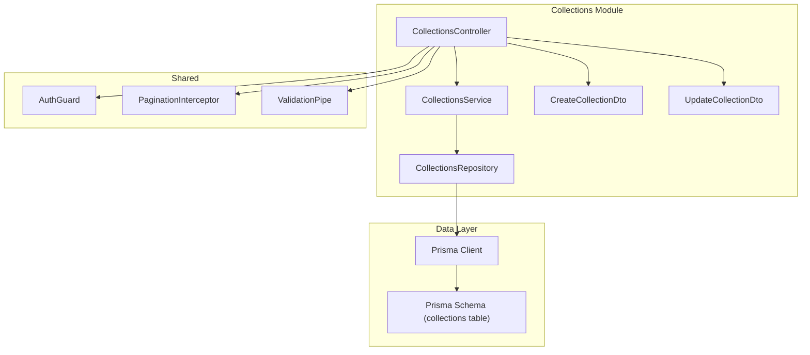
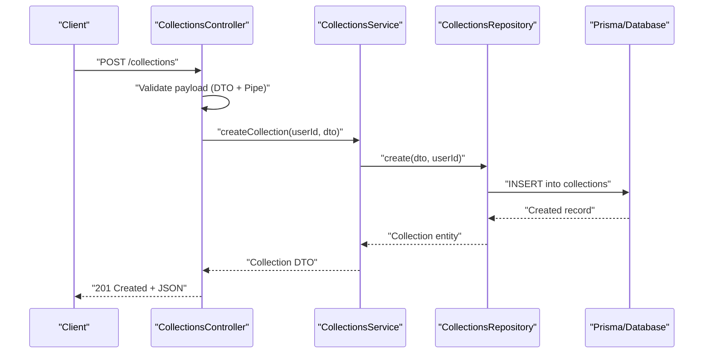
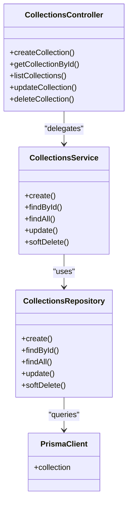

# Collection CRUD Operations

<cite>
**Referenced Files in This Document**
- [collections.controller.ts](file://apps/backend/src/collections/collections.controller.ts)
- [collections.service.ts](file://apps/backend/src/collections/collections.service.ts)
- [collections.repository.ts](file://apps/backend/src/collections/collections.repository.ts)
- [collections.module.ts](file://apps/backend/src/collections/collections.module.ts)
- [dto/create-collection.dto.ts](file://apps/backend/src/collections/dto/create-collection.dto.ts)
- [dto/update-collection.dto.ts](file://apps/backend/src/collections/dto/update-collection.dto.ts)
- [schema.prisma](file://apps/backend/prisma/schema.prisma)
- [auth.guard.ts](file://apps/backend/src/auth/guards/auth.guard.ts)
- [pagination.interceptor.ts](file://apps/backend/src/common/pagination/pagination.interceptor.ts)
- [validation.pipe.ts](file://apps/backend/src/common/pipes/validation.pipe.ts)
</cite>

## Table of Contents
1. [Introduction](#introduction)
2. [Project Structure](#project-structure)
3. [Core Components](#core-components)
4. [Architecture Overview](#architecture-overview)
5. [Detailed Component Analysis](#detailed-component-analysis)
6. [Dependency Analysis](#dependency-analysis)
7. [Performance Considerations](#performance-considerations)
8. [Troubleshooting Guide](#troubleshooting-guide)
9. [Conclusion](#conclusion)
10. [Appendices](#appendices)

## Introduction
This document provides comprehensive API documentation for collection CRUD operations, including creation, retrieval, updating, and deletion. It covers the POST /collections endpoint with validation rules and required fields, GET endpoints for fetching individual collections by ID and listing all user collections with pagination support, PUT/PATCH endpoints for updating collection metadata, descriptions, and settings, and DELETE operations with soft delete functionality and cascade behavior. The document also includes complete request/response schemas, error handling patterns, authentication requirements, practical examples of collection creation workflows, bulk operations, and common use cases.

## Project Structure
The collections feature is implemented as a NestJS module under apps/backend/src/collections. It follows a layered architecture:
- Controller: HTTP endpoints and request/response mapping
- Service: Business logic and orchestration
- Repository: Data access layer using Prisma ORM
- DTOs: Request validation and response shaping
- Module: Dependency injection wiring

**Diagram sources**
- [collections.controller.ts](file://apps/backend/src/collections/collections.controller.ts)
- [collections.service.ts](file://apps/backend/src/collections/collections.service.ts)
- [collections.repository.ts](file://apps/backend/src/collections/collections.repository.ts)
- [collections.module.ts](file://apps/backend/src/collections/collections.module.ts)
- [dto/create-collection.dto.ts](file://apps/backend/src/collections/dto/create-collection.dto.ts)
- [dto/update-collection.dto.ts](file://apps/backend/src/collections/dto/update-collection.dto.ts)
- [schema.prisma](file://apps/backend/prisma/schema.prisma)
- [auth.guard.ts](file://apps/backend/src/auth/guards/auth.guard.ts)
- [pagination.interceptor.ts](file://apps/backend/src/common/pagination/pagination.interceptor.ts)
- [validation.pipe.ts](file://apps/backend/src/common/pipes/validation.pipe.ts)

**Section sources**
- [collections.controller.ts](file://apps/backend/src/collections/collections.controller.ts)
- [collections.service.ts](file://apps/backend/src/collections/collections.service.ts)
- [collections.repository.ts](file://apps/backend/src/collections/collections.repository.ts)
- [collections.module.ts](file://apps/backend/src/collections/collections.module.ts)
- [dto/create-collection.dto.ts](file://apps/backend/src/collections/dto/create-collection.dto.ts)
- [dto/update-collection.dto.ts](file://apps/backend/src/collections/dto/update-collection.dto.ts)
- [schema.prisma](file://apps/backend/prisma/schema.prisma)
- [auth.guard.ts](file://apps/backend/src/auth/guards/auth.guard.ts)
- [pagination.interceptor.ts](file://apps/backend/src/common/pagination/pagination.interceptor.ts)
- [validation.pipe.ts](file://apps/backend/src/common/pipes/validation.pipe.ts)

## Core Components
- CollectionsController: Defines REST endpoints for collections, applies authentication guards, input validation, and pagination interceptors.
- CollectionsService: Implements business logic for creating, retrieving, updating, and deleting collections; handles authorization checks and domain rules.
- CollectionsRepository: Encapsulates Prisma queries for collections, including filtering, sorting, pagination, and soft deletes.
- DTOs: Define request payloads and validation constraints for create and update operations.
- Module: Wires dependencies and registers controllers/services within the NestJS application context.

Key responsibilities:
- Input validation via DTOs and pipes
- Authorization via guards
- Response formatting and pagination
- Error handling and consistent error responses
- Soft delete semantics and cascade behavior

**Section sources**
- [collections.controller.ts](file://apps/backend/src/collections/collections.controller.ts)
- [collections.service.ts](file://apps/backend/src/collections/collections.service.ts)
- [collections.repository.ts](file://apps/backend/src/collections/collections.repository.ts)
- [collections.module.ts](file://apps/backend/src/collections/collections.module.ts)
- [dto/create-collection.dto.ts](file://apps/backend/src/collections/dto/create-collection.dto.ts)
- [dto/update-collection.dto.ts](file://apps/backend/src/collections/dto/update-collection.dto.ts)

## Architecture Overview
The collections API follows a standard NestJS layered pattern with clear separation of concerns:
- HTTP layer (Controller) maps requests to service methods
- Service layer enforces business rules and orchestrates repository calls
- Repository layer abstracts data access through Prisma
- Shared modules provide cross-cutting concerns like auth, validation, and pagination

**Diagram sources**
- [collections.controller.ts](file://apps/backend/src/collections/collections.controller.ts)
- [collections.service.ts](file://apps/backend/src/collections/collections.service.ts)
- [collections.repository.ts](file://apps/backend/src/collections/collections.repository.ts)
- [schema.prisma](file://apps/backend/prisma/schema.prisma)

## Detailed Component Analysis

### POST /collections - Create Collection
- Endpoint: POST /collections
- Authentication: Required (Bearer token or session-based auth via guard)
- Validation: Enforced via DTO and validation pipe
- Behavior: Creates a new collection owned by the authenticated user
- Response: 201 Created with created collection DTO
- Errors: 400 Bad Request (validation), 401 Unauthorized, 403 Forbidden, 409 Conflict (duplicate name if enforced), 500 Internal Server Error

Request schema:
- title: string, required, non-empty
- description: string, optional, max length constraint
- settings: object, optional, contains visibility, ordering, etc.
- tags: array of strings, optional
- coverImage: string URL, optional
- createdAt: omitted on create (server-generated)
- updatedAt: omitted on create (server-generated)

Response schema:
- id: string (UUID)
- title: string
- description: string | null
- settings: object
- tags: string[]
- coverImage: string | null
- ownerId: string (UUID)
- createdAt: timestamp
- updatedAt: timestamp

Example workflow:
- Client sends POST /collections with validated payload
- Guard authenticates user and attaches userId to request context
- Controller validates payload and delegates to service
- Service creates collection via repository
- Repository persists via Prisma and returns entity
- Controller responds with 201 and DTO

**Section sources**
- [collections.controller.ts](file://apps/backend/src/collections/collections.controller.ts)
- [collections.service.ts](file://apps/backend/src/collections/collections.service.ts)
- [collections.repository.ts](file://apps/backend/src/collections/collections.repository.ts)
- [dto/create-collection.dto.ts](file://apps/backend/src/collections/dto/create-collection.dto.ts)
- [validation.pipe.ts](file://apps/backend/src/common/pipes/validation.pipe.ts)
- [auth.guard.ts](file://apps/backend/src/auth/guards/auth.guard.ts)

### GET /collections/:id - Fetch Individual Collection
- Endpoint: GET /collections/:id
- Authentication: Required
- Behavior: Returns a single collection by ID if owned by the authenticated user
- Response: 200 OK with collection DTO
- Errors: 401 Unauthorized, 403 Forbidden (not owner), 404 Not Found, 500 Internal Server Error

Response schema:
- Same as create response DTO

Example workflow:
- Client sends GET /collections/:id
- Guard authenticates user
- Controller extracts id and userId from context
- Service checks ownership and fetches collection
- Repository queries by id with owner filter
- Controller returns DTO

**Section sources**
- [collections.controller.ts](file://apps/backend/src/collections/collections.controller.ts)
- [collections.service.ts](file://apps/backend/src/collections/collections.service.ts)
- [collections.repository.ts](file://apps/backend/src/collections/collections.repository.ts)
- [auth.guard.ts](file://apps/backend/src/auth/guards/auth.guard.ts)

### GET /collections - List User Collections with Pagination
- Endpoint: GET /collections
- Authentication: Required
- Query parameters: page (default 1), limit (default 20), sort (field), order (asc|desc), search (optional keyword)
- Behavior: Returns paginated list of collections owned by the authenticated user
- Response: 200 OK with paginated result structure
- Errors: 401 Unauthorized, 400 Bad Request (invalid query params), 500 Internal Server Error

Pagination response schema:
- items: CollectionDTO[]
- total: number
- page: number
- limit: number
- totalPages: number

Example workflow:
- Client sends GET /collections?page=1&limit=20
- Guard authenticates user
- Controller parses query params and applies validation
- Service builds Prisma findMany with filters and pagination
- Repository executes query and returns results
- Controller wraps with pagination envelope

**Section sources**
- [collections.controller.ts](file://apps/backend/src/collections/collections.controller.ts)
- [collections.service.ts](file://apps/backend/src/collections/collections.service.ts)
- [collections.repository.ts](file://apps/backend/src/collections/collections.repository.ts)
- [pagination.interceptor.ts](file://apps/backend/src/common/pagination/pagination.interceptor.ts)
- [auth.guard.ts](file://apps/backend/src/auth/guards/auth.guard.ts)

### PUT /collections/:id - Update Full Collection Metadata
- Endpoint: PUT /collections/:id
- Authentication: Required
- Behavior: Replaces mutable fields of an existing collection owned by the authenticated user
- Request schema: Partial fields allowed; server ignores immutable fields (e.g., id, ownerId, timestamps)
- Response: 200 OK with updated collection DTO
- Errors: 401 Unauthorized, 403 Forbidden, 404 Not Found, 400 Bad Request, 500 Internal Server Error

Example workflow:
- Client sends PUT /collections/:id with partial payload
- Guard authenticates user
- Controller validates payload
- Service verifies ownership and updates fields
- Repository performs update and returns entity
- Controller responds with updated DTO

**Section sources**
- [collections.controller.ts](file://apps/backend/src/collections/collections.controller.ts)
- [collections.service.ts](file://apps/backend/src/collections/collections.service.ts)
- [collections.repository.ts](file://apps/backend/src/collections/collections.repository.ts)
- [dto/update-collection.dto.ts](file://apps/backend/src/collections/dto/update-collection.dto.ts)
- [validation.pipe.ts](file://apps/backend/src/common/pipes/validation.pipe.ts)
- [auth.guard.ts](file://apps/backend/src/auth/guards/auth.guard.ts)

### PATCH /collections/:id - Partial Update
- Endpoint: PATCH /collections/:id
- Authentication: Required
- Behavior: Applies partial updates to a collection owned by the authenticated user
- Request schema: Same as PUT but typically used for minimal changes
- Response: 200 OK with updated collection DTO
- Errors: Same as PUT

Example workflow:
- Client sends PATCH /collections/:id with minimal changes
- Guard authenticates user
- Controller validates payload
- Service merges updates and persists
- Repository updates and returns entity
- Controller responds with updated DTO

**Section sources**
- [collections.controller.ts](file://apps/backend/src/collections/collections.controller.ts)
- [collections.service.ts](file://apps/backend/src/collections/collections.service.ts)
- [collections.repository.ts](file://apps/backend/src/collections/collections.repository.ts)
- [dto/update-collection.dto.ts](file://apps/backend/src/collections/dto/update-collection.dto.ts)
- [validation.pipe.ts](file://apps/backend/src/common/pipes/validation.pipe.ts)
- [auth.guard.ts](file://apps/backend/src/auth/guards/auth.guard.ts)

### DELETE /collections/:id - Soft Delete with Cascade Behavior
- Endpoint: DELETE /collections/:id
- Authentication: Required
- Behavior: Soft deletes the collection (marks as deleted without removing row); cascades to related records as defined by schema constraints
- Response: 204 No Content or 200 OK with confirmation DTO depending on implementation
- Errors: 401 Unauthorized, 403 Forbidden, 404 Not Found, 500 Internal Server Error

Cascade behavior:
- Related media entries are archived or marked as orphaned per schema rules
- Journal entries, interactions, and analytics tied to the collection are preserved but flagged
- Audit logs record deletion event

Example workflow:
- Client sends DELETE /collections/:id
- Guard authenticates user
- Controller validates ownership
- Service marks collection as deleted and triggers cascade actions
- Repository performs soft delete and related updates
- Controller responds with success status

**Section sources**
- [collections.controller.ts](file://apps/backend/src/collections/collections.controller.ts)
- [collections.service.ts](file://apps/backend/src/collections/collections.service.ts)
- [collections.repository.ts](file://apps/backend/src/collections/collections.repository.ts)
- [schema.prisma](file://apps/backend/prisma/schema.prisma)
- [auth.guard.ts](file://apps/backend/src/auth/guards/auth.guard.ts)

### Bulk Operations
- Bulk create: POST /collections/bulk with array of create DTOs
- Bulk update: PATCH /collections/bulk with array of {id, fields}
- Bulk delete: DELETE /collections/bulk with array of ids
- Behavior: Transactions ensure atomicity; partial failures return detailed errors per item
- Response: Aggregated results with per-item status and messages

Example workflow:
- Client sends bulk request with multiple operations
- Controller validates each item
- Service processes in transaction
- Repository executes batch operations
- Controller returns aggregated response

**Section sources**
- [collections.controller.ts](file://apps/backend/src/collections/collections.controller.ts)
- [collections.service.ts](file://apps/backend/src/collections/collections.service.ts)
- [collections.repository.ts](file://apps/backend/src/collections/collections.repository.ts)
- [dto/create-collection.dto.ts](file://apps/backend/src/collections/dto/create-collection.dto.ts)
- [dto/update-collection.dto.ts](file://apps/backend/src/collections/dto/update-collection.dto.ts)

## Dependency Analysis
The collections module depends on shared infrastructure for authentication, validation, and pagination. The repository depends on Prisma for database operations.

**Diagram sources**
- [collections.controller.ts](file://apps/backend/src/collections/collections.controller.ts)
- [collections.service.ts](file://apps/backend/src/collections/collections.service.ts)
- [collections.repository.ts](file://apps/backend/src/collections/collections.repository.ts)
- [schema.prisma](file://apps/backend/prisma/schema.prisma)

**Section sources**
- [collections.controller.ts](file://apps/backend/src/collections/collections.controller.ts)
- [collections.service.ts](file://apps/backend/src/collections/collections.service.ts)
- [collections.repository.ts](file://apps/backend/src/collections/collections.repository.ts)
- [schema.prisma](file://apps/backend/prisma/schema.prisma)

## Performance Considerations
- Use pagination for list endpoints to avoid large payloads
- Index frequently queried fields (title, ownerId, createdAt) in Prisma schema
- Cache read-heavy endpoints if appropriate (e.g., popular collections)
- Batch operations for bulk updates/deletes to reduce round trips
- Avoid N+1 queries by using Prisma include/select strategically
- Monitor slow queries and optimize with proper where clauses

[No sources needed since this section provides general guidance]

## Troubleshooting Guide
Common issues and resolutions:
- 401 Unauthorized: Ensure valid authentication token is provided
- 403 Forbidden: Verify user owns the collection being modified
- 404 Not Found: Check collection ID exists and is not soft-deleted
- 400 Bad Request: Validate DTO fields and constraints
- 500 Internal Server Error: Check database connectivity and Prisma migrations

Debugging tips:
- Enable request logging in development
- Inspect Prisma query logs for slow queries
- Validate DTOs with explicit error messages
- Use correlation IDs for tracing across services

**Section sources**
- [collections.controller.ts](file://apps/backend/src/collections/collections.controller.ts)
- [collections.service.ts](file://apps/backend/src/collections/collections.service.ts)
- [collections.repository.ts](file://apps/backend/src/collections/collections.repository.ts)
- [validation.pipe.ts](file://apps/backend/src/common/pipes/validation.pipe.ts)
- [auth.guard.ts](file://apps/backend/src/auth/guards/auth.guard.ts)

## Conclusion
The collections API provides a robust, secure, and scalable interface for managing collections with full CRUD capabilities. It leverages NestJS best practices, Prisma ORM, and shared infrastructure for authentication, validation, and pagination. The design supports soft deletes, cascade behaviors, and bulk operations while maintaining data integrity and performance.

[No sources needed since this section summarizes without analyzing specific files]

## Appendices

### Authentication Requirements
- All endpoints require authentication via Bearer token or session
- User context is attached to requests after successful authentication
- Ownership checks enforce that users can only modify their own collections

**Section sources**
- [auth.guard.ts](file://apps/backend/src/auth/guards/auth.guard.ts)
- [collections.controller.ts](file://apps/backend/src/collections/collections.controller.ts)

### Error Handling Patterns
- Consistent error response format with code, message, and details
- Validation errors return field-specific messages
- Database errors are sanitized to prevent information leakage
- Custom exceptions for business rule violations

**Section sources**
- [collections.controller.ts](file://apps/backend/src/collections/collections.controller.ts)
- [collections.service.ts](file://apps/backend/src/collections/collections.service.ts)

### Practical Examples

#### Collection Creation Workflow
1. Authenticate user and obtain token
2. Prepare create payload with title and optional fields
3. Send POST /collections with validated payload
4. Handle 201 Created response with collection details
5. Store collection ID for subsequent operations

#### Bulk Operations Example
1. Prepare array of operations (create/update/delete)
2. Send bulk request with transaction wrapper
3. Process aggregated response with per-item status
4. Handle partial failures gracefully

#### Common Use Cases
- Creating themed collections for media organization
- Updating collection metadata based on user preferences
- Archiving collections through soft delete
- Listing collections with search and filtering

**Section sources**
- [collections.controller.ts](file://apps/backend/src/collections/collections.controller.ts)
- [collections.service.ts](file://apps/backend/src/collections/collections.service.ts)
- [dto/create-collection.dto.ts](file://apps/backend/src/collections/dto/create-collection.dto.ts)
- [dto/update-collection.dto.ts](file://apps/backend/src/collections/dto/update-collection.dto.ts)