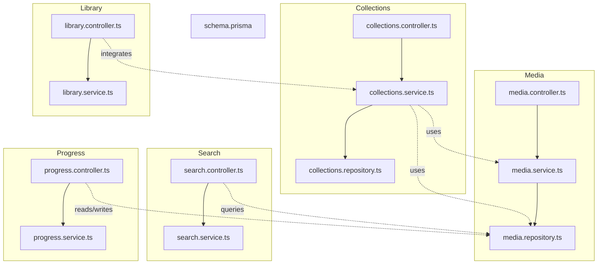
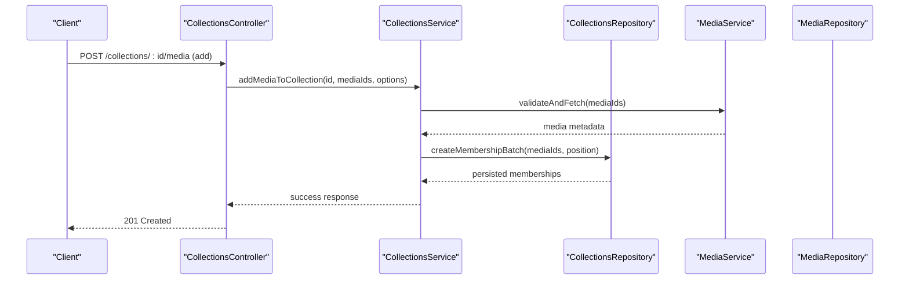
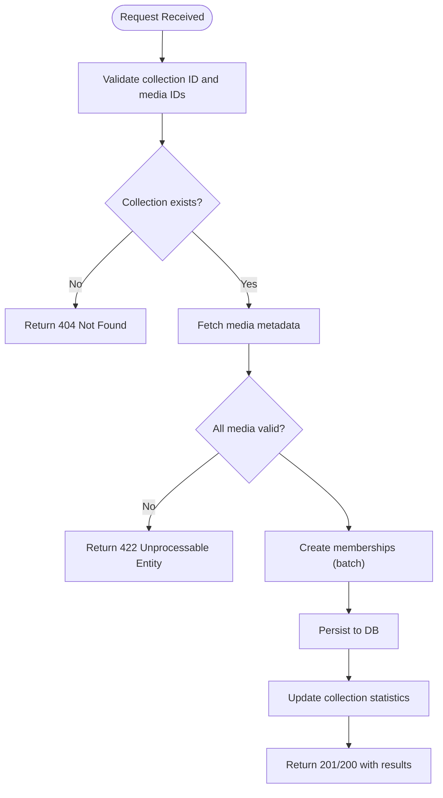
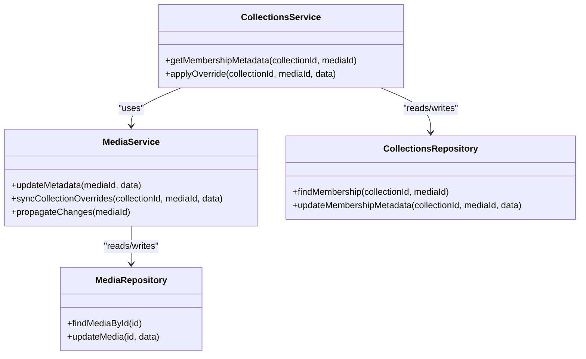
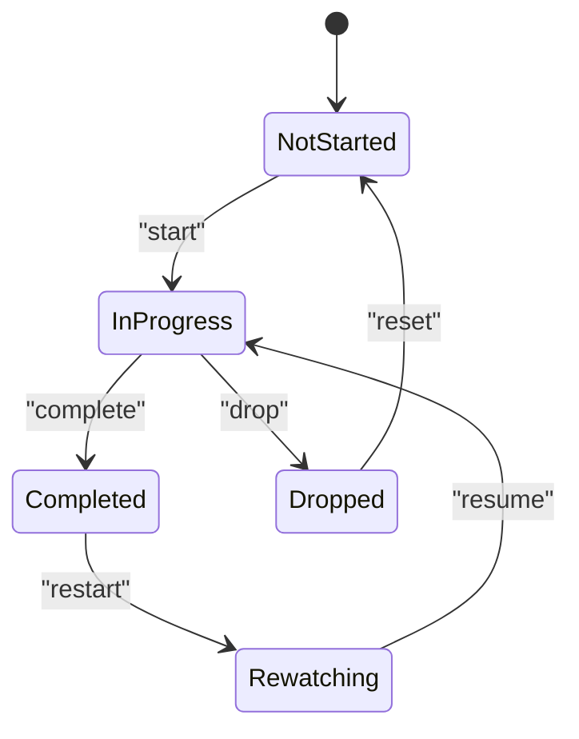
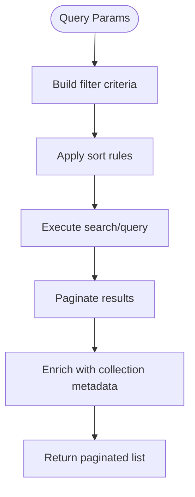
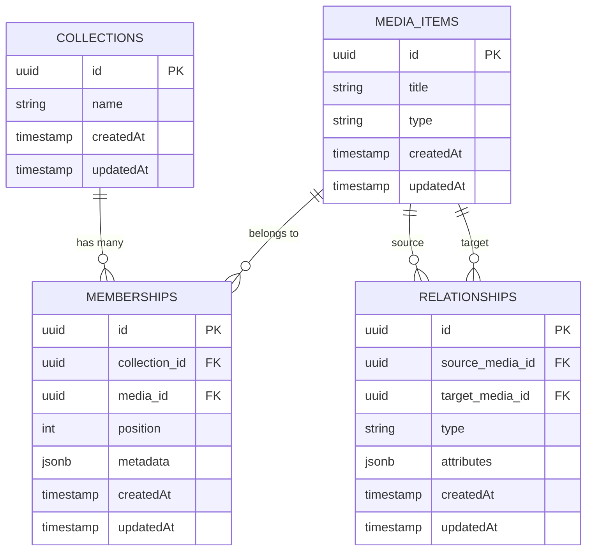
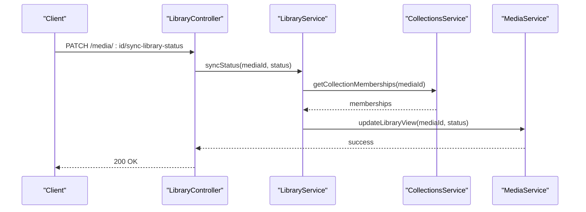
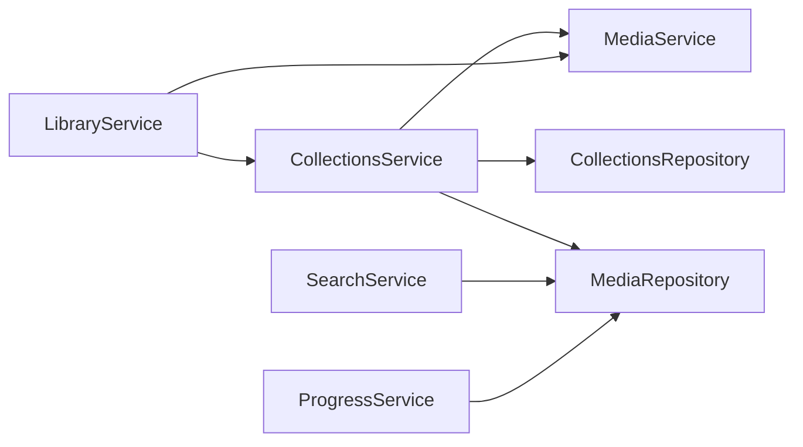

# Collection Media Management

<cite>
**Referenced Files in This Document**
- [collections.controller.ts](file://apps/backend/src/collections/collections.controller.ts)
- [collections.service.ts](file://apps/backend/src/collections/collections.service.ts)
- [collections.repository.ts](file://apps/backend/src/collections/collections.repository.ts)
- [media.controller.ts](file://apps/backend/src/media/media.controller.ts)
- [media.service.ts](file://apps/backend/src/media/media.service.ts)
- [media.repository.ts](file://apps/backend/src/media/media.repository.ts)
- [library.controller.ts](file://apps/backend/src/library/library.controller.ts)
- [library.service.ts](file://apps/backend/src/library/library.service.ts)
- [search.controller.ts](file://apps/backend/src/search/search.controller.ts)
- [search.service.ts](file://apps/backend/src/search/search.service.ts)
- [progress.controller.ts](file://apps/backend/src/progress/progress.controller.ts)
- [progress.service.ts](file://apps/backend/src/progress/progress.service.ts)
- [schema.prisma](file://apps/backend/prisma/schema.prisma)
</cite>

## Table of Contents
1. [Introduction](#introduction)
2. [Project Structure](#project-structure)
3. [Core Components](#core-components)
4. [Architecture Overview](#architecture-overview)
5. [Detailed Component Analysis](#detailed-component-analysis)
6. [Dependency Analysis](#dependency-analysis)
7. [Performance Considerations](#performance-considerations)
8. [Troubleshooting Guide](#troubleshooting-guide)
9. [Conclusion](#conclusion)
10. [Appendices](#appendices)

## Introduction
This document provides detailed API documentation for managing media items within collections. It covers endpoints and workflows for adding, removing, reordering, and mapping relationships between media items and collections. It also documents bulk operations (batch additions, mass deletions), metadata synchronization, status tracking, progress monitoring, collection-specific filtering, sorting, search, cross-references, dependency tracking, and integration with the main library system. Examples include common media organization workflows and bulk import/export patterns.

## Project Structure
The backend is organized by feature modules:
- Collections module exposes controllers, services, and repositories for collection management and media-item membership.
- Media module manages media item lifecycle, metadata, and repository access.
- Library module coordinates core library operations and integrates with collections.
- Search module provides query, filtering, and suggestion capabilities used by collection views.
- Progress module tracks per-collection media progress and status.
- Prisma schema defines entities and relationships for collections, media items, memberships, and related structures.

**Diagram sources**
- [collections.controller.ts](file://apps/backend/src/collections/collections.controller.ts)
- [collections.service.ts](file://apps/backend/src/collections/collections.service.ts)
- [collections.repository.ts](file://apps/backend/src/collections/collections.repository.ts)
- [media.controller.ts](file://apps/backend/src/media/media.controller.ts)
- [media.service.ts](file://apps/backend/src/media/media.service.ts)
- [media.repository.ts](file://apps/backend/src/media/media.repository.ts)
- [library.controller.ts](file://apps/backend/src/library/library.controller.ts)
- [library.service.ts](file://apps/backend/src/library/library.service.ts)
- [search.controller.ts](file://apps/backend/src/search/search.controller.ts)
- [search.service.ts](file://apps/backend/src/search/search.service.ts)
- [progress.controller.ts](file://apps/backend/src/progress/progress.controller.ts)
- [progress.service.ts](file://apps/backend/src/progress/progress.service.ts)
- [schema.prisma](file://apps/backend/prisma/schema.prisma)

**Section sources**
- [collections.controller.ts](file://apps/backend/src/collections/collections.controller.ts)
- [collections.service.ts](file://apps/backend/src/collections/collections.service.ts)
- [collections.repository.ts](file://apps/backend/src/collections/collections.repository.ts)
- [media.controller.ts](file://apps/backend/src/media/media.controller.ts)
- [media.service.ts](file://apps/backend/src/media/media.service.ts)
- [media.repository.ts](file://apps/backend/src/media/media.repository.ts)
- [library.controller.ts](file://apps/backend/src/library/library.controller.ts)
- [library.service.ts](file://apps/backend/src/library/library.service.ts)
- [search.controller.ts](file://apps/backend/src/search/search.controller.ts)
- [search.service.ts](file://apps/backend/src/search/search.service.ts)
- [progress.controller.ts](file://apps/backend/src/progress/progress.controller.ts)
- [progress.service.ts](file://apps/backend/src/progress/progress.service.ts)
- [schema.prisma](file://apps/backend/prisma/schema.prisma)

## Core Components
- Collections Controller: Defines HTTP endpoints for collection CRUD and media membership operations.
- Collections Service: Implements business logic for adding/removing media, reordering, batch operations, and relationship mapping.
- Collections Repository: Persists collection and membership data via Prisma.
- Media Controller: Exposes media item endpoints including metadata updates and bulk operations.
- Media Service: Orchestrates media metadata synchronization, validation, and interactions with storage and library.
- Media Repository: Provides data access to media items and their relationships.
- Library Controller/Service: Coordinates library-level operations that integrate with collections (e.g., syncing statuses).
- Search Controller/Service: Supports collection-scoped filtering, sorting, and full-text search.
- Progress Controller/Service: Tracks per-collection media progress and status updates.

Key responsibilities:
- Add/remove/reorder media items within a collection.
- Perform batch additions and mass deletions efficiently.
- Synchronize media metadata across collections and library.
- Track and report progress and status per collection.
- Provide filtering, sorting, and search scoped to a collection.
- Manage relationships and dependencies between media items.

**Section sources**
- [collections.controller.ts](file://apps/backend/src/collections/collections.controller.ts)
- [collections.service.ts](file://apps/backend/src/collections/collections.service.ts)
- [collections.repository.ts](file://apps/backend/src/collections/collections.repository.ts)
- [media.controller.ts](file://apps/backend/src/media/media.controller.ts)
- [media.service.ts](file://apps/backend/src/media/media.service.ts)
- [media.repository.ts](file://apps/backend/src/media/media.repository.ts)
- [library.controller.ts](file://apps/backend/src/library/library.controller.ts)
- [library.service.ts](file://apps/backend/src/library/library.service.ts)
- [search.controller.ts](file://apps/backend/src/search/search.controller.ts)
- [search.service.ts](file://apps/backend/src/search/search.service.ts)
- [progress.controller.ts](file://apps/backend/src/progress/progress.controller.ts)
- [progress.service.ts](file://apps/backend/src/progress/progress.service.ts)

## Architecture Overview
The system follows a layered architecture:
- Controllers handle HTTP requests and responses.
- Services encapsulate business logic and orchestrate operations.
- Repositories abstract database access using Prisma.
- Shared modules provide utilities like pagination, result wrappers, and idempotency.

**Diagram sources**
- [collections.controller.ts](file://apps/backend/src/collections/collections.controller.ts)
- [collections.service.ts](file://apps/backend/src/collections/collections.service.ts)
- [collections.repository.ts](file://apps/backend/src/collections/collections.repository.ts)
- [media.controller.ts](file://apps/backend/src/media/media.controller.ts)
- [media.service.ts](file://apps/backend/src/media/media.service.ts)
- [media.repository.ts](file://apps/backend/src/media/media.repository.ts)

## Detailed Component Analysis

### Collections API
Endpoints for managing media items within collections:
- Add media to collection: POST /collections/:id/media
  - Body includes media IDs, optional positions, and flags for metadata sync.
  - Returns created memberships and updated collection stats.
- Remove media from collection: DELETE /collections/:id/media/:mediaId
  - Removes membership and updates progress/status if applicable.
- Reorder media: PATCH /collections/:id/media/reorder
  - Accepts ordered list of media IDs or explicit position mappings.
- Batch add media: POST /collections/:id/media/batch
  - Accepts array of media IDs and batch options; supports idempotency keys.
- Mass delete media: DELETE /collections/:id/media/mass-delete
  - Bulk removal with filters (e.g., by tags, status) and confirmation.
- List collection media: GET /collections/:id/media
  - Query params support filtering, sorting, pagination, and search.
- Update membership metadata: PATCH /collections/:id/media/:mediaId/metadata
  - Syncs per-collection notes, ratings, or custom fields.

**Diagram sources**
- [collections.controller.ts](file://apps/backend/src/collections/collections.controller.ts)
- [collections.service.ts](file://apps/backend/src/collections/collections.service.ts)
- [collections.repository.ts](file://apps/backend/src/collections/collections.repository.ts)

**Section sources**
- [collections.controller.ts](file://apps/backend/src/collections/collections.controller.ts)
- [collections.service.ts](file://apps/backend/src/collections/collections.service.ts)
- [collections.repository.ts](file://apps/backend/src/collections/collections.repository.ts)

### Media Metadata Synchronization
- Endpoint: PATCH /media/:id/metadata
  - Updates global media metadata (title, description, tags, etc.).
  - Propagates changes to collection memberships where applicable.
- Endpoint: PATCH /collections/:id/media/:mediaId/metadata
  - Overrides or extends metadata at the collection scope.
- Behavior:
  - Conflict resolution prefers collection-scoped overrides.
  - Background jobs may refresh derived fields (e.g., thumbnails, summaries).

**Diagram sources**
- [media.service.ts](file://apps/backend/src/media/media.service.ts)
- [media.repository.ts](file://apps/backend/src/media/media.repository.ts)
- [collections.service.ts](file://apps/backend/src/collections/collections.service.ts)
- [collections.repository.ts](file://apps/backend/src/collections/collections.repository.ts)

**Section sources**
- [media.controller.ts](file://apps/backend/src/media/media.controller.ts)
- [media.service.ts](file://apps/backend/src/media/media.service.ts)
- [collections.service.ts](file://apps/backend/src/collections/collections.service.ts)

### Status Tracking and Progress Monitoring
- Endpoints:
  - GET /collections/:id/media/:mediaId/progress
  - PUT /collections/:id/media/:mediaId/progress
  - GET /collections/:id/progress/summary
- Features:
  - Per-collection progress states (not started, in-progress, completed, dropped).
  - Timestamps for state transitions and last activity.
  - Aggregated summary for collection-wide progress metrics.

**Diagram sources**
- [progress.controller.ts](file://apps/backend/src/progress/progress.controller.ts)
- [progress.service.ts](file://apps/backend/src/progress/progress.service.ts)

**Section sources**
- [progress.controller.ts](file://apps/backend/src/progress/progress.controller.ts)
- [progress.service.ts](file://apps/backend/src/progress/progress.service.ts)

### Filtering, Sorting, and Search within Collections
- Endpoints:
  - GET /collections/:id/media?filter=&sort=&q=
- Capabilities:
  - Filter by tags, status, date ranges, and custom fields.
  - Sort by title, addedAt, rating, or custom sort keys.
  - Full-text search across titles, descriptions, and tags.
  - Pagination with cursor or offset strategies.

**Diagram sources**
- [search.controller.ts](file://apps/backend/src/search/search.controller.ts)
- [search.service.ts](file://apps/backend/src/search/search.service.ts)
- [media.repository.ts](file://apps/backend/src/media/media.repository.ts)

**Section sources**
- [search.controller.ts](file://apps/backend/src/search/search.controller.ts)
- [search.service.ts](file://apps/backend/src/search/search.service.ts)
- [media.repository.ts](file://apps/backend/src/media/media.repository.ts)

### Relationship Management and Dependency Tracking
- Cross-references:
  - Link media items to other media (sequels, prequels, companions).
  - Maintain dependency graphs for series or franchises.
- Endpoints:
  - POST /media/:id/relationships
  - GET /media/:id/relationships
  - PATCH /media/:id/relationships/:relId
  - DELETE /media/:id/relationships/:relId
- Behavior:
  - Enforce referential integrity via foreign keys.
  - Support bidirectional relationships and role labels.

**Diagram sources**
- [schema.prisma](file://apps/backend/prisma/schema.prisma)

**Section sources**
- [media.controller.ts](file://apps/backend/src/media/media.controller.ts)
- [media.service.ts](file://apps/backend/src/media/media.service.ts)
- [media.repository.ts](file://apps/backend/src/media/media.repository.ts)
- [schema.prisma](file://apps/backend/prisma/schema.prisma)

### Integration with Main Library System
- Syncing statuses:
  - When a media item’s status changes in a collection, propagate to library view if configured.
- Bulk import/export:
  - Import CSV/JSON into collections with mapping rules.
  - Export collection contents with metadata and relationships.
- Endpoints:
  - POST /collections/:id/import
  - GET /collections/:id/export
  - PATCH /media/:id/sync-library-status

**Diagram sources**
- [library.controller.ts](file://apps/backend/src/library/library.controller.ts)
- [library.service.ts](file://apps/backend/src/library/library.service.ts)
- [collections.service.ts](file://apps/backend/src/collections/collections.service.ts)
- [media.service.ts](file://apps/backend/src/media/media.service.ts)

**Section sources**
- [library.controller.ts](file://apps/backend/src/library/library.controller.ts)
- [library.service.ts](file://apps/backend/src/library/library.service.ts)
- [collections.service.ts](file://apps/backend/src/collections/collections.service.ts)
- [media.service.ts](file://apps/backend/src/media/media.service.ts)

## Dependency Analysis
- Collections depend on Media for validation and metadata retrieval.
- Search depends on Media repository for querying and enrichment.
- Progress depends on Media repository for per-collection progress records.
- Library integration depends on both Collections and Media services for consistent state.

**Diagram sources**
- [collections.service.ts](file://apps/backend/src/collections/collections.service.ts)
- [media.service.ts](file://apps/backend/src/media/media.service.ts)
- [media.repository.ts](file://apps/backend/src/media/media.repository.ts)
- [collections.repository.ts](file://apps/backend/src/collections/collections.repository.ts)
- [search.service.ts](file://apps/backend/src/search/search.service.ts)
- [progress.service.ts](file://apps/backend/src/progress/progress.service.ts)
- [library.service.ts](file://apps/backend/src/library/library.service.ts)

**Section sources**
- [collections.service.ts](file://apps/backend/src/collections/collections.service.ts)
- [media.service.ts](file://apps/backend/src/media/media.service.ts)
- [media.repository.ts](file://apps/backend/src/media/media.repository.ts)
- [collections.repository.ts](file://apps/backend/src/collections/collections.repository.ts)
- [search.service.ts](file://apps/backend/src/search/search.service.ts)
- [progress.service.ts](file://apps/backend/src/progress/progress.service.ts)
- [library.service.ts](file://apps/backend/src/library/library.service.ts)

## Performance Considerations
- Use batch operations for large sets of media to reduce round trips.
- Implement idempotency keys for bulk imports to prevent duplicates.
- Leverage pagination and cursors for large collection lists.
- Cache frequently accessed collection metadata and search results.
- Optimize queries with appropriate indexes on foreign keys and commonly filtered fields.
- Offload heavy tasks (metadata refresh, thumbnail generation) to background jobs.

[No sources needed since this section provides general guidance]

## Troubleshooting Guide
Common issues and resolutions:
- Validation errors when adding media: Ensure media IDs exist and are accessible.
- Duplicate memberships: Use idempotency keys or check existing memberships before creating.
- Metadata conflicts: Prefer collection-scoped overrides; log conflicts for review.
- Progress inconsistencies: Re-sync progress from membership timestamps and last activity.
- Search performance: Verify indexes and consider caching search results.

**Section sources**
- [collections.controller.ts](file://apps/backend/src/collections/collections.controller.ts)
- [collections.service.ts](file://apps/backend/src/collections/collections.service.ts)
- [media.controller.ts](file://apps/backend/src/media/media.controller.ts)
- [media.service.ts](file://apps/backend/src/media/media.service.ts)
- [search.service.ts](file://apps/backend/src/search/search.service.ts)
- [progress.service.ts](file://apps/backend/src/progress/progress.service.ts)

## Conclusion
The collection media management system provides robust APIs for organizing media items within collections, supporting addition, removal, reordering, and relationship mapping. It enables bulk operations, metadata synchronization, status tracking, progress monitoring, and advanced filtering, sorting, and search. Integration with the library system ensures consistent state across views. Following best practices for batching, idempotency, and caching will optimize performance and reliability.

[No sources needed since this section summarizes without analyzing specific files]

## Appendices

### Example Workflows
- Adding multiple media to a collection:
  - Use batch add endpoint with an array of media IDs and optional positions.
  - Confirm creation via returned memberships and updated collection stats.
- Reordering media:
  - Submit ordered list of media IDs or explicit position mappings.
  - Validate order constraints and persist new positions.
- Removing media in bulk:
  - Use mass delete with filters to remove matching memberships.
  - Update progress and statistics accordingly.
- Importing media:
  - Upload CSV/JSON with mapping rules.
  - Validate and create memberships; handle duplicates via idempotency.
- Exporting collection:
  - Request export with desired fields and formats.
  - Receive downloadable archive with metadata and relationships.

[No sources needed since this section provides conceptual examples]