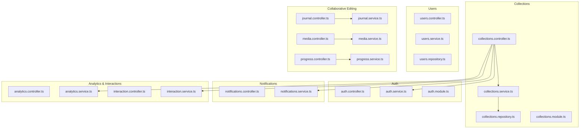
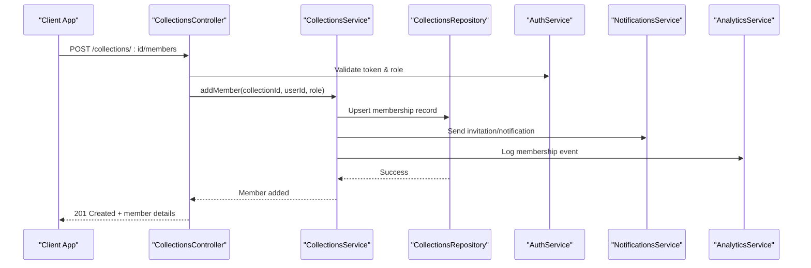
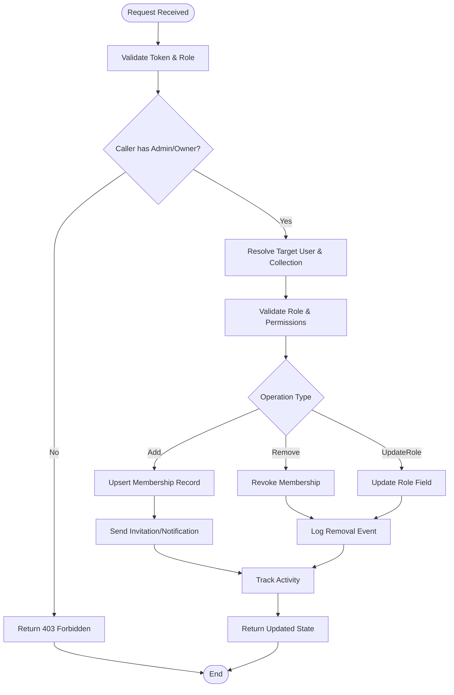
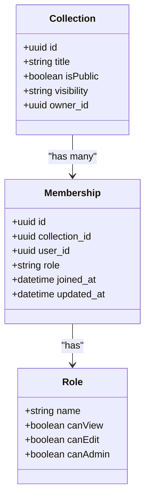
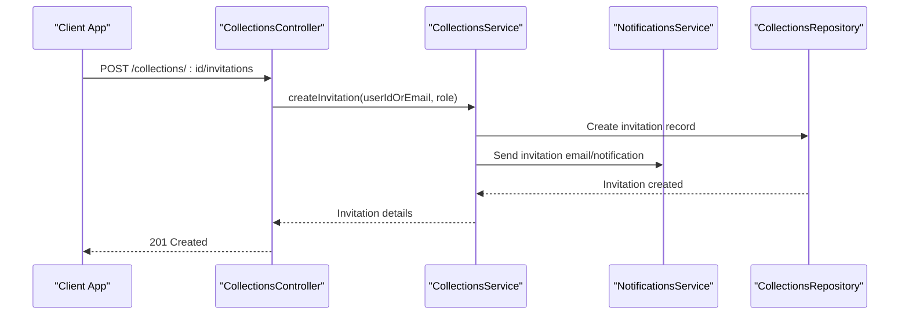
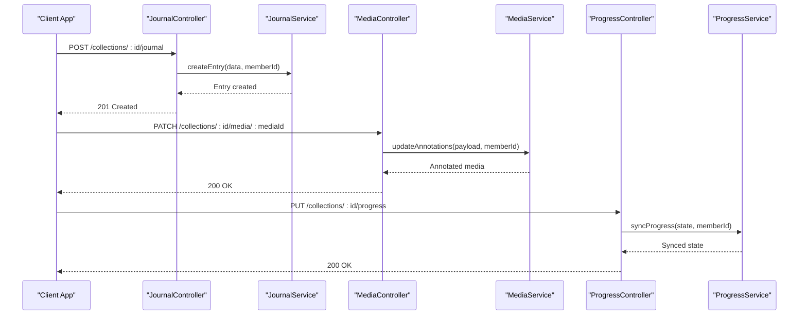
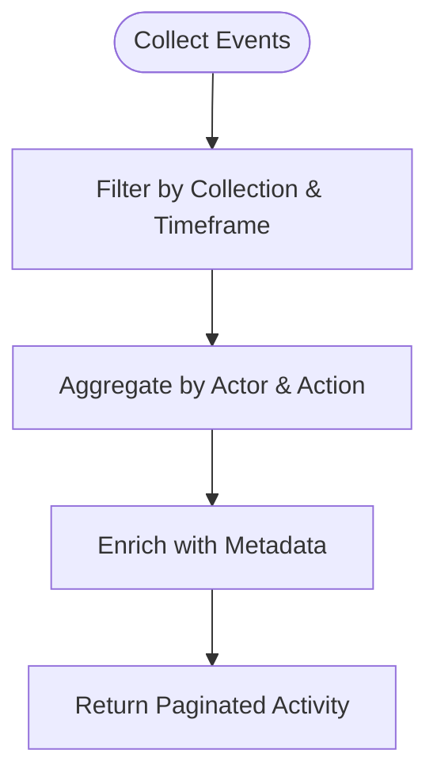
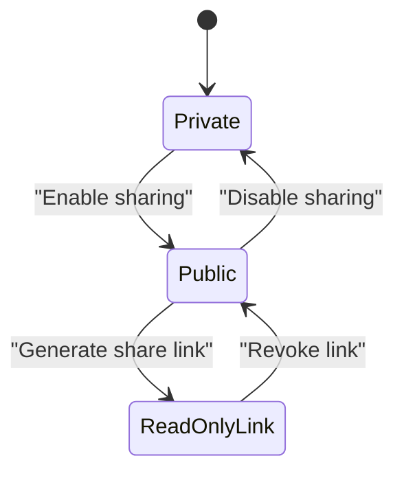
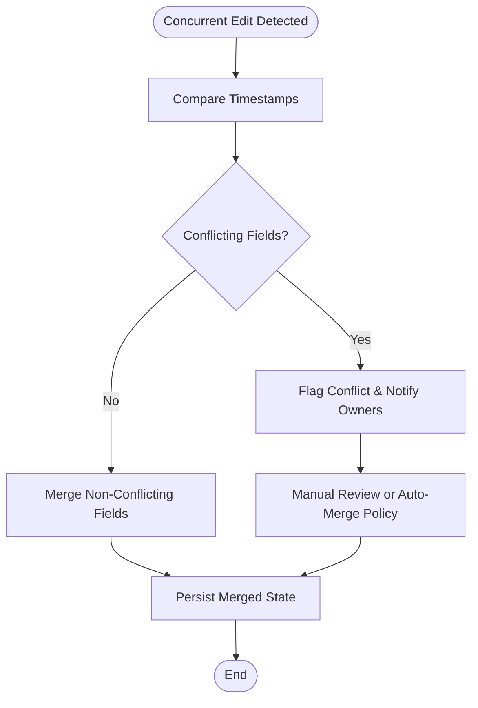
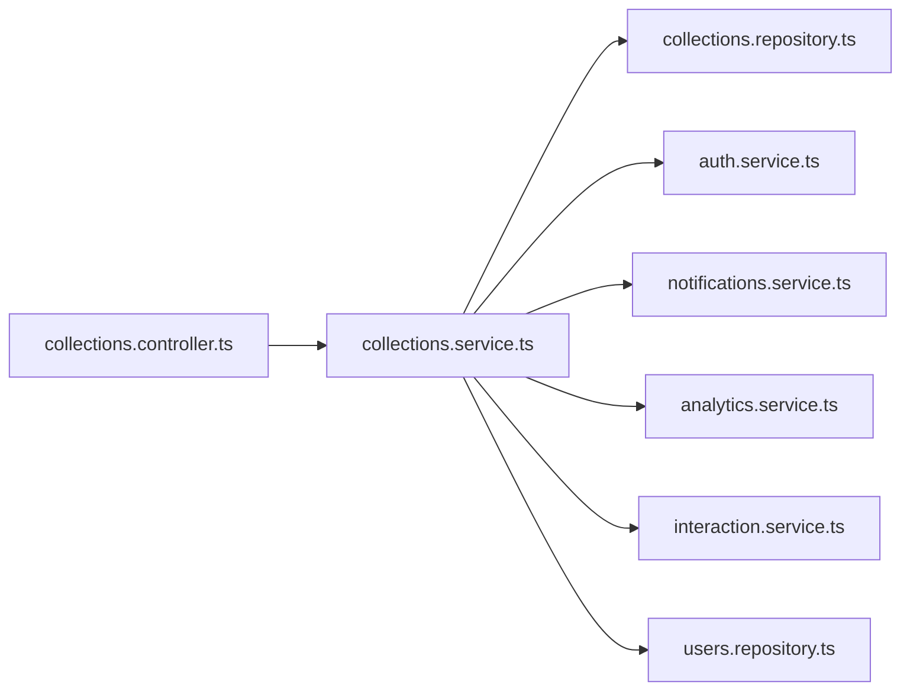

# Collection Membership & Collaboration

<cite>
**Referenced Files in This Document**
- [collections.controller.ts](file://apps/backend/src/collections/collections.controller.ts)
- [collections.service.ts](file://apps/backend/src/collections/collections.service.ts)
- [collections.repository.ts](file://apps/backend/src/collections/collections.repository.ts)
- [collections.module.ts](file://apps/backend/src/collections/collections.module.ts)
- [auth.controller.ts](file://apps/backend/src/auth/auth.controller.ts)
- [auth.service.ts](file://apps/backend/src/auth/auth.service.ts)
- [auth.module.ts](file://apps/backend/src/auth/auth.module.ts)
- [users.controller.ts](file://apps/backend/src/users/users.controller.ts)
- [users.service.ts](file://apps/backend/src/users/users.service.ts)
- [users.repository.ts](file://apps/backend/src/users/users.repository.ts)
- [schema.prisma](file://apps/backend/prisma/schema.prisma)
- [analytics.controller.ts](file://apps/backend/src/analytics/analytics.controller.ts)
- [analytics.service.ts](file://apps/backend/src/analytics/analytics.service.ts)
- [interaction.controller.ts](file://apps/backend/src/interaction/interaction.controller.ts)
- [interaction.service.ts](file://apps/backend/src/interaction/interaction.service.ts)
- [notifications.controller.ts](file://apps/backend/src/notifications/notifications.controller.ts)
- [notifications.service.ts](file://apps/backend/src/notifications/notifications.service.ts)
- [journal.controller.ts](file://apps/backend/src/journal/journal.controller.ts)
- [journal.service.ts](file://apps/backend/src/journal/journal.service.ts)
- [media.controller.ts](file://apps/backend/src/media/media.controller.ts)
- [media.service.ts](file://apps/backend/src/media/media.service.ts)
- [progress.controller.ts](file://apps/backend/src/progress/progress.controller.ts)
- [progress.service.ts](file://apps/backend/src/progress/progress.service.ts)
</cite>

## Table of Contents
1. [Introduction](#introduction)
2. [Project Structure](#project-structure)
3. [Core Components](#core-components)
4. [Architecture Overview](#architecture-overview)
5. [Detailed Component Analysis](#detailed-component-analysis)
6. [Dependency Analysis](#dependency-analysis)
7. [Performance Considerations](#performance-considerations)
8. [Troubleshooting Guide](#troubleshooting-guide)
9. [Conclusion](#conclusion)
10. [Appendices](#appendices)

## Introduction
This document provides comprehensive API documentation for collection membership management and collaborative features. It covers endpoints and workflows for adding/removing members, setting permissions (view, edit, admin), managing access control lists, invitations, role-based permissions, collaborative editing, activity tracking, contribution history, conflict resolution, sharing mechanisms, public/private settings, and cross-user collaboration patterns. The content is derived from the backend modules that implement collections, users, authentication, notifications, analytics, interactions, journaling, media, and progress services.

## Project Structure
The relevant backend implementation is organized by feature modules:
- Collections module exposes controllers, services, and repositories for collection lifecycle and membership operations.
- Auth module handles authentication and authorization guards/decorators used across endpoints.
- Users module manages user profiles and relationships.
- Notifications module supports invitation delivery and updates.
- Analytics and Interaction modules provide activity and engagement tracking.
- Journal, Media, and Progress modules contribute to collaborative editing and versioning signals.

**Diagram sources**
- [collections.controller.ts](file://apps/backend/src/collections/collections.controller.ts)
- [collections.service.ts](file://apps/backend/src/collections/collections.service.ts)
- [collections.repository.ts](file://apps/backend/src/collections/collections.repository.ts)
- [auth.controller.ts](file://apps/backend/src/auth/auth.controller.ts)
- [auth.service.ts](file://apps/backend/src/auth/auth.service.ts)
- [users.controller.ts](file://apps/backend/src/users/users.controller.ts)
- [users.service.ts](file://apps/backend/src/users/users.service.ts)
- [notifications.controller.ts](file://apps/backend/src/notifications/notifications.controller.ts)
- [notifications.service.ts](file://apps/backend/src/notifications/notifications.service.ts)
- [analytics.controller.ts](file://apps/backend/src/analytics/analytics.controller.ts)
- [analytics.service.ts](file://apps/backend/src/analytics/analytics.service.ts)
- [interaction.controller.ts](file://apps/backend/src/interaction/interaction.controller.ts)
- [interaction.service.ts](file://apps/backend/src/interaction/interaction.service.ts)
- [journal.controller.ts](file://apps/backend/src/journal/journal.controller.ts)
- [journal.service.ts](file://apps/backend/src/journal/journal.service.ts)
- [media.controller.ts](file://apps/backend/src/media/media.controller.ts)
- [media.service.ts](file://apps/backend/src/media/media.service.ts)
- [progress.controller.ts](file://apps/backend/src/progress/progress.controller.ts)
- [progress.service.ts](file://apps/backend/src/progress/progress.service.ts)

**Section sources**
- [collections.controller.ts](file://apps/backend/src/collections/collections.controller.ts)
- [collections.service.ts](file://apps/backend/src/collections/collections.service.ts)
- [collections.repository.ts](file://apps/backend/src/collections/collections.repository.ts)
- [auth.controller.ts](file://apps/backend/src/auth/auth.controller.ts)
- [auth.service.ts](file://apps/backend/src/auth/auth.service.ts)
- [users.controller.ts](file://apps/backend/src/users/users.controller.ts)
- [users.service.ts](file://apps/backend/src/users/users.service.ts)
- [notifications.controller.ts](file://apps/backend/src/notifications/notifications.controller.ts)
- [notifications.service.ts](file://apps/backend/src/notifications/notifications.service.ts)
- [analytics.controller.ts](file://apps/backend/src/analytics/analytics.controller.ts)
- [analytics.service.ts](file://apps/backend/src/analytics/analytics.service.ts)
- [interaction.controller.ts](file://apps/backend/src/interaction/interaction.controller.ts)
- [interaction.service.ts](file://apps/backend/src/interaction/interaction.service.ts)
- [journal.controller.ts](file://apps/backend/src/journal/journal.controller.ts)
- [journal.service.ts](file://apps/backend/src/journal/journal.service.ts)
- [media.controller.ts](file://apps/backend/src/media/media.controller.ts)
- [media.service.ts](file://apps/backend/src/media/media.service.ts)
- [progress.controller.ts](file://apps/backend/src/progress/progress.controller.ts)
- [progress.service.ts](file://apps/backend/src/progress/progress.service.ts)

## Core Components
- Collections Controller: Exposes endpoints for collection CRUD, member management, permission changes, and sharing configuration.
- Collections Service: Implements business logic for membership operations, permission checks, invitation handling, and audit events.
- Collections Repository: Data access layer for collection and membership records.
- Auth Module: Provides authentication and authorization decorators/guards used by protected endpoints.
- Users Module: Manages user entities and relationships used in membership and invitations.
- Notifications Module: Sends invitations and updates to collaborators.
- Analytics & Interaction Modules: Track member activity and contributions.
- Journal/Media/Progress Modules: Support collaborative editing and change tracking.

**Section sources**
- [collections.controller.ts](file://apps/backend/src/collections/collections.controller.ts)
- [collections.service.ts](file://apps/backend/src/collections/collections.service.ts)
- [collections.repository.ts](file://apps/backend/src/collections/collections.repository.ts)
- [auth.controller.ts](file://apps/backend/src/auth/auth.controller.ts)
- [auth.service.ts](file://apps/backend/src/auth/auth.service.ts)
- [users.controller.ts](file://apps/backend/src/users/users.controller.ts)
- [users.service.ts](file://apps/backend/src/users/users.service.ts)
- [notifications.controller.ts](file://apps/backend/src/notifications/notifications.controller.ts)
- [notifications.service.ts](file://apps/backend/src/notifications/notifications.service.ts)
- [analytics.controller.ts](file://apps/backend/src/analytics/analytics.controller.ts)
- [analytics.service.ts](file://apps/backend/src/analytics/analytics.service.ts)
- [interaction.controller.ts](file://apps/backend/src/interaction/interaction.controller.ts)
- [interaction.service.ts](file://apps/backend/src/interaction/interaction.service.ts)
- [journal.controller.ts](file://apps/backend/src/journal/journal.controller.ts)
- [journal.service.ts](file://apps/backend/src/journal/journal.service.ts)
- [media.controller.ts](file://apps/backend/src/media/media.controller.ts)
- [media.service.ts](file://apps/backend/src/media/media.service.ts)
- [progress.controller.ts](file://apps/backend/src/progress/progress.controller.ts)
- [progress.service.ts](file://apps/backend/src/progress/progress.service.ts)

## Architecture Overview
The system follows a layered architecture with NestJS modules:
- Controllers define HTTP endpoints and route requests to services.
- Services encapsulate business logic, enforce permissions, orchestrate notifications, and emit events.
- Repositories interact with the database via Prisma schema.
- Auth guards/decorators protect endpoints and validate roles.
- Cross-cutting concerns like analytics, interactions, and notifications are integrated into service flows.

**Diagram sources**
- [collections.controller.ts](file://apps/backend/src/collections/collections.controller.ts)
- [collections.service.ts](file://apps/backend/src/collections/collections.service.ts)
- [collections.repository.ts](file://apps/backend/src/collections/collections.repository.ts)
- [auth.controller.ts](file://apps/backend/src/auth/auth.controller.ts)
- [auth.service.ts](file://apps/backend/src/auth/auth.service.ts)
- [notifications.controller.ts](file://apps/backend/src/notifications/notifications.controller.ts)
- [notifications.service.ts](file://apps/backend/src/notifications/notifications.service.ts)
- [analytics.controller.ts](file://apps/backend/src/analytics/analytics.controller.ts)
- [analytics.service.ts](file://apps/backend/src/analytics/analytics.service.ts)

## Detailed Component Analysis

### Collections Membership Endpoints
- Add Member: Assigns a user to a collection with a specific role (view, edit, admin). Validates owner/admin privileges and enforces permission hierarchy.
- Remove Member: Revokes access; prevents self-removal if required by policy; logs removal event.
- Update Role: Changes a member’s role; requires higher privilege than target role; audits changes.
- List Members: Returns paginated list with roles, join dates, and last activity timestamps.
- Access Control List: Retrieves effective permissions per user, including inherited roles and explicit overrides.

**Diagram sources**
- [collections.controller.ts](file://apps/backend/src/collections/collections.controller.ts)
- [collections.service.ts](file://apps/backend/src/collections/collections.service.ts)
- [collections.repository.ts](file://apps/backend/src/collections/collections.repository.ts)
- [auth.controller.ts](file://apps/backend/src/auth/auth.controller.ts)
- [auth.service.ts](file://apps/backend/src/auth/auth.service.ts)
- [notifications.controller.ts](file://apps/backend/src/notifications/notifications.controller.ts)
- [notifications.service.ts](file://apps/backend/src/notifications/notifications.service.ts)
- [analytics.controller.ts](file://apps/backend/src/analytics/analytics.controller.ts)
- [analytics.service.ts](file://apps/backend/src/analytics/analytics.service.ts)

**Section sources**
- [collections.controller.ts](file://apps/backend/src/collections/collections.controller.ts)
- [collections.service.ts](file://apps/backend/src/collections/collections.service.ts)
- [collections.repository.ts](file://apps/backend/src/collections/collections.repository.ts)

### Permission Model and Roles
- Roles: view, edit, admin. Admin can manage members and settings; edit allows modifications within scope; view is read-only.
- Inheritance: Owner implicitly has admin rights unless explicitly overridden.
- Effective Permissions: Computed from explicit role plus collection-level sharing settings.

**Diagram sources**
- [schema.prisma](file://apps/backend/prisma/schema.prisma)
- [collections.service.ts](file://apps/backend/src/collections/collections.service.ts)

**Section sources**
- [schema.prisma](file://apps/backend/prisma/schema.prisma)
- [collections.service.ts](file://apps/backend/src/collections/collections.service.ts)

### Invitation System
- Invite by Email or User ID: Creates pending invitation; resolves existing users or creates guest invites.
- Accept/Decline: Updates membership status; notifies requester; logs acceptance flow.
- Expiration & Retry: Supports expiration policies and retry mechanisms.

**Diagram sources**
- [collections.controller.ts](file://apps/backend/src/collections/collections.controller.ts)
- [collections.service.ts](file://apps/backend/src/collections/collections.service.ts)
- [notifications.controller.ts](file://apps/backend/src/notifications/notifications.controller.ts)
- [notifications.service.ts](file://apps/backend/src/notifications/notifications.service.ts)
- [collections.repository.ts](file://apps/backend/src/collections/collections.repository.ts)

**Section sources**
- [collections.controller.ts](file://apps/backend/src/collections/collections.controller.ts)
- [collections.service.ts](file://apps/backend/src/collections/collections.service.ts)
- [notifications.controller.ts](file://apps/backend/src/notifications/notifications.controller.ts)
- [notifications.service.ts](file://apps/backend/src/notifications/notifications.service.ts)

### Collaborative Editing Workflows
- Journal Entries: Collaborators can add notes, reflections, and annotations; versioned edits tracked.
- Media Annotations: Comments, highlights, and metadata edits supported with ownership and permissions.
- Progress Tracking: Shared progress states enable synchronized viewing and completion markers.

**Diagram sources**
- [journal.controller.ts](file://apps/backend/src/journal/journal.controller.ts)
- [journal.service.ts](file://apps/backend/src/journal/journal.service.ts)
- [media.controller.ts](file://apps/backend/src/media/media.controller.ts)
- [media.service.ts](file://apps/backend/src/media/media.service.ts)
- [progress.controller.ts](file://apps/backend/src/progress/progress.controller.ts)
- [progress.service.ts](file://apps/backend/src/progress/progress.service.ts)

**Section sources**
- [journal.controller.ts](file://apps/backend/src/journal/journal.controller.ts)
- [journal.service.ts](file://apps/backend/src/journal/journal.service.ts)
- [media.controller.ts](file://apps/backend/src/media/media.controller.ts)
- [media.service.ts](file://apps/backend/src/media/media.service.ts)
- [progress.controller.ts](file://apps/backend/src/progress/progress.controller.ts)
- [progress.service.ts](file://apps/backend/src/progress/progress.service.ts)

### Activity Tracking and Contribution History
- Activity Feed: Aggregates actions (add/remove member, role changes, edits, comments).
- Contribution Metrics: Counts per-member contributions across journal entries, media annotations, and progress updates.
- Filtering: By date ranges, action types, and contributors.

**Diagram sources**
- [analytics.controller.ts](file://apps/backend/src/analytics/analytics.controller.ts)
- [analytics.service.ts](file://apps/backend/src/analytics/analytics.service.ts)
- [interaction.controller.ts](file://apps/backend/src/interaction/interaction.controller.ts)
- [interaction.service.ts](file://apps/backend/src/interaction/interaction.service.ts)

**Section sources**
- [analytics.controller.ts](file://apps/backend/src/analytics/analytics.controller.ts)
- [analytics.service.ts](file://apps/backend/src/analytics/analytics.service.ts)
- [interaction.controller.ts](file://apps/backend/src/interaction/interaction.controller.ts)
- [interaction.service.ts](file://apps/backend/src/interaction/interaction.service.ts)

### Sharing Mechanisms and Public/Private Settings
- Visibility Flags: Public vs private collections; public collections allow read-only access without membership.
- Share Links: Generate time-limited links with scoped permissions.
- Access Policies: Enforce minimum role requirements for write operations even on shared links.

**Diagram sources**
- [collections.controller.ts](file://apps/backend/src/collections/collections.controller.ts)
- [collections.service.ts](file://apps/backend/src/collections/collections.service.ts)

**Section sources**
- [collections.controller.ts](file://apps/backend/src/collections/collections.controller.ts)
- [collections.service.ts](file://apps/backend/src/collections/collections.service.ts)

### Conflict Resolution
- Last-Write-Wins: For concurrent edits, timestamp-based resolution ensures consistency.
- Merge Strategies: Optional merge for non-conflicting fields; conflicts flagged for manual review.
- Audit Trail: All conflicts and resolutions logged for traceability.

**Diagram sources**
- [collections.service.ts](file://apps/backend/src/collections/collections.service.ts)
- [journal.service.ts](file://apps/backend/src/journal/journal.service.ts)
- [media.service.ts](file://apps/backend/src/media/media.service.ts)

**Section sources**
- [collections.service.ts](file://apps/backend/src/collections/collections.service.ts)
- [journal.service.ts](file://apps/backend/src/journal/journal.service.ts)
- [media.service.ts](file://apps/backend/src/media/media.service.ts)

## Dependency Analysis
The collections module depends on auth, users, notifications, analytics, and interaction modules. The repository layer abstracts database access defined in the Prisma schema.

**Diagram sources**
- [collections.controller.ts](file://apps/backend/src/collections/collections.controller.ts)
- [collections.service.ts](file://apps/backend/src/collections/collections.service.ts)
- [collections.repository.ts](file://apps/backend/src/collections/collections.repository.ts)
- [auth.service.ts](file://apps/backend/src/auth/auth.service.ts)
- [notifications.service.ts](file://apps/backend/src/notifications/notifications.service.ts)
- [analytics.service.ts](file://apps/backend/src/analytics/analytics.service.ts)
- [interaction.service.ts](file://apps/backend/src/interaction/interaction.service.ts)
- [users.repository.ts](file://apps/backend/src/users/users.repository.ts)

**Section sources**
- [collections.controller.ts](file://apps/backend/src/collections/collections.controller.ts)
- [collections.service.ts](file://apps/backend/src/collections/collections.service.ts)
- [collections.repository.ts](file://apps/backend/src/collections/collections.repository.ts)
- [auth.service.ts](file://apps/backend/src/auth/auth.service.ts)
- [notifications.service.ts](file://apps/backend/src/notifications/notifications.service.ts)
- [analytics.service.ts](file://apps/backend/src/analytics/analytics.service.ts)
- [interaction.service.ts](file://apps/backend/src/interaction/interaction.service.ts)
- [users.repository.ts](file://apps/backend/src/users/users.repository.ts)

## Performance Considerations
- Pagination: Use cursor-based pagination for large member lists and activity feeds.
- Indexing: Ensure indexes on foreign keys (collection_id, user_id) and frequently filtered fields (role, visibility).
- Caching: Cache immutable collection metadata and permission sets where appropriate.
- Batch Operations: Group multiple membership changes into transactions to reduce DB round-trips.
- Async Notifications: Offload invitation emails and notifications to background jobs.

[No sources needed since this section provides general guidance]

## Troubleshooting Guide
Common issues and resolutions:
- Unauthorized Access: Verify token validity and caller role; ensure endpoint uses proper guards/decorators.
- Duplicate Invitations: Check existing invitation status before creating new ones; handle race conditions with idempotency keys.
- Permission Errors: Confirm role hierarchy; prevent downgrading admins or removing owners unintentionally.
- Notification Failures: Inspect notification queue and retry policies; log failures for remediation.
- Activity Gaps: Ensure events are emitted consistently; verify analytics ingestion pipelines.

**Section sources**
- [auth.controller.ts](file://apps/backend/src/auth/auth.controller.ts)
- [auth.service.ts](file://apps/backend/src/auth/auth.service.ts)
- [notifications.controller.ts](file://apps/backend/src/notifications/notifications.controller.ts)
- [notifications.service.ts](file://apps/backend/src/notifications/notifications.service.ts)
- [analytics.controller.ts](file://apps/backend/src/analytics/analytics.controller.ts)
- [analytics.service.ts](file://apps/backend/src/analytics/analytics.service.ts)

## Conclusion
The collection membership and collaboration system provides robust APIs for managing members, permissions, invitations, and collaborative editing. It integrates with authentication, notifications, analytics, and interactions to deliver secure, auditable, and scalable team workflows. Proper use of role hierarchies, access controls, and conflict resolution strategies ensures safe multi-user environments.

[No sources needed since this section summarizes without analyzing specific files]

## Appendices

### Team Workflows Example
- Creator invites editors and viewers; editors annotate media and add journal entries; viewers track progress and comment.
- Admin reviews conflicts and merges changes; activity feed reflects all actions.

### Permission Hierarchies
- Owner > Admin > Editor > Viewer.
- Owner cannot be removed; Admin can manage members except Owner.

### Security Considerations
- Enforce HTTPS and secure tokens.
- Validate inputs and sanitize outputs.
- Limit exposure of sensitive metadata in public collections.
- Implement rate limiting on invitation and membership endpoints.

[No sources needed since this section provides general guidance]