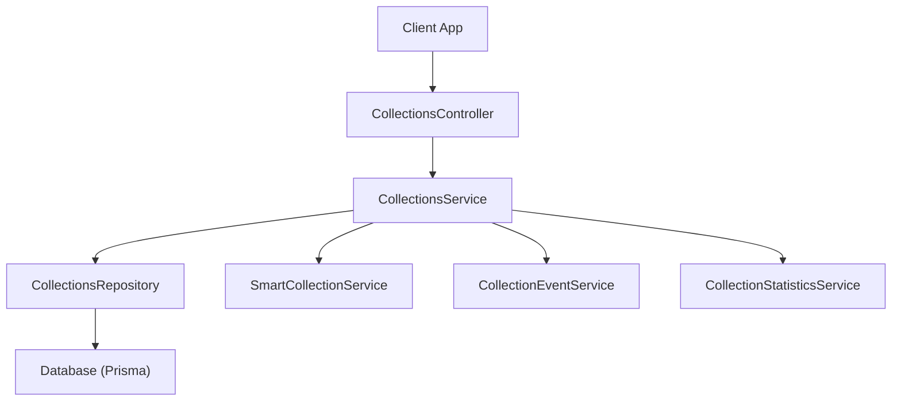
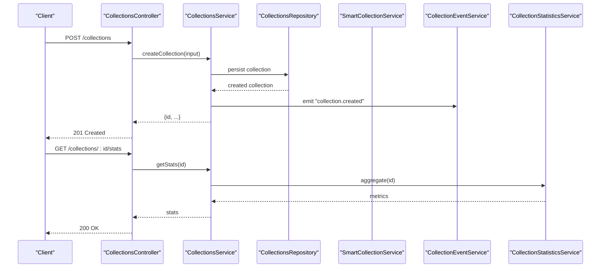
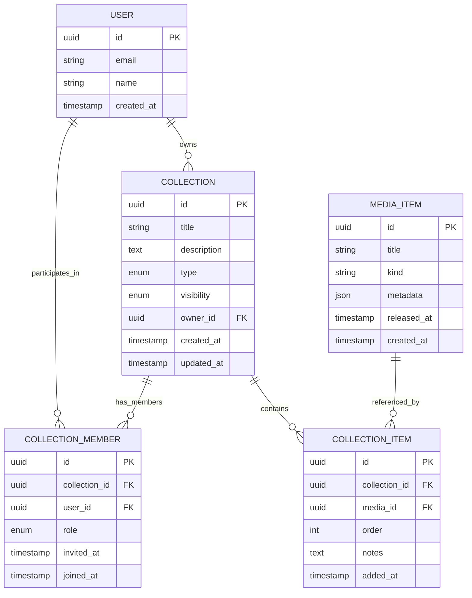
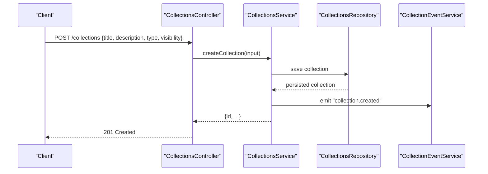
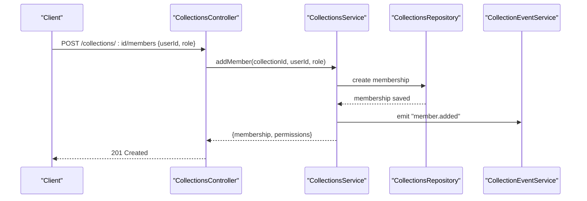
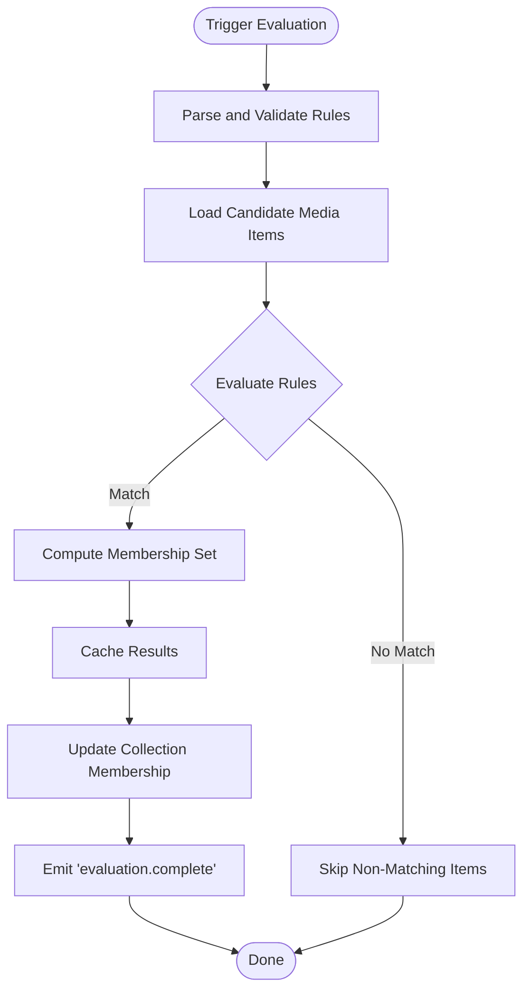
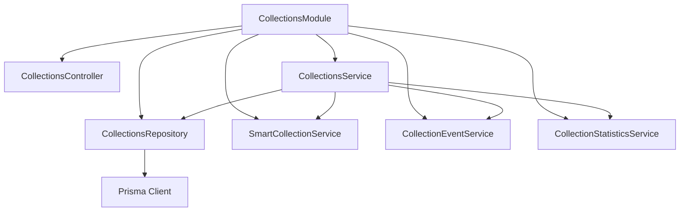

# Collections API

<cite>
**Referenced Files in This Document**
- [collections.controller.ts](file://apps/backend/src/collections/collections.controller.ts)
- [collections.service.ts](file://apps/backend/src/collections/collections.service.ts)
- [collections.repository.ts](file://apps/backend/src/collections/collections.repository.ts)
- [smart-collection.service.ts](file://apps/backend/src/collections/smart-collection.service.ts)
- [collection-event.service.ts](file://apps/backend/src/collections/collection-event.service.ts)
- [collection-statistics.service.ts](file://apps/backend/src/collections/collection-statistics.service.ts)
- [collections.module.ts](file://apps/backend/src/collections/collections.module.ts)
- [index.ts](file://apps/backend/src/collections/index.ts)
- [schema.prisma](file://apps/backend/prisma/schema.prisma)
</cite>

## Table of Contents
1. [Introduction](#introduction)
2. [Project Structure](#project-structure)
3. [Core Components](#core-components)
4. [Architecture Overview](#architecture-overview)
5. [Detailed Component Analysis](#detailed-component-analysis)
6. [Dependency Analysis](#dependency-analysis)
7. [Performance Considerations](#performance-considerations)
8. [Troubleshooting Guide](#troubleshooting-guide)
9. [Conclusion](#conclusion)
10. [Appendices](#appendices)

## Introduction
This document provides comprehensive API documentation for the Collections feature set, including CRUD operations, smart collections, collaborative features, and cross-references between media items. It covers collection types, member management, sharing permissions, automated organization rules, creation workflows, item addition/removal, relationship mapping, bulk operations, analytics data access, and example schemas and rules.

## Project Structure
The Collections feature is implemented as a NestJS module with controllers, services, repositories, and supporting utilities:
- Controller exposes HTTP endpoints for collection operations.
- Service encapsulates business logic for CRUD, collaboration, smart rules, and events.
- Repository handles persistence via Prisma ORM.
- Smart collection service evaluates dynamic rules to populate collections automatically.
- Event service publishes lifecycle events for collaboration and automation.
- Statistics service aggregates metrics for analytics.

**Diagram sources**
- [collections.controller.ts](file://apps/backend/src/collections/collections.controller.ts)
- [collections.service.ts](file://apps/backend/src/collections/collections.service.ts)
- [collections.repository.ts](file://apps/backend/src/collections/collections.repository.ts)
- [smart-collection.service.ts](file://apps/backend/src/collections/smart-collection.service.ts)
- [collection-event.service.ts](file://apps/backend/src/collections/collection-event.service.ts)
- [collection-statistics.service.ts](file://apps/backend/src/collections/collection-statistics.service.ts)
- [schema.prisma](file://apps/backend/prisma/schema.prisma)

**Section sources**
- [collections.module.ts](file://apps/backend/src/collections/collections.module.ts)
- [index.ts](file://apps/backend/src/collections/index.ts)

## Core Components
- CollectionsController: Defines REST endpoints for creating, reading, updating, deleting collections; managing members; adding/removing items; querying smart collections; and accessing statistics.
- CollectionsService: Implements core business logic for collection CRUD, membership, permissions, relationships, and orchestration of smart evaluation and event publishing.
- CollectionsRepository: Data access layer using Prisma for collections, members, and relationships.
- SmartCollectionService: Evaluates rule sets to compute dynamic membership based on media attributes and metadata.
- CollectionEventService: Emits domain events such as collection created/updated, member added/removed, and item added/removed.
- CollectionStatisticsService: Aggregates counts, growth trends, and engagement metrics per collection.

Key responsibilities:
- Enforce ownership and role-based permissions for collaborators.
- Validate and apply smart collection rules.
- Maintain referential integrity for media-item relationships.
- Emit events for downstream consumers (e.g., notifications, search indexing).

**Section sources**
- [collections.controller.ts](file://apps/backend/src/collections/collections.controller.ts)
- [collections.service.ts](file://apps/backend/src/collections/collections.service.ts)
- [collections.repository.ts](file://apps/backend/src/collections/collections.repository.ts)
- [smart-collection.service.ts](file://apps/backend/src/collections/smart-collection.service.ts)
- [collection-event.service.ts](file://apps/backend/src/collections/collection-event.service.ts)
- [collection-statistics.service.ts](file://apps/backend/src/collections/collection-statistics.service.ts)

## Architecture Overview
The Collections API follows a layered architecture:
- Controllers handle HTTP requests and responses.
- Services implement domain logic and coordinate repositories and auxiliary services.
- Repositories abstract database interactions through Prisma.
- Smart rules are evaluated asynchronously or synchronously depending on operation context.
- Events enable decoupled processing for collaboration and analytics.

**Diagram sources**
- [collections.controller.ts](file://apps/backend/src/collections/collections.controller.ts)
- [collections.service.ts](file://apps/backend/src/collections/collections.service.ts)
- [collections.repository.ts](file://apps/backend/src/collections/collections.repository.ts)
- [smart-collection.service.ts](file://apps/backend/src/collections/smart-collection.service.ts)
- [collection-event.service.ts](file://apps/backend/src/collections/collection-event.service.ts)
- [collection-statistics.service.ts](file://apps/backend/src/collections/collection-statistics.service.ts)

## Detailed Component Analysis

### Collections Controller Endpoints
- Create Collection: Accepts payload defining title, description, type, visibility, and initial settings. Returns created collection with owner and default permissions.
- Read Collection: Retrieves a single collection by ID with optional expansion of members and relationships.
- Update Collection: Updates metadata, type, visibility, and rules for smart collections.
- Delete Collection: Removes a collection and cascades deletions according to policy.
- List Collections: Supports filtering by type, visibility, owner, and tags; includes pagination and sorting.
- Add Member: Invites users to collaborate with specified roles and permissions.
- Remove Member: Revokes access for a collaborator.
- Get Members: Lists current members with roles and permissions.
- Add Item: Adds a media item to a collection with optional ordering and notes.
- Remove Item: Removes a media item from a collection.
- List Items: Retrieves items with filters, pagination, and sorting.
- Bulk Operations: Batch add/remove items and manage memberships.
- Smart Evaluation: Triggers or queries smart collection results based on rules.
- Statistics: Returns aggregated metrics for a collection.

Request/Response patterns:
- Standardized error responses with consistent codes and messages.
- Pagination parameters for list endpoints.
- Role-based authorization enforced at controller/service boundaries.

**Section sources**
- [collections.controller.ts](file://apps/backend/src/collections/collections.controller.ts)

### Collections Service Logic
Responsibilities:
- Validates inputs and enforces business rules.
- Manages ownership and collaboration permissions.
- Orchestrates smart collection evaluation and caching.
- Publishes domain events for side effects.
- Coordinates with statistics service for metrics.

Key flows:
- Creation flow: validate input -> persist -> publish event -> initialize defaults.
- Membership flow: verify invite -> assign role -> update permissions -> notify.
- Item management: validate media existence -> link relationship -> update indexes.
- Smart rules: parse rules -> evaluate against media dataset -> compute membership -> cache results.

Error handling:
- Domain-specific exceptions for invalid operations.
- Transactional consistency for multi-step updates.

**Section sources**
- [collections.service.ts](file://apps/backend/src/collections/collections.service.ts)

### Collections Repository
Responsibilities:
- CRUD operations for collections and related entities.
- Querying with filters, joins, and aggregations.
- Managing relationships between collections and media items.
- Ensuring referential integrity and constraints.

Optimizations:
- Indexed queries for frequent filters (owner, type, visibility).
- Batch operations for bulk adds/removes.
- Efficient joins for member and relationship lookups.

**Section sources**
- [collections.repository.ts](file://apps/backend/src/collections/collections.repository.ts)

### Smart Collection Service
Responsibilities:
- Parses and validates rule definitions.
- Evaluates rules against media metadata and attributes.
- Computes membership sets deterministically.
- Supports incremental updates when media changes.

Rule capabilities:
- Attribute matching (genre, year, rating, tags).
- Logical operators (AND, OR, NOT).
- Temporal filters (release date ranges, last updated).
- Custom expressions where supported.

Performance considerations:
- Rule compilation and caching.
- Incremental re-evaluation on media updates.
- Background jobs for large datasets.

**Section sources**
- [smart-collection.service.ts](file://apps/backend/src/collections/smart-collection.service.ts)

### Collection Event Service
Responsibilities:
- Publishes events for collection lifecycle and membership changes.
- Provides hooks for external integrations and automation.

Events:
- collection.created
- collection.updated
- collection.deleted
- member.added
- member.removed
- item.added
- item.removed

Integration points:
- Notification system triggers.
- Search index updates.
- Analytics pipelines.

**Section sources**
- [collection-event.service.ts](file://apps/backend/src/collections/collection-event.service.ts)

### Collection Statistics Service
Responsibilities:
- Aggregates metrics such as item counts, growth rates, and engagement.
- Exposes time-series data for dashboards.

Metrics:
- Total items, unique contributors, activity frequency.
- Smart collection hit rates and rule performance.
- Collaboration activity (invites accepted, edits).

**Section sources**
- [collection-statistics.service.ts](file://apps/backend/src/collections/collection-statistics.service.ts)

### Data Model and Relationships
The underlying schema defines collections, members, and relationships to media items. Key aspects:
- Collections entity with type, visibility, and owner.
- Memberships linking users to collections with roles and permissions.
- Media-item relationships enabling cross-references within collections.
- Constraints ensuring data integrity and cascade behaviors.

**Diagram sources**
- [schema.prisma](file://apps/backend/prisma/schema.prisma)

**Section sources**
- [schema.prisma](file://apps/backend/prisma/schema.prisma)

### API Workflows

#### Create Collection Workflow

**Diagram sources**
- [collections.controller.ts](file://apps/backend/src/collections/collections.controller.ts)
- [collections.service.ts](file://apps/backend/src/collections/collections.service.ts)
- [collections.repository.ts](file://apps/backend/src/collections/collections.repository.ts)
- [collection-event.service.ts](file://apps/backend/src/collections/collection-event.service.ts)

#### Add Member Workflow

**Diagram sources**
- [collections.controller.ts](file://apps/backend/src/collections/collections.controller.ts)
- [collections.service.ts](file://apps/backend/src/collections/collections.service.ts)
- [collections.repository.ts](file://apps/backend/src/collections/collections.repository.ts)
- [collection-event.service.ts](file://apps/backend/src/collections/collection-event.service.ts)

#### Smart Collection Evaluation Flow

**Diagram sources**
- [smart-collection.service.ts](file://apps/backend/src/collections/smart-collection.service.ts)

### Collection Types and Permissions
- Types: personal, shared, public, smart.
- Visibility: private, team, public.
- Roles: owner, admin, editor, viewer.
- Permissions: read, write, manage members, manage rules.

Access control:
- Owner can modify all aspects.
- Admin can edit content and manage members.
- Editor can add/remove items but not change structure.
- Viewer has read-only access.

**Section sources**
- [collections.service.ts](file://apps/backend/src/collections/collections.service.ts)

### Cross-References Between Media Items
- Collections can contain multiple media items with ordering and notes.
- Relationships support tagging and contextual annotations.
- Queries can traverse relationships to find connected items across collections.

Operations:
- Add item with metadata and order.
- Remove item and clean up references.
- List items with filters and sorting.

**Section sources**
- [collections.repository.ts](file://apps/backend/src/collections/collections.repository.ts)

### Bulk Operations
- Batch add/remove items to/from collections.
- Bulk invite members with predefined roles.
- Transactions ensure atomicity and consistency.

Constraints:
- Rate limiting to prevent abuse.
- Validation of IDs and permissions.

**Section sources**
- [collections.service.ts](file://apps/backend/src/collections/collections.service.ts)

### Analytics Data Access
- Retrieve aggregated metrics per collection.
- Time-series data for growth and engagement.
- Collaboration activity summaries.

Endpoints:
- GET /collections/:id/stats
- GET /collections/:id/analytics?period=...

**Section sources**
- [collection-statistics.service.ts](file://apps/backend/src/collections/collection-statistics.service.ts)

## Dependency Analysis
The Collections module depends on:
- Prisma for database access.
- Event infrastructure for decoupled processing.
- Authentication and authorization guards for security.
- Optional background job queues for heavy evaluations.

**Diagram sources**
- [collections.module.ts](file://apps/backend/src/collections/collections.module.ts)
- [collections.controller.ts](file://apps/backend/src/collections/collections.controller.ts)
- [collections.service.ts](file://apps/backend/src/collections/collections.service.ts)
- [collections.repository.ts](file://apps/backend/src/collections/collections.repository.ts)
- [smart-collection.service.ts](file://apps/backend/src/collections/smart-collection.service.ts)
- [collection-event.service.ts](file://apps/backend/src/collections/collection-event.service.ts)
- [collection-statistics.service.ts](file://apps/backend/src/collections/collection-statistics.service.ts)

**Section sources**
- [collections.module.ts](file://apps/backend/src/collections/collections.module.ts)

## Performance Considerations
- Use indexed columns for frequent filters (owner, type, visibility).
- Implement pagination and cursor-based navigation for large lists.
- Cache smart collection results and invalidate on media updates.
- Batch database operations to reduce round-trips.
- Offload heavy evaluations to background jobs.

[No sources needed since this section provides general guidance]

## Troubleshooting Guide
Common issues:
- Permission denied errors: verify user roles and ownership.
- Smart collection not updating: check rule syntax and media metadata.
- Slow list queries: review indexes and query filters.
- Event delivery failures: inspect event queue and consumer logs.

Debugging steps:
- Enable detailed logging for collection operations.
- Validate request payloads against DTOs.
- Inspect database constraints and foreign keys.
- Monitor event bus for dropped messages.

**Section sources**
- [collections.service.ts](file://apps/backend/src/collections/collections.service.ts)
- [smart-collection.service.ts](file://apps/backend/src/collections/smart-collection.service.ts)
- [collection-event.service.ts](file://apps/backend/src/collections/collection-event.service.ts)

## Conclusion
The Collections API provides a robust foundation for organizing media items through manual and automated means, supporting collaboration and rich analytics. Its modular design enables extensibility for advanced use cases while maintaining performance and reliability.

[No sources needed since this section summarizes without analyzing specific files]

## Appendices

### Example Collection Schema
- Fields: id, title, description, type, visibility, owner_id, timestamps.
- Relationships: members, items, owner.

**Section sources**
- [schema.prisma](file://apps/backend/prisma/schema.prisma)

### Example Smart Collection Rules
- Conditions: genre equals "Sci-Fi", release year between 2020 and 2025, rating greater than 4.
- Operators: AND, OR, NOT.
- Actions: include/exclude based on evaluation.

**Section sources**
- [smart-collection.service.ts](file://apps/backend/src/collections/smart-collection.service.ts)

### Collaboration Workflow Examples
- Invite a user with editor role.
- Accept invitation and join collection.
- Remove a member and revoke access.

**Section sources**
- [collections.service.ts](file://apps/backend/src/collections/collections.service.ts)

### Analytics Data Access Examples
- Retrieve monthly growth metrics.
- Fetch top contributors and activity frequency.
- Export statistics for reporting.

**Section sources**
- [collection-statistics.service.ts](file://apps/backend/src/collections/collection-statistics.service.ts)