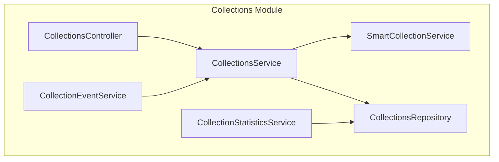
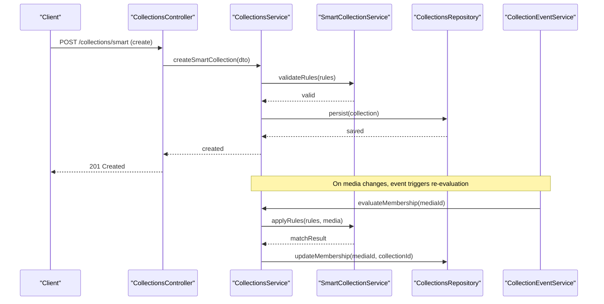
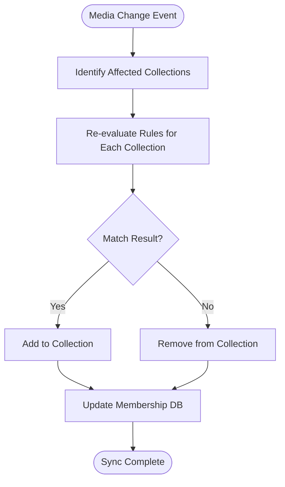
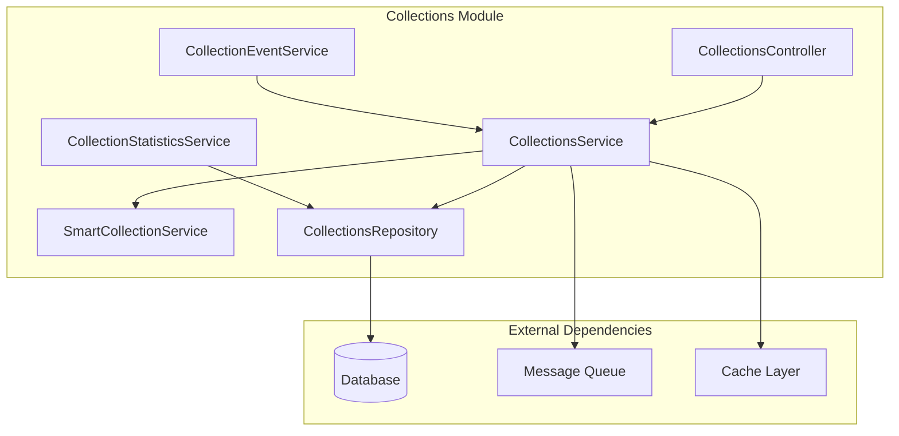

# Smart Collections API

<cite>
**Referenced Files in This Document**
- [collections.controller.ts](file://apps/backend/src/collections/collections.controller.ts)
- [collections.service.ts](file://apps/backend/src/collections/collections.service.ts)
- [smart-collection.service.ts](file://apps/backend/src/collections/smart-collection.service.ts)
- [collection-event.service.ts](file://apps/backend/src/collections/collection-event.service.ts)
- [collection-statistics.service.ts](file://apps/backend/src/collections/collection-statistics.service.ts)
- [collections.module.ts](file://apps/backend/src/collections/collections.module.ts)
- [collections.repository.ts](file://apps/backend/src/collections/collections.repository.ts)
- [dto files](file://apps/backend/src/collections/dto)
</cite>

## Table of Contents
1. [Introduction](#introduction)
2. [Project Structure](#project-structure)
3. [Core Components](#core-components)
4. [Architecture Overview](#architecture-overview)
5. [Detailed Component Analysis](#detailed-component-analysis)
6. [Dependency Analysis](#dependency-analysis)
7. [Performance Considerations](#performance-considerations)
8. [Troubleshooting Guide](#troubleshooting-guide)
9. [Conclusion](#conclusion)
10. [Appendices](#appendices)

## Introduction
This document provides comprehensive API documentation for the Smart Collections feature set. It covers automated collection rules, dynamic filtering, real-time updates, creation endpoints with rule definitions and matching criteria, event-driven architecture for automatic membership changes, statistics and analytics endpoints, common smart collection patterns (Recently Watched, Genre-Based, Time-Based, and custom combinations), and the webhook system for external integrations and real-time synchronization.

## Project Structure
The Smart Collections functionality is implemented within the backend NestJS application under the collections module. Key responsibilities are split across controllers, services, repositories, DTOs, and event handling components:
- Controller exposes REST endpoints for creating, updating, querying, and managing smart collections.
- Service layer implements business logic for rule evaluation, dynamic filtering, and membership management.
- Event service handles domain events to trigger automatic add/remove operations when media attributes change.
- Statistics service aggregates performance metrics and insights for smart collections.
- Repository abstracts data access for collections and their memberships.
- DTOs define request/response schemas for endpoints.

**Diagram sources**
- [collections.controller.ts](file://apps/backend/src/collections/collections.controller.ts)
- [collections.service.ts](file://apps/backend/src/collections/collections.service.ts)
- [smart-collection.service.ts](file://apps/backend/src/collections/smart-collection.service.ts)
- [collection-event.service.ts](file://apps/backend/src/collections/collection-event.service.ts)
- [collection-statistics.service.ts](file://apps/backend/src/collections/collection-statistics.service.ts)
- [collections.repository.ts](file://apps/backend/src/collections/collections.repository.ts)

**Section sources**
- [collections.controller.ts](file://apps/backend/src/collections/collections.controller.ts)
- [collections.service.ts](file://apps/backend/src/collections/collections.service.ts)
- [smart-collection.service.ts](file://apps/backend/src/collections/smart-collection.service.ts)
- [collection-event.service.ts](file://apps/backend/src/collections/collection-event.service.ts)
- [collection-statistics.service.ts](file://apps/backend/src/collections/collection-statistics.service.ts)
- [collections.repository.ts](file://apps/backend/src/collections/collections.repository.ts)

## Core Components
- CollectionsController: Defines REST endpoints for smart collection CRUD, rule management, membership queries, and statistics retrieval.
- CollectionsService: Orchestrates smart collection lifecycle, evaluates rules against media items, and manages membership updates.
- SmartCollectionService: Implements rule engine logic, filter condition evaluation, and matching criteria processing.
- CollectionEventService: Subscribes to media-related events (e.g., progress updates, metadata changes) and triggers re-evaluation of smart collection membership.
- CollectionStatisticsService: Aggregates metrics such as collection size trends, match rates, and performance indicators.
- CollectionsRepository: Provides data access methods for collections, memberships, and related entities.

Key responsibilities and interactions:
- Rule definition and validation occur during creation/update via controller endpoints.
- Dynamic filtering is performed by evaluating conditions against media attributes at query time or on-demand.
- Real-time updates are driven by events that cause membership recalculation without manual intervention.
- Statistics endpoints expose aggregated metrics for monitoring and analytics dashboards.

**Section sources**
- [collections.controller.ts](file://apps/backend/src/collections/collections.controller.ts)
- [collections.service.ts](file://apps/backend/src/collections/collections.service.ts)
- [smart-collection.service.ts](file://apps/backend/src/collections/smart-collection.service.ts)
- [collection-event.service.ts](file://apps/backend/src/collections/collection-event.service.ts)
- [collection-statistics.service.ts](file://apps/backend/src/collections/collection-statistics.service.ts)
- [collections.repository.ts](file://apps/backend/src/collections/collections.repository.ts)

## Architecture Overview
The Smart Collections system follows an event-driven architecture where media attribute changes trigger automatic membership adjustments based on configured rules. Controllers expose APIs for management and querying; services encapsulate business logic; repositories handle persistence; and event services ensure real-time synchronization.

**Diagram sources**
- [collections.controller.ts](file://apps/backend/src/collections/collections.controller.ts)
- [collections.service.ts](file://apps/backend/src/collections/collections.service.ts)
- [smart-collection.service.ts](file://apps/backend/src/collections/smart-collection.service.ts)
- [collection-event.service.ts](file://apps/backend/src/collections/collection-event.service.ts)
- [collections.repository.ts](file://apps/backend/src/collections/collections.repository.ts)

## Detailed Component Analysis

### Smart Collection Creation Endpoints
Endpoints for creating and managing smart collections accept rule definitions, filter conditions, and matching criteria. Typical fields include:
- name: Human-readable title
- description: Optional explanation
- rules: Array of rule objects defining conditions
- filters: Additional constraints (e.g., date ranges, genres, status)
- matchMode: Logical operator for combining rules (AND/OR)
- enabled: Boolean flag to activate/deactivate evaluation

Common rule types:
- Attribute equality (genre equals Drama)
- Range checks (watchedAt between dates)
- Progress thresholds (progress >= 80%)
- Presence/absence (has trailer, has subtitles)
- Custom expressions (user-defined functions)

Matching criteria:
- AND mode requires all rules to match
- OR mode requires any rule to match
- Negation support for excluding items

Example patterns:
- Recently Watched: watchedAt within last N days AND progress > 0
- Genre-Based: genre equals X OR genre includes Y
- Time-Based: releaseYear between A and B AND status completed
- Custom combinations: nested logical expressions with multiple attributes

**Section sources**
- [collections.controller.ts](file://apps/backend/src/collections/collections.controller.ts)
- [collections.service.ts](file://apps/backend/src/collections/collections.service.ts)
- [smart-collection.service.ts](file://apps/backend/src/collections/smart-collection.service.ts)
- [dto files](file://apps/backend/src/collections/dto)

### Dynamic Filtering Engine
The filtering engine evaluates rules against media items dynamically. It supports:
- Attribute-based comparisons (string, number, boolean)
- Date/time range queries
- List membership checks (tags, genres)
- Nested logical operators
- Performance optimizations via indexed queries where applicable

Evaluation flow:
- Parse rule definitions into executable predicates
- Apply filters sequentially with short-circuiting for efficiency
- Cache frequently evaluated conditions when possible
- Return matched item IDs for membership updates

Complexity considerations:
- O(n) per rule evaluation across candidate sets
- Index usage reduces database scan costs
- Batch processing for large datasets

**Section sources**
- [smart-collection.service.ts](file://apps/backend/src/collections/smart-collection.service.ts)
- [collections.service.ts](file://apps/backend/src/collections/collections.service.ts)

### Event-Driven Membership Updates
Real-time updates are achieved through an event-driven mechanism:
- Media attribute changes emit domain events (e.g., progress updated, metadata modified)
- CollectionEventService subscribes to relevant events
- For each affected smart collection, membership is re-evaluated
- Add/remove operations are applied atomically to maintain consistency

Event types:
- MediaProgressUpdated
- MediaMetadataChanged
- MediaStatusChanged
- MediaDeleted

Reconciliation process:
- Identify collections whose rules may match the changed media
- Re-run rule evaluation for each collection
- Compute delta between current and new membership
- Apply batched updates to repository

**Diagram sources**
- [collection-event.service.ts](file://apps/backend/src/collections/collection-event.service.ts)
- [collections.service.ts](file://apps/backend/src/collections/collections.service.ts)
- [collections.repository.ts](file://apps/backend/src/collections/collections.repository.ts)

**Section sources**
- [collection-event.service.ts](file://apps/backend/src/collections/collection-event.service.ts)
- [collections.service.ts](file://apps/backend/src/collections/collections.service.ts)

### Statistics and Analytics Endpoints
Endpoints provide insights into smart collection performance:
- Collection size trends over time
- Match rate percentages
- Evaluation latency metrics
- Top-performing rules
- User engagement metrics

Metrics exposed:
- totalItems: Current membership count
- growthRate: Percentage change over period
- avgEvaluationTime: Average rule evaluation duration
- topRules: Most frequently matched rules
- userInteractions: Click-through and view counts

Aggregation strategies:
- Time-series storage for historical trends
- Materialized views for complex queries
- Caching for frequently accessed metrics

**Section sources**
- [collection-statistics.service.ts](file://apps/backend/src/collections/collection-statistics.service.ts)
- [collections.repository.ts](file://apps/backend/src/collections/collections.repository.ts)

### Webhook System for External Integrations
Webhooks enable real-time synchronization with external systems:
- Configurable webhook URLs per collection or globally
- Event payloads include collection ID, operation type, and affected media IDs
- Retry mechanisms with exponential backoff
- Signature verification for security

Supported events:
- CollectionCreated
- CollectionUpdated
- MembershipAdded
- MembershipRemoved
- EvaluationCompleted

Payload structure:
- timestamp: ISO 8601 datetime
- eventType: String identifier
- collectionId: UUID
- mediaIds: Array of affected media identifiers
- metadata: Additional context

Delivery guarantees:
- At-least-once delivery semantics
- Idempotency keys to prevent duplicates
- Dead letter queue for failed deliveries

**Section sources**
- [collections.controller.ts](file://apps/backend/src/collections/collections.controller.ts)
- [collections.service.ts](file://apps/backend/src/collections/collections.service.ts)

## Dependency Analysis
The collections module depends on core infrastructure services and external integrations:

**Diagram sources**
- [collections.module.ts](file://apps/backend/src/collections/collections.module.ts)
- [collections.controller.ts](file://apps/backend/src/collections/collections.controller.ts)
- [collections.service.ts](file://apps/backend/src/collections/collections.service.ts)
- [collections.repository.ts](file://apps/backend/src/collections/collections.repository.ts)

**Section sources**
- [collections.module.ts](file://apps/backend/src/collections/collections.module.ts)
- [collections.controller.ts](file://apps/backend/src/collections/collections.controller.ts)
- [collections.service.ts](file://apps/backend/src/collections/collections.service.ts)
- [collections.repository.ts](file://apps/backend/src/collections/collections.repository.ts)

## Performance Considerations
- Rule evaluation optimization: Use indexed columns for frequently queried attributes
- Batch processing: Process membership updates in batches to reduce database load
- Caching strategies: Cache rule results for static attributes
- Asynchronous processing: Offload heavy computations to background jobs
- Query optimization: Leverage database-specific features for complex filters
- Memory management: Stream large result sets instead of loading entirely into memory

## Troubleshooting Guide
Common issues and resolutions:
- Rule evaluation failures: Validate rule syntax and attribute mappings
- Performance degradation: Review query plans and add appropriate indexes
- Event processing delays: Check message queue health and consumer scaling
- Membership inconsistencies: Run reconciliation jobs to sync state
- Webhook delivery failures: Inspect retry logs and endpoint availability

Debugging utilities:
- Rule test endpoints for validating conditions
- Membership diff tools for comparing expected vs actual state
- Event replay capabilities for testing scenarios
- Performance profiling hooks for bottleneck identification

**Section sources**
- [collections.service.ts](file://apps/backend/src/collections/collections.service.ts)
- [collection-event.service.ts](file://apps/backend/src/collections/collection-event.service.ts)

## Conclusion
The Smart Collections system provides a robust, event-driven platform for creating dynamic, rule-based media collections. With comprehensive API endpoints, flexible rule definitions, real-time updates, and extensive analytics, it enables powerful curation experiences. The modular architecture ensures scalability and maintainability while supporting complex use cases through customizable rule combinations and webhook integrations.

## Appendices

### Common Smart Collection Patterns

#### Recently Watched
Criteria:
- watchedAt within last N days
- progress greater than zero
- optional: exclude completed items

Use case: Quick access to recently engaged content

#### Genre-Based
Criteria:
- genre equals specific value(s)
- optional: exclude certain sub-genres
- optional: minimum popularity threshold

Use case: Curated collections by thematic preferences

#### Time-Based
Criteria:
- releaseYear within specified range
- season/month filters
- holiday or special occasion markers

Use case: Seasonal or temporal content discovery

#### Custom Rule Combinations
Capabilities:
- Nested logical expressions
- Cross-attribute comparisons
- User-defined scoring functions
- Conditional branching

Use case: Advanced personalization and recommendation engines

**Section sources**
- [smart-collection.service.ts](file://apps/backend/src/collections/smart-collection.service.ts)
- [collections.controller.ts](file://apps/backend/src/collections/collections.controller.ts)