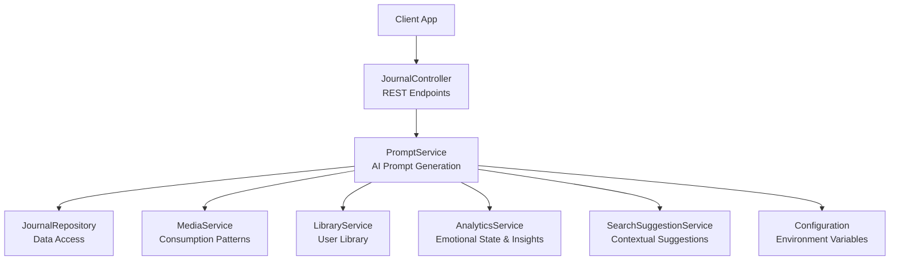
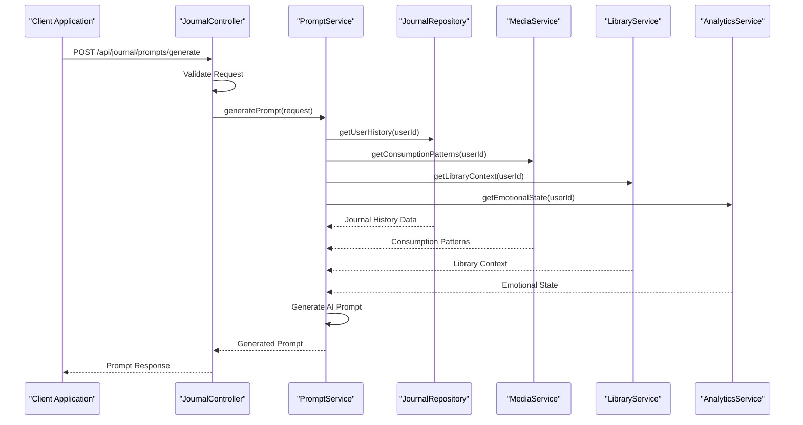
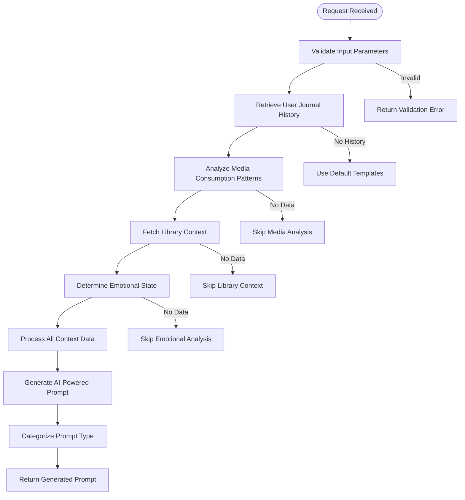
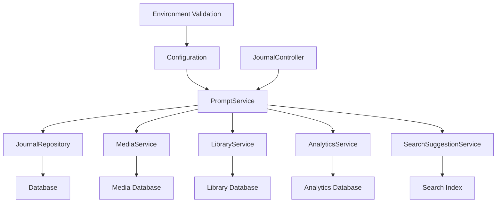

# AI-Powered Prompts API

<cite>
**Referenced Files in This Document**
- [prompt.service.ts](file://apps/backend/src/journal/prompt.service.ts)
- [journal.controller.ts](file://apps/backend/src/journal/journal.controller.ts)
- [journal.service.ts](file://apps/backend/src/journal/journal.service.ts)
- [journal.module.ts](file://apps/backend/src/journal/journal.module.ts)
- [journal.repository.ts](file://apps/backend/src/journal/journal.repository.ts)
- [media.service.ts](file://apps/backend/src/media/media.service.ts)
- [library.service.ts](file://apps/backend/src/library/library.service.ts)
- [analytics.service.ts](file://apps/backend/src/analytics/analytics.service.ts)
- [search-suggestion.service.ts](file://apps/backend/src/search/search-suggestion.service.ts)
- [configuration.ts](file://apps/backend/src/config/configuration.ts)
- [env.validation.ts](file://apps/backend/src/config/env.validation.ts)
- [app.module.ts](file://apps/backend/src/app.module.ts)
- [main.ts](file://apps/backend/src/main.ts)
</cite>

## Table of Contents
1. [Introduction](#introduction)
2. [Project Structure](#project-structure)
3. [Core Components](#core-components)
4. [Architecture Overview](#architecture-overview)
5. [Detailed Component Analysis](#detailed-component-analysis)
6. [Dependency Analysis](#dependency-analysis)
7. [Performance Considerations](#performance-considerations)
8. [Troubleshooting Guide](#troubleshooting-guide)
9. [Conclusion](#conclusion)
10. [Appendices](#appendices)

## Introduction
This document provides comprehensive API documentation for the AI-powered journal prompt generation and suggestion system. It covers endpoints for generating contextual writing prompts based on user history, emotional state, and media consumption patterns. The documentation includes schemas for prompt templates, AI response formats, personalization parameters, and prompt categorization. It also provides examples of prompt generation workflows, customization options, and integration with journal entry creation flows.

## Project Structure
The prompt generation feature is implemented within the backend NestJS application under the journal module. Key files include:
- Controller exposing REST endpoints
- Service orchestrating prompt generation logic
- Repository for data access
- Integration with media, library, analytics, and search services
- Configuration for environment variables and validation



**Diagram sources**
- [journal.controller.ts](file://apps/backend/src/journal/journal.controller.ts)
- [prompt.service.ts](file://apps/backend/src/journal/prompt.service.ts)
- [journal.repository.ts](file://apps/backend/src/journal/journal.repository.ts)
- [media.service.ts](file://apps/backend/src/media/media.service.ts)
- [library.service.ts](file://apps/backend/src/library/library.service.ts)
- [analytics.service.ts](file://apps/backend/src/analytics/analytics.service.ts)
- [search-suggestion.service.ts](file://apps/backend/src/search/search-suggestion.service.ts)
- [configuration.ts](file://apps/backend/src/config/configuration.ts)

**Section sources**
- [journal.controller.ts](file://apps/backend/src/journal/journal.controller.ts)
- [prompt.service.ts](file://apps/backend/src/journal/prompt.service.ts)
- [journal.module.ts](file://apps/backend/src/journal/journal.module.ts)

## Core Components
The core components of the AI-powered prompt generation system are:

### JournalController
Exposes REST endpoints for prompt generation and journal entry management. Handles HTTP requests and responses, validates input parameters, and delegates business logic to the PromptService.

### PromptService
Implements the core logic for generating contextual writing prompts. Integrates with multiple services to gather user context including:
- User's journal history via JournalRepository
- Media consumption patterns via MediaService
- Library data via LibraryService
- Emotional state insights via AnalyticsService
- Contextual suggestions via SearchSuggestionService

### JournalRepository
Provides data access layer for journal entries, enabling retrieval of user's historical writing patterns and preferences.

### Supporting Services
- **MediaService**: Analyzes recent media consumption to inform prompt generation
- **LibraryService**: Provides user's media library context
- **AnalyticsService**: Offers emotional state analysis and behavioral insights
- **SearchSuggestionService**: Generates contextual suggestions based on search patterns

**Section sources**
- [journal.controller.ts](file://apps/backend/src/journal/journal.controller.ts)
- [prompt.service.ts](file://apps/backend/src/journal/prompt.service.ts)
- [journal.repository.ts](file://apps/backend/src/journal/journal.repository.ts)
- [media.service.ts](file://apps/backend/src/media/media.service.ts)
- [library.service.ts](file://apps/backend/src/library/library.service.ts)
- [analytics.service.ts](file://apps/backend/src/analytics/analytics.service.ts)
- [search-suggestion.service.ts](file://apps/backend/src/search/search-suggestion.service.ts)

## Architecture Overview
The system follows a layered architecture pattern with clear separation of concerns:



**Diagram sources**
- [journal.controller.ts](file://apps/backend/src/journal/journal.controller.ts)
- [prompt.service.ts](file://apps/backend/src/journal/prompt.service.ts)
- [journal.repository.ts](file://apps/backend/src/journal/journal.repository.ts)
- [media.service.ts](file://apps/backend/src/media/media.service.ts)
- [library.service.ts](file://apps/backend/src/library/library.service.ts)
- [analytics.service.ts](file://apps/backend/src/analytics/analytics.service.ts)

## Detailed Component Analysis

### Prompt Generation Workflow
The prompt generation process involves multiple data sources and processing steps:



**Diagram sources**
- [prompt.service.ts](file://apps/backend/src/journal/prompt.service.ts)
- [journal.repository.ts](file://apps/backend/src/journal/journal.repository.ts)
- [media.service.ts](file://apps/backend/src/media/media.service.ts)
- [library.service.ts](file://apps/backend/src/library/library.service.ts)
- [analytics.service.ts](file://apps/backend/src/analytics/analytics.service.ts)

### API Endpoints

#### Generate Prompt Endpoint
- **Method**: POST
- **Path**: `/api/journal/prompts/generate`
- **Authentication**: Required (Bearer Token)
- **Request Body Schema**:
  ```json
  {
    "userId": "string",
    "context": {
      "mood": "string | null",
      "timeOfDay": "string | null",
      "recentMedia": ["string"],
      "journalHistory": ["string"],
      "preferences": {
        "promptLength": "short | medium | long",
        "tone": "reflective | analytical | creative | casual",
        "category": "personal | media | life-event | goal-oriented"
      }
    },
    "customization": {
      "includeMediaReferences": boolean,
      "includeEmotionalAnalysis": boolean,
      "maxSuggestions": number
    }
  }
  ```

- **Response Schema**:
  ```json
  {
    "success": boolean,
    "data": {
      "prompt": {
        "id": "string",
        "text": "string",
        "category": "string",
        "confidence": number,
        "suggestedMoods": ["string"],
        "relatedMedia": ["object"],
        "estimatedWritingTime": number
      },
      "alternatives": ["string"],
      "metadata": {
        "generationTime": number,
        "contextUsed": object,
        "personalizationScore": number
      }
    },
    "error": null
  }
  ```

#### Get Prompt Categories Endpoint
- **Method**: GET
- **Path**: `/api/journal/prompts/categories`
- **Authentication**: Optional
- **Response Schema**:
  ```json
  {
    "categories": [
      {
        "id": "string",
        "name": "string",
        "description": "string",
        "examplePrompts": ["string"],
        "tags": ["string"]
      }
    ]
  }
  ```

#### Save Prompt Usage Endpoint
- **Method**: POST
- **Path**: `/api/journal/prompts/usage`
- **Authentication**: Required
- **Request Body Schema**:
  ```json
  {
    "userId": "string",
    "promptId": "string",
    "action": "generated | used | saved | shared",
    "metadata": {
      "responseTime": number,
      "userFeedback": "positive | negative | neutral"
    }
  }
  ```

**Section sources**
- [journal.controller.ts](file://apps/backend/src/journal/journal.controller.ts)
- [prompt.service.ts](file://apps/backend/src/journal/prompt.service.ts)

### Personalization Parameters
The system supports extensive personalization through various parameters:

#### Mood-Based Personalization
- **Input**: User's current emotional state
- **Processing**: Maps mood to appropriate prompt categories and tones
- **Output**: Emotionally resonant prompts that match user's psychological state

#### Media Consumption Integration
- **Input**: Recent movies, shows, books, music
- **Processing**: Analyzes themes, genres, and emotional impact
- **Output**: Prompts that connect media experiences with personal reflection

#### Historical Pattern Recognition
- **Input**: Previous journal entries and writing patterns
- **Processing**: Identifies recurring themes and writing styles
- **Output**: Consistent yet evolving prompts that build on past reflections

#### Time-Based Context
- **Input**: Time of day, day of week, seasonal factors
- **Processing**: Adjusts prompt complexity and focus areas
- **Output**: Contextually appropriate prompts for different times and seasons

**Section sources**
- [prompt.service.ts](file://apps/backend/src/journal/prompt.service.ts)
- [analytics.service.ts](file://apps/backend/src/analytics/analytics.service.ts)
- [media.service.ts](file://apps/backend/src/media/media.service.ts)

### Prompt Categorization System
The system categorizes prompts into several types:

#### Category Types
- **Personal Reflection**: Introspective prompts about life experiences
- **Media Analysis**: Prompts connecting media consumption to personal growth
- **Goal-Oriented**: Prompts focused on personal development and achievements
- **Creative Expression**: Open-ended prompts encouraging artistic thinking
- **Life Events**: Prompts addressing significant life transitions
- **Daily Practice**: Routine prompts for consistent journaling habits

#### Category Metadata
Each category includes:
- Description and purpose
- Example prompts for reference
- Associated tags for filtering
- Recommended usage frequency
- Target audience characteristics

**Section sources**
- [prompt.service.ts](file://apps/backend/src/journal/prompt.service.ts)

## Dependency Analysis
The prompt generation system has well-defined dependencies between components:



**Diagram sources**
- [prompt.service.ts](file://apps/backend/src/journal/prompt.service.ts)
- [journal.repository.ts](file://apps/backend/src/journal/journal.repository.ts)
- [media.service.ts](file://apps/backend/src/media/media.service.ts)
- [library.service.ts](file://apps/backend/src/library/library.service.ts)
- [analytics.service.ts](file://apps/backend/src/analytics/analytics.service.ts)
- [search-suggestion.service.ts](file://apps/backend/src/search/search-suggestion.service.ts)
- [configuration.ts](file://apps/backend/src/config/configuration.ts)
- [env.validation.ts](file://apps/backend/src/config/env.validation.ts)
- [journal.controller.ts](file://apps/backend/src/journal/journal.controller.ts)

### Coupling and Cohesion
- **High Cohesion**: Each service focuses on specific domain responsibilities
- **Low Coupling**: Clear interfaces between components minimize dependencies
- **Modular Design**: Easy to replace or upgrade individual components
- **Testability**: Well-separated concerns enable comprehensive unit testing

### External Dependencies
- **Database Layer**: Prisma ORM for data persistence
- **Cache Layer**: Redis for performance optimization
- **Queue System**: BullMQ for asynchronous processing
- **AI Integration**: External AI service for prompt generation
- **Analytics Platform**: Custom analytics for user behavior tracking

**Section sources**
- [journal.module.ts](file://apps/backend/src/journal/journal.module.ts)
- [app.module.ts](file://apps/backend/src/app.module.ts)
- [main.ts](file://apps/backend/src/main.ts)

## Performance Considerations
The system implements several performance optimization strategies:

### Caching Strategy
- **Prompt Templates Cache**: Frequently used prompt templates cached in memory
- **User Context Cache**: Recent user data cached to reduce database queries
- **Media Analysis Cache**: Computed media patterns stored for reuse
- **Category Mapping Cache**: Prompt category mappings cached globally

### Asynchronous Processing
- **Background Job Queue**: Complex prompt generation tasks processed asynchronously
- **Batch Processing**: Multiple user contexts processed in batches
- **Rate Limiting**: Prevents overwhelming external AI services
- **Timeout Handling**: Graceful degradation when services are unavailable

### Database Optimization
- **Query Optimization**: Efficient database queries with proper indexing
- **Connection Pooling**: Optimized database connection management
- **Read Replicas**: Separate connections for read-heavy operations
- **Data Aggregation**: Pre-computed statistics for faster responses

### Memory Management
- **Stream Processing**: Large datasets processed in streams
- **Garbage Collection**: Proper cleanup of temporary objects
- **Memory Limits**: Configurable memory limits per request
- **Resource Cleanup**: Automatic cleanup of unused resources

**Section sources**
- [prompt.service.ts](file://apps/backend/src/journal/prompt.service.ts)
- [configuration.ts](file://apps/backend/src/config/configuration.ts)

## Troubleshooting Guide

### Common Issues and Solutions

#### Prompt Generation Failures
**Symptoms**: Empty prompts, generic responses, or timeout errors
**Causes**: 
- Missing user context data
- External AI service unavailability
- Insufficient user history
- Network connectivity issues

**Solutions**:
- Verify user authentication and permissions
- Check external service health status
- Implement fallback prompt templates
- Add retry mechanisms with exponential backoff

#### Performance Degradation
**Symptoms**: Slow response times, high memory usage, database timeouts
**Causes**:
- Inefficient database queries
- Missing cache hits
- Memory leaks
- Connection pool exhaustion

**Solutions**:
- Monitor query performance with execution plans
- Implement proper caching strategies
- Profile memory usage and identify leaks
- Optimize connection pool configuration

#### Data Inconsistency
**Symptoms**: Incorrect user context, outdated recommendations
**Causes**:
- Stale cache data
- Race conditions in concurrent requests
- Failed background job processing
- Database synchronization issues

**Solutions**:
- Implement cache invalidation strategies
- Use distributed locks for critical sections
- Monitor job queue health and retry failed jobs
- Implement data consistency checks

### Monitoring and Logging
The system includes comprehensive logging and monitoring capabilities:

#### Log Levels
- **DEBUG**: Detailed information for development
- **INFO**: General operational information
- **WARN**: Potential issues requiring attention
- **ERROR**: Critical errors requiring immediate action

#### Metrics Collection
- **Response Times**: Track endpoint performance
- **Error Rates**: Monitor failure percentages
- **Cache Hit Rates**: Measure cache effectiveness
- **Queue Depths**: Monitor background job processing

#### Health Checks
- **Database Connectivity**: Verify database connections
- **External Service Status**: Check AI service availability
- **Memory Usage**: Monitor resource utilization
- **Disk Space**: Ensure adequate storage space

**Section sources**
- [prompt.service.ts](file://apps/backend/src/journal/prompt.service.ts)
- [configuration.ts](file://apps/backend/src/config/configuration.ts)
- [env.validation.ts](file://apps/backend/src/config/env.validation.ts)

## Conclusion
The AI-powered journal prompt generation system provides a sophisticated platform for creating personalized, context-aware writing prompts. Through its modular architecture and extensive integration with user data sources, it delivers highly relevant prompts that adapt to individual user patterns and preferences. The system's comprehensive error handling, performance optimizations, and monitoring capabilities ensure reliable operation in production environments.

Key strengths include:
- **Personalization Engine**: Advanced algorithms for context-aware prompt generation
- **Multi-Source Integration**: Seamless combination of journal history, media consumption, and emotional state data
- **Scalable Architecture**: Modular design supporting future enhancements
- **Robust Error Handling**: Comprehensive fault tolerance and graceful degradation
- **Performance Optimization**: Multiple layers of caching and optimization

Future enhancements could include:
- **Advanced AI Models**: Integration with newer language models for improved prompt quality
- **Real-time Adaptation**: Dynamic prompt adjustment based on user feedback
- **Multi-language Support**: Expansion to support diverse linguistic preferences
- **Collaborative Features**: Shared prompt libraries and community contributions

## Appendices

### Environment Configuration
Required environment variables for optimal operation:

#### Core Configuration
- `DATABASE_URL`: Database connection string
- `REDIS_URL`: Redis connection for caching
- `JWT_SECRET`: Secret key for JWT token generation
- `AI_SERVICE_URL`: External AI service endpoint
- `AI_API_KEY`: Authentication key for AI service

#### Performance Tuning
- `CACHE_TTL`: Cache time-to-live in seconds
- `MAX_CONCURRENT_REQUESTS`: Maximum simultaneous requests
- `QUEUE_WORKERS`: Number of background job workers
- `LOG_LEVEL`: Logging verbosity level

#### Feature Flags
- `ENABLE_ANALYTICS`: Enable user behavior tracking
- `ENABLE_MEDIA_INTEGRATION`: Activate media consumption analysis
- `ENABLE_SOCIAL_FEATURES`: Allow sharing and collaboration
- `ENABLE_PREMIUM_FEATURES`: Unlock advanced capabilities

**Section sources**
- [configuration.ts](file://apps/backend/src/config/configuration.ts)
- [env.validation.ts](file://apps/backend/src/config/env.validation.ts)

### API Rate Limiting
To prevent abuse and ensure fair usage, the system implements rate limiting:

#### Standard Limits
- **Unauthenticated Users**: 10 requests per minute
- **Authenticated Users**: 100 requests per minute
- **Premium Users**: 1000 requests per minute

#### Burst Protection
- **Burst Limit**: 50 requests per second
- **Cooldown Period**: 60 seconds after limit exceeded
- **Recovery Rate**: Gradual limit restoration

#### Monitoring and Alerts
- **Usage Tracking**: Real-time monitoring of API consumption
- **Threshold Alerts**: Notifications when approaching limits
- **Automatic Throttling**: Progressive rate reduction
- **Custom Limits**: Per-user rate limit configuration

**Section sources**
- [journal.controller.ts](file://apps/backend/src/journal/journal.controller.ts)