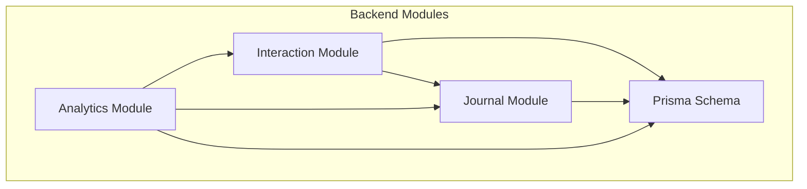
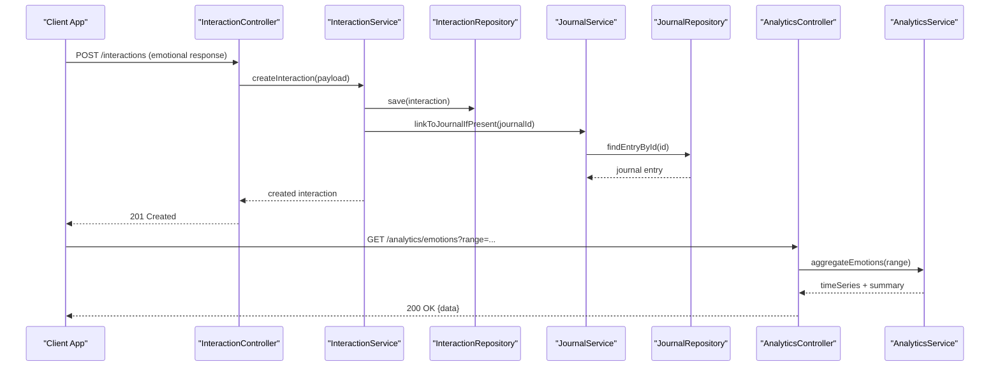
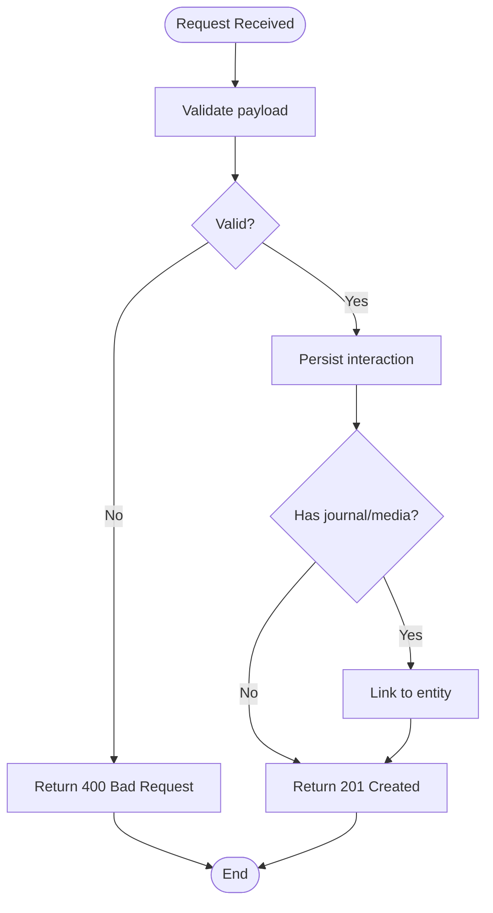
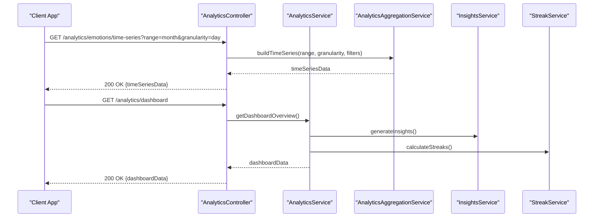
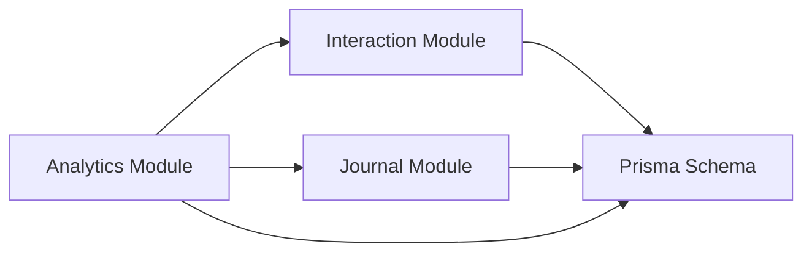

# Emotional Tracking API

<cite>
**Referenced Files in This Document**
- [interaction.controller.ts](file://apps/backend/src/interaction/interaction.controller.ts)
- [interaction.service.ts](file://apps/backend/src/interaction/interaction.service.ts)
- [interaction.repository.ts](file://apps/backend/src/interaction/interaction.repository.ts)
- [interaction.module.ts](file://apps/backend/src/interaction/interaction.module.ts)
- [journal.controller.ts](file://apps/backend/src/journal/journal.controller.ts)
- [journal.service.ts](file://apps/backend/src/journal/journal.service.ts)
- [journal.repository.ts](file://apps/backend/src/journal/journal.repository.ts)
- [analytics.controller.ts](file://apps/backend/src/analytics/analytics.controller.ts)
- [analytics.service.ts](file://apps/backend/src/analytics/analytics.service.ts)
- [analytics-aggregation.service.ts](file://apps/backend/src/analytics/analytics-aggregation.service.ts)
- [dashboard.service.ts](file://apps/backend/src/analytics/dashboard.service.ts)
- [insights.service.ts](file://apps/backend/src/analytics/insights.service.ts)
- [streak.service.ts](file://apps/backend/src/analytics/streak.service.ts)
- [schema.prisma](file://apps/backend/prisma/schema.prisma)
- [app.module.ts](file://apps/backend/src/app.module.ts)
</cite>

## Table of Contents
1. [Introduction](#introduction)
2. [Project Structure](#project-structure)
3. [Core Components](#core-components)
4. [Architecture Overview](#architecture-overview)
5. [Detailed Component Analysis](#detailed-component-analysis)
6. [Dependency Analysis](#dependency-analysis)
7. [Performance Considerations](#performance-considerations)
8. [Troubleshooting Guide](#troubleshooting-guide)
9. [Conclusion](#conclusion)
10. [Appendices](#appendices)

## Introduction
This document provides comprehensive API documentation for emotional state tracking and interaction logging within the application. It covers endpoints for recording emotional responses to journal entries, mood scoring systems, sentiment analysis integration points, and temporal emotional patterns. It also includes schemas for emotional state data structures, interaction types, mood indicators, and correlation between emotions and journal content. Examples are provided for emotional tracking workflows, mood visualization data formats, and historical emotional pattern queries.

## Project Structure
The backend is organized by feature modules. The relevant areas for emotional tracking and interactions include:
- Interaction module: handles generic user interactions and events that can be used as proxies for emotional states or reactions.
- Journal module: manages journal entries and associated metadata; emotional states can be correlated with journal content.
- Analytics module: aggregates metrics, insights, streaks, and dashboard data including time-series and summary statistics suitable for mood visualization.
- Prisma schema: defines persistent entities and relationships used across modules.



**Diagram sources**
- [interaction.module.ts](file://apps/backend/src/interaction/interaction.module.ts)
- [journal.module.ts](file://apps/backend/src/journal/journal.module.ts)
- [analytics.module.ts](file://apps/backend/src/analytics/analytics.module.ts)
- [schema.prisma](file://apps/backend/prisma/schema.prisma)

**Section sources**
- [app.module.ts](file://apps/backend/src/app.module.ts)
- [schema.prisma](file://apps/backend/prisma/schema.prisma)

## Core Components
- Interaction Controller: exposes HTTP endpoints for recording interactions and events. These can represent emotional reactions or contextual triggers linked to journal entries.
- Interaction Service: orchestrates business logic for creating, querying, and aggregating interactions.
- Interaction Repository: persists and retrieves interaction records from the database.
- Journal Controller: exposes endpoints for journal entry CRUD operations and related metadata.
- Journal Service: implements journal-related business logic and coordinates with repositories.
- Journal Repository: persists journal entries and associations.
- Analytics Controller: exposes endpoints for aggregated analytics, dashboards, and insights.
- Analytics Services: implement aggregation, streak calculation, and insight generation.
- Prisma Schema: defines core entities such as interactions, journals, and any emotional/mood-related fields.

**Section sources**
- [interaction.controller.ts](file://apps/backend/src/interaction/interaction.controller.ts)
- [interaction.service.ts](file://apps/backend/src/interaction/interaction.service.ts)
- [interaction.repository.ts](file://apps/backend/src/interaction/interaction.repository.ts)
- [journal.controller.ts](file://apps/backend/src/journal/journal.controller.ts)
- [journal.service.ts](file://apps/backend/src/journal/journal.service.ts)
- [journal.repository.ts](file://apps/backend/src/journal/journal.repository.ts)
- [analytics.controller.ts](file://apps/backend/src/analytics/analytics.controller.ts)
- [analytics.service.ts](file://apps/backend/src/analytics/analytics.service.ts)
- [analytics-aggregation.service.ts](file://apps/backend/src/analytics/analytics-aggregation.service.ts)
- [dashboard.service.ts](file://apps/backend/src/analytics/dashboard.service.ts)
- [insights.service.ts](file://apps/backend/src/analytics/insights.service.ts)
- [streak.service.ts](file://apps/backend/src/analytics/streak.service.ts)
- [schema.prisma](file://apps/backend/prisma/schema.prisma)

## Architecture Overview
The emotional tracking system integrates three layers:
- API Layer: Controllers expose REST endpoints for recording interactions and retrieving analytics.
- Service Layer: Business logic coordinates domain operations, validation, and cross-module calls (e.g., linking interactions to journal entries).
- Data Layer: Repositories interact with Prisma to persist and query data defined in the schema.



**Diagram sources**
- [interaction.controller.ts](file://apps/backend/src/interaction/interaction.controller.ts)
- [interaction.service.ts](file://apps/backend/src/interaction/interaction.service.ts)
- [interaction.repository.ts](file://apps/backend/src/interaction/interaction.repository.ts)
- [journal.service.ts](file://apps/backend/src/journal/journal.service.ts)
- [journal.repository.ts](file://apps/backend/src/journal/journal.repository.ts)
- [analytics.controller.ts](file://apps/backend/src/analytics/analytics.controller.ts)
- [analytics.service.ts](file://apps/backend/src/analytics/analytics.service.ts)

## Detailed Component Analysis

### Interaction Endpoints
Purpose: Record emotional responses and contextual interactions tied to journal entries or media items.

Key endpoints:
- Create interaction (emotional response)
  - Method: POST
  - Path: /interactions
  - Request body:
    - type: string (e.g., "emotion", "mood", "sentiment")
    - value: number or string (score or label)
    - intensity: number (optional, 0–1)
    - tags: array of strings (optional)
    - journal_id: string UUID (optional)
    - media_id: string UUID (optional)
    - context: object (optional, e.g., timestamp, location)
  - Response: created interaction record
- List interactions
  - Method: GET
  - Path: /interactions
  - Query params:
    - journal_id: optional filter
    - media_id: optional filter
    - type: optional filter
    - date_from/date_to: optional range
  - Response: paginated list of interactions
- Get interaction by ID
  - Method: GET
  - Path: /interactions/:id
  - Response: single interaction record

Data flow:
- Controller validates input and delegates to service.
- Service creates interaction, optionally links to journal/media.
- Repository persists data via Prisma.



**Diagram sources**
- [interaction.controller.ts](file://apps/backend/src/interaction/interaction.controller.ts)
- [interaction.service.ts](file://apps/backend/src/interaction/interaction.service.ts)
- [interaction.repository.ts](file://apps/backend/src/interaction/interaction.repository.ts)

**Section sources**
- [interaction.controller.ts](file://apps/backend/src/interaction/interaction.controller.ts)
- [interaction.service.ts](file://apps/backend/src/interaction/interaction.service.ts)
- [interaction.repository.ts](file://apps/backend/src/interaction/interaction.repository.ts)

### Journal Integration
Purpose: Correlate emotional interactions with journal entries to enable sentiment-emotion mapping and temporal analysis.

Key endpoints:
- Create journal entry
  - Method: POST
  - Path: /journal
  - Request body: title, content, tags, mood_hint (optional), emotion_tags (optional)
  - Response: created journal entry
- Update journal entry
  - Method: PATCH
  - Path: /journal/:id
  - Request body: partial update fields
  - Response: updated journal entry
- Get journal entry by ID
  - Method: GET
  - Path: /journal/:id
  - Response: single journal entry

Emotional correlation:
- Interactions can reference a journal_id to associate emotional responses with specific entries.
- Journal entries may include mood hints or emotion tags to enrich analysis.

```mermaid
classDiagram
class JournalEntry {
+uuid id
+string title
+text content
+string[] tags
+string mood_hint
+string[] emotion_tags
+timestamp createdAt
+timestamp updatedAt
}
class Interaction {
+uuid id
+string type
+number value
+number intensity
+string[] tags
+uuid journal_id
+uuid media_id
+object context
+timestamp createdAt
}
JournalEntry ||--o{ Interaction : "has many"
```

**Diagram sources**
- [journal.controller.ts](file://apps/backend/src/journal/journal.controller.ts)
- [journal.service.ts](file://apps/backend/src/journal/journal.service.ts)
- [journal.repository.ts](file://apps/backend/src/journal/journal.repository.ts)
- [schema.prisma](file://apps/backend/prisma/schema.prisma)

**Section sources**
- [journal.controller.ts](file://apps/backend/src/journal/journal.controller.ts)
- [journal.service.ts](file://apps/backend/src/journal/journal.service.ts)
- [journal.repository.ts](file://apps/backend/src/journal/journal.repository.ts)
- [schema.prisma](file://apps/backend/prisma/schema.prisma)

### Analytics and Mood Visualization
Purpose: Provide aggregated emotional data, time-series trends, streaks, and insights for mood visualization and historical pattern queries.

Key endpoints:
- Emotions time series
  - Method: GET
  - Path: /analytics/emotions/time-series
  - Query params:
    - range: string (e.g., "week", "month", "quarter")
    - granularity: string (e.g., "day", "hour")
    - filters: object (optional, e.g., journal_id, type)
  - Response: time-series data with timestamps and aggregated values
- Emotions summary
  - Method: GET
  - Path: /analytics/emotions/summary
  - Query params:
    - range: string
    - group_by: string (e.g., "type", "tag")
  - Response: summary counts and averages
- Streaks
  - Method: GET
  - Path: /analytics/streaks
  - Query params:
    - type: optional filter
  - Response: current and max streaks
- Dashboard overview
  - Method: GET
  - Path: /analytics/dashboard
  - Response: aggregated stats for UI dashboard

Processing logic:
- Aggregation services compute time-series and summaries using repository queries.
- Insights service generates recommendations based on emotional patterns.
- Streak service calculates consecutive activity periods.



**Diagram sources**
- [analytics.controller.ts](file://apps/backend/src/analytics/analytics.controller.ts)
- [analytics.service.ts](file://apps/backend/src/analytics/analytics.service.ts)
- [analytics-aggregation.service.ts](file://apps/backend/src/analytics/analytics-aggregation.service.ts)
- [insights.service.ts](file://apps/backend/src/analytics/insights.service.ts)
- [streak.service.ts](file://apps/backend/src/analytics/streak.service.ts)

**Section sources**
- [analytics.controller.ts](file://apps/backend/src/analytics/analytics.controller.ts)
- [analytics.service.ts](file://apps/backend/src/analytics/analytics.service.ts)
- [analytics-aggregation.service.ts](file://apps/backend/src/analytics/analytics-aggregation.service.ts)
- [dashboard.service.ts](file://apps/backend/src/analytics/dashboard.service.ts)
- [insights.service.ts](file://apps/backend/src/analytics/insights.service.ts)
- [streak.service.ts](file://apps/backend/src/analytics/streak.service.ts)

## Dependency Analysis
Module-level dependencies:
- Interaction module depends on Prisma schema for persistence and optionally on Journal module for linking.
- Journal module depends on Prisma schema for persistence.
- Analytics module depends on Interaction and Journal repositories for aggregation and insights.



**Diagram sources**
- [interaction.module.ts](file://apps/backend/src/interaction/interaction.module.ts)
- [journal.module.ts](file://apps/backend/src/journal/journal.module.ts)
- [analytics.module.ts](file://apps/backend/src/analytics/analytics.module.ts)
- [schema.prisma](file://apps/backend/prisma/schema.prisma)

**Section sources**
- [interaction.module.ts](file://apps/backend/src/interaction/interaction.module.ts)
- [journal.module.ts](file://apps/backend/src/journal/journal.module.ts)
- [analytics.module.ts](file://apps/backend/src/analytics/analytics.module.ts)
- [schema.prisma](file://apps/backend/prisma/schema.prisma)

## Performance Considerations
- Use pagination and filtering on list endpoints to reduce payload size.
- Cache frequent analytics queries where appropriate.
- Index frequently queried fields in the database schema (e.g., journal_id, type, createdAt).
- Batch writes for bulk emotional tracking if needed.
- Avoid heavy computations in request paths; offload to background jobs if necessary.

[No sources needed since this section provides general guidance]

## Troubleshooting Guide
Common issues:
- Validation errors: Ensure required fields are present and correctly typed.
- Missing journal/media links: Verify IDs exist before linking interactions.
- Aggregation timeouts: Optimize queries and consider caching for large ranges.
- Inconsistent timestamps: Normalize timezone handling and ensure consistent timestamp formats.

Debugging steps:
- Check controller logs for request payloads and responses.
- Inspect service layer exceptions and error messages.
- Validate repository queries against the schema.
- Use analytics dashboard endpoints to verify data availability.

**Section sources**
- [interaction.controller.ts](file://apps/backend/src/interaction/interaction.controller.ts)
- [interaction.service.ts](file://apps/backend/src/interaction/interaction.service.ts)
- [analytics.controller.ts](file://apps/backend/src/analytics/analytics.controller.ts)
- [analytics.service.ts](file://apps/backend/src/analytics/analytics.service.ts)

## Conclusion
The emotional tracking system integrates interaction logging, journal correlation, and analytics to provide robust mood visualization and historical pattern analysis. By leveraging well-defined endpoints, clear data schemas, and modular architecture, developers can extend functionality and maintain performance while supporting rich emotional insights.

[No sources needed since this section summarizes without analyzing specific files]

## Appendices

### Emotional State Data Structures
- Interaction:
  - id: string UUID
  - type: string ("emotion", "mood", "sentiment")
  - value: number or string
  - intensity: number (0–1)
  - tags: string[]
  - journal_id: string UUID (optional)
  - media_id: string UUID (optional)
  - context: object (optional)
  - createdAt: timestamp
- Journal Entry:
  - id: string UUID
  - title: string
  - content: text
  - tags: string[]
  - mood_hint: string (optional)
  - emotion_tags: string[] (optional)
  - createdAt: timestamp
  - updatedAt: timestamp

**Section sources**
- [schema.prisma](file://apps/backend/prisma/schema.prisma)

### Interaction Types and Mood Indicators
- Interaction types:
  - emotion: discrete emotional labels (e.g., joy, sadness, anger)
  - mood: continuous mood scores (e.g., 1–10 scale)
  - sentiment: polarity scores (e.g., -1 to 1)
- Mood indicators:
  - intensity: strength of the emotional response
  - tags: descriptive keywords for categorization
  - context: additional metadata (location, device, activity)

**Section sources**
- [interaction.controller.ts](file://apps/backend/src/interaction/interaction.controller.ts)
- [interaction.service.ts](file://apps/backend/src/interaction/interaction.service.ts)

### Emotional Tracking Workflows
- Record emotional response to a journal entry:
  - Create journal entry.
  - Submit interaction with journal_id and emotion/mood/sentiment data.
  - Retrieve time-series analytics to visualize trends.
- Historical emotional pattern query:
  - Use analytics endpoints with range and filters to fetch aggregated data.
  - Visualize using charts and dashboards.

**Section sources**
- [journal.controller.ts](file://apps/backend/src/journal/journal.controller.ts)
- [interaction.controller.ts](file://apps/backend/src/interaction/interaction.controller.ts)
- [analytics.controller.ts](file://apps/backend/src/analytics/analytics.controller.ts)

### Mood Visualization Data Formats
- Time-series:
  - Array of objects with timestamp and aggregated value per interval.
- Summary:
  - Counts and averages grouped by type or tag.
- Dashboard:
  - Aggregated stats including streaks, top emotions, and recent trends.

**Section sources**
- [analytics-aggregation.service.ts](file://apps/backend/src/analytics/analytics-aggregation.service.ts)
- [dashboard.service.ts](file://apps/backend/src/analytics/dashboard.service.ts)
- [insights.service.ts](file://apps/backend/src/analytics/insights.service.ts)
- [streak.service.ts](file://apps/backend/src/analytics/streak.service.ts)