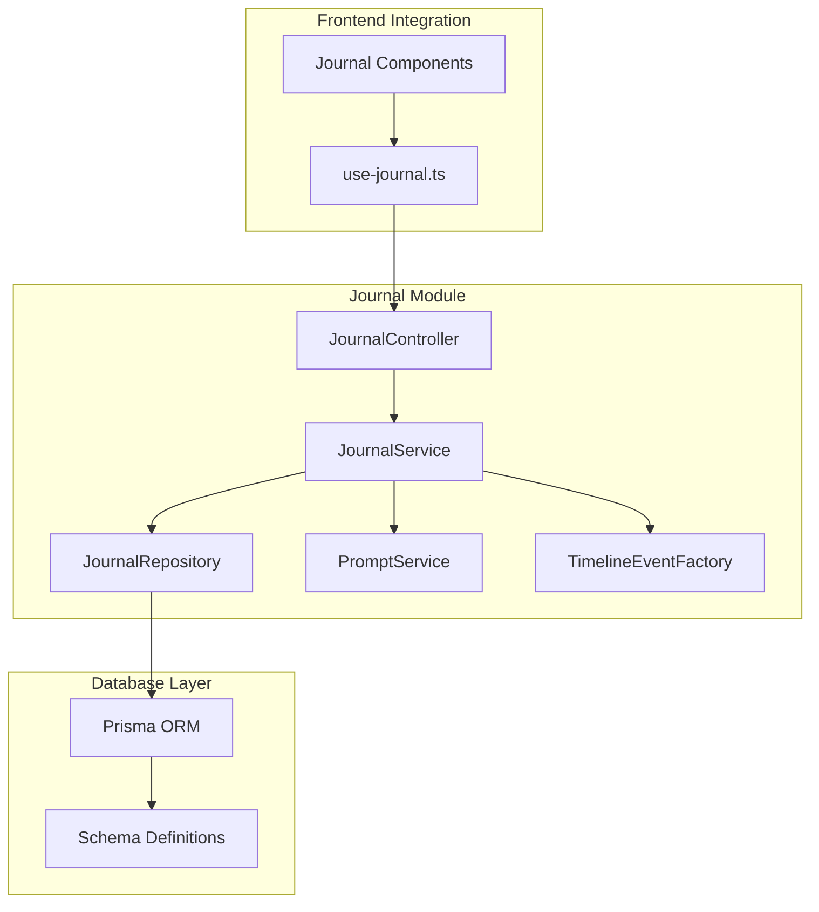
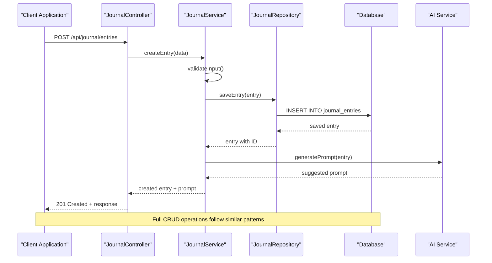
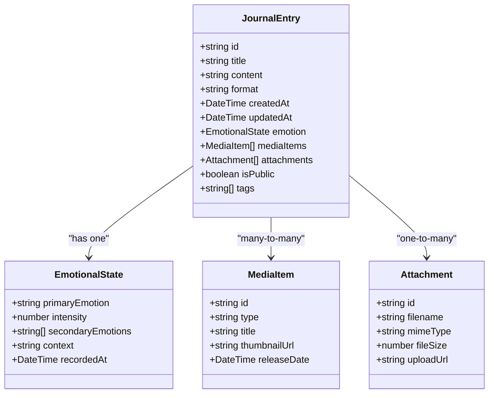
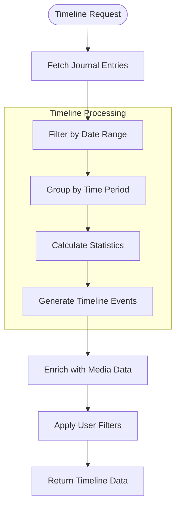
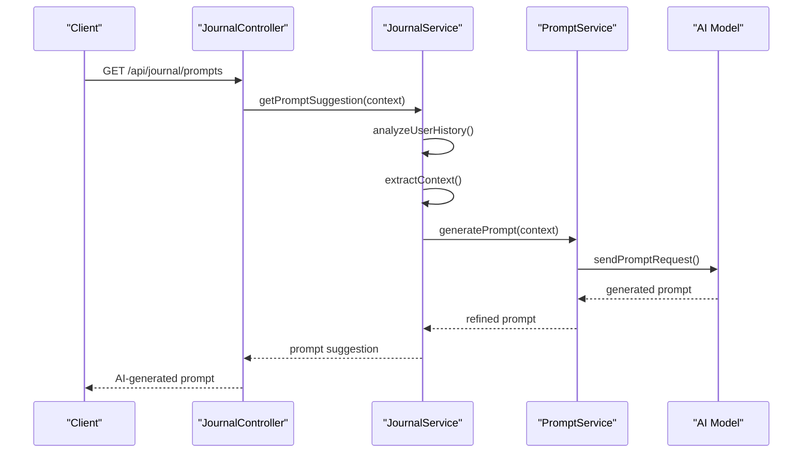
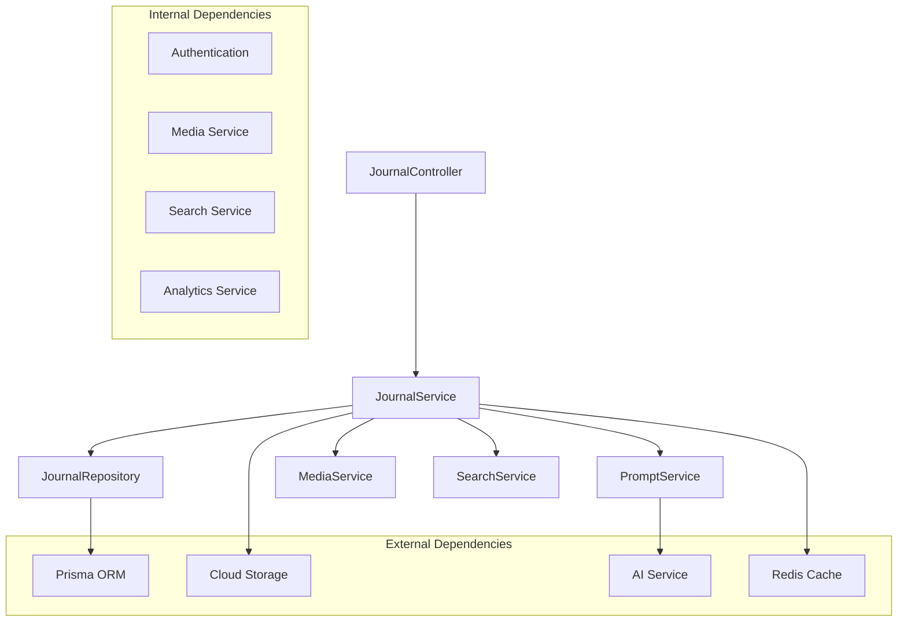
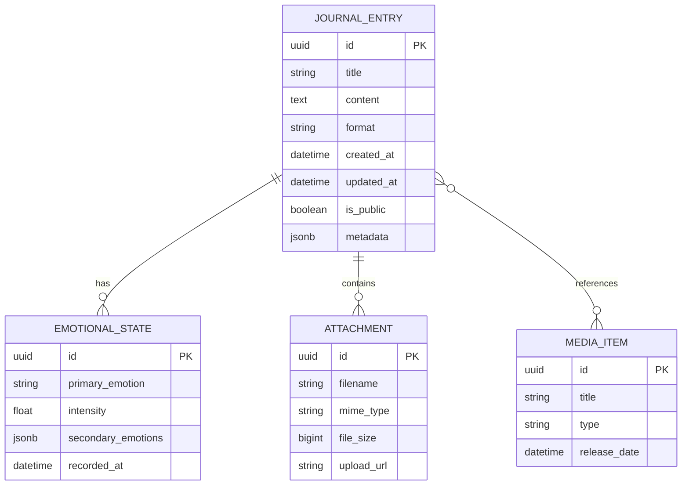

# Journal API

<cite>
**Referenced Files in This Document**
- [journal.controller.ts](file://apps/backend/src/journal/journal.controller.ts)
- [journal.service.ts](file://apps/backend/src/journal/journal.service.ts)
- [journal.repository.ts](file://apps/backend/src/journal/journal.repository.ts)
- [prompt.service.ts](file://apps/backend/src/journal/prompt.service.ts)
- [timeline-event-factory.ts](file://apps/backend/src/journal/timeline-event-factory.ts)
- [schema.prisma](file://apps/backend/prisma/schema.prisma)
- [use-journal.ts](file://src/hooks/use-journal.ts)
- [JournalEntryCard.tsx](file://src/components/journal/JournalEntryCard.tsx)
- [JournalPrompt.tsx](file://src/components/journal/JournalPrompt.tsx)
- [MoodChart.tsx](file://src/components/journal/MoodChart.tsx)
</cite>

## Table of Contents
1. [Introduction](#introduction)
2. [Project Structure](#project-structure)
3. [Core Components](#core-components)
4. [Architecture Overview](#architecture-overview)
5. [Detailed Component Analysis](#detailed-component-analysis)
6. [Dependency Analysis](#dependency-analysis)
7. [Performance Considerations](#performance-considerations)
8. [Troubleshooting Guide](#troubleshooting-guide)
9. [Conclusion](#conclusion)
10. [Appendices](#appendices)

## Introduction

The Journal API provides comprehensive journal entry management capabilities for the Chronicle Your Media Story application. This API enables users to create, read, update, and delete journal entries while supporting rich text editing, emotional state tracking, timeline generation, and AI-powered prompt suggestions. The system integrates seamlessly with media items, allowing users to connect their reflections and thoughts with specific media content.

## Project Structure

The journal functionality is organized within the NestJS backend architecture following a modular design pattern:

**Diagram sources**
- [journal.controller.ts](file://apps/backend/src/journal/journal.controller.ts)
- [journal.service.ts](file://apps/backend/src/journal/journal.service.ts)
- [journal.repository.ts](file://apps/backend/src/journal/journal.repository.ts)

**Section sources**
- [journal.controller.ts](file://apps/backend/src/journal/journal.controller.ts)
- [journal.service.ts](file://apps/backend/src/journal/journal.service.ts)
- [journal.repository.ts](file://apps/backend/src/journal/journal.repository.ts)

## Core Components

### Journal Controller
The controller handles HTTP requests for journal entry operations, providing RESTful endpoints for CRUD operations, emotional state tracking, and timeline queries.

### Journal Service
The service layer implements business logic for journal entry management, including validation, data transformation, and integration with external services like AI prompts and timeline generation.

### Journal Repository
The repository manages database operations using Prisma ORM, handling journal entry persistence, relationships with media items, and complex queries for timeline generation.

### Prompt Service
The prompt service provides AI-powered journal entry suggestions and writing assistance, integrating with language models to generate contextual prompts based on user history and media interactions.

### Timeline Event Factory
The factory creates structured timeline events from journal entries, enabling chronological visualization and analysis of user reflections over time.

**Section sources**
- [journal.controller.ts](file://apps/backend/src/journal/journal.controller.ts)
- [journal.service.ts](file://apps/backend/src/journal/journal.service.ts)
- [journal.repository.ts](file://apps/backend/src/journal/journal.repository.ts)
- [prompt.service.ts](file://apps/backend/src/journal/prompt.service.ts)
- [timeline-event-factory.ts](file://apps/backend/src/journal/timeline-event-factory.ts)

## Architecture Overview

The Journal API follows a layered architecture pattern with clear separation of concerns:

**Diagram sources**
- [journal.controller.ts](file://apps/backend/src/journal/journal.controller.ts)
- [journal.service.ts](file://apps/backend/src/journal/journal.service.ts)
- [journal.repository.ts](file://apps/backend/src/journal/journal.repository.ts)

## Detailed Component Analysis

### Journal Entry Management

#### CRUD Operations

The API provides comprehensive CRUD operations for journal entries:

**Create Journal Entry**
- Endpoint: `POST /api/journal/entries`
- Request Body: Rich text content, emotional metadata, media associations
- Response: Created entry with generated timestamp and AI prompt suggestion

**Read Journal Entries**
- Endpoint: `GET /api/journal/entries`
- Query Parameters: Pagination, filtering by date/emotion/media
- Response: Paginated list of entries with optional media previews

**Update Journal Entry**
- Endpoint: `PUT /api/journal/entries/:id`
- Request Body: Partial or complete entry updates
- Response: Updated entry with modification timestamp

**Delete Journal Entry**
- Endpoint: `DELETE /api/journal/entries/:id`
- Response: Success confirmation with soft delete implementation

#### Emotional State Tracking

The system supports comprehensive emotional state tracking through structured metadata:

**Diagram sources**
- [journal.service.ts](file://apps/backend/src/journal/journal.service.ts)
- [schema.prisma](file://apps/backend/prisma/schema.prisma)

#### Timeline Generation

The timeline feature creates chronological visualizations of journal entries:

**Diagram sources**
- [timeline-event-factory.ts](file://apps/backend/src/journal/timeline-event-factory.ts)
- [journal.repository.ts](file://apps/backend/src/journal/journal.repository.ts)

#### AI-Powered Prompt Suggestions

The AI prompt system generates contextual writing suggestions:

**Diagram sources**
- [prompt.service.ts](file://apps/backend/src/journal/prompt.service.ts)
- [journal.service.ts](file://apps/backend/src/journal/journal.service.ts)

### Rich Text Editing Support

The API supports multiple content formats for journal entries:

#### Supported Formats
- **Markdown**: Full markdown syntax support with automatic parsing
- **HTML**: Rich HTML content with sanitization
- **Plain Text**: Basic text formatting
- **JSON**: Structured content for advanced use cases

#### Content Processing Pipeline
1. **Input Validation**: Format detection and schema validation
2. **Sanitization**: XSS protection and content cleaning
3. **Transformation**: Format conversion and optimization
4. **Storage**: Optimized storage format selection
5. **Retrieval**: Format-appropriate response generation

### Attachment Handling

The attachment system supports various file types with comprehensive metadata:

#### File Type Support
- **Images**: JPEG, PNG, WebP, GIF with automatic thumbnail generation
- **Documents**: PDF, DOCX, TXT with preview generation
- **Audio**: MP3, WAV, OGG with waveform extraction
- **Video**: MP4, WebM with frame extraction

#### Upload Process
1. **Validation**: File size, type, and security checks
2. **Processing**: Format conversion and optimization
3. **Storage**: Cloud storage with CDN integration
4. **Metadata Extraction**: EXIF data, duration, dimensions
5. **Indexing**: Searchable content extraction

### Relationship Mapping

The system maintains sophisticated relationships between journal entries and other entities:

#### Media Item Relationships
- **Direct Association**: Link entries to specific media items
- **Temporal Context**: Record when during media consumption the entry was made
- **Sentiment Analysis**: Track emotional responses to media content
- **Cross-Reference**: Enable bidirectional navigation between entries and media

#### Collection Integration
- **Collection Membership**: Organize entries into thematic collections
- **Smart Collections**: Auto-categorization based on content analysis
- **Cross-Collections**: Support entries appearing in multiple collections

**Section sources**
- [journal.service.ts](file://apps/backend/src/journal/journal.service.ts)
- [journal.repository.ts](file://apps/backend/src/journal/journal.repository.ts)
- [prompt.service.ts](file://apps/backend/src/journal/prompt.service.ts)
- [timeline-event-factory.ts](file://apps/backend/src/journal/timeline-event-factory.ts)

## Dependency Analysis

The journal module has well-defined dependencies and integration points:

**Diagram sources**
- [journal.module.ts](file://apps/backend/src/journal/journal.module.ts)
- [journal.service.ts](file://apps/backend/src/journal/journal.service.ts)

### Key Dependencies
- **Prisma ORM**: Database abstraction and query building
- **Cloud Storage**: File upload and management (AWS S3 compatible)
- **AI Service**: Language model integration for prompt generation
- **Redis**: Caching layer for performance optimization
- **Authentication**: User context and permission validation
- **Media Service**: Integration with media item management
- **Search Service**: Full-text search across journal content

**Section sources**
- [journal.module.ts](file://apps/backend/src/journal/journal.module.ts)
- [journal.service.ts](file://apps/backend/src/journal/journal.service.ts)

## Performance Considerations

### Database Optimization
- **Indexing Strategy**: Optimized indexes for common query patterns
- **Query Optimization**: Efficient joins and selective field retrieval
- **Connection Pooling**: Configurable connection pool settings
- **Caching Layer**: Redis caching for frequently accessed data

### API Performance
- **Pagination**: Cursor-based pagination for large datasets
- **Lazy Loading**: Deferred loading of related entities
- **Response Compression**: Gzip compression for API responses
- **Rate Limiting**: Protection against abuse and excessive requests

### Memory Management
- **Stream Processing**: Efficient handling of large file uploads
- **Memory Limits**: Configurable memory usage thresholds
- **Garbage Collection**: Optimized object lifecycle management
- **Connection Cleanup**: Proper resource disposal patterns

## Troubleshooting Guide

### Common Issues and Solutions

#### Database Connection Problems
- **Symptoms**: Connection timeouts, query failures
- **Diagnosis**: Check connection pool status and database health
- **Resolution**: Verify database credentials and network connectivity

#### File Upload Failures
- **Symptoms**: Upload timeouts, invalid file errors
- **Diagnosis**: Check storage service availability and file permissions
- **Resolution**: Verify storage configuration and file size limits

#### AI Prompt Generation Issues
- **Symptoms**: Slow responses, empty prompts
- **Diagnosis**: Monitor AI service health and rate limits
- **Resolution**: Implement fallback prompts and retry logic

#### Performance Degradation
- **Symptoms**: Slow API responses, high memory usage
- **Diagnosis**: Analyze query performance and cache hit rates
- **Resolution**: Optimize queries, adjust cache policies, scale resources

### Error Handling Patterns
- **Validation Errors**: Clear error messages with field-specific details
- **Business Logic Errors**: Descriptive error codes and recovery suggestions
- **System Errors**: Graceful degradation with fallback mechanisms
- **External Service Errors**: Retry logic with exponential backoff

**Section sources**
- [journal.service.ts](file://apps/backend/src/journal/journal.service.ts)
- [journal.repository.ts](file://apps/backend/src/journal/journal.repository.ts)

## Conclusion

The Journal API provides a comprehensive and robust foundation for journal entry management in the Chronicle Your Media Story application. With support for rich text editing, emotional state tracking, timeline generation, and AI-powered features, it enables users to create meaningful connections between their reflections and media experiences.

The modular architecture ensures maintainability and scalability, while the extensive integration points allow for seamless operation within the broader application ecosystem. The API's design prioritizes both developer experience and end-user functionality, making it an essential component of the platform's storytelling capabilities.

## Appendices

### API Endpoints Reference

#### Journal Entry Endpoints
- `POST /api/journal/entries` - Create new journal entry
- `GET /api/journal/entries` - List journal entries with filtering
- `GET /api/journal/entries/:id` - Get specific journal entry
- `PUT /api/journal/entries/:id` - Update journal entry
- `DELETE /api/journal/entries/:id` - Delete journal entry

#### Emotional State Endpoints
- `POST /api/journal/entries/:id/emotions` - Add emotional metadata
- `GET /api/journal/entries/:id/emotions` - Retrieve emotional history
- `PUT /api/journal/entries/:id/emotions` - Update emotional state

#### Timeline Endpoints
- `GET /api/journal/timeline` - Generate timeline data
- `GET /api/journal/timeline/:period` - Get timeline for specific period

#### AI Prompt Endpoints
- `GET /api/journal/prompts` - Get AI-generated prompts
- `POST /api/journal/prompts/generate` - Generate custom prompt

### Data Models

#### Journal Entry Schema

**Diagram sources**
- [schema.prisma](file://apps/backend/prisma/schema.prisma)

### Frontend Integration Examples

#### React Hook Usage
The `use-journal.ts` hook provides React integration for journal functionality:

- **State Management**: Automatic state synchronization with server
- **Mutation Hooks**: Optimistic updates and error handling
- **Query Hooks**: Cached data with background refetching
- **File Upload**: Progress tracking and error recovery

#### Component Integration
Journal components leverage the API hooks for seamless user experience:

- **JournalEntryCard**: Displays individual entries with rich formatting
- **JournalPrompt**: AI-powered writing assistance interface
- **MoodChart**: Visual representation of emotional states over time

**Section sources**
- [use-journal.ts](file://src/hooks/use-journal.ts)
- [JournalEntryCard.tsx](file://src/components/journal/JournalEntryCard.tsx)
- [JournalPrompt.tsx](file://src/components/journal/JournalPrompt.tsx)
- [MoodChart.tsx](file://src/components/journal/MoodChart.tsx)