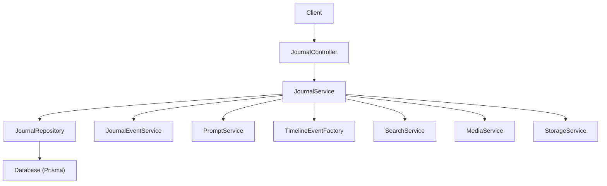
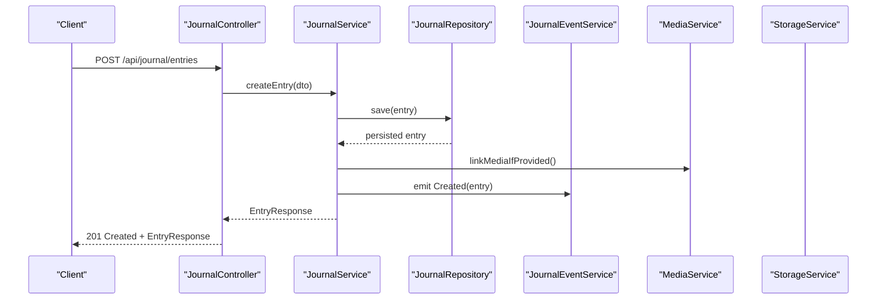
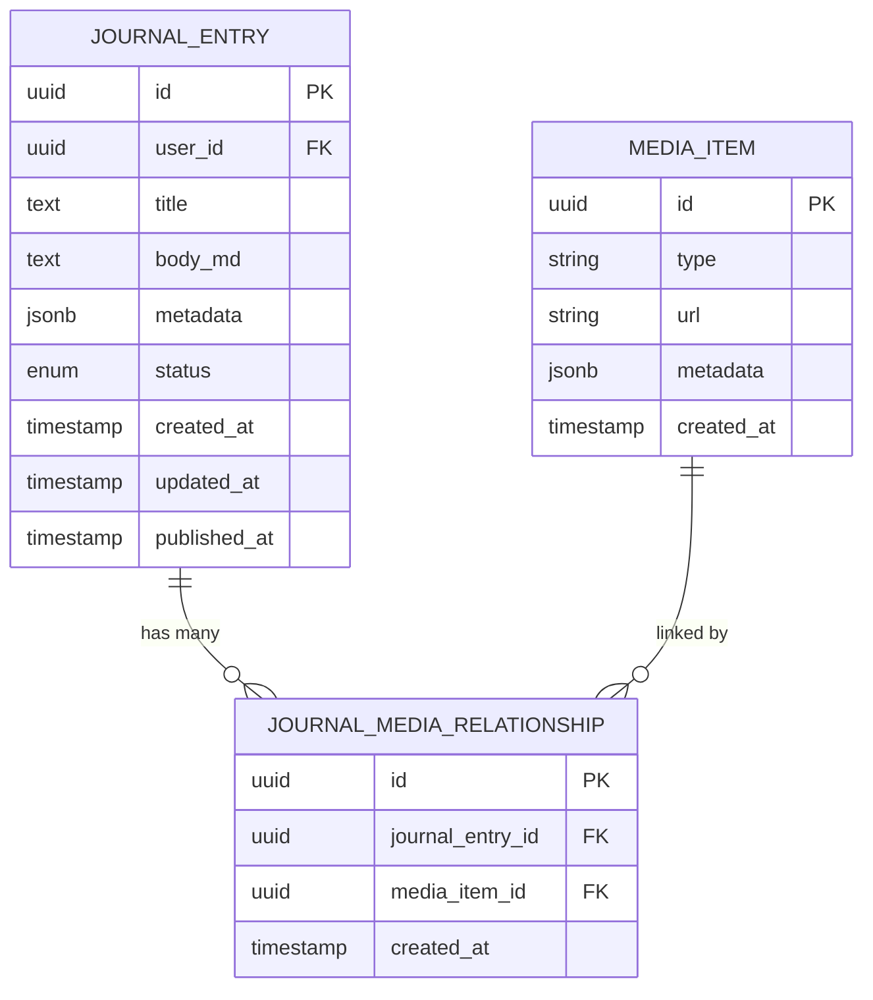
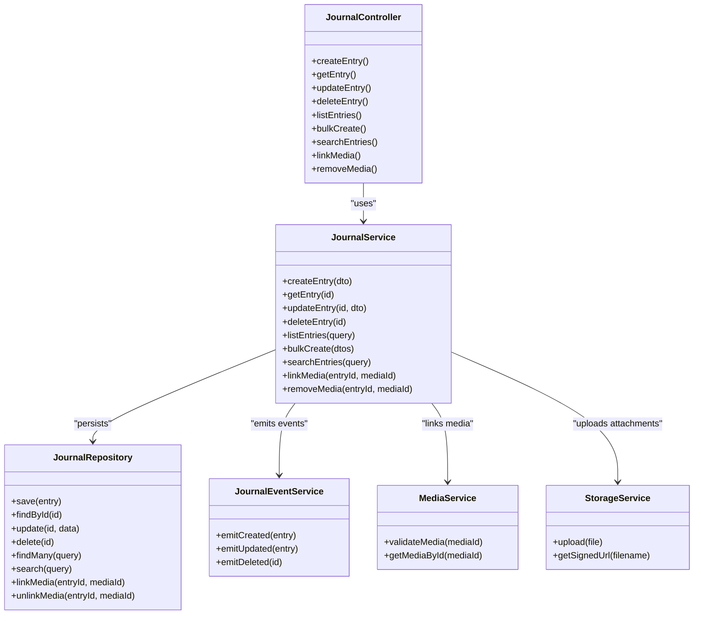

# Journal Entries API

<cite>
**Referenced Files in This Document**
- [journal.controller.ts](file://apps/backend/src/journal/journal.controller.ts)
- [journal.service.ts](file://apps/backend/src/journal/journal.service.ts)
- [journal.repository.ts](file://apps/backend/src/journal/journal.repository.ts)
- [journal.module.ts](file://apps/backend/src/journal/journal.module.ts)
- [schema.prisma](file://apps/backend/prisma/schema.prisma)
- [journal-event.service.ts](file://apps/backend/src/journal/journal-event.service.ts)
- [prompt.service.ts](file://apps/backend/src/journal/prompt.service.ts)
- [timeline-event-factory.ts](file://apps/backend/src/journal/timeline-event-factory.ts)
- [search.service.ts](file://apps/backend/src/search/search.service.ts)
- [media.service.ts](file://apps/backend/src/media/media.service.ts)
- [storage.service.ts](file://apps/backend/src/storage/storage.service.ts)
- [upload.service.ts](file://apps/backend/src/storage/upload.service.ts)
</cite>

## Table of Contents
1. [Introduction](#introduction)
2. [Project Structure](#project-structure)
3. [Core Components](#core-components)
4. [Architecture Overview](#architecture-overview)
5. [Detailed Component Analysis](#detailed-component-analysis)
6. [Dependency Analysis](#dependency-analysis)
7. [Performance Considerations](#performance-considerations)
8. [Troubleshooting Guide](#troubleshooting-guide)
9. [Conclusion](#conclusion)
10. [Appendices](#appendices)

## Introduction
This document provides detailed API documentation for journal entry CRUD operations, including rich text and markdown support, attachment handling, emotional state tracking, timestamp management, and relationships to media items. It covers request/response schemas, examples for creation with metadata, bulk operations, search within journal content, and filtering by date ranges or emotional states.

## Project Structure
The journal feature is implemented as a NestJS module under apps/backend/src/journal. The controller exposes HTTP endpoints, the service encapsulates business logic, and the repository handles persistence via Prisma. Related capabilities include event emission, prompt generation, timeline integration, search, media relationships, and storage for attachments.

**Diagram sources**
- [journal.controller.ts](file://apps/backend/src/journal/journal.controller.ts)
- [journal.service.ts](file://apps/backend/src/journal/journal.service.ts)
- [journal.repository.ts](file://apps/backend/src/journal/journal.repository.ts)
- [journal-event.service.ts](file://apps/backend/src/journal/journal-event.service.ts)
- [prompt.service.ts](file://apps/backend/src/journal/prompt.service.ts)
- [timeline-event-factory.ts](file://apps/backend/src/journal/timeline-event-factory.ts)
- [search.service.ts](file://apps/backend/src/search/search.service.ts)
- [media.service.ts](file://apps/backend/src/media/media.service.ts)
- [storage.service.ts](file://apps/backend/src/storage/storage.service.ts)

**Section sources**
- [journal.controller.ts](file://apps/backend/src/journal/journal.controller.ts)
- [journal.service.ts](file://apps/backend/src/journal/journal.service.ts)
- [journal.repository.ts](file://apps/backend/src/journal/journal.repository.ts)
- [journal.module.ts](file://apps/backend/src/journal/journal.module.ts)

## Core Components
- JournalController: Defines REST endpoints for journal entries (create, read, update, delete), list, search, and bulk operations.
- JournalService: Orchestrates domain logic, validates inputs, manages timestamps, emotional states, media relationships, and triggers events.
- JournalRepository: Data access layer using Prisma for journal entries and related entities.
- JournalEventService: Emits domain events on create/update/delete for auditability and integrations.
- PromptService: Provides prompts to assist users when creating entries.
- TimelineEventFactory: Converts journal entries into timeline events for visualization.
- SearchService: Enables full-text search across journal content.
- MediaService: Manages relationships between journal entries and media items.
- StorageService/UploadService: Handles attachment uploads and signed URLs.

**Section sources**
- [journal.controller.ts](file://apps/backend/src/journal/journal.controller.ts)
- [journal.service.ts](file://apps/backend/src/journal/journal.service.ts)
- [journal.repository.ts](file://apps/backend/src/journal/journal.repository.ts)
- [journal-event.service.ts](file://apps/backend/src/journal/journal-event.service.ts)
- [prompt.service.ts](file://apps/backend/src/journal/prompt.service.ts)
- [timeline-event-factory.ts](file://apps/backend/src/journal/timeline-event-factory.ts)
- [search.service.ts](file://apps/backend/src/search/search.service.ts)
- [media.service.ts](file://apps/backend/src/media/media.service.ts)
- [storage.service.ts](file://apps/backend/src/storage/storage.service.ts)
- [upload.service.ts](file://apps/backend/src/storage/upload.service.ts)

## Architecture Overview
The Journal Entries API follows a layered architecture:
- Controller layer: HTTP routing, parameter binding, response formatting.
- Service layer: Business rules, validation, cross-cutting concerns (events, search, media).
- Repository layer: Persistence via Prisma ORM.
- External integrations: Storage for attachments, search indexing, media relationships.

**Diagram sources**
- [journal.controller.ts](file://apps/backend/src/journal/journal.controller.ts)
- [journal.service.ts](file://apps/backend/src/journal/journal.service.ts)
- [journal.repository.ts](file://apps/backend/src/journal/journal.repository.ts)
- [journal-event.service.ts](file://apps/backend/src/journal/journal-event.service.ts)
- [media.service.ts](file://apps/backend/src/media/media.service.ts)
- [storage.service.ts](file://apps/backend/src/storage/storage.service.ts)

## Detailed Component Analysis

### Journal Entry Data Model
The journal entry model includes fields for content (rich text/markdown), emotional state tracking, timestamps, and relationships to media items. Attachments are stored separately and linked via IDs.

**Diagram sources**
- [schema.prisma](file://apps/backend/prisma/schema.prisma)

**Section sources**
- [schema.prisma](file://apps/backend/prisma/schema.prisma)

### Endpoints Overview
Base path: /api/journal/entries

- Create Entry
  - Method: POST
  - Path: /api/journal/entries
  - Request Body: JournalEntryCreateDto
  - Response: JournalEntryResponse
  - Notes: Supports markdown body; optional metadata; optional mediaIds; optional status; timestamps managed server-side.

- Read Entry
  - Method: GET
  - Path: /api/journal/entries/:id
  - Response: JournalEntryResponse

- Update Entry
  - Method: PATCH
  - Path: /api/journal/entries/:id
  - Request Body: JournalEntryUpdateDto
  - Response: JournalEntryResponse

- Delete Entry
  - Method: DELETE
  - Path: /api/journal/entries/:id
  - Response: 204 No Content

- List Entries
  - Method: GET
  - Path: /api/journal/entries
  - Query Params: page, limit, sortBy, sortOrder, from, to, emotion, q
  - Response: PaginatedJournalEntriesResponse

- Bulk Create
  - Method: POST
  - Path: /api/journal/entries/bulk
  - Request Body: JournalEntryBulkCreateDto
  - Response: JournalEntryBulkResponse

- Search Within Content
  - Method: GET
  - Path: /api/journal/entries/search
  - Query Params: q, from, to, emotion, page, limit
  - Response: PaginatedJournalEntriesResponse

- Link Media
  - Method: POST
  - Path: /api/journal/entries/:id/media
  - Request Body: JournalMediaLinkDto
  - Response: JournalEntryResponse

- Remove Media
  - Method: DELETE
  - Path: /api/journal/entries/:id/media/:mediaId
  - Response: 204 No Content

- Upload Attachment
  - Method: POST
  - Path: /api/storage/uploads
  - Request: multipart/form-data (file)
  - Response: UploadResponse { url }

- Get Signed URL
  - Method: GET
  - Path: /api/storage/signed-url?filename=...
  - Response: SignedUrlResponse { url }

Note: Exact endpoint paths and DTOs should be validated against the controller implementation.

**Section sources**
- [journal.controller.ts](file://apps/backend/src/journal/journal.controller.ts)

### Request/Response Schemas

- JournalEntryCreateDto
  - Fields:
    - title: string (optional)
    - body_md: string (markdown content)
    - metadata: object (optional key-value pairs)
    - mediaIds: string[] (optional array of media item IDs)
    - status: enum (optional; e.g., draft, published)
  - Validation:
    - body_md required for content creation
    - mediaIds must reference existing media items

- JournalEntryUpdateDto
  - Fields:
    - title?: string
    - body_md?: string
    - metadata?: object
    - mediaIds?: string[]
    - status?: enum

- JournalEntryBulkCreateDto
  - Field:
    - entries: JournalEntryCreateDto[]

- JournalMediaLinkDto
  - Fields:
    - mediaId: string

- JournalEntryResponse
  - Fields:
    - id: string (UUID)
    - userId: string (UUID)
    - title: string
    - body_md: string
    - metadata: object
    - status: enum
    - mediaItems: MediaItemResponse[]
    - createdAt: string (ISO timestamp)
    - updatedAt: string (ISO timestamp)
    - publishedAt: string | null (ISO timestamp)

- PaginatedJournalEntriesResponse
  - Fields:
    - items: JournalEntryResponse[]
    - total: number
    - page: number
    - limit: number

- UploadResponse
  - Fields:
    - url: string

- SignedUrlResponse
  - Fields:
    - url: string

**Section sources**
- [journal.controller.ts](file://apps/backend/src/journal/journal.controller.ts)
- [journal.service.ts](file://apps/backend/src/journal/journal.service.ts)
- [journal.repository.ts](file://apps/backend/src/journal/journal.repository.ts)

### Emotional State Tracking
Emotional states can be represented via metadata fields or dedicated schema fields depending on implementation. Typical usage:
- Include an emotion field in metadata: { emotion: "joy", intensity: 0.8 }
- Filter by emotion in list/search queries using query parameters.

Example usage patterns:
- Set emotion during creation: POST with metadata.emotion
- Filter by emotion: GET /api/journal/entries?emotion=joy
- Search within content and filter by emotion: GET /api/journal/entries/search?q=milestone&emotion=joy

**Section sources**
- [journal.service.ts](file://apps/backend/src/journal/journal.service.ts)
- [journal.repository.ts](file://apps/backend/src/journal/journal.repository.ts)

### Timestamp Management
- createdAt: set automatically on creation
- updatedAt: updated on any modification
- publishedAt: set when status transitions to published

Behavior:
- Server enforces timestamps to ensure consistency
- Clients should not override timestamps unless explicitly allowed

**Section sources**
- [journal.service.ts](file://apps/backend/src/journal/journal.service.ts)
- [journal.repository.ts](file://apps/backend/src/journal/journal.repository.ts)

### Relationship Mapping to Media Items
- Many-to-many relationship between journal entries and media items via a junction table
- Link media at creation or later via dedicated endpoint
- Remove links without deleting media items

Operations:
- Create with mediaIds
- Add media: POST /api/journal/entries/:id/media
- Remove media: DELETE /api/journal/entries/:id/media/:mediaId

**Section sources**
- [journal.service.ts](file://apps/backend/src/journal/journal.service.ts)
- [media.service.ts](file://apps/backend/src/media/media.service.ts)
- [journal.repository.ts](file://apps/backend/src/journal/journal.repository.ts)

### Rich Text and Markdown Support
- body_md accepts markdown-formatted content
- Rendering is handled client-side; server stores raw markdown
- Optional HTML sanitization may be applied before storage

Best practices:
- Validate length limits for body_md
- Escape or sanitize if converting to HTML server-side

**Section sources**
- [journal.service.ts](file://apps/backend/src/journal/journal.service.ts)

### Attachment Handling
- Use upload endpoint to obtain a file URL
- Optionally use signed URLs for direct uploads
- Attachments are separate from media items; link them via metadata or a dedicated attachment entity if present

Workflow:
- POST /api/storage/uploads with file
- Receive UploadResponse.url
- Store url in metadata.attachments or link via mediaIds if applicable

**Section sources**
- [storage.service.ts](file://apps/backend/src/storage/storage.service.ts)
- [upload.service.ts](file://apps/backend/src/storage/upload.service.ts)

### Examples

- Create a journal entry with metadata and media
  - POST /api/journal/entries
  - Body: { title: "Reflection", body_md: "# Reflection\n\nToday was great.", metadata: { emotion: "joy", tags: ["milestone"] }, mediaIds: ["media-id-1", "media-id-2"], status: "draft" }
  - Response: JournalEntryResponse with createdAt, updatedAt, mediaItems

- Bulk create entries
  - POST /api/journal/entries/bulk
  - Body: { entries: [{ title: "Entry 1", body_md: "..." }, { title: "Entry 2", body_md: "..." }] }
  - Response: JournalEntryBulkResponse with results and errors

- Search within journal content
  - GET /api/journal/entries/search?q=reflection&from=2024-01-01&to=2024-12-31&emotion=joy&page=1&limit=20
  - Response: PaginatedJournalEntriesResponse

- Filter by date range and emotional state
  - GET /api/journal/entries?from=2024-01-01&to=2024-12-31&emotion=joy&page=1&limit=20
  - Response: PaginatedJournalEntriesResponse

- Link media to an existing entry
  - POST /api/journal/entries/:id/media
  - Body: { mediaId: "media-id-3" }
  - Response: JournalEntryResponse with updated mediaItems

- Upload an attachment
  - POST /api/storage/uploads (multipart/form-data)
  - Response: { url: "https://cdn.example.com/file.pdf" }

**Section sources**
- [journal.controller.ts](file://apps/backend/src/journal/journal.controller.ts)
- [journal.service.ts](file://apps/backend/src/journal/journal.service.ts)
- [storage.service.ts](file://apps/backend/src/storage/storage.service.ts)
- [upload.service.ts](file://apps/backend/src/storage/upload.service.ts)

### Error Handling
Common error responses:
- 400 Bad Request: Invalid input, missing required fields
- 404 Not Found: Entry or media not found
- 409 Conflict: Duplicate constraints or invalid state transitions
- 500 Internal Server Error: Unexpected failures

Error payload structure:
- code: string
- message: string
- details: object (optional)

**Section sources**
- [journal.controller.ts](file://apps/backend/src/journal/journal.controller.ts)
- [journal.service.ts](file://apps/backend/src/journal/journal.service.ts)

## Dependency Analysis
The journal module depends on several services and repositories:
- Controller depends on Service for all operations
- Service depends on Repository for persistence, EventService for side effects, MediaService for relationships, and StorageService for attachments
- Repository uses Prisma for database interactions

**Diagram sources**
- [journal.controller.ts](file://apps/backend/src/journal/journal.controller.ts)
- [journal.service.ts](file://apps/backend/src/journal/journal.service.ts)
- [journal.repository.ts](file://apps/backend/src/journal/journal.repository.ts)
- [journal-event.service.ts](file://apps/backend/src/journal/journal-event.service.ts)
- [media.service.ts](file://apps/backend/src/media/media.service.ts)
- [storage.service.ts](file://apps/backend/src/storage/storage.service.ts)

**Section sources**
- [journal.controller.ts](file://apps/backend/src/journal/journal.controller.ts)
- [journal.service.ts](file://apps/backend/src/journal/journal.service.ts)
- [journal.repository.ts](file://apps/backend/src/journal/journal.repository.ts)
- [journal-event.service.ts](file://apps/backend/src/journal/journal-event.service.ts)
- [media.service.ts](file://apps/backend/src/media/media.service.ts)
- [storage.service.ts](file://apps/backend/src/storage/storage.service.ts)

## Performance Considerations
- Pagination: Always use page and limit for list/search endpoints to avoid large payloads
- Indexing: Ensure database indexes on frequently filtered fields (createdAt, updatedAt, status, metadata.emotion)
- Search: Use full-text search capabilities where available; consider external search engines for complex queries
- Media linking: Batch operations for multiple media links to reduce round trips
- Storage: Use signed URLs for large files to offload bandwidth

[No sources needed since this section provides general guidance]

## Troubleshooting Guide
Common issues and resolutions:
- Missing required fields: Validate request bodies; ensure body_md is provided for creation
- Media not found: Verify mediaIds exist before linking
- Timestamp conflicts: Do not override server-managed timestamps
- Upload failures: Check storage configuration and file size limits
- Search returns empty: Confirm indexing is enabled and query syntax is correct

Debugging tips:
- Enable request logging in development
- Inspect Prisma queries for performance bottlenecks
- Use health check endpoints to verify dependencies

**Section sources**
- [journal.controller.ts](file://apps/backend/src/journal/journal.controller.ts)
- [journal.service.ts](file://apps/backend/src/journal/journal.service.ts)
- [journal.repository.ts](file://apps/backend/src/journal/journal.repository.ts)

## Conclusion
The Journal Entries API provides comprehensive CRUD operations with rich text/markdown support, emotional state tracking, timestamp management, media relationships, and attachment handling. It supports bulk operations, search within content, and filtering by date ranges or emotional states. Follow the documented schemas and best practices for reliable integration.

[No sources needed since this section summarizes without analyzing specific files]

## Appendices

### Endpoint Reference Summary
- POST /api/journal/entries: Create entry
- GET /api/journal/entries/:id: Read entry
- PATCH /api/journal/entries/:id: Update entry
- DELETE /api/journal/entries/:id: Delete entry
- GET /api/journal/entries: List entries
- POST /api/journal/entries/bulk: Bulk create
- GET /api/journal/entries/search: Search content
- POST /api/journal/entries/:id/media: Link media
- DELETE /api/journal/entries/:id/media/:mediaId: Remove media
- POST /api/storage/uploads: Upload attachment
- GET /api/storage/signed-url: Get signed URL

**Section sources**
- [journal.controller.ts](file://apps/backend/src/journal/journal.controller.ts)