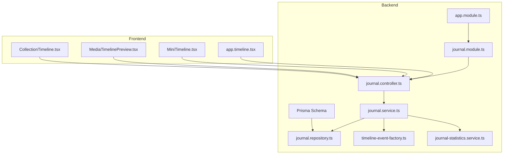
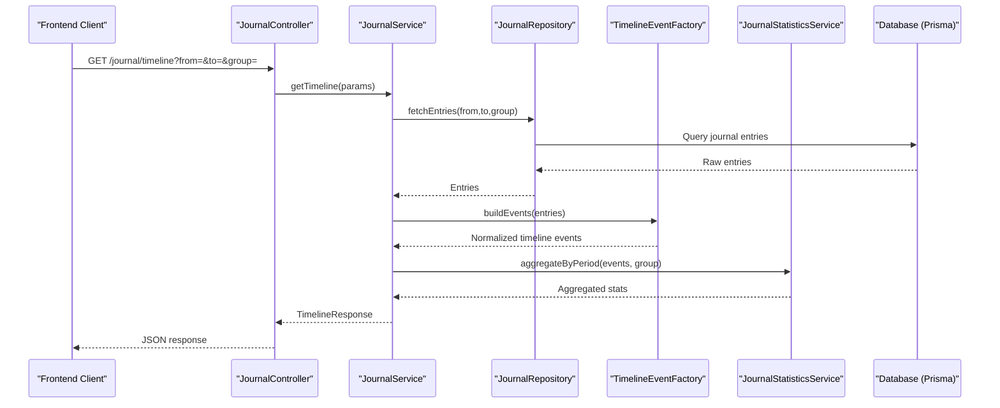
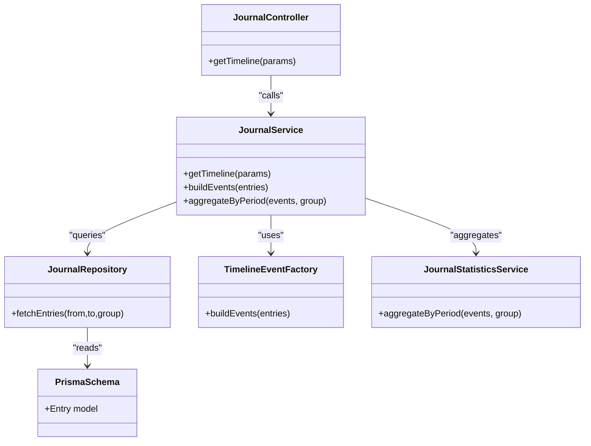

# Timeline Operations API

<cite>
**Referenced Files in This Document**
- [journal.controller.ts](file://apps/backend/src/journal/journal.controller.ts)
- [journal.service.ts](file://apps/backend/src/journal/journal.service.ts)
- [journal.repository.ts](file://apps/backend/src/journal/journal.repository.ts)
- [timeline-event-factory.ts](file://apps/backend/src/journal/timeline-event-factory.ts)
- [journal-statistics.service.ts](file://apps/backend/src/journal/journal-statistics.service.ts)
- [journal.module.ts](file://apps/backend/src/journal/journal.module.ts)
- [app.module.ts](file://apps/backend/src/app.module.ts)
- [schema.prisma](file://apps/backend/prisma/schema.prisma)
- [app.timeline.tsx](file://src/routes/app.timeline.tsx)
- [MiniTimeline.tsx](file://src/components/dashboard/MiniTimeline.tsx)
- [MediaTimelinePreview.tsx](file://src/components/media-detail/MediaTimelinePreview.tsx)
- [CollectionTimeline.tsx](file://src/components/collections/CollectionTimeline.tsx)
</cite>

## Table of Contents
1. [Introduction](#introduction)
2. [Project Structure](#project-structure)
3. [Core Components](#core-components)
4. [Architecture Overview](#architecture-overview)
5. [Detailed Component Analysis](#detailed-component-analysis)
6. [Dependency Analysis](#dependency-analysis)
7. [Performance Considerations](#performance-considerations)
8. [Troubleshooting Guide](#troubleshooting-guide)
9. [Conclusion](#conclusion)
10. [Appendices](#appendices)

## Introduction
This document provides detailed API documentation for timeline generation and chronological organization of journal entries. It covers endpoints for retrieving timeline views, chronological sorting algorithms, event aggregation, temporal filtering options, schemas for timeline events and chronological data structures, time-based queries, statistical aggregations over time periods, examples of timeline construction, custom time range queries, and integration with calendar views. The backend is implemented in NestJS with Prisma ORM, while the frontend integrates timeline components across dashboard, media detail, collections, and dedicated timeline routes.

## Project Structure
The timeline feature spans both backend and frontend:
- Backend NestJS module exposes controllers, services, repositories, and a factory for timeline events.
- Frontend includes route-level integration and reusable timeline components.

**Diagram sources**
- [journal.controller.ts](file://apps/backend/src/journal/journal.controller.ts)
- [journal.service.ts](file://apps/backend/src/journal/journal.service.ts)
- [journal.repository.ts](file://apps/backend/src/journal/journal.repository.ts)
- [timeline-event-factory.ts](file://apps/backend/src/journal/timeline-event-factory.ts)
- [journal-statistics.service.ts](file://apps/backend/src/journal/journal-statistics.service.ts)
- [journal.module.ts](file://apps/backend/src/journal/journal.module.ts)
- [app.module.ts](file://apps/backend/src/app.module.ts)
- [schema.prisma](file://apps/backend/prisma/schema.prisma)
- [app.timeline.tsx](file://src/routes/app.timeline.tsx)
- [MiniTimeline.tsx](file://src/components/dashboard/MiniTimeline.tsx)
- [MediaTimelinePreview.tsx](file://src/components/media-detail/MediaTimelinePreview.tsx)
- [CollectionTimeline.tsx](file://src/components/collections/CollectionTimeline.tsx)

**Section sources**
- [journal.controller.ts](file://apps/backend/src/journal/journal.controller.ts)
- [journal.service.ts](file://apps/backend/src/journal/journal.service.ts)
- [journal.repository.ts](file://apps/backend/src/journal/journal.repository.ts)
- [timeline-event-factory.ts](file://apps/backend/src/journal/timeline-event-factory.ts)
- [journal-statistics.service.ts](file://apps/backend/src/journal/journal-statistics.service.ts)
- [journal.module.ts](file://apps/backend/src/journal/journal.module.ts)
- [app.module.ts](file://apps/backend/src/app.module.ts)
- [schema.prisma](file://apps/backend/prisma/schema.prisma)
- [app.timeline.tsx](file://src/routes/app.timeline.tsx)
- [MiniTimeline.tsx](file://src/components/dashboard/MiniTimeline.tsx)
- [MediaTimelinePreview.tsx](file://src/components/media-detail/MediaTimelinePreview.tsx)
- [CollectionTimeline.tsx](file://src/components/collections/CollectionTimeline.tsx)

## Core Components
- Journal Controller: Exposes REST endpoints for timeline retrieval and related operations.
- Journal Service: Orchestrates business logic for timeline generation, chronological sorting, event aggregation, and temporal filtering.
- Journal Repository: Data access layer using Prisma to query journal entries and related metadata.
- Timeline Event Factory: Constructs normalized timeline events from raw journal data.
- Journal Statistics Service: Computes time-based aggregations (e.g., counts per day/week/month).
- Module Registration: Binds dependencies and registers routes within the NestJS application.
- Frontend Integration: Dedicated route and reusable components consume timeline APIs.

**Section sources**
- [journal.controller.ts](file://apps/backend/src/journal/journal.controller.ts)
- [journal.service.ts](file://apps/backend/src/journal/journal.service.ts)
- [journal.repository.ts](file://apps/backend/src/journal/journal.repository.ts)
- [timeline-event-factory.ts](file://apps/backend/src/journal/timeline-event-factory.ts)
- [journal-statistics.service.ts](file://apps/backend/src/journal/journal-statistics.service.ts)
- [journal.module.ts](file://apps/backend/src/journal/journal.module.ts)
- [app.module.ts](file://apps/backend/src/app.module.ts)

## Architecture Overview
The timeline pipeline transforms journal entries into ordered, aggregated events suitable for UI rendering and analytics.

**Diagram sources**
- [journal.controller.ts](file://apps/backend/src/journal/journal.controller.ts)
- [journal.service.ts](file://apps/backend/src/journal/journal.service.ts)
- [journal.repository.ts](file://apps/backend/src/journal/journal.repository.ts)
- [timeline-event-factory.ts](file://apps/backend/src/journal/timeline-event-factory.ts)
- [journal-statistics.service.ts](file://apps/backend/src/journal/journal-statistics.service.ts)
- [schema.prisma](file://apps/backend/prisma/schema.prisma)

## Detailed Component Analysis

### Journal Controller Endpoints
- Purpose: Define HTTP endpoints for timeline retrieval and optional filters.
- Typical parameters:
  - from: ISO timestamp or date string marking start of range
  - to: ISO timestamp or date string marking end of range
  - group: Time granularity for aggregation (e.g., day, week, month)
  - sort: Chronological order direction (ascending/descending)
  - limit/page: Pagination controls
- Response shape:
  - events: Array of timeline events
  - aggregates: Time-based statistics grouped by period
  - meta: Pagination and filter summary

**Section sources**
- [journal.controller.ts](file://apps/backend/src/journal/journal.controller.ts)

### Journal Service Logic
- Responsibilities:
  - Validate and normalize time range inputs
  - Delegate entry retrieval to repository
  - Build normalized timeline events via factory
  - Compute aggregations via statistics service
  - Apply chronological sorting and pagination
- Sorting algorithm:
  - Primary key: temporal field (e.g., created_at or custom timestamp)
  - Secondary tie-breakers: stable ordering by id or sequence
  - Direction: ascending or descending based on client request
- Filtering:
  - Temporal bounds enforced at repository level
  - Optional filters for tags, categories, or user context

**Section sources**
- [journal.service.ts](file://apps/backend/src/journal/journal.service.ts)

### Journal Repository Queries
- Responsibilities:
  - Efficiently query journal entries within time ranges
  - Support grouping fields for aggregation
  - Return minimal required fields to reduce payload size
- Indexing considerations:
  - Temporal columns should be indexed for range queries
  - Composite indexes for common filter combinations (e.g., user_id + created_at)

**Section sources**
- [journal.repository.ts](file://apps/backend/src/journal/journal.repository.ts)
- [schema.prisma](file://apps/backend/prisma/schema.prisma)

### Timeline Event Factory
- Responsibilities:
  - Normalize raw entries into consistent timeline event schema
  - Enrich events with derived fields (e.g., period bucket, display labels)
  - Ensure deterministic ordering and deduplication where applicable
- Output schema:
  - id: Unique event identifier
  - timestamp: ISO timestamp
  - period_bucket: Grouped period (day/week/month)
  - title: Human-readable label
  - summary: Short description
  - metadata: Additional contextual attributes

**Section sources**
- [timeline-event-factory.ts](file://apps/backend/src/journal/timeline-event-factory.ts)

### Journal Statistics Service
- Responsibilities:
  - Aggregate events by time period
  - Compute counts, averages, and other metrics per bucket
  - Provide summaries for dashboards and charts
- Supported aggregations:
  - Count per period
  - Average duration or length if applicable
  - Cumulative totals over time

**Section sources**
- [journal-statistics.service.ts](file://apps/backend/src/journal/journal-statistics.service.ts)

### Module Registration and Routing
- Responsibilities:
  - Register controller routes under /journal
  - Wire up service and repository dependencies
  - Enable feature flags or environment-specific behavior

**Section sources**
- [journal.module.ts](file://apps/backend/src/journal/journal.module.ts)
- [app.module.ts](file://apps/backend/src/app.module.ts)

### Frontend Integration
- Routes:
  - app.timeline.tsx: Dedicated timeline page consuming API
- Components:
  - MiniTimeline.tsx: Compact timeline view for dashboard
  - MediaTimelinePreview.tsx: Timeline preview within media detail
  - CollectionTimeline.tsx: Timeline view for collections
- Usage patterns:
  - Fetch timeline with time range and grouping
  - Render events chronologically
  - Integrate with calendar views by mapping period buckets to dates

**Section sources**
- [app.timeline.tsx](file://src/routes/app.timeline.tsx)
- [MiniTimeline.tsx](file://src/components/dashboard/MiniTimeline.tsx)
- [MediaTimelinePreview.tsx](file://src/components/media-detail/MediaTimelinePreview.tsx)
- [CollectionTimeline.tsx](file://src/components/collections/CollectionTimeline.tsx)

## Dependency Analysis
The timeline feature exhibits clear separation of concerns:
- Controller depends on Service
- Service depends on Repository, Factory, and Statistics
- Repository depends on Prisma schema
- Frontend components depend on Controller endpoints

**Diagram sources**
- [journal.controller.ts](file://apps/backend/src/journal/journal.controller.ts)
- [journal.service.ts](file://apps/backend/src/journal/journal.service.ts)
- [journal.repository.ts](file://apps/backend/src/journal/journal.repository.ts)
- [timeline-event-factory.ts](file://apps/backend/src/journal/timeline-event-factory.ts)
- [journal-statistics.service.ts](file://apps/backend/src/journal/journal-statistics.service.ts)
- [schema.prisma](file://apps/backend/prisma/schema.prisma)

**Section sources**
- [journal.controller.ts](file://apps/backend/src/journal/journal.controller.ts)
- [journal.service.ts](file://apps/backend/src/journal/journal.service.ts)
- [journal.repository.ts](file://apps/backend/src/journal/journal.repository.ts)
- [timeline-event-factory.ts](file://apps/backend/src/journal/timeline-event-factory.ts)
- [journal-statistics.service.ts](file://apps/backend/src/journal/journal-statistics.service.ts)
- [schema.prisma](file://apps/backend/prisma/schema.prisma)

## Performance Considerations
- Database indexing:
  - Ensure temporal columns are indexed for efficient range queries
  - Use composite indexes for frequent filter combinations
- Pagination:
  - Implement cursor-based or offset-based pagination to handle large timelines
- Aggregation efficiency:
  - Prefer server-side grouping to minimize payload size
  - Cache frequently accessed aggregations when appropriate
- Payload optimization:
  - Select only necessary fields in repository queries
  - Defer heavy metadata loading until needed

[No sources needed since this section provides general guidance]

## Troubleshooting Guide
Common issues and resolutions:
- Invalid time ranges:
  - Validate from/to inputs; return clear error messages
- Missing indexes:
  - Monitor slow queries and add appropriate indexes
- Large payloads:
  - Enforce pagination and field selection
- Inconsistent ordering:
  - Ensure stable secondary keys for deterministic sorting

**Section sources**
- [journal.controller.ts](file://apps/backend/src/journal/journal.controller.ts)
- [journal.service.ts](file://apps/backend/src/journal/journal.service.ts)
- [journal.repository.ts](file://apps/backend/src/journal/journal.repository.ts)

## Conclusion
The Timeline Operations API provides a robust foundation for generating, sorting, aggregating, and filtering journal entries over time. By separating concerns across controller, service, repository, factory, and statistics layers, the system remains maintainable and scalable. Frontend components integrate seamlessly to deliver rich timeline experiences across dashboards, media details, and collections.

[No sources needed since this section summarizes without analyzing specific files]

## Appendices

### API Endpoint Reference
- GET /journal/timeline
  - Query parameters:
    - from: Start of time range (ISO timestamp or date)
    - to: End of time range (ISO timestamp or date)
    - group: Aggregation granularity (day, week, month)
    - sort: Order direction (asc, desc)
    - limit: Max number of events
    - page: Page number
  - Response:
    - events: Array of timeline events
    - aggregates: Time-based statistics
    - meta: Pagination and filter summary

**Section sources**
- [journal.controller.ts](file://apps/backend/src/journal/journal.controller.ts)

### Timeline Event Schema
- Fields:
  - id: string (unique)
  - timestamp: string (ISO 8601)
  - period_bucket: string (grouped period)
  - title: string
  - summary: string
  - metadata: object (contextual attributes)

**Section sources**
- [timeline-event-factory.ts](file://apps/backend/src/journal/timeline-event-factory.ts)

### Chronological Data Structures
- Entry model (Prisma):
  - id: unique identifier
  - created_at: timestamp
  - updated_at: timestamp
  - content: text or structured fields
  - user_id: foreign key
  - tags/categories: relational or embedded fields

**Section sources**
- [schema.prisma](file://apps/backend/prisma/schema.prisma)

### Time-Based Queries
- Range filters:
  - from <= created_at <= to
- Grouping:
  - Day: truncate to date
  - Week: ISO week number
  - Month: year-month
- Sorting:
  - Primary: created_at
  - Secondary: id for stability

**Section sources**
- [journal.repository.ts](file://apps/backend/src/journal/journal.repository.ts)
- [journal.service.ts](file://apps/backend/src/journal/journal.service.ts)

### Statistical Aggregations Over Time Periods
- Metrics:
  - Count per period
  - Average duration (if applicable)
  - Cumulative totals
- Output:
  - Buckets with computed metrics

**Section sources**
- [journal-statistics.service.ts](file://apps/backend/src/journal/journal-statistics.service.ts)

### Examples

#### Timeline Construction Example
- Request:
  - GET /journal/timeline?from=2024-01-01&to=2024-01-31&group=day&sort=desc&limit=50
- Response:
  - events: Daily timeline events for January 2024
  - aggregates: Daily counts and metrics
  - meta: Pagination info

**Section sources**
- [journal.controller.ts](file://apps/backend/src/journal/journal.controller.ts)

#### Custom Time Range Query Example
- Request:
  - GET /journal/timeline?from=2024-06-01T00:00:00Z&to=2024-06-30T23:59:59Z&group=week&sort=asc
- Response:
  - events: Weekly timeline events for June 2024
  - aggregates: Weekly metrics
  - meta: Pagination info

**Section sources**
- [journal.controller.ts](file://apps/backend/src/journal/journal.controller.ts)

#### Integration with Calendar Views
- Mapping:
  - period_bucket -> calendar date
  - events -> markers on calendar days
- Rendering:
  - MiniTimeline.tsx for compact views
  - CollectionTimeline.tsx for collection-specific timelines
  - MediaTimelinePreview.tsx for media-related timelines

**Section sources**
- [MiniTimeline.tsx](file://src/components/dashboard/MiniTimeline.tsx)
- [CollectionTimeline.tsx](file://src/components/collections/CollectionTimeline.tsx)
- [MediaTimelinePreview.tsx](file://src/components/media-detail/MediaTimelinePreview.tsx)