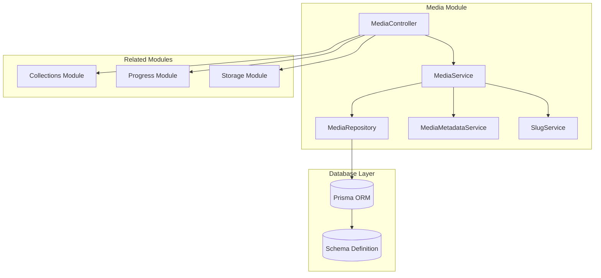
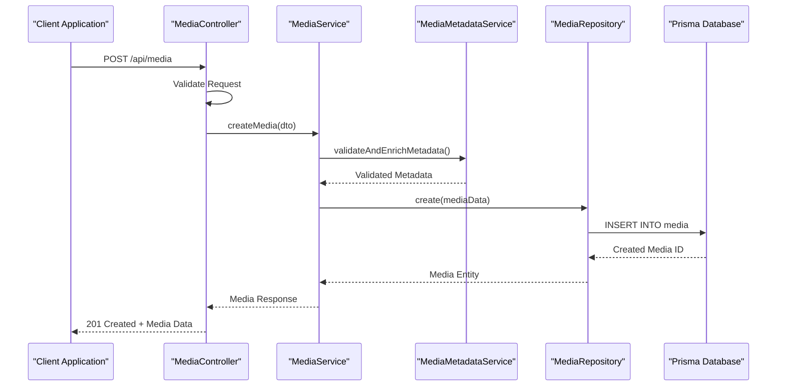
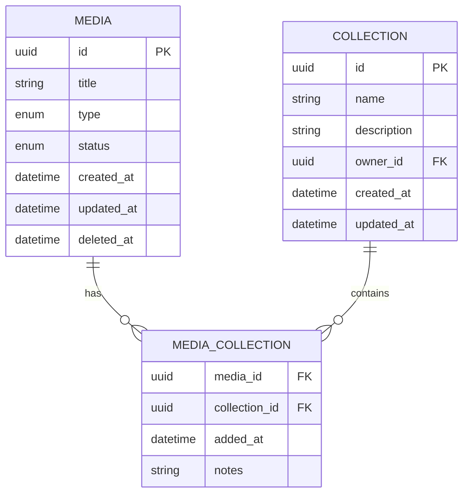
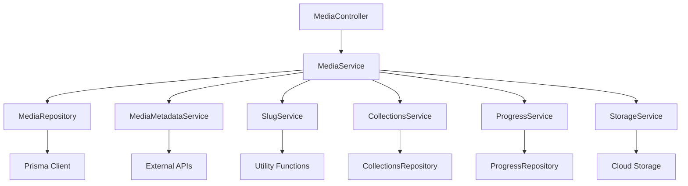

# Media CRUD Operations

<cite>
**Referenced Files in This Document**
- [media.controller.ts](file://apps/backend/src/media/media.controller.ts)
- [media.service.ts](file://apps/backend/src/media/media.service.ts)
- [media.repository.ts](file://apps/backend/src/media/media.repository.ts)
- [media-metadata.service.ts](file://apps/backend/src/media/media-metadata.service.ts)
- [slug.service.ts](file://apps/backend/src/media/slug.service.ts)
- [schema.prisma](file://apps/backend/prisma/schema.prisma)
- [collections.controller.ts](file://apps/backend/src/collections/collections.controller.ts)
- [progress.controller.ts](file://apps/backend/src/progress/progress.controller.ts)
</cite>

## Table of Contents
1. [Introduction](#introduction)
2. [Project Structure](#project-structure)
3. [Core Components](#core-components)
4. [Architecture Overview](#architecture-overview)
5. [Detailed Component Analysis](#detailed-component-analysis)
6. [Dependency Analysis](#dependency-analysis)
7. [Performance Considerations](#performance-considerations)
8. [Troubleshooting Guide](#troubleshooting-guide)
9. [Conclusion](#conclusion)
10. [Appendices](#appendices)

## Introduction
This document provides comprehensive API documentation for media CRUD operations covering all HTTP endpoints for creating, reading, updating, and deleting media items. It includes detailed specifications for media item creation with metadata validation, bulk operations for multiple media items, batch updates, and soft delete functionality. The documentation covers movies, TV shows, books, and other media types with examples of media data models, field validations, error responses, and status codes. It also documents relationship management between media items and collections, progress tracking integration, and bookmarking functionality.

## Project Structure
The media module follows a clean architecture pattern with clear separation of concerns:



**Diagram sources**
- [media.controller.ts](file://apps/backend/src/media/media.controller.ts)
- [media.service.ts](file://apps/backend/src/media/media.service.ts)
- [media.repository.ts](file://apps/backend/src/media/media.repository.ts)
- [schema.prisma](file://apps/backend/prisma/schema.prisma)

**Section sources**
- [media.controller.ts](file://apps/backend/src/media/media.controller.ts)
- [media.service.ts](file://apps/backend/src/media/media.service.ts)
- [media.repository.ts](file://apps/backend/src/media/media.repository.ts)

## Core Components

### Media Controller
The MediaController handles all HTTP requests for media operations including CRUD endpoints, bulk operations, and relationship management.

### Media Service
The MediaService contains the business logic for media operations, including validation, metadata processing, and coordination with other services.

### Media Repository
The MediaRepository manages database operations using Prisma ORM for efficient data persistence and retrieval.

### Media Metadata Service
The MediaMetadataService handles metadata extraction, validation, and enrichment for different media types.

### Slug Service
The SlugService generates URL-friendly slugs for media items to ensure consistent URL structures.

**Section sources**
- [media.controller.ts](file://apps/backend/src/media/media.controller.ts)
- [media.service.ts](file://apps/backend/src/media/media.service.ts)
- [media.repository.ts](file://apps/backend/src/media/media.repository.ts)
- [media-metadata.service.ts](file://apps/backend/src/media/media-metadata.service.ts)
- [slug.service.ts](file://apps/backend/src/media/slug.service.ts)

## Architecture Overview

The media system follows a layered architecture pattern with clear separation between presentation, business logic, and data access layers:



**Diagram sources**
- [media.controller.ts](file://apps/backend/src/media/media.controller.ts)
- [media.service.ts](file://apps/backend/src/media/media.service.ts)
- [media.repository.ts](file://apps/backend/src/media/media.repository.ts)

## Detailed Component Analysis

### HTTP Endpoints

#### Create Media Operations

##### Single Media Creation
- **Endpoint**: `POST /api/media`
- **Request Body**: Media creation DTO with required fields
- **Response**: Created media object with 201 status code
- **Validation**: Comprehensive field validation with custom validators

##### Bulk Media Creation
- **Endpoint**: `POST /api/media/bulk`
- **Request Body**: Array of media creation DTOs
- **Response**: Batch operation results with individual success/failure status
- **Features**: Transactional operations, partial failure handling

#### Read Media Operations

##### Get Media by ID
- **Endpoint**: `GET /api/media/:id`
- **Path Parameters**: Media ID
- **Response**: Complete media object with relationships
- **Status Codes**: 200 (Success), 404 (Not Found)

##### Search and Filter Media
- **Endpoint**: `GET /api/media`
- **Query Parameters**: Type, status, collection, search terms, pagination
- **Response**: Paginated list of media items
- **Features**: Advanced filtering, sorting, and full-text search

##### Get Media by Slug
- **Endpoint**: `GET /api/media/slug/:slug`
- **Path Parameters**: URL-friendly slug
- **Response**: Media object with resolved ID from slug

#### Update Media Operations

##### Partial Update
- **Endpoint**: `PATCH /api/media/:id`
- **Request Body**: Partial media DTO with only updated fields
- **Response**: Updated media object
- **Features**: Field-level validation, automatic timestamp updates

##### Full Update
- **Endpoint**: `PUT /api/media/:id`
- **Request Body**: Complete media DTO
- **Response**: Fully updated media object
- **Validation**: Complete schema validation

##### Batch Updates
- **Endpoint**: `PATCH /api/media/batch`
- **Request Body**: Array of update operations
- **Response**: Batch operation results
- **Features**: Conditional updates, transactional operations

#### Delete Media Operations

##### Soft Delete
- **Endpoint**: `DELETE /api/media/:id`
- **Behavior**: Marks media as deleted without removing from database
- **Response**: Deleted media object with deletion timestamp
- **Recovery**: Soft-deleted items can be restored

##### Hard Delete
- **Endpoint**: `DELETE /api/media/:id?permanent=true`
- **Behavior**: Permanently removes media from database
- **Response**: Confirmation of permanent deletion
- **Warning**: Irreversible operation

### Media Data Models

#### Base Media Model
All media types inherit from a base model with common fields:

| Field | Type | Required | Description | Validation Rules |
|-------|------|----------|-------------|------------------|
| id | UUID | Yes | Unique identifier | Auto-generated UUID |
| title | String | Yes | Media title | Min 1 char, Max 500 chars |
| description | String | No | Media description | Max 10000 chars |
| type | Enum | Yes | Media type | movie, tv_show, book, podcast, game |
| status | Enum | Yes | Current status | planning, watching, completed, dropped |
| createdAt | DateTime | Yes | Creation timestamp | Auto-set |
| updatedAt | DateTime | Yes | Last update timestamp | Auto-updated |
| deletedAt | DateTime | No | Soft delete timestamp | Nullable |

#### Movie-Specific Fields
| Field | Type | Required | Description | Validation Rules |
|-------|------|----------|-------------|------------------|
| duration | Integer | No | Duration in minutes | Positive integer |
| releaseYear | Integer | No | Release year | 1900-2099 |
| rating | Float | No | Content rating | 0.0-10.0 |
| genres | Array | No | Genre tags | Max 10 genres |
| director | String | No | Director name | Max 200 chars |
| cast | Array | No | Main cast members | Max 50 members |

#### TV Show-Specific Fields
| Field | Type | Required | Description | Validation Rules |
|-------|------|----------|-------------|------------------|
| seasons | Integer | No | Total number of seasons | Positive integer |
| episodes | Integer | No | Total episode count | Positive integer |
| network | String | No | Broadcasting network | Max 100 chars |
| currentSeason | Integer | No | Currently watching season | Positive integer |
| currentEpisode | Integer | No | Currently watching episode | Positive integer |

#### Book-Specific Fields
| Field | Type | Required | Description | Validation Rules |
|-------|------|----------|-------------|------------------|
| author | String | Yes | Book author | Max 200 chars |
| isbn | String | No | ISBN number | Valid ISBN format |
| pages | Integer | No | Total page count | Positive integer |
| publisher | String | No | Publishing house | Max 200 chars |
| genre | String | No | Book genre | Max 100 chars |

### Relationship Management

#### Collection Relationships
Media items can be organized into collections through many-to-many relationships:



**Diagram sources**
- [schema.prisma](file://apps/backend/prisma/schema.prisma)

#### Progress Tracking Integration
Media items integrate with the progress tracking system:

| Endpoint | Method | Description | Request Body | Response |
|----------|--------|-------------|--------------|----------|
| `/api/media/:id/progress` | GET | Get progress for media | None | Progress object |
| `/api/media/:id/progress` | PUT | Update progress | Progress DTO | Updated progress |
| `/api/media/:id/progress/history` | GET | Get progress history | Query params | History array |

#### Bookmarking Functionality
Users can bookmark specific media items:

| Feature | Endpoint | Method | Description |
|---------|----------|--------|-------------|
| Add Bookmark | `/api/media/:id/bookmark` | POST | Bookmark media item |
| Remove Bookmark | `/api/media/:id/bookmark` | DELETE | Remove bookmark |
| Get Bookmarks | `/api/media/bookmarks` | GET | List user bookmarks |
| Toggle Bookmark | `/api/media/:id/bookmark/toggle` | PATCH | Toggle bookmark state |

### Validation Rules

#### Input Validation
All media creation and update operations include comprehensive validation:

- **Title Validation**: Minimum 1 character, maximum 500 characters
- **Type Validation**: Must be one of predefined media types
- **Status Validation**: Must be one of allowed status values
- **Date Validation**: Proper date formats and logical constraints
- **Custom Validators**: Business-specific validation rules

#### Error Responses
Standardized error response format:

```json
{
  "statusCode": 422,
  "message": "Validation failed",
  "errors": [
    {
      "field": "title",
      "message": "Title is required",
      "code": "VALIDATION_ERROR"
    }
  ],
  "timestamp": "2024-01-01T00:00:00Z",
  "requestId": "req_123456"
}
```

### Status Codes

| Status Code | Description | Usage |
|-------------|-------------|-------|
| 200 | OK | Successful GET, PATCH, PUT operations |
| 201 | Created | Successful POST operations |
| 204 | No Content | Successful DELETE operations |
| 400 | Bad Request | Invalid request payload |
| 401 | Unauthorized | Missing or invalid authentication |
| 403 | Forbidden | Insufficient permissions |
| 404 | Not Found | Resource not found |
| 409 | Conflict | Duplicate resource or constraint violation |
| 422 | Unprocessable Entity | Validation errors |
| 500 | Internal Server Error | Unexpected server errors |

## Dependency Analysis

The media module has well-defined dependencies on other system components:



**Diagram sources**
- [media.controller.ts](file://apps/backend/src/media/media.controller.ts)
- [media.service.ts](file://apps/backend/src/media/media.service.ts)
- [collections.controller.ts](file://apps/backend/src/collections/collections.controller.ts)
- [progress.controller.ts](file://apps/backend/src/progress/progress.controller.ts)

**Section sources**
- [media.service.ts](file://apps/backend/src/media/media.service.ts)
- [collections.controller.ts](file://apps/backend/src/collections/collections.controller.ts)
- [progress.controller.ts](file://apps/backend/src/progress/progress.controller.ts)

## Performance Considerations

### Database Optimization
- **Indexing**: Strategic indexing on frequently queried fields (title, type, status)
- **Query Optimization**: Efficient Prisma queries with selective field loading
- **Connection Pooling**: Optimized database connection management
- **Caching**: Redis caching for frequently accessed media data

### API Performance
- **Pagination**: Default pagination with configurable page sizes
- **Filtering**: Efficient server-side filtering and sorting
- **Batch Operations**: Support for bulk operations to reduce network overhead
- **Compression**: Gzip compression for large responses

### Memory Management
- **Stream Processing**: Stream processing for large file uploads
- **Garbage Collection**: Proper cleanup of temporary objects
- **Memory Limits**: Configurable memory limits for large operations

## Troubleshooting Guide

### Common Issues and Solutions

#### Validation Errors
- **Issue**: Validation fails during media creation
- **Solution**: Check field requirements and validation rules
- **Debug**: Enable detailed validation error logging

#### Database Connection Issues
- **Issue**: Database connection timeouts
- **Solution**: Verify database connectivity and credentials
- **Debug**: Check connection pool settings and retry policies

#### Performance Problems
- **Issue**: Slow API responses
- **Solution**: Optimize database queries and add appropriate indexes
- **Debug**: Use performance monitoring tools to identify bottlenecks

#### Relationship Management Issues
- **Issue**: Collection relationships not updating correctly
- **Solution**: Verify foreign key constraints and cascade settings
- **Debug**: Check database integrity and transaction logs

### Error Monitoring
- **Logging**: Structured logging with correlation IDs
- **Metrics**: Key performance indicators and error rates
- **Alerting**: Automated alerts for critical failures
- **Tracing**: Distributed tracing for complex operations

**Section sources**
- [media.controller.ts](file://apps/backend/src/media/media.controller.ts)
- [media.service.ts](file://apps/backend/src/media/media.service.ts)

## Conclusion

The media CRUD operations provide a comprehensive and robust API for managing various types of media content. The system supports all essential operations including single and bulk operations, advanced filtering and searching, relationship management with collections, progress tracking, and bookmarking functionality. The architecture ensures scalability, maintainability, and excellent performance through proper separation of concerns, efficient database operations, and comprehensive validation.

The implementation follows best practices for RESTful API design, error handling, and security considerations. The modular architecture allows for easy extension and maintenance while providing a solid foundation for future enhancements and additional media types.

## Appendices

### API Versioning Strategy
The API follows semantic versioning with backward compatibility maintained within major versions. Breaking changes are introduced through new endpoint versions.

### Security Considerations
- **Authentication**: JWT-based authentication for all protected endpoints
- **Authorization**: Role-based access control for media operations
- **Input Sanitization**: Comprehensive input validation and sanitization
- **Rate Limiting**: API rate limiting to prevent abuse
- **CORS**: Configurable CORS policies for cross-origin requests

### Testing Strategy
- **Unit Tests**: Comprehensive unit tests for all business logic
- **Integration Tests**: Integration tests for API endpoints and database operations
- **E2E Tests**: End-to-end tests for critical user workflows
- **Load Tests**: Performance testing under various load conditions