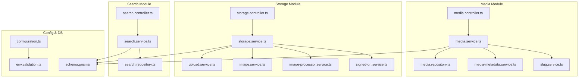
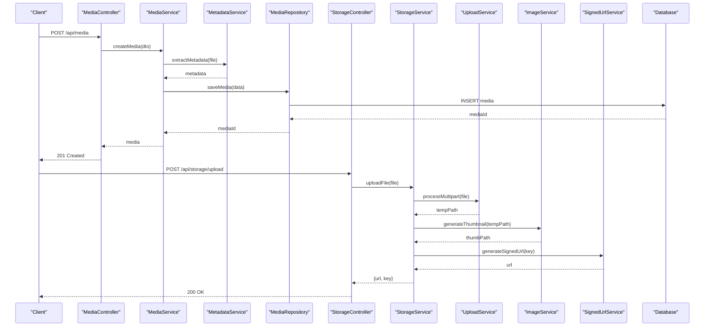
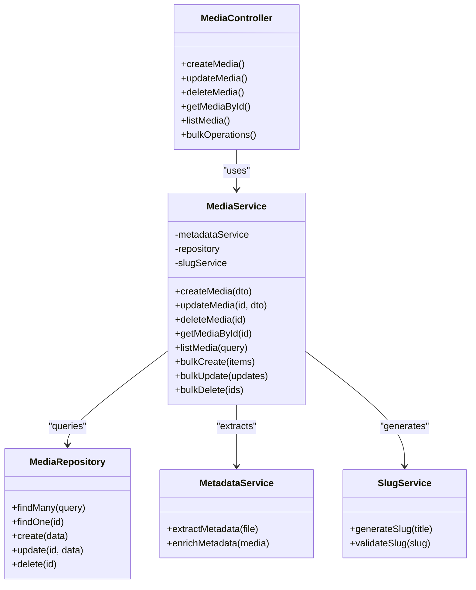
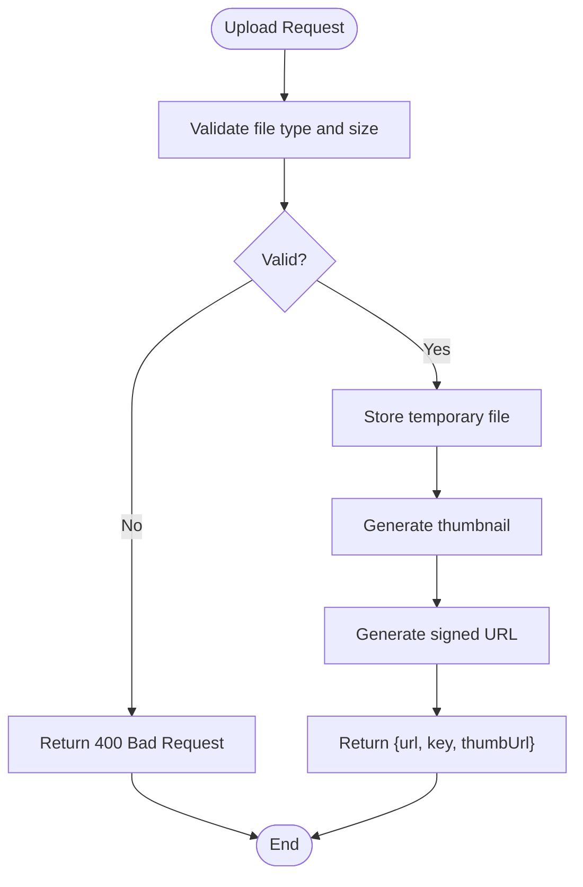
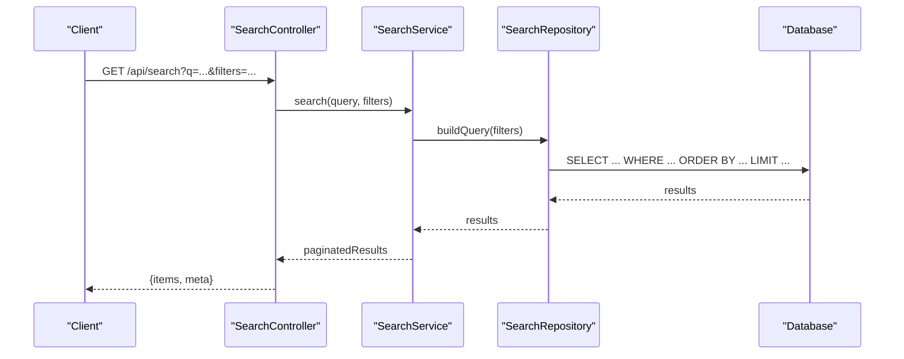
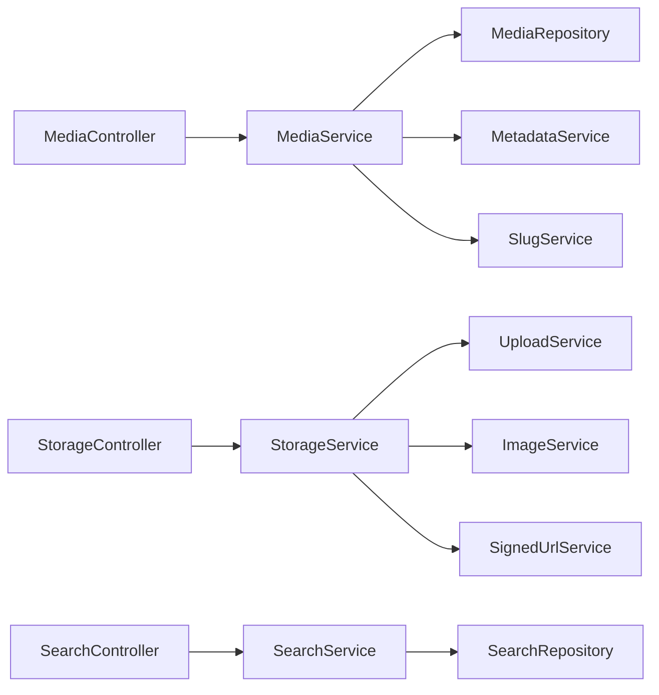

# Media Management API

<cite>
**Referenced Files in This Document**
- [media.controller.ts](file://apps/backend/src/media/media.controller.ts)
- [media.service.ts](file://apps/backend/src/media/media.service.ts)
- [media.repository.ts](file://apps/backend/src/media/media.repository.ts)
- [media-metadata.service.ts](file://apps/backend/src/media/media-metadata.service.ts)
- [slug.service.ts](file://apps/backend/src/media/slug.service.ts)
- [storage.controller.ts](file://apps/backend/src/storage/storage.controller.ts)
- [storage.service.ts](file://apps/backend/src/storage/storage.service.ts)
- [upload.service.ts](file://apps/backend/src/storage/upload.service.ts)
- [image.service.ts](file://apps/backend/src/storage/image.service.ts)
- [image-processor.service.ts](file://apps/backend/src/storage/image-processor.service.ts)
- [signed-url.service.ts](file://apps/backend/src/storage/signed-url.service.ts)
- [search.controller.ts](file://apps/backend/src/search/search.controller.ts)
- [search.service.ts](file://apps/backend/src/search/search.service.ts)
- [search.repository.ts](file://apps/backend/src/search/search.repository.ts)
- [schema.prisma](file://apps/backend/prisma/schema.prisma)
- [configuration.ts](file://apps/backend/src/config/configuration.ts)
- [env.validation.ts](file://apps/backend/src/config/env.validation.ts)
</cite>

## Table of Contents
1. [Introduction](#introduction)
2. [Project Structure](#project-structure)
3. [Core Components](#core-components)
4. [Architecture Overview](#architecture-overview)
5. [Detailed Component Analysis](#detailed-component-analysis)
6. [Dependency Analysis](#dependency-analysis)
7. [Performance Considerations](#performance-considerations)
8. [Troubleshooting Guide](#troubleshooting-guide)
9. [Conclusion](#conclusion)
10. [Appendices](#appendices)

## Introduction
This document provides comprehensive API documentation for media management endpoints covering CRUD operations for movies, TV shows, books, and other media content. It includes specifications for file upload/download, metadata extraction, image processing, search functionality, pagination patterns, and performance optimization techniques. The backend is implemented with a modular NestJS architecture using Prisma for data persistence, Redis for caching, and a storage subsystem that supports local or cloud-backed object storage with signed URLs and CDN integration.

## Project Structure
The media management feature spans multiple modules:
- Media module: controllers, services, repositories, DTOs, and slug generation
- Storage module: upload handling, signed URL generation, image processing, and cleanup
- Search module: search controller, service, repository, and statistics
- Configuration: environment validation and configuration loading
- Data model: Prisma schema defining media entities and relationships

**Diagram sources**
- [media.controller.ts](file://apps/backend/src/media/media.controller.ts)
- [media.service.ts](file://apps/backend/src/media/media.service.ts)
- [media.repository.ts](file://apps/backend/src/media/media.repository.ts)
- [media-metadata.service.ts](file://apps/backend/src/media/media-metadata.service.ts)
- [slug.service.ts](file://apps/backend/src/media/slug.service.ts)
- [storage.controller.ts](file://apps/backend/src/storage/storage.controller.ts)
- [storage.service.ts](file://apps/backend/src/storage/storage.service.ts)
- [upload.service.ts](file://apps/backend/src/storage/upload.service.ts)
- [image.service.ts](file://apps/backend/src/storage/image.service.ts)
- [image-processor.service.ts](file://apps/backend/src/storage/image-processor.service.ts)
- [signed-url.service.ts](file://apps/backend/src/storage/signed-url.service.ts)
- [search.controller.ts](file://apps/backend/src/search/search.controller.ts)
- [search.service.ts](file://apps/backend/src/search/search.service.ts)
- [search.repository.ts](file://apps/backend/src/search/search.repository.ts)
- [configuration.ts](file://apps/backend/src/config/configuration.ts)
- [env.validation.ts](file://apps/backend/src/config/env.validation.ts)
- [schema.prisma](file://apps/backend/prisma/schema.prisma)

**Section sources**
- [media.controller.ts](file://apps/backend/src/media/media.controller.ts)
- [storage.controller.ts](file://apps/backend/src/storage/storage.controller.ts)
- [search.controller.ts](file://apps/backend/src/search/search.controller.ts)
- [schema.prisma](file://apps/backend/prisma/schema.prisma)

## Core Components
- Media Controller: Exposes REST endpoints for media CRUD, bulk operations, and metadata retrieval.
- Media Service: Orchestrates business logic, interacts with repository and metadata service, handles slugs and validations.
- Media Repository: Encapsulates database queries via Prisma for media entities.
- Metadata Service: Extracts and enriches metadata from uploaded files (e.g., duration, dimensions, tags).
- Slug Service: Generates URL-friendly identifiers for media items.
- Storage Controller: Handles file uploads, downloads, and signed URL requests.
- Storage Service: Coordinates upload, download, and storage operations; integrates with upload and image services.
- Upload Service: Validates and processes multipart uploads, manages temporary storage and naming.
- Image Service: Performs image transformations, thumbnail generation, and format conversions.
- Image Processor Service: Applies advanced processing (resize, crop, optimize) asynchronously or synchronously.
- Signed URL Service: Generates time-bound access URLs for secure file retrieval and CDN delivery.
- Search Controller: Provides search endpoints across media types with filtering and suggestions.
- Search Service: Implements query building, ranking, and aggregation.
- Search Repository: Executes optimized queries against the database or search index.

**Section sources**
- [media.controller.ts](file://apps/backend/src/media/media.controller.ts)
- [media.service.ts](file://apps/backend/src/media/media.service.ts)
- [media.repository.ts](file://apps/backend/src/media/media.repository.ts)
- [media-metadata.service.ts](file://apps/backend/src/media/media-metadata.service.ts)
- [slug.service.ts](file://apps/backend/src/media/slug.service.ts)
- [storage.controller.ts](file://apps/backend/src/storage/storage.controller.ts)
- [storage.service.ts](file://apps/backend/src/storage/storage.service.ts)
- [upload.service.ts](file://apps/backend/src/storage/upload.service.ts)
- [image.service.ts](file://apps/backend/src/storage/image.service.ts)
- [image-processor.service.ts](file://apps/backend/src/storage/image-processor.service.ts)
- [signed-url.service.ts](file://apps/backend/src/storage/signed-url.service.ts)
- [search.controller.ts](file://apps/backend/src/search/search.controller.ts)
- [search.service.ts](file://apps/backend/src/search/search.service.ts)
- [search.repository.ts](file://apps/backend/src/search/search.repository.ts)

## Architecture Overview
The system follows a layered architecture:
- Controllers handle HTTP requests and responses
- Services implement business logic and orchestrate domain operations
- Repositories abstract data access through Prisma
- Storage subsystem manages file I/O, transformations, and CDN integration
- Search subsystem provides full-text and faceted search capabilities

**Diagram sources**
- [media.controller.ts](file://apps/backend/src/media/media.controller.ts)
- [media.service.ts](file://apps/backend/src/media/media.service.ts)
- [media-metadata.service.ts](file://apps/backend/src/media/media-metadata.service.ts)
- [media.repository.ts](file://apps/backend/src/media/media.repository.ts)
- [storage.controller.ts](file://apps/backend/src/storage/storage.controller.ts)
- [storage.service.ts](file://apps/backend/src/storage/storage.service.ts)
- [upload.service.ts](file://apps/backend/src/storage/upload.service.ts)
- [image.service.ts](file://apps/backend/src/storage/image.service.ts)
- [signed-url.service.ts](file://apps/backend/src/storage/signed-url.service.ts)
- [schema.prisma](file://apps/backend/prisma/schema.prisma)

## Detailed Component Analysis

### Media Endpoints
- Create media item: Accepts structured metadata and optional file reference; validates inputs, extracts metadata, persists entity, returns created resource.
- Update media item: Supports partial updates, re-extraction of metadata if file changes, slug regeneration if title changes.
- Delete media item: Soft delete or cascade depending on policy; ensures referential integrity.
- Bulk operations: Batch create/update/delete with idempotency keys to prevent duplicates.
- Metadata retrieval: Fetch enriched metadata including extracted fields and computed properties.

Request/response examples are defined by DTOs in the media module. Pagination is supported for list endpoints with cursor or offset-based strategies.

**Section sources**
- [media.controller.ts](file://apps/backend/src/media/media.controller.ts)
- [media.service.ts](file://apps/backend/src/media/media.service.ts)
- [media.repository.ts](file://apps/backend/src/media/media.repository.ts)
- [media-metadata.service.ts](file://apps/backend/src/media/media-metadata.service.ts)
- [slug.service.ts](file://apps/backend/src/media/slug.service.ts)

#### Media Class Diagram

**Diagram sources**
- [media.controller.ts](file://apps/backend/src/media/media.controller.ts)
- [media.service.ts](file://apps/backend/src/media/media.service.ts)
- [media.repository.ts](file://apps/backend/src/media/media.repository.ts)
- [media-metadata.service.ts](file://apps/backend/src/media/media-metadata.service.ts)
- [slug.service.ts](file://apps/backend/src/media/slug.service.ts)

### File Upload and Download
- Upload endpoint: Accepts multipart/form-data, validates file type and size, stores temporarily, generates thumbnails, and returns a signed URL for permanent storage or direct CDN access.
- Download endpoint: Returns file streams or signed URLs based on client capability and security policies.
- Signed URLs: Time-bound tokens for secure access without exposing storage credentials.

**Diagram sources**
- [storage.controller.ts](file://apps/backend/src/storage/storage.controller.ts)
- [storage.service.ts](file://apps/backend/src/storage/storage.service.ts)
- [upload.service.ts](file://apps/backend/src/storage/upload.service.ts)
- [image.service.ts](file://apps/backend/src/storage/image.service.ts)
- [signed-url.service.ts](file://apps/backend/src/storage/signed-url.service.ts)

**Section sources**
- [storage.controller.ts](file://apps/backend/src/storage/storage.controller.ts)
- [storage.service.ts](file://apps/backend/src/storage/storage.service.ts)
- [upload.service.ts](file://apps/backend/src/storage/upload.service.ts)
- [image.service.ts](file://apps/backend/src/storage/image.service.ts)
- [signed-url.service.ts](file://apps/backend/src/storage/signed-url.service.ts)

### Metadata Extraction
- Extracts technical metadata (duration, resolution, codec) and descriptive metadata (title, author, genre) from uploaded files.
- Enriches media records with computed fields and normalized values.
- Supports batch extraction for large libraries.

**Section sources**
- [media-metadata.service.ts](file://apps/backend/src/media/media-metadata.service.ts)

### Image Processing and Thumbnails
- Resizes, crops, and optimizes images for thumbnails and previews.
- Supports multiple output formats (WebP, JPEG, PNG) based on client preferences.
- Caches processed images to reduce repeated computation.

**Section sources**
- [image.service.ts](file://apps/backend/src/storage/image.service.ts)
- [image-processor.service.ts](file://apps/backend/src/storage/image-processor.service.ts)

### Search and Filtering
- Full-text search across titles, descriptions, and tags.
- Faceted filtering by type (movie, TV show, book), status, date ranges, and custom attributes.
- Suggestions and autocomplete powered by indexed fields.
- Pagination with stable cursors for efficient navigation.

**Diagram sources**
- [search.controller.ts](file://apps/backend/src/search/search.controller.ts)
- [search.service.ts](file://apps/backend/src/search/search.service.ts)
- [search.repository.ts](file://apps/backend/src/search/search.repository.ts)
- [schema.prisma](file://apps/backend/prisma/schema.prisma)

**Section sources**
- [search.controller.ts](file://apps/backend/src/search/search.controller.ts)
- [search.service.ts](file://apps/backend/src/search/search.service.ts)
- [search.repository.ts](file://apps/backend/src/search/search.repository.ts)

### Data Models and Schema
The Prisma schema defines core entities such as media items, collections, users, and relationships. Key fields include identifiers, titles, descriptions, types, statuses, timestamps, and references to storage keys. Indexes and constraints ensure performance and integrity.

**Section sources**
- [schema.prisma](file://apps/backend/prisma/schema.prisma)

## Dependency Analysis
The media management system has clear dependencies:
- Controllers depend on services for business logic
- Services depend on repositories for data access and specialized services for metadata and slug generation
- Storage subsystem depends on upload, image processing, and signed URL services
- Search subsystem depends on repository and database indexes

**Diagram sources**
- [media.controller.ts](file://apps/backend/src/media/media.controller.ts)
- [media.service.ts](file://apps/backend/src/media/media.service.ts)
- [media.repository.ts](file://apps/backend/src/media/media.repository.ts)
- [media-metadata.service.ts](file://apps/backend/src/media/media-metadata.service.ts)
- [slug.service.ts](file://apps/backend/src/media/slug.service.ts)
- [storage.controller.ts](file://apps/backend/src/storage/storage.controller.ts)
- [storage.service.ts](file://apps/backend/src/storage/storage.service.ts)
- [upload.service.ts](file://apps/backend/src/storage/upload.service.ts)
- [image.service.ts](file://apps/backend/src/storage/image.service.ts)
- [signed-url.service.ts](file://apps/backend/src/storage/signed-url.service.ts)
- [search.controller.ts](file://apps/backend/src/search/search.controller.ts)
- [search.service.ts](file://apps/backend/src/search/search.service.ts)
- [search.repository.ts](file://apps/backend/src/search/search.repository.ts)

**Section sources**
- [media.controller.ts](file://apps/backend/src/media/media.controller.ts)
- [storage.controller.ts](file://apps/backend/src/storage/storage.controller.ts)
- [search.controller.ts](file://apps/backend/src/search/search.controller.ts)

## Performance Considerations
- Use cursor-based pagination for large result sets to avoid offset penalties.
- Cache frequently accessed metadata and search results in Redis with appropriate TTLs.
- Offload heavy image processing to background jobs to keep request latency low.
- Implement compression for responses and leverage CDN caching for static assets.
- Optimize database queries with proper indexing and selective field projection.
- Use signed URLs to bypass application server for direct file downloads when possible.

[No sources needed since this section provides general guidance]

## Troubleshooting Guide
Common issues and resolutions:
- Upload failures due to invalid file types or sizes: Validate MIME types and enforce size limits at upload service level.
- Missing thumbnails: Ensure image processor service is running and has sufficient resources; check error logs for processing failures.
- Slow search queries: Verify indexes exist on searched fields; consider adding composite indexes for common filter combinations.
- Signed URL expiration: Adjust token lifetime and refresh mechanisms for long-lived downloads.
- Metadata extraction errors: Handle unsupported formats gracefully and log detailed error messages.

**Section sources**
- [upload.service.ts](file://apps/backend/src/storage/upload.service.ts)
- [image-processor.service.ts](file://apps/backend/src/storage/image-processor.service.ts)
- [search.repository.ts](file://apps/backend/src/search/search.repository.ts)
- [signed-url.service.ts](file://apps/backend/src/storage/signed-url.service.ts)
- [media-metadata.service.ts](file://apps/backend/src/media/media-metadata.service.ts)

## Conclusion
The Media Management API provides a robust foundation for managing diverse media content with comprehensive CRUD operations, secure file handling, rich metadata extraction, and powerful search capabilities. By leveraging modular services, efficient storage patterns, and performance optimizations, the system scales effectively while maintaining reliability and user experience.

[No sources needed since this section summarizes without analyzing specific files]

## Appendices

### Media Metadata Schema
Key fields typically include:
- Identifier: unique ID
- Title: human-readable name
- Description: summary text
- Type: movie, tv_show, book, etc.
- Status: planning, in_progress, completed, archived
- Dates: created_at, updated_at, published_at
- Author/Cast: creators and contributors
- Tags: categorized labels
- Storage: file key, thumbnail key, CDN URL
- Custom attributes: genre, language, rating, etc.

**Section sources**
- [schema.prisma](file://apps/backend/prisma/schema.prisma)

### File Upload Formats
Supported formats vary by media type:
- Images: JPEG, PNG, WebP, HEIC
- Videos: MP4, MKV, AVI, MOV
- Documents: PDF, EPUB, DOCX
Validation rules enforce MIME types, size limits, and safe naming conventions.

**Section sources**
- [upload.service.ts](file://apps/backend/src/storage/upload.service.ts)

### Thumbnail Generation
Thumbnails are generated in multiple sizes and formats:
- Sizes: small, medium, large
- Formats: WebP preferred, fallback to JPEG/PNG
- Optimization: lossless/lossy compression options
Caching reduces repeated processing for identical inputs.

**Section sources**
- [image.service.ts](file://apps/backend/src/storage/image.service.ts)
- [image-processor.service.ts](file://apps/backend/src/storage/image-processor.service.ts)

### CDN Integration
CDN usage is facilitated through:
- Signed URLs for secure access
- Cache headers for optimal delivery
- Fallback mechanisms for CDN unavailability
Configuration allows switching between local and cloud storage backends.

**Section sources**
- [signed-url.service.ts](file://apps/backend/src/storage/signed-url.service.ts)
- [configuration.ts](file://apps/backend/src/config/configuration.ts)
- [env.validation.ts](file://apps/backend/src/config/env.validation.ts)

### Search and Filtering Capabilities
- Query parameters: q (text), type, status, date_from, date_to, tag, author
- Sorting: relevance, date, popularity, custom metrics
- Pagination: limit, cursor, next_cursor
- Suggestions: auto-complete based on prefixes and frequency

**Section sources**
- [search.controller.ts](file://apps/backend/src/search/search.controller.ts)
- [search.service.ts](file://apps/backend/src/search/search.service.ts)
- [search.repository.ts](file://apps/backend/src/search/search.repository.ts)