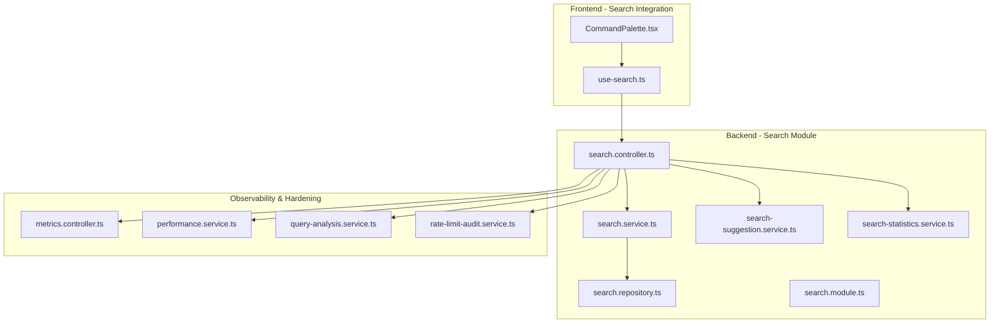
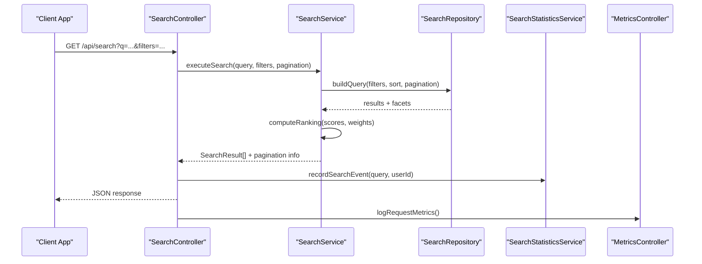
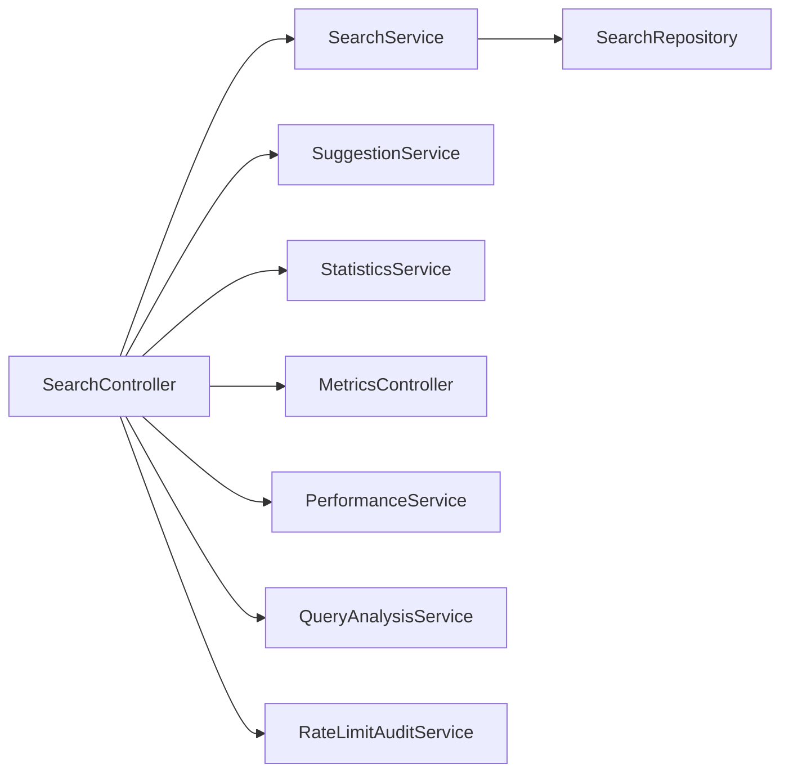

# Media Search & Discovery

<cite>
**Referenced Files in This Document**
- [search.controller.ts](file://apps/backend/src/search/search.controller.ts)
- [search.service.ts](file://apps/backend/src/search/search.service.ts)
- [search.repository.ts](file://apps/backend/src/search/search.repository.ts)
- [search-suggestion.service.ts](file://apps/backend/src/search/search-suggestion.service.ts)
- [search-statistics.service.ts](file://apps/backend/src/search/search-statistics.service.ts)
- [search.module.ts](file://apps/backend/src/search/search.module.ts)
- [index.ts](file://apps/backend/src/search/index.ts)
- [use-search.ts](file://src/hooks/use-search.ts)
- [CommandPalette.tsx](file://src/components/search/CommandPalette.tsx)
- [analytics.controller.ts](file://apps/backend/src/analytics/analytics.controller.ts)
- [metrics.controller.ts](file://apps/backend/src/observability/metrics.controller.ts)
- [performance.service.ts](file://apps/backend/src/observability/performance.service.ts)
- [query-analysis.service.ts](file://apps/backend/src/hardening/query-analysis.service.ts)
- [rate-limit-audit.service.ts](file://apps/backend/src/hardening/rate-limit-audit.service.ts)
</cite>

## Table of Contents
1. [Introduction](#introduction)
2. [Project Structure](#project-structure)
3. [Core Components](#core-components)
4. [Architecture Overview](#architecture-overview)
5. [Detailed Component Analysis](#detailed-component-analysis)
6. [Dependency Analysis](#dependency-analysis)
7. [Performance Considerations](#performance-considerations)
8. [Troubleshooting Guide](#troubleshooting-guide)
9. [Conclusion](#conclusion)
10. [Appendices](#appendices)

## Introduction
This document provides comprehensive API documentation for media search and discovery endpoints. It covers full-text search, faceted filtering, autocomplete suggestions, and recommendation algorithms. It also documents search query syntax, advanced filtering options by genre, year, rating, and custom metadata fields, as well as result ranking, relevance scoring, pagination patterns, and performance optimization techniques. Examples include complex search queries, suggestion APIs, trending content discovery, personalized recommendations, search analytics, popular searches tracking, and search performance monitoring.

## Project Structure
The search and discovery functionality is implemented in the backend under a dedicated search module with controllers, services, repositories, and DTOs. The frontend integrates via hooks and UI components to provide interactive search experiences.

**Diagram sources**
- [search.controller.ts](file://apps/backend/src/search/search.controller.ts)
- [search.service.ts](file://apps/backend/src/search/search.service.ts)
- [search.repository.ts](file://apps/backend/src/search/search.repository.ts)
- [search-suggestion.service.ts](file://apps/backend/src/search/search-suggestion.service.ts)
- [search-statistics.service.ts](file://apps/backend/src/search/search-statistics.service.ts)
- [search.module.ts](file://apps/backend/src/search/search.module.ts)
- [use-search.ts](file://src/hooks/use-search.ts)
- [CommandPalette.tsx](file://src/components/search/CommandPalette.tsx)
- [metrics.controller.ts](file://apps/backend/src/observability/metrics.controller.ts)
- [performance.service.ts](file://apps/backend/src/observability/performance.service.ts)
- [query-analysis.service.ts](file://apps/backend/src/hardening/query-analysis.service.ts)
- [rate-limit-audit.service.ts](file://apps/backend/src/hardening/rate-limit-audit.service.ts)

**Section sources**
- [search.module.ts](file://apps/backend/src/search/search.module.ts)
- [index.ts](file://apps/backend/src/search/index.ts)

## Core Components
- Search Controller: Exposes HTTP endpoints for search, suggestions, statistics, and trending content.
- Search Service: Orchestrates search logic, including full-text search, faceted filtering, ranking, and pagination.
- Search Repository: Handles data access for media items and related metadata.
- Suggestion Service: Provides autocomplete suggestions based on partial queries and user context.
- Statistics Service: Tracks search analytics, popular searches, and performance metrics.

Key responsibilities:
- Full-text search across titles, descriptions, and custom metadata fields.
- Faceted filtering by genre, year, rating, and arbitrary metadata keys/values.
- Ranking and relevance scoring with configurable weights.
- Pagination using cursor or offset-based strategies.
- Autocomplete suggestions with fuzzy matching and popularity boosts.
- Trending and personalized recommendations based on user interactions and library context.

**Section sources**
- [search.controller.ts](file://apps/backend/src/search/search.controller.ts)
- [search.service.ts](file://apps/backend/src/search/search.service.ts)
- [search.repository.ts](file://apps/backend/src/search/search.repository.ts)
- [search-suggestion.service.ts](file://apps/backend/src/search/search-suggestion.service.ts)
- [search-statistics.service.ts](file://apps/backend/src/search/search-statistics.service.ts)

## Architecture Overview
The search system follows a layered architecture:
- Controller layer handles HTTP requests and responses.
- Service layer implements business logic for search, suggestions, and analytics.
- Repository layer abstracts database operations.
- Observability and hardening layers provide metrics, performance monitoring, query analysis, and rate limiting.

**Diagram sources**
- [search.controller.ts](file://apps/backend/src/search/search.controller.ts)
- [search.service.ts](file://apps/backend/src/search/search.service.ts)
- [search.repository.ts](file://apps/backend/src/search/search.repository.ts)
- [search-statistics.service.ts](file://apps/backend/src/search/search-statistics.service.ts)
- [metrics.controller.ts](file://apps/backend/src/observability/metrics.controller.ts)

## Detailed Component Analysis

### Search Controller Endpoints
- Full-text search endpoint: supports query parameters for text, filters, sorting, and pagination.
- Suggestions endpoint: returns autocomplete suggestions based on partial input and optional user context.
- Statistics endpoint: exposes search analytics such as popular searches and error rates.
- Trending endpoint: returns trending content based on recent activity and global popularity.

Typical request/response patterns:
- Query parameters: q (text), genre, year, rating, metadata key-value pairs, sort, page, limit.
- Response body: list of media items, facets, pagination metadata, and optional relevance scores.

Security and validation:
- Input validation for query parameters and filter values.
- Authentication/authorization decorators applied where required.

**Section sources**
- [search.controller.ts](file://apps/backend/src/search/search.controller.ts)

### Search Service Logic
Responsibilities:
- Parse and validate search queries and filters.
- Build optimized database queries with full-text search and faceted filters.
- Apply ranking and relevance scoring with configurable weights.
- Handle pagination and cursor generation.
- Integrate with suggestion and statistics services.

Algorithm highlights:
- Full-text search uses indexed fields for titles, descriptions, and custom metadata.
- Faceted filtering aggregates counts per category for quick UI updates.
- Ranking combines textual relevance, recency, ratings, and user affinity signals.

Complexity considerations:
- Time complexity depends on index size and filter cardinality; use appropriate indexes.
- Space complexity for facets and intermediate result sets should be bounded by pagination limits.

**Section sources**
- [search.service.ts](file://apps/backend/src/search/search.service.ts)

### Search Repository Data Access
Responsibilities:
- Execute raw or parameterized queries for search and facets.
- Manage indexes and query optimizations.
- Provide methods for fetching media items, metadata, and related entities.

Optimization techniques:
- Use composite indexes for common filter combinations (genre, year, rating).
- Leverage full-text search indexes for fast text matching.
- Cache frequent facet aggregations when appropriate.

**Section sources**
- [search.repository.ts](file://apps/backend/src/search/search.repository.ts)

### Suggestion Service
Responsibilities:
- Generate autocomplete suggestions from partial queries.
- Apply fuzzy matching and popularity boosting.
- Respect user context (e.g., language, region) if provided.

Behavior:
- Returns top N suggestions with match quality scores.
- Supports de-duplication and normalization.

**Section sources**
- [search-suggestion.service.ts](file://apps/backend/src/search/search-suggestion.service.ts)

### Statistics Service
Responsibilities:
- Track search events, popular queries, and failure rates.
- Aggregate trending content based on time windows and interaction signals.
- Expose analytics endpoints for dashboards and monitoring.

Metrics:
- Query frequency, average latency, error rates.
- Top searched terms and categories.
- Conversion metrics (click-through to detail views).

**Section sources**
- [search-statistics.service.ts](file://apps/backend/src/search/search-statistics.service.ts)

### Frontend Integration
- Hook: use-search.ts encapsulates API calls, caching, and state management for search queries and suggestions.
- Command Palette: CommandPalette.tsx provides keyboard-driven search UX with live suggestions and quick actions.

Integration patterns:
- Debounced input handling for suggestions.
- Optimistic UI updates for search results.
- Error boundaries and retry logic for failed requests.

**Section sources**
- [use-search.ts](file://src/hooks/use-search.ts)
- [CommandPalette.tsx](file://src/components/search/CommandPalette.tsx)

### Observability and Hardening
- Metrics controller: exposes application-level metrics for search endpoints.
- Performance service: measures latency, throughput, and resource usage.
- Query analysis service: analyzes slow queries and suggests optimizations.
- Rate limit audit service: monitors and enforces rate limits to protect search endpoints.

**Section sources**
- [metrics.controller.ts](file://apps/backend/src/observability/metrics.controller.ts)
- [performance.service.ts](file://apps/backend/src/observability/performance.service.ts)
- [query-analysis.service.ts](file://apps/backend/src/hardening/query-analysis.service.ts)
- [rate-limit-audit.service.ts](file://apps/backend/src/hardening/rate-limit-audit.service.ts)

## Dependency Analysis
The search module depends on core infrastructure modules for authentication, caching, and observability. It interacts with the repository layer for data persistence and with analytics and metrics services for insights.

**Diagram sources**
- [search.controller.ts](file://apps/backend/src/search/search.controller.ts)
- [search.service.ts](file://apps/backend/src/search/search.service.ts)
- [search.repository.ts](file://apps/backend/src/search/search.repository.ts)
- [search-suggestion.service.ts](file://apps/backend/src/search/search-suggestion.service.ts)
- [search-statistics.service.ts](file://apps/backend/src/search/search-statistics.service.ts)
- [metrics.controller.ts](file://apps/backend/src/observability/metrics.controller.ts)
- [performance.service.ts](file://apps/backend/src/observability/performance.service.ts)
- [query-analysis.service.ts](file://apps/backend/src/hardening/query-analysis.service.ts)
- [rate-limit-audit.service.ts](file://apps/backend/src/hardening/rate-limit-audit.service.ts)

**Section sources**
- [search.module.ts](file://apps/backend/src/search/search.module.ts)

## Performance Considerations
- Indexing strategy: Ensure full-text indexes on searchable fields and composite indexes for frequent filter combinations.
- Pagination: Prefer cursor-based pagination for large datasets to avoid expensive OFFSET queries.
- Caching: Cache frequent facets and popular queries; implement cache invalidation on content updates.
- Query optimization: Use EXPLAIN plans to identify bottlenecks; leverage query analysis service for recommendations.
- Rate limiting: Protect endpoints against abuse and ensure fair usage across users.
- Concurrency: Batch reads where possible and avoid N+1 queries in result enrichment.

[No sources needed since this section provides general guidance]

## Troubleshooting Guide
Common issues and resolutions:
- Slow search queries: Check indexes, reduce filter cardinality, and enable query analysis.
- Missing facets: Verify field mappings and aggregation queries.
- Inaccurate suggestions: Adjust fuzzy thresholds and popularity weights.
- High error rates: Inspect logs via metrics controller and review input validation rules.
- Rate limit errors: Monitor rate-limit audit service and adjust limits as needed.

Operational tips:
- Use health checks to verify database connectivity and index availability.
- Enable detailed logging for search endpoints during debugging sessions.
- Monitor performance service metrics for latency spikes and memory usage.

**Section sources**
- [metrics.controller.ts](file://apps/backend/src/observability/metrics.controller.ts)
- [performance.service.ts](file://apps/backend/src/observability/performance.service.ts)
- [query-analysis.service.ts](file://apps/backend/src/hardening/query-analysis.service.ts)
- [rate-limit-audit.service.ts](file://apps/backend/src/hardening/rate-limit-audit.service.ts)

## Conclusion
The media search and discovery system provides robust full-text search, faceted filtering, autocomplete suggestions, and recommendation capabilities. With strong observability and hardening features, it ensures reliable performance and scalability. By following the documented query syntax, filtering options, and optimization techniques, developers can build rich search experiences tailored to user needs.

[No sources needed since this section summarizes without analyzing specific files]

## Appendices

### Search Query Syntax and Filtering
- Text search: Use the q parameter for full-text matching across titles, descriptions, and custom metadata.
- Genre filter: Filter by one or multiple genres using array syntax.
- Year filter: Specify ranges or exact years.
- Rating filter: Filter by numeric rating thresholds.
- Custom metadata: Add key-value pairs for arbitrary fields supported by the schema.

Example patterns:
- Basic text search with genre and year filters.
- Advanced query combining rating thresholds and metadata fields.
- Sorting by relevance, date, or rating with pagination.

[No sources needed since this section provides general guidance]

### Result Ranking and Relevance Scoring
- Relevance score combines textual match quality, recency, ratings, and user affinity.
- Weights are configurable to prioritize certain signals over others.
- Results include score metadata for client-side ranking adjustments.

[No sources needed since this section provides general guidance]

### Pagination Patterns
- Offset-based pagination: Suitable for small datasets and simple UIs.
- Cursor-based pagination: Preferred for large datasets to maintain consistent performance.
- Pagination metadata includes total count, current page, and next/previous cursors.

[No sources needed since this section provides general guidance]

### Suggestion APIs
- Autocomplete endpoint accepts partial queries and optional user context.
- Returns suggestions with match quality and popularity indicators.
- Supports fuzzy matching and de-duplication.

[No sources needed since this section provides general guidance]

### Trending Content Discovery
- Trending endpoint aggregates recent activity and global popularity.
- Uses time windows and interaction signals to rank content.
- Can be customized per user or globally.

[No sources needed since this section provides general guidance]

### Personalized Recommendations
- Recommendation engine leverages user library, interactions, and preferences.
- Combines collaborative filtering and content-based signals.
- Exposes endpoints for curated lists and dynamic recommendations.

[No sources needed since this section provides general guidance]

### Search Analytics and Monitoring
- Popular searches tracking via statistics service.
- Performance metrics exposed through metrics controller.
- Query analysis service identifies slow queries and suggests improvements.

[No sources needed since this section provides general guidance]