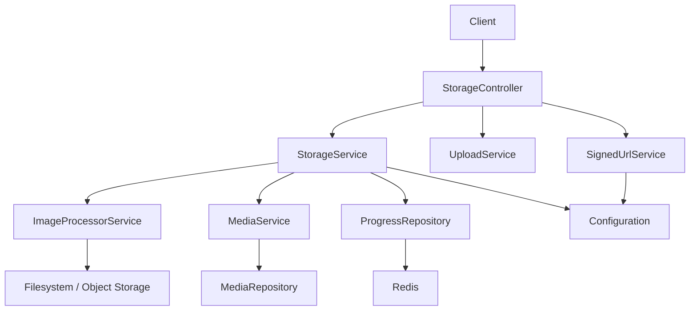
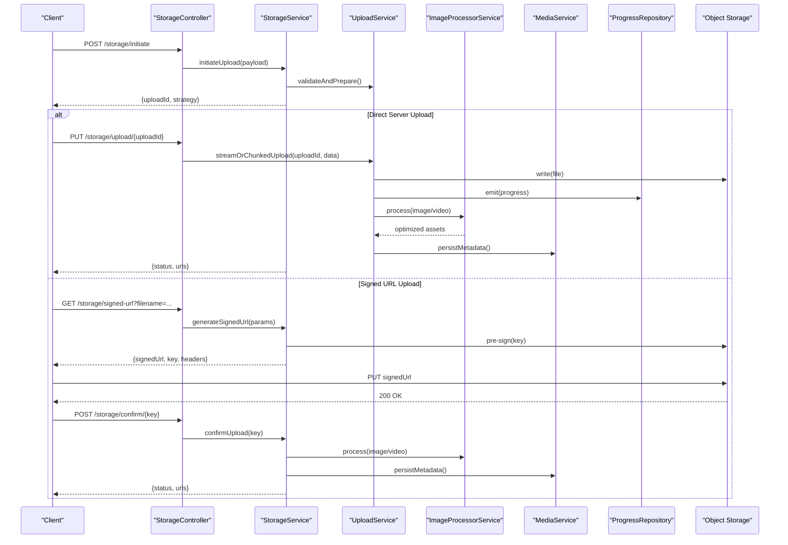
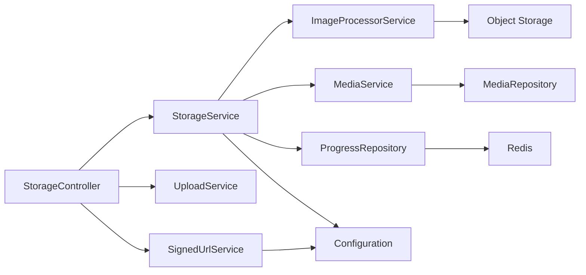

# Media Upload & Storage

<cite>
**Referenced Files in This Document**
- [storage.controller.ts](file://apps/backend/src/storage/storage.controller.ts)
- [storage.service.ts](file://apps/backend/src/storage/storage.service.ts)
- [upload.service.ts](file://apps/backend/src/storage/upload.service.ts)
- [image.service.ts](file://apps/backend/src/storage/image.service.ts)
- [image-processor.service.ts](file://apps/backend/src/storage/image-processor.service.ts)
- [signed-url.service.ts](file://apps/backend/src/storage/signed-url.service.ts)
- [media-cleanup.service.ts](file://apps/backend/src/storage/media-cleanup.service.ts)
- [storage.module.ts](file://apps/backend/src/storage/storage.module.ts)
- [index.ts](file://apps/backend/src/storage/index.ts)
- [dto/index.ts](file://apps/backend/src/storage/dto/index.ts)
- [media.controller.ts](file://apps/backend/src/media/media.controller.ts)
- [media.service.ts](file://apps/backend/src/media/media.service.ts)
- [media.repository.ts](file://apps/backend/src/media/media.repository.ts)
- [media-metadata.service.ts](file://apps/backend/src/media/media-metadata.service.ts)
- [progress.controller.ts](file://apps/backend/src/progress/progress.controller.ts)
- [progress.service.ts](file://apps/backend/src/progress/progress.service.ts)
- [progress.repository.ts](file://apps/backend/src/progress/progress.repository.ts)
- [configuration.ts](file://apps/backend/src/config/configuration.ts)
- [env.validation.ts](file://apps/backend/src/config/env.validation.ts)
- [app.module.ts](file://apps/backend/src/app.module.ts)
- [main.ts](file://apps/backend/src/main.ts)
</cite>

## Table of Contents
1. [Introduction](#introduction)
2. [Project Structure](#project-structure)
3. [Core Components](#core-components)
4. [Architecture Overview](#architecture-overview)
5. [Detailed Component Analysis](#detailed-component-analysis)
6. [Dependency Analysis](#dependency-analysis)
7. [Performance Considerations](#performance-considerations)
8. [Troubleshooting Guide](#troubleshooting-guide)
9. [Conclusion](#conclusion)
10. [Appendices](#appendices)

## Introduction
This document provides comprehensive API documentation for media upload and storage operations. It covers file upload endpoints, supported formats, size limitations, processing pipelines, signed URL generation for secure direct uploads, image optimization and thumbnail generation, CDN integration patterns, and storage backend abstraction. It also specifies multipart form uploads, streaming uploads, chunked uploads for large files, progress tracking, error handling strategies, file validation rules, storage cleanup procedures, security considerations, virus scanning integration, and compliance requirements.

## Project Structure
The media upload and storage functionality is implemented primarily within the storage module and integrates with the media module for metadata and persistence. Key areas include:
- Controllers exposing REST endpoints for upload, signed URLs, and progress polling
- Services encapsulating business logic for upload orchestration, image processing, signed URL generation, and cleanup
- Repositories and DTOs for data access and request/response contracts
- Configuration and environment validation for storage backends and limits
- Integration points with Redis for progress tracking and queues for background processing

**Diagram sources**
- [storage.controller.ts](file://apps/backend/src/storage/storage.controller.ts)
- [storage.service.ts](file://apps/backend/src/storage/storage.service.ts)
- [upload.service.ts](file://apps/backend/src/storage/upload.service.ts)
- [image-processor.service.ts](file://apps/backend/src/storage/image-processor.service.ts)
- [signed-url.service.ts](file://apps/backend/src/storage/signed-url.service.ts)
- [media.service.ts](file://apps/backend/src/media/media.service.ts)
- [media.repository.ts](file://apps/backend/src/media/media.repository.ts)
- [progress.repository.ts](file://apps/backend/src/progress/progress.repository.ts)
- [configuration.ts](file://apps/backend/src/config/configuration.ts)

**Section sources**
- [storage.module.ts](file://apps/backend/src/storage/storage.module.ts)
- [index.ts](file://apps/backend/src/storage/index.ts)
- [app.module.ts](file://apps/backend/src/app.module.ts)
- [main.ts](file://apps/backend/src/main.ts)

## Core Components
- StorageController: Exposes endpoints for initiating uploads, generating signed URLs, uploading via multipart/streaming/chunked, and querying progress.
- StorageService: Orchestrates upload flows, validates inputs, coordinates image processing, manages metadata, and handles cleanup.
- UploadService: Implements multipart, streaming, and chunked upload strategies with resumability and integrity checks.
- ImageProcessorService: Handles image optimization, format conversion, and thumbnail generation.
- SignedUrlService: Generates short-lived, scoped signed URLs for secure direct uploads to storage backends.
- MediaService/MediaRepository: Persist media records, relationships, and metadata; integrate with collections and library features.
- ProgressRepository: Stores and retrieves upload progress events for client-side feedback.
- Configuration: Centralizes environment variables for storage backends, limits, and feature flags.

**Section sources**
- [storage.controller.ts](file://apps/backend/src/storage/storage.controller.ts)
- [storage.service.ts](file://apps/backend/src/storage/storage.service.ts)
- [upload.service.ts](file://apps/backend/src/storage/upload.service.ts)
- [image-processor.service.ts](file://apps/backend/src/storage/image-processor.service.ts)
- [signed-url.service.ts](file://apps/backend/src/storage/signed-url.service.ts)
- [media.service.ts](file://apps/backend/src/media/media.service.ts)
- [media.repository.ts](file://apps/backend/src/media/media.repository.ts)
- [progress.repository.ts](file://apps/backend/src/progress/progress.repository.ts)
- [configuration.ts](file://apps/backend/src/config/configuration.ts)

## Architecture Overview
The system supports multiple upload methods and a pluggable storage backend abstraction. Clients can either upload directly through the server or use signed URLs to write directly to object storage (e.g., S3-compatible). Image processing occurs asynchronously where appropriate, and progress is tracked via Redis-backed events.

**Diagram sources**
- [storage.controller.ts](file://apps/backend/src/storage/storage.controller.ts)
- [storage.service.ts](file://apps/backend/src/storage/storage.service.ts)
- [upload.service.ts](file://apps/backend/src/storage/upload.service.ts)
- [image-processor.service.ts](file://apps/backend/src/storage/image-processor.service.ts)
- [media.service.ts](file://apps/backend/src/media/media.service.ts)
- [progress.repository.ts](file://apps/backend/src/progress/progress.repository.ts)

## Detailed Component Analysis

### StorageController
Responsibilities:
- Define REST endpoints for upload initiation, direct upload, signed URL generation, confirmation, and progress polling.
- Validate request payloads using DTOs from the storage module.
- Delegate orchestration to StorageService and UploadService.

Key endpoints:
- Initiate upload: returns an upload ID and strategy (server vs signed URL).
- Direct upload: accepts multipart/form-data, streaming, or chunked uploads.
- Signed URL: generates short-lived, scoped URLs for direct writes to storage.
- Confirm upload: finalizes signed uploads and triggers processing.
- Progress: returns current upload status and processing state.

Validation and constraints:
- Enforces allowed MIME types and extensions.
- Applies per-file and total payload size limits.
- Requires authentication and authorization based on user context.

Error handling:
- Returns standardized error responses for validation failures, rate limiting, and storage errors.
- Emits structured logs for observability.

**Section sources**
- [storage.controller.ts](file://apps/backend/src/storage/storage.controller.ts)
- [dto/index.ts](file://apps/backend/src/storage/dto/index.ts)

### StorageService
Responsibilities:
- Orchestrate upload workflows across strategies.
- Coordinate image/video processing and thumbnail generation.
- Manage metadata persistence and asset lifecycle.
- Integrate with progress tracking and cleanup services.

Processing pipeline:
- Validate input and prepare destination keys.
- Choose upload strategy (direct server, streaming, chunked, or signed URL).
- Trigger asynchronous processing (optimization, thumbnails, metadata extraction).
- Update progress events and finalize asset registration.

Cleanup:
- Schedules deletion of orphaned or expired temporary assets.
- Integrates with retention policies and safe delete mechanisms.

**Section sources**
- [storage.service.ts](file://apps/backend/src/storage/storage.service.ts)
- [media-cleanup.service.ts](file://apps/backend/src/storage/media-cleanup.service.ts)

### UploadService
Responsibilities:
- Implement multipart form uploads with streaming support.
- Support chunked uploads with resumability and integrity verification.
- Stream large files efficiently without loading entire payloads into memory.
- Emit progress events during upload completion.

Strategies:
- Multipart: parse and stream parts to storage.
- Streaming: handle raw streams with backpressure management.
- Chunked: accept ordered chunks, reassemble, verify checksums, resume on failure.

Integrity and validation:
- Content-type and extension checks.
- Size limits enforced at chunk and total levels.
- Optional content hashing for deduplication and integrity.

**Section sources**
- [upload.service.ts](file://apps/backend/src/storage/upload.service.ts)

### ImageProcessorService
Responsibilities:
- Optimize images by resizing, recompressing, and converting formats.
- Generate thumbnails at predefined sizes.
- Preserve EXIF metadata when required.
- Queue heavy tasks to avoid blocking upload endpoints.

Optimization rules:
- Target formats (e.g., WebP, AVIF) with fallbacks.
- Quality and dimension thresholds configurable via environment.
- Safe defaults to prevent oversized outputs.

**Section sources**
- [image-processor.service.ts](file://apps/backend/src/storage/image-processor.service.ts)
- [image.service.ts](file://apps/backend/src/storage/image.service.ts)

### SignedUrlService
Responsibilities:
- Generate short-lived, scoped signed URLs for direct uploads to object storage.
- Attach security headers and CORS settings as needed.
- Validate parameters and enforce expiration and size limits.

Security:
- Token-scoped permissions tied to user and upload session.
- Strict origin and header restrictions.
- Rotation and revocation support.

**Section sources**
- [signed-url.service.ts](file://apps/backend/src/storage/signed-url.service.ts)

### MediaService and MediaRepository
Responsibilities:
- Persist media entities, relationships, and metadata.
- Provide queries for retrieval, listing, and search integration.
- Coordinate with collections, library, and analytics modules.

Data model highlights:
- Media record includes identifiers, storage keys, MIME type, size, dimensions, and processing status.
- Relationships to users, collections, and interactions.

**Section sources**
- [media.service.ts](file://apps/backend/src/media/media.service.ts)
- [media.repository.ts](file://apps/backend/src/media/media.repository.ts)
- [media-metadata.service.ts](file://apps/backend/src/media/media-metadata.service.ts)

### Progress Tracking
Responsibilities:
- Track upload and processing progress via Redis-backed events.
- Provide endpoints for clients to poll status and receive updates.

Events:
- Upload started, chunk received, upload complete, processing started, processing complete, failed.

**Section sources**
- [progress.controller.ts](file://apps/backend/src/progress/progress.controller.ts)
- [progress.service.ts](file://apps/backend/src/progress/progress.service.ts)
- [progress.repository.ts](file://apps/backend/src/progress/progress.repository.ts)

### Configuration and Environment
Responsibilities:
- Centralize configuration for storage backends, limits, and feature flags.
- Validate environment variables at startup.

Key settings:
- Storage provider credentials and bucket names.
- Max file size, allowed MIME types, and chunk size.
- CDN base URL and cache control policies.
- Processing concurrency and queue settings.

**Section sources**
- [configuration.ts](file://apps/backend/src/config/configuration.ts)
- [env.validation.ts](file://apps/backend/src/config/env.validation.ts)

## Dependency Analysis
The storage module depends on configuration, media services, progress repositories, and external storage providers. The controllers are thin layers delegating to services.

**Diagram sources**
- [storage.controller.ts](file://apps/backend/src/storage/storage.controller.ts)
- [storage.service.ts](file://apps/backend/src/storage/storage.service.ts)
- [upload.service.ts](file://apps/backend/src/storage/upload.service.ts)
- [image-processor.service.ts](file://apps/backend/src/storage/image-processor.service.ts)
- [signed-url.service.ts](file://apps/backend/src/storage/signed-url.service.ts)
- [media.service.ts](file://apps/backend/src/media/media.service.ts)
- [media.repository.ts](file://apps/backend/src/media/media.repository.ts)
- [progress.repository.ts](file://apps/backend/src/progress/progress.repository.ts)
- [configuration.ts](file://apps/backend/src/config/configuration.ts)

**Section sources**
- [storage.module.ts](file://apps/backend/src/storage/storage.module.ts)
- [index.ts](file://apps/backend/src/storage/index.ts)

## Performance Considerations
- Use streaming uploads to minimize memory usage for large files.
- Offload image/video processing to background jobs to keep endpoints responsive.
- Cache frequently accessed metadata and thumbnails via CDN and browser caching.
- Configure chunk sizes to balance reliability and throughput.
- Enable compression for transfer where applicable.
- Monitor queue depths and adjust concurrency based on resource utilization.

[No sources needed since this section provides general guidance]

## Troubleshooting Guide
Common issues and resolutions:
- Validation errors: Check MIME types, extensions, and size limits configured in environment.
- Signed URL failures: Verify expiration, headers, CORS, and origin restrictions.
- Upload stalls: Inspect network connectivity, chunk ordering, and retry policies.
- Processing failures: Review logs for image/video codec compatibility and resource limits.
- Cleanup gaps: Ensure scheduled cleanup jobs run and retention policies are applied.

Operational tips:
- Use health and metrics endpoints to monitor storage backends and queues.
- Enable detailed logging for upload sessions and processing steps.
- Implement idempotency keys for retries to avoid duplicate assets.

**Section sources**
- [storage.controller.ts](file://apps/backend/src/storage/storage.controller.ts)
- [storage.service.ts](file://apps/backend/src/storage/storage.service.ts)
- [upload.service.ts](file://apps/backend/src/storage/upload.service.ts)
- [image-processor.service.ts](file://apps/backend/src/storage/image-processor.service.ts)
- [signed-url.service.ts](file://apps/backend/src/storage/signed-url.service.ts)
- [media-cleanup.service.ts](file://apps/backend/src/storage/media-cleanup.service.ts)

## Conclusion
The media upload and storage subsystem provides robust, scalable, and secure capabilities for handling diverse upload scenarios. It abstracts storage backends, supports efficient streaming and chunked uploads, and integrates image optimization and progress tracking. Proper configuration, security practices, and operational monitoring ensure reliable performance and compliance.

[No sources needed since this section summarizes without analyzing specific files]

## Appendices

### API Specifications

#### Upload Endpoints
- Initiate Upload
  - Method: POST
  - Path: /storage/initiate
  - Request: JSON payload with filename, MIME type, size, and optional metadata
  - Response: uploadId, strategy (server|signed), and next steps
- Direct Upload (Server)
  - Method: PUT
  - Path: /storage/upload/{uploadId}
  - Body: multipart/form-data or raw stream or chunked segments
  - Response: status, processing info, and asset URLs
- Signed URL Generation
  - Method: GET
  - Path: /storage/signed-url
  - Query: filename, mime, size, headers
  - Response: signedUrl, key, headers, expiration
- Confirm Signed Upload
  - Method: POST
  - Path: /storage/confirm/{key}
  - Response: status, processing info, and asset URLs
- Progress Polling
  - Method: GET
  - Path: /storage/progress/{uploadId}
  - Response: current stage, percentage, and messages

Supported Formats and Limits:
- Images: JPEG, PNG, GIF, WebP, AVIF (configurable)
- Videos: MP4, MOV, WebM (configurable)
- Documents: PDF, DOCX (if enabled)
- Max file size: configurable via environment
- Allowed MIME types: validated against whitelist

Processing Pipelines:
- Image optimization and format conversion
- Thumbnail generation at multiple sizes
- Metadata extraction (EXIF, duration, resolution)
- Virus scanning (optional, integrated via service)

CDN Integration Patterns:
- Serve optimized assets via CDN with cache busting
- Set appropriate cache-control headers
- Use signed cookies or tokens for private assets

Storage Backend Abstraction:
- Pluggable providers (local filesystem, S3-compatible, etc.)
- Consistent interface for read/write/delete operations
- Configurable bucket/key naming and ACLs

Multipart, Streaming, and Chunked Uploads:
- Multipart: standard HTML forms with progressive feedback
- Streaming: server-side parsing with backpressure
- Chunked: resumable uploads with integrity checks

Progress Tracking:
- Real-time updates via polling or SSE/WebSocket (as implemented)
- Events for upload stages and processing milestones

Error Handling Strategies:
- Standardized error codes and messages
- Retry policies for transient failures
- Idempotent operations for safe retries

File Validation Rules:
- MIME type and extension matching
- Size limits and content previews
- Malformed payload detection

Storage Cleanup Procedures:
- Scheduled jobs to remove temporary files
- Retention policies and soft deletes
- Audit logs for deletions

Security Considerations:
- Authentication and authorization for all endpoints
- Signed URL scoping and expiration
- Input sanitization and validation
- Rate limiting and abuse prevention

Virus Scanning Integration:
- Optional scanning step before finalizing assets
- Quarantine and alerting on threats

Compliance Requirements:
- Data retention and deletion policies
- Privacy controls for personal data
- Audit trails and logging standards

**Section sources**
- [storage.controller.ts](file://apps/backend/src/storage/storage.controller.ts)
- [storage.service.ts](file://apps/backend/src/storage/storage.service.ts)
- [upload.service.ts](file://apps/backend/src/storage/upload.service.ts)
- [image-processor.service.ts](file://apps/backend/src/storage/image-processor.service.ts)
- [signed-url.service.ts](file://apps/backend/src/storage/signed-url.service.ts)
- [media.service.ts](file://apps/backend/src/media/media.service.ts)
- [media.repository.ts](file://apps/backend/src/media/media.repository.ts)
- [progress.controller.ts](file://apps/backend/src/progress/progress.controller.ts)
- [progress.service.ts](file://apps/backend/src/progress/progress.service.ts)
- [progress.repository.ts](file://apps/backend/src/progress/progress.repository.ts)
- [configuration.ts](file://apps/backend/src/config/configuration.ts)
- [env.validation.ts](file://apps/backend/src/config/env.validation.ts)