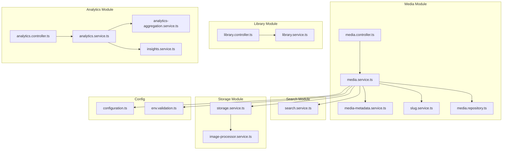
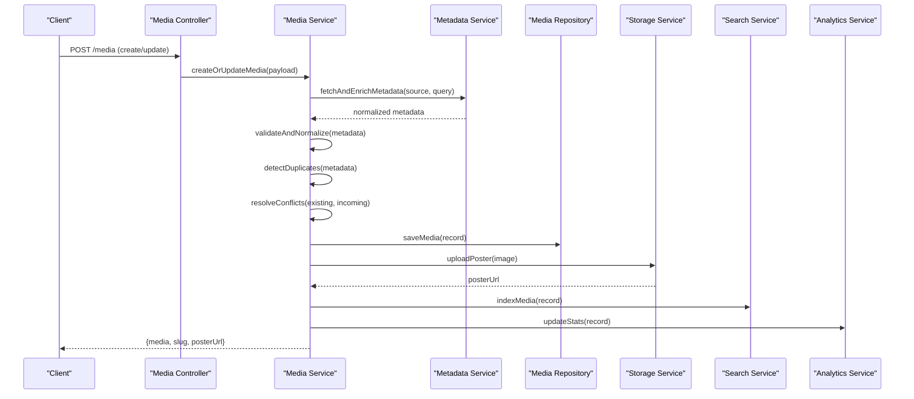
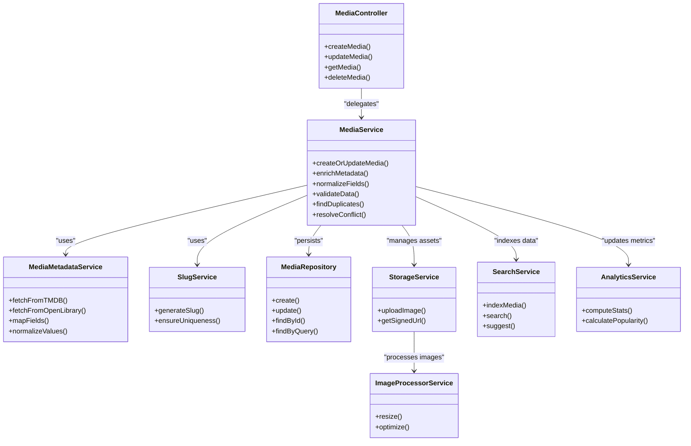
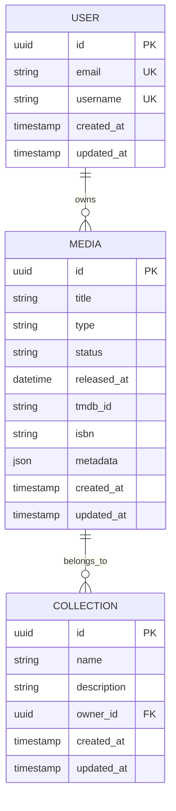

# Metadata Extraction & Processing

<cite>
**Referenced Files in This Document**
- [media.controller.ts](file://apps/backend/src/media/media.controller.ts)
- [media.service.ts](file://apps/backend/src/media/media.service.ts)
- [media-metadata.service.ts](file://apps/backend/src/media/media-metadata.service.ts)
- [slug.service.ts](file://apps/backend/src/media/slug.service.ts)
- [media.repository.ts](file://apps/backend/src/media/media.repository.ts)
- [library.controller.ts](file://apps/backend/src/library/library.controller.ts)
- [library.service.ts](file://apps/backend/src/library/library.service.ts)
- [analytics.controller.ts](file://apps/backend/src/analytics/analytics.controller.ts)
- [analytics.service.ts](file://apps/backend/src/analytics/analytics.service.ts)
- [analytics-aggregation.service.ts](file://apps/backend/src/analytics/analytics-aggregation.service.ts)
- [insights.service.ts](file://apps/backend/src/analytics/insights.service.ts)
- [search.service.ts](file://apps/backend/src/search/search.service.ts)
- [storage.service.ts](file://apps/backend/src/storage/storage.service.ts)
- [image-processor.service.ts](file://apps/backend/src/storage/image-processor.service.ts)
- [configuration.ts](file://apps/backend/src/config/configuration.ts)
- [env.validation.ts](file://apps/backend/src/config/env.validation.ts)
- [schema.prisma](file://apps/backend/prisma/schema.prisma)
</cite>

## Table of Contents
1. [Introduction](#introduction)
2. [Project Structure](#project-structure)
3. [Core Components](#core-components)
4. [Architecture Overview](#architecture-overview)
5. [Detailed Component Analysis](#detailed-component-analysis)
6. [Dependency Analysis](#dependency-analysis)
7. [Performance Considerations](#performance-considerations)
8. [Troubleshooting Guide](#troubleshooting-guide)
9. [Conclusion](#conclusion)
10. [Appendices](#appendices)

## Introduction
This document provides comprehensive API documentation for media metadata extraction and processing services. It covers automatic metadata retrieval from external sources, manual metadata editing, intelligent slug generation, validation and normalization, duplicate detection, conflict resolution, enrichment workflows, batch processing, custom field mappings, statistics calculation, popularity metrics, and content analysis features. The backend is implemented with a modular NestJS architecture exposing REST endpoints through controllers, orchestrated by services that coordinate repositories, storage, search, and analytics subsystems.

## Project Structure
The metadata-related functionality is primarily located under the media module, with supporting capabilities across library, analytics, search, storage, and configuration modules. Controllers expose HTTP endpoints; services implement business logic; repositories handle persistence via Prisma; storage manages images and assets; search enables discovery; and analytics computes insights and metrics.

**Diagram sources**
- [media.controller.ts](file://apps/backend/src/media/media.controller.ts)
- [media.service.ts](file://apps/backend/src/media/media.service.ts)
- [media-metadata.service.ts](file://apps/backend/src/media/media-metadata.service.ts)
- [slug.service.ts](file://apps/backend/src/media/slug.service.ts)
- [media.repository.ts](file://apps/backend/src/media/media.repository.ts)
- [library.controller.ts](file://apps/backend/src/library/library.controller.ts)
- [library.service.ts](file://apps/backend/src/library/library.service.ts)
- [analytics.controller.ts](file://apps/backend/src/analytics/analytics.controller.ts)
- [analytics.service.ts](file://apps/backend/src/analytics/analytics.service.ts)
- [analytics-aggregation.service.ts](file://apps/backend/src/analytics/analytics-aggregation.service.ts)
- [insights.service.ts](file://apps/backend/src/analytics/insights.service.ts)
- [search.service.ts](file://apps/backend/src/search/search.service.ts)
- [storage.service.ts](file://apps/backend/src/storage/storage.service.ts)
- [image-processor.service.ts](file://apps/backend/src/storage/image-processor.service.ts)
- [configuration.ts](file://apps/backend/src/config/configuration.ts)
- [env.validation.ts](file://apps/backend/src/config/env.validation.ts)

**Section sources**
- [media.controller.ts](file://apps/backend/src/media/media.controller.ts)
- [media.service.ts](file://apps/backend/src/media/media.service.ts)
- [media-metadata.service.ts](file://apps/backend/src/media/media-metadata.service.ts)
- [slug.service.ts](file://apps/backend/src/media/slug.service.ts)
- [media.repository.ts](file://apps/backend/src/media/media.repository.ts)
- [library.controller.ts](file://apps/backend/src/library/library.controller.ts)
- [library.service.ts](file://apps/backend/src/library/library.service.ts)
- [analytics.controller.ts](file://apps/backend/src/analytics/analytics.controller.ts)
- [analytics.service.ts](file://apps/backend/src/analytics/analytics.service.ts)
- [analytics-aggregation.service.ts](file://apps/backend/src/analytics/analytics-aggregation.service.ts)
- [insights.service.ts](file://apps/backend/src/analytics/insights.service.ts)
- [search.service.ts](file://apps/backend/src/search/search.service.ts)
- [storage.service.ts](file://apps/backend/src/storage/storage.service.ts)
- [image-processor.service.ts](file://apps/backend/src/storage/image-processor.service.ts)
- [configuration.ts](file://apps/backend/src/config/configuration.ts)
- [env.validation.ts](file://apps/backend/src/config/env.validation.ts)

## Core Components
- Media Controller: Exposes endpoints for creating, updating, retrieving, and deleting media items; triggers metadata enrichment and slug generation.
- Media Service: Orchestrates metadata retrieval, normalization, validation, duplicate detection, conflict resolution, and persistence.
- Media Metadata Service: Encapsulates logic for fetching metadata from external sources (e.g., TMDB, OpenLibrary), mapping fields, and enriching local records.
- Slug Service: Generates human-friendly, unique slugs based on titles and context, with collision handling.
- Media Repository: Handles CRUD operations and queries against the database schema defined in Prisma.
- Library Service/Controller: Provides higher-level library operations including bulk imports and listing.
- Analytics Services: Compute statistics, popularity metrics, and insights derived from media data.
- Search Service: Enables querying and suggestion features over enriched metadata.
- Storage Services: Manage image uploads, processing, and signed URLs for posters and thumbnails.
- Configuration: Centralized environment configuration and validation for external integrations.

**Section sources**
- [media.controller.ts](file://apps/backend/src/media/media.controller.ts)
- [media.service.ts](file://apps/backend/src/media/media.service.ts)
- [media-metadata.service.ts](file://apps/backend/src/media/media-metadata.service.ts)
- [slug.service.ts](file://apps/backend/src/media/slug.service.ts)
- [media.repository.ts](file://apps/backend/src/media/media.repository.ts)
- [library.controller.ts](file://apps/backend/src/library/library.controller.ts)
- [library.service.ts](file://apps/backend/src/library/library.service.ts)
- [analytics.controller.ts](file://apps/backend/src/analytics/analytics.controller.ts)
- [analytics.service.ts](file://apps/backend/src/analytics/analytics.service.ts)
- [analytics-aggregation.service.ts](file://apps/backend/src/analytics/analytics-aggregation.service.ts)
- [insights.service.ts](file://apps/backend/src/analytics/insights.service.ts)
- [search.service.ts](file://apps/backend/src/search/search.service.ts)
- [storage.service.ts](file://apps/backend/src/storage/storage.service.ts)
- [image-processor.service.ts](file://apps/backend/src/storage/image-processor.service.ts)
- [configuration.ts](file://apps/backend/src/config/configuration.ts)
- [env.validation.ts](file://apps/backend/src/config/env.validation.ts)

## Architecture Overview
The system follows a layered architecture where controllers receive HTTP requests, services implement domain logic, and repositories interact with the database. External metadata sources are accessed via the metadata service, which normalizes and validates data before merging into existing records. Slugs are generated to ensure readable identifiers. Storage services handle asset management, while analytics compute insights and metrics.

**Diagram sources**
- [media.controller.ts](file://apps/backend/src/media/media.controller.ts)
- [media.service.ts](file://apps/backend/src/media/media.service.ts)
- [media-metadata.service.ts](file://apps/backend/src/media/media-metadata.service.ts)
- [media.repository.ts](file://apps/backend/src/media/media.repository.ts)
- [storage.service.ts](file://apps/backend/src/storage/storage.service.ts)
- [search.service.ts](file://apps/backend/src/search/search.service.ts)
- [analytics.service.ts](file://apps/backend/src/analytics/analytics.service.ts)

## Detailed Component Analysis

### Media Controller Endpoints
- Create Media: Accepts payload with title, type, source identifiers, optional images, and metadata hints. Triggers enrichment and slug generation.
- Update Media: Allows manual edits to metadata fields, status, and progress. Validates inputs and persists changes.
- Retrieve Media: Returns full media record with enriched metadata, poster URL, and related stats.
- Delete Media: Removes media item and associated assets; updates indexes and analytics.

Validation and error handling:
- Input validation ensures required fields and correct types.
- Errors include not found, conflict (duplicate), and validation failures.

**Section sources**
- [media.controller.ts](file://apps/backend/src/media/media.controller.ts)

### Media Service Orchestration
Responsibilities:
- Coordinate metadata enrichment from external sources.
- Normalize and validate incoming metadata.
- Detect duplicates using fuzzy matching on title, year, and IDs.
- Resolve conflicts by preferring user overrides or source precedence rules.
- Persist records and trigger downstream indexing and analytics updates.

Key methods:
- createOrUpdateMedia(payload): Main entry point for media creation/update.
- enrichMetadata(query, source): Fetches and maps external metadata.
- normalizeFields(data): Standardizes field names and formats.
- validateData(schema): Ensures compliance with expected structure.
- findDuplicates(candidates): Identifies potential duplicates.
- resolveConflict(existing, incoming): Applies merge strategy.

**Section sources**
- [media.service.ts](file://apps/backend/src/media/media.service.ts)

### Metadata Enrichment Service
Supported sources:
- TMDB: Movies and TV shows, including cast, genres, ratings, posters.
- OpenLibrary: Books, authors, ISBNs, summaries.
- Custom integrations: Pluggable adapters for additional providers.

Processing steps:
- Query provider with identifiers or search terms.
- Map provider fields to internal schema.
- Normalize values (dates, languages, numeric ranges).
- Cache results to reduce external calls.

Error handling:
- Provider timeouts and rate limits handled with retries and fallbacks.
- Partial enrichment allowed when some fields are missing.

**Section sources**
- [media-metadata.service.ts](file://apps/backend/src/media/media-metadata.service.ts)
- [configuration.ts](file://apps/backend/src/config/configuration.ts)
- [env.validation.ts](file://apps/backend/src/config/env.validation.ts)

### Intelligent Slug Generation
Features:
- Generate slugs from titles with language-aware normalization.
- Ensure uniqueness by appending suffixes when collisions occur.
- Support custom prefixes per media type or collection.
- Maintain readability and SEO-friendliness.

Algorithm overview:
- Lowercase and strip special characters.
- Replace spaces with hyphens.
- Append incremental suffix if needed.
- Validate final slug length and format.

**Section sources**
- [slug.service.ts](file://apps/backend/src/media/slug.service.ts)

### Duplicate Detection and Conflict Resolution
Detection:
- Exact match on primary keys (IDs).
- Fuzzy match on title + year + type.
- Cross-reference external IDs (TMDB ID, ISBN).

Resolution strategies:
- User override takes precedence.
- Source priority rules (e.g., prefer TMDB over generic).
- Merge non-conflicting fields; keep history of changes.

**Section sources**
- [media.service.ts](file://apps/backend/src/media/media.service.ts)

### Manual Metadata Editing
Endpoints allow updating specific fields without full replacement:
- Title, description, release date, genres, ratings, tags.
- Status transitions (planning, in-progress, completed, dropped).
- Progress tracking and bookmarks.

Validation:
- Field-specific validators enforce constraints.
- Conflicts resolved by explicit overwrite or merge policy.

**Section sources**
- [media.controller.ts](file://apps/backend/src/media/media.controller.ts)
- [media.service.ts](file://apps/backend/src/media/media.service.ts)

### Batch Processing Capabilities
Batch import:
- Accept arrays of media payloads.
- Process concurrently with controlled concurrency.
- Aggregate results and errors; return partial success responses.

Background jobs:
- Queue enrichment tasks for large batches.
- Retry failed jobs with exponential backoff.
- Notify completion via events or webhooks.

**Section sources**
- [media.controller.ts](file://apps/backend/src/media/media.controller.ts)
- [media.service.ts](file://apps/backend/src/media/media.service.ts)

### Custom Field Mappings
Mapping configuration:
- Define source-to-field mappings for each provider.
- Support transformations (date parsing, enum normalization).
- Allow user-defined extensions via custom fields.

Extensibility:
- Plugin interface for new providers.
- Dynamic mapping updates without redeploy.

**Section sources**
- [media-metadata.service.ts](file://apps/backend/src/media/media-metadata.service.ts)
- [configuration.ts](file://apps/backend/src/config/configuration.ts)

### Statistics Calculation and Analytics
Metrics computed:
- Total counts by type, status, genre.
- Completion rates and average progress.
- Popularity scores based on views, interactions, and recency.
- Content diversity indices (genre distribution, author diversity).

Aggregation:
- Precomputed aggregates for dashboard performance.
- Real-time updates on state changes.

Insights:
- Trend analysis over time.
- Recommendations based on consumption patterns.

**Section sources**
- [analytics.controller.ts](file://apps/backend/src/analytics/analytics.controller.ts)
- [analytics.service.ts](file://apps/backend/src/analytics/analytics.service.ts)
- [analytics-aggregation.service.ts](file://apps/backend/src/analytics/analytics-aggregation.service.ts)
- [insights.service.ts](file://apps/backend/src/analytics/insights.service.ts)

### Search and Discovery
Capabilities:
- Full-text search across titles, descriptions, and tags.
- Faceted filtering by type, status, genre, and custom fields.
- Suggestions based on popular and recent entries.

Indexing:
- Asynchronous indexing after media updates.
- Optimized queries for fast response times.

**Section sources**
- [search.service.ts](file://apps/backend/src/search/search.service.ts)

### Storage and Image Processing
Functions:
- Upload posters and thumbnails.
- Resize and optimize images.
- Generate signed URLs for secure access.

Integration:
- Cloud storage backends configurable via environment.
- Caching strategies for frequent assets.

**Section sources**
- [storage.service.ts](file://apps/backend/src/storage/storage.service.ts)
- [image-processor.service.ts](file://apps/backend/src/storage/image-processor.service.ts)

## Dependency Analysis
The media module depends on several core services:
- Media Service orchestrates metadata enrichment, slug generation, and persistence.
- Metadata Service integrates with external providers and custom adapters.
- Slug Service ensures unique, readable identifiers.
- Repository handles database operations via Prisma.
- Storage manages media assets and image processing.
- Search indexes and queries enriched metadata.
- Analytics computes metrics and insights.

**Diagram sources**
- [media.controller.ts](file://apps/backend/src/media/media.controller.ts)
- [media.service.ts](file://apps/backend/src/media/media.service.ts)
- [media-metadata.service.ts](file://apps/backend/src/media/media-metadata.service.ts)
- [slug.service.ts](file://apps/backend/src/media/slug.service.ts)
- [media.repository.ts](file://apps/backend/src/media/media.repository.ts)
- [storage.service.ts](file://apps/backend/src/storage/storage.service.ts)
- [image-processor.service.ts](file://apps/backend/src/storage/image-processor.service.ts)
- [search.service.ts](file://apps/backend/src/search/search.service.ts)
- [analytics.service.ts](file://apps/backend/src/analytics/analytics.service.ts)

**Section sources**
- [media.controller.ts](file://apps/backend/src/media/media.controller.ts)
- [media.service.ts](file://apps/backend/src/media/media.service.ts)
- [media-metadata.service.ts](file://apps/backend/src/media/media-metadata.service.ts)
- [slug.service.ts](file://apps/backend/src/media/slug.service.ts)
- [media.repository.ts](file://apps/backend/src/media/media.repository.ts)
- [storage.service.ts](file://apps/backend/src/storage/storage.service.ts)
- [image-processor.service.ts](file://apps/backend/src/storage/image-processor.service.ts)
- [search.service.ts](file://apps/backend/src/search/search.service.ts)
- [analytics.service.ts](file://apps/backend/src/analytics/analytics.service.ts)

## Performance Considerations
- Concurrency control for batch operations to avoid overwhelming external APIs.
- Caching of metadata results to reduce redundant network calls.
- Asynchronous indexing and analytics updates to keep request latency low.
- Efficient database queries with proper indexing on frequently filtered fields.
- Image optimization to minimize storage and bandwidth usage.

[No sources needed since this section provides general guidance]

## Troubleshooting Guide
Common issues:
- External API failures: Check rate limits, authentication tokens, and network connectivity.
- Validation errors: Verify input schemas and field constraints.
- Duplicate conflicts: Review merge policies and user overrides.
- Slug collisions: Ensure uniqueness checks are functioning correctly.
- Storage errors: Confirm cloud credentials and bucket permissions.

Debugging tips:
- Enable detailed logging for metadata enrichment flows.
- Inspect error responses from external providers.
- Use health check endpoints to verify service status.

**Section sources**
- [media.service.ts](file://apps/backend/src/media/media.service.ts)
- [media-metadata.service.ts](file://apps/backend/src/media/media-metadata.service.ts)
- [slug.service.ts](file://apps/backend/src/media/slug.service.ts)
- [storage.service.ts](file://apps/backend/src/storage/storage.service.ts)

## Conclusion
The media metadata extraction and processing system provides robust capabilities for automatic enrichment, manual editing, intelligent slug generation, validation, normalization, duplicate detection, and conflict resolution. It supports multiple external sources, offers batch processing, and integrates deeply with search and analytics to deliver rich insights and metrics. The modular design ensures extensibility and maintainability, while performance optimizations guarantee responsive user experiences.

[No sources needed since this section summarizes without analyzing specific files]

## Appendices

### Data Model Overview
The Prisma schema defines core entities for media, collections, users, and related relationships. Key fields include identifiers, titles, types, statuses, dates, and references to external sources.

**Diagram sources**
- [schema.prisma](file://apps/backend/prisma/schema.prisma)

**Section sources**
- [schema.prisma](file://apps/backend/prisma/schema.prisma)