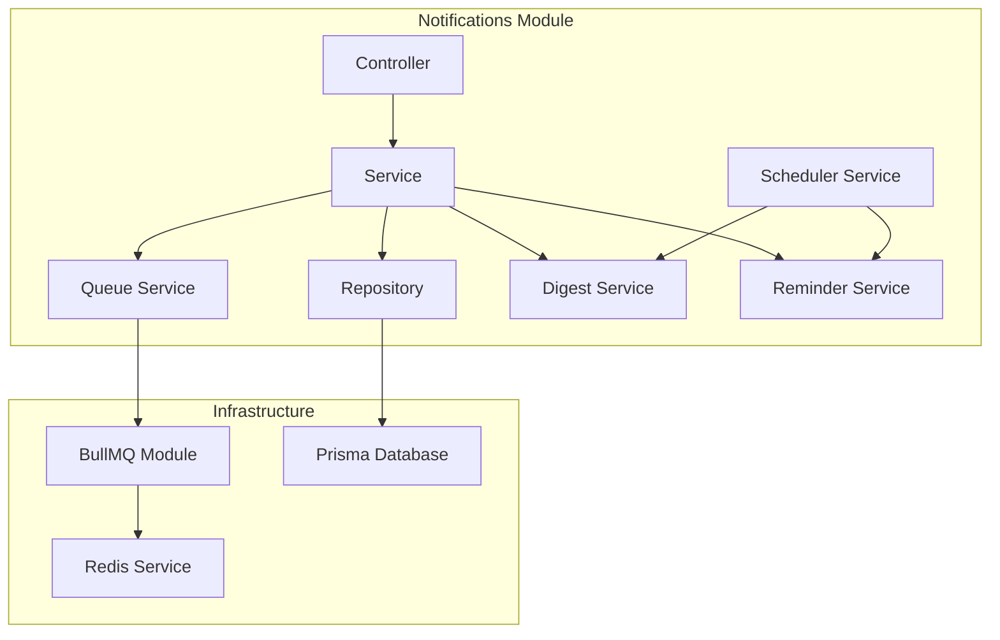
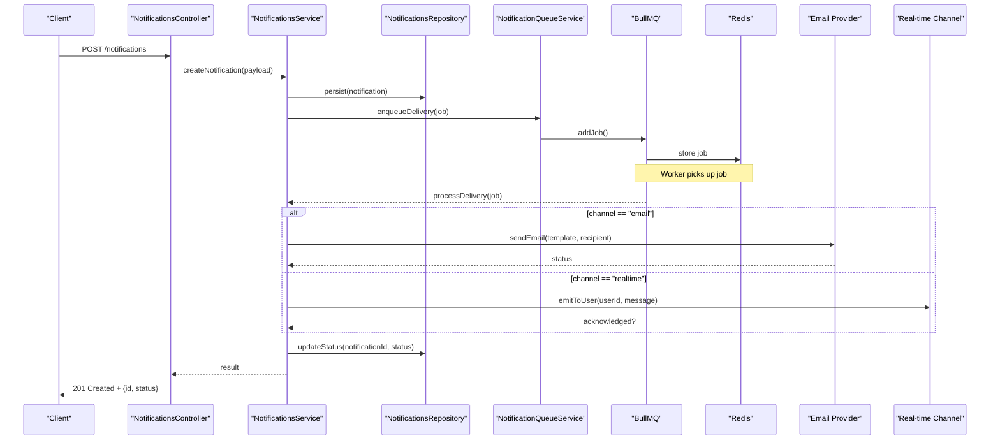
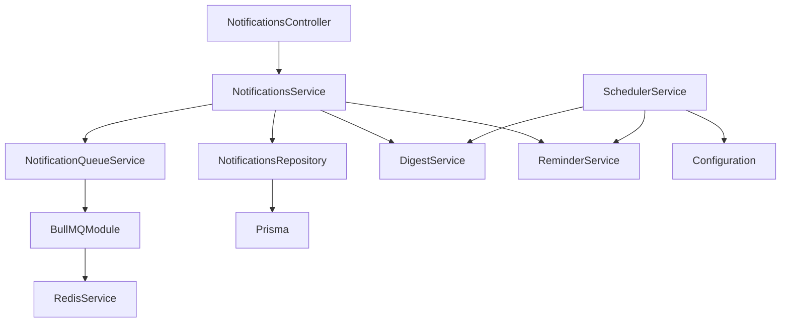

# Notifications API

<cite>
**Referenced Files in This Document**
- [notifications.controller.ts](file://apps/backend/src/notifications/notifications.controller.ts)
- [notifications.service.ts](file://apps/backend/src/notifications/notifications.service.ts)
- [notifications.repository.ts](file://apps/backend/src/notifications/notifications.repository.ts)
- [notification-queue.service.ts](file://apps/backend/src/notifications/notification-queue.service.ts)
- [digest.service.ts](file://apps/backend/src/notifications/digest.service.ts)
- [reminder.service.ts](file://apps/backend/src/notifications/reminder.service.ts)
- [scheduler.service.ts](file://apps/backend/src/notifications/scheduler.service.ts)
- [bullmq.module.ts](file://apps/backend/src/bullmq/bullmq.module.ts)
- [redis.service.ts](file://apps/backend/src/redis/redis.service.ts)
- [configuration.ts](file://apps/backend/src/config/configuration.ts)
- [env.validation.ts](file://apps/backend/src/config/env.validation.ts)
- [schema.prisma](file://apps/backend/prisma/schema.prisma)
</cite>

## Table of Contents
1. [Introduction](#introduction)
2. [Project Structure](#project-structure)
3. [Core Components](#core-components)
4. [Architecture Overview](#architecture-overview)
5. [Detailed Component Analysis](#detailed-component-analysis)
6. [Dependency Analysis](#dependency-analysis)
7. [Performance Considerations](#performance-considerations)
8. [Troubleshooting Guide](#troubleshooting-guide)
9. [Conclusion](#conclusion)
10. [Appendices](#appendices)

## Introduction
This document provides comprehensive API documentation for the notification management subsystem. It covers real-time notifications, email delivery, digest scheduling, and reminder systems. It also specifies how to create notifications, manage delivery channels, configure user preferences, perform batch operations, track delivery status, unsubscribe users, and manage templates across different notification types.

The backend is implemented with a modular NestJS architecture using a queue-based processing pipeline (BullMQ/Redis), a repository layer for persistence, and dedicated services for digests and reminders. The database schema defines core entities related to notifications and their lifecycle.

## Project Structure
The notifications feature is organized under apps/backend/src/notifications with clear separation of concerns:
- Controller exposes HTTP endpoints for creating, querying, and managing notifications and preferences.
- Service orchestrates business logic, including dispatching to queues and handling digests/reminders.
- Repository abstracts data access for notifications and related entities.
- Queue service integrates with BullMQ for background job processing.
- Digest and reminder services implement scheduled and event-driven notification workflows.
- Scheduler service manages recurring tasks.

**Diagram sources**
- [notifications.controller.ts](file://apps/backend/src/notifications/notifications.controller.ts)
- [notifications.service.ts](file://apps/backend/src/notifications/notifications.service.ts)
- [notifications.repository.ts](file://apps/backend/src/notifications/notifications.repository.ts)
- [notification-queue.service.ts](file://apps/backend/src/notifications/notification-queue.service.ts)
- [digest.service.ts](file://apps/backend/src/notifications/digest.service.ts)
- [reminder.service.ts](file://apps/backend/src/notifications/reminder.service.ts)
- [scheduler.service.ts](file://apps/backend/src/notifications/scheduler.service.ts)
- [bullmq.module.ts](file://apps/backend/src/bullmq/bullmq.module.ts)
- [redis.service.ts](file://apps/backend/src/redis/redis.service.ts)
- [schema.prisma](file://apps/backend/prisma/schema.prisma)

**Section sources**
- [notifications.controller.ts](file://apps/backend/src/notifications/notifications.controller.ts)
- [notifications.service.ts](file://apps/backend/src/notifications/notifications.service.ts)
- [notifications.repository.ts](file://apps/backend/src/notifications/notifications.repository.ts)
- [notification-queue.service.ts](file://apps/backend/src/notifications/notification-queue.service.ts)
- [digest.service.ts](file://apps/backend/src/notifications/digest.service.ts)
- [reminder.service.ts](file://apps/backend/src/notifications/reminder.service.ts)
- [scheduler.service.ts](file://apps/backend/src/notifications/scheduler.service.ts)
- [bullmq.module.ts](file://apps/backend/src/bullmq/bullmq.module.ts)
- [redis.service.ts](file://apps/backend/src/redis/redis.service.ts)
- [schema.prisma](file://apps/backend/prisma/schema.prisma)

## Core Components
- Controller: Defines REST endpoints for notification CRUD, preference updates, unsubscribe actions, and batch operations.
- Service: Implements orchestration for creating notifications, routing to channels, scheduling digests/reminders, and tracking delivery status.
- Repository: Encapsulates persistence operations for notifications, preferences, and related entities.
- Queue Service: Enqueues jobs for async delivery via BullMQ and Redis.
- Digest Service: Aggregates notifications into periodic summaries based on schedules and user preferences.
- Reminder Service: Generates and sends reminders triggered by events or timers.
- Scheduler Service: Manages cron-like tasks for digests and reminders.

Key responsibilities:
- Notification creation with channel selection (real-time, email).
- Preference management per user/channel.
- Batch creation and bulk updates.
- Delivery status tracking and retry policies.
- Unsubscribe mechanisms per channel and type.
- Template resolution and rendering for emails and real-time messages.

**Section sources**
- [notifications.controller.ts](file://apps/backend/src/notifications/notifications.controller.ts)
- [notifications.service.ts](file://apps/backend/src/notifications/notifications.service.ts)
- [notifications.repository.ts](file://apps/backend/src/notifications/notifications.repository.ts)
- [notification-queue.service.ts](file://apps/backend/src/notifications/notification-queue.service.ts)
- [digest.service.ts](file://apps/backend/src/notifications/digest.service.ts)
- [reminder.service.ts](file://apps/backend/src/notifications/reminder.service.ts)
- [scheduler.service.ts](file://apps/backend/src/notifications/scheduler.service.ts)

## Architecture Overview
The notification system follows an event-driven, queue-backed architecture:
- HTTP requests hit the controller, which delegates to the service.
- The service validates inputs, resolves templates, checks user preferences, and persists notification records.
- For asynchronous delivery, jobs are enqueued via the queue service using BullMQ and processed by workers backed by Redis.
- Digest and reminder services run on schedules to aggregate and send notifications at defined intervals.
- Delivery status is updated through job callbacks and persisted via the repository.

**Diagram sources**
- [notifications.controller.ts](file://apps/backend/src/notifications/notifications.controller.ts)
- [notifications.service.ts](file://apps/backend/src/notifications/notifications.service.ts)
- [notifications.repository.ts](file://apps/backend/src/notifications/notifications.repository.ts)
- [notification-queue.service.ts](file://apps/backend/src/notifications/notification-queue.service.ts)
- [bullmq.module.ts](file://apps/backend/src/bullmq/bullmq.module.ts)
- [redis.service.ts](file://apps/backend/src/redis/redis.service.ts)

## Detailed Component Analysis

### Notifications Controller
Responsibilities:
- Expose endpoints for creating notifications, retrieving user notifications, updating preferences, unsubscribing, and batch operations.
- Validate request payloads and map DTOs to service methods.
- Return standardized responses with status codes and error details.

Typical endpoints:
- Create notification(s): POST /notifications
- Get notifications (paginated): GET /notifications
- Update user preferences: PATCH /users/:userId/preferences
- Unsubscribe from channel/type: POST /users/:userId/unsubscribe
- Batch operations: POST /notifications/batch

Error handling:
- Validation errors return 400 with structured error objects.
- Unauthorized or forbidden requests return 401/403.
- Not found returns 404; internal errors return 500.

**Section sources**
- [notifications.controller.ts](file://apps/backend/src/notifications/notifications.controller.ts)

### Notifications Service
Responsibilities:
- Orchestrate notification lifecycle: validation, template resolution, preference checks, persistence, and delivery routing.
- Manage real-time and email delivery strategies.
- Track and update delivery statuses.
- Coordinate with digest and reminder services for scheduled deliveries.

Key behaviors:
- Create single or batch notifications with idempotency support where applicable.
- Resolve templates based on notification type and locale.
- Respect user preferences and unsubscribe flags before sending.
- Enqueue delivery jobs asynchronously when needed.

**Section sources**
- [notifications.service.ts](file://apps/backend/src/notifications/notifications.service.ts)

### Notifications Repository
Responsibilities:
- Persist notifications, preferences, and related entities.
- Provide query methods for retrieval, filtering, and pagination.
- Update delivery status and metadata.

Data model highlights:
- Notification entity includes fields such as id, userId, type, payload, channel, status, createdAt, updatedAt, and optional metadata.
- Preferences entity stores per-user channel toggles and subscription flags.

**Section sources**
- [notifications.repository.ts](file://apps/backend/src/notifications/notifications.repository.ts)
- [schema.prisma](file://apps/backend/prisma/schema.prisma)

### Notification Queue Service
Responsibilities:
- Integrate with BullMQ to enqueue delivery jobs.
- Configure job priorities, retries, and delays.
- Handle job completion and failure callbacks to update status.

Integration points:
- Uses Redis for job storage and worker coordination.
- Supports concurrency limits and backoff strategies.

**Section sources**
- [notification-queue.service.ts](file://apps/backend/src/notifications/notification-queue.service.ts)
- [bullmq.module.ts](file://apps/backend/src/bullmq/bullmq.module.ts)
- [redis.service.ts](file://apps/backend/src/redis/redis.service.ts)

### Digest Service
Responsibilities:
- Aggregate notifications into periodic summaries based on schedules and user preferences.
- Render digest templates and deliver via selected channels.
- Ensure idempotent digest generation to avoid duplicates.

Scheduling:
- Triggered by scheduler service at configured intervals.
- Respects user preferences for frequency and channels.

**Section sources**
- [digest.service.ts](file://apps/backend/src/notifications/digest.service.ts)
- [scheduler.service.ts](file://apps/backend/src/notifications/scheduler.service.ts)

### Reminder Service
Responsibilities:
- Generate reminders triggered by events or timers.
- Apply user-specific rules and preferences.
- Deliver reminders via appropriate channels.

Event integration:
- Subscribes to domain events to trigger reminders.
- Supports delayed execution and retry policies.

**Section sources**
- [reminder.service.ts](file://apps/backend/src/notifications/reminder.service.ts)
- [scheduler.service.ts](file://apps/backend/src/notifications/scheduler.service.ts)

### Scheduler Service
Responsibilities:
- Manage recurring tasks for digests and reminders.
- Configure cron expressions and environment-based settings.
- Ensure robust scheduling with failover and logging.

Configuration:
- Reads schedule settings from configuration module.
- Validates environment variables for safe operation.

**Section sources**
- [scheduler.service.ts](file://apps/backend/src/notifications/scheduler.service.ts)
- [configuration.ts](file://apps/backend/src/config/configuration.ts)
- [env.validation.ts](file://apps/backend/src/config/env.validation.ts)

## Dependency Analysis
The notifications module depends on:
- BullMQ module for job queuing.
- Redis service for queue backend.
- Prisma for database persistence.
- Configuration module for runtime settings.

**Diagram sources**
- [notifications.controller.ts](file://apps/backend/src/notifications/notifications.controller.ts)
- [notifications.service.ts](file://apps/backend/src/notifications/notifications.service.ts)
- [notifications.repository.ts](file://apps/backend/src/notifications/notifications.repository.ts)
- [notification-queue.service.ts](file://apps/backend/src/notifications/notification-queue.service.ts)
- [digest.service.ts](file://apps/backend/src/notifications/digest.service.ts)
- [reminder.service.ts](file://apps/backend/src/notifications/reminder.service.ts)
- [scheduler.service.ts](file://apps/backend/src/notifications/scheduler.service.ts)
- [bullmq.module.ts](file://apps/backend/src/bullmq/bullmq.module.ts)
- [redis.service.ts](file://apps/backend/src/redis/redis.service.ts)
- [configuration.ts](file://apps/backend/src/config/configuration.ts)

**Section sources**
- [notifications.controller.ts](file://apps/backend/src/notifications/notifications.controller.ts)
- [notifications.service.ts](file://apps/backend/src/notifications/notifications.service.ts)
- [notifications.repository.ts](file://apps/backend/src/notifications/notifications.repository.ts)
- [notification-queue.service.ts](file://apps/backend/src/notifications/notification-queue.service.ts)
- [digest.service.ts](file://apps/backend/src/notifications/digest.service.ts)
- [reminder.service.ts](file://apps/backend/src/notifications/reminder.service.ts)
- [scheduler.service.ts](file://apps/backend/src/notifications/scheduler.service.ts)
- [bullmq.module.ts](file://apps/backend/src/bullmq/bullmq.module.ts)
- [redis.service.ts](file://apps/backend/src/redis/redis.service.ts)
- [configuration.ts](file://apps/backend/src/config/configuration.ts)

## Performance Considerations
- Use asynchronous delivery via BullMQ to avoid blocking HTTP responses.
- Implement batching for high-volume notification creation to reduce overhead.
- Configure retry policies with exponential backoff for transient failures.
- Cache frequently accessed templates and user preferences to minimize lookup costs.
- Monitor queue depth and worker throughput to prevent bottlenecks.
- Optimize database queries with proper indexing on userId, type, and status fields.

[No sources needed since this section provides general guidance]

## Troubleshooting Guide
Common issues and resolutions:
- Queue backlog: Check Redis connectivity and worker health; scale workers if necessary.
- Delivery failures: Inspect job logs and retry counts; validate template rendering and provider credentials.
- Missing notifications: Verify persistence and status updates; ensure idempotency keys are handled correctly.
- Preference mismatches: Confirm user preference records and unsubscribe flags; audit recent changes.
- Schedule misfires: Review cron expressions and environment configurations; verify scheduler service uptime.

Operational tips:
- Enable detailed logging for queue jobs and delivery attempts.
- Implement health checks for Redis, BullMQ workers, and external providers.
- Use metrics to track delivery success rates and latency.

**Section sources**
- [notification-queue.service.ts](file://apps/backend/src/notifications/notification-queue.service.ts)
- [redis.service.ts](file://apps/backend/src/redis/redis.service.ts)
- [configuration.ts](file://apps/backend/src/config/configuration.ts)
- [env.validation.ts](file://apps/backend/src/config/env.validation.ts)

## Conclusion
The notification management subsystem provides a robust, scalable foundation for delivering real-time and email notifications, supported by digest and reminder systems. Its modular design, queue-based processing, and clear separation of concerns enable reliable delivery, flexible preferences, and efficient batch operations. Proper configuration, monitoring, and optimization ensure high availability and performance under load.

[No sources needed since this section summarizes without analyzing specific files]

## Appendices

### API Endpoints Summary
- Create notification(s): POST /notifications
- Retrieve notifications: GET /notifications?userId=&type=&status=&page=&limit=
- Update preferences: PATCH /users/:userId/preferences
- Unsubscribe: POST /users/:userId/unsubscribe
- Batch operations: POST /notifications/batch

### Notification Schema Highlights
- Fields: id, userId, type, payload, channel, status, createdAt, updatedAt, metadata
- Status values: pending, sent, failed, delivered, bounced, unsubscribed
- Channels: realtime, email
- Types: system, user-generated, digest, reminder

### Delivery Status Tracking
- Real-time: Acknowledged upon client receipt; fallback to queued retry if not acknowledged.
- Email: Provider callbacks update status to sent, delivered, bounced, or failed.
- Persistence: All status transitions recorded with timestamps and error details.

### Unsubscribe Mechanisms
- Per-channel unsubscribe: Users can opt out of specific channels (e.g., email).
- Per-type unsubscribe: Users can disable specific notification types.
- Global unsubscribe: Immediate deactivation of all notifications for a user.

### Template Management
- Templates keyed by type and locale.
- Dynamic content injection via payload variables.
- Fallback templates for missing variants.

**Section sources**
- [notifications.controller.ts](file://apps/backend/src/notifications/notifications.controller.ts)
- [notifications.service.ts](file://apps/backend/src/notifications/notifications.service.ts)
- [notifications.repository.ts](file://apps/backend/src/notifications/notifications.repository.ts)
- [schema.prisma](file://apps/backend/prisma/schema.prisma)