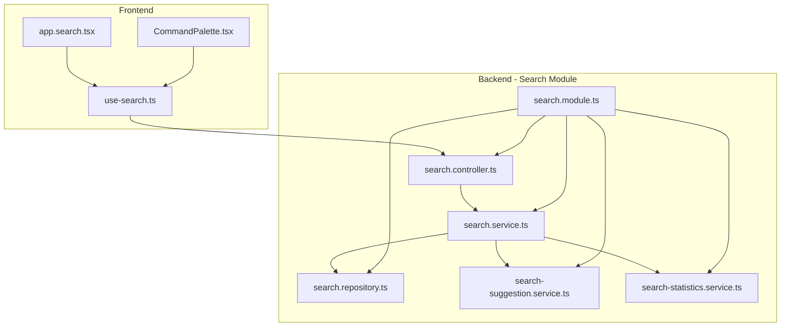
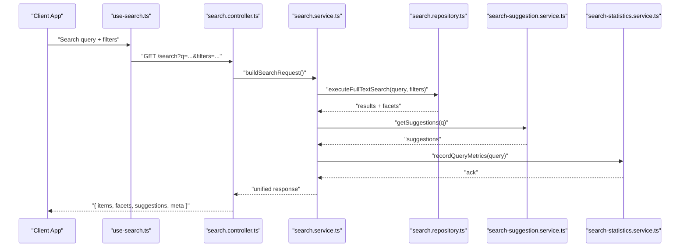
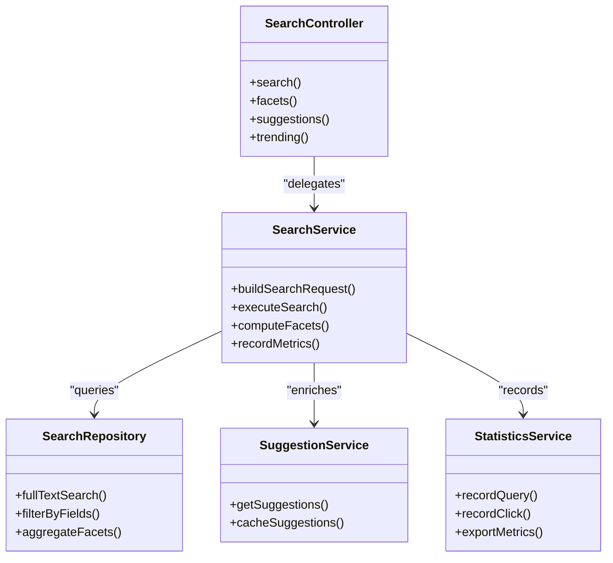

# Search & Discovery API

<cite>
**Referenced Files in This Document**
- [search.controller.ts](file://apps/backend/src/search/search.controller.ts)
- [search.service.ts](file://apps/backend/src/search/search.service.ts)
- [search.repository.ts](file://apps/backend/src/search/search.repository.ts)
- [search-suggestion.service.ts](file://apps/backend/src/search/search-suggestion.service.ts)
- [search-statistics.service.ts](file://apps/backend/src/search/search-statistics.service.ts)
- [search.module.ts](file://apps/backend/src/search/search.module.ts)
- [use-search.ts](file://src/hooks/use-search.ts)
- [CommandPalette.tsx](file://src/components/search/CommandPalette.tsx)
- [app.search.tsx](file://src/routes/app.search.tsx)
</cite>

## Table of Contents
1. [Introduction](#introduction)
2. [Project Structure](#project-structure)
3. [Core Components](#core-components)
4. [Architecture Overview](#architecture-overview)
5. [Detailed Component Analysis](#detailed-component-analysis)
6. [Dependency Analysis](#dependency-analysis)
7. [Performance Considerations](#performance-considerations)
8. [Troubleshooting Guide](#troubleshooting-guide)
9. [Conclusion](#conclusion)
10. [Appendices](#appendices)

## Introduction
This document provides comprehensive API documentation for the Search and Discovery features, including full-text search across media, journals, and collections; advanced filtering; faceted search; autocomplete suggestions; and trending content discovery. It explains query syntax, result ranking behavior, suggestion engine usage, and performance optimization techniques for large datasets.

## Project Structure
The search and discovery functionality is implemented in a NestJS backend module with dedicated controller, service, repository, and supporting services for suggestions and statistics. The frontend integrates via hooks and components that call these endpoints.

**Diagram sources**
- [search.controller.ts](file://apps/backend/src/search/search.controller.ts)
- [search.service.ts](file://apps/backend/src/search/search.service.ts)
- [search.repository.ts](file://apps/backend/src/search/search.repository.ts)
- [search-suggestion.service.ts](file://apps/backend/src/search/search-suggestion.service.ts)
- [search-statistics.service.ts](file://apps/backend/src/search/search-statistics.service.ts)
- [search.module.ts](file://apps/backend/src/search/search.module.ts)
- [use-search.ts](file://src/hooks/use-search.ts)
- [CommandPalette.tsx](file://src/components/search/CommandPalette.tsx)
- [app.search.tsx](file://src/routes/app.search.tsx)

**Section sources**
- [search.controller.ts](file://apps/backend/src/search/search.controller.ts)
- [search.service.ts](file://apps/backend/src/search/search.service.ts)
- [search.repository.ts](file://apps/backend/src/search/search.repository.ts)
- [search-suggestion.service.ts](file://apps/backend/src/search/search-suggestion.service.ts)
- [search-statistics.service.ts](file://apps/backend/src/search/search-statistics.service.ts)
- [search.module.ts](file://apps/backend/src/search/search.module.ts)
- [use-search.ts](file://src/hooks/use-search.ts)
- [CommandPalette.tsx](file://src/components/search/CommandPalette.tsx)
- [app.search.tsx](file://src/routes/app.search.tsx)

## Core Components
- Controller: Exposes REST endpoints for search queries, filters, facets, suggestions, and trending results.
- Service: Orchestrates search logic, applies filters and faceting, coordinates suggestions and analytics.
- Repository: Executes optimized queries against the data store (e.g., Prisma or external search index).
- Suggestion Service: Provides autocomplete and predictive suggestions based on recent queries and popular terms.
- Statistics Service: Tracks search metrics such as query volume, zero-result queries, and click-throughs.

Key responsibilities:
- Full-text search across media, journals, and collections with unified result schema.
- Advanced filtering by metadata fields (type, date range, tags, status, etc.).
- Faceted search to compute counts per category for UI-driven refinement.
- Autocomplete suggestions with debounce and caching.
- Trending discovery based on popularity signals and recency.

**Section sources**
- [search.controller.ts](file://apps/backend/src/search/search.controller.ts)
- [search.service.ts](file://apps/backend/src/search/search.service.ts)
- [search.repository.ts](file://apps/backend/src/search/search.repository.ts)
- [search-suggestion.service.ts](file://apps/backend/src/search/search-suggestion.service.ts)
- [search-statistics.service.ts](file://apps/backend/src/search/search-statistics.service.ts)

## Architecture Overview
The search pipeline processes user requests through the controller into the service layer, which delegates to the repository for data retrieval and to suggestion/statistics services for enrichment and analytics.

**Diagram sources**
- [search.controller.ts](file://apps/backend/src/search/search.controller.ts)
- [search.service.ts](file://apps/backend/src/search/search.service.ts)
- [search.repository.ts](file://apps/backend/src/search/search.repository.ts)
- [search-suggestion.service.ts](file://apps/backend/src/search/search-suggestion.service.ts)
- [search-statistics.service.ts](file://apps/backend/src/search/search-statistics.service.ts)
- [use-search.ts](file://src/hooks/use-search.ts)

## Detailed Component Analysis

### Search Controller
Responsibilities:
- Define endpoints for search, facets, suggestions, and trending.
- Validate and normalize request parameters.
- Return standardized responses with pagination and metadata.

Typical endpoints:
- GET /search: Full-text search with filters and pagination.
- GET /search/facets: Compute facet counts for given query and filters.
- GET /search/suggestions: Autocomplete suggestions for partial queries.
- GET /search/trending: Discover trending items across media, journals, and collections.

Request/response patterns:
- Query parameters include q (text), type, dateFrom, dateTo, tags, status, sort, page, limit.
- Response includes items array, facets object, suggestions array, and meta with total count and pagination info.

Error handling:
- Returns appropriate HTTP status codes for invalid inputs and internal errors.
- Includes structured error messages for client-side feedback.

**Section sources**
- [search.controller.ts](file://apps/backend/src/search/search.controller.ts)

### Search Service
Responsibilities:
- Build search queries from request parameters.
- Apply filters and sorting rules.
- Aggregate results across media, journals, and collections.
- Compute facets and suggestions.
- Record search analytics.

Processing logic:
- Normalizes text input, tokenizes, and constructs full-text predicates.
- Applies field-level filters (type, date ranges, tags, status).
- Ranks results using relevance scoring combining text match quality, recency, and popularity.
- Delegates data access to repository and enriches with suggestions and metrics.

Optimization strategies:
- Uses indexed fields for common filters.
- Limits deep pagination with cursor-based alternatives when available.
- Caches frequent facets and suggestions.

**Section sources**
- [search.service.ts](file://apps/backend/src/search/search.service.ts)

### Search Repository
Responsibilities:
- Execute optimized queries against the data store.
- Support full-text search predicates and filter combinations.
- Provide facet aggregation and result projection.

Data access patterns:
- Full-text search across title, description, tags, and journal entries.
- Filtered queries with indexes on frequently used fields.
- Aggregation queries for facets grouped by type, tag, date bucket, and status.

Complexity considerations:
- Time complexity depends on index coverage and query selectivity.
- Space complexity minimized by projecting only necessary fields.

**Section sources**
- [search.repository.ts](file://apps/backend/src/search/search.repository.ts)

### Suggestion Service
Responsibilities:
- Generate autocomplete suggestions based on partial queries.
- Incorporate recent searches, popular terms, and contextual hints.
- Cache suggestions to reduce latency.

Algorithm highlights:
- Prefix matching with fuzzy tolerance.
- Weighting by frequency and recency.
- Deduplication and normalization of suggestions.

Integration points:
- Called during search initialization and on each keystroke with debounce.
- Feeds trending discovery by highlighting high-frequency terms.

**Section sources**
- [search-suggestion.service.ts](file://apps/backend/src/search/search-suggestion.service.ts)

### Statistics Service
Responsibilities:
- Track search query volumes, zero-result rates, and click-throughs.
- Provide insights for tuning ranking and suggestions.
- Export metrics for dashboards and alerts.

Metrics captured:
- Query count by time window.
- Top queries and missing terms.
- Result engagement signals.

**Section sources**
- [search-statistics.service.ts](file://apps/backend/src/search/search-statistics.service.ts)

### Frontend Integration
- use-search.ts: Encapsulates API calls, debouncing, caching, and state management for search interactions.
- CommandPalette.tsx: Provides keyboard-driven search entry, showing suggestions and quick navigation.
- app.search.tsx: Renders search results, facets, and trending sections.

User flows:
- Typing triggers debounced suggestion fetches.
- Submitting a query executes full-text search with filters.
- Clicking a result navigates to detail view and records interaction metrics.

**Section sources**
- [use-search.ts](file://src/hooks/use-search.ts)
- [CommandPalette.tsx](file://src/components/search/CommandPalette.tsx)
- [app.search.tsx](file://src/routes/app.search.tsx)

## Dependency Analysis
The search module composes multiple services to deliver a cohesive experience. The controller depends on the service; the service depends on repository, suggestion, and statistics services; the module wires them together.

**Diagram sources**
- [search.controller.ts](file://apps/backend/src/search/search.controller.ts)
- [search.service.ts](file://apps/backend/src/search/search.service.ts)
- [search.repository.ts](file://apps/backend/src/search/search.repository.ts)
- [search-suggestion.service.ts](file://apps/backend/src/search/search-suggestion.service.ts)
- [search-statistics.service.ts](file://apps/backend/src/search/search-statistics.service.ts)

**Section sources**
- [search.module.ts](file://apps/backend/src/search/search.module.ts)

## Performance Considerations
- Indexing: Ensure full-text indexes on searchable fields and secondary indexes on filter columns (type, tags, date fields).
- Pagination: Prefer cursor-based pagination for large result sets; avoid deep offset queries.
- Caching: Cache frequent facets and suggestions; implement cache invalidation on content updates.
- Debounce: Apply client-side debounce for suggestion queries to reduce load.
- Projection: Return only necessary fields to minimize payload size.
- Query Optimization: Use selective filters early to narrow result sets; avoid wildcard-heavy queries.
- Rate Limiting: Protect endpoints against abuse and ensure fair resource allocation.

[No sources needed since this section provides general guidance]

## Troubleshooting Guide
Common issues and resolutions:
- Zero results: Check query tokenization, filter constraints, and indexing status. Verify field mappings and case sensitivity.
- Slow queries: Analyze query plans, add missing indexes, and simplify complex filter combinations.
- Stale suggestions: Clear suggestion cache after content updates; verify TTL settings.
- High error rates: Inspect validation logic in controller and service; log malformed requests.

Operational tips:
- Enable detailed logging for search queries and durations.
- Monitor statistics service metrics for anomalies.
- Use health checks to validate search index availability.

**Section sources**
- [search.controller.ts](file://apps/backend/src/search/search.controller.ts)
- [search.service.ts](file://apps/backend/src/search/search.service.ts)
- [search-statistics.service.ts](file://apps/backend/src/search/search-statistics.service.ts)

## Conclusion
The Search & Discovery API delivers robust full-text search across media, journals, and collections with advanced filtering, faceted search, autocomplete suggestions, and trending discovery. By leveraging indexed queries, caching, and analytics, it ensures responsive performance and actionable insights. Follow the guidelines in this document to integrate effectively and optimize for scale.

[No sources needed since this section summarizes without analyzing specific files]

## Appendices

### Search Query Syntax
- Text query (q): Supports natural language tokens; uses full-text matching across title, description, and tags.
- Filters:
  - type: media | journal | collection
  - dateFrom/dateTo: ISO 8601 dates
  - tags: comma-separated list
  - status: active | archived | draft
- Sorting:
  - sortBy: relevance | date | popularity
  - sortOrder: asc | desc
- Pagination:
  - page: integer
  - limit: integer (max enforced server-side)

Example formats:
- Basic search: GET /search?q=adventure&type=media&sort=relevance&page=1&limit=20
- Date-filtered: GET /search?q=thriller&dateFrom=2024-01-01&dateTo=2024-12-31
- Tagged: GET /search?q=mystery&tags=suspense,clue

### Result Schema
- items: Array of unified result objects containing id, type, title, summary, metadata, and score.
- facets: Object with counts grouped by categories (type, tags, date buckets, status).
- suggestions: Array of suggested queries/terms.
- meta: Object with total count, current page, limit, and next cursor if applicable.

### Ranking Algorithm
- Relevance score combines:
  - Text match quality (term frequency, proximity).
  - Recency boost (newer items slightly favored).
  - Popularity signal (views, interactions).
- Sorting options allow overriding default relevance with date or popularity.

### Suggestion Engine
- Inputs: Partial query string, recent searches, popular terms.
- Outputs: Ranked suggestions with weights.
- Behavior: Debounced client calls; cached responses; deduplicated and normalized.

### Trending Content Discovery
- Signals: Frequency of views, interactions, and recency.
- Scope: Global or scoped by user context if authenticated.
- Output: Curated list of trending items across types.

### Performance Optimization Techniques
- Use targeted filters early to reduce dataset size.
- Avoid overly broad wildcards in text queries.
- Implement cursor-based pagination for large datasets.
- Cache facets and suggestions aggressively with appropriate TTL.
- Monitor and tune indexes based on query patterns.

[No sources needed since this section provides general guidance]