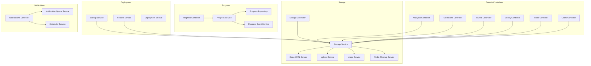
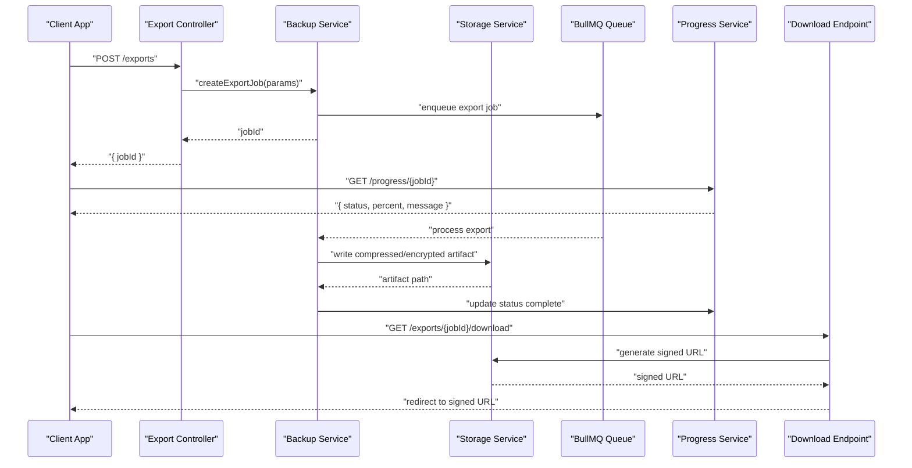
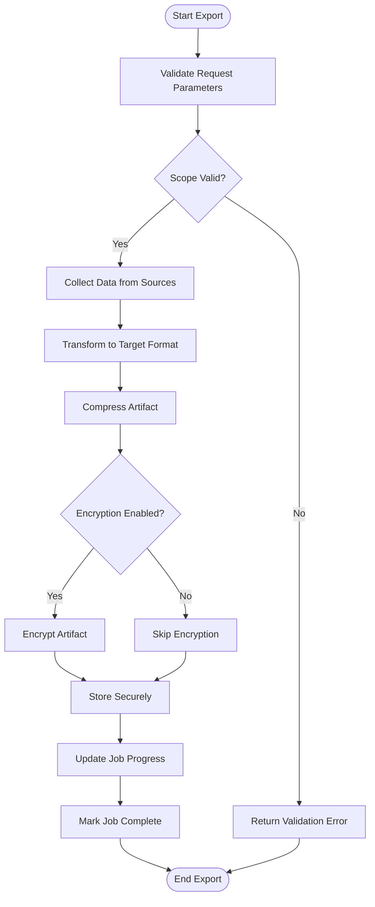
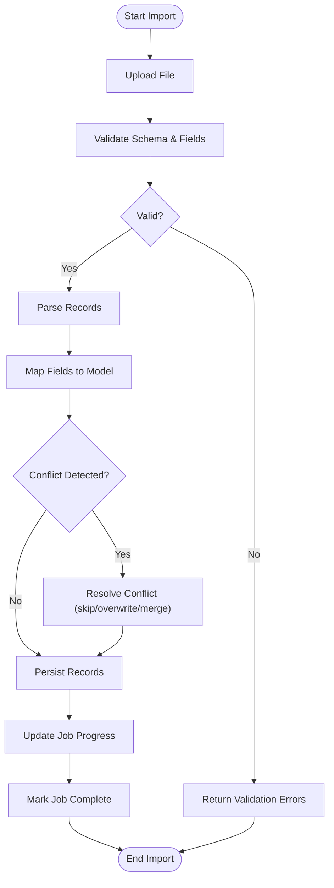
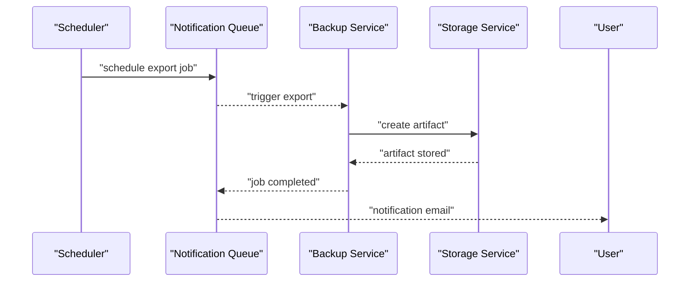
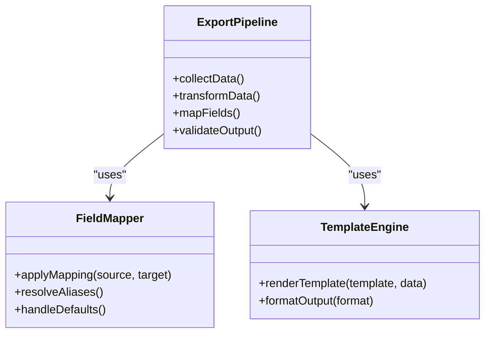
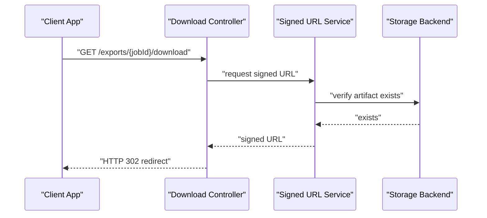
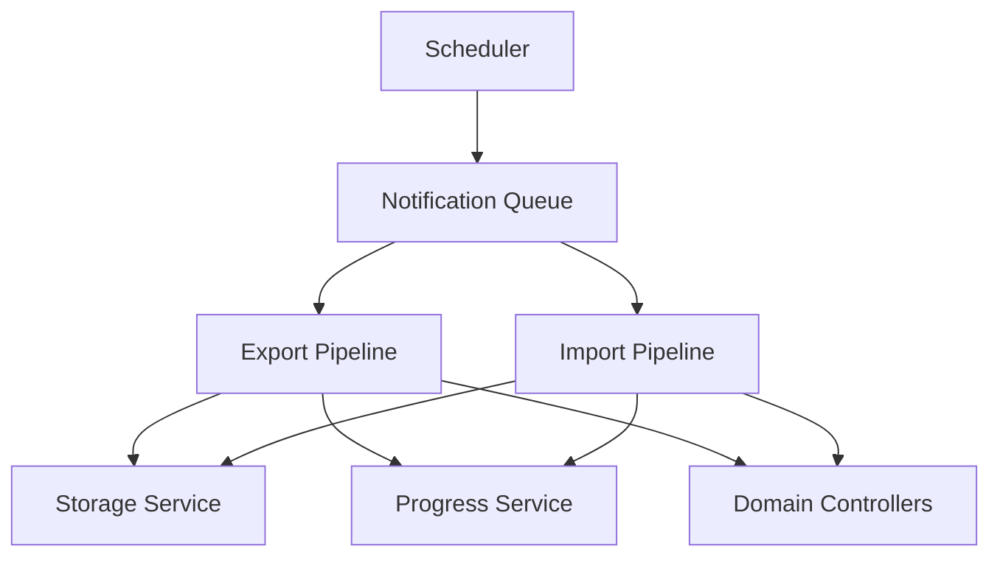

# Data Export & Import

<cite>
**Referenced Files in This Document**
- [backup.service.ts](file://apps/backend/src/deployment/backup.service.ts)
- [restore.service.ts](file://apps/backend/src/deployment/restore.service.ts)
- [deployment.module.ts](file://apps/backend/src/deployment/deployment.module.ts)
- [index.ts](file://apps/backend/src/deployment/index.ts)
- [storage.controller.ts](file://apps/backend/src/storage/storage.controller.ts)
- [storage.service.ts](file://apps/backend/src/storage/storage.service.ts)
- [signed-url.service.ts](file://apps/backend/src/storage/signed-url.service.ts)
- [upload.service.ts](file://apps/backend/src/storage/upload.service.ts)
- [media-cleanup.service.ts](file://apps/backend/src/storage/media-cleanup.service.ts)
- [image-service.ts](file://apps/backend/src/storage/image.service.ts)
- [bullmq.module.ts](file://apps/backend/src/bullmq/bullmq.module.ts)
- [progress.controller.ts](file://apps/backend/src/progress/progress.controller.ts)
- [progress.service.ts](file://apps/backend/src/progress/progress.service.ts)
- [progress.repository.ts](file://apps/backend/src/progress/progress.repository.ts)
- [progress-event.service.ts](file://apps/backend/src/progress/progress-event.service.ts)
- [analytics.controller.ts](file://apps/backend/src/analytics/analytics.controller.ts)
- [analytics.service.ts](file://apps/backend/src/analytics/analytics.service.ts)
- [collections.controller.ts](file://apps/backend/src/collections/collections.controller.ts)
- [journal.controller.ts](file://apps/backend/src/journal/journal.controller.ts)
- [library.controller.ts](file://apps/backend/src/library/library.controller.ts)
- [media.controller.ts](file://apps/backend/src/media/media.controller.ts)
- [users.controller.ts](file://apps/backend/src/users/users.controller.ts)
- [notifications.controller.ts](file://apps/backend/src/notifications/notifications.controller.ts)
- [scheduler.service.ts](file://apps/backend/src/notifications/scheduler.service.ts)
- [notification-queue.service.ts](file://apps/backend/src/notifications/notification-queue.service.ts)
- [backup.sh](file://apps/backend/scripts/backup.sh)
- [DISASTER_RECOVERY.md](file://docs/DISASTER_RECOVERY.md)
- [BACKUP.md](file://docs/BACKUP.md)
</cite>

## Table of Contents
1. [Introduction](#introduction)
2. [Project Structure](#project-structure)
3. [Core Components](#core-components)
4. [Architecture Overview](#architecture-overview)
5. [Detailed Component Analysis](#detailed-component-analysis)
6. [Dependency Analysis](#dependency-analysis)
7. [Performance Considerations](#performance-considerations)
8. [Troubleshooting Guide](#troubleshooting-guide)
9. [Conclusion](#conclusion)
10. [Appendices](#appendices)

## Introduction
This document provides comprehensive API documentation for user data export and import functionality across the platform. It covers supported export formats (JSON, CSV, PDF), bulk import capabilities, format validation, conflict resolution strategies, progress tracking, download link generation, scheduled exports, automated backups, disaster recovery procedures, and security considerations including compression, encryption during transfer, and secure storage.

The backend is built with NestJS and leverages a modular architecture with dedicated services for storage, progress tracking, analytics, collections, journal entries, media, users, and notifications. Queuing and scheduling are handled via BullMQ, while Prisma manages persistence.

## Project Structure
Export and import features span multiple modules:
- Deployment module: backup and restore orchestration
- Storage module: file upload, signed URL generation, image processing, cleanup
- Progress module: job progress tracking and events
- Analytics, Collections, Journal, Library, Media, Users controllers and services: domain data sources
- Notifications module: scheduler and queue integration for automation
- Scripts and docs: operational guidance and automation scripts

**Diagram sources**
- [deployment.module.ts](file://apps/backend/src/deployment/deployment.module.ts)
- [storage.controller.ts](file://apps/backend/src/storage/storage.controller.ts)
- [storage.service.ts](file://apps/backend/src/storage/storage.service.ts)
- [signed-url.service.ts](file://apps/backend/src/storage/signed-url.service.ts)
- [upload.service.ts](file://apps/backend/src/storage/upload.service.ts)
- [media-cleanup.service.ts](file://apps/backend/src/storage/media-cleanup.service.ts)
- [image-service.ts](file://apps/backend/src/storage/image.service.ts)
- [progress.controller.ts](file://apps/backend/src/progress/progress.controller.ts)
- [progress.service.ts](file://apps/backend/src/progress/progress.service.ts)
- [progress.repository.ts](file://apps/backend/src/progress/progress.repository.ts)
- [progress-event.service.ts](file://apps/backend/src/progress/progress-event.service.ts)
- [analytics.controller.ts](file://apps/backend/src/analytics/analytics.controller.ts)
- [collections.controller.ts](file://apps/backend/src/collections/collections.controller.ts)
- [journal.controller.ts](file://apps/backend/src/journal/journal.controller.ts)
- [library.controller.ts](file://apps/backend/src/library/library.controller.ts)
- [media.controller.ts](file://apps/backend/src/media/media.controller.ts)
- [users.controller.ts](file://apps/backend/src/users/users.controller.ts)
- [notifications.controller.ts](file://apps/backend/src/notifications/notifications.controller.ts)
- [scheduler.service.ts](file://apps/backend/src/notifications/scheduler.service.ts)
- [notification-queue.service.ts](file://apps/backend/src/notifications/notification-queue.service.ts)

**Section sources**
- [deployment.module.ts](file://apps/backend/src/deployment/deployment.module.ts)
- [storage.controller.ts](file://apps/backend/src/storage/storage.controller.ts)
- [progress.controller.ts](file://apps/backend/src/progress/progress.controller.ts)
- [notifications.controller.ts](file://apps/backend/src/notifications/notifications.controller.ts)

## Core Components
- Backup Service: orchestrates full or partial data exports, integrates with storage to produce downloadable artifacts.
- Restore Service: handles bulk imports, validates payloads, resolves conflicts, and persists data safely.
- Storage Service: manages file creation, compression, encryption, and secure storage; generates signed URLs for downloads.
- Upload Service: accepts multipart uploads for import files, performs validation and transformation.
- Signed URL Service: issues time-bound, scoped download links for exported artifacts.
- Progress Service and Repository: track long-running export/import jobs, emit events, and expose status endpoints.
- Domain Controllers: provide data sources for export (analytics, collections, journal, library, media, users).
- Scheduler and Notification Queue: enable scheduled exports and automated backups.

Key responsibilities:
- Export pipeline: collect data from domain services, transform into target formats (JSON, CSV, PDF), compress, encrypt, store, and return download links.
- Import pipeline: accept files, validate schema, map fields, resolve conflicts (skip, overwrite, merge), persist changes, and report results.
- Security: enforce authentication/authorization, use HTTPS/TLS, sign URLs, encrypt at rest and in transit where applicable.

**Section sources**
- [backup.service.ts](file://apps/backend/src/deployment/backup.service.ts)
- [restore.service.ts](file://apps/backend/src/deployment/restore.service.ts)
- [storage.service.ts](file://apps/backend/src/storage/storage.service.ts)
- [upload.service.ts](file://apps/backend/src/storage/upload.service.ts)
- [signed-url.service.ts](file://apps/backend/src/storage/signed-url.service.ts)
- [progress.service.ts](file://apps/backend/src/progress/progress.service.ts)
- [progress.repository.ts](file://apps/backend/src/progress/progress.repository.ts)
- [progress-event.service.ts](file://apps/backend/src/progress/progress-event.service.ts)
- [analytics.controller.ts](file://apps/backend/src/analytics/analytics.controller.ts)
- [collections.controller.ts](file://apps/backend/src/collections/collections.controller.ts)
- [journal.controller.ts](file://apps/backend/src/journal/journal.controller.ts)
- [library.controller.ts](file://apps/backend/src/library/library.controller.ts)
- [media.controller.ts](file://apps/backend/src/media/media.controller.ts)
- [users.controller.ts](file://apps/backend/src/users/users.controller.ts)
- [scheduler.service.ts](file://apps/backend/src/notifications/scheduler.service.ts)
- [notification-queue.service.ts](file://apps/backend/src/notifications/notification-queue.service.ts)

## Architecture Overview
The export/import system follows a layered architecture:
- API Layer: Controllers expose endpoints for initiating exports/imports, checking progress, and downloading artifacts.
- Service Layer: Business logic for data collection, transformation, validation, conflict resolution, and orchestration.
- Storage Layer: File operations, compression, encryption, and secure storage with signed URL issuance.
- Persistence Layer: Database interactions via repositories and Prisma.
- Background Jobs: BullMQ queues handle long-running tasks; progress tracked via Redis-backed repository.

**Diagram sources**
- [backup.service.ts](file://apps/backend/src/deployment/backup.service.ts)
- [storage.service.ts](file://apps/backend/src/storage/storage.service.ts)
- [progress.service.ts](file://apps/backend/src/progress/progress.service.ts)
- [bullmq.module.ts](file://apps/backend/src/bullmq/bullmq.module.ts)

**Section sources**
- [backup.service.ts](file://apps/backend/src/deployment/backup.service.ts)
- [storage.service.ts](file://apps/backend/src/storage/storage.service.ts)
- [progress.service.ts](file://apps/backend/src/progress/progress.service.ts)
- [bullmq.module.ts](file://apps/backend/src/bullmq/bullmq.module.ts)

## Detailed Component Analysis

### Export Pipeline
- Entry points:
  - Create export job via controller endpoint accepting parameters such as format (JSON, CSV, PDF), scope (user data, media collections, journal entries, analytics reports), and filters.
- Processing:
  - Backup service collects data from domain controllers/services.
  - Transform data into requested format using mapping pipelines.
  - Compress output (e.g., gzip/tar) and encrypt if configured.
  - Store artifact securely and record metadata.
- Output:
  - Return job ID for progress polling.
  - Generate signed URL for download upon completion.

**Diagram sources**
- [backup.service.ts](file://apps/backend/src/deployment/backup.service.ts)
- [storage.service.ts](file://apps/backend/src/storage/storage.service.ts)
- [progress.service.ts](file://apps/backend/src/progress/progress.service.ts)

**Section sources**
- [backup.service.ts](file://apps/backend/src/deployment/backup.service.ts)
- [storage.service.ts](file://apps/backend/src/storage/storage.service.ts)
- [progress.service.ts](file://apps/backend/src/progress/progress.service.ts)

### Import Pipeline
- Entry points:
  - Upload import file via multipart form or stream.
  - Specify format (JSON, CSV), mode (bulk insert/update), and conflict strategy (skip, overwrite, merge).
- Processing:
  - Validate schema and field mappings.
  - Parse and transform records.
  - Resolve conflicts based on strategy.
  - Persist changes within transactions where applicable.
- Output:
  - Return import job ID and progress details.
  - Provide error summaries and affected records.

**Diagram sources**
- [upload.service.ts](file://apps/backend/src/storage/upload.service.ts)
- [restore.service.ts](file://apps/backend/src/deployment/restore.service.ts)
- [progress.service.ts](file://apps/backend/src/progress/progress.service.ts)

**Section sources**
- [upload.service.ts](file://apps/backend/src/storage/upload.service.ts)
- [restore.service.ts](file://apps/backend/src/deployment/restore.service.ts)
- [progress.service.ts](file://apps/backend/src/progress/progress.service.ts)

### Scheduled Exports and Automated Backups
- Scheduling:
  - Use scheduler service to define cron expressions for recurring exports.
  - Integrate with notification queue to trigger background jobs.
- Automation:
  - Configure backup jobs to run daily/weekly/monthly.
  - Notify users upon completion or failure.
- Disaster Recovery:
  - Follow documented procedures to restore from backups.
  - Validate integrity post-restore.

**Diagram sources**
- [scheduler.service.ts](file://apps/backend/src/notifications/scheduler.service.ts)
- [notification-queue.service.ts](file://apps/backend/src/notifications/notification-queue.service.ts)
- [backup.service.ts](file://apps/backend/src/deployment/backup.service.ts)
- [storage.service.ts](file://apps/backend/src/storage/storage.service.ts)

**Section sources**
- [scheduler.service.ts](file://apps/backend/src/notifications/scheduler.service.ts)
- [notification-queue.service.ts](file://apps/backend/src/notifications/notification-queue.service.ts)
- [backup.service.ts](file://apps/backend/src/deployment/backup.service.ts)

### Data Transformation Pipelines and Field Mapping
- Pipelines:
  - Extract raw data from domain services.
  - Apply transformations (format conversion, aggregation, filtering).
  - Map fields to target schema for JSON/CSV/PDF outputs.
- Templates:
  - Support custom export templates for structured outputs.
  - Allow user-defined field mappings and formatting rules.
- Validation:
  - Ensure data integrity and consistency before writing artifacts.

**Diagram sources**
- [backup.service.ts](file://apps/backend/src/deployment/backup.service.ts)
- [storage.service.ts](file://apps/backend/src/storage/storage.service.ts)

**Section sources**
- [backup.service.ts](file://apps/backend/src/deployment/backup.service.ts)
- [storage.service.ts](file://apps/backend/src/storage/storage.service.ts)

### Download Link Generation
- Signed URLs:
  - Generate time-bound, scoped links for secure downloads.
  - Enforce access controls and expiration policies.
- Delivery:
  - Redirect clients to signed URLs hosted on storage backends.
  - Support resumable downloads where applicable.

**Diagram sources**
- [signed-url.service.ts](file://apps/backend/src/storage/signed-url.service.ts)
- [storage.controller.ts](file://apps/backend/src/storage/storage.controller.ts)

**Section sources**
- [signed-url.service.ts](file://apps/backend/src/storage/signed-url.service.ts)
- [storage.controller.ts](file://apps/backend/src/storage/storage.controller.ts)

## Dependency Analysis
Export/import components depend on:
- Storage layer for file operations and secure delivery.
- Progress tracking for job status and events.
- Domain controllers for data sources.
- Queues and schedulers for background processing and automation.

**Diagram sources**
- [backup.service.ts](file://apps/backend/src/deployment/backup.service.ts)
- [restore.service.ts](file://apps/backend/src/deployment/restore.service.ts)
- [storage.service.ts](file://apps/backend/src/storage/storage.service.ts)
- [progress.service.ts](file://apps/backend/src/progress/progress.service.ts)
- [scheduler.service.ts](file://apps/backend/src/notifications/scheduler.service.ts)
- [notification-queue.service.ts](file://apps/backend/src/notifications/notification-queue.service.ts)

**Section sources**
- [backup.service.ts](file://apps/backend/src/deployment/backup.service.ts)
- [restore.service.ts](file://apps/backend/src/deployment/restore.service.ts)
- [storage.service.ts](file://apps/backend/src/storage/storage.service.ts)
- [progress.service.ts](file://apps/backend/src/progress/progress.service.ts)
- [scheduler.service.ts](file://apps/backend/src/notifications/scheduler.service.ts)
- [notification-queue.service.ts](file://apps/backend/src/notifications/notification-queue.service.ts)

## Performance Considerations
- Stream large datasets to avoid memory spikes.
- Use pagination and chunking for bulk operations.
- Compress artifacts to reduce storage and bandwidth usage.
- Cache frequently accessed metadata to speed up exports.
- Optimize database queries with indexes and selective field projection.
- Monitor queue throughput and scale workers accordingly.

[No sources needed since this section provides general guidance]

## Troubleshooting Guide
Common issues and resolutions:
- Export failures: check storage permissions, disk space, and encryption settings.
- Import validation errors: verify schema alignment and field mappings.
- Progress not updating: ensure progress repository is accessible and events are emitted.
- Download link expired: regenerate signed URLs with appropriate expiration.
- Scheduled jobs not running: verify scheduler configuration and queue connectivity.

Operational references:
- Backup procedures and scripts.
- Disaster recovery steps and validation checks.

**Section sources**
- [backup.service.ts](file://apps/backend/src/deployment/backup.service.ts)
- [restore.service.ts](file://apps/backend/src/deployment/restore.service.ts)
- [progress.service.ts](file://apps/backend/src/progress/progress.service.ts)
- [signed-url.service.ts](file://apps/backend/src/storage/signed-url.service.ts)
- [scheduler.service.ts](file://apps/backend/src/notifications/scheduler.service.ts)
- [backup.sh](file://apps/backend/scripts/backup.sh)
- [DISASTER_RECOVERY.md](file://docs/DISASTER_RECOVERY.md)
- [BACKUP.md](file://docs/BACKUP.md)

## Conclusion
The export and import system provides robust, secure, and scalable capabilities for managing user data across multiple formats and domains. With clear APIs, progress tracking, scheduled automation, and comprehensive operational guidance, it supports both everyday data management and critical disaster recovery scenarios. Adhering to best practices ensures reliability, performance, and security throughout the lifecycle of exported and imported data.

[No sources needed since this section summarizes without analyzing specific files]

## Appendices
- Example workflows:
  - Create an export job for JSON user data with filters and custom templates.
  - Poll progress until completion, then download via signed URL.
  - Import CSV with conflict resolution set to merge existing records.
- Security checklist:
  - Enable HTTPS/TLS for all endpoints.
  - Configure encryption at rest and in transit.
  - Set appropriate expiration for signed URLs.
  - Restrict access via authentication and authorization.

[No sources needed since this section provides general guidance]