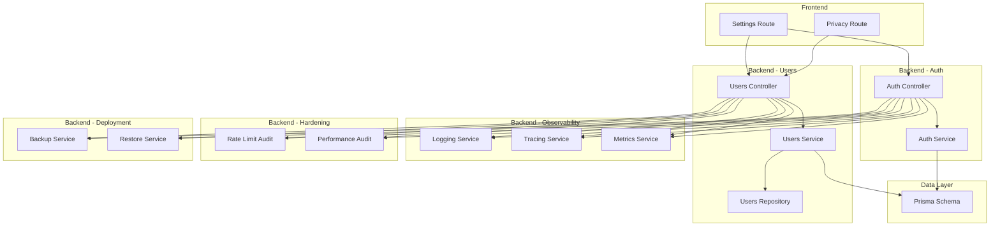
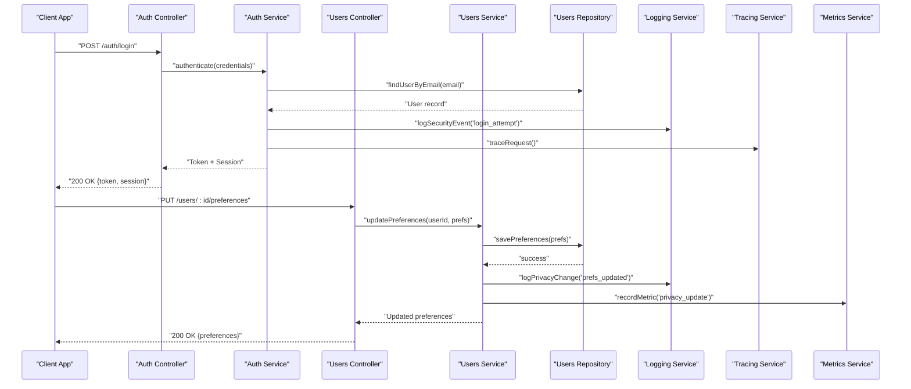
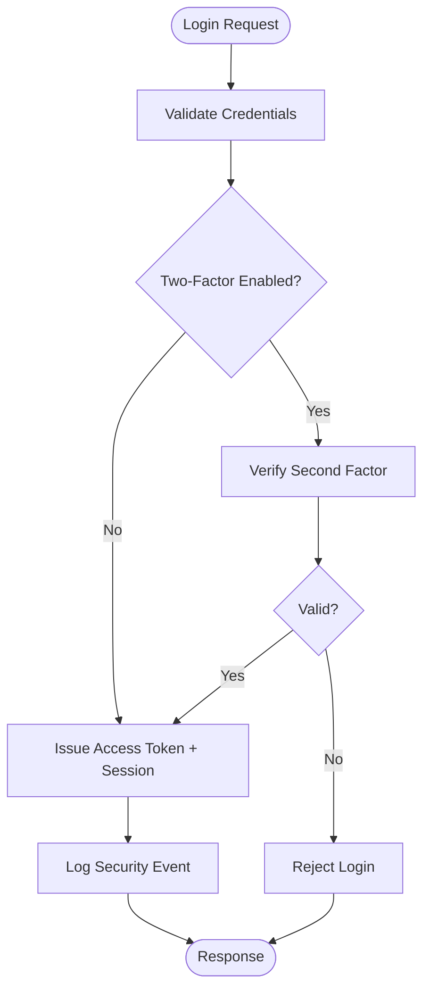
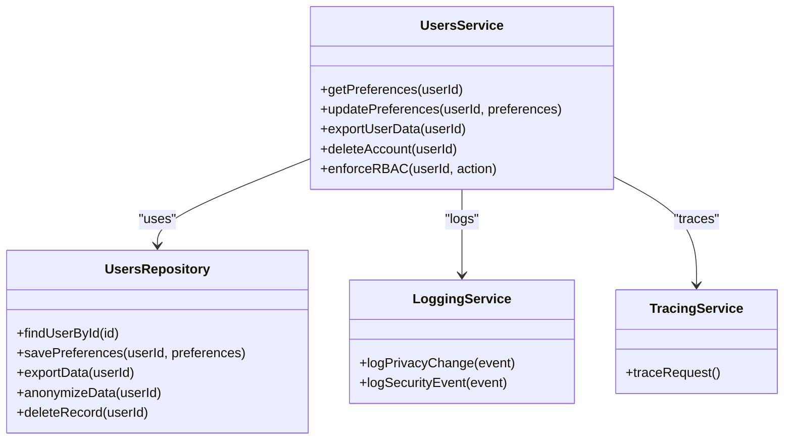
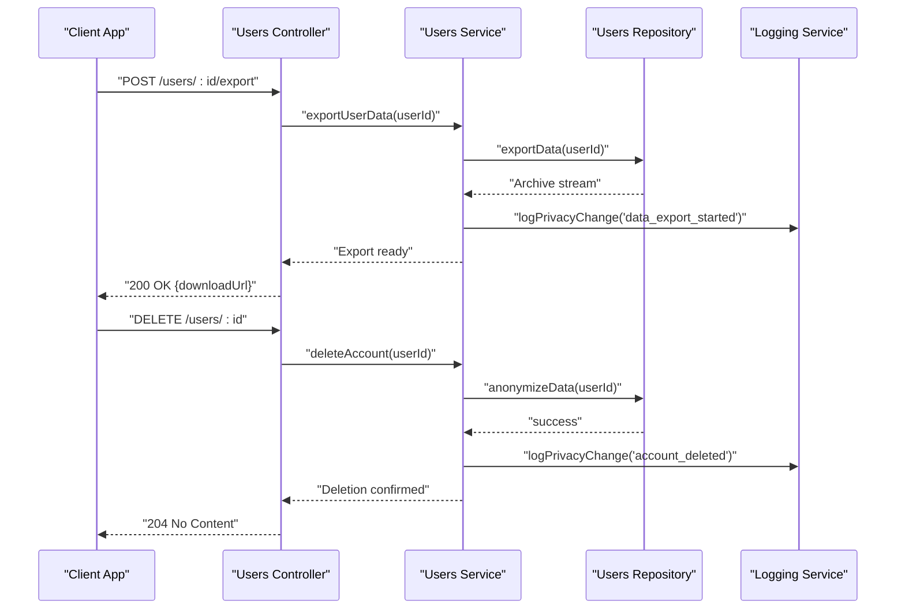
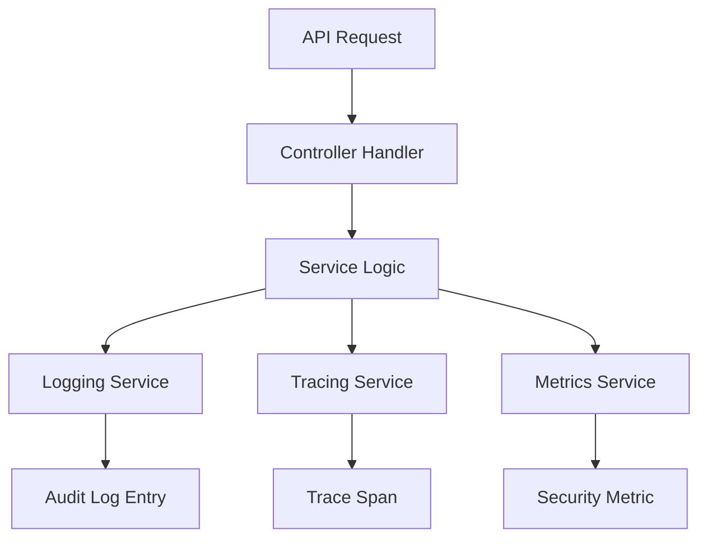
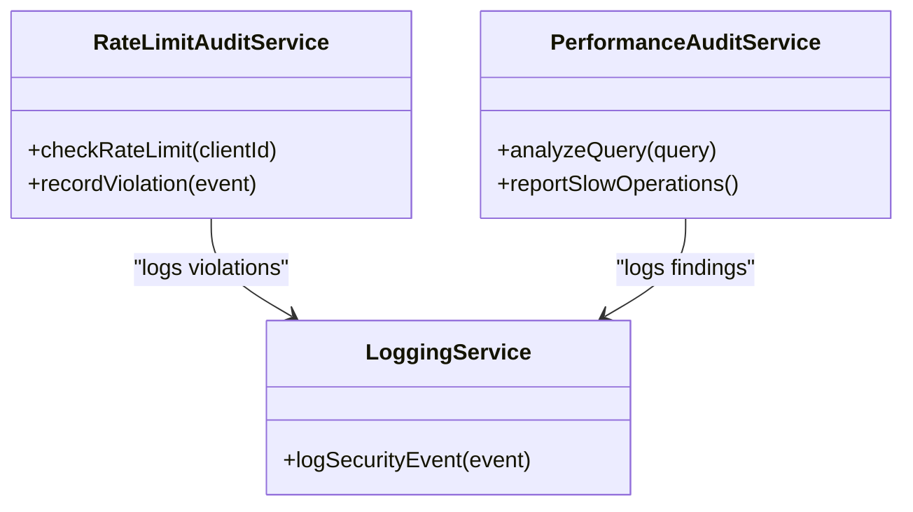
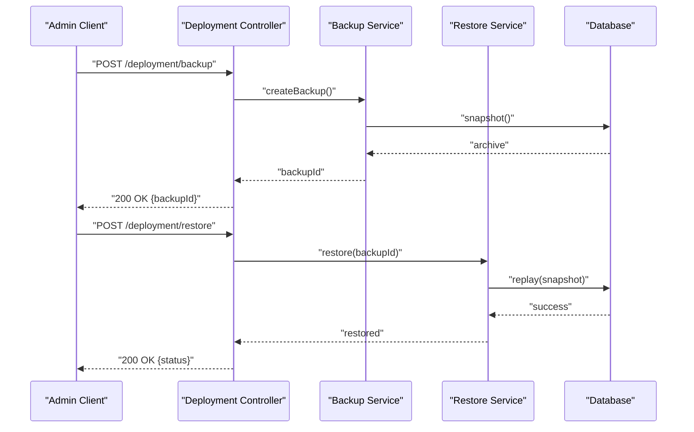
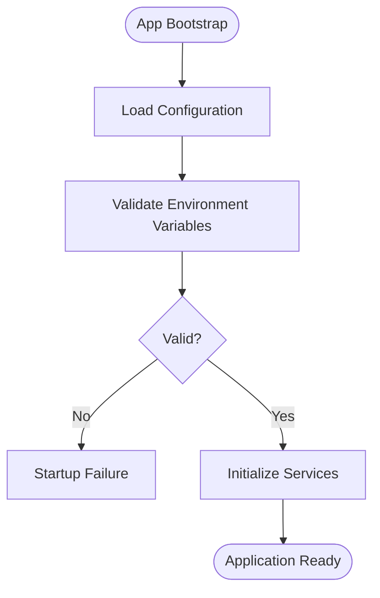
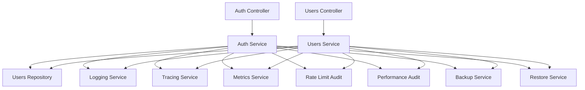

# Privacy & Security Settings

<cite>
**Referenced Files in This Document**
- [SECURITY.md](file://docs/SECURITY.md)
- [auth.controller.ts](file://apps/backend/src/auth/auth.controller.ts)
- [auth.service.ts](file://apps/backend/src/auth/auth.service.ts)
- [auth.module.ts](file://apps/backend/src/auth/auth.module.ts)
- [users.controller.ts](file://apps/backend/src/users/users.controller.ts)
- [users.service.ts](file://apps/backend/src/users/users.service.ts)
- [users.repository.ts](file://apps/backend/src/users/users.repository.ts)
- [schema.prisma](file://apps/backend/prisma/schema.prisma)
- [logging.service.ts](file://apps/backend/src/observability/logging.service.ts)
- [tracing.service.ts](file://apps/backend/src/observability/tracing.service.ts)
- [metrics.service.ts](file://apps/backend/src/observability/metrics.service.ts)
- [rate-limit-audit.service.ts](file://apps/backend/src/hardening/rate-limit-audit.service.ts)
- [performance-audit.service.ts](file://apps/backend/src/hardening/performance-audit.service.ts)
- [backup.service.ts](file://apps/backend/src/deployment/backup.service.ts)
- [restore.service.ts](file://apps/backend/src/deployment/restore.service.ts)
- [app.bootstrap.ts](file://apps/backend/src/app.bootstrap.ts)
- [configuration.ts](file://apps/backend/src/config/configuration.ts)
- [env.validation.ts](file://apps/backend/src/config/env.validation.ts)
- [privacy.tsx](file://src/routes/privacy.tsx)
- [settings.tsx](file://src/routes/app.settings.tsx)
</cite>

## Table of Contents
1. [Introduction](#introduction)
2. [Project Structure](#project-structure)
3. [Core Components](#core-components)
4. [Architecture Overview](#architecture-overview)
5. [Detailed Component Analysis](#detailed-component-analysis)
6. [Dependency Analysis](#dependency-analysis)
7. [Performance Considerations](#performance-considerations)
8. [Troubleshooting Guide](#troubleshooting-guide)
9. [Conclusion](#conclusion)
10. [Appendices](#appendices)

## Introduction
This document provides comprehensive API documentation for privacy and security settings management within the application. It covers privacy controls (profile visibility, activity tracking, data sharing permissions, content visibility), security configurations (two-factor authentication, session management, access token policies), data export and deletion workflows, GDPR compliance features, audit logging, security event tracking, compliance reporting, data retention, anonymization procedures, and regulatory requirements. The guidance is grounded in the backend modules for authentication, user management, observability, hardening, deployment, and configuration, as well as relevant frontend routes that expose privacy-related UI.

## Project Structure
The privacy and security capabilities are implemented primarily in the backend NestJS application under apps/backend/src, with supporting Prisma schema definitions and configuration files. Frontend routes provide user-facing privacy and settings pages. Key areas include:
- Authentication module for login, registration, password reset, and token/session handling
- Users module for profile management, preferences, and account lifecycle
- Observability module for logging, tracing, and metrics
- Hardening module for rate limiting and performance auditing
- Deployment module for backup and restore operations
- Configuration module for environment validation and runtime settings
- Prisma schema for data models and relationships

**Diagram sources**
- [auth.controller.ts](file://apps/backend/src/auth/auth.controller.ts)
- [auth.service.ts](file://apps/backend/src/auth/auth.service.ts)
- [users.controller.ts](file://apps/backend/src/users/users.controller.ts)
- [users.service.ts](file://apps/backend/src/users/users.service.ts)
- [users.repository.ts](file://apps/backend/src/users/users.repository.ts)
- [schema.prisma](file://apps/backend/prisma/schema.prisma)
- [logging.service.ts](file://apps/backend/src/observability/logging.service.ts)
- [tracing.service.ts](file://apps/backend/src/observability/tracing.service.ts)
- [metrics.service.ts](file://apps/backend/src/observability/metrics.service.ts)
- [rate-limit-audit.service.ts](file://apps/backend/src/hardening/rate-limit-audit.service.ts)
- [performance-audit.service.ts](file://apps/backend/src/hardening/performance-audit.service.ts)
- [backup.service.ts](file://apps/backend/src/deployment/backup.service.ts)
- [restore.service.ts](file://apps/backend/src/deployment/restore.service.ts)

**Section sources**
- [SECURITY.md](file://docs/SECURITY.md)
- [auth.controller.ts](file://apps/backend/src/auth/auth.controller.ts)
- [auth.service.ts](file://apps/backend/src/auth/auth.service.ts)
- [users.controller.ts](file://apps/backend/src/users/users.controller.ts)
- [users.service.ts](file://apps/backend/src/users/users.service.ts)
- [users.repository.ts](file://apps/backend/src/users/users.repository.ts)
- [schema.prisma](file://apps/backend/prisma/schema.prisma)
- [logging.service.ts](file://apps/backend/src/observability/logging.service.ts)
- [tracing.service.ts](file://apps/backend/src/observability/tracing.service.ts)
- [metrics.service.ts](file://apps/backend/src/observability/metrics.service.ts)
- [rate-limit-audit.service.ts](file://apps/backend/src/hardening/rate-limit-audit.service.ts)
- [performance-audit.service.ts](file://apps/backend/src/hardening/performance-audit.service.ts)
- [backup.service.ts](file://apps/backend/src/deployment/backup.service.ts)
- [restore.service.ts](file://apps/backend/src/deployment/restore.service.ts)
- [app.bootstrap.ts](file://apps/backend/src/app.bootstrap.ts)
- [configuration.ts](file://apps/backend/src/config/configuration.ts)
- [env.validation.ts](file://apps/backend/src/config/env.validation.ts)
- [privacy.tsx](file://src/routes/privacy.tsx)
- [settings.tsx](file://src/routes/app.settings.tsx)

## Core Components
- Authentication Module: Handles identity verification, session creation, token issuance, and related flows. Integrates with observability and hardening services to log and monitor security events.
- Users Module: Manages user profiles, preferences, and account lifecycle including data export and deletion requests. Enforces role-based access control and permission checks.
- Observability Services: Provide structured logging, distributed tracing, and metrics collection to support audit trails and compliance reporting.
- Hardening Services: Implement rate limiting and performance auditing to protect against abuse and ensure system stability.
- Deployment Services: Manage backups and restores to support data retention policies and disaster recovery.
- Configuration: Validates environment variables and centralizes security-sensitive settings such as token lifetimes and encryption parameters.

Key responsibilities:
- Privacy controls: Profile visibility, activity tracking toggles, data sharing permissions, content visibility rules
- Security configurations: Two-factor authentication setup, session management, access token policies
- Data protection: Export functionality, anonymization procedures, deletion workflows
- Compliance: Audit logs, security event tracking, reporting endpoints

**Section sources**
- [auth.controller.ts](file://apps/backend/src/auth/auth.controller.ts)
- [auth.service.ts](file://apps/backend/src/auth/auth.service.ts)
- [users.controller.ts](file://apps/backend/src/users/users.controller.ts)
- [users.service.ts](file://apps/backend/src/users/users.service.ts)
- [users.repository.ts](file://apps/backend/src/users/users.repository.ts)
- [logging.service.ts](file://apps/backend/src/observability/logging.service.ts)
- [tracing.service.ts](file://apps/backend/src/observability/tracing.service.ts)
- [metrics.service.ts](file://apps/backend/src/observability/metrics.service.ts)
- [rate-limit-audit.service.ts](file://apps/backend/src/hardening/rate-limit-audit.service.ts)
- [performance-audit.service.ts](file://apps/backend/src/hardening/performance-audit.service.ts)
- [backup.service.ts](file://apps/backend/src/deployment/backup.service.ts)
- [restore.service.ts](file://apps/backend/src/deployment/restore.service.ts)
- [configuration.ts](file://apps/backend/src/config/configuration.ts)
- [env.validation.ts](file://apps/backend/src/config/env.validation.ts)

## Architecture Overview
The privacy and security architecture follows a layered approach:
- Controllers expose REST endpoints for privacy and security operations
- Services implement business logic and enforce policies
- Repositories interact with the database via Prisma
- Observability and hardening services provide cross-cutting concerns
- Configuration validates and supplies runtime settings

**Diagram sources**
- [auth.controller.ts](file://apps/backend/src/auth/auth.controller.ts)
- [auth.service.ts](file://apps/backend/src/auth/auth.service.ts)
- [users.controller.ts](file://apps/backend/src/users/users.controller.ts)
- [users.service.ts](file://apps/backend/src/users/users.service.ts)
- [users.repository.ts](file://apps/backend/src/users/users.repository.ts)
- [logging.service.ts](file://apps/backend/src/observability/logging.service.ts)
- [tracing.service.ts](file://apps/backend/src/observability/tracing.service.ts)
- [metrics.service.ts](file://apps/backend/src/observability/metrics.service.ts)

## Detailed Component Analysis

### Authentication and Security Controls
- Login and token issuance: Validates credentials, issues access tokens, creates sessions, and records security events.
- Two-factor authentication: Supports enabling and verifying second factors; enforces policy checks before granting access.
- Session management: Configures session lifetimes, rotation, and revocation mechanisms.
- Access token policies: Defines scopes, expiration, refresh strategies, and secure storage practices.

**Diagram sources**
- [auth.controller.ts](file://apps/backend/src/auth/auth.controller.ts)
- [auth.service.ts](file://apps/backend/src/auth/auth.service.ts)
- [logging.service.ts](file://apps/backend/src/observability/logging.service.ts)

**Section sources**
- [auth.controller.ts](file://apps/backend/src/auth/auth.controller.ts)
- [auth.service.ts](file://apps/backend/src/auth/auth.service.ts)
- [configuration.ts](file://apps/backend/src/config/configuration.ts)
- [env.validation.ts](file://apps/backend/src/config/env.validation.ts)

### User Preferences and Privacy Controls
- Profile visibility: Controls who can view user profiles and associated metadata.
- Activity tracking: Toggles collection and processing of activity data for insights and recommendations.
- Data sharing permissions: Governs what data can be shared with third parties or exposed via APIs.
- Content visibility: Manages visibility of user-generated content across collections, journals, and media entries.

**Diagram sources**
- [users.service.ts](file://apps/backend/src/users/users.service.ts)
- [users.repository.ts](file://apps/backend/src/users/users.repository.ts)
- [logging.service.ts](file://apps/backend/src/observability/logging.service.ts)
- [tracing.service.ts](file://apps/backend/src/observability/tracing.service.ts)

**Section sources**
- [users.controller.ts](file://apps/backend/src/users/users.controller.ts)
- [users.service.ts](file://apps/backend/src/users/users.service.ts)
- [users.repository.ts](file://apps/backend/src/users/users.repository.ts)
- [schema.prisma](file://apps/backend/prisma/schema.prisma)

### Data Export and Deletion Workflows
- Data export: Generates downloadable archives containing user data according to privacy preferences and regulatory requirements.
- Account deletion: Initiates irreversible deletion or anonymization processes, ensuring compliance with retention policies.
- Anonymization: Replaces personal identifiers with anonymized values while preserving analytical utility.

**Diagram sources**
- [users.controller.ts](file://apps/backend/src/users/users.controller.ts)
- [users.service.ts](file://apps/backend/src/users/users.service.ts)
- [users.repository.ts](file://apps/backend/src/users/users.repository.ts)
- [logging.service.ts](file://apps/backend/src/observability/logging.service.ts)

**Section sources**
- [users.controller.ts](file://apps/backend/src/users/users.controller.ts)
- [users.service.ts](file://apps/backend/src/users/users.service.ts)
- [users.repository.ts](file://apps/backend/src/users/users.repository.ts)

### Audit Logs and Security Event Tracking
- Structured logging: Captures privacy changes, authentication attempts, and sensitive operations.
- Distributed tracing: Correlates requests across services for end-to-end visibility.
- Metrics: Tracks key security and privacy KPIs for monitoring and alerting.

**Diagram sources**
- [logging.service.ts](file://apps/backend/src/observability/logging.service.ts)
- [tracing.service.ts](file://apps/backend/src/observability/tracing.service.ts)
- [metrics.service.ts](file://apps/backend/src/observability/metrics.service.ts)

**Section sources**
- [logging.service.ts](file://apps/backend/src/observability/logging.service.ts)
- [tracing.service.ts](file://apps/backend/src/observability/tracing.service.ts)
- [metrics.service.ts](file://apps/backend/src/observability/metrics.service.ts)

### Rate Limiting and Performance Auditing
- Rate limit audit: Monitors request rates and flags abusive patterns.
- Performance audit: Analyzes query performance and resource usage to prevent degradation during sensitive operations.

**Diagram sources**
- [rate-limit-audit.service.ts](file://apps/backend/src/hardening/rate-limit-audit.service.ts)
- [performance-audit.service.ts](file://apps/backend/src/hardening/performance-audit.service.ts)
- [logging.service.ts](file://apps/backend/src/observability/logging.service.ts)

**Section sources**
- [rate-limit-audit.service.ts](file://apps/backend/src/hardening/rate-limit-audit.service.ts)
- [performance-audit.service.ts](file://apps/backend/src/hardening/performance-audit.service.ts)

### Backup and Restore Operations
- Backup service: Creates consistent snapshots of user data for retention and disaster recovery.
- Restore service: Recovers data from backups following authorized requests and validation.

**Diagram sources**
- [backup.service.ts](file://apps/backend/src/deployment/backup.service.ts)
- [restore.service.ts](file://apps/backend/src/deployment/restore.service.ts)

**Section sources**
- [backup.service.ts](file://apps/backend/src/deployment/backup.service.ts)
- [restore.service.ts](file://apps/backend/src/deployment/restore.service.ts)

### Configuration and Environment Validation
- Centralized configuration: Provides typed settings for security-sensitive parameters like token lifetimes and encryption keys.
- Environment validation: Ensures required variables are present and correctly formatted at startup.

**Diagram sources**
- [app.bootstrap.ts](file://apps/backend/src/app.bootstrap.ts)
- [configuration.ts](file://apps/backend/src/config/configuration.ts)
- [env.validation.ts](file://apps/backend/src/config/env.validation.ts)

**Section sources**
- [app.bootstrap.ts](file://apps/backend/src/app.bootstrap.ts)
- [configuration.ts](file://apps/backend/src/config/configuration.ts)
- [env.validation.ts](file://apps/backend/src/config/env.validation.ts)

### Frontend Privacy and Settings Pages
- Privacy route: Displays privacy policy and controls for users to manage their preferences.
- Settings route: Provides UI for updating account settings, including privacy and security options.

**Section sources**
- [privacy.tsx](file://src/routes/privacy.tsx)
- [settings.tsx](file://src/routes/app.settings.tsx)

## Dependency Analysis
The privacy and security components exhibit clear separation of concerns:
- Controllers depend on services for business logic
- Services depend on repositories for data access
- Cross-cutting concerns (logging, tracing, metrics, rate limiting, performance auditing) are injected into controllers and services
- Configuration drives runtime behavior and security policies

**Diagram sources**
- [auth.controller.ts](file://apps/backend/src/auth/auth.controller.ts)
- [auth.service.ts](file://apps/backend/src/auth/auth.service.ts)
- [users.controller.ts](file://apps/backend/src/users/users.controller.ts)
- [users.service.ts](file://apps/backend/src/users/users.service.ts)
- [users.repository.ts](file://apps/backend/src/users/users.repository.ts)
- [logging.service.ts](file://apps/backend/src/observability/logging.service.ts)
- [tracing.service.ts](file://apps/backend/src/observability/tracing.service.ts)
- [metrics.service.ts](file://apps/backend/src/observability/metrics.service.ts)
- [rate-limit-audit.service.ts](file://apps/backend/src/hardening/rate-limit-audit.service.ts)
- [performance-audit.service.ts](file://apps/backend/src/hardening/performance-audit.service.ts)
- [backup.service.ts](file://apps/backend/src/deployment/backup.service.ts)
- [restore.service.ts](file://apps/backend/src/deployment/restore.service.ts)

**Section sources**
- [auth.controller.ts](file://apps/backend/src/auth/auth.controller.ts)
- [auth.service.ts](file://apps/backend/src/auth/auth.service.ts)
- [users.controller.ts](file://apps/backend/src/users/users.controller.ts)
- [users.service.ts](file://apps/backend/src/users/users.service.ts)
- [users.repository.ts](file://apps/backend/src/users/users.repository.ts)
- [logging.service.ts](file://apps/backend/src/observability/logging.service.ts)
- [tracing.service.ts](file://apps/backend/src/observability/tracing.service.ts)
- [metrics.service.ts](file://apps/backend/src/observability/metrics.service.ts)
- [rate-limit-audit.service.ts](file://apps/backend/src/hardening/rate-limit-audit.service.ts)
- [performance-audit.service.ts](file://apps/backend/src/hardening/performance-audit.service.ts)
- [backup.service.ts](file://apps/backend/src/deployment/backup.service.ts)
- [restore.service.ts](file://apps/backend/src/deployment/restore.service.ts)

## Performance Considerations
- Use efficient queries and indexes in repositories to minimize latency during privacy updates and exports.
- Stream large data exports to avoid memory spikes.
- Apply rate limiting to prevent abuse of sensitive endpoints.
- Monitor performance metrics and slow queries to maintain responsiveness during high-load scenarios.

[No sources needed since this section provides general guidance]

## Troubleshooting Guide
Common issues and resolutions:
- Authentication failures: Verify credentials, check two-factor configuration, review security logs for failed attempts.
- Permission errors: Ensure role-based access control policies are correctly assigned and validated.
- Export failures: Confirm data availability, check repository methods, and validate archive generation steps.
- Deletion anomalies: Review anonymization routines and confirm retention policy compliance.
- Rate limit violations: Inspect rate limit audit logs and adjust thresholds if necessary.

**Section sources**
- [logging.service.ts](file://apps/backend/src/observability/logging.service.ts)
- [rate-limit-audit.service.ts](file://apps/backend/src/hardening/rate-limit-audit.service.ts)
- [users.service.ts](file://apps/backend/src/users/users.service.ts)
- [users.repository.ts](file://apps/backend/src/users/users.repository.ts)

## Conclusion
The privacy and security settings management system integrates authentication, user preference controls, data export and deletion, audit logging, and hardening measures into a cohesive architecture. By leveraging observability and configuration services, it supports robust compliance with GDPR and other regulatory requirements. Proper implementation of role-based access control, session and token policies, and data retention ensures both security and user trust.

[No sources needed since this section summarizes without analyzing specific files]

## Appendices

### Privacy Rule Definitions Example
- Profile visibility: public, friends-only, private
- Activity tracking: enabled, disabled, limited
- Data sharing: none, anonymized-aggregates, explicit-consent
- Content visibility: public, collaborators-only, private

[No sources needed since this section provides conceptual examples]

### Permission Matrix Example
- Roles: admin, editor, viewer
- Actions: read-profile, update-preferences, export-data, delete-account
- Mapping: admin=all, editor=read+update+export, viewer=read

[No sources needed since this section provides conceptual examples]

### Role-Based Access Control Example
- Enforce RBAC at controller and service layers
- Validate roles before executing sensitive operations
- Log all authorization decisions for audit

[No sources needed since this section provides conceptual examples]

### Data Retention Policies
- Define retention periods per data category
- Automate archival and deletion based on policies
- Support anonymization for long-term analytics

[No sources needed since this section provides conceptual examples]

### Regulatory Compliance Requirements
- GDPR: right to access, rectification, erasure, portability
- Consent management and transparency
- Auditability and accountability

[No sources needed since this section provides conceptual examples]