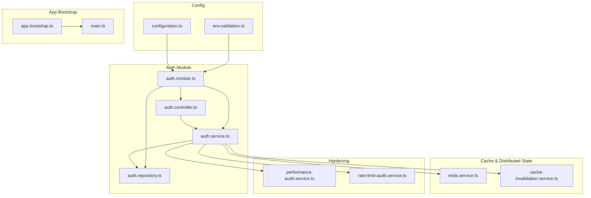
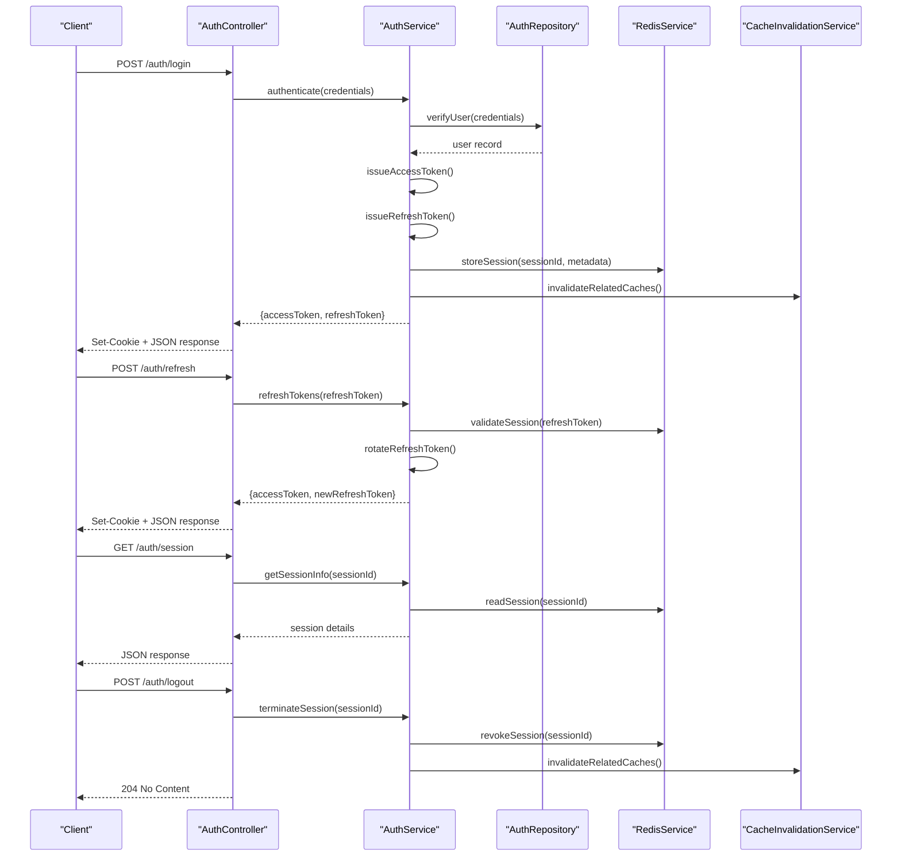
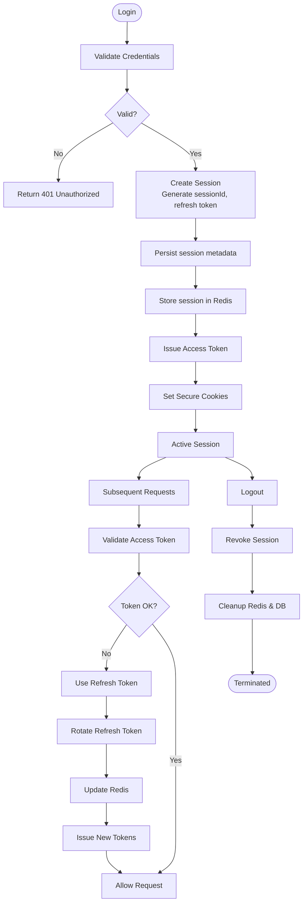
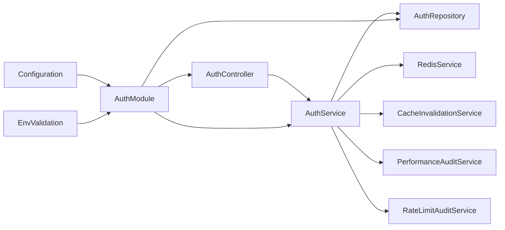

# Session & Authentication Management

<cite>
**Referenced Files in This Document**
- [auth.controller.ts](file://apps/backend/src/auth/auth.controller.ts)
- [auth.service.ts](file://apps/backend/src/auth/auth.service.ts)
- [auth.module.ts](file://apps/backend/src/auth/auth.module.ts)
- [auth.repository.ts](file://apps/backend/src/auth/auth.repository.ts)
- [auth.e2e.spec.ts](file://apps/backend/test/auth.e2e.spec.ts)
- [configuration.ts](file://apps/backend/src/config/configuration.ts)
- [env.validation.ts](file://apps/backend/src/config/env.validation.ts)
- [redis.service.ts](file://apps/backend/src/redis/redis.service.ts)
- [cache-invalidation.service.ts](file://apps/backend/src/hardening/cache-invalidation.service.ts)
- [performance-audit.service.ts](file://apps/backend/src/hardening/performance-audit.service.ts)
- [rate-limit-audit.service.ts](file://apps/backend/src/hardening/rate-limit-audit.service.ts)
- [app.bootstrap.ts](file://apps/backend/src/app.bootstrap.ts)
- [main.ts](file://apps/backend/src/main.ts)
</cite>

## Table of Contents
1. [Introduction](#introduction)
2. [Project Structure](#project-structure)
3. [Core Components](#core-components)
4. [Architecture Overview](#architecture-overview)
5. [Detailed Component Analysis](#detailed-component-analysis)
6. [Dependency Analysis](#dependency-analysis)
7. [Performance Considerations](#performance-considerations)
8. [Troubleshooting Guide](#troubleshooting-guide)
9. [Conclusion](#conclusion)

## Introduction
This document provides comprehensive API documentation for session and authentication management endpoints. It covers the full session lifecycle (creation, validation, refresh, termination), JWT token handling, refresh token rotation, multi-device sessions, and operational concerns such as persistence, caching, distributed sessions, security best practices, and troubleshooting.

## Project Structure
The backend is a NestJS application with an auth module that exposes controllers, services, guards, strategies, DTOs, and repositories. Configuration and environment validation are centralized under config. Redis is used for caching and distributed state. Hardening utilities provide cache invalidation, performance auditing, and rate limiting insights.

**Diagram sources**
- [auth.controller.ts](file://apps/backend/src/auth/auth.controller.ts)
- [auth.service.ts](file://apps/backend/src/auth/auth.service.ts)
- [auth.repository.ts](file://apps/backend/src/auth/auth.repository.ts)
- [auth.module.ts](file://apps/backend/src/auth/auth.module.ts)
- [configuration.ts](file://apps/backend/src/config/configuration.ts)
- [env.validation.ts](file://apps/backend/src/config/env.validation.ts)
- [redis.service.ts](file://apps/backend/src/redis/redis.service.ts)
- [cache-invalidation.service.ts](file://apps/backend/src/hardening/cache-invalidation.service.ts)
- [performance-audit.service.ts](file://apps/backend/src/hardening/performance-audit.service.ts)
- [rate-limit-audit.service.ts](file://apps/backend/src/hardening/rate-limit-audit.service.ts)
- [app.bootstrap.ts](file://apps/backend/src/app.bootstrap.ts)
- [main.ts](file://apps/backend/src/main.ts)

**Section sources**
- [auth.module.ts](file://apps/backend/src/auth/auth.module.ts)
- [auth.controller.ts](file://apps/backend/src/auth/auth.controller.ts)
- [auth.service.ts](file://apps/backend/src/auth/auth.service.ts)
- [configuration.ts](file://apps/backend/src/config/configuration.ts)
- [env.validation.ts](file://apps/backend/src/config/env.validation.ts)
- [redis.service.ts](file://apps/backend/src/redis/redis.service.ts)
- [cache-invalidation.service.ts](file://apps/backend/src/hardening/cache-invalidation.service.ts)
- [performance-audit.service.ts](file://apps/backend/src/hardening/performance-audit.service.ts)
- [rate-limit-audit.service.ts](file://apps/backend/src/hardening/rate-limit-audit.service.ts)
- [app.bootstrap.ts](file://apps/backend/src/app.bootstrap.ts)
- [main.ts](file://apps/backend/src/main.ts)

## Core Components
- Auth Controller: Exposes HTTP endpoints for login, logout, refresh, and session queries.
- Auth Service: Orchestrates authentication flows, token issuance/validation, session management, and refresh token rotation.
- Auth Repository: Persists user credentials and session metadata to the database.
- Redis Service: Provides distributed caching and session storage primitives.
- Cache Invalidation Service: Ensures stale data is removed on critical operations.
- Performance Audit Service: Tracks latency and throughput for auth operations.
- Rate Limit Audit Service: Audits and reports rate limiting behavior.

Key responsibilities:
- Create and validate access tokens (JWT).
- Manage refresh tokens with rotation and revocation.
- Track active sessions per user across devices.
- Enforce concurrent session limits.
- Provide secure cookie configuration and CSRF protection hooks.

**Section sources**
- [auth.controller.ts](file://apps/backend/src/auth/auth.controller.ts)
- [auth.service.ts](file://apps/backend/src/auth/auth.service.ts)
- [auth.repository.ts](file://apps/backend/src/auth/auth.repository.ts)
- [redis.service.ts](file://apps/backend/src/redis/redis.service.ts)
- [cache-invalidation.service.ts](file://apps/backend/src/hardening/cache-invalidation.service.ts)
- [performance-audit.service.ts](file://apps/backend/src/hardening/performance-audit.service.ts)
- [rate-limit-audit.service.ts](file://apps/backend/src/hardening/rate-limit-audit.service.ts)

## Architecture Overview
The authentication flow uses a controller-to-service pattern with repository-backed persistence and Redis for distributed state. JWT access tokens are short-lived; refresh tokens are rotated on use and stored securely. Sessions are tracked per device and can be limited concurrently.

**Diagram sources**
- [auth.controller.ts](file://apps/backend/src/auth/auth.controller.ts)
- [auth.service.ts](file://apps/backend/src/auth/auth.service.ts)
- [auth.repository.ts](file://apps/backend/src/auth/auth.repository.ts)
- [redis.service.ts](file://apps/backend/src/redis/redis.service.ts)
- [cache-invalidation.service.ts](file://apps/backend/src/hardening/cache-invalidation.service.ts)

## Detailed Component Analysis

### Authentication Endpoints
Endpoints exposed by the auth controller typically include:
- Login: Accepts credentials, validates via service/repository, issues tokens, sets secure cookies.
- Refresh: Validates refresh token, rotates it, returns new access and refresh tokens.
- Session Query: Returns current session details including device info and active count.
- Logout: Revokes session, clears cookies, invalidates caches.

Security considerations:
- Use HTTPS only.
- Set HttpOnly, Secure, SameSite=Strict cookies.
- Implement CSRF protection for state-changing endpoints.
- Enforce rate limiting and account lockout policies.

**Section sources**
- [auth.controller.ts](file://apps/backend/src/auth/auth.controller.ts)
- [auth.e2e.spec.ts](file://apps/backend/test/auth.e2e.spec.ts)

### Session Lifecycle
Lifecycle stages:
- Creation: On successful login, create a session record, generate sessionId, set refresh token, persist metadata (device, IP, timestamps).
- Validation: On each request, validate access token and optionally refresh token; ensure session exists and is active.
- Refresh: Rotate refresh token on use; update last-used timestamp; enforce max rotations or expiry.
- Termination: On logout or explicit revocation, remove session from Redis and mark revoked in DB if applicable.

Concurrency and limits:
- Track active sessions per user; enforce maximum concurrent sessions.
- Evict oldest sessions when limit exceeded, or reject new logins until a session is terminated.

Persistence and distribution:
- Store session metadata in Redis for fast reads/writes.
- Persist minimal identifiers and revocation flags in the database for auditability.

Cleanup:
- Periodic job removes expired sessions and refresh tokens.
- Cache invalidation ensures consistency after session changes.

**Diagram sources**
- [auth.service.ts](file://apps/backend/src/auth/auth.service.ts)
- [auth.repository.ts](file://apps/backend/src/auth/auth.repository.ts)
- [redis.service.ts](file://apps/backend/src/redis/redis.service.ts)
- [cache-invalidation.service.ts](file://apps/backend/src/hardening/cache-invalidation.service.ts)

**Section sources**
- [auth.service.ts](file://apps/backend/src/auth/auth.service.ts)
- [auth.repository.ts](file://apps/backend/src/auth/auth.repository.ts)
- [redis.service.ts](file://apps/backend/src/redis/redis.service.ts)
- [cache-invalidation.service.ts](file://apps/backend/src/hardening/cache-invalidation.service.ts)

### JWT Token Management
- Access tokens: Short-lived, signed JWT containing minimal claims (user id, scopes, session id).
- Refresh tokens: Long-lived, opaque or signed tokens stored in Redis and optionally referenced in DB; rotated on use.
- Rotation strategy: On refresh, invalidate old refresh token, issue new one, update last-used timestamp.
- Security: Store refresh tokens securely (HttpOnly cookies), never expose to client-side JS.

Best practices:
- Keep payloads small.
- Use strong signing algorithms and rotate keys periodically.
- Enforce token expiry aligned with session lifetime.

**Section sources**
- [auth.service.ts](file://apps/backend/src/auth/auth.service.ts)
- [redis.service.ts](file://apps/backend/src/redis/redis.service.ts)

### Multi-Device Session Handling
- Each device gets a unique sessionId and refresh token pair.
- User-level session registry tracks all active sessions.
- Limits: Configure max concurrent sessions per user; evict or deny based on policy.
- Device fingerprinting: Optionally capture device type, browser, OS for visibility and anomaly detection.

Operational notes:
- Use Redis hashes or sets for efficient session enumeration and counting.
- Provide endpoints to list and terminate specific sessions.

**Section sources**
- [auth.service.ts](file://apps/backend/src/auth/auth.service.ts)
- [redis.service.ts](file://apps/backend/src/redis/redis.service.ts)

### Session State Queries
Typical query capabilities:
- Get current session details (sessionId, device, last activity).
- List active sessions for the authenticated user.
- Check total active count vs configured limit.
- Retrieve revocation status and expiration times.

Response fields commonly include:
- sessionId, userId, device info, createdAt, lastUsedAt, expiresAt, isActive.

**Section sources**
- [auth.controller.ts](file://apps/backend/src/auth/auth.controller.ts)
- [auth.service.ts](file://apps/backend/src/auth/auth.service.ts)
- [redis.service.ts](file://apps/backend/src/redis/redis.service.ts)

### Automatic Session Cleanup
- TTL-based expiration in Redis for sessions and refresh tokens.
- Scheduled jobs to purge expired entries and compact storage.
- Database cleanup for revoked tokens and orphaned records.
- Cache invalidation triggers on session changes to prevent stale reads.

**Section sources**
- [redis.service.ts](file://apps/backend/src/redis/redis.service.ts)
- [cache-invalidation.service.ts](file://apps/backend/src/hardening/cache-invalidation.service.ts)
- [performance-audit.service.ts](file://apps/backend/src/hardening/performance-audit.service.ts)

### Security Best Practices
- Cookie configuration: HttpOnly, Secure, SameSite=Strict; consider partitioned cookies for cross-site contexts.
- CSRF protection: Enable CSRF middleware for state-changing endpoints; use double-submit cookies or custom headers where appropriate.
- Session hijacking prevention: Bind sessions to device fingerprints; detect anomalies (IP changes, UA changes); enforce re-authentication on sensitive actions.
- Rate limiting: Apply per-IP and per-user limits; integrate with audit service for monitoring.
- Key management: Rotate signing keys; use separate keys for access and refresh tokens.

**Section sources**
- [configuration.ts](file://apps/backend/src/config/configuration.ts)
- [env.validation.ts](file://apps/backend/src/config/env.validation.ts)
- [rate-limit-audit.service.ts](file://apps/backend/src/hardening/rate-limit-audit.service.ts)

### Integration Points
- Redis: Centralized session store and cache; supports atomic operations and TTL.
- Database: Persists essential session metadata and audit logs.
- Hardening services: Provide observability and safeguards against abuse.

**Section sources**
- [redis.service.ts](file://apps/backend/src/redis/redis.service.ts)
- [auth.repository.ts](file://apps/backend/src/auth/auth.repository.ts)
- [performance-audit.service.ts](file://apps/backend/src/hardening/performance-audit.service.ts)
- [rate-limit-audit.service.ts](file://apps/backend/src/hardening/rate-limit-audit.service.ts)

## Dependency Analysis
The auth module depends on configuration, Redis, and hardening services. Controllers delegate to services; services coordinate repositories and cache layers.

**Diagram sources**
- [auth.controller.ts](file://apps/backend/src/auth/auth.controller.ts)
- [auth.service.ts](file://apps/backend/src/auth/auth.service.ts)
- [auth.repository.ts](file://apps/backend/src/auth/auth.repository.ts)
- [auth.module.ts](file://apps/backend/src/auth/auth.module.ts)
- [configuration.ts](file://apps/backend/src/config/configuration.ts)
- [env.validation.ts](file://apps/backend/src/config/env.validation.ts)
- [redis.service.ts](file://apps/backend/src/redis/redis.service.ts)
- [cache-invalidation.service.ts](file://apps/backend/src/hardening/cache-invalidation.service.ts)
- [performance-audit.service.ts](file://apps/backend/src/hardening/performance-audit.service.ts)
- [rate-limit-audit.service.ts](file://apps/backend/src/hardening/rate-limit-audit.service.ts)

**Section sources**
- [auth.module.ts](file://apps/backend/src/auth/auth.module.ts)
- [auth.controller.ts](file://apps/backend/src/auth/auth.controller.ts)
- [auth.service.ts](file://apps/backend/src/auth/auth.service.ts)
- [configuration.ts](file://apps/backend/src/config/configuration.ts)
- [env.validation.ts](file://apps/backend/src/config/env.validation.ts)
- [redis.service.ts](file://apps/backend/src/redis/redis.service.ts)
- [cache-invalidation.service.ts](file://apps/backend/src/hardening/cache-invalidation.service.ts)
- [performance-audit.service.ts](file://apps/backend/src/hardening/performance-audit.service.ts)
- [rate-limit-audit.service.ts](file://apps/backend/src/hardening/rate-limit-audit.service.ts)

## Performance Considerations
- Minimize payload size for JWTs.
- Use Redis for high-throughput session reads/writes.
- Avoid synchronous blocking calls in hot paths; prefer async patterns.
- Monitor latency and error rates using performance audit service.
- Tune Redis TTLs and connection pools appropriately.

[No sources needed since this section provides general guidance]

## Troubleshooting Guide
Common issues and resolutions:
- Invalid or expired access token: Ensure client sends valid token; implement automatic refresh flow; check server clock skew.
- Refresh token rejected: Verify rotation logic; confirm token not revoked; check Redis connectivity and TTL settings.
- Session not found: Validate sessionId; ensure Redis key prefix and namespace match; check for accidental deletion.
- Concurrent session limit reached: Review limit configuration; instruct users to terminate inactive sessions; monitor session counts.
- CSRF errors: Confirm CSRF token/header presence; verify cookie SameSite and domain settings.
- Rate limiting triggered: Inspect rate limit counters; adjust thresholds; investigate potential abuse.

Diagnostic steps:
- Log token validation results and session lookups.
- Inspect Redis keys for session existence and TTL.
- Review audit logs for failed attempts and anomalies.
- Validate environment variables for secrets and timeouts.

**Section sources**
- [auth.e2e.spec.ts](file://apps/backend/test/auth.e2e.spec.ts)
- [redis.service.ts](file://apps/backend/src/redis/redis.service.ts)
- [performance-audit.service.ts](file://apps/backend/src/hardening/performance-audit.service.ts)
- [rate-limit-audit.service.ts](file://apps/backend/src/hardening/rate-limit-audit.service.ts)

## Conclusion
The session and authentication system combines secure JWT handling, robust refresh token rotation, and distributed session management via Redis. With configurable concurrency limits, automatic cleanup, and integrated hardening services, it provides a solid foundation for secure, scalable authentication. Follow the security best practices and troubleshooting guidance to maintain reliability and safety in production environments.

[No sources needed since this section summarizes without analyzing specific files]