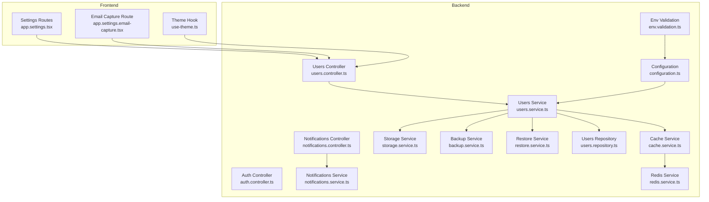
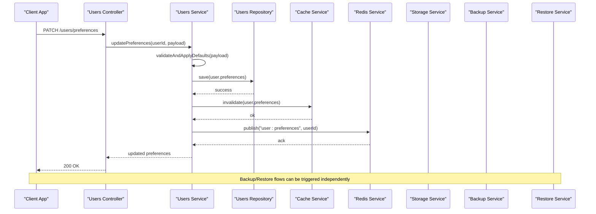
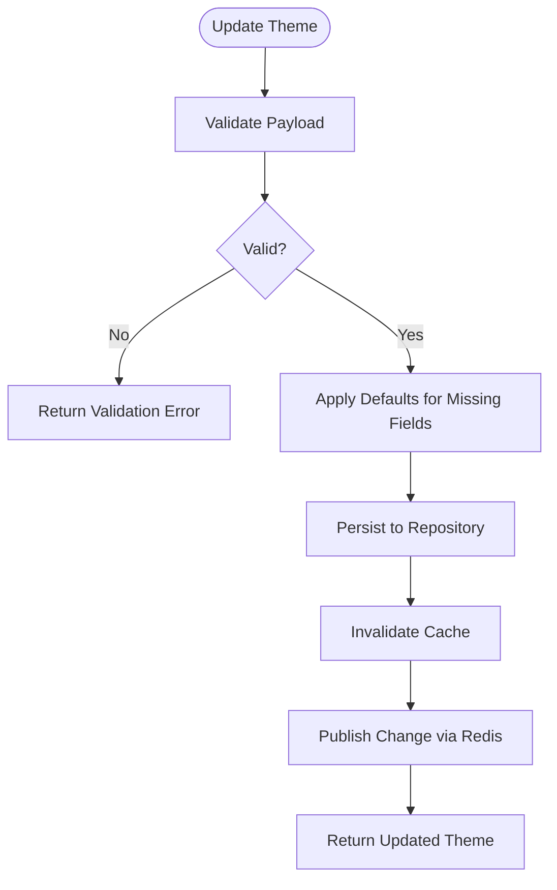
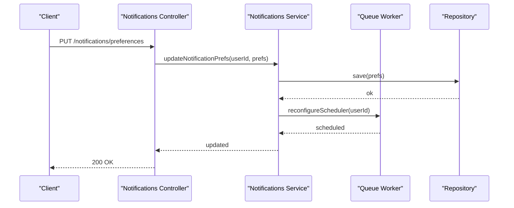
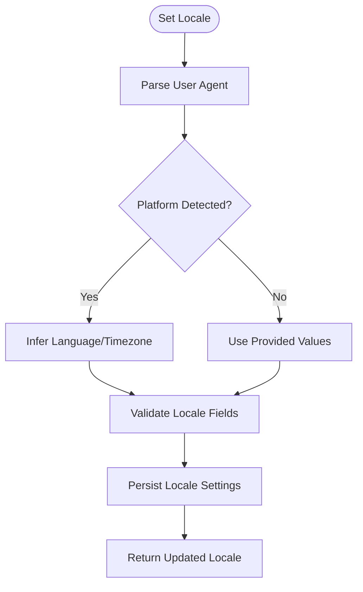
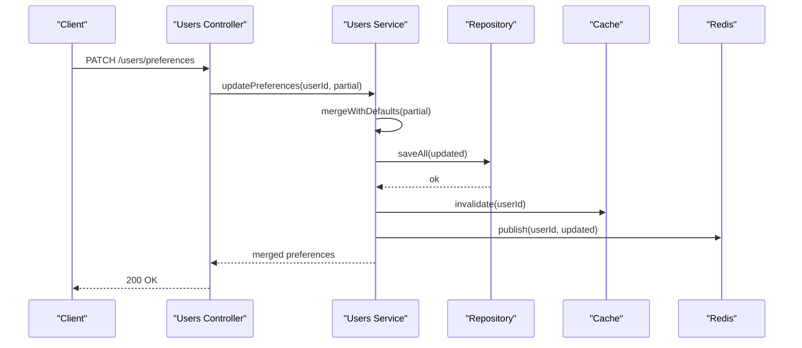
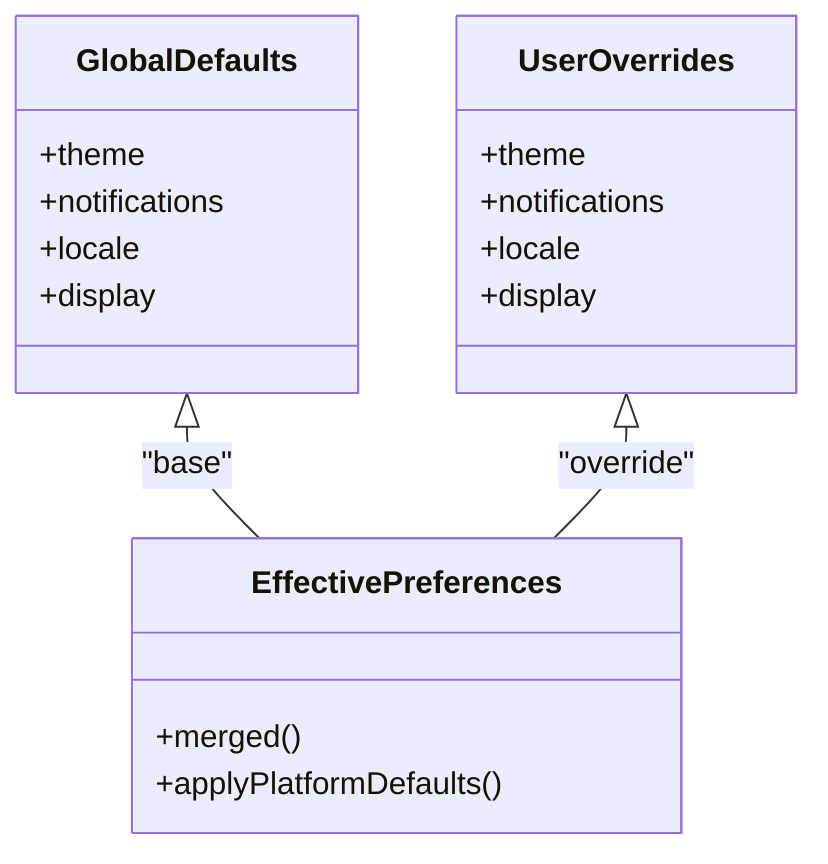
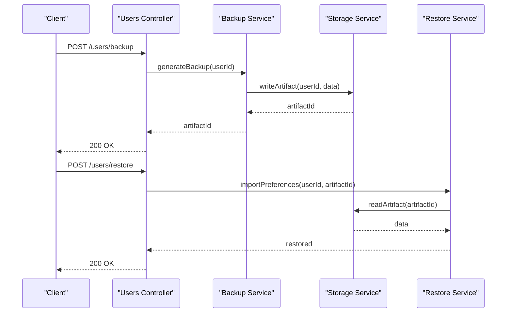
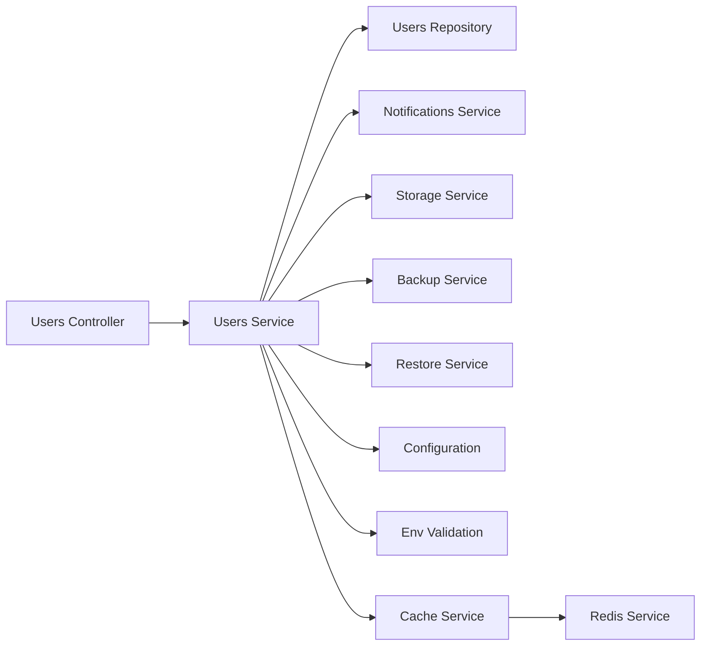

# User Preferences & Settings

<cite>
**Referenced Files in This Document**
- [users.controller.ts](file://apps/backend/src/users/users.controller.ts)
- [users.service.ts](file://apps/backend/src/users/users.service.ts)
- [users.repository.ts](file://apps/backend/src/users/users.repository.ts)
- [users.types.ts](file://apps/backend/src/users/users.types.ts)
- [auth.controller.ts](file://apps/backend/src/auth/auth.controller.ts)
- [auth.service.ts](file://apps/backend/src/auth/auth.service.ts)
- [configuration.ts](file://apps/backend/src/config/configuration.ts)
- [env.validation.ts](file://apps/backend/src/config/env.validation.ts)
- [use-theme.ts](file://src/hooks/use-theme.ts)
- [app.settings.tsx](file://src/routes/app.settings.tsx)
- [settings.email-capture.tsx](file://src/routes/app.settings.email-capture.tsx)
- [notifications.controller.ts](file://apps/backend/src/notifications/notifications.controller.ts)
- [notifications.service.ts](file://apps/backend/src/notifications/notifications.service.ts)
- [storage.service.ts](file://apps/backend/src/storage/storage.service.ts)
- [backup.service.ts](file://apps/backend/src/deployment/backup.service.ts)
- [restore.service.ts](file://apps/backend/src/deployment/restore.service.ts)
- [redis.service.ts](file://apps/backend/src/redis/redis.service.ts)
- [cache.service.ts](file://apps/backend/src/hardening/cache.service.ts)
</cite>

## Table of Contents
1. [Introduction](#introduction)
2. [Project Structure](#project-structure)
3. [Core Components](#core-components)
4. [Architecture Overview](#architecture-overview)
5. [Detailed Component Analysis](#detailed-component-analysis)
6. [Dependency Analysis](#dependency-analysis)
7. [Performance Considerations](#performance-considerations)
8. [Troubleshooting Guide](#troubleshooting-guide)
9. [Conclusion](#conclusion)
10. [Appendices](#appendices)

## Introduction
This document provides comprehensive API documentation for user preferences and settings management across the application. It covers preference categories such as theme, notifications, language/locale, and display options; preference schema structure with nested configuration objects and defaults; examples of updates, batch operations, and inheritance; user agent parsing and device detection; validation and migration strategies; backup and restore; synchronization across devices; and real-time updates.

The backend is implemented in NestJS under apps/backend/src, while the frontend resides under src. Preference-related endpoints are exposed via the users controller and supported by services and repositories. Frontend hooks and routes provide UI integration for theme and settings.

## Project Structure
Preference-related functionality spans both backend and frontend:
- Backend controllers expose REST endpoints for user profile and settings.
- Services encapsulate business logic for reading/writing preferences, notifications, and storage.
- Repositories handle persistence (e.g., Prisma).
- Configuration modules validate environment variables and provide runtime settings.
- Frontend hooks manage local state and theme toggles; routes host settings pages.

**Diagram sources**
- [users.controller.ts](file://apps/backend/src/users/users.controller.ts)
- [users.service.ts](file://apps/backend/src/users/users.service.ts)
- [users.repository.ts](file://apps/backend/src/users/users.repository.ts)
- [auth.controller.ts](file://apps/backend/src/auth/auth.controller.ts)
- [notifications.controller.ts](file://apps/backend/src/notifications/notifications.controller.ts)
- [notifications.service.ts](file://apps/backend/src/notifications/notifications.service.ts)
- [storage.service.ts](file://apps/backend/src/storage/storage.service.ts)
- [backup.service.ts](file://apps/backend/src/deployment/backup.service.ts)
- [restore.service.ts](file://apps/backend/src/deployment/restore.service.ts)
- [configuration.ts](file://apps/backend/src/config/configuration.ts)
- [env.validation.ts](file://apps/backend/src/config/env.validation.ts)
- [cache.service.ts](file://apps/backend/src/hardening/cache.service.ts)
- [redis.service.ts](file://apps/backend/src/redis/redis.service.ts)
- [use-theme.ts](file://src/hooks/use-theme.ts)
- [app.settings.tsx](file://src/routes/app.settings.tsx)
- [settings.email-capture.tsx](file://src/routes/app.settings.email-capture.tsx)

**Section sources**
- [users.controller.ts](file://apps/backend/src/users/users.controller.ts)
- [users.service.ts](file://apps/backend/src/users/users.service.ts)
- [users.repository.ts](file://apps/backend/src/users/users.repository.ts)
- [auth.controller.ts](file://apps/backend/src/auth/auth.controller.ts)
- [notifications.controller.ts](file://apps/backend/src/notifications/notifications.controller.ts)
- [notifications.service.ts](file://apps/backend/src/notifications/notifications.service.ts)
- [storage.service.ts](file://apps/backend/src/storage/storage.service.ts)
- [backup.service.ts](file://apps/backend/src/deployment/backup.service.ts)
- [restore.service.ts](file://apps/backend/src/deployment/restore.service.ts)
- [configuration.ts](file://apps/backend/src/config/configuration.ts)
- [env.validation.ts](file://apps/backend/src/config/env.validation.ts)
- [cache.service.ts](file://apps/backend/src/hardening/cache.service.ts)
- [redis.service.ts](file://apps/backend/src/redis/redis.service.ts)
- [use-theme.ts](file://src/hooks/use-theme.ts)
- [app.settings.tsx](file://src/routes/app.settings.tsx)
- [settings.email-capture.tsx](file://src/routes/app.settings.email-capture.tsx)

## Core Components
- Users Controller: Exposes endpoints to read/update user profiles and settings.
- Users Service: Implements preference update logic, validation, and orchestration with storage and backup/restore.
- Users Repository: Persists user data and preferences.
- Notifications Controller/Service: Manages notification preferences and delivery.
- Storage Service: Handles media and file-based settings artifacts.
- Backup/Restore Services: Provide export/import of user data including preferences.
- Configuration/Environment Validation: Ensures runtime settings and feature flags are valid.
- Cache/Redis Services: Enable fast reads and potential cross-device sync via pub/sub or queues.
- Frontend Theme Hook and Settings Routes: Manage client-side theme and settings UI.

**Section sources**
- [users.controller.ts](file://apps/backend/src/users/users.controller.ts)
- [users.service.ts](file://apps/backend/src/users/users.service.ts)
- [users.repository.ts](file://apps/backend/src/users/users.repository.ts)
- [notifications.controller.ts](file://apps/backend/src/notifications/notifications.controller.ts)
- [notifications.service.ts](file://apps/backend/src/notifications/notifications.service.ts)
- [storage.service.ts](file://apps/backend/src/storage/storage.service.ts)
- [backup.service.ts](file://apps/backend/src/deployment/backup.service.ts)
- [restore.service.ts](file://apps/backend/src/deployment/restore.service.ts)
- [configuration.ts](file://apps/backend/src/config/configuration.ts)
- [env.validation.ts](file://apps/backend/src/config/env.validation.ts)
- [cache.service.ts](file://apps/backend/src/hardening/cache.service.ts)
- [redis.service.ts](file://apps/backend/src/redis/redis.service.ts)
- [use-theme.ts](file://src/hooks/use-theme.ts)
- [app.settings.tsx](file://src/routes/app.settings.tsx)
- [settings.email-capture.tsx](file://src/routes/app.settings.email-capture.tsx)

## Architecture Overview
The preference system follows a layered architecture:
- Controllers receive HTTP requests and delegate to services.
- Services enforce validation, apply defaults, and coordinate with repositories and external services.
- Repositories persist data using Prisma.
- Caching and Redis enable performance and synchronization.
- Backup/Restore services support export/import workflows.

**Diagram sources**
- [users.controller.ts](file://apps/backend/src/users/users.controller.ts)
- [users.service.ts](file://apps/backend/src/users/users.service.ts)
- [users.repository.ts](file://apps/backend/src/users/users.repository.ts)
- [cache.service.ts](file://apps/backend/src/hardening/cache.service.ts)
- [redis.service.ts](file://apps/backend/src/redis/redis.service.ts)
- [storage.service.ts](file://apps/backend/src/storage/storage.service.ts)
- [backup.service.ts](file://apps/backend/src/deployment/backup.service.ts)
- [restore.service.ts](file://apps/backend/src/deployment/restore.service.ts)

## Detailed Component Analysis

### Preference Schema and Categories
- Theme Settings: Controls visual appearance (e.g., light/dark mode, accent colors).
- Notification Preferences: Toggles for channels (email, push), frequency, and digest settings.
- Language/Locale: Preferred language code and regional formatting.
- Display Options: Layout density, item size, sorting defaults, and visibility toggles.

Schema characteristics:
- Nested configuration objects per category.
- Default values applied when fields are missing.
- Validation rules ensure type safety and allowed values.

Examples of updates:
- Single-field patch: Update only theme without touching other categories.
- Batch operation: Update multiple categories atomically.
- Inheritance: Merge server defaults with client overrides.

Validation and migration:
- Validate incoming payloads against schema.
- Apply migrations to normalize legacy structures.
- Backward compatibility checks for older clients.

Backup/restore:
- Export full preference set to JSON or structured format.
- Import preferences with conflict resolution and rollback on failure.

Synchronization and real-time updates:
- Publish preference changes to Redis channel.
- Clients subscribe to user-specific channels for live updates.
- Cache invalidation ensures consistency.

**Section sources**
- [users.types.ts](file://apps/backend/src/users/users.types.ts)
- [users.service.ts](file://apps/backend/src/users/users.service.ts)
- [users.repository.ts](file://apps/backend/src/users/users.repository.ts)
- [configuration.ts](file://apps/backend/src/config/configuration.ts)
- [env.validation.ts](file://apps/backend/src/config/env.validation.ts)

### Theme Settings
- Category: theme
- Fields: mode (light/dark/system), accentColor, highContrast
- Defaults: derived from system or global configuration
- Behavior: Applied immediately upon update; cached for fast retrieval

**Diagram sources**
- [users.service.ts](file://apps/backend/src/users/users.service.ts)
- [users.repository.ts](file://apps/backend/src/users/users.repository.ts)
- [cache.service.ts](file://apps/backend/src/hardening/cache.service.ts)
- [redis.service.ts](file://apps/backend/src/redis/redis.service.ts)

**Section sources**
- [use-theme.ts](file://src/hooks/use-theme.ts)
- [users.service.ts](file://apps/backend/src/users/users.service.ts)

### Notification Preferences
- Category: notifications
- Fields: emailEnabled, pushEnabled, digestFrequency, quietHours
- Defaults: conservative defaults to avoid spam
- Behavior: Updates propagate to notification scheduler and queue workers

**Diagram sources**
- [notifications.controller.ts](file://apps/backend/src/notifications/notifications.controller.ts)
- [notifications.service.ts](file://apps/backend/src/notifications/notifications.service.ts)

**Section sources**
- [notifications.controller.ts](file://apps/backend/src/notifications/notifications.controller.ts)
- [notifications.service.ts](file://apps/backend/src/notifications/notifications.service.ts)

### Language/Locale Settings
- Category: locale
- Fields: languageCode, region, timezone, dateFormat
- Defaults: inferred from user agent or browser settings
- Behavior: Affects formatting and content localization

User Agent Parsing and Device Detection:
- Parse user agent string to detect platform (iOS, Android, Windows, macOS).
- Infer timezone and preferred language from headers if not provided.
- Store device type for platform-specific rendering.

**Diagram sources**
- [users.service.ts](file://apps/backend/src/users/users.service.ts)

**Section sources**
- [users.service.ts](file://apps/backend/src/users/users.service.ts)

### Display Options
- Category: display
- Fields: layoutDensity, itemSize, sortDefault, showBadges
- Defaults: balanced defaults for readability
- Behavior: Immediate UI impact; persisted per user

**Section sources**
- [users.service.ts](file://apps/backend/src/users/users.service.ts)

### Preference Updates and Batch Operations
- Single Field Patch: Minimal payload to update one setting.
- Batch Update: Atomic update across multiple categories.
- Conflict Resolution: Server defaults override missing fields; explicit nulls clear values.

**Diagram sources**
- [users.controller.ts](file://apps/backend/src/users/users.controller.ts)
- [users.service.ts](file://apps/backend/src/users/users.service.ts)
- [users.repository.ts](file://apps/backend/src/users/users.repository.ts)
- [cache.service.ts](file://apps/backend/src/hardening/cache.service.ts)
- [redis.service.ts](file://apps/backend/src/redis/redis.service.ts)

**Section sources**
- [users.controller.ts](file://apps/backend/src/users/users.controller.ts)
- [users.service.ts](file://apps/backend/src/users/users.service.ts)

### Preference Inheritance
- Global Defaults: Defined in configuration module.
- User Overrides: Explicitly set values take precedence.
- Platform-Specific Defaults: Adjusted based on device detection.

**Diagram sources**
- [configuration.ts](file://apps/backend/src/config/configuration.ts)
- [users.service.ts](file://apps/backend/src/users/users.service.ts)

**Section sources**
- [configuration.ts](file://apps/backend/src/config/configuration.ts)
- [users.service.ts](file://apps/backend/src/users/users.service.ts)

### Validation and Migration Strategies
- Validation: Strict schema enforcement with descriptive error messages.
- Migration: Versioned transformations to normalize legacy structures.
- Rollback: Safe fallback to previous version on migration failure.

**Section sources**
- [users.service.ts](file://apps/backend/src/users/users.service.ts)
- [env.validation.ts](file://apps/backend/src/config/env.validation.ts)

### Backup and Restore Functionality
- Backup: Export user preferences and related settings to a portable format.
- Restore: Import preferences with conflict handling and transactional integrity.
- Storage: Utilize storage service for artifact management.

**Diagram sources**
- [backup.service.ts](file://apps/backend/src/deployment/backup.service.ts)
- [restore.service.ts](file://apps/backend/src/deployment/restore.service.ts)
- [storage.service.ts](file://apps/backend/src/storage/storage.service.ts)

**Section sources**
- [backup.service.ts](file://apps/backend/src/deployment/backup.service.ts)
- [restore.service.ts](file://apps/backend/src/deployment/restore.service.ts)
- [storage.service.ts](file://apps/backend/src/storage/storage.service.ts)

### Synchronization Across Devices and Real-Time Updates
- Pub/Sub: Redis channels broadcast preference changes to subscribed clients.
- Cache Invalidation: Ensures subsequent reads reflect latest state.
- Client Subscription: Frontend subscribes to user-specific channels for live updates.

**Section sources**
- [redis.service.ts](file://apps/backend/src/redis/redis.service.ts)
- [cache.service.ts](file://apps/backend/src/hardening/cache.service.ts)
- [users.service.ts](file://apps/backend/src/users/users.service.ts)

## Dependency Analysis
Preference components depend on:
- Users Controller for API exposure.
- Users Service for business logic and orchestration.
- Users Repository for persistence.
- Notifications Service for notification preferences.
- Storage Service for artifacts.
- Backup/Restore Services for export/import.
- Configuration/Env Validation for defaults and runtime settings.
- Cache/Redis for performance and synchronization.

**Diagram sources**
- [users.controller.ts](file://apps/backend/src/users/users.controller.ts)
- [users.service.ts](file://apps/backend/src/users/users.service.ts)
- [users.repository.ts](file://apps/backend/src/users/users.repository.ts)
- [notifications.service.ts](file://apps/backend/src/notifications/notifications.service.ts)
- [storage.service.ts](file://apps/backend/src/storage/storage.service.ts)
- [backup.service.ts](file://apps/backend/src/deployment/backup.service.ts)
- [restore.service.ts](file://apps/backend/src/deployment/restore.service.ts)
- [configuration.ts](file://apps/backend/src/config/configuration.ts)
- [env.validation.ts](file://apps/backend/src/config/env.validation.ts)
- [cache.service.ts](file://apps/backend/src/hardening/cache.service.ts)
- [redis.service.ts](file://apps/backend/src/redis/redis.service.ts)

**Section sources**
- [users.controller.ts](file://apps/backend/src/users/users.controller.ts)
- [users.service.ts](file://apps/backend/src/users/users.service.ts)
- [users.repository.ts](file://apps/backend/src/users/users.repository.ts)
- [notifications.service.ts](file://apps/backend/src/notifications/notifications.service.ts)
- [storage.service.ts](file://apps/backend/src/storage/storage.service.ts)
- [backup.service.ts](file://apps/backend/src/deployment/backup.service.ts)
- [restore.service.ts](file://apps/backend/src/deployment/restore.service.ts)
- [configuration.ts](file://apps/backend/src/config/configuration.ts)
- [env.validation.ts](file://apps/backend/src/config/env.validation.ts)
- [cache.service.ts](file://apps/backend/src/hardening/cache.service.ts)
- [redis.service.ts](file://apps/backend/src/redis/redis.service.ts)

## Performance Considerations
- Cache frequently accessed preferences to reduce database load.
- Use Redis pub/sub for low-latency synchronization across devices.
- Batch updates to minimize round trips and lock contention.
- Validate early to fail fast and avoid unnecessary processing.
- Optimize serialization for large preference payloads.

[No sources needed since this section provides general guidance]

## Troubleshooting Guide
Common issues and resolutions:
- Validation Errors: Ensure payload matches schema; check required fields and types.
- Migration Failures: Verify version compatibility; rollback to previous state if needed.
- Sync Delays: Check Redis connectivity and subscription status.
- Cache Staleness: Invalidate cache after updates; verify TTL settings.
- Backup/Restore Conflicts: Resolve naming collisions; use incremental imports.

**Section sources**
- [users.service.ts](file://apps/backend/src/users/users.service.ts)
- [env.validation.ts](file://apps/backend/src/config/env.validation.ts)
- [redis.service.ts](file://apps/backend/src/redis/redis.service.ts)
- [cache.service.ts](file://apps/backend/src/hardening/cache.service.ts)

## Conclusion
The user preferences and settings system provides a robust, extensible foundation for managing theme, notifications, locale, and display options. With strong validation, migration support, backup/restore capabilities, and real-time synchronization, it ensures a consistent and personalized user experience across devices.

[No sources needed since this section summarizes without analyzing specific files]

## Appendices

### API Endpoints Summary
- GET /users/preferences: Retrieve current preferences.
- PATCH /users/preferences: Partial update with validation and defaults.
- PUT /users/preferences: Full replacement with conflict resolution.
- POST /users/backup: Generate backup artifact.
- POST /users/restore: Import preferences from artifact.
- GET /notifications/preferences: Retrieve notification settings.
- PUT /notifications/preferences: Update notification settings.

**Section sources**
- [users.controller.ts](file://apps/backend/src/users/users.controller.ts)
- [notifications.controller.ts](file://apps/backend/src/notifications/notifications.controller.ts)

### Frontend Integration Notes
- Theme Hook: Subscribe to theme changes and apply locally.
- Settings Routes: Render forms bound to preference schema.
- Email Capture: Collect additional user info for notifications.

**Section sources**
- [use-theme.ts](file://src/hooks/use-theme.ts)
- [app.settings.tsx](file://src/routes/app.settings.tsx)
- [settings.email-capture.tsx](file://src/routes/app.settings.email-capture.tsx)