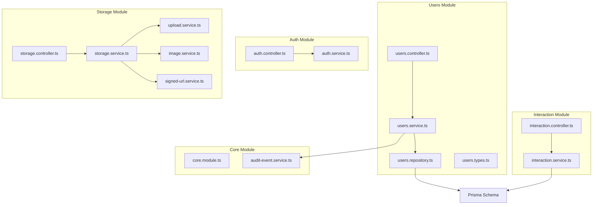
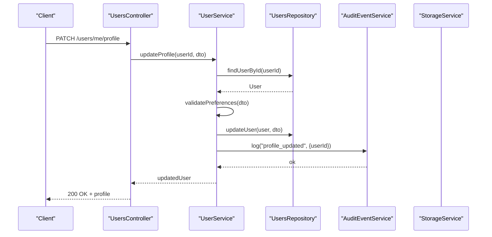
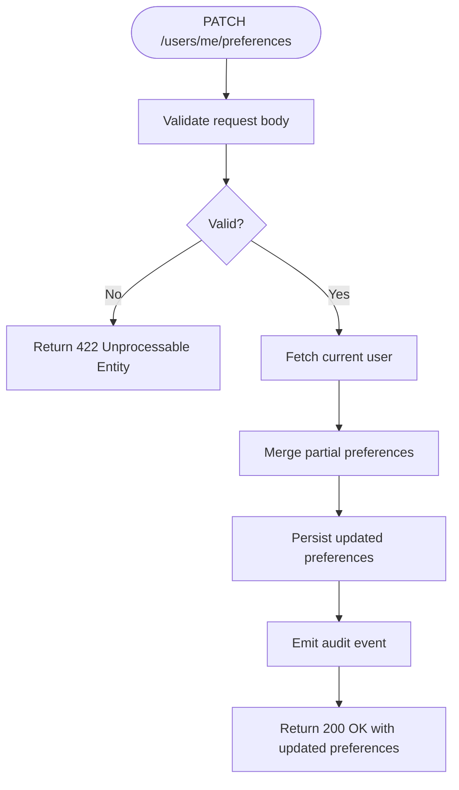
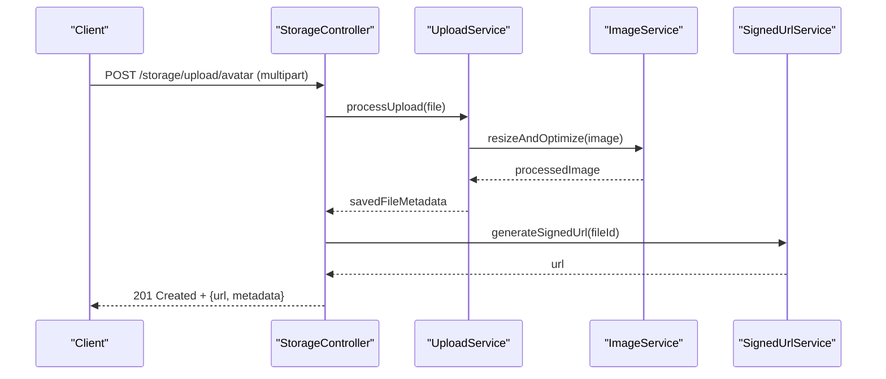
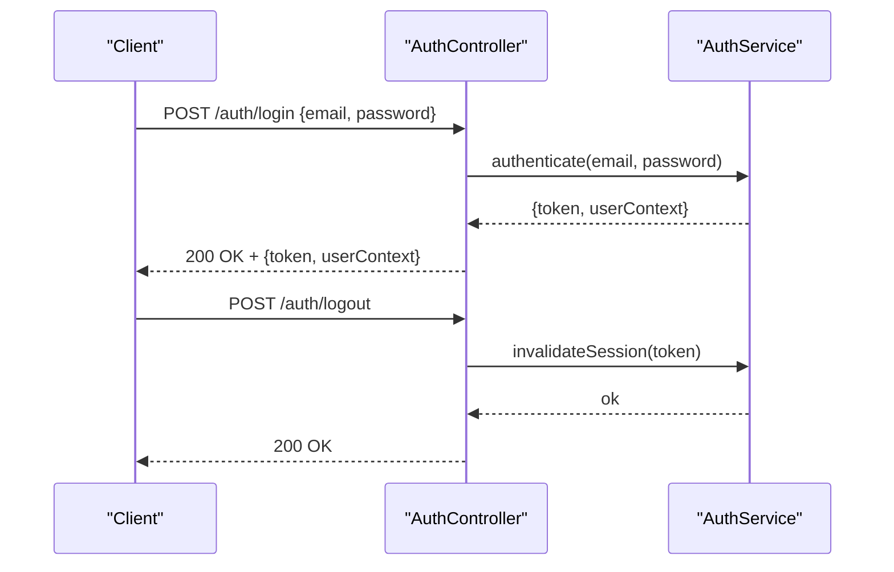
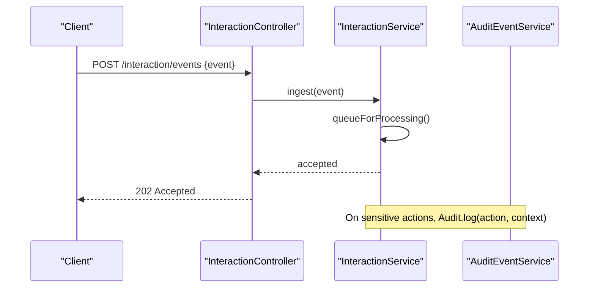
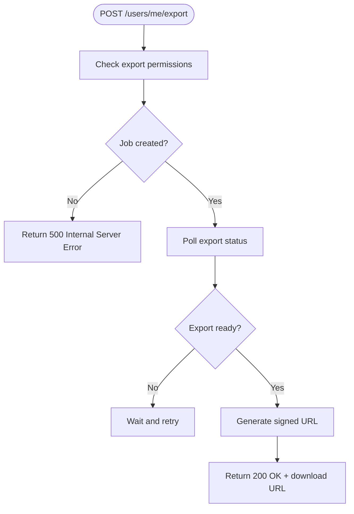
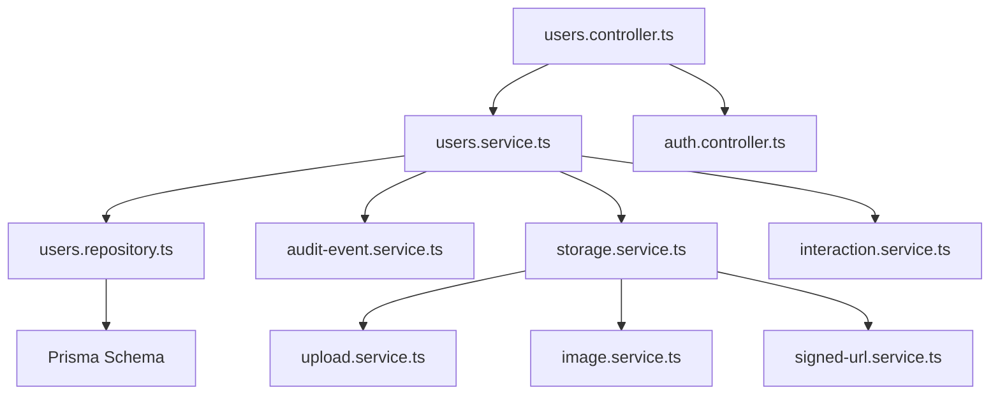

# Users & Profile API

<cite>
**Referenced Files in This Document**
- [users.controller.ts](file://apps/backend/src/users/users.controller.ts)
- [users.service.ts](file://apps/backend/src/users/users.service.ts)
- [users.repository.ts](file://apps/backend/src/users/users.repository.ts)
- [users.types.ts](file://apps/backend/src/users/users.types.ts)
- [auth.controller.ts](file://apps/backend/src/auth/auth.controller.ts)
- [auth.service.ts](file://apps/backend/src/auth/auth.service.ts)
- [storage.controller.ts](file://apps/backend/src/storage/storage.controller.ts)
- [storage.service.ts](file://apps/backend/src/storage/storage.service.ts)
- [upload.service.ts](file://apps/backend/src/storage/upload.service.ts)
- [image.service.ts](file://apps/backend/src/storage/image.service.ts)
- [signed-url.service.ts](file://apps/backend/src/storage/signed-url.service.ts)
- [interaction.controller.ts](file://apps/backend/src/interaction/interaction.controller.ts)
- [interaction.service.ts](file://apps/backend/src/interaction/interaction.service.ts)
- [audit-event.service.ts](file://apps/backend/src/core/audit/audit-event.service.ts)
- [core.module.ts](file://apps/backend/src/core/core.module.ts)
- [app.module.ts](file://apps/backend/src/app.module.ts)
- [schema.prisma](file://apps/backend/prisma/schema.prisma)
</cite>

## Table of Contents
1. [Introduction](#introduction)
2. [Project Structure](#project-structure)
3. [Core Components](#core-components)
4. [Architecture Overview](#architecture-overview)
5. [Detailed Component Analysis](#detailed-component-analysis)
6. [Dependency Analysis](#dependency-analysis)
7. [Performance Considerations](#performance-considerations)
8. [Troubleshooting Guide](#troubleshooting-guide)
9. [Conclusion](#conclusion)
10. [Appendices](#appendices)

## Introduction
This document provides comprehensive API documentation for user management and profile endpoints. It covers:
- User profile CRUD operations
- Preference management and privacy settings
- Data export functionality
- Avatar upload, session management, activity tracking, and audit logging
- Role-based access control (RBAC), permission models, and administrative functions
- Bulk user operations and schema examples

The backend is a NestJS application with modular services, controllers, repositories, and Prisma-based data persistence. The users module exposes REST endpoints for profile and identity management, while storage modules handle avatar uploads and signed URLs. Interaction and audit modules provide activity tracking and audit logging.

## Project Structure
The users and related features are organized into focused modules:
- users: Controllers, services, repositories, DTOs, and types for user profile and preferences
- auth: Authentication, sessions, guards, decorators, and strategies
- storage: Upload, image processing, signed URL generation, and media cleanup
- interaction: Activity tracking and event ingestion
- core: Audit logging, caching, hashing, UUID, transactions, and domain utilities
- prisma: Database schema and migrations

**Diagram sources**
- [users.controller.ts](file://apps/backend/src/users/users.controller.ts)
- [users.service.ts](file://apps/backend/src/users/users.service.ts)
- [users.repository.ts](file://apps/backend/src/users/users.repository.ts)
- [users.types.ts](file://apps/backend/src/users/users.types.ts)
- [auth.controller.ts](file://apps/backend/src/auth/auth.controller.ts)
- [auth.service.ts](file://apps/backend/src/auth/auth.service.ts)
- [storage.controller.ts](file://apps/backend/src/storage/storage.controller.ts)
- [storage.service.ts](file://apps/backend/src/storage/storage.service.ts)
- [upload.service.ts](file://apps/backend/src/storage/upload.service.ts)
- [image.service.ts](file://apps/backend/src/storage/image.service.ts)
- [signed-url.service.ts](file://apps/backend/src/storage/signed-url.service.ts)
- [interaction.controller.ts](file://apps/backend/src/interaction/interaction.controller.ts)
- [interaction.service.ts](file://apps/backend/src/interaction/interaction.service.ts)
- [audit-event.service.ts](file://apps/backend/src/core/audit/audit-event.service.ts)
- [core.module.ts](file://apps/backend/src/core/core.module.ts)
- [schema.prisma](file://apps/backend/prisma/schema.prisma)

**Section sources**
- [app.module.ts](file://apps/backend/src/app.module.ts)
- [core.module.ts](file://apps/backend/src/core/core.module.ts)

## Core Components
- Users Controller: Exposes endpoints for profile retrieval, updates, preferences, privacy settings, and data export.
- Users Service: Orchestrates business logic for profile operations, preference management, privacy configuration, and export workflows.
- Users Repository: Handles data access to the user entity and related tables via Prisma.
- Auth Controller/Service: Manages authentication flows, session creation/validation, and role-based authorization.
- Storage Controller/Service: Provides endpoints for avatar upload, image processing, and signed URL generation for secure downloads.
- Interaction Controller/Service: Ingests user activity events for tracking and analytics.
- Audit Event Service: Records audit logs for sensitive operations such as profile changes and exports.

Key responsibilities:
- Enforce RBAC using guards and decorators from the auth module.
- Validate inputs using DTOs and pipes.
- Persist changes through Prisma repository layer.
- Emit audit events for compliance and traceability.
- Generate signed URLs for secure asset access.

**Section sources**
- [users.controller.ts](file://apps/backend/src/users/users.controller.ts)
- [users.service.ts](file://apps/backend/src/users/users.service.ts)
- [users.repository.ts](file://apps/backend/src/users/users.repository.ts)
- [users.types.ts](file://apps/backend/src/users/users.types.ts)
- [auth.controller.ts](file://apps/backend/src/auth/auth.controller.ts)
- [auth.service.ts](file://apps/backend/src/auth/auth.service.ts)
- [storage.controller.ts](file://apps/backend/src/storage/storage.controller.ts)
- [storage.service.ts](file://apps/backend/src/storage/storage.service.ts)
- [upload.service.ts](file://apps/backend/src/storage/upload.service.ts)
- [image.service.ts](file://apps/backend/src/storage/image.service.ts)
- [signed-url.service.ts](file://apps/backend/src/storage/signed-url.service.ts)
- [interaction.controller.ts](file://apps/backend/src/interaction/interaction.controller.ts)
- [interaction.service.ts](file://apps/backend/src/interaction/interaction.service.ts)
- [audit-event.service.ts](file://apps/backend/src/core/audit/audit-event.service.ts)

## Architecture Overview
The API follows a layered architecture:
- Controllers receive HTTP requests, validate payloads, and delegate to services.
- Services implement business logic, orchestrate repositories, and emit events.
- Repositories interact with the database via Prisma.
- Cross-cutting concerns like auditing, caching, and hashing are provided by core modules.

**Diagram sources**
- [users.controller.ts](file://apps/backend/src/users/users.controller.ts)
- [users.service.ts](file://apps/backend/src/users/users.service.ts)
- [users.repository.ts](file://apps/backend/src/users/users.repository.ts)
- [audit-event.service.ts](file://apps/backend/src/core/audit/audit-event.service.ts)

## Detailed Component Analysis

### User Profile Endpoints
Endpoints for managing user profiles include:
- GET /users/me/profile: Retrieve current user’s profile.
- PATCH /users/me/profile: Update profile fields (name, bio, timezone, locale).
- PUT /users/me/preferences: Set or replace user preferences.
- PATCH /users/me/preferences: Partially update preferences.
- GET /users/me/privacy: Get privacy settings.
- PATCH /users/me/privacy: Update privacy settings.
- POST /users/me/export: Trigger data export; returns job status or download link.

Behavior:
- Input validation via DTOs ensures required fields and constraints.
- Preference updates merge partial changes safely.
- Privacy settings enforce visibility rules for profile fields.
- Export generates a compressed archive and stores it securely; signed URL returned after completion.

**Diagram sources**
- [users.controller.ts](file://apps/backend/src/users/users.controller.ts)
- [users.service.ts](file://apps/backend/src/users/users.service.ts)
- [users.repository.ts](file://apps/backend/src/users/users.repository.ts)
- [audit-event.service.ts](file://apps/backend/src/core/audit/audit-event.service.ts)

**Section sources**
- [users.controller.ts](file://apps/backend/src/users/users.controller.ts)
- [users.service.ts](file://apps/backend/src/users/users.service.ts)
- [users.repository.ts](file://apps/backend/src/users/users.repository.ts)
- [users.types.ts](file://apps/backend/src/users/users.types.ts)

### Avatar Upload and Management
Endpoints:
- POST /storage/upload/avatar: Upload new avatar image.
- GET /storage/avatar/:id/url: Retrieve signed URL for avatar download.

Workflow:
- Client uploads multipart form-data with image file.
- Server validates MIME type and size limits.
- Image processing resizes and optimizes images.
- Signed URL generated for secure, time-limited access.

**Diagram sources**
- [storage.controller.ts](file://apps/backend/src/storage/storage.controller.ts)
- [storage.service.ts](file://apps/backend/src/storage/storage.service.ts)
- [upload.service.ts](file://apps/backend/src/storage/upload.service.ts)
- [image.service.ts](file://apps/backend/src/storage/image.service.ts)
- [signed-url.service.ts](file://apps/backend/src/storage/signed-url.service.ts)

**Section sources**
- [storage.controller.ts](file://apps/backend/src/storage/storage.controller.ts)
- [storage.service.ts](file://apps/backend/src/storage/storage.service.ts)
- [upload.service.ts](file://apps/backend/src/storage/upload.service.ts)
- [image.service.ts](file://apps/backend/src/storage/image.service.ts)
- [signed-url.service.ts](file://apps/backend/src/storage/signed-url.service.ts)

### Session Management and Authentication
Endpoints:
- POST /auth/login: Authenticate user and create session.
- POST /auth/logout: Invalidate session.
- GET /auth/session: Validate current session and return user context.

Behavior:
- Credentials validated against stored hashes.
- JWT or session token issued upon success.
- Guards enforce authenticated routes and roles.

**Diagram sources**
- [auth.controller.ts](file://apps/backend/src/auth/auth.controller.ts)
- [auth.service.ts](file://apps/backend/src/auth/auth.service.ts)

**Section sources**
- [auth.controller.ts](file://apps/backend/src/auth/auth.controller.ts)
- [auth.service.ts](file://apps/backend/src/auth/auth.service.ts)

### Activity Tracking and Audit Logging
Activity tracking:
- POST /interaction/events: Submit user activity events (e.g., profile views, preference changes).
- Events are queued and persisted asynchronously.

Audit logging:
- Sensitive operations (profile updates, exports) emit audit events.
- Audit records include actor, action, timestamp, and context.

**Diagram sources**
- [interaction.controller.ts](file://apps/backend/src/interaction/interaction.controller.ts)
- [interaction.service.ts](file://apps/backend/src/interaction/interaction.service.ts)
- [audit-event.service.ts](file://apps/backend/src/core/audit/audit-event.service.ts)

**Section sources**
- [interaction.controller.ts](file://apps/backend/src/interaction/interaction.controller.ts)
- [interaction.service.ts](file://apps/backend/src/interaction/interaction.service.ts)
- [audit-event.service.ts](file://apps/backend/src/core/audit/audit-event.service.ts)

### Data Export Functionality
Endpoint:
- POST /users/me/export: Request a full data export for the current user.

Workflow:
- Validates user permissions and scope.
- Initiates asynchronous export job.
- Returns job ID or status; client polls or receives webhook notification.
- Upon completion, signed URL provided for secure download.

**Diagram sources**
- [users.controller.ts](file://apps/backend/src/users/users.controller.ts)
- [users.service.ts](file://apps/backend/src/users/users.service.ts)
- [signed-url.service.ts](file://apps/backend/src/storage/signed-url.service.ts)

**Section sources**
- [users.controller.ts](file://apps/backend/src/users/users.controller.ts)
- [users.service.ts](file://apps/backend/src/users/users.service.ts)
- [signed-url.service.ts](file://apps/backend/src/storage/signed-url.service.ts)

### Role-Based Access Control and Permissions
- Guards enforce authentication and role checks on protected endpoints.
- Decorators mark routes requiring specific roles (e.g., admin, editor, viewer).
- Permission model aligns with user roles and resource scopes.

Common roles:
- Admin: Full access to user management, bulk operations, and system settings.
- Editor: Can manage own profile and limited user resources.
- Viewer: Read-only access to own profile and preferences.

Access patterns:
- Middleware validates tokens and attaches user context.
- Controllers check roles before executing sensitive operations.
- Audit logs capture role and action for compliance.

**Section sources**
- [auth.controller.ts](file://apps/backend/src/auth/auth.controller.ts)
- [auth.service.ts](file://apps/backend/src/auth/auth.service.ts)
- [users.controller.ts](file://apps/backend/src/users/users.controller.ts)
- [users.service.ts](file://apps/backend/src/users/users.service.ts)

### Administrative Functions and Bulk Operations
Administrative endpoints (admin role required):
- GET /admin/users: List users with pagination and filters.
- PATCH /admin/users/:id: Update user attributes (e.g., role, status).
- POST /admin/users/bulk: Bulk operations (create, update, deactivate).
- DELETE /admin/users/:id: Deactivate or delete user account.

Bulk operation payload:
- Array of user IDs and operation details.
- Validation ensures consistent structure and allowed operations.
- Results returned per user with success/failure statuses.

**Section sources**
- [users.controller.ts](file://apps/backend/src/users/users.controller.ts)
- [users.service.ts](file://apps/backend/src/users/users.service.ts)
- [users.repository.ts](file://apps/backend/src/users/users.repository.ts)

### User Profile Schemas and Structures
Example schemas and structures:
- User Profile: id, email, name, bio, timezone, locale, createdAt, updatedAt.
- Preferences: theme, language, notifications, privacy toggles, custom fields.
- Privacy Settings: profileVisibility, allowSearchIndexing, shareAnalytics, exportAllowed.
- Export Job: jobId, status, progress, downloadUrl, expiresAt.

These structures are defined in DTOs and types within the users module and enforced during validation.

**Section sources**
- [users.types.ts](file://apps/backend/src/users/users.types.ts)
- [users.controller.ts](file://apps/backend/src/users/users.controller.ts)
- [users.service.ts](file://apps/backend/src/users/users.service.ts)

## Dependency Analysis
The users module depends on:
- Auth module for authentication and authorization.
- Storage module for avatar uploads and signed URLs.
- Interaction module for activity tracking.
- Core module for auditing and utilities.
- Prisma for data persistence.

**Diagram sources**
- [users.controller.ts](file://apps/backend/src/users/users.controller.ts)
- [users.service.ts](file://apps/backend/src/users/users.service.ts)
- [users.repository.ts](file://apps/backend/src/users/users.repository.ts)
- [audit-event.service.ts](file://apps/backend/src/core/audit/audit-event.service.ts)
- [storage.service.ts](file://apps/backend/src/storage/storage.service.ts)
- [upload.service.ts](file://apps/backend/src/storage/upload.service.ts)
- [image.service.ts](file://apps/backend/src/storage/image.service.ts)
- [signed-url.service.ts](file://apps/backend/src/storage/signed-url.service.ts)
- [interaction.service.ts](file://apps/backend/src/interaction/interaction.service.ts)
- [schema.prisma](file://apps/backend/prisma/schema.prisma)

**Section sources**
- [users.controller.ts](file://apps/backend/src/users/users.controller.ts)
- [users.service.ts](file://apps/backend/src/users/users.service.ts)
- [users.repository.ts](file://apps/backend/src/users/users.repository.ts)
- [storage.service.ts](file://apps/backend/src/storage/storage.service.ts)
- [interaction.service.ts](file://apps/backend/src/interaction/interaction.service.ts)
- [audit-event.service.ts](file://apps/backend/src/core/audit/audit-event.service.ts)
- [schema.prisma](file://apps/backend/prisma/schema.prisma)

## Performance Considerations
- Use pagination and filtering for list endpoints to reduce payload size.
- Cache frequently accessed profile data where appropriate.
- Process large exports asynchronously to avoid blocking requests.
- Optimize image uploads with resizing and compression.
- Leverage signed URLs for secure, efficient asset delivery.

[No sources needed since this section provides general guidance]

## Troubleshooting Guide
Common issues and resolutions:
- Validation errors: Ensure request bodies match DTO schemas; check field types and constraints.
- Unauthorized access: Verify authentication token and role permissions.
- Upload failures: Confirm MIME type and size limits; inspect image processing logs.
- Export delays: Monitor job queue status; check storage availability and signing service health.
- Audit gaps: Confirm audit event emission for sensitive operations; review logging configuration.

**Section sources**
- [users.controller.ts](file://apps/backend/src/users/users.controller.ts)
- [users.service.ts](file://apps/backend/src/users/users.service.ts)
- [storage.controller.ts](file://apps/backend/src/storage/storage.controller.ts)
- [storage.service.ts](file://apps/backend/src/storage/storage.service.ts)
- [audit-event.service.ts](file://apps/backend/src/core/audit/audit-event.service.ts)

## Conclusion
The Users & Profile API provides robust endpoints for managing user identities, preferences, privacy, and data exports. It integrates with authentication, storage, activity tracking, and audit logging to deliver a secure and compliant experience. Role-based access control and administrative functions enable scalable user management. Following the documented schemas and workflows ensures reliable integration and maintainability.

[No sources needed since this section summarizes without analyzing specific files]

## Appendices

### API Endpoint Summary
- User Profile
  - GET /users/me/profile
  - PATCH /users/me/profile
- Preferences
  - PUT /users/me/preferences
  - PATCH /users/me/preferences
- Privacy
  - GET /users/me/privacy
  - PATCH /users/me/privacy
- Data Export
  - POST /users/me/export
- Avatar Upload
  - POST /storage/upload/avatar
  - GET /storage/avatar/:id/url
- Session Management
  - POST /auth/login
  - POST /auth/logout
  - GET /auth/session
- Activity Tracking
  - POST /interaction/events
- Admin Operations
  - GET /admin/users
  - PATCH /admin/users/:id
  - POST /admin/users/bulk
  - DELETE /admin/users/:id

[No sources needed since this section lists endpoints without analyzing specific files]