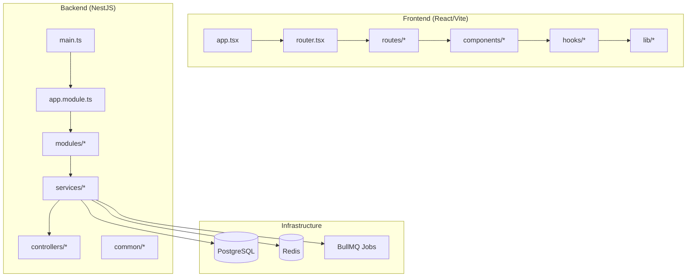
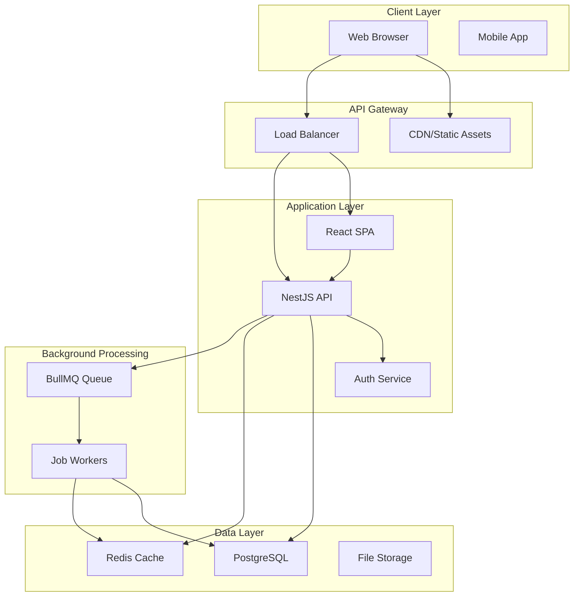
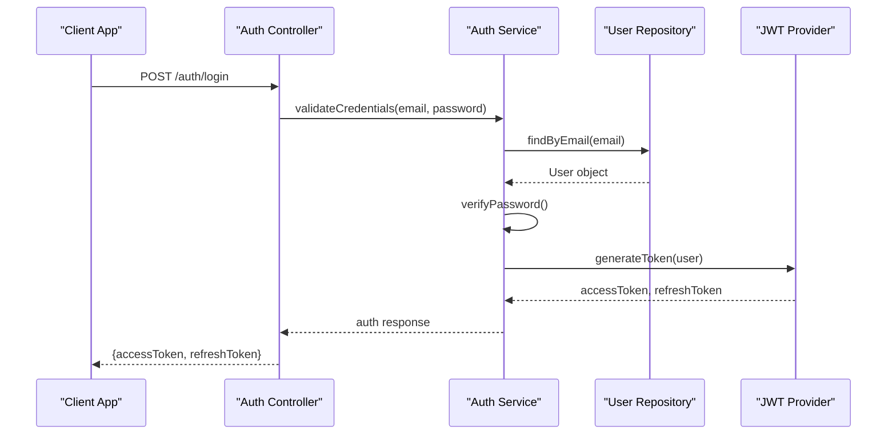
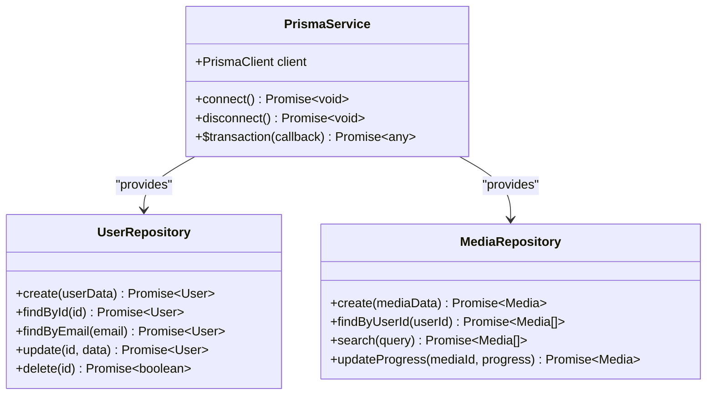
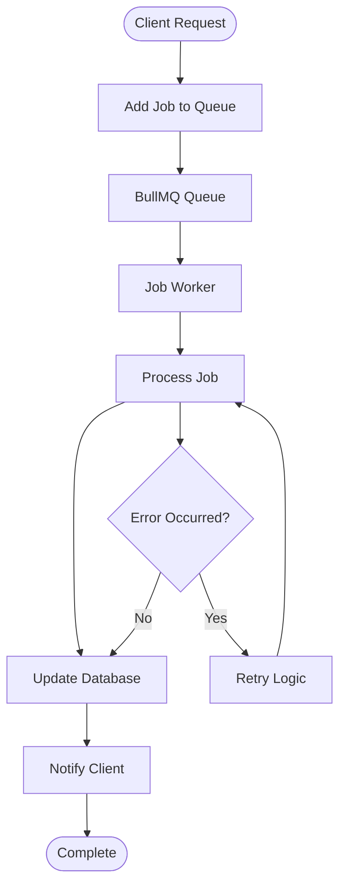
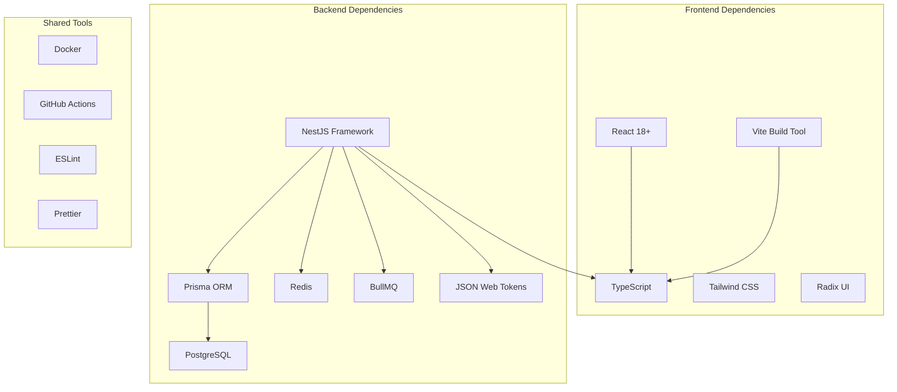
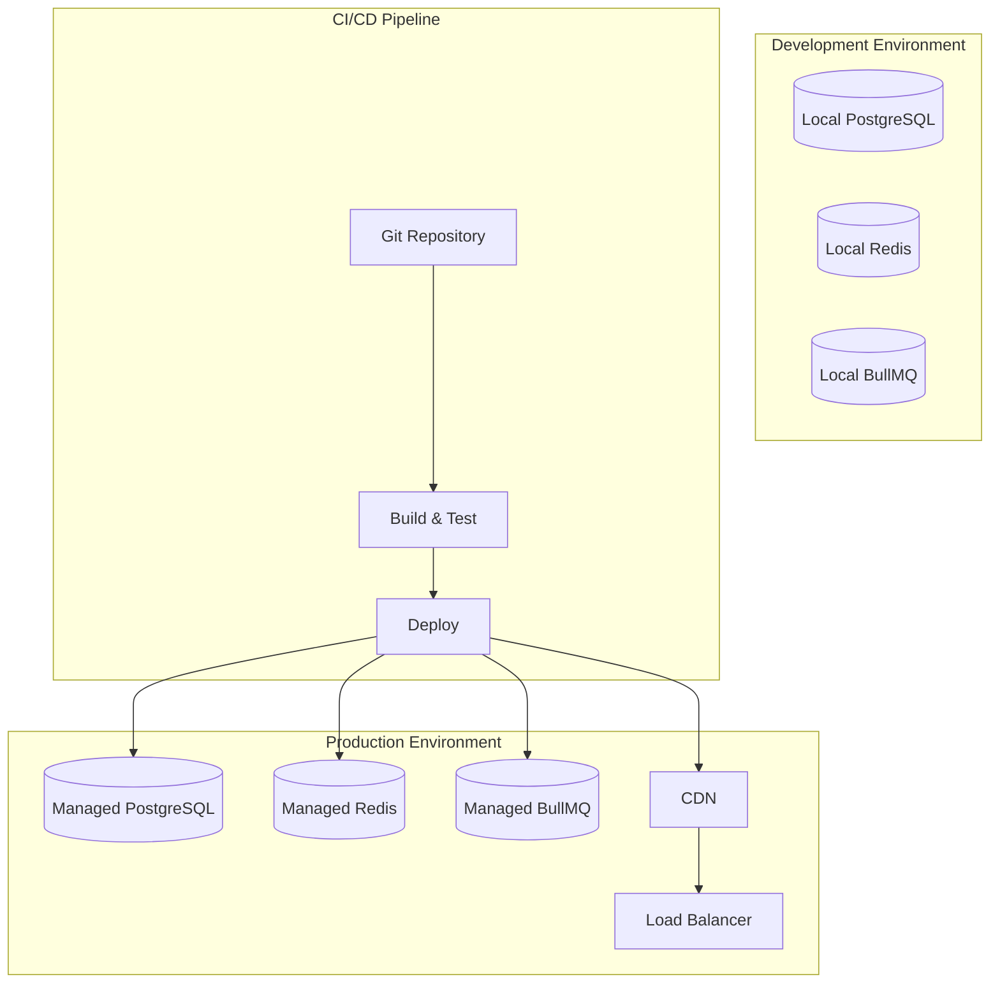

# Architecture Overview

<cite>
**Referenced Files in This Document**
- [package.json](file://package.json)
- [vite.config.ts](file://vite.config.ts)
- [src/app.tsx](file://src/app.tsx)
- [src/router.tsx](file://src/router.tsx)
- [src/routes/__root.tsx](file://src/routes/__root.tsx)
- [apps/backend/package.json](file://apps/backend/package.json)
- [apps/backend/nest-cli.json](file://apps/backend/nest-cli.json)
- [apps/backend/src/main.ts](file://apps/backend/src/main.ts)
- [apps/backend/src/app.module.ts](file://apps/backend/src/app.module.ts)
- [apps/backend/src/prisma/prisma.service.ts](file://apps/backend/src/prisma/prisma.service.ts)
- [apps/backend/prisma/schema.prisma](file://apps/backend/prisma/schema.prisma)
- [apps/backend/src/redis/redis.service.ts](file://apps/backend/src/redis/redis.service.ts)
- [apps/backend/src/bullmq/bullmq.module.ts](file://apps/backend/src/bullmq/bullmq.module.ts)
- [apps/backend/src/observability/logging.service.ts](file://apps/backend/src/observability/logging.service.ts)
- [apps/backend/src/observability/metrics.service.ts](file://apps/backend/src/observability/metrics.service.ts)
- [apps/backend/src/auth/auth.module.ts](file://apps/backend/src/auth/auth.module.ts)
- [apps/backend/src/auth/guards/jwt-auth.guard.ts](file://apps/backend/src/auth/guards/jwt-auth.guard.ts)
- [apps/backend/src/common/filters/global-exception.filter.ts](file://apps/backend/src/common/filters/global-exception.filter.ts)
- [apps/backend/src/config/configuration.ts](file://apps/backend/src/config/configuration.ts)
- [apps/backend/docker-compose.yml](file://apps/backend/docker-compose.yml)
- [apps/backend/Dockerfile](file://apps/backend/Dockerfile)
- [.github/workflows/ci.yml](file://.github/workflows/ci.yml)
</cite>

## Table of Contents
1. [Introduction](#introduction)
2. [Project Structure](#project-structure)
3. [Core Components](#core-components)
4. [Architecture Overview](#architecture-overview)
5. [Detailed Component Analysis](#detailed-component-analysis)
6. [Dependency Analysis](#dependency-analysis)
7. [Performance Considerations](#performance-considerations)
8. [Troubleshooting Guide](#troubleshooting-guide)
9. [Conclusion](#conclusion)
10. [Appendices](#appendices)

## Introduction
This document provides a comprehensive architectural overview of Chronicle Your Media Story, a monorepo that separates the frontend (React with Vite) and backend (NestJS) applications. The system follows a modular, service-oriented design with event-driven communication patterns for background processing and asynchronous tasks. Key technologies include React for the user interface, NestJS for the API layer, Prisma as the ORM, PostgreSQL for persistent storage, Redis for caching and job queues, and BullMQ for background job orchestration. Cross-cutting concerns such as authentication, logging, monitoring, and error handling are implemented consistently across the system to ensure reliability, observability, and maintainability.

## Project Structure
The repository is organized as a monorepo with clear separation between frontend and backend code:
- Frontend application under src/: React components, hooks, routes, and utilities built with Vite
- Backend application under apps/backend/: NestJS modules, services, controllers, and infrastructure
- Shared configuration and tooling at the root level including package management, linting, and build scripts
- Documentation and deployment artifacts in docs/ and configuration files like docker-compose and CI/CD pipelines



**Diagram sources**
- [src/app.tsx](file://src/app.tsx)
- [src/router.tsx](file://src/router.tsx)
- [apps/backend/src/main.ts](file://apps/backend/src/main.ts)
- [apps/backend/src/app.module.ts](file://apps/backend/src/app.module.ts)

**Section sources**
- [package.json](file://package.json)
- [vite.config.ts](file://vite.config.ts)
- [apps/backend/package.json](file://apps/backend/package.json)
- [apps/backend/nest-cli.json](file://apps/backend/nest-cli.json)

## Core Components
The system is built around several core components that work together to provide a complete media story tracking platform:

### Frontend Architecture
- **React Application**: Built with modern React patterns using functional components and hooks
- **Vite Build System**: Fast development experience with hot module replacement and optimized builds
- **Component Library**: Organized UI components following atomic design principles
- **State Management**: Local state with React hooks and context for global state
- **Routing**: Client-side routing with React Router for navigation

### Backend Architecture  
- **NestJS Framework**: Modular architecture with dependency injection and decorators
- **Service Layer**: Business logic encapsulated in reusable services
- **Controller Layer**: HTTP endpoints organized by feature domains
- **Repository Pattern**: Data access abstraction through repositories
- **Module Organization**: Feature-based module structure for scalability

### Infrastructure Components
- **Database Layer**: Prisma ORM with PostgreSQL for data persistence
- **Caching Layer**: Redis for session storage, rate limiting, and caching
- **Job Queue**: BullMQ for background processing and scheduled tasks
- **Authentication**: JWT-based authentication with role-based access control
- **Monitoring**: Comprehensive logging, metrics collection, and health checks

**Section sources**
- [src/app.tsx](file://src/app.tsx)
- [apps/backend/src/app.module.ts](file://apps/backend/src/app.module.ts)
- [apps/backend/src/prisma/prisma.service.ts](file://apps/backend/src/prisma/prisma.service.ts)
- [apps/backend/src/redis/redis.service.ts](file://apps/backend/src/redis/redis.service.ts)

## Architecture Overview
The system follows a layered architecture pattern with clear separation of concerns and well-defined interfaces between components.



**Diagram sources**
- [apps/backend/src/main.ts](file://apps/backend/src/main.ts)
- [apps/backend/src/app.module.ts](file://apps/backend/src/app.module.ts)
- [apps/backend/docker-compose.yml](file://apps/backend/docker-compose.yml)

## Detailed Component Analysis

### Authentication System
The authentication system implements JWT-based authentication with role-based access control, providing secure API access and user session management.



**Diagram sources**
- [apps/backend/src/auth/auth.module.ts](file://apps/backend/src/auth/auth.module.ts)
- [apps/backend/src/auth/guards/jwt-auth.guard.ts](file://apps/backend/src/auth/guards/jwt-auth.guard.ts)

### Database Layer with Prisma
The database layer uses Prisma ORM for type-safe database operations with PostgreSQL, providing schema migrations and query optimization.



**Diagram sources**
- [apps/backend/src/prisma/prisma.service.ts](file://apps/backend/src/prisma/prisma.service.ts)
- [apps/backend/prisma/schema.prisma](file://apps/backend/prisma/schema.prisma)

### Background Job Processing with BullMQ
The background job system uses BullMQ for reliable task processing, enabling asynchronous execution of long-running operations like media processing, notifications, and analytics aggregation.



**Diagram sources**
- [apps/backend/src/bullmq/bullmq.module.ts](file://apps/backend/src/bullmq/bullmq.module.ts)

### Caching Strategy with Redis
Redis provides multiple caching strategies including session storage, rate limiting, and data caching to improve application performance and reduce database load.

```mermaid
stateDiagram-v2
[*] --> CacheMiss
CacheMiss --> CheckRedis["Check Redis Cache"]
CheckRedis --> CacheHit{"Cache Hit?"}
CacheHit --> |Yes| ReturnCached["Return Cached Data"]
CacheHit --> |No| QueryDB["Query Database"]
QueryDB --> UpdateCache["Update Cache"]
UpdateCache --> ReturnFresh["Return Fresh Data"]
ReturnCached --> [*]
ReturnFresh --> [*]
```

**Diagram sources**
- [apps/backend/src/redis/redis.service.ts](file://apps/backend/src/redis/redis.service.ts)

## Dependency Analysis
The system maintains clear dependency boundaries and follows SOLID principles to ensure maintainability and testability.



**Diagram sources**
- [package.json](file://package.json)
- [apps/backend/package.json](file://apps/backend/package.json)

**Section sources**
- [package.json](file://package.json)
- [apps/backend/package.json](file://apps/backend/package.json)

## Performance Considerations
The system incorporates several performance optimization strategies:

### Frontend Optimizations
- Code splitting and lazy loading for faster initial page loads
- Image optimization and caching strategies
- Efficient state management with React hooks
- Bundle size optimization with tree shaking

### Backend Optimizations
- Database query optimization with proper indexing
- Redis caching for frequently accessed data
- Connection pooling for database and cache connections
- Asynchronous processing for long-running operations
- Rate limiting to prevent abuse and ensure fair usage

### Infrastructure Optimizations
- Containerization with Docker for consistent deployments
- Horizontal scaling capabilities for both frontend and backend
- CDN integration for static asset delivery
- Health checks and monitoring for proactive issue detection

## Troubleshooting Guide
Common issues and their resolution strategies:

### Authentication Issues
- Verify JWT token expiration and refresh token rotation
- Check CORS configuration for cross-origin requests
- Validate environment variables for authentication providers
- Review user permission levels and role assignments

### Database Connectivity
- Ensure PostgreSQL connection string is correct
- Verify database migrations are up to date
- Check connection pool limits and timeouts
- Monitor database performance with query analysis

### Cache Invalidation
- Implement proper cache invalidation strategies
- Monitor cache hit rates and memory usage
- Handle cache failures gracefully with fallbacks
- Clear stale cache entries during deployments

### Background Job Failures
- Monitor job queue depth and processing times
- Implement retry logic with exponential backoff
- Set up dead letter queues for failed jobs
- Log detailed error information for debugging

**Section sources**
- [apps/backend/src/common/filters/global-exception.filter.ts](file://apps/backend/src/common/filters/global-exception.filter.ts)
- [apps/backend/src/observability/logging.service.ts](file://apps/backend/src/observability/logging.service.ts)
- [apps/backend/src/observability/metrics.service.ts](file://apps/backend/src/observability/metrics.service.ts)

## Conclusion
Chronicle Your Media Story's architecture demonstrates a well-structured approach to building a modern web application with clear separation of concerns, scalable infrastructure, and comprehensive observability. The monorepo structure facilitates development and deployment coordination while maintaining clean boundaries between frontend and backend systems. The use of established technologies like React, NestJS, Prisma, and PostgreSQL ensures reliability and maintainability, while Redis and BullMQ provide the necessary infrastructure for high-performance caching and background processing. The system's modular design enables easy extension and modification as requirements evolve, making it suitable for long-term development and scaling.

## Appendices

### Deployment Topology
The system supports multiple deployment environments with consistent containerization and orchestration patterns.



**Diagram sources**
- [apps/backend/docker-compose.yml](file://apps/backend/docker-compose.yml)
- [.github/workflows/ci.yml](file://.github/workflows/ci.yml)

### Configuration Management
Environment-specific configuration is managed through structured configuration files and environment variables.

**Section sources**
- [apps/backend/src/config/configuration.ts](file://apps/backend/src/config/configuration.ts)
- [apps/backend/Dockerfile](file://apps/backend/Dockerfile)