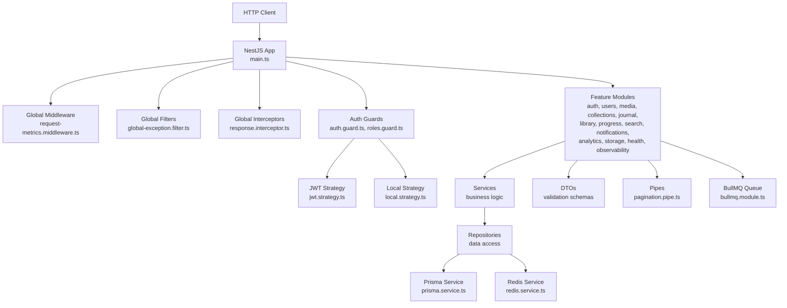
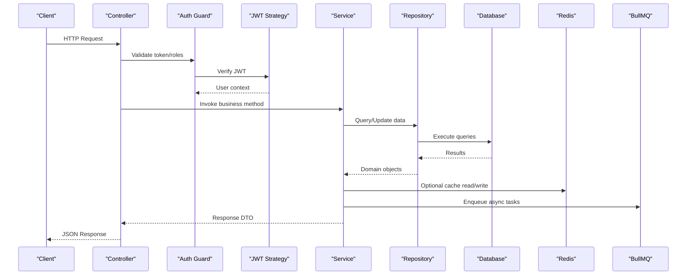
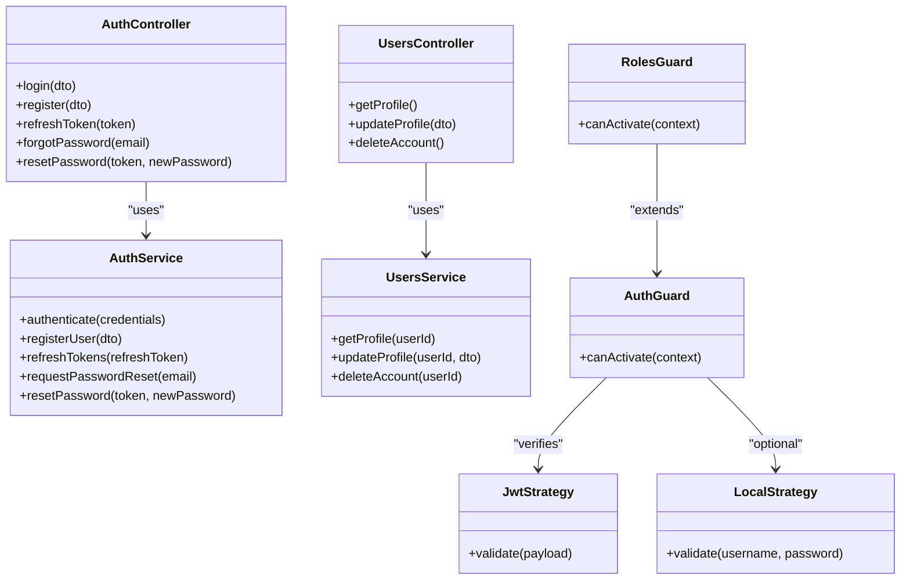
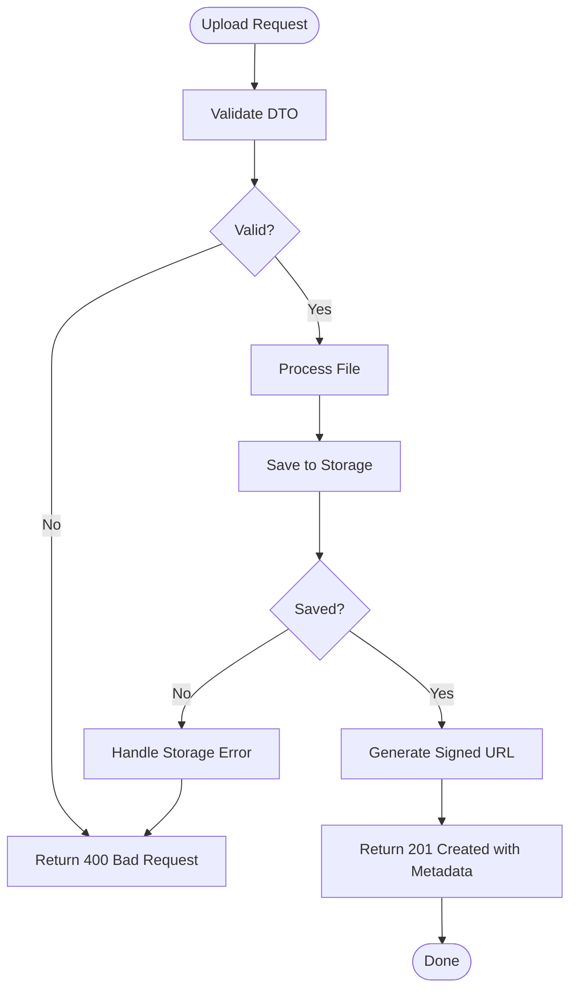
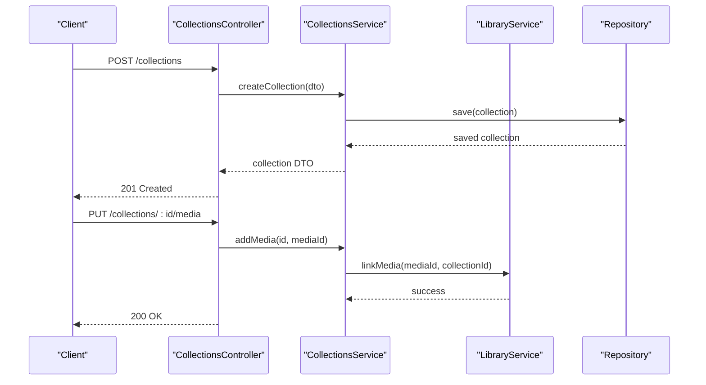
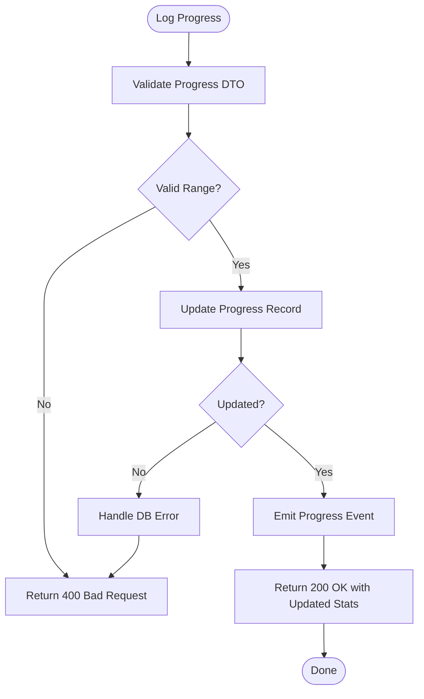
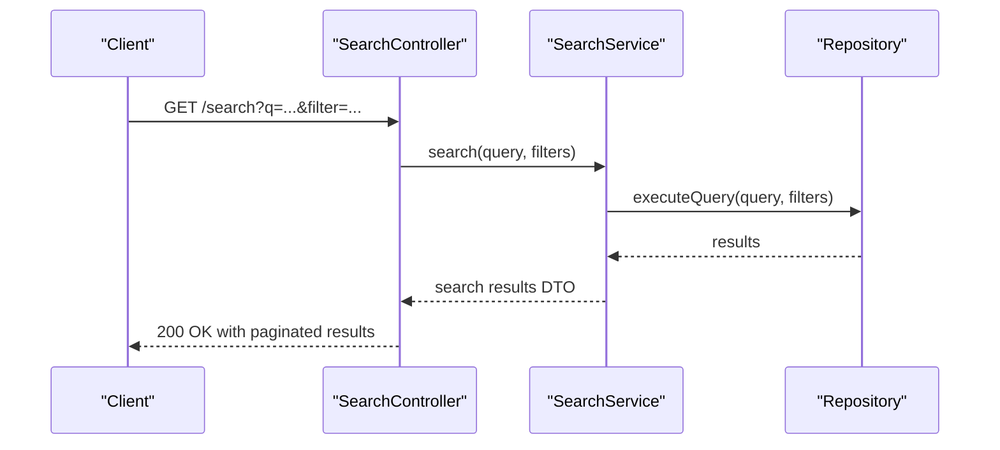
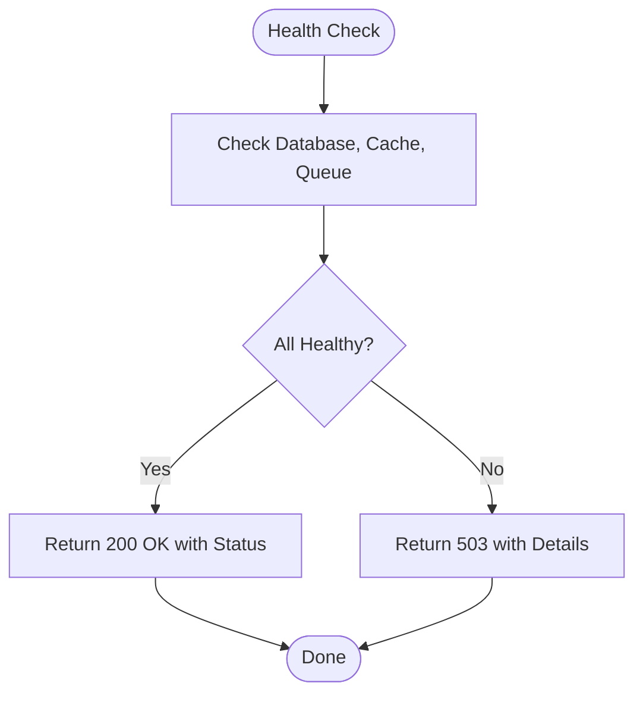
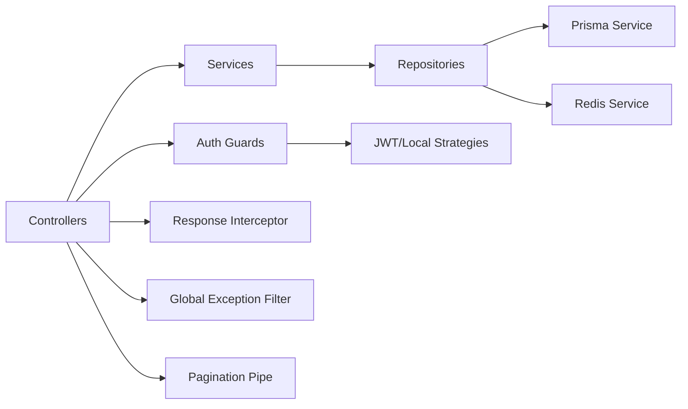

# API Endpoints & Controllers

<cite>
**Referenced Files in This Document**
- [main.ts](file://apps/backend/src/main.ts)
- [app.module.ts](file://apps/backend/src/app.module.ts)
- [app.bootstrap.ts](file://apps/backend/src/app.bootstrap.ts)
- [auth.controller.ts](file://apps/backend/src/auth/auth.controller.ts)
- [auth.module.ts](file://apps/backend/src/auth/auth.module.ts)
- [users.controller.ts](file://apps/backend/src/users/users.controller.ts)
- [media.controller.ts](file://apps/backend/src/media/media.controller.ts)
- [collections.controller.ts](file://apps/backend/src/collections/collections.controller.ts)
- [journal.controller.ts](file://apps/backend/src/journal/journal.controller.ts)
- [library.controller.ts](file://apps/backend/src/library/library.controller.ts)
- [progress.controller.ts](file://apps/backend/src/progress/progress.controller.ts)
- [search.controller.ts](file://apps/backend/src/search/search.controller.ts)
- [notifications.controller.ts](file://apps/backend/src/notifications/notifications.controller.ts)
- [analytics.controller.ts](file://apps/backend/src/analytics/analytics.controller.ts)
- [storage.controller.ts](file://apps/backend/src/storage/storage.controller.ts)
- [health.controller.ts](file://apps/backend/src/health/health.controller.ts)
- [metrics.controller.ts](file://apps/backend/src/observability/metrics.controller.ts)
- [common.module.ts](file://apps/backend/src/common/common.module.ts)
- [core.module.ts](file://apps/backend/src/core/core.module.ts)
- [configuration.ts](file://apps/backend/src/config/configuration.ts)
- [env.validation.ts](file://apps/backend/src/config/env.validation.ts)
- [request-metrics.middleware.ts](file://apps/backend/src/observability/request-metrics.middleware.ts)
- [rate-limit-audit.service.ts](file://apps/backend/src/hardening/rate-limit-audit.service.ts)
- [performance-audit.service.ts](file://apps/backend/src/hardening/performance-audit.service.ts)
- [database-optimization.service.ts](file://apps/backend/src/hardening/database-optimization.service.ts)
- [cache-invalidation.service.ts](file://apps/backend/src/hardening/cache-invalidation.service.ts)
- [exceptions/index.ts](file://apps/backend/src/common/exceptions/index.ts)
- [filters/global-exception.filter.ts](file://apps/backend/src/common/filters/global-exception.filter.ts)
- [interceptors/response.interceptor.ts](file://apps/backend/src/common/interceptors/response.interceptor.ts)
- [pagination/pagination.pipe.ts](file://apps/backend/src/common/pagination/pagination.pipe.ts)
- [response/envelope.ts](file://apps/backend/src/common/response/envelope.ts)
- [result/result.ts](file://apps/backend/src/common/result/result.ts)
- [auth.guard.ts](file://apps/backend/src/auth/guards/auth.guard.ts)
- [roles.guard.ts](file://apps/backend/src/auth/guards/roles.guard.ts)
- [jwt.strategy.ts](file://apps/backend/src/auth/strategies/jwt.strategy.ts)
- [local.strategy.ts](file://apps/backend/src/auth/strategies/local.strategy.ts)
- [auth.service.ts](file://apps/backend/src/auth/auth.service.ts)
- [users.service.ts](file://apps/backend/src/users/users.service.ts)
- [media.service.ts](file://apps/backend/src/media/media.service.ts)
- [collections.service.ts](file://apps/backend/src/collections/collections.service.ts)
- [journal.service.ts](file://apps/backend/src/journal/journal.service.ts)
- [library.service.ts](file://apps/backend/src/library/library.service.ts)
- [progress.service.ts](file://apps/backend/src/progress/progress.service.ts)
- [search.service.ts](file://apps/backend/src/search/search.service.ts)
- [notifications.service.ts](file://apps/backend/src/notifications/notifications.service.ts)
- [analytics.service.ts](file://apps/backend/src/analytics/analytics.service.ts)
- [storage.service.ts](file://apps/backend/src/storage/storage.service.ts)
- [prisma.service.ts](file://apps/backend/src/prisma/prisma.service.ts)
- [redis.service.ts](file://apps/backend/src/redis/redis.service.ts)
- [bullmq.module.ts](file://apps/backend/src/bullmq/bullmq.module.ts)
</cite>

## Table of Contents
1. [Introduction](#introduction)
2. [Project Structure](#project-structure)
3. [Core Components](#core-components)
4. [Architecture Overview](#architecture-overview)
5. [Detailed Component Analysis](#detailed-component-analysis)
6. [Dependency Analysis](#dependency-analysis)
7. [Performance Considerations](#performance-considerations)
8. [Troubleshooting Guide](#troubleshooting-guide)
9. [Conclusion](#conclusion)
10. [Appendices](#appendices)

## Introduction
This document provides a comprehensive guide to the RESTful API endpoints and controller architecture of the backend application. It explains HTTP methods, URL patterns, request/response schemas, authentication requirements, DTO validation, error handling strategies, status codes, response envelope structure, API versioning, rate limiting, transformation layers, middleware stack, interceptors, global filters, documentation standards, testing approaches, and client integration guidelines. The goal is to make the API accessible to both technical and non-technical readers while maintaining precision and traceability to source files.

## Project Structure
The backend follows a NestJS modular architecture with feature modules (auth, users, media, collections, journal, library, progress, search, notifications, analytics, storage, observability, health). Each module typically contains:
- Controller(s): HTTP endpoints
- Service(s): Business logic
- Repository(s): Data access
- DTOs: Request/response schemas
- Guards/Strategies: Authentication and authorization
- Interceptors/Filters/Pipes: Cross-cutting concerns

**Diagram sources**
- [main.ts](file://apps/backend/src/main.ts)
- [request-metrics.middleware.ts](file://apps/backend/src/observability/request-metrics.middleware.ts)
- [global-exception.filter.ts](file://apps/backend/src/common/filters/global-exception.filter.ts)
- [response.interceptor.ts](file://apps/backend/src/common/interceptors/response.interceptor.ts)
- [auth.guard.ts](file://apps/backend/src/auth/guards/auth.guard.ts)
- [roles.guard.ts](file://apps/backend/src/auth/guards/roles.guard.ts)
- [jwt.strategy.ts](file://apps/backend/src/auth/strategies/jwt.strategy.ts)
- [local.strategy.ts](file://apps/backend/src/auth/strategies/local.strategy.ts)
- [prisma.service.ts](file://apps/backend/src/prisma/prisma.service.ts)
- [redis.service.ts](file://apps/backend/src/redis/redis.service.ts)
- [bullmq.module.ts](file://apps/backend/src/bullmq/bullmq.module.ts)

**Section sources**
- [app.module.ts](file://apps/backend/src/app.module.ts)
- [common.module.ts](file://apps/backend/src/common/common.module.ts)
- [core.module.ts](file://apps/backend/src/core/core.module.ts)

## Core Components
- Controllers: Define HTTP endpoints per feature area (auth, users, media, collections, journal, library, progress, search, notifications, analytics, storage, health, metrics).
- Services: Implement business logic, orchestrate repositories, and handle domain operations.
- Repositories: Encapsulate data access using Prisma or Redis where applicable.
- DTOs: Validate requests and format responses consistently.
- Guards/Strategies: Enforce authentication and role-based authorization.
- Interceptors/Filters/Pipes: Provide cross-cutting behavior like response envelope wrapping, exception mapping, and pagination parsing.
- Configuration: Centralized environment configuration and validation.

Key responsibilities:
- Controllers map HTTP routes to service methods.
- Services coordinate domain logic and external integrations.
- Repositories abstract persistence details.
- DTOs ensure input validation and output shaping.
- Guards/Strategies secure endpoints.
- Interceptors/Filters standardize responses and errors.
- Pipes transform query parameters and payloads.

**Section sources**
- [auth.controller.ts](file://apps/backend/src/auth/auth.controller.ts)
- [users.controller.ts](file://apps/backend/src/users/users.controller.ts)
- [media.controller.ts](file://apps/backend/src/media/media.controller.ts)
- [collections.controller.ts](file://apps/backend/src/collections/collections.controller.ts)
- [journal.controller.ts](file://apps/backend/src/journal/journal.controller.ts)
- [library.controller.ts](file://apps/backend/src/library/library.controller.ts)
- [progress.controller.ts](file://apps/backend/src/progress/progress.controller.ts)
- [search.controller.ts](file://apps/backend/src/search/search.controller.ts)
- [notifications.controller.ts](file://apps/backend/src/notifications/notifications.controller.ts)
- [analytics.controller.ts](file://apps/backend/src/analytics/analytics.controller.ts)
- [storage.controller.ts](file://apps/backend/src/storage/storage.controller.ts)
- [health.controller.ts](file://apps/backend/src/health/health.controller.ts)
- [metrics.controller.ts](file://apps/backend/src/observability/metrics.controller.ts)
- [configuration.ts](file://apps/backend/src/config/configuration.ts)
- [env.validation.ts](file://apps/backend/src/config/env.validation.ts)

## Architecture Overview
The API uses a layered architecture:
- Presentation Layer: Controllers define endpoints and accept validated DTOs.
- Application Layer: Services implement use cases and orchestrate domain operations.
- Infrastructure Layer: Repositories interact with databases (Prisma), caches (Redis), queues (BullMQ), and external services.
- Cross-Cutting Concerns: Global middleware, guards, strategies, interceptors, filters, and pipes provide consistent behavior across all endpoints.

**Diagram sources**
- [auth.guard.ts](file://apps/backend/src/auth/guards/auth.guard.ts)
- [jwt.strategy.ts](file://apps/backend/src/auth/strategies/jwt.strategy.ts)
- [prisma.service.ts](file://apps/backend/src/prisma/prisma.service.ts)
- [redis.service.ts](file://apps/backend/src/redis/redis.service.ts)
- [bullmq.module.ts](file://apps/backend/src/bullmq/bullmq.module.ts)

## Detailed Component Analysis

### Authentication & Authorization
- Endpoints: Login, register, password reset, token refresh, profile management.
- Methods: POST for login/register, GET/PUT for profile, POST for token refresh.
- URL Patterns: /api/auth/*, /api/users/*
- Authentication: JWT strategy validates tokens; local strategy supports username/password flow.
- Authorization: Roles guard enforces RBAC on protected endpoints.
- DTOs: Request DTOs validate credentials and user data; response DTOs shape user profiles and tokens.
- Error Handling: Unauthorized (401), Forbidden (403), Validation errors (422), Conflict (409) for duplicate emails.
- Rate Limiting: Audit service monitors rate limits; configure via environment variables.

**Diagram sources**
- [auth.controller.ts](file://apps/backend/src/auth/auth.controller.ts)
- [users.controller.ts](file://apps/backend/src/users/users.controller.ts)
- [auth.service.ts](file://apps/backend/src/auth/auth.service.ts)
- [users.service.ts](file://apps/backend/src/users/users.service.ts)
- [jwt.strategy.ts](file://apps/backend/src/auth/strategies/jwt.strategy.ts)
- [local.strategy.ts](file://apps/backend/src/auth/strategies/local.strategy.ts)
- [auth.guard.ts](file://apps/backend/src/auth/guards/auth.guard.ts)
- [roles.guard.ts](file://apps/backend/src/auth/guards/roles.guard.ts)

**Section sources**
- [auth.controller.ts](file://apps/backend/src/auth/auth.controller.ts)
- [auth.module.ts](file://apps/backend/src/auth/auth.module.ts)
- [auth.service.ts](file://apps/backend/src/auth/auth.service.ts)
- [users.controller.ts](file://apps/backend/src/users/users.controller.ts)
- [users.service.ts](file://apps/backend/src/users/users.service.ts)
- [jwt.strategy.ts](file://apps/backend/src/auth/strategies/jwt.strategy.ts)
- [local.strategy.ts](file://apps/backend/src/auth/strategies/local.strategy.ts)
- [auth.guard.ts](file://apps/backend/src/auth/guards/auth.guard.ts)
- [roles.guard.ts](file://apps/backend/src/auth/guards/roles.guard.ts)

### Media Management
- Endpoints: Create, list, get, update, delete media items; upload images/videos; generate signed URLs.
- Methods: GET/POST/PUT/DELETE for CRUD; POST for uploads; GET for signed URLs.
- URL Patterns: /api/media/*, /api/storage/*
- DTOs: Media creation/update DTOs validate metadata; upload DTOs handle multipart forms.
- Error Handling: 400 for invalid payloads, 404 for missing resources, 413 for oversized uploads, 500 for server errors.
- Storage: Uses storage service for file handling; optional cloud provider integration via configuration.

**Diagram sources**
- [media.controller.ts](file://apps/backend/src/media/media.controller.ts)
- [storage.controller.ts](file://apps/backend/src/storage/storage.controller.ts)
- [media.service.ts](file://apps/backend/src/media/media.service.ts)
- [storage.service.ts](file://apps/backend/src/storage/storage.service.ts)

**Section sources**
- [media.controller.ts](file://apps/backend/src/media/media.controller.ts)
- [storage.controller.ts](file://apps/backend/src/storage/storage.controller.ts)
- [media.service.ts](file://apps/backend/src/media/media.service.ts)
- [storage.service.ts](file://apps/backend/src/storage/storage.service.ts)

### Collections & Library
- Endpoints: Manage collections (CRUD), add/remove media, view statistics, smart collections.
- Methods: GET/POST/PUT/DELETE for collections; POST/DELETE for media associations.
- URL Patterns: /api/collections/*, /api/library/*
- DTOs: Collection creation/update DTOs; library filtering/sorting DTOs.
- Error Handling: 404 for missing collections, 409 for duplicate names, 422 for validation errors.
- Features: Smart collection rules, statistics aggregation, timeline events.

**Diagram sources**
- [collections.controller.ts](file://apps/backend/src/collections/collections.controller.ts)
- [collections.service.ts](file://apps/backend/src/collections/collections.service.ts)
- [library.service.ts](file://apps/backend/src/library/library.service.ts)

**Section sources**
- [collections.controller.ts](file://apps/backend/src/collections/collections.controller.ts)
- [library.controller.ts](file://apps/backend/src/library/library.controller.ts)
- [collections.service.ts](file://apps/backend/src/collections/collections.service.ts)
- [library.service.ts](file://apps/backend/src/library/library.service.ts)

### Journal & Progress Tracking
- Endpoints: Create/read/update journal entries; log progress; calculate completion stats.
- Methods: GET/POST/PUT/DELETE for journal; POST for progress logging.
- URL Patterns: /api/journal/*, /api/progress/*
- DTOs: Journal entry DTOs with timestamps; progress DTOs with percentages and statuses.
- Error Handling: 400 for invalid progress values, 404 for missing entries, 422 for validation errors.
- Features: Timeline events, statistics aggregation, streak tracking.

**Diagram sources**
- [journal.controller.ts](file://apps/backend/src/journal/journal.controller.ts)
- [progress.controller.ts](file://apps/backend/src/progress/progress.controller.ts)
- [journal.service.ts](file://apps/backend/src/journal/journal.service.ts)
- [progress.service.ts](file://apps/backend/src/progress/progress.service.ts)

**Section sources**
- [journal.controller.ts](file://apps/backend/src/journal/journal.controller.ts)
- [progress.controller.ts](file://apps/backend/src/progress/progress.controller.ts)
- [journal.service.ts](file://apps/backend/src/journal/journal.service.ts)
- [progress.service.ts](file://apps/backend/src/progress/progress.service.ts)

### Search & Notifications
- Endpoints: Full-text search across media/journal; manage notifications (read/unread, preferences).
- Methods: GET for search; GET/PUT/DELETE for notifications.
- URL Patterns: /api/search/*, /api/notifications/*
- DTOs: Search query DTOs with filters; notification DTOs with types and priorities.
- Error Handling: 400 for invalid search params, 404 for missing notifications, 422 for validation errors.
- Features: Suggestion engine, digest scheduling, queue processing via BullMQ.

**Diagram sources**
- [search.controller.ts](file://apps/backend/src/search/search.controller.ts)
- [search.service.ts](file://apps/backend/src/search/search.service.ts)
- [notifications.controller.ts](file://apps/backend/src/notifications/notifications.controller.ts)
- [notifications.service.ts](file://apps/backend/src/notifications/notifications.service.ts)

**Section sources**
- [search.controller.ts](file://apps/backend/src/search/search.controller.ts)
- [notifications.controller.ts](file://apps/backend/src/notifications/notifications.controller.ts)
- [search.service.ts](file://apps/backend/src/search/search.service.ts)
- [notifications.service.ts](file://apps/backend/src/notifications/notifications.service.ts)

### Analytics & Observability
- Endpoints: Dashboard insights, metrics, health checks.
- Methods: GET for analytics and metrics; GET for health.
- URL Patterns: /api/analytics/*, /api/observability/metrics, /api/health
- DTOs: Aggregated analytics DTOs; health check DTOs with component statuses.
- Error Handling: 503 for unhealthy components, 422 for invalid analytics queries.
- Features: Performance audit, database optimization, cache invalidation, rate limit auditing.

**Diagram sources**
- [analytics.controller.ts](file://apps/backend/src/analytics/analytics.controller.ts)
- [metrics.controller.ts](file://apps/backend/src/observability/metrics.controller.ts)
- [health.controller.ts](file://apps/backend/src/health/health.controller.ts)
- [analytics.service.ts](file://apps/backend/src/analytics/analytics.service.ts)
- [performance-audit.service.ts](file://apps/backend/src/hardening/performance-audit.service.ts)
- [database-optimization.service.ts](file://apps/backend/src/hardening/database-optimization.service.ts)
- [cache-invalidation.service.ts](file://apps/backend/src/hardening/cache-invalidation.service.ts)
- [rate-limit-audit.service.ts](file://apps/backend/src/hardening/rate-limit-audit.service.ts)

**Section sources**
- [analytics.controller.ts](file://apps/backend/src/analytics/analytics.controller.ts)
- [metrics.controller.ts](file://apps/backend/src/observability/metrics.controller.ts)
- [health.controller.ts](file://apps/backend/src/health/health.controller.ts)
- [analytics.service.ts](file://apps/backend/src/analytics/analytics.service.ts)
- [performance-audit.service.ts](file://apps/backend/src/hardening/performance-audit.service.ts)
- [database-optimization.service.ts](file://apps/backend/src/hardening/database-optimization.service.ts)
- [cache-invalidation.service.ts](file://apps/backend/src/hardening/cache-invalidation.service.ts)
- [rate-limit-audit.service.ts](file://apps/backend/src/hardening/rate-limit-audit.service.ts)

## Dependency Analysis
The system exhibits clear separation of concerns with minimal coupling between controllers and infrastructure. Key dependencies:
- Controllers depend on services for business logic.
- Services depend on repositories for data access.
- Repositories depend on Prisma and Redis services.
- Guards/Strategies depend on JWT and configuration.
- Interceptors/Filters are globally applied.

**Diagram sources**
- [auth.controller.ts](file://apps/backend/src/auth/auth.controller.ts)
- [auth.service.ts](file://apps/backend/src/auth/auth.service.ts)
- [prisma.service.ts](file://apps/backend/src/prisma/prisma.service.ts)
- [redis.service.ts](file://apps/backend/src/redis/redis.service.ts)
- [auth.guard.ts](file://apps/backend/src/auth/guards/auth.guard.ts)
- [jwt.strategy.ts](file://apps/backend/src/auth/strategies/jwt.strategy.ts)
- [response.interceptor.ts](file://apps/backend/src/common/interceptors/response.interceptor.ts)
- [global-exception.filter.ts](file://apps/backend/src/common/filters/global-exception.filter.ts)
- [pagination.pipe.ts](file://apps/backend/src/common/pagination/pagination.pipe.ts)

**Section sources**
- [app.module.ts](file://apps/backend/src/app.module.ts)
- [common.module.ts](file://apps/backend/src/common/common.module.ts)
- [core.module.ts](file://apps/backend/src/core/core.module.ts)

## Performance Considerations
- Pagination: Use pagination pipe for efficient data retrieval.
- Caching: Leverage Redis for frequently accessed data; implement cache invalidation strategies.
- Database Optimization: Utilize Prisma best practices; optimize queries and indexes.
- Rate Limiting: Monitor and enforce rate limits to prevent abuse.
- Async Processing: Offload heavy tasks to BullMQ queues.
- Monitoring: Track performance metrics and health indicators.

[No sources needed since this section provides general guidance]

## Troubleshooting Guide
Common issues and resolutions:
- Authentication Failures: Verify JWT configuration and token validity.
- Validation Errors: Check DTO schemas and input formats.
- Database Errors: Inspect Prisma queries and connection settings.
- Cache Misses: Ensure Redis connectivity and cache keys.
- Rate Limit Exceeded: Adjust limits or investigate traffic spikes.
- Health Check Failures: Review component statuses and dependencies.

**Section sources**
- [exceptions/index.ts](file://apps/backend/src/common/exceptions/index.ts)
- [global-exception.filter.ts](file://apps/backend/src/common/filters/global-exception.filter.ts)
- [configuration.ts](file://apps/backend/src/config/configuration.ts)
- [env.validation.ts](file://apps/backend/src/config/env.validation.ts)

## Conclusion
The API architecture emphasizes modularity, security, and scalability through well-defined layers, robust authentication, consistent DTO validation, and comprehensive error handling. By adhering to established patterns and leveraging cross-cutting concerns, the system ensures maintainability and performance. Clients should follow the documented standards for seamless integration.

[No sources needed since this section summarizes without analyzing specific files]

## Appendices

### API Versioning Strategy
- Use URL path versioning (e.g., /api/v1/*) for backward compatibility.
- Deprecate old versions with sunset headers.
- Maintain separate controllers/modules per major version if necessary.

### Rate Limiting
- Configure via environment variables.
- Monitor with rate-limit-audit service.
- Implement adaptive limits based on user roles.

### Request/Response Transformation
- DTOs for input validation and output shaping.
- Interceptors for common transformations (timestamps, correlation IDs).
- Pipes for parameter conversion and validation.

### Middleware Stack
- Global middleware for logging and metrics.
- Custom middleware for request tracing and CORS.
- Order: Middleware → Guards → Interceptors → Controllers → Filters.

### Testing Approaches
- Unit tests for services and DTOs.
- Integration tests for controllers and repositories.
- E2E tests for critical user flows.
- Load tests with Artillery/k6 scripts.

### Client Integration Guidelines
- Use official SDKs or generated clients from OpenAPI specs.
- Implement retry logic with exponential backoff.
- Handle errors gracefully with user-friendly messages.
- Securely store tokens and refresh them automatically.

[No sources needed since this section provides general guidance]