# Backend Architecture

<cite>
**Referenced Files in This Document**
- [app.module.ts](file://apps/backend/src/app.module.ts)
- [main.ts](file://apps/backend/src/main.ts)
- [app.bootstrap.ts](file://apps/backend/src/app.bootstrap.ts)
- [auth.module.ts](file://apps/backend/src/auth/auth.module.ts)
- [auth.service.ts](file://apps/backend/src/auth/auth.service.ts)
- [auth.controller.ts](file://apps/backend/src/auth/auth.controller.ts)
- [users.module.ts](file://apps/backend/src/users/users.module.ts)
- [users.service.ts](file://apps/backend/src/users/users.service.ts)
- [users.repository.ts](file://apps/backend/src/users/users.repository.ts)
- [prisma.module.ts](file://apps/backend/src/prisma/prisma.module.ts)
- [prisma.service.ts](file://apps/backend/src/prisma/prisma.service.ts)
- [schema.prisma](file://apps/backend/src/prisma/schema.prisma)
- [bullmq.module.ts](file://apps/backend/src/bullmq/bullmq.module.ts)
- [redis.module.ts](file://apps/backend/src/redis/redis.module.ts)
- [redis.service.ts](file://apps/backend/src/redis/redis.service.ts)
- [notifications.module.ts](file://apps/backend/src/notifications/notifications.module.ts)
- [notification-queue.service.ts](file://apps/backend/src/notifications/notification-queue.service.ts)
- [scheduler.service.ts](file://apps/backend/src/notifications/scheduler.service.ts)
- [observability.module.ts](file://apps/backend/src/observability/observability.module.ts)
- [logging.service.ts](file://apps/backend/src/observability/logging.service.ts)
- [metrics.service.ts](file://apps/backend/src/observability/metrics.service.ts)
- [request-metrics.middleware.ts](file://apps/backend/src/observability/request-metrics.middleware.ts)
- [common.module.ts](file://apps/backend/src/common/common.module.ts)
- [config.module.ts](file://apps/backend/src/config/config.module.ts)
- [configuration.ts](file://apps/backend/src/config/configuration.ts)
- [env.validation.ts](file://apps/backend/src/config/env.validation.ts)
- [hardening.module.ts](file://apps/backend/src/hardening/hardening.module.ts)
- [cache-invalidation.service.ts](file://apps/backend/src/hardening/cache-invalidation.service.ts)
- [database-optimization.service.ts](file://apps/backend/src/hardening/database-optimization.service.ts)
- [rate-limit-audit.service.ts](file://apps/backend/src/hardening/rate-limit-audit.service.ts)
- [health.controller.ts](file://apps/backend/src/health/health.controller.ts)
- [prisma-health.indicator.ts](file://apps/backend/src/health/prisma-health.indicator.ts)
</cite>

## Table of Contents
1. [Introduction](#introduction)
2. [Project Structure](#project-structure)
3. [Core Components](#core-components)
4. [Architecture Overview](#architecture-overview)
5. [Detailed Component Analysis](#detailed-component-analysis)
6. [Dependency Analysis](#dependency-analysis)
7. [Performance Considerations](#performance-considerations)
8. [Troubleshooting Guide](#troubleshooting-guide)
9. [Conclusion](#conclusion)
10. [Appendices](#appendices)

## Introduction
This document provides comprehensive backend architecture documentation for the NestJS application. It explains the modular architecture with core, feature, and shared modules; service-layer design and repository pattern usage; dependency injection container configuration; event-driven background processing with BullMQ and Redis caching; database schema relationships via Prisma; API endpoint organization; middleware stack; security (JWT authentication, role-based access control, input validation); error handling strategies; logging and observability; and monitoring integrations.

## Project Structure
The backend follows a NestJS modular structure:
- Core module encapsulates cross-cutting concerns such as domain primitives, events, hashing, UUID generation, storage abstractions, transactions, and common utilities.
- Feature modules implement business domains like auth, users, media, collections, journal, progress, search, analytics, notifications, wrapped content, and storage.
- Shared utilities provide reusable DTOs, decorators, guards, interceptors, pipes, filters, pagination helpers, and result wrappers.
- Infrastructure modules configure Prisma (database), Redis, BullMQ queues, observability (logging, metrics, tracing), health checks, and hardening services.

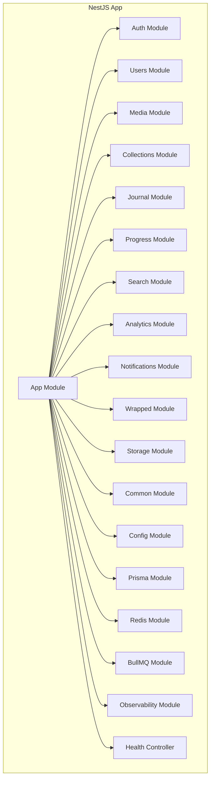

**Diagram sources**
- [app.module.ts](file://apps/backend/src/app.module.ts)
- [auth.module.ts](file://apps/backend/src/auth/auth.module.ts)
- [users.module.ts](file://apps/backend/src/users/users.module.ts)
- [prisma.module.ts](file://apps/backend/src/prisma/prisma.module.ts)
- [redis.module.ts](file://apps/backend/src/redis/redis.module.ts)
- [bullmq.module.ts](file://apps/backend/src/bullmq/bullmq.module.ts)
- [observability.module.ts](file://apps/backend/src/observability/observability.module.ts)
- [health.controller.ts](file://apps/backend/src/health/health.controller.ts)

**Section sources**
- [app.module.ts](file://apps/backend/src/app.module.ts)
- [main.ts](file://apps/backend/src/main.ts)
- [app.bootstrap.ts](file://apps/backend/src/app.bootstrap.ts)

## Core Components
- Dependency Injection Container: Nest’s DI container wires controllers, services, repositories, and infrastructure providers through module metadata.
- Service Layer: Each feature exposes services that encapsulate business logic and orchestrate repositories and external systems.
- Repository Pattern: Data access is abstracted via repository classes per domain, isolating Prisma queries from service logic.
- Configuration: Centralized configuration via environment variables validated at startup.
- Observability: Logging, metrics, and request-level instrumentation are provided by dedicated services and middleware.

Key responsibilities:
- Controllers handle HTTP requests and delegate to services.
- Services implement use cases and coordinate repositories and external integrations.
- Repositories encapsulate data operations using Prisma client.
- Modules declare imports, exports, and provider bindings.

**Section sources**
- [auth.service.ts](file://apps/backend/src/auth/auth.service.ts)
- [users.service.ts](file://apps/backend/src/users/users.service.ts)
- [users.repository.ts](file://apps/backend/src/users/users.repository.ts)
- [prisma.service.ts](file://apps/backend/src/prisma/prisma.service.ts)
- [config.module.ts](file://apps/backend/src/config/config.module.ts)
- [configuration.ts](file://apps/backend/src/config/configuration.ts)
- [env.validation.ts](file://apps/backend/src/config/env.validation.ts)
- [logging.service.ts](file://apps/backend/src/observability/logging.service.ts)
- [metrics.service.ts](file://apps/backend/src/observability/metrics.service.ts)

## Architecture Overview
The system uses a layered architecture with clear separation between presentation (controllers), application logic (services), and data access (repositories). Cross-cutting concerns are centralized in core and shared modules. Background jobs run asynchronously via BullMQ workers, while Redis serves both as a queue store and cache layer.

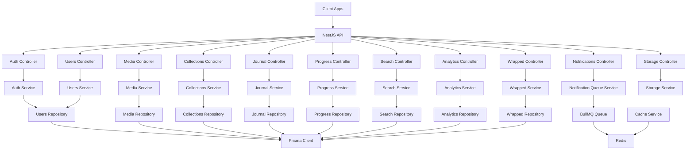

**Diagram sources**
- [auth.controller.ts](file://apps/backend/src/auth/auth.controller.ts)
- [auth.service.ts](file://apps/backend/src/auth/auth.service.ts)
- [users.service.ts](file://apps/backend/src/users/users.service.ts)
- [users.repository.ts](file://apps/backend/src/users/users.repository.ts)
- [prisma.service.ts](file://apps/backend/src/prisma/prisma.service.ts)
- [bullmq.module.ts](file://apps/backend/src/bullmq/bullmq.module.ts)
- [redis.service.ts](file://apps/backend/src/redis/redis.service.ts)
- [notification-queue.service.ts](file://apps/backend/src/notifications/notification-queue.service.ts)

## Detailed Component Analysis

### Authentication and Authorization
- JWT Strategy: Implemented via a strategy class that validates tokens and attaches user context to requests.
- Guards: Role-based and scope-aware guards enforce authorization at controller or route levels.
- Decorators: Custom decorators extract authenticated user and roles from the request context.
- Controllers: Endpoints for login, register, token refresh, and password management.
- Services: Business logic for credential verification, token issuance, and session management.
- Repositories: User and role data access via Prisma.

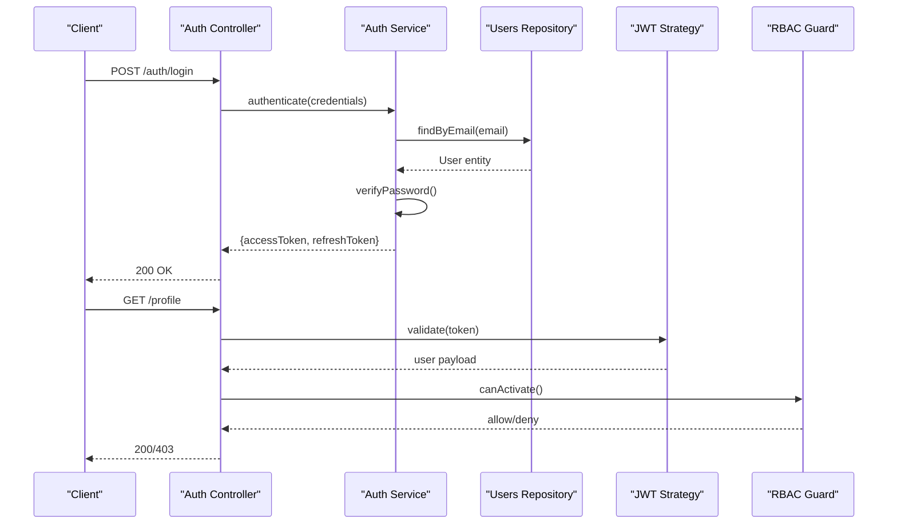

**Diagram sources**
- [auth.controller.ts](file://apps/backend/src/auth/auth.controller.ts)
- [auth.service.ts](file://apps/backend/src/auth/auth.service.ts)
- [users.repository.ts](file://apps/backend/src/users/users.repository.ts)

**Section sources**
- [auth.module.ts](file://apps/backend/src/auth/auth.module.ts)
- [auth.controller.ts](file://apps/backend/src/auth/auth.controller.ts)
- [auth.service.ts](file://apps/backend/src/auth/auth.service.ts)

### Users Domain
- Service: Encapsulates user lifecycle operations, profile updates, and preferences.
- Repository: Abstracts Prisma queries for user entities and related relations.
- DTOs: Input/output schemas for validation and serialization.

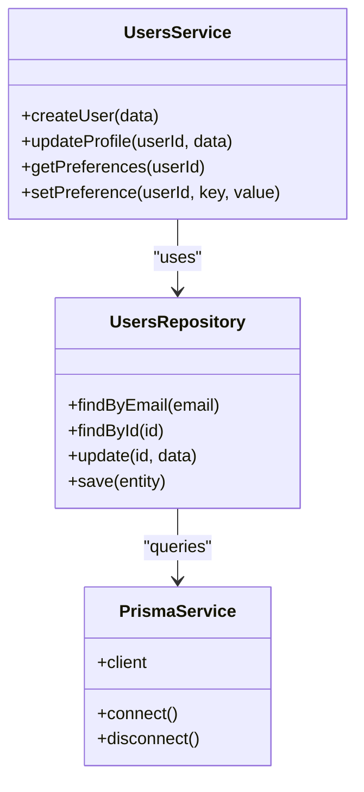

**Diagram sources**
- [users.service.ts](file://apps/backend/src/users/users.service.ts)
- [users.repository.ts](file://apps/backend/src/users/users.repository.ts)
- [prisma.service.ts](file://apps/backend/src/prisma/prisma.service.ts)

**Section sources**
- [users.module.ts](file://apps/backend/src/users/users.module.ts)
- [users.service.ts](file://apps/backend/src/users/users.service.ts)
- [users.repository.ts](file://apps/backend/src/users/users.repository.ts)

### Database Schema and Relationships
Prisma schema defines entities and relationships across the application. Typical relationships include users owning media items, collections containing media, journal entries linked to users, and progress tracking per user-media pair.

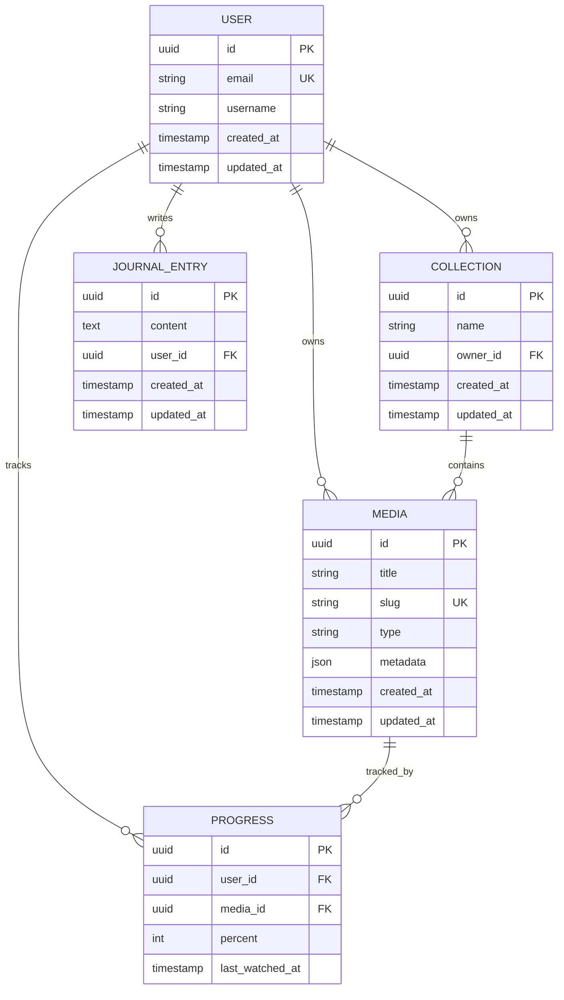

**Diagram sources**
- [schema.prisma](file://apps/backend/src/prisma/schema.prisma)

**Section sources**
- [schema.prisma](file://apps/backend/src/prisma/schema.prisma)

### Event-Driven Processing with BullMQ and Redis
- Queues: Notification digests, reminders, and asynchronous tasks are enqueued via BullMQ.
- Workers: Process jobs asynchronously, interacting with services and repositories.
- Redis: Stores queue state and can be used for caching and rate limiting.

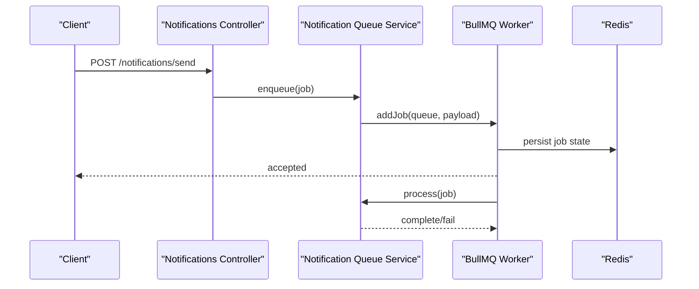

**Diagram sources**
- [notification-queue.service.ts](file://apps/backend/src/notifications/notification-queue.service.ts)
- [bullmq.module.ts](file://apps/backend/src/bullmq/bullmq.module.ts)
- [redis.service.ts](file://apps/backend/src/redis/redis.service.ts)

**Section sources**
- [notifications.module.ts](file://apps/backend/src/notifications/notifications.module.ts)
- [notification-queue.service.ts](file://apps/backend/src/notifications/notification-queue.service.ts)
- [scheduler.service.ts](file://apps/backend/src/notifications/scheduler.service.ts)
- [bullmq.module.ts](file://apps/backend/src/bullmq/bullmq.module.ts)
- [redis.module.ts](file://apps/backend/src/redis/redis.module.ts)
- [redis.service.ts](file://apps/backend/src/redis/redis.service.ts)

### API Endpoint Organization
Controllers are organized by feature domain, each exposing REST endpoints with consistent DTO validation and standardized responses.

- Auth: login, register, refresh, logout
- Users: profile, preferences, settings
- Media: CRUD and metadata operations
- Collections: create, update, smart rules
- Journal: entries, prompts, timeline
- Progress: mark progress, stats
- Search: query, suggestions
- Analytics: dashboard, insights
- Notifications: send, digest, reminders
- Wrapped: generate shareable summaries
- Storage: upload, signed URLs, cleanup

**Section sources**
- [auth.controller.ts](file://apps/backend/src/auth/auth.controller.ts)
- [users.module.ts](file://apps/backend/src/users/users.module.ts)
- [media.module.ts](file://apps/backend/src/media/media.module.ts)
- [collections.module.ts](file://apps/backend/src/collections/collections.module.ts)
- [journal.module.ts](file://apps/backend/src/journal/journal.module.ts)
- [progress.module.ts](file://apps/backend/src/progress/progress.module.ts)
- [search.module.ts](file://apps/backend/src/search/search.module.ts)
- [analytics.module.ts](file://apps/backend/src/analytics/analytics.module.ts)
- [notifications.module.ts](file://apps/backend/src/notifications/notifications.module.ts)
- [wrapped.module.ts](file://apps/backend/src/wrapped/wrapped.module.ts)
- [storage.module.ts](file://apps/backend/src/storage/storage.module.ts)

### Middleware Stack and Global Configuration
- Application bootstrap configures global interceptors, filters, pipes, and guards.
- Request metrics middleware captures latency and status codes.
- Rate limiting and CORS configured via NestJS global setup.
- Health check endpoints expose readiness/liveness probes.

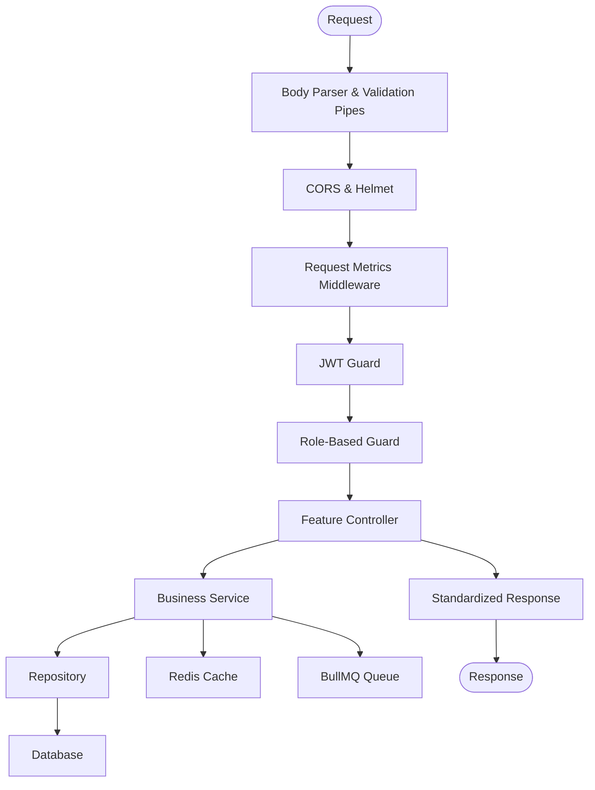

**Diagram sources**
- [main.ts](file://apps/backend/src/main.ts)
- [request-metrics.middleware.ts](file://apps/backend/src/observability/request-metrics.middleware.ts)
- [common.module.ts](file://apps/backend/src/common/common.module.ts)

**Section sources**
- [main.ts](file://apps/backend/src/main.ts)
- [app.bootstrap.ts](file://apps/backend/src/app.bootstrap.ts)
- [common.module.ts](file://apps/backend/src/common/common.module.ts)
- [request-metrics.middleware.ts](file://apps/backend/src/observability/request-metrics.middleware.ts)

### Security Implementations
- JWT Authentication: Token issuance and validation via Passport strategy.
- Role-Based Access Control: Guards enforce roles and scopes on routes.
- Input Validation: DTOs with class-validator decorators ensure safe inputs.
- Hardening: Rate limiting, cache invalidation, and database optimization services mitigate abuse and improve resilience.

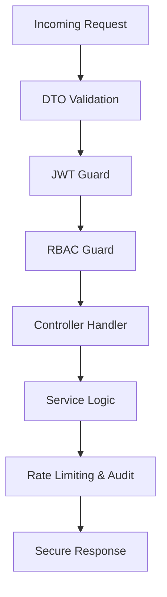

**Diagram sources**
- [auth.module.ts](file://apps/backend/src/auth/auth.module.ts)
- [hardening.module.ts](file://apps/backend/src/hardening/hardening.module.ts)
- [rate-limit-audit.service.ts](file://apps/backend/src/hardening/rate-limit-audit.service.ts)
- [cache-invalidation.service.ts](file://apps/backend/src/hardening/cache-invalidation.service.ts)

**Section sources**
- [auth.module.ts](file://apps/backend/src/auth/auth.module.ts)
- [auth.service.ts](file://apps/backend/src/auth/auth.service.ts)
- [hardening.module.ts](file://apps/backend/src/hardening/hardening.module.ts)
- [rate-limit-audit.service.ts](file://apps/backend/src/hardening/rate-limit-audit.service.ts)
- [cache-invalidation.service.ts](file://apps/backend/src/hardening/cache-invalidation.service.ts)

### Error Handling Strategies
- Global Exception Filters: Normalize errors into consistent JSON responses.
- Custom Exceptions: Domain-specific exceptions with meaningful codes.
- Interceptors: Transform responses and handle timeouts gracefully.
- Logging: Structured logs capture context and correlation IDs.

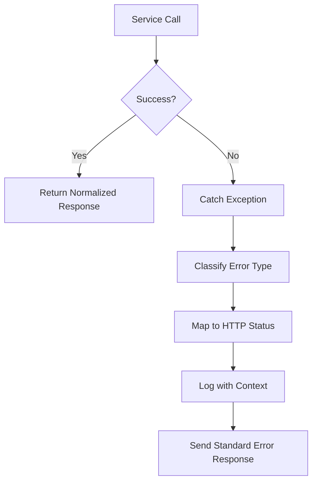

**Diagram sources**
- [common.module.ts](file://apps/backend/src/common/common.module.ts)

**Section sources**
- [common.module.ts](file://apps/backend/src/common/common.module.ts)

### Logging and Monitoring
- Logging Service: Structured logging with correlation IDs and contextual metadata.
- Metrics Service: Exposes performance counters and custom metrics.
- Request Metrics Middleware: Captures latency, throughput, and error rates.
- Health Controller: Aggregates readiness and liveness indicators including Prisma connectivity.

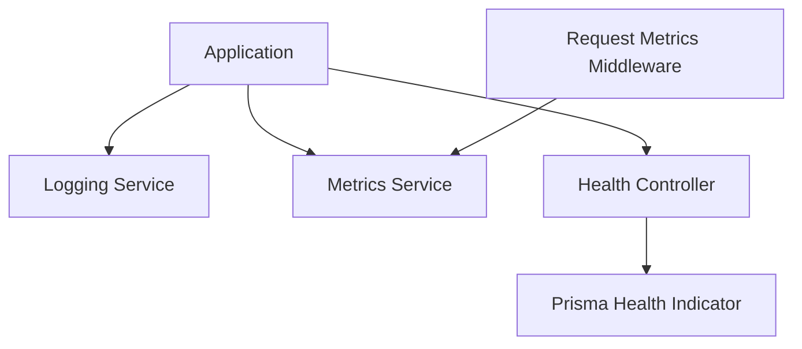

**Diagram sources**
- [logging.service.ts](file://apps/backend/src/observability/logging.service.ts)
- [metrics.service.ts](file://apps/backend/src/observability/metrics.service.ts)
- [request-metrics.middleware.ts](file://apps/backend/src/observability/request-metrics.middleware.ts)
- [health.controller.ts](file://apps/backend/src/health/health.controller.ts)
- [prisma-health.indicator.ts](file://apps/backend/src/health/prisma-health.indicator.ts)

**Section sources**
- [observability.module.ts](file://apps/backend/src/observability/observability.module.ts)
- [logging.service.ts](file://apps/backend/src/observability/logging.service.ts)
- [metrics.service.ts](file://apps/backend/src/observability/metrics.service.ts)
- [request-metrics.middleware.ts](file://apps/backend/src/observability/request-metrics.middleware.ts)
- [health.controller.ts](file://apps/backend/src/health/health.controller.ts)
- [prisma-health.indicator.ts](file://apps/backend/src/health/prisma-health.indicator.ts)

## Dependency Analysis
Module dependencies reflect feature boundaries and shared infrastructure:
- Feature modules depend on core, config, prisma, redis, bullmq, and observability modules.
- Repositories depend on Prisma service.
- Services depend on repositories and external integrations (Redis, BullMQ).
- Controllers depend on services and guards.

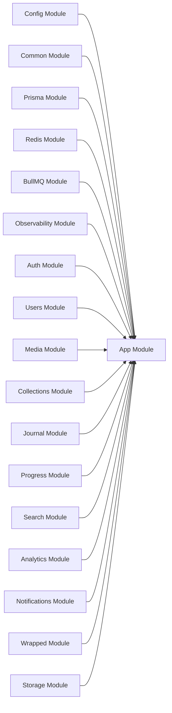

**Diagram sources**
- [app.module.ts](file://apps/backend/src/app.module.ts)
- [config.module.ts](file://apps/backend/src/config/config.module.ts)
- [common.module.ts](file://apps/backend/src/common/common.module.ts)
- [prisma.module.ts](file://apps/backend/src/prisma/prisma.module.ts)
- [redis.module.ts](file://apps/backend/src/redis/redis.module.ts)
- [bullmq.module.ts](file://apps/backend/src/bullmq/bullmq.module.ts)
- [observability.module.ts](file://apps/backend/src/observability/observability.module.ts)

**Section sources**
- [app.module.ts](file://apps/backend/src/app.module.ts)

## Performance Considerations
- Caching: Use Redis for hot reads and deduplication; implement cache invalidation strategies around writes.
- Query Optimization: Leverage Prisma relations and selective field fetching; avoid N+1 queries.
- Pagination: Apply cursor-based pagination for large datasets.
- Concurrency: Offload heavy tasks to BullMQ workers; use retries and dead-letter queues.
- Rate Limiting: Protect endpoints against abuse and reduce load spikes.
- Health Checks: Monitor Prisma connectivity and queue health to detect bottlenecks early.

[No sources needed since this section provides general guidance]

## Troubleshooting Guide
- Authentication Failures: Verify JWT secret, token expiration, and guard configurations. Check logs for validation errors.
- Database Issues: Inspect Prisma health indicator and connection pool settings; review migration status.
- Queue Backlogs: Monitor BullMQ queue lengths and worker concurrency; inspect failed jobs and retry policies.
- Cache Inconsistencies: Ensure cache invalidation triggers after mutations; validate TTLs and keys.
- High Latency: Analyze request metrics middleware for slow endpoints; optimize queries and add caching where appropriate.

**Section sources**
- [health.controller.ts](file://apps/backend/src/health/health.controller.ts)
- [prisma-health.indicator.ts](file://apps/backend/src/health/prisma-health.indicator.ts)
- [notification-queue.service.ts](file://apps/backend/src/notifications/notification-queue.service.ts)
- [cache-invalidation.service.ts](file://apps/backend/src/hardening/cache-invalidation.service.ts)
- [request-metrics.middleware.ts](file://apps/backend/src/observability/request-metrics.middleware.ts)

## Conclusion
The backend employs a robust NestJS modular architecture with clear separation of concerns, strong typing, and extensibility. The service-layer design with repository abstraction ensures maintainable data access patterns. Event-driven processing via BullMQ and Redis enables scalable background workloads, while comprehensive observability and hardening measures support reliability and performance. Security is enforced through JWT and role-based controls, and input validation guarantees safe interactions.

[No sources needed since this section summarizes without analyzing specific files]

## Appendices
- Environment Variables: Configure database URLs, Redis connections, JWT secrets, and queue settings via environment validation.
- Deployment: Use Dockerfiles and compose files for local and production environments.
- Testing: Unit and e2e tests cover critical flows and integration points.

**Section sources**
- [configuration.ts](file://apps/backend/src/config/configuration.ts)
- [env.validation.ts](file://apps/backend/src/config/env.validation.ts)
- [Dockerfile](file://apps/backend/Dockerfile)
- [docker-compose.yml](file://apps/backend/docker-compose.yml)