# Background Jobs & Queue Processing

<cite>
**Referenced Files in This Document**
- [bullmq.module.ts](file://apps/backend/src/bullmq/bullmq.module.ts)
- [notification-queue.service.ts](file://apps/backend/src/notifications/notification-queue.service.ts)
- [digest.service.ts](file://apps/backend/src/notifications/digest.service.ts)
- [reminder.service.ts](file://apps/backend/src/notifications/reminder.service.ts)
- [scheduler.service.ts](file://apps/backend/src/notifications/scheduler.service.ts)
- [processors/index.ts](file://apps/backend/src/notifications/processors/index.ts)
- [performance-audit.service.ts](file://apps/backend/src/hardening/performance-audit.service.ts)
- [database-optimization.service.ts](file://apps/backend/src/hardening/database-optimization.service.ts)
- [media-cleanup.service.ts](file://apps/backend/src/storage/media-cleanup.service.ts)
- [redis.service.ts](file://apps/backend/src/redis/redis.service.ts)
- [app.bootstrap.ts](file://apps/backend/src/app.bootstrap.ts)
- [main.ts](file://apps/backend/src/main.ts)
</cite>

## Table of Contents
1. [Introduction](#introduction)
2. [Project Structure](#project-structure)
3. [Core Components](#core-components)
4. [Architecture Overview](#architecture-overview)
5. [Detailed Component Analysis](#detailed-component-analysis)
6. [Dependency Analysis](#dependency-analysis)
7. [Performance Considerations](#performance-considerations)
8. [Troubleshooting Guide](#troubleshooting-guide)
9. [Conclusion](#conclusion)
10. [Appendices](#appendices)

## Introduction
This document explains the background job processing system built with BullMQ and Redis. It covers queue architecture, job creation patterns, worker process management, and the notification subsystem (email processing, digest generation, reminder scheduling). It also documents performance monitoring jobs, database optimization tasks, cleanup operations, retry mechanisms, error handling, monitoring, prioritization, rate limiting, scaling considerations, persistence and recovery, and debugging techniques for long-running processes.

## Project Structure
The background job system is implemented within the backend application using NestJS modules:
- BullMQ module initializes queues and workers.
- Notification services orchestrate job creation and scheduling.
- Dedicated processors handle email delivery, digest generation, reminders, and maintenance tasks.
- Redis service provides connection configuration and shared utilities.
- Bootstrap and main entry points start the application and workers.

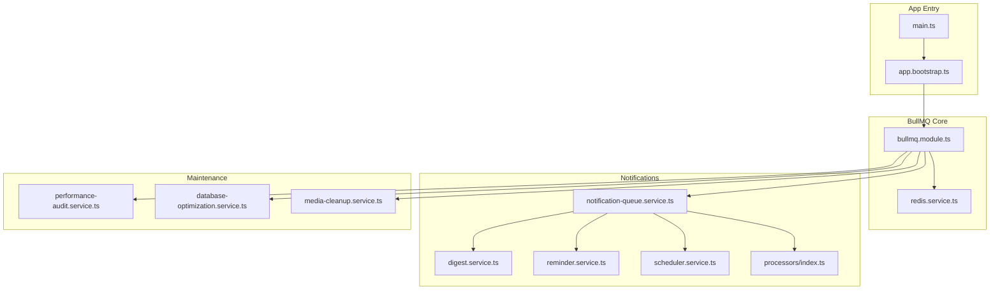

**Diagram sources**
- [main.ts](file://apps/backend/src/main.ts)
- [app.bootstrap.ts](file://apps/backend/src/app.bootstrap.ts)
- [bullmq.module.ts](file://apps/backend/src/bullmq/bullmq.module.ts)
- [redis.service.ts](file://apps/backend/src/redis/redis.service.ts)
- [notification-queue.service.ts](file://apps/backend/src/notifications/notification-queue.service.ts)
- [digest.service.ts](file://apps/backend/src/notifications/digest.service.ts)
- [reminder.service.ts](file://apps/backend/src/notifications/reminder.service.ts)
- [scheduler.service.ts](file://apps/backend/src/notifications/scheduler.service.ts)
- [processors/index.ts](file://apps/backend/src/notifications/processors/index.ts)
- [performance-audit.service.ts](file://apps/backend/src/hardening/performance-audit.service.ts)
- [database-optimization.service.ts](file://apps/backend/src/hardening/database-optimization.service.ts)
- [media-cleanup.service.ts](file://apps/backend/src/storage/media-cleanup.service.ts)

**Section sources**
- [main.ts](file://apps/backend/src/main.ts)
- [app.bootstrap.ts](file://apps/backend/src/app.bootstrap.ts)
- [bullmq.module.ts](file://apps/backend/src/bullmq/bullmq.module.ts)
- [redis.service.ts](file://apps/backend/src/redis/redis.service.ts)

## Core Components
- BullMQ Module: Configures queues, workers, and Redis connection settings; registers processors for job execution.
- Notification Queue Service: Central API to enqueue jobs for emails, digests, reminders, and other notifications.
- Digest Service: Generates periodic summaries and enqueues digest jobs.
- Reminder Service: Schedules recurring reminders and manages due-time logic.
- Scheduler Service: Manages cron-like scheduled jobs and recurring tasks.
- Processors Index: Aggregates all job processors (e.g., email sender, digest generator, reminder dispatcher, maintenance tasks).
- Maintenance Services: Performance audit, database optimization, and media cleanup jobs executed asynchronously.

Key responsibilities:
- Decouple time-consuming work from request/response cycles.
- Provide reliable execution with retries and backoff.
- Enable horizontal scaling via multiple workers.
- Persist job state in Redis for resilience.

**Section sources**
- [bullmq.module.ts](file://apps/backend/src/bullmq/bullmq.module.ts)
- [notification-queue.service.ts](file://apps/backend/src/notifications/notification-queue.service.ts)
- [digest.service.ts](file://apps/backend/src/notifications/digest.service.ts)
- [reminder.service.ts](file://apps/backend/src/notifications/reminder.service.ts)
- [scheduler.service.ts](file://apps/backend/src/notifications/scheduler.service.ts)
- [processors/index.ts](file://apps/backend/src/notifications/processors/index.ts)
- [performance-audit.service.ts](file://apps/backend/src/hardening/performance-audit.service.ts)
- [database-optimization.service.ts](file://apps/backend/src/hardening/database-optimization.service.ts)
- [media-cleanup.service.ts](file://apps/backend/src/storage/media-cleanup.service.ts)

## Architecture Overview
The system uses a producer-consumer pattern:
- Producers (controllers/services) enqueue jobs into BullMQ queues backed by Redis.
- Workers consume jobs from queues and execute processors.
- Redis stores job metadata, states, and results, enabling persistence and recovery.
- Monitoring and metrics expose queue health and job performance.

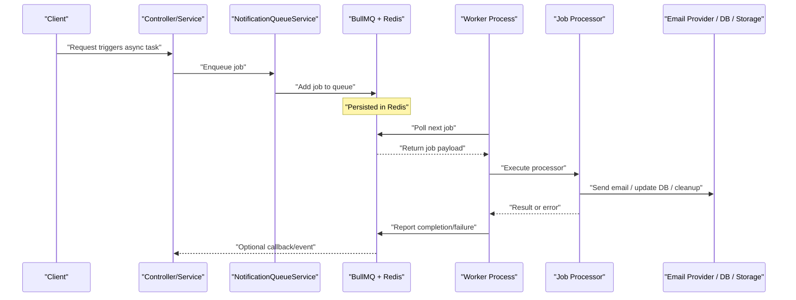

**Diagram sources**
- [notification-queue.service.ts](file://apps/backend/src/notifications/notification-queue.service.ts)
- [bullmq.module.ts](file://apps/backend/src/bullmq/bullmq.module.ts)
- [processors/index.ts](file://apps/backend/src/notifications/processors/index.ts)

## Detailed Component Analysis

### BullMQ Module and Redis Integration
Responsibilities:
- Configure Redis connection options and client lifecycle.
- Define queues with concurrency limits, rate limiters, and priority settings.
- Register processors and attach global event listeners for monitoring.

Key aspects:
- Connection pooling and retry policies for Redis.
- Queue-level defaults for attempts, backoff strategies, and timeouts.
- Graceful shutdown hooks to drain active jobs.

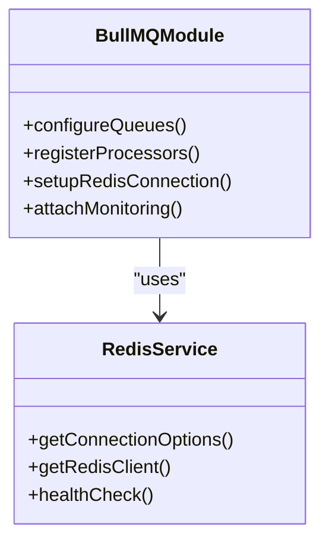

**Diagram sources**
- [bullmq.module.ts](file://apps/backend/src/bullmq/bullmq.module.ts)
- [redis.service.ts](file://apps/backend/src/redis/redis.service.ts)

**Section sources**
- [bullmq.module.ts](file://apps/backend/src/bullmq/bullmq.module.ts)
- [redis.service.ts](file://apps/backend/src/redis/redis.service.ts)

### Notification Queue Service
Responsibilities:
- Provide methods to enqueue email jobs, digest jobs, and reminder jobs.
- Attach job options such as priority, delay, repeat schedules, and retry policies.
- Correlate jobs with user context and tracking IDs.

Patterns:
- Enqueue with idempotency keys to prevent duplicates.
- Use named queues per domain (e.g., emails, digests, reminders).
- Return job IDs for downstream tracking.

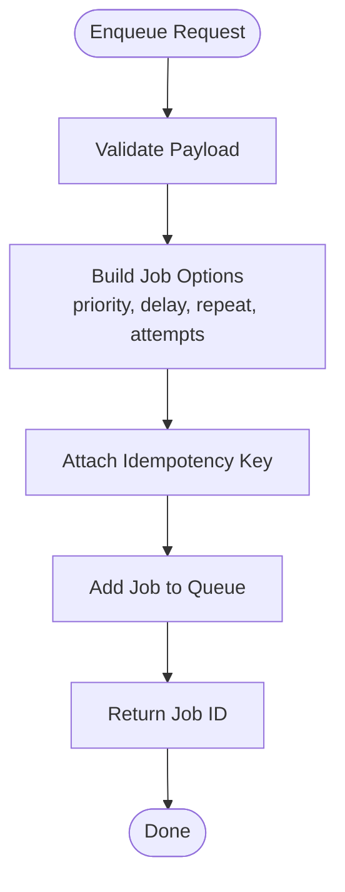

**Diagram sources**
- [notification-queue.service.ts](file://apps/backend/src/notifications/notification-queue.service.ts)

**Section sources**
- [notification-queue.service.ts](file://apps/backend/src/notifications/notification-queue.service.ts)

### Digest Generation Service
Responsibilities:
- Aggregate user activity and generate periodic summaries.
- Schedule digest jobs at configured intervals.
- Compose content and enqueue email delivery jobs.

Scheduling:
- Cron-based recurrence for daily/weekly/monthly digests.
- Backpressure handling to avoid queue saturation.

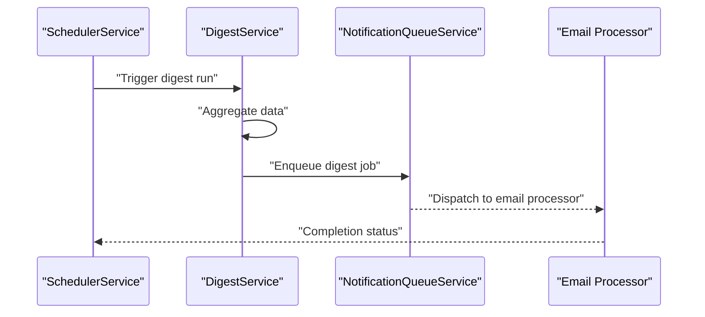

**Diagram sources**
- [digest.service.ts](file://apps/backend/src/notifications/digest.service.ts)
- [notification-queue.service.ts](file://apps/backend/src/notifications/notification-queue.service.ts)
- [scheduler.service.ts](file://apps/backend/src/notifications/scheduler.service.ts)

**Section sources**
- [digest.service.ts](file://apps/backend/src/notifications/digest.service.ts)

### Reminder Service
Responsibilities:
- Manage recurring reminders based on user preferences.
- Compute next run times and schedule jobs accordingly.
- Handle timezone-aware scheduling and daylight saving transitions.

Retry and Error Handling:
- Exponential backoff for transient failures.
- Dead-letter queue for unrecoverable errors.

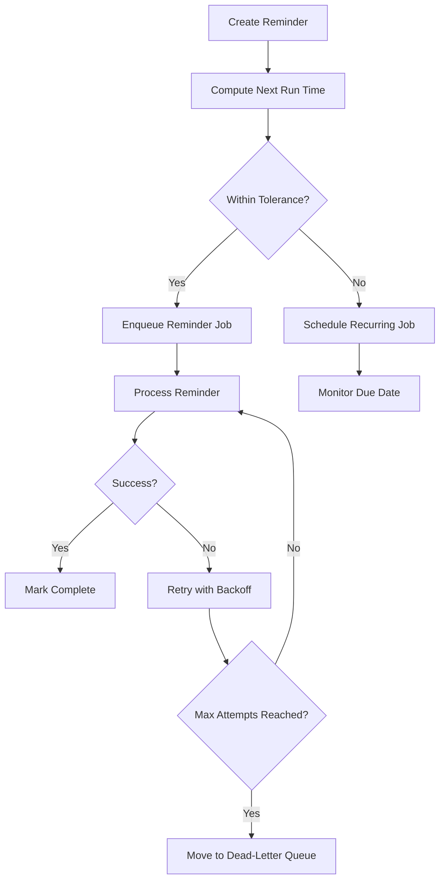

**Diagram sources**
- [reminder.service.ts](file://apps/backend/src/notifications/reminder.service.ts)

**Section sources**
- [reminder.service.ts](file://apps/backend/src/notifications/reminder.service.ts)

### Scheduler Service
Responsibilities:
- Orchestrate periodic tasks across domains (notifications, maintenance).
- Maintain job schedules and ensure consistency after restarts.
- Provide APIs to add, update, and remove scheduled jobs.

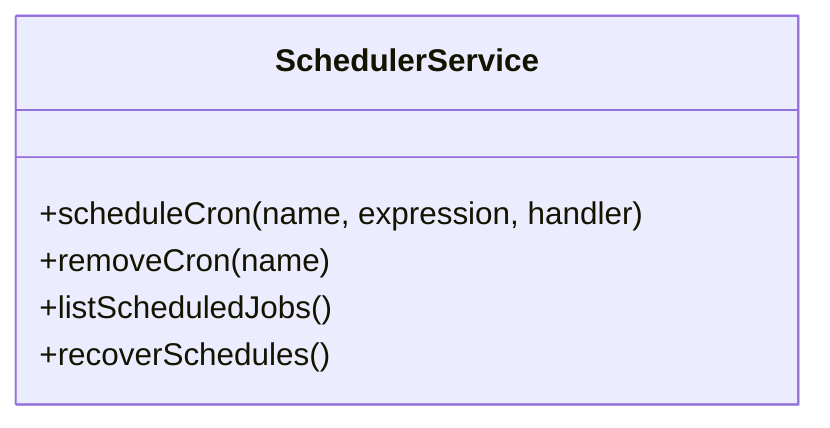

**Diagram sources**
- [scheduler.service.ts](file://apps/backend/src/notifications/scheduler.service.ts)

**Section sources**
- [scheduler.service.ts](file://apps/backend/src/notifications/scheduler.service.ts)

### Processors Index
Responsibilities:
- Aggregate all job processors (email, digest, reminders, maintenance).
- Ensure consistent error handling and logging across processors.
- Map job types to specific handler functions.

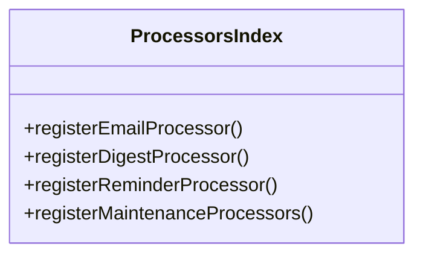

**Diagram sources**
- [processors/index.ts](file://apps/backend/src/notifications/processors/index.ts)

**Section sources**
- [processors/index.ts](file://apps/backend/src/notifications/processors/index.ts)

### Performance Audit Service
Responsibilities:
- Periodically collect performance metrics and queue statistics.
- Identify slow jobs and bottlenecks.
- Emit alerts for degraded performance.

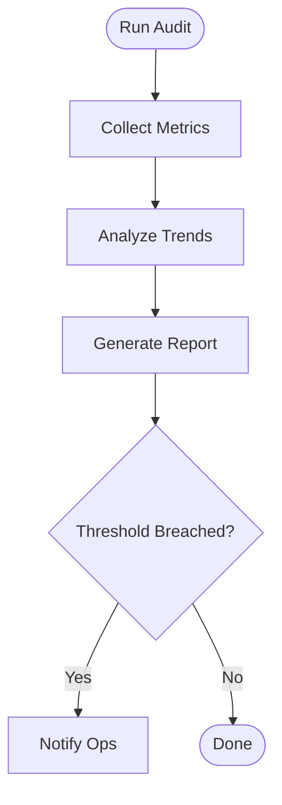

**Diagram sources**
- [performance-audit.service.ts](file://apps/backend/src/hardening/performance-audit.service.ts)

**Section sources**
- [performance-audit.service.ts](file://apps/backend/src/hardening/performance-audit.service.ts)

### Database Optimization Service
Responsibilities:
- Schedule index rebuilds, vacuum operations, and query plan analysis.
- Optimize write-heavy workloads during off-peak hours.
- Monitor lock contention and long-running transactions.

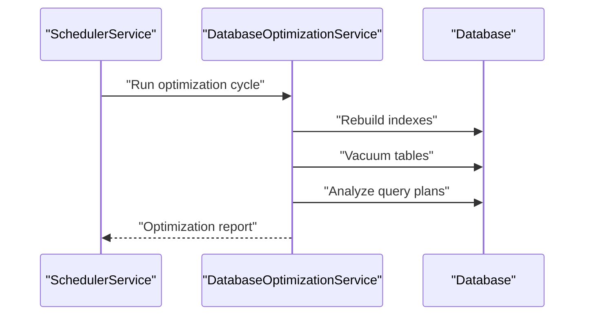

**Diagram sources**
- [database-optimization.service.ts](file://apps/backend/src/hardening/database-optimization.service.ts)

**Section sources**
- [database-optimization.service.ts](file://apps/backend/src/hardening/database-optimization.service.ts)

### Media Cleanup Service
Responsibilities:
- Remove orphaned files and expired assets.
- Enforce storage quotas and retention policies.
- Integrate with object storage providers for safe deletion.

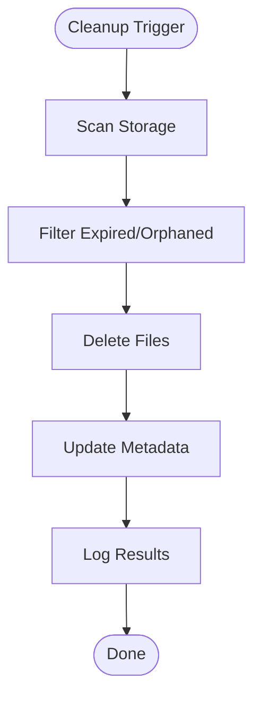

**Diagram sources**
- [media-cleanup.service.ts](file://apps/backend/src/storage/media-cleanup.service.ts)

**Section sources**
- [media-cleanup.service.ts](file://apps/backend/src/storage/media-cleanup.service.ts)

## Dependency Analysis
The background job system depends on:
- Redis for durable queue storage and job state.
- BullMQ for queue management, scheduling, and worker coordination.
- External services (email providers, databases, storage) invoked by processors.

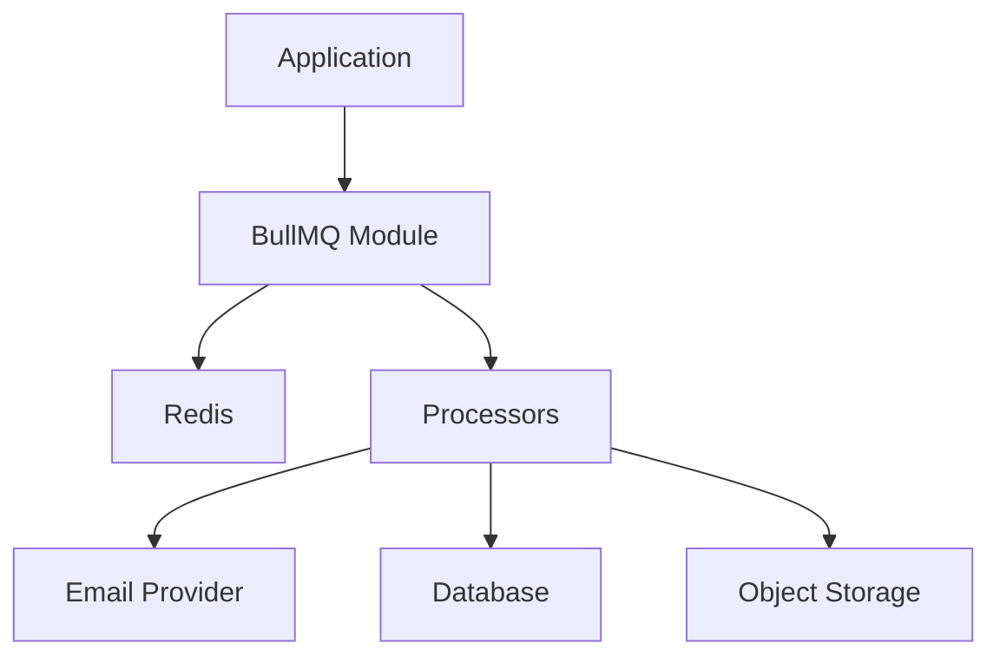

**Diagram sources**
- [bullmq.module.ts](file://apps/backend/src/bullmq/bullmq.module.ts)
- [redis.service.ts](file://apps/backend/src/redis/redis.service.ts)
- [processors/index.ts](file://apps/backend/src/notifications/processors/index.ts)

**Section sources**
- [bullmq.module.ts](file://apps/backend/src/bullmq/bullmq.module.ts)
- [redis.service.ts](file://apps/backend/src/redis/redis.service.ts)
- [processors/index.ts](file://apps/backend/src/notifications/processors/index.ts)

## Performance Considerations
- Concurrency: Tune worker concurrency per queue to match CPU and I/O characteristics.
- Rate Limiting: Apply per-queue or per-user rate limits to protect external APIs.
- Backpressure: Use queue size limits and delayed jobs to smooth bursts.
- Batch Processing: Group small jobs where possible to reduce overhead.
- Monitoring: Track queue depth, job duration percentiles, failure rates, and Redis memory usage.
- Scaling: Deploy multiple worker instances horizontally; partition queues by tenant or domain.

[No sources needed since this section provides general guidance]

## Troubleshooting Guide
Common issues and resolutions:
- Stuck Jobs: Inspect failed jobs and move to dead-letter queue; investigate timeouts and resource locks.
- Retry Storms: Adjust backoff strategies and max attempts; implement circuit breakers for external calls.
- Redis Connectivity: Verify connection strings, network ACLs, and TLS settings; monitor Redis latency.
- Memory Pressure: Purge completed jobs, tune Redis eviction policies, and scale Redis nodes.
- Long-Running Processes: Implement heartbeat logs and progress updates; use graceful shutdown hooks.

Debugging techniques:
- Structured logging with correlation IDs.
- Metrics export for Prometheus/Grafana dashboards.
- Distributed tracing across producers, workers, and external services.
- Snapshotting job payloads for reproduction in staging.

**Section sources**
- [bullmq.module.ts](file://apps/backend/src/bullmq/bullmq.module.ts)
- [redis.service.ts](file://apps/backend/src/redis/redis.service.ts)

## Conclusion
The BullMQ-based background job system provides robust, scalable, and observable asynchronous processing. By separating concerns into dedicated services and processors, it ensures reliability through retries, persistence in Redis, and clear monitoring. Proper tuning of concurrency, rate limits, and scheduling enables efficient operation under load while maintaining fault tolerance and operational visibility.

[No sources needed since this section summarizes without analyzing specific files]

## Appendices

### Job Creation Patterns
- Enqueue with priority and delay for time-sensitive tasks.
- Use repeat schedules for recurring jobs with timezone awareness.
- Attach idempotency keys to prevent duplicate processing.
- Return job IDs for tracking and polling.

**Section sources**
- [notification-queue.service.ts](file://apps/backend/src/notifications/notification-queue.service.ts)

### Worker Process Management
- Initialize workers alongside the application bootstrap.
- Configure graceful shutdown to finish active jobs.
- Monitor worker health and restart on failures.

**Section sources**
- [app.bootstrap.ts](file://apps/backend/src/app.bootstrap.ts)
- [main.ts](file://apps/backend/src/main.ts)

### Persistence and Recovery
- Redis-backed job store ensures durability across restarts.
- Failed jobs are retried according to configured policies.
- Dead-letter queues capture irrecoverable jobs for manual review.

**Section sources**
- [bullmq.module.ts](file://apps/backend/src/bullmq/bullmq.module.ts)
- [redis.service.ts](file://apps/backend/src/redis/redis.service.ts)

### Debugging Long-Running Processes
- Emit periodic progress events and structured logs.
- Capture stack traces and contextual data on errors.
- Use distributed tracing to correlate spans across services.

**Section sources**
- [processors/index.ts](file://apps/backend/src/notifications/processors/index.ts)
- [performance-audit.service.ts](file://apps/backend/src/hardening/performance-audit.service.ts)