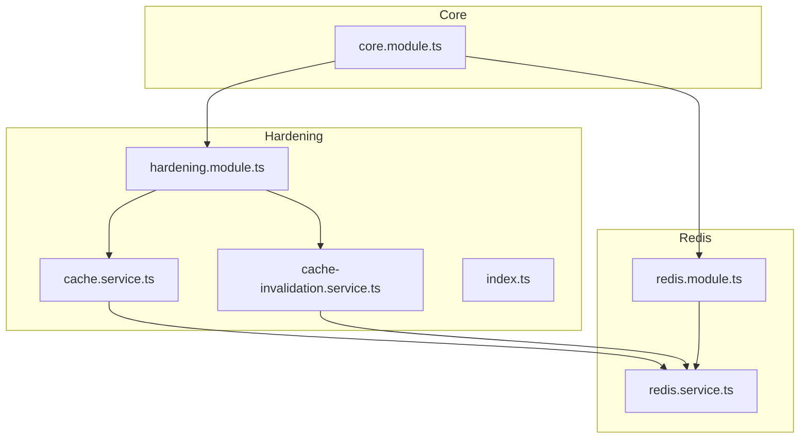
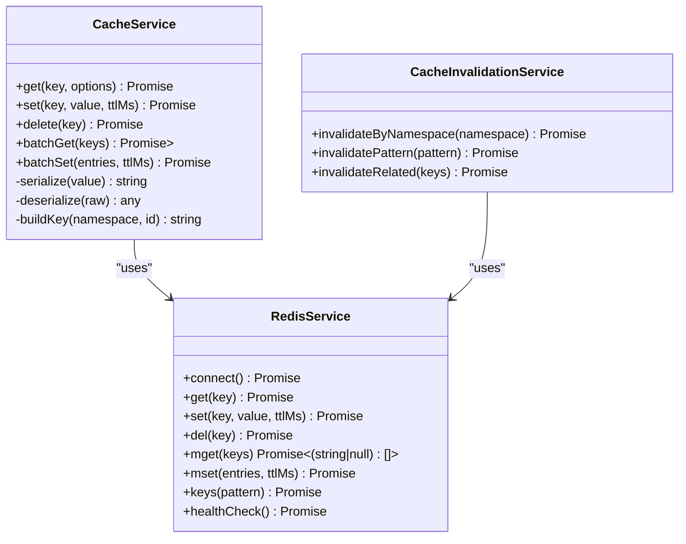
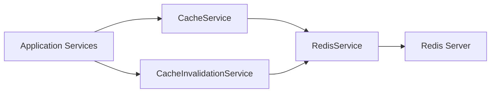
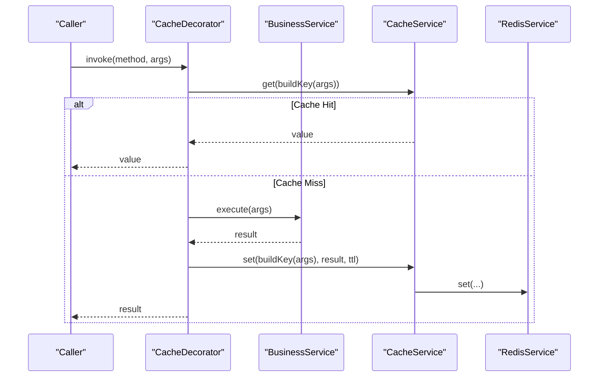

# Caching System

<cite>
**Referenced Files in This Document**
- [cache.service.ts](file://apps/backend/src/hardening/cache.service.ts)
- [cache-invalidation.service.ts](file://apps/backend/src/hardening/cache-invalidation.service.ts)
- [redis.service.ts](file://apps/backend/src/redis/redis.service.ts)
- [redis.module.ts](file://apps/backend/src/redis/redis.module.ts)
- [hardening.module.ts](file://apps/backend/src/hardening/hardening.module.ts)
- [core.module.ts](file://apps/backend/src/core/core.module.ts)
- [index.ts](file://apps/backend/src/hardening/index.ts)
</cite>

## Table of Contents
1. [Introduction](#introduction)
2. [Project Structure](#project-structure)
3. [Core Components](#core-components)
4. [Architecture Overview](#architecture-overview)
5. [Detailed Component Analysis](#detailed-component-analysis)
6. [Dependency Analysis](#dependency-analysis)
7. [Performance Considerations](#performance-considerations)
8. [Troubleshooting Guide](#troubleshooting-guide)
9. [Conclusion](#conclusion)
10. [Appendices](#appendices)

## Introduction
This document explains the caching system implementation, focusing on the cache abstraction layer and its Redis integration for distributed caching. It covers key generation strategies, TTL management, invalidation patterns, and the cache service methods for get, set, delete, and batch operations. It also provides guidance on implementing cache decorators, cache warming strategies, monitoring, serialization, error handling when the cache is unavailable, performance tuning, and consistency maintenance across related data updates.

## Project Structure
The caching system is implemented under the backend application with a clear separation between:
- Cache abstraction and invalidation logic (hardening module)
- Redis client integration (redis module)
- Module wiring and exports

**Diagram sources**
- [cache.service.ts](file://apps/backend/src/hardening/cache.service.ts)
- [cache-invalidation.service.ts](file://apps/backend/src/hardening/cache-invalidation.service.ts)
- [redis.service.ts](file://apps/backend/src/redis/redis.service.ts)
- [redis.module.ts](file://apps/backend/src/redis/redis.module.ts)
- [hardening.module.ts](file://apps/backend/src/hardening/hardening.module.ts)
- [core.module.ts](file://apps/backend/src/core/core.module.ts)
- [index.ts](file://apps/backend/src/hardening/index.ts)

**Section sources**
- [cache.service.ts](file://apps/backend/src/hardening/cache.service.ts)
- [cache-invalidation.service.ts](file://apps/backend/src/hardening/cache-invalidation.service.ts)
- [redis.service.ts](file://apps/backend/src/redis/redis.service.ts)
- [redis.module.ts](file://apps/backend/src/redis/redis.module.ts)
- [hardening.module.ts](file://apps/backend/src/hardening/hardening.module.ts)
- [core.module.ts](file://apps/backend/src/core/core.module.ts)
- [index.ts](file://apps/backend/src/hardening/index.ts)

## Core Components
- Cache Service Abstraction: Provides typed get/set/delete/batch operations over a pluggable cache backend.
- Cache Invalidation Service: Coordinates cache invalidation across related keys and namespaces.
- Redis Service: Encapsulates Redis client lifecycle, configuration, and low-level commands.
- Modules: Wire dependencies and expose services to other modules.

Key responsibilities:
- Cache Service: Key construction, serialization/deserialization, TTL handling, fallback behavior, and metrics hooks.
- Cache Invalidation Service: Namespace-based invalidation, pattern-based deletion, and coordinated updates.
- Redis Service: Connection pooling, retry/backoff, health checks, and command wrappers.

**Section sources**
- [cache.service.ts](file://apps/backend/src/hardening/cache.service.ts)
- [cache-invalidation.service.ts](file://apps/backend/src/hardening/cache-invalidation.service.ts)
- [redis.service.ts](file://apps/backend/src/redis/redis.service.ts)
- [hardening.module.ts](file://apps/backend/src/hardening/hardening.module.ts)
- [redis.module.ts](file://apps/backend/src/redis/redis.module.ts)

## Architecture Overview
The cache layer abstracts Redis through a service interface. Consumers depend on the cache abstraction, while the Redis service implements the actual I/O. The hardening module exposes both cache and invalidation capabilities.

**Diagram sources**
- [cache.service.ts](file://apps/backend/src/hardening/cache.service.ts)
- [cache-invalidation.service.ts](file://apps/backend/src/hardening/cache-invalidation.service.ts)
- [redis.service.ts](file://apps/backend/src/redis/redis.service.ts)

## Detailed Component Analysis

### Cache Service Abstraction
Responsibilities:
- Key generation: deterministic namespacing and hashing for stable keys.
- Serialization: JSON or binary-safe encoding with versioning.
- TTL management: per-key TTL with defaults and overrides.
- Operations: get, set, delete, and batch variants.
- Fallback: optional pass-through to underlying storage on miss or failure.

Typical flow for get:
- Build key from namespace and identifier.
- Attempt to read from cache; if present and not expired, deserialize and return.
- On miss or error, delegate to configured resolver and optionally write back.

Typical flow for set:
- Serialize value, compute TTL, and write to cache.
- Return success/failure and emit metrics.

Batch operations:
- Use multi-get/multi-set where supported by the backend.
- Handle partial failures and report aggregated results.

Error handling:
- Distinguish between transient network errors and permanent failures.
- Implement retries with exponential backoff for transient issues.
- Provide circuit breaker behavior to avoid cascading failures.

TTL strategies:
- Default TTL per operation type.
- Per-entity TTL based on entity attributes or policy.
- Sliding expiration for hot keys.

Serialization:
- Versioned payloads to support schema evolution.
- Compression for large payloads.
- Safe encoding for non-string types.

**Section sources**
- [cache.service.ts](file://apps/backend/src/hardening/cache.service.ts)

### Cache Invalidation Service
Responsibilities:
- Namespace-based invalidation to clear all keys under a domain.
- Pattern-based deletion for scoped cleanup.
- Related-key invalidation to maintain consistency across entities.

Common patterns:
- Invalidate by prefix derived from entity IDs and relationships.
- Use atomic operations to minimize race conditions during updates.
- Combine invalidation with background jobs for heavy workloads.

Consistency guarantees:
- Prefer write-through or write-behind with explicit invalidation events.
- Avoid stale reads by using short TTLs for volatile data.

**Section sources**
- [cache-invalidation.service.ts](file://apps/backend/src/hardening/cache-invalidation.service.ts)

### Redis Integration
Responsibilities:
- Connection management and configuration.
- Low-level command wrappers for get, set, del, mget, mset, keys, etc.
- Health checks and readiness probes.
- Retry policies and timeouts.

Operational considerations:
- Connection pooling tuned to concurrency.
- Pipeline batching for bulk operations.
- Sentinel/cluster support for high availability.

**Section sources**
- [redis.service.ts](file://apps/backend/src/redis/redis.service.ts)
- [redis.module.ts](file://apps/backend/src/redis/redis.module.ts)

### Module Wiring and Exports
- Hardening module exposes cache and invalidation services.
- Redis module configures and provides the Redis client.
- Core module imports and wires these modules into the application.

Exports:
- Public API surface for cache operations and invalidation.
- Configuration tokens for environment-specific settings.

**Section sources**
- [hardening.module.ts](file://apps/backend/src/hardening/hardening.module.ts)
- [index.ts](file://apps/backend/src/hardening/index.ts)
- [core.module.ts](file://apps/backend/src/core/core.module.ts)

## Dependency Analysis
The cache layer depends on Redis for persistence and uses the hardening module to expose functionality.

**Diagram sources**
- [cache.service.ts](file://apps/backend/src/hardening/cache.service.ts)
- [cache-invalidation.service.ts](file://apps/backend/src/hardening/cache-invalidation.service.ts)
- [redis.service.ts](file://apps/backend/src/redis/redis.service.ts)

**Section sources**
- [cache.service.ts](file://apps/backend/src/hardening/cache.service.ts)
- [cache-invalidation.service.ts](file://apps/backend/src/hardening/cache-invalidation.service.ts)
- [redis.service.ts](file://apps/backend/src/redis/redis.service.ts)

## Performance Considerations
- Key design: Keep keys short and predictable; avoid excessive nesting.
- Serialization: Use compact formats; enable compression for large values.
- TTL tuning: Set appropriate TTLs to balance freshness and memory usage.
- Batching: Prefer mget/mset pipelines to reduce round trips.
- Concurrency: Tune connection pool size and timeouts based on load.
- Monitoring: Track hit rates, latency percentiles, and error rates.
- Backpressure: Implement circuit breakers and fallbacks to protect downstream systems.

[No sources needed since this section provides general guidance]

## Troubleshooting Guide
Common issues and resolutions:
- Cache unavailable:
  - Verify connectivity and credentials.
  - Check health endpoints and logs.
  - Enable fallback paths to bypass cache temporarily.
- High memory usage:
  - Review TTL policies and eviction strategies.
  - Inspect key distribution and identify hotspots.
- Stale data:
  - Ensure invalidation triggers are invoked on writes.
  - Validate TTLs and consider sliding expiration for critical keys.
- Latency spikes:
  - Analyze pipeline efficiency and payload sizes.
  - Optimize serialization and compression settings.

**Section sources**
- [redis.service.ts](file://apps/backend/src/redis/redis.service.ts)
- [cache.service.ts](file://apps/backend/src/hardening/cache.service.ts)
- [cache-invalidation.service.ts](file://apps/backend/src/hardening/cache-invalidation.service.ts)

## Conclusion
The caching system provides a robust abstraction over Redis with clear separation of concerns. It supports efficient key management, TTL control, and consistent invalidation patterns. By following the recommended practices for serialization, error handling, and performance tuning, teams can achieve reliable and scalable caching behavior across distributed environments.

[No sources needed since this section summarizes without analyzing specific files]

## Appendices

### Cache Decorators
Implement decorators to wrap business methods with caching logic:
- Read-through: On cache miss, call the underlying method and populate the cache.
- Write-through: Update cache alongside persistent storage.
- Expiration policies: Apply per-method TTL rules.

Example workflow:

**Diagram sources**
- [cache.service.ts](file://apps/backend/src/hardening/cache.service.ts)
- [redis.service.ts](file://apps/backend/src/redis/redis.service.ts)

### Cache Warming Strategies
- Pre-warm hot keys at startup or after deployments.
- Background jobs to refresh frequently accessed datasets.
- Event-driven warm-up triggered by write operations.

### Cache Monitoring
- Metrics: hit rate, miss rate, latency, error rate, memory usage.
- Alerts: threshold-based alerts for anomalies.
- Dashboards: visualize trends and capacity planning.

### Serialization and Error Handling
- Use versioned schemas to evolve payloads safely.
- Handle transient errors with retries and fallbacks.
- Log detailed context for debugging without exposing sensitive data.

### Cache Invalidation Strategies
- Namespace-based invalidation for domain boundaries.
- Pattern-based deletion for scoped cleanup.
- Coordinated invalidation across related entities to maintain consistency.

**Section sources**
- [cache.service.ts](file://apps/backend/src/hardening/cache.service.ts)
- [cache-invalidation.service.ts](file://apps/backend/src/hardening/cache-invalidation.service.ts)
- [redis.service.ts](file://apps/backend/src/redis/redis.service.ts)