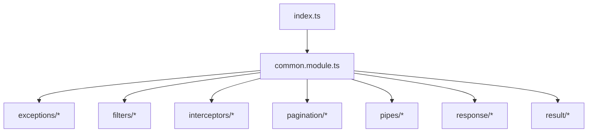
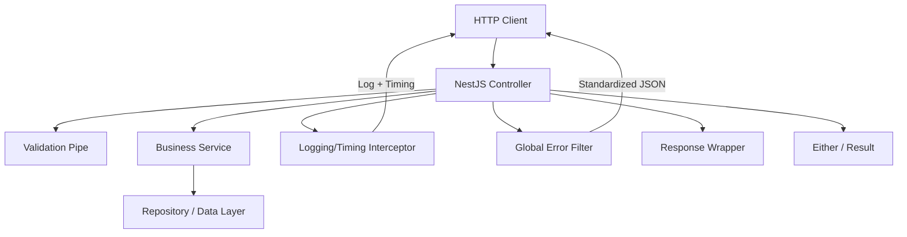
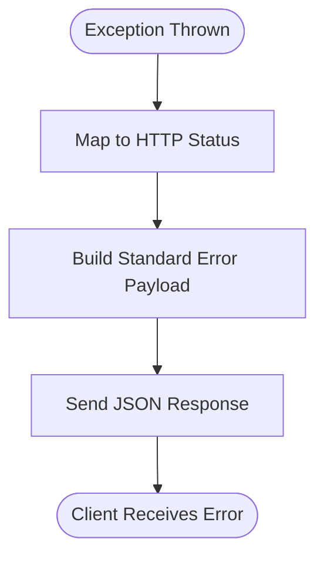
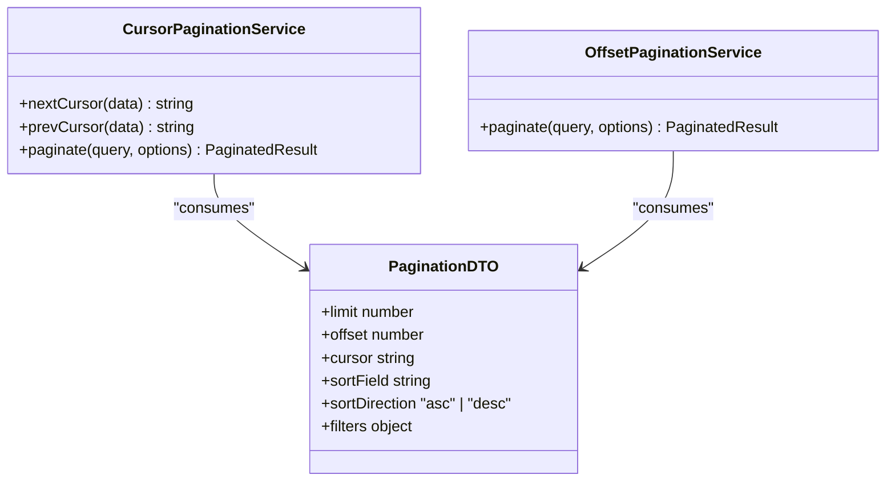
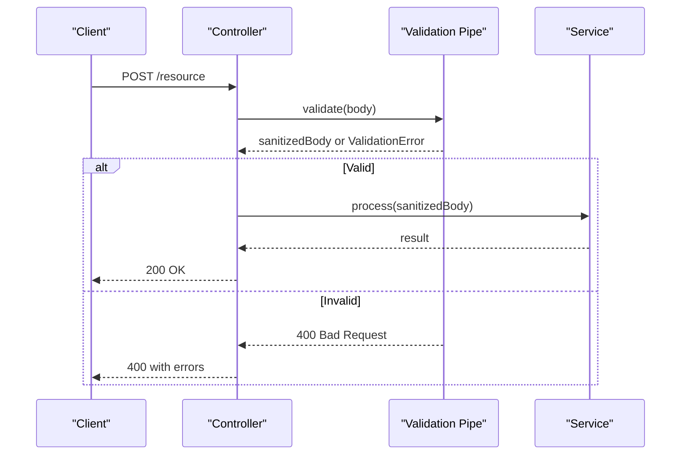
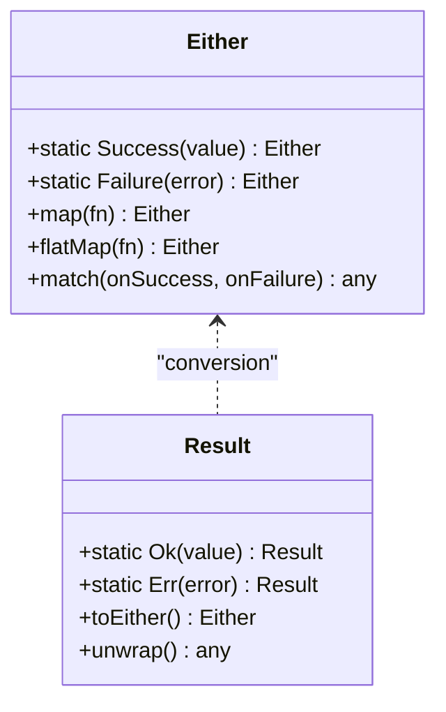
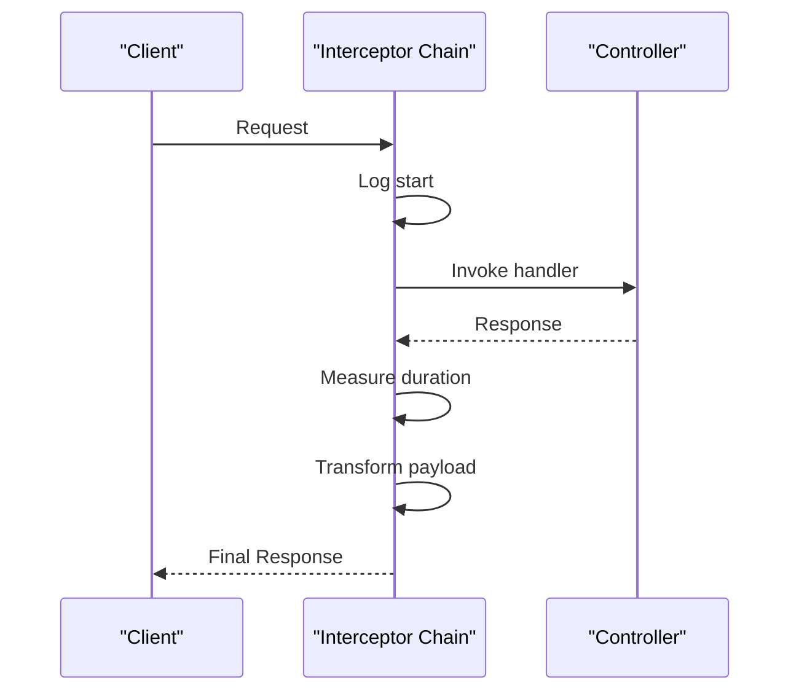
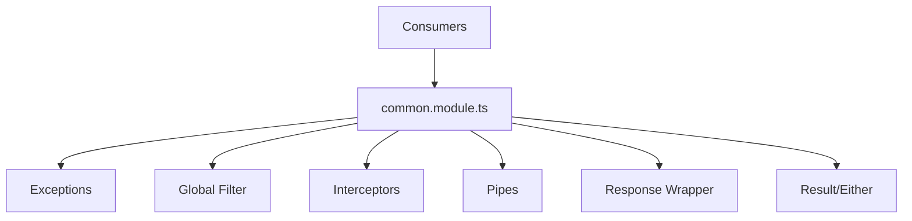

# Common Utilities & Shared Services

<cite>
**Referenced Files in This Document**
- [common.module.ts](file://apps/backend/src/common/common.module.ts)
- [index.ts](file://apps/backend/src/common/index.ts)
- [exceptions/](file://apps/backend/src/common/exceptions/)
- [filters/global-error.filter.ts](file://apps/backend/src/common/filters/global-error.filter.ts)
- [interceptors/logging.interceptor.ts](file://apps/backend/src/common/interceptors/logging.interceptor.ts)
- [pagination/cursor-pagination.service.ts](file://apps/backend/src/common/pagination/cursor-pagination.service.ts)
- [pagination/offset-pagination.service.ts](file://apps/backend/src/common/pagination/offset-pagination.service.ts)
- [pagination/pagination.dto.ts](file://apps/backend/src/common/pagination/pagination.dto.ts)
- [pipes/validation.pipe.ts](file://apps/backend/src/common/pipes/validation.pipe.ts)
- [response/response-wrapper.decorator.ts](file://apps/backend/src/common/response/response-wrapper.decorator.ts)
- [result/either.ts](file://apps/backend/src/common/result/either.ts)
- [result/result.ts](file://apps/backend/src/common/result/result.ts)
</cite>

## Table of Contents
1. [Introduction](#introduction)
2. [Project Structure](#project-structure)
3. [Core Components](#core-components)
4. [Architecture Overview](#architecture-overview)
5. [Detailed Component Analysis](#detailed-component-analysis)
6. [Dependency Analysis](#dependency-analysis)
7. [Performance Considerations](#performance-considerations)
8. [Troubleshooting Guide](#troubleshooting-guide)
9. [Conclusion](#conclusion)

## Introduction
This document describes the common utilities and shared services layer that standardize cross-cutting concerns across the backend application. It focuses on:
- Exception handling system with custom exceptions, global filters, and error response formatting
- Pagination implementations for cursor-based and offset-based pagination with filtering and sorting
- Validation pipes for request body validation and parameter sanitization
- Result wrapper pattern for consistent API responses and error handling
- Either monad implementation for functional error handling
- Response interceptors for logging, timing, and response transformation
- Practical examples for implementing custom pipes, guards, and interceptors following established patterns

## Project Structure
The shared layer is organized under apps/backend/src/common with focused subdirectories for each concern:
- exceptions: domain-specific exception classes
- filters: global exception filter(s)
- interceptors: logging, timing, and transformation interceptors
- pagination: cursor and offset pagination services and DTOs
- pipes: validation and sanitization pipes
- response: result wrapper decorators and helpers
- result: Either monad and Result type utilities
- common.module.ts: module wiring and provider registration
- index.ts: public exports for consumers

**Diagram sources**
- [common.module.ts](file://apps/backend/src/common/common.module.ts)
- [index.ts](file://apps/backend/src/common/index.ts)

**Section sources**
- [common.module.ts](file://apps/backend/src/common/common.module.ts)
- [index.ts](file://apps/backend/src/common/index.ts)

## Core Components
- Custom Exceptions: Domain exceptions encapsulate error codes, messages, and optional metadata for consistent error payloads.
- Global Error Filter: Centralizes exception handling to produce standardized HTTP responses.
- Interceptors: Provide cross-cutting behavior such as request logging, response timing, and response transformation.
- Pagination Services: Implement cursor-based and offset-based pagination with support for filtering and sorting.
- Validation Pipes: Validate and sanitize incoming requests using DTOs and class-validator rules.
- Result Wrapper: Decorators and helpers to wrap controller outputs into a consistent envelope.
- Either Monads: Functional error-handling types to avoid try/catch and enable composable pipelines.

**Section sources**
- [exceptions/](file://apps/backend/src/common/exceptions/)
- [filters/global-error.filter.ts](file://apps/backend/src/common/filters/global-error.filter.ts)
- [interceptors/logging.interceptor.ts](file://apps/backend/src/common/interceptors/logging.interceptor.ts)
- [pagination/cursor-pagination.service.ts](file://apps/backend/src/common/pagination/cursor-pagination.service.ts)
- [pagination/offset-pagination.service.ts](file://apps/backend/src/common/pagination/offset-pagination.service.ts)
- [pagination/pagination.dto.ts](file://apps/backend/src/common/pagination/pagination.dto.ts)
- [pipes/validation.pipe.ts](file://apps/backend/src/common/pipes/validation.pipe.ts)
- [response/response-wrapper.decorator.ts](file://apps/backend/src/common/response/response-wrapper.decorator.ts)
- [result/either.ts](file://apps/backend/src/common/result/either.ts)
- [result/result.ts](file://apps/backend/src/common/result/result.ts)

## Architecture Overview
The shared layer integrates with NestJS via a dedicated module that registers providers, filters, and interceptors. Controllers use DTOs validated by pipes, return data wrapped by decorators, and rely on Either/Result for functional error flows. The global error filter ensures uniform error responses regardless of where errors originate.

[No sources needed since this diagram shows conceptual workflow, not actual code structure]

## Detailed Component Analysis

### Exception Handling System
- Custom Exceptions: Define typed exceptions with fields like message, code, and optional details. These are thrown from services or repositories to signal domain failures.
- Global Error Filter: Catches all unhandled exceptions, maps them to HTTP status codes, and returns a consistent JSON shape including message, code, timestamp, and path.
- Error Response Formatting: Ensures clients receive predictable structures, enabling robust client-side error handling.

**Section sources**
- [exceptions/](file://apps/backend/src/common/exceptions/)
- [filters/global-error.filter.ts](file://apps/backend/src/common/filters/global-error.filter.ts)

### Pagination Implementations
Two strategies are provided:
- Cursor-Based Pagination: Uses opaque cursors for efficient, stable navigation without counting total rows. Ideal for large datasets and real-time feeds.
- Offset-Based Pagination: Uses page and limit parameters with optional skip/take. Suitable for traditional UI paging and analytics dashboards.

Both support:
- Filtering: Query parameters mapped to service-level filters
- Sorting: Field and direction parameters applied consistently

**Diagram sources**
- [pagination/cursor-pagination.service.ts](file://apps/backend/src/common/pagination/cursor-pagination.service.ts)
- [pagination/offset-pagination.service.ts](file://apps/backend/src/common/pagination/offset-pagination.service.ts)
- [pagination/pagination.dto.ts](file://apps/backend/src/common/pagination/pagination.dto.ts)

**Section sources**
- [pagination/cursor-pagination.service.ts](file://apps/backend/src/common/pagination/cursor-pagination.service.ts)
- [pagination/offset-pagination.service.ts](file://apps/backend/src/common/pagination/offset-pagination.service.ts)
- [pagination/pagination.dto.ts](file://apps/backend/src/common/pagination/pagination.dto.ts)

### Validation Pipes
- Request Body Validation: Enforces DTO schemas using class-validator decorators (e.g., IsString, MinLength). Throws structured validation errors when inputs fail.
- Parameter Sanitization: Normalizes query parameters (trimming, lowercasing, defaulting) before they reach controllers/services.
- Usage Pattern: Apply @UsePipes(new ValidationPipe()) at controller or method level; configure transform and whitelist options for strictness.

**Section sources**
- [pipes/validation.pipe.ts](file://apps/backend/src/common/pipes/validation.pipe.ts)

### Result Wrapper Pattern
- Consistent Envelope: All successful responses are wrapped in a uniform structure containing data, meta (pagination), and links where applicable.
- Decorator Usage: Apply a decorator around controller methods to automatically wrap outputs.
- Error Integration: Errors bypass the wrapper and are handled by the global filter, ensuring separation between success and failure paths.

```mermaid
flowchart TD
Entry(["Controller Method"]) --> Execute["Execute Business Logic"]
Execute --> Success{"Success?"}
Success --> |Yes| Wrap["Wrap in Response Envelope"]
Success --> |No| Throw["Throw Exception"]
Wrap --> Return["Return 2xx Response"]
Throw --> Filter["Global Error Filter"]
Filter --> ErrorResponse["Return 4xx/5xx Response"]
```

**Section sources**
- [response/response-wrapper.decorator.ts](file://apps/backend/src/common/response/response-wrapper.decorator.ts)

### Either Monad Implementation
- Purpose: Encapsulates success and failure outcomes without exceptions, enabling functional composition and explicit error propagation.
- Types:
  - Either.Success(value): Represents a successful computation
  - Either.Failure(error): Represents a failed computation
- Operations: map, flatMap, match, and combinators for chaining transformations while preserving error context.

**Diagram sources**
- [result/either.ts](file://apps/backend/src/common/result/either.ts)
- [result/result.ts](file://apps/backend/src/common/result/result.ts)

**Section sources**
- [result/either.ts](file://apps/backend/src/common/result/either.ts)
- [result/result.ts](file://apps/backend/src/common/result/result.ts)

### Response Interceptors
- Logging Interceptor: Captures request metadata (method, path, IP, correlation ID) and logs outgoing responses with duration and status.
- Timing Interceptor: Measures execution time and attaches timing headers or logs performance metrics.
- Transformation Interceptor: Transforms response payloads (e.g., stripping internal fields, adding timestamps) before sending to clients.

**Section sources**
- [interceptors/logging.interceptor.ts](file://apps/backend/src/common/interceptors/logging.interceptor.ts)

### Practical Examples

#### Custom Pipe Example
- Create a pipe that parses and validates a specific query parameter (e.g., date range).
- Use class-transformer to convert strings to Date objects.
- Throw a BadRequestException with a clear message if parsing fails.

Implementation guidance:
- Extend NestJS PipeTransform
- Override transform(value, metadata)
- Validate and sanitize input
- Return transformed value or throw

**Section sources**
- [pipes/validation.pipe.ts](file://apps/backend/src/common/pipes/validation.pipe.ts)

#### Custom Guard Example
- Implement an authorization guard that checks user roles or permissions.
- Use Reflector to read route metadata and compare against user context.
- Throw ForbiddenException when access is denied.

Implementation guidance:
- Implement CanActivate interface
- Inject required services (e.g., AuthService)
- Decide allow/deny based on context

**Section sources**
- [filters/global-error.filter.ts](file://apps/backend/src/common/filters/global-error.filter.ts)

#### Custom Interceptor Example
- Build a caching interceptor that serves cached responses for GET endpoints.
- Compute cache key from method, path, and relevant query params.
- Return cached data if available; otherwise, invoke handler and store result.

Implementation guidance:
- Implement NestJS Interceptor
- Use Observable pipeline to intercept response
- Integrate with cache service

**Section sources**
- [interceptors/logging.interceptor.ts](file://apps/backend/src/common/interceptors/logging.interceptor.ts)

## Dependency Analysis
The common module wires together providers, filters, and interceptors. Consumers import the module and gain access to shared pipes, guards, and decorators.

**Diagram sources**
- [common.module.ts](file://apps/backend/src/common/common.module.ts)

**Section sources**
- [common.module.ts](file://apps/backend/src/common/common.module.ts)

## Performance Considerations
- Prefer cursor-based pagination for large datasets to avoid expensive COUNT queries.
- Keep validation schemas minimal and targeted to reduce parsing overhead.
- Use interceptors judiciously; heavy logging can impact latency in high-throughput scenarios.
- Cache frequently accessed data via appropriate caching layers to minimize DB load.
- Avoid deep object cloning in interceptors; prefer selective field projection.

[No sources needed since this section provides general guidance]

## Troubleshooting Guide
- Validation Failures: Ensure DTOs match expected shapes and use appropriate validators. Check pipe configuration for transform and whitelist settings.
- Pagination Issues: Verify sort fields exist in the underlying schema; ensure cursor values are opaque and not guessable.
- Error Responses: Confirm global filter is registered and custom exceptions extend the base exception class.
- Interceptor Overhead: Profile response times; disable non-essential logging in production.

**Section sources**
- [pipes/validation.pipe.ts](file://apps/backend/src/common/pipes/validation.pipe.ts)
- [pagination/cursor-pagination.service.ts](file://apps/backend/src/common/pagination/cursor-pagination.service.ts)
- [pagination/offset-pagination.service.ts](file://apps/backend/src/common/pagination/offset-pagination.service.ts)
- [filters/global-error.filter.ts](file://apps/backend/src/common/filters/global-error.filter.ts)

## Conclusion
The common utilities and shared services layer provides a cohesive foundation for consistent error handling, pagination, validation, response wrapping, and functional error management. By adopting these patterns, teams can build reliable, maintainable APIs with predictable behaviors and clear separation of concerns.

[No sources needed since this section summarizes without analyzing specific files]