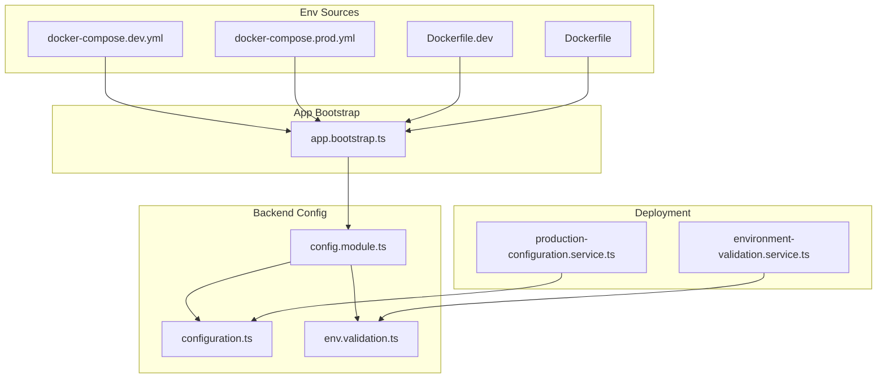
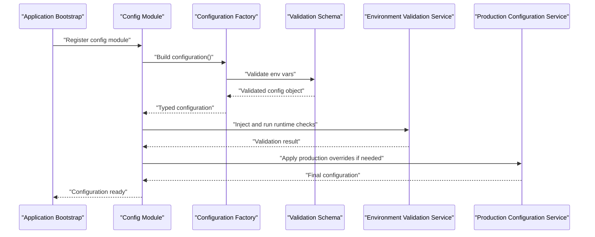
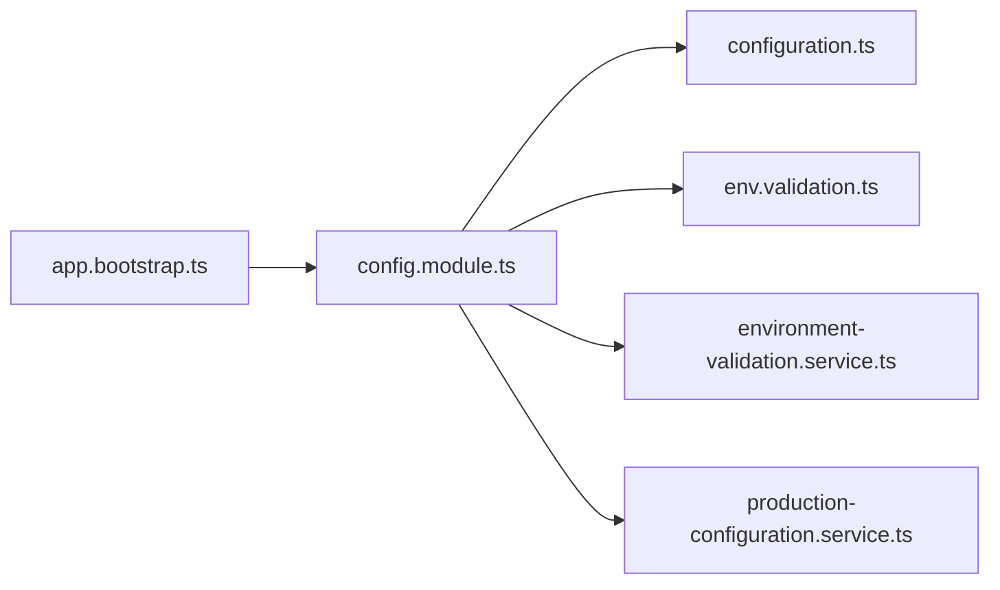

# Configuration Management

<cite>
**Referenced Files in This Document**
- [config.module.ts](file://apps/backend/src/config/config.module.ts)
- [configuration.ts](file://apps/backend/src/config/configuration.ts)
- [env.validation.ts](file://apps/backend/src/config/env.validation.ts)
- [app.bootstrap.ts](file://apps/backend/src/app.bootstrap.ts)
- [environment-validation.service.ts](file://apps/backend/src/deployment/environment-validation.service.ts)
- [production-configuration.service.ts](file://apps/backend/src/deployment/production-configuration.service.ts)
- [docker-compose.dev.yml](file://apps/backend/docker-compose.dev.yml)
- [docker-compose.prod.yml](file://apps/backend/docker-compose.prod.yml)
- [Dockerfile.dev](file://apps/backend/Dockerfile.dev)
- [Dockerfile](file://apps/backend/Dockerfile)
</cite>

## Table of Contents
1. [Introduction](#introduction)
2. [Project Structure](#project-structure)
3. [Core Components](#core-components)
4. [Architecture Overview](#architecture-overview)
5. [Detailed Component Analysis](#detailed-component-analysis)
6. [Dependency Analysis](#dependency-analysis)
7. [Performance Considerations](#performance-considerations)
8. [Troubleshooting Guide](#troubleshooting-guide)
9. [Conclusion](#conclusion)
10. [Appendices](#appendices)

## Introduction
This document explains the configuration management system used by the backend application. It covers environment variable structure, validation schemas, type-safe access patterns, module setup and service registration, environment-specific configurations (development, staging, production), adding new options, defaults and fallbacks, and security considerations for sensitive values such as database credentials and API keys.

## Project Structure
The configuration subsystem is implemented under apps/backend/src/config and integrates with NestJS modules and services. Environment-specific settings are provided via Docker Compose files and Dockerfiles.

**Diagram sources**
- [config.module.ts](file://apps/backend/src/config/config.module.ts)
- [configuration.ts](file://apps/backend/src/config/configuration.ts)
- [env.validation.ts](file://apps/backend/src/config/env.validation.ts)
- [app.bootstrap.ts](file://apps/backend/src/app.bootstrap.ts)
- [environment-validation.service.ts](file://apps/backend/src/deployment/environment-validation.service.ts)
- [production-configuration.service.ts](file://apps/backend/src/deployment/production-configuration.service.ts)
- [docker-compose.dev.yml](file://apps/backend/docker-compose.dev.yml)
- [docker-compose.prod.yml](file://apps/backend/docker-compose.prod.yml)
- [Dockerfile.dev](file://apps/backend/Dockerfile.dev)
- [Dockerfile](file://apps/backend/Dockerfile)

**Section sources**
- [config.module.ts](file://apps/backend/src/config/config.module.ts)
- [configuration.ts](file://apps/backend/src/config/configuration.ts)
- [env.validation.ts](file://apps/backend/src/config/env.validation.ts)
- [app.bootstrap.ts](file://apps/backend/src/app.bootstrap.ts)
- [environment-validation.service.ts](file://apps/backend/src/deployment/environment-validation.service.ts)
- [production-configuration.service.ts](file://apps/backend/src/deployment/production-configuration.service.ts)
- [docker-compose.dev.yml](file://apps/backend/docker-compose.dev.yml)
- [docker-compose.prod.yml](file://apps/backend/docker-compose.prod.yml)
- [Dockerfile.dev](file://apps/backend/Dockerfile.dev)
- [Dockerfile](file://apps/backend/Dockerfile)

## Core Components
- Configuration Module: Registers the configuration factory and validation pipeline at application bootstrap.
- Configuration Factory: Builds a typed configuration object from environment variables.
- Validation Schema: Enforces required variables, types, and constraints before the app starts.
- Environment Validation Service: Performs runtime checks to ensure critical settings are present and valid.
- Production Configuration Service: Applies production-specific hardening and overrides.

Key responsibilities:
- Centralize all configuration into a single typed object.
- Validate early to fail fast on misconfiguration.
- Provide safe accessors across the application.
- Support environment-specific behavior through environment variables.

**Section sources**
- [config.module.ts](file://apps/backend/src/config/config.module.ts)
- [configuration.ts](file://apps/backend/src/config/configuration.ts)
- [env.validation.ts](file://apps/backend/src/config/env.validation.ts)
- [environment-validation.service.ts](file://apps/backend/src/deployment/environment-validation.service.ts)
- [production-configuration.service.ts](file://apps/backend/src/deployment/production-configuration.service.ts)

## Architecture Overview
The configuration flow begins at application bootstrap, where the configuration module loads environment variables, validates them against a schema, and exposes a typed configuration object to the rest of the application.

**Diagram sources**
- [app.bootstrap.ts](file://apps/backend/src/app.bootstrap.ts)
- [config.module.ts](file://apps/backend/src/config/config.module.ts)
- [configuration.ts](file://apps/backend/src/config/configuration.ts)
- [env.validation.ts](file://apps/backend/src/config/env.validation.ts)
- [environment-validation.service.ts](file://apps/backend/src/deployment/environment-validation.service.ts)
- [production-configuration.service.ts](file://apps/backend/src/deployment/production-configuration.service.ts)

## Detailed Component Analysis

### Configuration Module Setup
- Purpose: Register the configuration factory and validation within the NestJS DI container.
- Behavior: Exposes a typed configuration object that other modules can inject safely.
- Integration: Consumed during bootstrap to ensure configuration is available before controllers/services initialize.

Best practices:
- Keep the module minimal; delegate parsing and validation to dedicated functions/services.
- Avoid side effects outside of configuration loading.

**Section sources**
- [config.module.ts](file://apps/backend/src/config/config.module.ts)
- [app.bootstrap.ts](file://apps/backend/src/app.bootstrap.ts)

### Configuration Factory and Type-Safe Access
- Purpose: Build a strongly-typed configuration object from environment variables.
- Behavior: Converts raw strings to appropriate types (e.g., booleans, numbers) and provides nested sections (e.g., database, cache).
- Usage: Services import and inject the configuration object to read values without stringly-typed lookups.

Guidelines:
- Define clear interfaces/types for each configuration section.
- Use explicit conversion helpers to avoid implicit coercion pitfalls.
- Group related settings into logical namespaces.

**Section sources**
- [configuration.ts](file://apps/backend/src/config/configuration.ts)

### Environment Variable Validation Schema
- Purpose: Ensure required variables exist and meet constraints (type, format, ranges).
- Behavior: Validates environment variables before the application proceeds; fails fast with descriptive errors.
- Extensibility: Add new fields by updating the schema and corresponding factory mapping.

Recommendations:
- Separate validation rules from parsing logic for clarity.
- Provide meaningful error messages indicating missing or invalid variables.
- Include optional defaults where appropriate to reduce friction in local development.

**Section sources**
- [env.validation.ts](file://apps/backend/src/config/env.validation.ts)

### Environment Validation Service
- Purpose: Perform runtime checks beyond static schema validation (e.g., connectivity prerequisites, feature flags).
- Behavior: Throws actionable errors when critical conditions are not met in specific environments.
- Typical checks: presence of secrets, correct URL formats, minimum versions, required external dependencies.

Usage pattern:
- Inject the service in bootstrap or a top-level module to enforce preconditions.

**Section sources**
- [environment-validation.service.ts](file://apps/backend/src/deployment/environment-validation.service.ts)

### Production Configuration Service
- Purpose: Apply production-specific overrides and hardening (e.g., stricter timeouts, logging levels, security headers).
- Behavior: Merges base configuration with production-only settings based on environment detection.
- Safety: Ensures sensitive defaults are never exposed in non-production contexts.

Integration:
- Called after base configuration is built to finalize the runtime configuration.

**Section sources**
- [production-configuration.service.ts](file://apps/backend/src/deployment/production-configuration.service.ts)

### Environment-Specific Configurations
- Development: Relaxed validations, verbose logs, local defaults for databases and caches.
- Staging: Closer to production with limited data and stricter checks than dev.
- Production: Strict validation, hardened defaults, secure transport, and minimal logging.

Sources:
- Docker Compose files define environment variables per environment.
- Dockerfiles set build-time and runtime defaults.

Operational guidance:
- Use separate compose profiles or files for each environment.
- Never commit secrets; rely on orchestrator secret stores or CI/CD injection.

**Section sources**
- [docker-compose.dev.yml](file://apps/backend/docker-compose.dev.yml)
- [docker-compose.prod.yml](file://apps/backend/docker-compose.prod.yml)
- [Dockerfile.dev](file://apps/backend/Dockerfile.dev)
- [Dockerfile](file://apps/backend/Dockerfile)

### Adding New Configuration Options
Steps:
1. Define the new option in the configuration factory with a default value and type conversion.
2. Add the option to the validation schema with required/optional status and constraints.
3. If needed, add an environment validation check for critical prerequisites.
4. Update environment-specific compose files or Dockerfiles to supply the variable.
5. Inject and use the configuration in services/controllers via the typed accessor.

Validation tips:
- For required variables, ensure the schema enforces presence and format.
- For optional variables, provide sensible defaults and document expected ranges.

Access pattern:
- Use the injected configuration object to read values; avoid direct process.env usage in business logic.

**Section sources**
- [configuration.ts](file://apps/backend/src/config/configuration.ts)
- [env.validation.ts](file://apps/backend/src/config/env.validation.ts)
- [environment-validation.service.ts](file://apps/backend/src/deployment/environment-validation.service.ts)
- [docker-compose.dev.yml](file://apps/backend/docker-compose.dev.yml)
- [docker-compose.prod.yml](file://apps/backend/docker-compose.prod.yml)

### Defaults and Fallback Mechanisms
- Defaults: Provide safe, non-sensitive defaults for non-critical settings to improve developer experience.
- Fallbacks: Prefer environment variables over file-based or hardcoded defaults; only fall back to safe defaults when necessary.
- Precedence: Environment variables > Compose/runtime overrides > Defaults.

Security note:
- Do not embed secrets in defaults; require explicit configuration for sensitive values.

**Section sources**
- [configuration.ts](file://apps/backend/src/config/configuration.ts)
- [env.validation.ts](file://apps/backend/src/config/env.validation.ts)

### Security Considerations for Sensitive Configuration
- Database credentials, API keys, and tokens must be supplied via environment variables or secret managers.
- Avoid logging sensitive values; sanitize logs and error messages.
- Restrict access to configuration files and environment files; do not commit secrets.
- Use HTTPS/TLS for external services and enforce strict certificate validation.
- Rotate secrets regularly and audit their usage.

Recommended practices:
- Validate secret formats where possible (e.g., key length, prefix).
- Fail fast if secrets are missing or malformed.
- Use least-privilege principles for service accounts and database users.

**Section sources**
- [env.validation.ts](file://apps/backend/src/config/env.validation.ts)
- [environment-validation.service.ts](file://apps/backend/src/deployment/environment-validation.service.ts)

## Dependency Analysis
The configuration system has clear boundaries and low coupling:
- The configuration module depends on the factory and validator.
- Bootstrap wires the module and services together.
- Deployment services depend on the validated configuration to apply environment-specific behavior.

**Diagram sources**
- [app.bootstrap.ts](file://apps/backend/src/app.bootstrap.ts)
- [config.module.ts](file://apps/backend/src/config/config.module.ts)
- [configuration.ts](file://apps/backend/src/config/configuration.ts)
- [env.validation.ts](file://apps/backend/src/config/env.validation.ts)
- [environment-validation.service.ts](file://apps/backend/src/deployment/environment-validation.service.ts)
- [production-configuration.service.ts](file://apps/backend/src/deployment/production-configuration.service.ts)

**Section sources**
- [config.module.ts](file://apps/backend/src/config/config.module.ts)
- [configuration.ts](file://apps/backend/src/config/configuration.ts)
- [env.validation.ts](file://apps/backend/src/config/env.validation.ts)
- [environment-validation.service.ts](file://apps/backend/src/deployment/environment-validation.service.ts)
- [production-configuration.service.ts](file://apps/backend/src/deployment/production-configuration.service.ts)

## Performance Considerations
- Validate once at startup to avoid repeated checks.
- Cache parsed configuration in memory for the lifetime of the process.
- Avoid heavy computations in configuration factories; keep parsing lightweight.
- Defer expensive runtime checks until they are necessary.

[No sources needed since this section provides general guidance]

## Troubleshooting Guide
Common issues and resolutions:
- Missing environment variables: Check validation error messages and ensure compose/runtime variables are set.
- Invalid types or formats: Confirm variable values match expected types (booleans, numbers, URLs).
- Runtime precondition failures: Inspect environment validation service logs for missing prerequisites.
- Production overrides not applied: Verify environment detection logic and precedence rules.

Debugging steps:
- Print sanitized configuration summaries in development.
- Enable verbose logging temporarily to trace configuration loading.
- Validate compose files and Dockerfiles for correct variable names and values.

**Section sources**
- [env.validation.ts](file://apps/backend/src/config/env.validation.ts)
- [environment-validation.service.ts](file://apps/backend/src/deployment/environment-validation.service.ts)

## Conclusion
The configuration management system centralizes environment-driven settings behind a typed interface, validates them early, and supports environment-specific behaviors. By following the patterns outlined here—defining clear schemas, providing safe defaults, enforcing security best practices, and using dependency injection—you can maintain robust, secure, and maintainable configuration across development, staging, and production.

[No sources needed since this section summarizes without analyzing specific files]

## Appendices

### Example: Adding a New Configuration Option
- Define the option in the configuration factory with a default and type conversion.
- Add it to the validation schema with required/optional status and constraints.
- Supply the variable in environment-specific compose files or Dockerfiles.
- Inject and read the value via the typed configuration object in services.

**Section sources**
- [configuration.ts](file://apps/backend/src/config/configuration.ts)
- [env.validation.ts](file://apps/backend/src/config/env.validation.ts)
- [docker-compose.dev.yml](file://apps/backend/docker-compose.dev.yml)
- [docker-compose.prod.yml](file://apps/backend/docker-compose.prod.yml)

### Example: Validating Required Variables
- Mark critical variables as required in the validation schema.
- Provide descriptive error messages for missing or malformed inputs.
- Fail fast during bootstrap to prevent running with incomplete configuration.

**Section sources**
- [env.validation.ts](file://apps/backend/src/config/env.validation.ts)

### Example: Accessing Configuration Values
- Inject the configuration object into services/controllers.
- Read values through typed properties rather than direct environment access.
- Group related settings under logical namespaces for clarity.

**Section sources**
- [configuration.ts](file://apps/backend/src/config/configuration.ts)