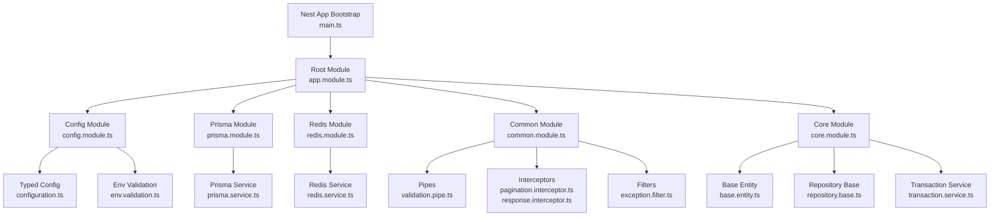
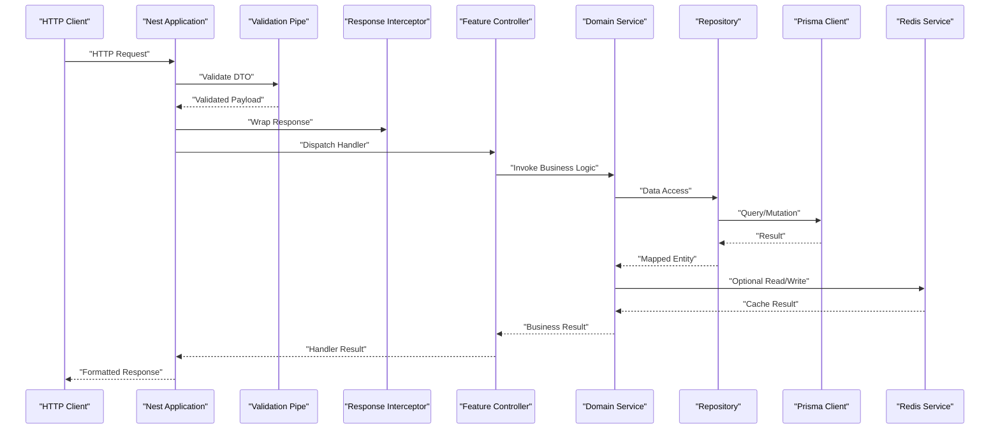
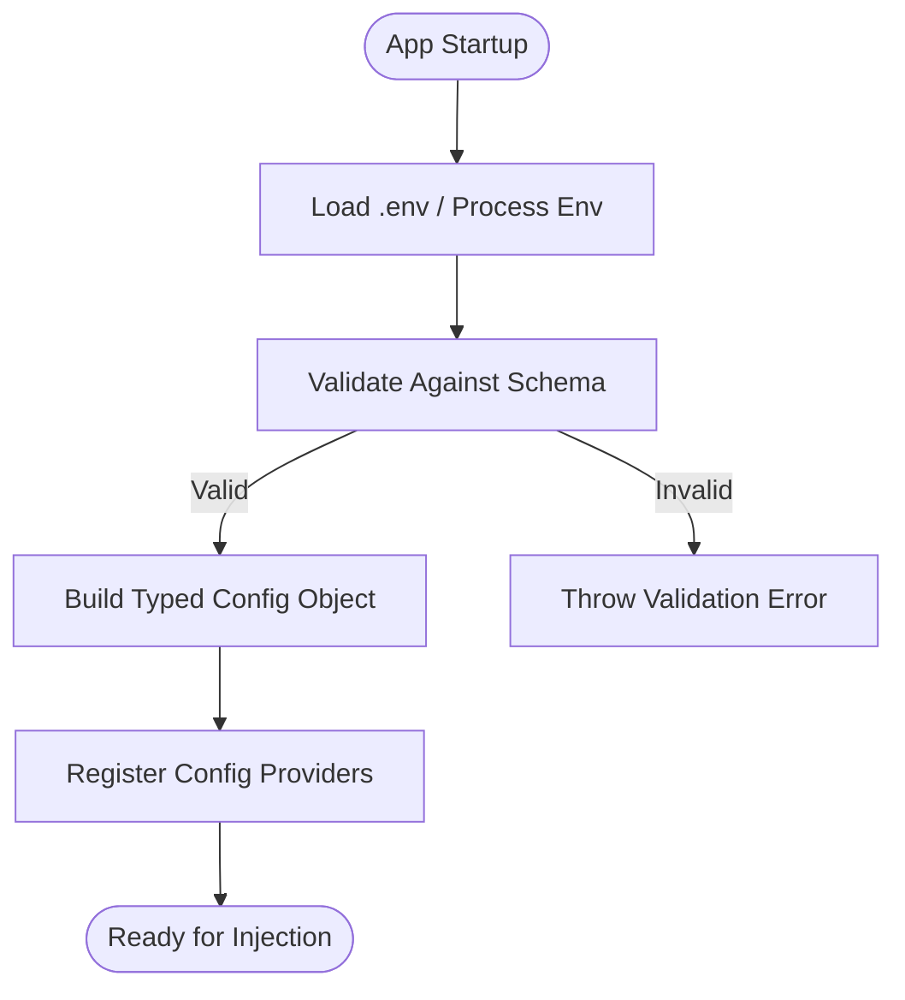
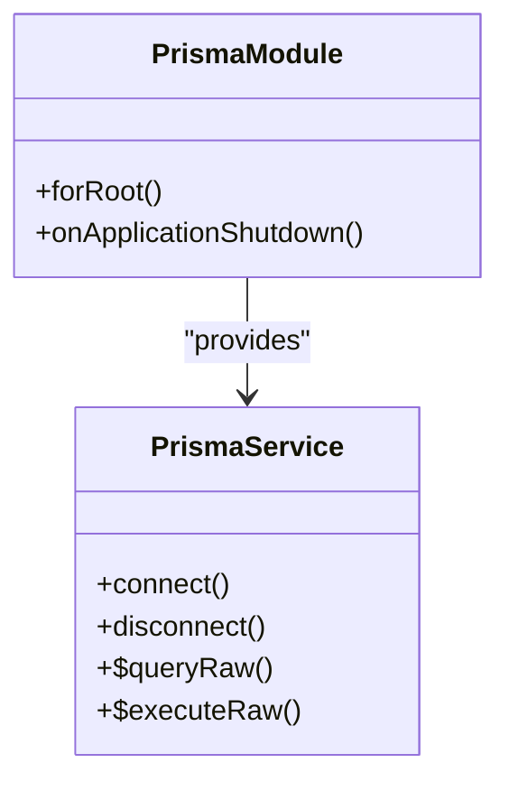
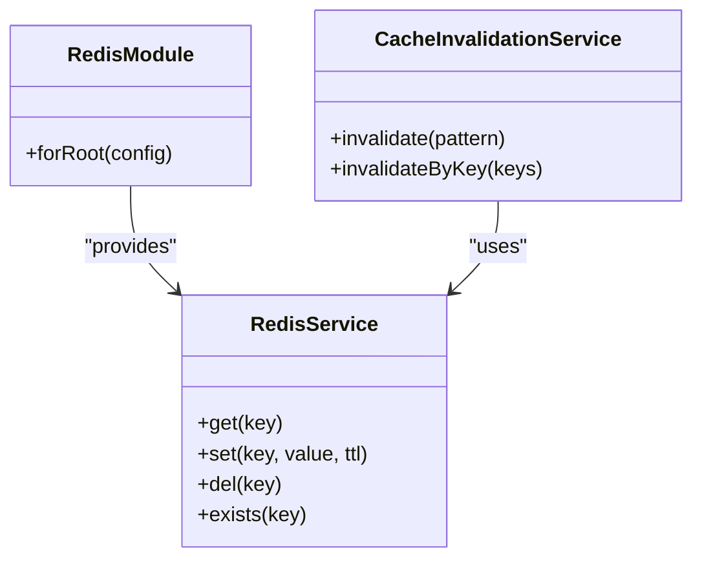
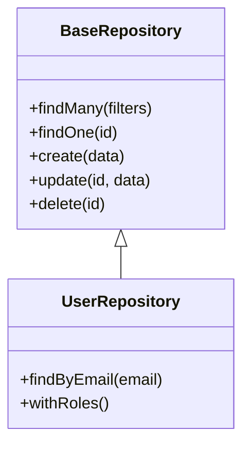
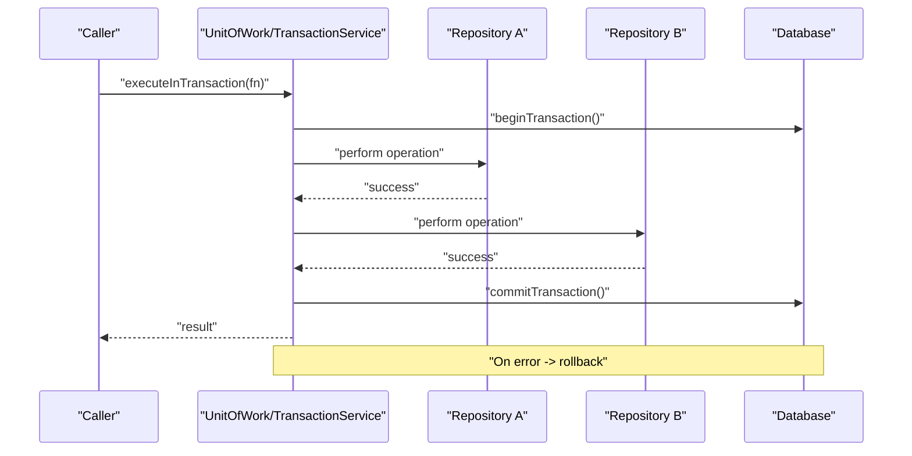
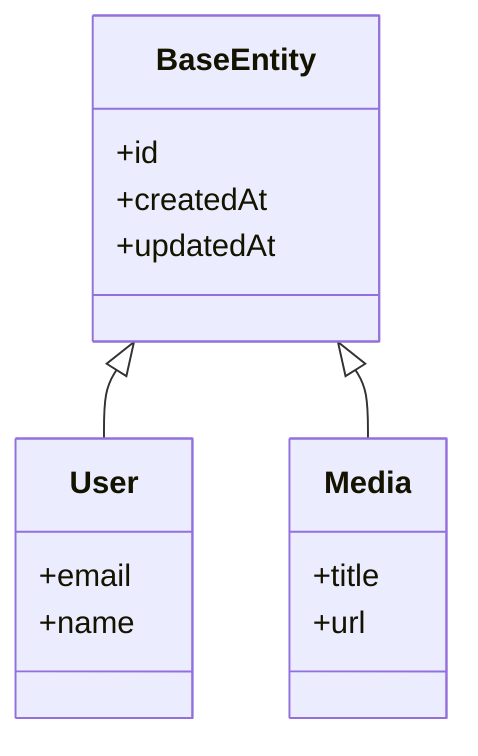
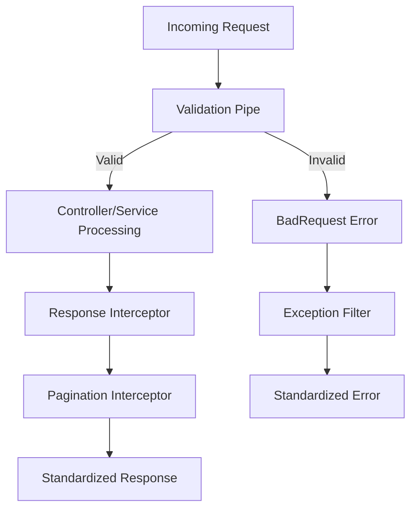
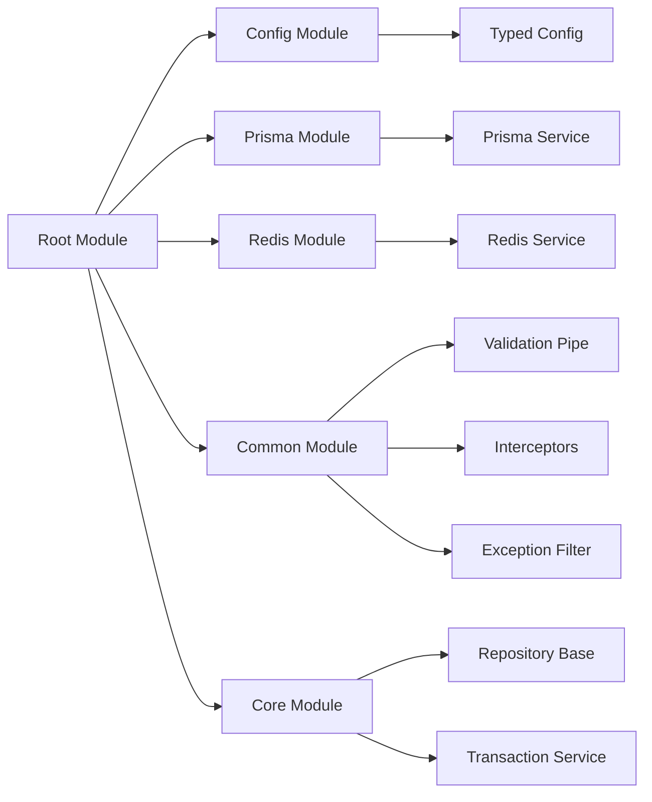

# Core Modules & Infrastructure

<cite>
**Referenced Files in This Document**
- [app.module.ts](file://apps/backend/src/app.module.ts)
- [main.ts](file://apps/backend/src/main.ts)
- [core.module.ts](file://apps/backend/src/core/core.module.ts)
- [configuration.ts](file://apps/backend/src/config/configuration.ts)
- [env.validation.ts](file://apps/backend/src/config/env.validation.ts)
- [config.module.ts](file://apps/backend/src/config/config.module.ts)
- [prisma.service.ts](file://apps/backend/src/prisma/prisma.service.ts)
- [prisma.module.ts](file://apps/backend/src/prisma/prisma.module.ts)
- [schema.prisma](file://apps/backend/prisma/schema.prisma)
- [redis.service.ts](file://apps/backend/src/redis/redis.service.ts)
- [redis.module.ts](file://apps/backend/src/redis/redis.module.ts)
- [common.module.ts](file://apps/backend/src/common/common.module.ts)
- [pagination.decorator.ts](file://apps/backend/src/common/pagination/pagination.decorator.ts)
- [pagination.interceptor.ts](file://apps/backend/src/common/pagination/pagination.interceptor.ts)
- [validation.pipe.ts](file://apps/backend/src/common/pipes/validation.pipe.ts)
- [response.interceptor.ts](file://apps/backend/src/common/response/response.interceptor.ts)
- [exception.filter.ts](file://apps/backend/src/common/filters/exception.filter.ts)
- [base.entity.ts](file://apps/backend/src/core/domain/base.entity.ts)
- [repository.base.ts](file://apps/backend/src/core/repository/repository.base.ts)
- [transaction.service.ts](file://apps/backend/src/core/transaction/transaction.service.ts)
- [cache.service.ts](file://apps/backend/src/hardening/cache.service.ts)
- [cache-invalidation.service.ts](file://apps/backend/src/hardening/cache-invalidation.service.ts)
</cite>

## Table of Contents
1. [Introduction](#introduction)
2. [Project Structure](#project-structure)
3. [Core Components](#core-components)
4. [Architecture Overview](#architecture-overview)
5. [Detailed Component Analysis](#detailed-component-analysis)
6. [Dependency Analysis](#dependency-analysis)
7. [Performance Considerations](#performance-considerations)
8. [Troubleshooting Guide](#troubleshooting-guide)
9. [Conclusion](#conclusion)

## Introduction
This document explains the core modules and infrastructure layer of the NestJS backend. It focuses on domain entities, base classes, shared abstractions, configuration management, Prisma integration, caching with Redis, repository patterns, transaction management, and unit-of-work patterns. The goal is to provide a clear mental model for how these pieces fit together and how they can be extended or maintained.

## Project Structure
The backend organizes cross-cutting concerns into dedicated modules:
- Configuration: environment validation and typed configuration injection
- Database: Prisma service and module setup
- Caching: Redis client and cache utilities
- Common: global pipes, interceptors, filters, pagination, and response formatting
- Core: domain base entities, repository abstractions, transactions, and other foundational services

**Diagram sources**
- [main.ts](file://apps/backend/src/main.ts)
- [app.module.ts](file://apps/backend/src/app.module.ts)
- [config.module.ts](file://apps/backend/src/config/config.module.ts)
- [configuration.ts](file://apps/backend/src/config/configuration.ts)
- [env.validation.ts](file://apps/backend/src/config/env.validation.ts)
- [prisma.module.ts](file://apps/backend/src/prisma/prisma.module.ts)
- [prisma.service.ts](file://apps/backend/src/prisma/prisma.service.ts)
- [redis.module.ts](file://apps/backend/src/redis/redis.module.ts)
- [redis.service.ts](file://apps/backend/src/redis/redis.service.ts)
- [common.module.ts](file://apps/backend/src/common/common.module.ts)
- [validation.pipe.ts](file://apps/backend/src/common/pipes/validation.pipe.ts)
- [pagination.interceptor.ts](file://apps/backend/src/common/pagination/pagination.interceptor.ts)
- [response.interceptor.ts](file://apps/backend/src/common/response/response.interceptor.ts)
- [exception.filter.ts](file://apps/backend/src/common/filters/exception.filter.ts)
- [core.module.ts](file://apps/backend/src/core/core.module.ts)
- [base.entity.ts](file://apps/backend/src/core/domain/base.entity.ts)
- [repository.base.ts](file://apps/backend/src/core/repository/repository.base.ts)
- [transaction.service.ts](file://apps/backend/src/core/transaction/transaction.service.ts)

**Section sources**
- [main.ts](file://apps/backend/src/main.ts)
- [app.module.ts](file://apps/backend/src/app.module.ts)
- [config.module.ts](file://apps/backend/src/config/config.module.ts)
- [prisma.module.ts](file://apps/backend/src/prisma/prisma.module.ts)
- [redis.module.ts](file://apps/backend/src/redis/redis.module.ts)
- [common.module.ts](file://apps/backend/src/common/common.module.ts)
- [core.module.ts](file://apps/backend/src/core/core.module.ts)

## Core Components
- Configuration Management: Typed configuration via a centralized factory, validated against environment schemas, and exposed as injectable providers.
- Database Integration: Prisma client lifecycle managed by a Nest service; connection pooling configured through Prisma settings.
- Caching Layer: Redis-backed cache service with helpers for TTL, keys, and invalidation strategies.
- Shared Utilities: Global validation pipe, pagination interceptor, standardized response interceptor, and exception filter.
- Domain Foundations: Base entity with common fields (e.g., timestamps), repository base class for CRUD abstractions, and transaction service for atomic operations.

**Section sources**
- [configuration.ts](file://apps/backend/src/config/configuration.ts)
- [env.validation.ts](file://apps/backend/src/config/env.validation.ts)
- [prisma.service.ts](file://apps/backend/src/prisma/prisma.service.ts)
- [redis.service.ts](file://apps/backend/src/redis/redis.service.ts)
- [validation.pipe.ts](file://apps/backend/src/common/pipes/validation.pipe.ts)
- [pagination.interceptor.ts](file://apps/backend/src/common/pagination/pagination.interceptor.ts)
- [response.interceptor.ts](file://apps/backend/src/common/response/response.interceptor.ts)
- [exception.filter.ts](file://apps/backend/src/common/filters/exception.filter.ts)
- [base.entity.ts](file://apps/backend/src/core/domain/base.entity.ts)
- [repository.base.ts](file://apps/backend/src/core/repository/repository.base.ts)
- [transaction.service.ts](file://apps/backend/src/core/transaction/transaction.service.ts)

## Architecture Overview
At runtime, Nest bootstraps the application, registers modules, and wires dependencies. Configuration is loaded and validated before services are instantiated. Prisma and Redis clients are provided as singletons. Global pipes and interceptors shape request processing, while core abstractions standardize data access and transactions.

**Diagram sources**
- [main.ts](file://apps/backend/src/main.ts)
- [app.module.ts](file://apps/backend/src/app.module.ts)
- [validation.pipe.ts](file://apps/backend/src/common/pipes/validation.pipe.ts)
- [response.interceptor.ts](file://apps/backend/src/common/response/response.interceptor.ts)
- [prisma.service.ts](file://apps/backend/src/prisma/prisma.service.ts)
- [redis.service.ts](file://apps/backend/src/redis/redis.service.ts)

## Detailed Component Analysis

### Configuration Management
- Centralized configuration factory returns typed settings.
- Environment variables are validated using a schema to fail fast at startup.
- Configuration module exposes providers consumed across the app.

**Diagram sources**
- [configuration.ts](file://apps/backend/src/config/configuration.ts)
- [env.validation.ts](file://apps/backend/src/config/env.validation.ts)
- [config.module.ts](file://apps/backend/src/config/config.module.ts)

**Section sources**
- [configuration.ts](file://apps/backend/src/config/configuration.ts)
- [env.validation.ts](file://apps/backend/src/config/env.validation.ts)
- [config.module.ts](file://apps/backend/src/config/config.module.ts)

### Prisma Database Integration
- Prisma service manages client lifecycle, connection pooling, and graceful shutdown.
- Module provides the client as a singleton dependency.
- Schema defines entities and relations; migrations evolve the database over time.

**Diagram sources**
- [prisma.module.ts](file://apps/backend/src/prisma/prisma.module.ts)
- [prisma.service.ts](file://apps/backend/src/prisma/prisma.service.ts)
- [schema.prisma](file://apps/backend/prisma/schema.prisma)

**Section sources**
- [prisma.module.ts](file://apps/backend/src/prisma/prisma.module.ts)
- [prisma.service.ts](file://apps/backend/src/prisma/prisma.service.ts)
- [schema.prisma](file://apps/backend/prisma/schema.prisma)

### Redis Caching Strategy
- Redis service encapsulates client connections and common operations (get/set/del).
- Cache invalidation service coordinates cache updates around mutations.
- TTL and key naming conventions ensure predictable behavior.

**Diagram sources**
- [redis.module.ts](file://apps/backend/src/redis/redis.module.ts)
- [redis.service.ts](file://apps/backend/src/redis/redis.service.ts)
- [cache.service.ts](file://apps/backend/src/hardening/cache.service.ts)
- [cache-invalidation.service.ts](file://apps/backend/src/hardening/cache-invalidation.service.ts)

**Section sources**
- [redis.module.ts](file://apps/backend/src/redis/redis.module.ts)
- [redis.service.ts](file://apps/backend/src/redis/redis.service.ts)
- [cache.service.ts](file://apps/backend/src/hardening/cache.service.ts)
- [cache-invalidation.service.ts](file://apps/backend/src/hardening/cache-invalidation.service.ts)

### Repository Pattern and Data Access Abstractions
- Base repository defines common CRUD operations and query helpers.
- Feature repositories extend the base to implement domain-specific queries.
- Services depend on repository interfaces to keep business logic decoupled from persistence.

**Diagram sources**
- [repository.base.ts](file://apps/backend/src/core/repository/repository.base.ts)

**Section sources**
- [repository.base.ts](file://apps/backend/src/core/repository/repository.base.ts)

### Transaction Management and Unit of Work
- Transaction service wraps multiple operations within a single database transaction.
- Unit of work pattern ensures consistency across repositories and external calls.
- Rollback occurs automatically on exceptions; commit happens upon successful completion.

**Diagram sources**
- [transaction.service.ts](file://apps/backend/src/core/transaction/transaction.service.ts)

**Section sources**
- [transaction.service.ts](file://apps/backend/src/core/transaction/transaction.service.ts)

### Domain Entities and Base Classes
- Base entity centralizes common fields such as IDs and timestamps.
- Domain entities inherit from the base to ensure consistent auditing and lifecycle metadata.

**Diagram sources**
- [base.entity.ts](file://apps/backend/src/core/domain/base.entity.ts)

**Section sources**
- [base.entity.ts](file://apps/backend/src/core/domain/base.entity.ts)

### Common Utilities
- Validation Pipe: Enforces DTO constraints globally to reduce boilerplate in controllers.
- Pagination Interceptor: Standardizes paginated responses and meta information.
- Response Interceptor: Wraps payloads consistently for API consumers.
- Exception Filter: Normalizes error responses and logs structured errors.

**Diagram sources**
- [validation.pipe.ts](file://apps/backend/src/common/pipes/validation.pipe.ts)
- [pagination.interceptor.ts](file://apps/backend/src/common/pagination/pagination.interceptor.ts)
- [response.interceptor.ts](file://apps/backend/src/common/response/response.interceptor.ts)
- [exception.filter.ts](file://apps/backend/src/common/filters/exception.filter.ts)

**Section sources**
- [validation.pipe.ts](file://apps/backend/src/common/pipes/validation.pipe.ts)
- [pagination.interceptor.ts](file://apps/backend/src/common/pagination/pagination.interceptor.ts)
- [response.interceptor.ts](file://apps/backend/src/common/response/response.interceptor.ts)
- [exception.filter.ts](file://apps/backend/src/common/filters/exception.filter.ts)

## Dependency Analysis
The root module composes feature modules and infrastructure modules. Configuration, Prisma, Redis, and common utilities are registered early so that features can consume them without tight coupling.

**Diagram sources**
- [app.module.ts](file://apps/backend/src/app.module.ts)
- [config.module.ts](file://apps/backend/src/config/config.module.ts)
- [prisma.module.ts](file://apps/backend/src/prisma/prisma.module.ts)
- [redis.module.ts](file://apps/backend/src/redis/redis.module.ts)
- [common.module.ts](file://apps/backend/src/common/common.module.ts)
- [core.module.ts](file://apps/backend/src/core/core.module.ts)

**Section sources**
- [app.module.ts](file://apps/backend/src/app.module.ts)
- [config.module.ts](file://apps/backend/src/config/config.module.ts)
- [prisma.module.ts](file://apps/backend/src/prisma/prisma.module.ts)
- [redis.module.ts](file://apps/backend/src/redis/redis.module.ts)
- [common.module.ts](file://apps/backend/src/common/common.module.ts)
- [core.module.ts](file://apps/backend/src/core/core.module.ts)

## Performance Considerations
- Connection Pooling: Configure Prisma pool size and timeouts based on workload and database capacity.
- Caching: Use Redis for hot reads; set appropriate TTLs and implement targeted invalidation.
- Pagination: Always paginate large datasets to limit memory and network overhead.
- Transactions: Keep transactions short to minimize lock contention and deadlocks.
- Validation: Leverage global validation to avoid redundant checks and reduce payload sizes.

[No sources needed since this section provides general guidance]

## Troubleshooting Guide
- Configuration Errors: Ensure all required environment variables exist and match expected types; failures occur at startup when validation fails.
- Database Connectivity: Verify Prisma connection string, pool limits, and network reachability; check migration status.
- Redis Availability: Confirm Redis host/port and credentials; handle transient connection errors gracefully.
- Validation Failures: Inspect DTO decorators and error messages returned by the validation pipe.
- Transaction Rollbacks: Review nested operations and ensure exceptions propagate to trigger rollbacks.

**Section sources**
- [env.validation.ts](file://apps/backend/src/config/env.validation.ts)
- [prisma.service.ts](file://apps/backend/src/prisma/prisma.service.ts)
- [redis.service.ts](file://apps/backend/src/redis/redis.service.ts)
- [validation.pipe.ts](file://apps/backend/src/common/pipes/validation.pipe.ts)
- [transaction.service.ts](file://apps/backend/src/core/transaction/transaction.service.ts)

## Conclusion
The core modules and infrastructure layer provide a robust foundation for the NestJS backend. Typed configuration, Prisma-based data access, Redis caching, standardized request/response handling, repository abstractions, and transactional workflows collectively enable scalable, maintainable, and observable services. Extending this layer involves adhering to established patterns: new entities inherit from the base entity, repositories extend the base repository, and services use the transaction service for consistency.

[No sources needed since this section summarizes without analyzing specific files]