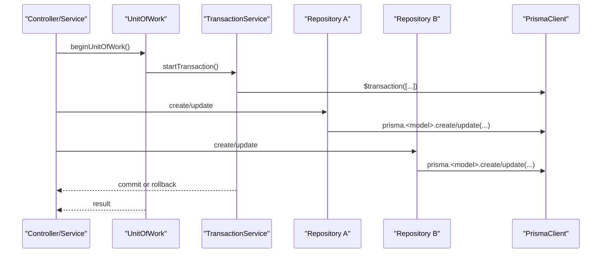
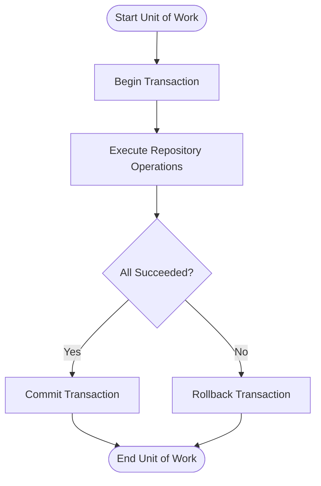
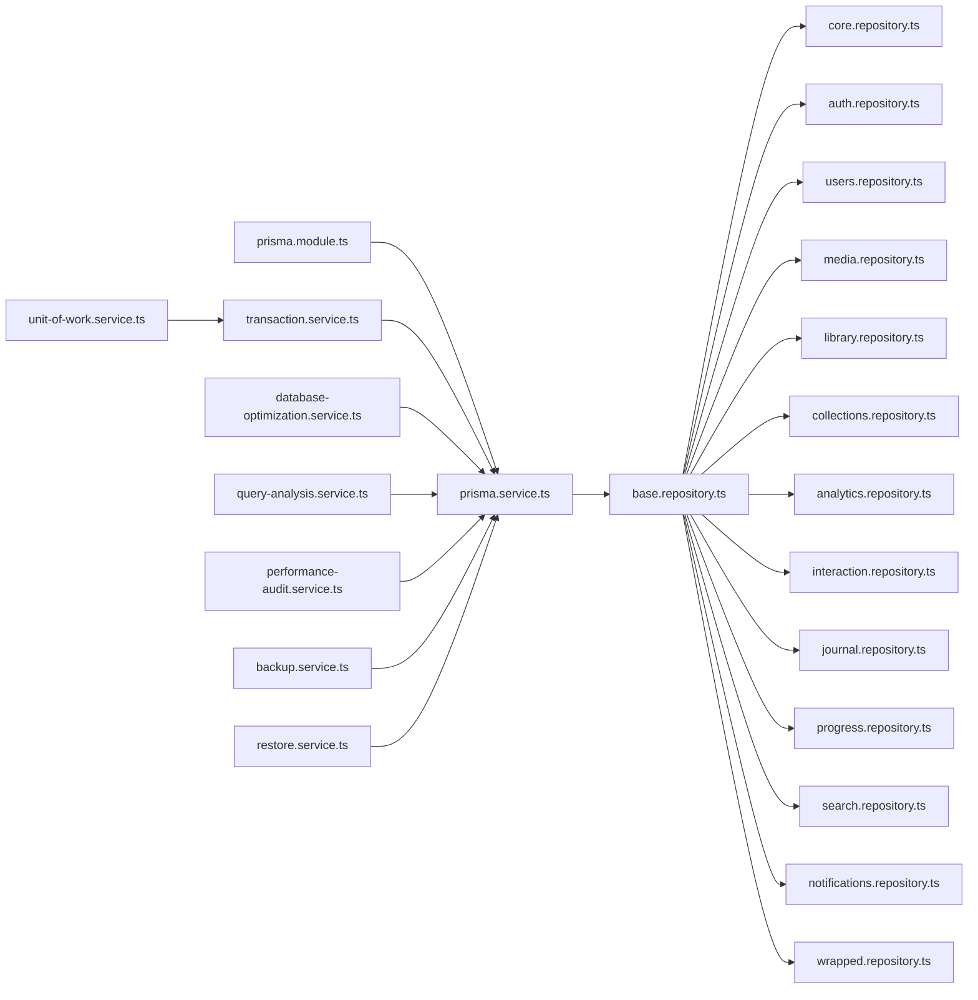

# Database Integration & Prisma

<cite>
**Referenced Files in This Document**
- [schema.prisma](file://apps/backend/prisma/schema.prisma)
- [prisma.service.ts](file://apps/backend/src/prisma/prisma.service.ts)
- [prisma.module.ts](file://apps/backend/src/prisma/prisma.module.ts)
- [core.repository.ts](file://apps/backend/src/core/repository/core.repository.ts)
- [base.repository.ts](file://apps/backend/src/core/repository/base.repository.ts)
- [transaction.service.ts](file://apps/backend/src/core/transaction/transaction.service.ts)
- [unit-of-work.service.ts](file://apps/backend/src/core/transaction/unit-of-work.service.ts)
- [database-optimization.service.ts](file://apps/backend/src/hardening/database-optimization.service.ts)
- [query-analysis.service.ts](file://apps/backend/src/hardening/query-analysis.service.ts)
- [performance-audit.service.ts](file://apps/backend/src/hardening/performance-audit.service.ts)
- [backup.service.ts](file://apps/backend/src/deployment/backup.service.ts)
- [restore.service.ts](file://apps/backend/src/deployment/restore.service.ts)
- [seed-demo-data.ts](file://apps/backend/seed-demo-data.ts)
- [analytics.repository.ts](file://apps/backend/src/analytics/analytics.repository.ts)
- [auth.repository.ts](file://apps/backend/src/auth/auth.repository.ts)
- [collections.repository.ts](file://apps/backend/src/collections/collections.repository.ts)
- [interaction.repository.ts](file://apps/backend/src/interaction/interaction.repository.ts)
- [library.repository.ts](file://apps/backend/src/library/library.repository.ts)
- [media.repository.ts](file://apps/backend/src/media/media.repository.ts)
- [notifications.repository.ts](file://apps/backend/src/notifications/notifications.repository.ts)
- [progress.repository.ts](file://apps/backend/src/progress/progress.repository.ts)
- [search.repository.ts](file://apps/backend/src/search/search.repository.ts)
- [users.repository.ts](file://apps/backend/src/users/users.repository.ts)
- [wrapped.repository.ts](file://apps/backend/src/wrapped/wrapped.repository.ts)
- [journal.repository.ts](file://apps/backend/src/journal/journal.repository.ts)
</cite>

## Table of Contents
1. [Introduction](#introduction)
2. [Project Structure](#project-structure)
3. [Core Components](#core-components)
4. [Architecture Overview](#architecture-overview)
5. [Detailed Component Analysis](#detailed-component-analysis)
6. [Dependency Analysis](#dependency-analysis)
7. [Performance Considerations](#performance-considerations)
8. [Troubleshooting Guide](#troubleshooting-guide)
9. [Conclusion](#conclusion)
10. [Appendices](#appendices)

## Introduction
This document explains how the backend integrates with a relational database using Prisma ORM. It covers schema design, entity relationships, migration strategies, repository patterns for CRUD operations, connection pooling, transaction management, query optimization, custom repositories, complex queries, error handling, seeding, backups, performance monitoring, and the unit of work pattern for multi-operation transactions.

## Project Structure
The database integration is centered around:
- Prisma schema and migrations under apps/backend/prisma
- A NestJS module and service that provide a typed Prisma client instance
- Domain-specific repositories implementing common CRUD via a base repository
- Transaction utilities and a unit of work to orchestrate multiple operations atomically
- Hardening services for query analysis and performance auditing
- Deployment services for backup and restore
- Seed scripts for demo data

```mermaid
graph TB
subgraph "Prisma Layer"
Schema["schema.prisma"]
Migrations["migrations/*"]
end
subgraph "NestJS Core"
PrismaModule["prisma.module.ts"]
PrismaService["prisma.service.ts"]
BaseRepo["base.repository.ts"]
CoreRepo["core.repository.ts"]
TxSvc["transaction.service.ts"]
UoW["unit-of-work.service.ts"]
end
subgraph "Domain Repositories"
AuthRepo["auth.repository.ts"]
UsersRepo["users.repository.ts"]
MediaRepo["media.repository.ts"]
LibraryRepo["library.repository.ts"]
CollectionsRepo["collections.repository.ts"]
AnalyticsRepo["analytics.repository.ts"]
InteractionRepo["interaction.repository.ts"]
JournalRepo["journal.repository.ts"]
ProgressRepo["progress.repository.ts"]
SearchRepo["search.repository.ts"]
NotificationsRepo["notifications.repository.ts"]
WrappedRepo["wrapped.repository.ts"]
end
subgraph "Hardening & Ops"
DBOpt["database-optimization.service.ts"]
QueryAnalysis["query-analysis.service.ts"]
PerfAudit["performance-audit.service.ts"]
Backup["backup.service.ts"]
Restore["restore.service.ts"]
Seed["seed-demo-data.ts"]
end
Schema --> PrismaModule
PrismaModule --> PrismaService
PrismaService --> BaseRepo
BaseRepo --> CoreRepo
BaseRepo --> AuthRepo
BaseRepo --> UsersRepo
BaseRepo --> MediaRepo
BaseRepo --> LibraryRepo
BaseRepo --> CollectionsRepo
BaseRepo --> AnalyticsRepo
BaseRepo --> InteractionRepo
BaseRepo --> JournalRepo
BaseRepo --> ProgressRepo
BaseRepo --> SearchRepo
BaseRepo --> NotificationsRepo
BaseRepo --> WrappedRepo
TxSvc --> PrismaService
UoW --> TxSvc
DBOpt --> PrismaService
QueryAnalysis --> PrismaService
PerfAudit --> PrismaService
Backup --> PrismaService
Restore --> PrismaService
Seed --> PrismaService
```

**Diagram sources**
- [schema.prisma](file://apps/backend/prisma/schema.prisma)
- [prisma.module.ts](file://apps/backend/src/prisma/prisma.module.ts)
- [prisma.service.ts](file://apps/backend/src/prisma/prisma.service.ts)
- [base.repository.ts](file://apps/backend/src/core/repository/base.repository.ts)
- [core.repository.ts](file://apps/backend/src/core/repository/core.repository.ts)
- [transaction.service.ts](file://apps/backend/src/core/transaction/transaction.service.ts)
- [unit-of-work.service.ts](file://apps/backend/src/core/transaction/unit-of-work.service.ts)
- [database-optimization.service.ts](file://apps/backend/src/hardening/database-optimization.service.ts)
- [query-analysis.service.ts](file://apps/backend/src/hardening/query-analysis.service.ts)
- [performance-audit.service.ts](file://apps/backend/src/hardening/performance-audit.service.ts)
- [backup.service.ts](file://apps/backend/src/deployment/backup.service.ts)
- [restore.service.ts](file://apps/backend/src/deployment/restore.service.ts)
- [seed-demo-data.ts](file://apps/backend/seed-demo-data.ts)
- [auth.repository.ts](file://apps/backend/src/auth/auth.repository.ts)
- [users.repository.ts](file://apps/backend/src/users/users.repository.ts)
- [media.repository.ts](file://apps/backend/src/media/media.repository.ts)
- [library.repository.ts](file://apps/backend/src/library/library.repository.ts)
- [collections.repository.ts](file://apps/backend/src/collections/collections.repository.ts)
- [analytics.repository.ts](file://apps/backend/src/analytics/analytics.repository.ts)
- [interaction.repository.ts](file://apps/backend/src/interaction/interaction.repository.ts)
- [journal.repository.ts](file://apps/backend/src/journal/journal.repository.ts)
- [progress.repository.ts](file://apps/backend/src/progress/progress.repository.ts)
- [search.repository.ts](file://apps/backend/src/search/search.repository.ts)
- [notifications.repository.ts](file://apps/backend/src/notifications/notifications.repository.ts)
- [wrapped.repository.ts](file://apps/backend/src/wrapped/wrapped.repository.ts)

**Section sources**
- [schema.prisma](file://apps/backend/prisma/schema.prisma)
- [prisma.module.ts](file://apps/backend/src/prisma/prisma.module.ts)
- [prisma.service.ts](file://apps/backend/src/prisma/prisma.service.ts)

## Core Components
- Prisma Module and Service: Provide a singleton Prisma client configured for the application environment, including connection pool settings and lifecycle hooks.
- Base Repository: Encapsulates common CRUD operations (create, read, update, delete), pagination, filtering, and sorting, reducing duplication across domain repositories.
- Core Repository: Extends base functionality with shared cross-cutting concerns such as audit fields or soft deletes if implemented.
- Transaction Service: Wraps Prisma’s transaction API to execute multiple operations atomically with consistent error handling.
- Unit of Work: Coordinates multiple repositories within a single transactional boundary, ensuring consistency across related writes.

Key responsibilities:
- Centralized client configuration and lifecycle management
- Reusable CRUD logic and query composition helpers
- Atomic multi-repository operations
- Consistent error propagation and logging

**Section sources**
- [prisma.module.ts](file://apps/backend/src/prisma/prisma.module.ts)
- [prisma.service.ts](file://apps/backend/src/prisma/prisma.service.ts)
- [base.repository.ts](file://apps/backend/src/core/repository/base.repository.ts)
- [core.repository.ts](file://apps/backend/src/core/repository/core.repository.ts)
- [transaction.service.ts](file://apps/backend/src/core/transaction/transaction.service.ts)
- [unit-of-work.service.ts](file://apps/backend/src/core/transaction/unit-of-work.service.ts)

## Architecture Overview
The architecture layers separate concerns cleanly:
- Presentation/API layer calls services
- Services orchestrate business logic and call repositories
- Repositories use the base repository and Prisma client for data access
- Transactions and unit of work ensure atomicity across repositories
- Hardening services monitor and optimize queries
- Deployment services manage backups and restores

**Diagram sources**
- [transaction.service.ts](file://apps/backend/src/core/transaction/transaction.service.ts)
- [unit-of-work.service.ts](file://apps/backend/src/core/transaction/unit-of-work.service.ts)
- [prisma.service.ts](file://apps/backend/src/prisma/prisma.service.ts)

## Detailed Component Analysis

### Prisma Schema Design and Relationships
- The schema defines all entities, relations, indexes, and constraints used by the application.
- Relations are modeled explicitly to enforce referential integrity and enable efficient joins.
- Indexes and unique constraints are defined where needed to support query performance and uniqueness rules.
- Migration files track schema evolution over time.

Best practices reflected in the codebase:
- Use explicit relation names and foreign keys
- Add indexes on frequently filtered/sorted columns
- Keep enums and composite types aligned with TypeScript types

**Section sources**
- [schema.prisma](file://apps/backend/prisma/schema.prisma)

### Base Repository Implementation
The base repository provides reusable CRUD operations:
- Create: insert new records with validation and default values
- Read: find by ID, list with pagination/filtering/sorting
- Update: partial updates with conflict detection
- Delete: hard delete or soft delete depending on model requirements
- Bulk operations: batched writes for performance

Common patterns:
- Input normalization and sanitization
- Error mapping from Prisma exceptions to domain errors
- Consistent return shapes for success/failure

**Section sources**
- [base.repository.ts](file://apps/backend/src/core/repository/base.repository.ts)
- [core.repository.ts](file://apps/backend/src/core/repository/core.repository.ts)

### Custom Repositories and Complex Queries
Domain repositories extend the base repository to implement feature-specific logic:
- Filtering by multiple criteria
- Aggregations and analytics
- Joins across related models
- Upsert operations for idempotent writes

Examples of repository usage:
- Authentication and user management
- Media library operations
- Collection management
- Analytics aggregation
- Search indexing and retrieval

**Section sources**
- [auth.repository.ts](file://apps/backend/src/auth/auth.repository.ts)
- [users.repository.ts](file://apps/backend/src/users/users.repository.ts)
- [media.repository.ts](file://apps/backend/src/media/media.repository.ts)
- [library.repository.ts](file://apps/backend/src/library/library.repository.ts)
- [collections.repository.ts](file://apps/backend/src/collections/collections.repository.ts)
- [analytics.repository.ts](file://apps/backend/src/analytics/analytics.repository.ts)
- [interaction.repository.ts](file://apps/backend/src/interaction/interaction.repository.ts)
- [journal.repository.ts](file://apps/backend/src/journal/journal.repository.ts)
- [progress.repository.ts](file://apps/backend/src/progress/progress.repository.ts)
- [search.repository.ts](file://apps/backend/src/search/search.repository.ts)
- [notifications.repository.ts](file://apps/backend/src/notifications/notifications.repository.ts)
- [wrapped.repository.ts](file://apps/backend/src/wrapped/wrapped.repository.ts)

### Connection Pooling Configuration
Connection pooling is configured through the Prisma client initialization:
- Minimum and maximum pool sizes tuned to workload characteristics
- Connection timeout and idle timeouts set to prevent resource leaks
- Environment-based configuration for dev vs production

Operational considerations:
- Monitor active connections and pool saturation
- Adjust pool size based on CPU cores and database capacity
- Use connection limits at the database level to protect against overload

**Section sources**
- [prisma.service.ts](file://apps/backend/src/prisma/prisma.service.ts)

### Transaction Management
Transactions are managed via a dedicated service:
- Single-statement and multi-statement transactions
- Nested transaction boundaries when necessary
- Automatic rollback on errors with consistent exception handling

Usage patterns:
- Wrap related writes in a single transaction
- Ensure idempotency for retries
- Log transaction duration and outcomes

**Section sources**
- [transaction.service.ts](file://apps/backend/src/core/transaction/transaction.service.ts)

### Unit of Work Pattern
The unit of work coordinates multiple repositories within a transaction:
- Begin a transaction once per request or background job
- Perform reads and writes across repositories
- Commit only if all operations succeed; otherwise rollback

Benefits:
- Strong consistency across aggregates
- Simplified error handling and rollback semantics
- Clear separation between orchestration and data access

**Diagram sources**
- [unit-of-work.service.ts](file://apps/backend/src/core/transaction/unit-of-work.service.ts)
- [transaction.service.ts](file://apps/backend/src/core/transaction/transaction.service.ts)

**Section sources**
- [unit-of-work.service.ts](file://apps/backend/src/core/transaction/unit-of-work.service.ts)

### Query Optimization Techniques
Query optimization is supported by hardening services:
- Slow query detection and logging
- Index recommendations based on query patterns
- Performance audits with metrics collection

Techniques applied:
- Select only required fields
- Use appropriate filters and sorts
- Leverage indexes and avoid N+1 queries
- Batch operations where possible

**Section sources**
- [database-optimization.service.ts](file://apps/backend/src/hardening/database-optimization.service.ts)
- [query-analysis.service.ts](file://apps/backend/src/hardening/query-analysis.service.ts)
- [performance-audit.service.ts](file://apps/backend/src/hardening/performance-audit.service.ts)

### Database Seeding Strategies
Seeding is handled via a script that initializes demo data:
- Idempotent seed routines to avoid duplicates
- Controlled creation of related entities
- Ability to reset and re-seed for testing

Usage:
- Run seed script during development and CI setup
- Separate seeds for test fixtures and demo environments

**Section sources**
- [seed-demo-data.ts](file://apps/backend/seed-demo-data.ts)

### Backup Procedures
Backup operations are encapsulated in a deployment service:
- Automated snapshots of the database
- Retention policies and storage location management
- Verification of backup integrity

Operational guidance:
- Schedule regular backups
- Store backups offsite or in durable storage
- Test restore procedures periodically

**Section sources**
- [backup.service.ts](file://apps/backend/src/deployment/backup.service.ts)

### Restore Procedures
Restore operations are provided by a dedicated service:
- Restore from specific backup points
- Validate data consistency post-restore
- Coordinate downtime windows for large restores

Operational guidance:
- Maintain runbooks for disaster recovery
- Practice restores in staging environments
- Monitor restore progress and logs

**Section sources**
- [restore.service.ts](file://apps/backend/src/deployment/restore.service.ts)

### Handling Database Errors
Error handling patterns:
- Map Prisma errors to domain-specific exceptions
- Retry transient failures with exponential backoff
- Log detailed context for debugging

Recommendations:
- Distinguish between client errors and server errors
- Surface meaningful messages to callers
- Implement circuit breakers for external dependencies

[No sources needed since this section provides general guidance]

## Dependency Analysis
The dependency graph shows clear separation between layers:
- Prisma module provides the client to repositories
- Base repository is extended by domain repositories
- Transaction and unit of work coordinate multi-repository operations
- Hardening services depend on the Prisma client for insights

**Diagram sources**
- [prisma.module.ts](file://apps/backend/src/prisma/prisma.module.ts)
- [prisma.service.ts](file://apps/backend/src/prisma/prisma.service.ts)
- [base.repository.ts](file://apps/backend/src/core/repository/base.repository.ts)
- [core.repository.ts](file://apps/backend/src/core/repository/core.repository.ts)
- [transaction.service.ts](file://apps/backend/src/core/transaction/transaction.service.ts)
- [unit-of-work.service.ts](file://apps/backend/src/core/transaction/unit-of-work.service.ts)
- [database-optimization.service.ts](file://apps/backend/src/hardening/database-optimization.service.ts)
- [query-analysis.service.ts](file://apps/backend/src/hardening/query-analysis.service.ts)
- [performance-audit.service.ts](file://apps/backend/src/hardening/performance-audit.service.ts)
- [backup.service.ts](file://apps/backend/src/deployment/backup.service.ts)
- [restore.service.ts](file://apps/backend/src/deployment/restore.service.ts)
- [auth.repository.ts](file://apps/backend/src/auth/auth.repository.ts)
- [users.repository.ts](file://apps/backend/src/users/users.repository.ts)
- [media.repository.ts](file://apps/backend/src/media/media.repository.ts)
- [library.repository.ts](file://apps/backend/src/library/library.repository.ts)
- [collections.repository.ts](file://apps/backend/src/collections/collections.repository.ts)
- [analytics.repository.ts](file://apps/backend/src/analytics/analytics.repository.ts)
- [interaction.repository.ts](file://apps/backend/src/interaction/interaction.repository.ts)
- [journal.repository.ts](file://apps/backend/src/journal/journal.repository.ts)
- [progress.repository.ts](file://apps/backend/src/progress/progress.repository.ts)
- [search.repository.ts](file://apps/backend/src/search/search.repository.ts)
- [notifications.repository.ts](file://apps/backend/src/notifications/notifications.repository.ts)
- [wrapped.repository.ts](file://apps/backend/src/wrapped/wrapped.repository.ts)

**Section sources**
- [prisma.module.ts](file://apps/backend/src/prisma/prisma.module.ts)
- [prisma.service.ts](file://apps/backend/src/prisma/prisma.service.ts)
- [base.repository.ts](file://apps/backend/src/core/repository/base.repository.ts)

## Performance Considerations
- Connection pooling: Tune min/max pool sizes based on workload and database capacity.
- Query efficiency: Prefer selective field projection, proper filtering, and indexed columns.
- Batch operations: Use bulk inserts/updates to reduce round trips.
- Monitoring: Track slow queries, connection saturation, and transaction durations.
- Caching: Apply caching strategies for read-heavy endpoints to reduce database load.

[No sources needed since this section provides general guidance]

## Troubleshooting Guide
Common issues and resolutions:
- Connection timeouts: Increase timeouts or adjust pool sizes; verify network connectivity.
- Deadlocks: Reduce transaction scope; order writes consistently; add retries.
- Slow queries: Analyze execution plans; add or refine indexes; rewrite queries.
- Data inconsistencies: Ensure transactions wrap related operations; validate constraints.

Diagnostic tools:
- Query analysis service for slow query detection
- Performance audit service for metrics collection
- Logging and tracing for end-to-end visibility

**Section sources**
- [query-analysis.service.ts](file://apps/backend/src/hardening/query-analysis.service.ts)
- [performance-audit.service.ts](file://apps/backend/src/hardening/performance-audit.service.ts)

## Conclusion
The backend uses Prisma ORM with a well-structured repository pattern, robust transaction management, and strong operational tooling. The base repository reduces duplication, while the unit of work ensures consistency across complex operations. Hardening services provide proactive performance insights, and deployment services streamline backups and restores. Following the guidelines in this document will help maintain high reliability, performance, and scalability.

[No sources needed since this section summarizes without analyzing specific files]

## Appendices

### Example: Creating a Custom Repository
Steps:
- Extend the base repository to inherit common CRUD methods
- Implement domain-specific queries and validations
- Use transactions for multi-step operations
- Return consistent shapes for success and failure

[No sources needed since this section provides general guidance]

### Example: Implementing Complex Queries
Patterns:
- Compose filters dynamically
- Use joins and includes efficiently
- Aggregate data with groupBy or raw SQL when necessary
- Cache expensive computations

[No sources needed since this section provides general guidance]

### Example: Handling Database Errors
Approach:
- Catch Prisma exceptions and map to domain errors
- Implement retry logic for transient failures
- Log contextual information for diagnostics
- Communicate actionable errors to callers

[No sources needed since this section provides general guidance]