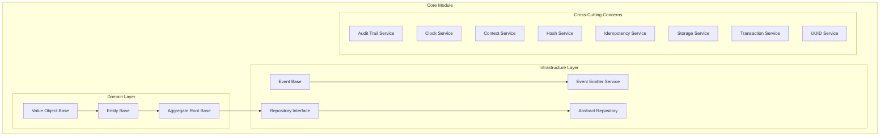
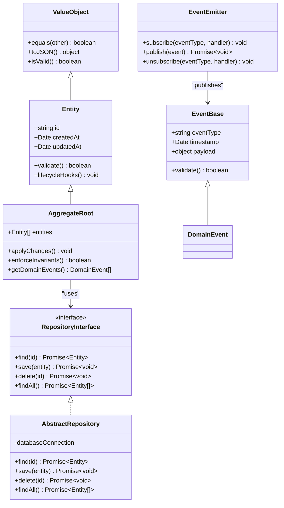
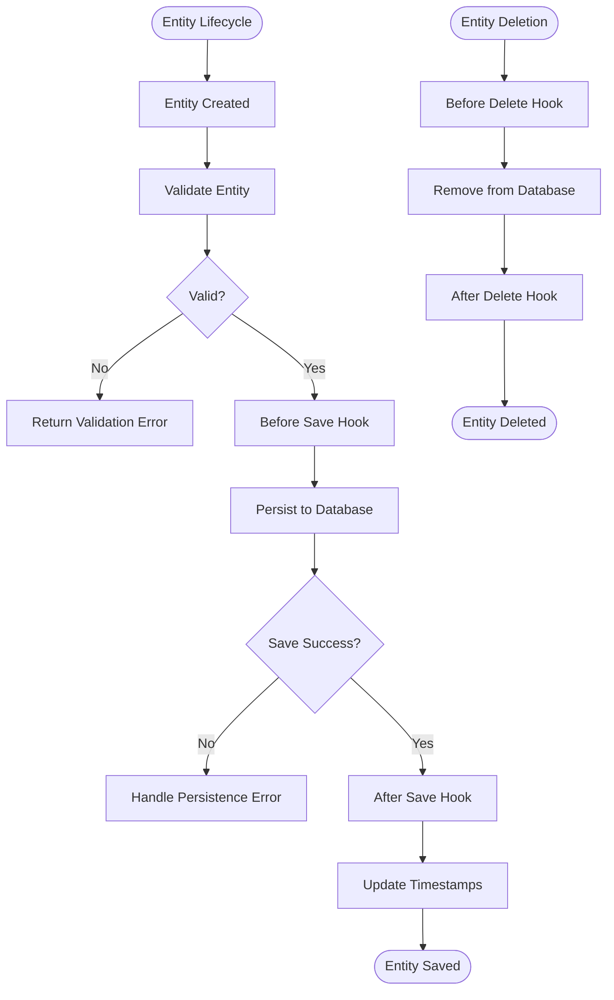
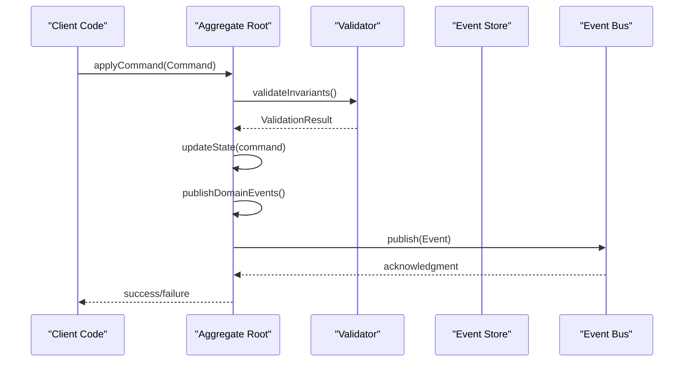
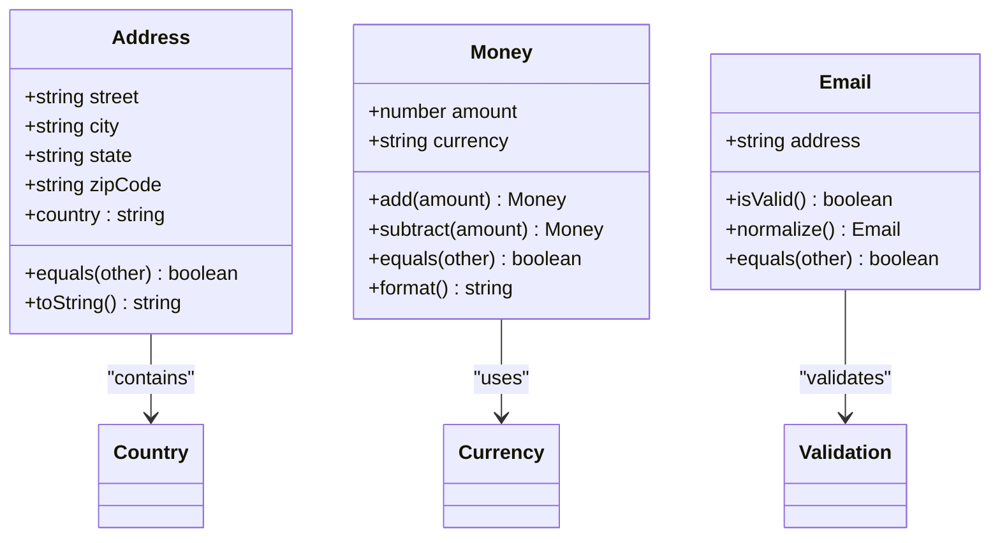
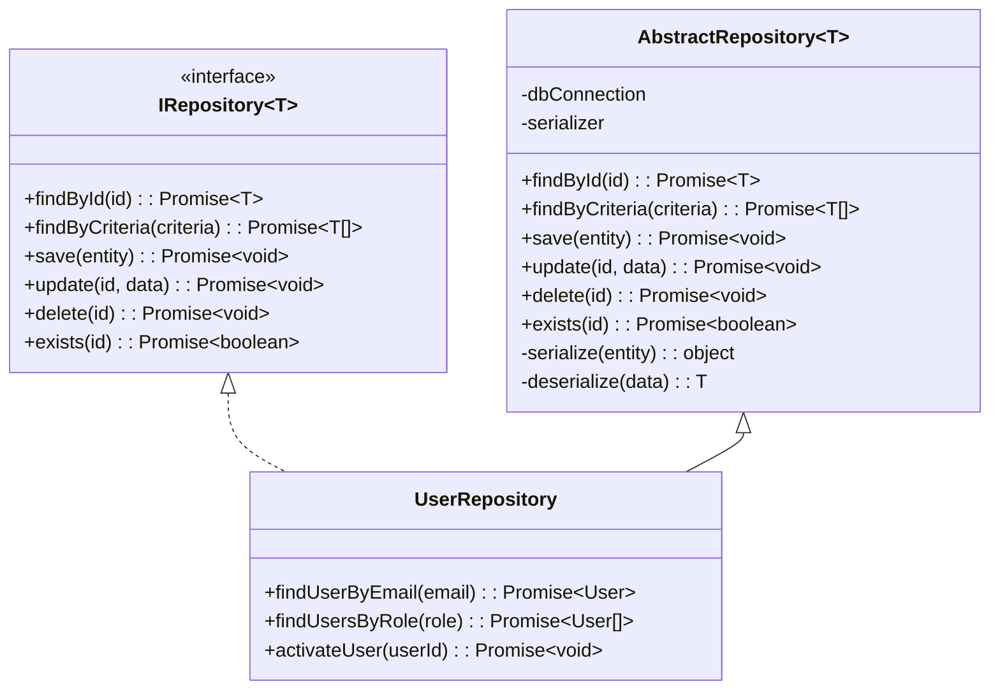
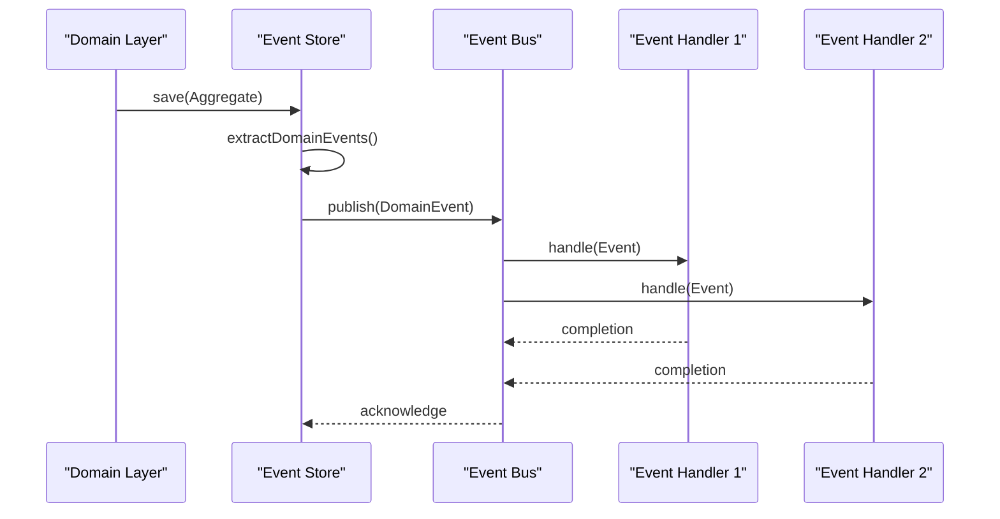
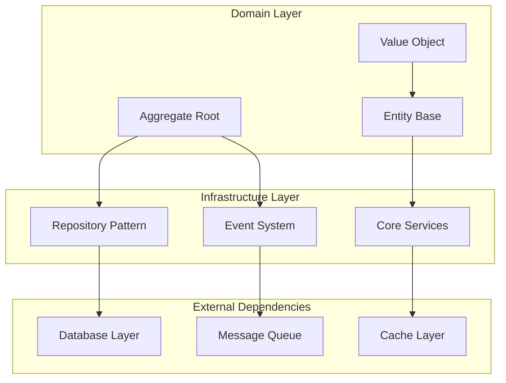

# Domain Models & Base Classes

<cite>
**Referenced Files in This Document**
- [core.module.ts](file://apps/backend/src/core/core.module.ts)
- [index.ts](file://apps/backend/src/core/index.ts)
- [domain/entity.base.ts](file://apps/backend/src/core/domain/entity.base.ts)
- [domain/aggregate-root.base.ts](file://apps/backend/src/core/domain/aggregate-root.base.ts)
- [domain/value-object.base.ts](file://apps/backend/src/core/domain/value-object.base.ts)
- [repository/repository.interface.ts](file://apps/backend/src/core/repository/repository.interface.ts)
- [repository/abstract-repository.base.ts](file://apps/backend/src/core/repository/abstract-repository.base.ts)
- [events/event.base.ts](file://apps/backend/src/core/events/event.base.ts)
- [events/event-emitter.service.ts](file://apps/backend/src/core/events/event-emitter.service.ts)
- [audit/audit-trail.service.ts](file://apps/backend/src/core/audit/audit-trail.service.ts)
- [clock/clock.service.ts](file://apps/backend/src/core/clock/clock.service.ts)
- [context/context.service.ts](file://apps/backend/src/core/context/context.service.ts)
- [hash/hash.service.ts](file://apps/backend/src/core/hash/hash.service.ts)
- [idempotency/idempotency.service.ts](file://apps/backend/src/core/idempotency/idempotency.service.ts)
- [storage/storage.service.ts](file://apps/backend/src/core/storage/storage.service.ts)
- [transaction/transaction.service.ts](file://apps/backend/src/core/transaction/transaction.service.ts)
- [uuid/uuid.service.ts](file://apps/backend/src/core/uuid/uuid.service.ts)
</cite>

## Table of Contents
1. [Introduction](#introduction)
2. [Project Structure](#project-structure)
3. [Core Components](#core-components)
4. [Architecture Overview](#architecture-overview)
5. [Detailed Component Analysis](#detailed-component-analysis)
6. [Dependency Analysis](#dependency-analysis)
7. [Performance Considerations](#performance-considerations)
8. [Troubleshooting Guide](#troubleshooting-guide)
9. [Conclusion](#conclusion)
10. [Appendices](#appendices)

## Introduction
This document provides comprehensive documentation for the domain models and base classes within the core module. It focuses on:
- The Entity base class with common properties, methods, and lifecycle hooks
- Aggregate Root pattern implementation to encapsulate business logic and maintain consistency
- Value Object pattern for immutable data structures
- Repository interface definition and abstract repository patterns
- Domain event base classes and their role in event-driven architecture
- Examples of extending base classes to create custom domain entities
- Inheritance hierarchies, method overriding best practices, and type safety considerations

The goal is to make these foundational concepts accessible to both technical and non-technical readers while providing deep insights into implementation details.

## Project Structure
The core module is organized around domain-driven design principles with clear separation between:
- Domain layer (entities, aggregates, value objects)
- Infrastructure layer (repositories, events, services)
- Cross-cutting concerns (audit, clock, context, hashing, idempotency, storage, transactions, UUIDs)

**Diagram sources**
- [entity.base.ts](file://apps/backend/src/core/domain/entity.base.ts)
- [aggregate-root.base.ts](file://apps/backend/src/core/domain/aggregate-root.base.ts)
- [value-object.base.ts](file://apps/backend/src/core/domain/value-object.base.ts)
- [repository.interface.ts](file://apps/backend/src/core/repository/repository.interface.ts)
- [abstract-repository.base.ts](file://apps/backend/src/core/repository/abstract-repository.base.ts)
- [event.base.ts](file://apps/backend/src/core/events/event.base.ts)
- [event-emitter.service.ts](file://apps/backend/src/core/events/event-emitter.service.ts)

**Section sources**
- [core.module.ts](file://apps/backend/src/core/core.module.ts)
- [index.ts](file://apps/backend/src/core/index.ts)

## Core Components
The core module establishes fundamental building blocks for domain-driven development:

### Entity Base Class
The Entity base class provides common functionality for all domain entities including:
- Unique identifier management
- Creation and modification timestamps
- Lifecycle hooks for entity state changes
- Validation and business rule enforcement

### Aggregate Root Pattern
The Aggregate Root serves as the entry point for accessing domain objects and ensures consistency across related entities. It encapsulates business logic and maintains aggregate invariants.

### Value Object Pattern
Value Objects represent immutable pieces of information that describe characteristics or attributes without identity. They promote immutability and functional programming principles.

### Repository Pattern
The Repository interface defines contracts for data persistence abstraction, while the abstract repository provides common CRUD operations and query capabilities.

### Domain Events
Domain events facilitate loose coupling between components through event-driven architecture, enabling asynchronous processing and system decoupling.

**Section sources**
- [entity.base.ts](file://apps/backend/src/core/domain/entity.base.ts)
- [aggregate-root.base.ts](file://apps/backend/src/core/domain/aggregate-root.base.ts)
- [value-object.base.ts](file://apps/backend/src/core/domain/value-object.base.ts)
- [repository.interface.ts](file://apps/backend/src/core/repository/repository.interface.ts)
- [abstract-repository.base.ts](file://apps/backend/src/core/repository/abstract-repository.base.ts)
- [event.base.ts](file://apps/backend/src/core/events/event.base.ts)

## Architecture Overview
The core module implements a layered architecture that separates concerns and promotes maintainability:

**Diagram sources**
- [entity.base.ts](file://apps/backend/src/core/domain/entity.base.ts)
- [aggregate-root.base.ts](file://apps/backend/src/core/domain/aggregate-root.base.ts)
- [value-object.base.ts](file://apps/backend/src/core/domain/value-object.base.ts)
- [repository.interface.ts](file://apps/backend/src/core/repository/repository.interface.ts)
- [abstract-repository.base.ts](file://apps/backend/src/core/repository/abstract-repository.base.ts)
- [event.base.ts](file://apps/backend/src/core/events/event.base.ts)
- [event-emitter.service.ts](file://apps/backend/src/core/events/event-emitter.service.ts)

## Detailed Component Analysis

### Entity Base Class Analysis
The Entity base class serves as the foundation for all domain entities, providing essential functionality:

#### Key Features:
- **Identity Management**: Automatic unique ID generation and validation
- **Lifecycle Hooks**: Pre-save, post-save, pre-delete, and post-delete hooks
- **Validation Framework**: Built-in validation rules and custom validators
- **Timestamp Tracking**: Automatic creation and modification time tracking
- **State Management**: Entity state tracking and change detection

#### Common Properties:
- `id`: Unique identifier for the entity
- `createdAt`: Timestamp when entity was created
- `updatedAt`: Timestamp when entity was last modified
- `status`: Current entity status (active, inactive, deleted)

#### Lifecycle Methods:
- `beforeSave()`: Called before entity is persisted
- `afterSave()`: Called after entity is successfully saved
- `beforeDelete()`: Called before entity deletion
- `afterDelete()`: Called after entity deletion

**Diagram sources**
- [entity.base.ts](file://apps/backend/src/core/domain/entity.base.ts)

**Section sources**
- [entity.base.ts](file://apps/backend/src/core/domain/entity.base.ts)

### Aggregate Root Pattern Implementation
The Aggregate Root pattern encapsulates business logic and maintains consistency across related entities:

#### Core Responsibilities:
- **Boundary Definition**: Defines the boundary of the aggregate
- **Business Logic Encapsulation**: Contains all business rules and logic
- **Consistency Maintenance**: Ensures aggregate invariants are maintained
- **Event Publication**: Publishes domain events for state changes

#### Key Methods:
- `applyCommand(command)`: Applies commands to modify aggregate state
- `validateInvariants()`: Validates aggregate consistency
- `publishEvents()`: Publishes domain events for state changes
- `replayEvents(events)`: Reconstructs aggregate state from events

**Diagram sources**
- [aggregate-root.base.ts](file://apps/backend/src/core/domain/aggregate-root.base.ts)

**Section sources**
- [aggregate-root.base.ts](file://apps/backend/src/core/domain/aggregate-root.base.ts)

### Value Object Pattern
Value Objects provide immutable data structures that represent domain concepts:

#### Characteristics:
- **Immutability**: Once created, cannot be modified
- **Equality by Value**: Two value objects are equal if their values are equal
- **No Identity**: No unique identifier, only value matters
- **Small and Focused**: Represent single domain concepts

#### Implementation Patterns:
- Constructor-based initialization
- Factory methods for complex creation logic
- Immutable property accessors
- Equality comparison methods

**Diagram sources**
- [value-object.base.ts](file://apps/backend/src/core/domain/value-object.base.ts)

**Section sources**
- [value-object.base.ts](file://apps/backend/src/core/domain/value-object.base.ts)

### Repository Interface and Abstract Repository
The Repository pattern provides abstraction over data persistence:

#### Repository Interface:
- **Data Access Abstraction**: Hides persistence implementation details
- **Query Capabilities**: Provides standardized query methods
- **CRUD Operations**: Standard Create, Read, Update, Delete operations
- **Transaction Support**: Ensures data consistency

#### Abstract Repository:
- **Common Implementation**: Shared functionality across repositories
- **Template Method Pattern**: Defines algorithm structure
- **Hook Points**: Extension points for custom behavior
- **Error Handling**: Consistent error handling strategies

**Diagram sources**
- [repository.interface.ts](file://apps/backend/src/core/repository/repository.interface.ts)
- [abstract-repository.base.ts](file://apps/backend/src/core/repository/abstract-repository.base.ts)

**Section sources**
- [repository.interface.ts](file://apps/backend/src/core/repository/repository.interface.ts)
- [abstract-repository.base.ts](file://apps/backend/src/core/repository/abstract-repository.base.ts)

### Domain Event System
The domain event system enables event-driven architecture within the application:

#### Event Base Class:
- **Event Metadata**: Type, timestamp, and correlation IDs
- **Payload Structure**: Typed payload for event data
- **Validation**: Built-in validation for event integrity
- **Serialization**: JSON serialization support

#### Event Emitter Service:
- **Event Publishing**: Asynchronous event publishing
- **Subscriber Management**: Dynamic subscriber registration
- **Error Handling**: Robust error handling and retry mechanisms
- **Monitoring**: Event processing metrics and logging

**Diagram sources**
- [event.base.ts](file://apps/backend/src/core/events/event.base.ts)
- [event-emitter.service.ts](file://apps/backend/src/core/events/event-emitter.service.ts)

**Section sources**
- [event.base.ts](file://apps/backend/src/core/events/event.base.ts)
- [event-emitter.service.ts](file://apps/backend/src/core/events/event-emitter.service.ts)

## Dependency Analysis
The core module has well-defined dependencies and relationships:

**Diagram sources**
- [core.module.ts](file://apps/backend/src/core/core.module.ts)
- [entity.base.ts](file://apps/backend/src/core/domain/entity.base.ts)
- [aggregate-root.base.ts](file://apps/backend/src/core/domain/aggregate-root.base.ts)
- [value-object.base.ts](file://apps/backend/src/core/domain/value-object.base.ts)
- [repository.interface.ts](file://apps/backend/src/core/repository/repository.interface.ts)
- [event.base.ts](file://apps/backend/src/core/events/event.base.ts)

**Section sources**
- [core.module.ts](file://apps/backend/src/core/core.module.ts)

## Performance Considerations
When implementing domain models and base classes, consider the following performance aspects:

### Memory Management
- Use lazy loading for large entity graphs
- Implement proper cleanup in lifecycle hooks
- Avoid circular references in entity relationships
- Use value objects for small, immutable data

### Query Optimization
- Design repository interfaces for efficient queries
- Implement pagination for large result sets
- Use appropriate indexing strategies
- Cache frequently accessed data

### Event Processing
- Batch process domain events when possible
- Implement async event handlers for long-running operations
- Use message queues for high-volume event processing
- Monitor event processing performance

### Transaction Boundaries
- Keep transactions short and focused
- Use optimistic concurrency control
- Implement proper error handling and rollback strategies
- Consider eventual consistency patterns

## Troubleshooting Guide
Common issues and solutions when working with domain models and base classes:

### Entity Lifecycle Issues
- **Problem**: Lifecycle hooks not executing
- **Solution**: Ensure proper inheritance and hook registration
- **Problem**: Validation errors during entity creation
- **Solution**: Check validation rules and input sanitization

### Aggregate Root Problems
- **Problem**: Business invariants violated
- **Solution**: Review aggregate boundary and invariant checks
- **Problem**: Event ordering issues
- **Solution**: Implement proper event sequencing and versioning

### Repository Pattern Issues
- **Problem**: Data inconsistency across entities
- **Solution**: Use aggregate root for data mutations
- **Problem**: Performance bottlenecks in queries
- **Solution**: Optimize queries and implement caching

### Event System Problems
- **Problem**: Events not being processed
- **Solution**: Check event bus configuration and subscriber registration
- **Problem**: Event duplication
- **Solution**: Implement idempotency and deduplication

**Section sources**
- [entity.base.ts](file://apps/backend/src/core/domain/entity.base.ts)
- [aggregate-root.base.ts](file://apps/backend/src/core/domain/aggregate-root.base.ts)
- [repository.interface.ts](file://apps/backend/src/core/repository/repository.interface.ts)
- [event.base.ts](file://apps/backend/src/core/events/event.base.ts)

## Conclusion
The core module provides a solid foundation for domain-driven development with well-designed base classes and patterns. The Entity, Aggregate Root, and Value Object patterns work together to create robust domain models that encapsulate business logic and maintain consistency. The Repository pattern abstracts data persistence, while the event system enables loose coupling and scalability.

Key benefits of this architecture include:
- **Maintainability**: Clear separation of concerns and well-defined boundaries
- **Testability**: Isolated components with clear interfaces
- **Scalability**: Event-driven architecture supports horizontal scaling
- **Flexibility**: Pluggable infrastructure components
- **Reliability**: Strong validation and consistency guarantees

When extending these base classes, follow established patterns and best practices to ensure consistency and maintainability across the application.

## Appendices

### Best Practices for Extending Base Classes

#### Creating Custom Entities
1. Extend the Entity base class
2. Implement required validation methods
3. Override lifecycle hooks as needed
4. Maintain type safety with TypeScript generics

#### Implementing Aggregate Roots
1. Define clear aggregate boundaries
2. Encapsulate all business logic within the aggregate
3. Publish domain events for state changes
4. Maintain aggregate invariants consistently

#### Designing Value Objects
1. Make them immutable
2. Implement proper equality comparison
3. Provide factory methods for complex creation
4. Keep them small and focused

#### Repository Implementation
1. Follow the interface contract strictly
2. Implement proper error handling
3. Add appropriate logging and monitoring
4. Consider caching strategies for performance

**Section sources**
- [entity.base.ts](file://apps/backend/src/core/domain/entity.base.ts)
- [aggregate-root.base.ts](file://apps/backend/src/core/domain/aggregate-root.base.ts)
- [value-object.base.ts](file://apps/backend/src/core/domain/value-object.base.ts)
- [repository.interface.ts](file://apps/backend/src/core/repository/repository.interface.ts)