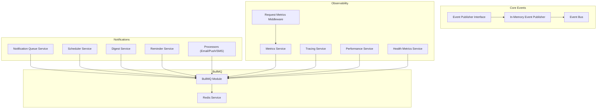
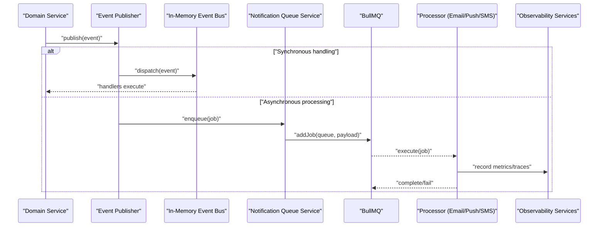
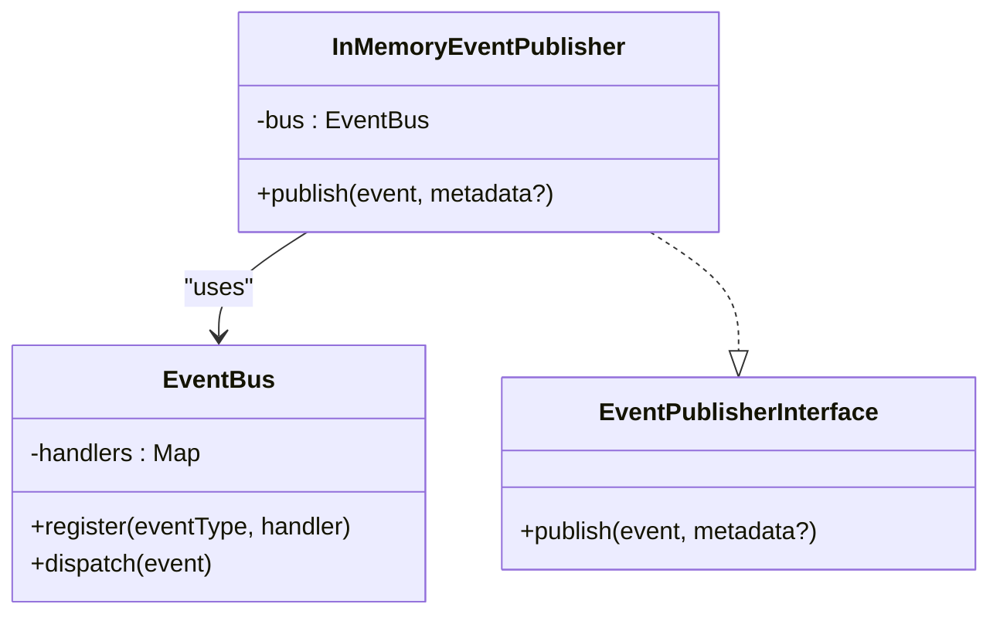
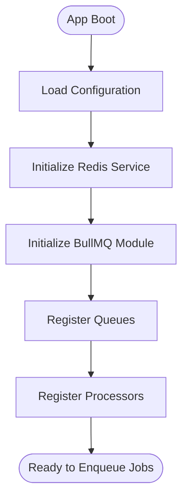
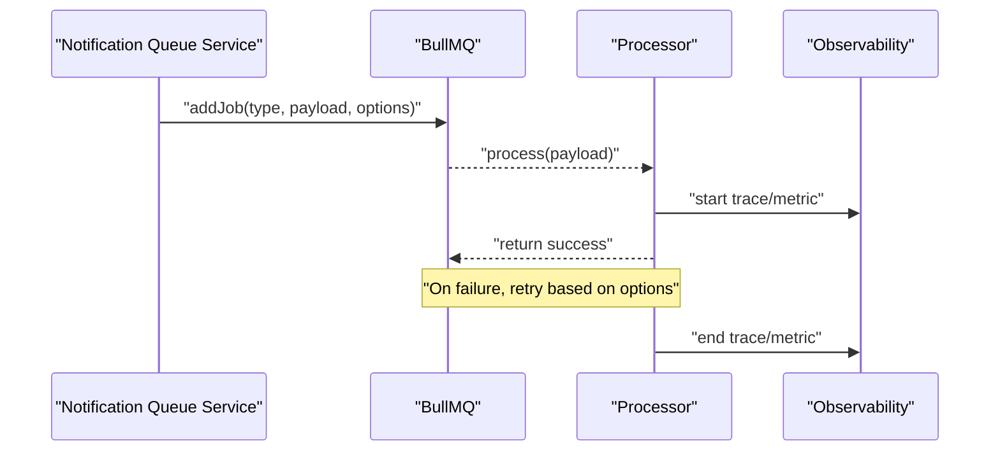
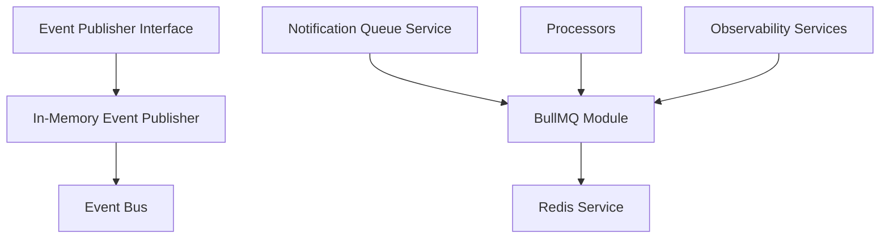

# Event System & Messaging

<cite>
**Referenced Files in This Document**
- [bullmq.module.ts](file://apps/backend/src/bullmq/bullmq.module.ts)
- [notification-queue.service.ts](file://apps/backend/src/notifications/notification-queue.service.ts)
- [scheduler.service.ts](file://apps/backend/src/notifications/scheduler.service.ts)
- [digest.service.ts](file://apps/backend/src/notifications/digest.service.ts)
- [reminder.service.ts](file://apps/backend/src/notifications/reminder.service.ts)
- [processors/index.ts](file://apps/backend/src/notifications/processors/index.ts)
- [email.processor.ts](file://apps/backend/src/notifications/processors/email.processor.ts)
- [push.processor.ts](file://apps/backend/src/notifications/processors/push.processor.ts)
- [sms.processor.ts](file://apps/backend/src/notifications/processors/sms.processor.ts)
- [analytics-aggregation.service.ts](file://apps/backend/src/analytics/analytics-aggregation.service.ts)
- [collection-event.service.ts](file://apps/backend/src/collections/collection-event.service.ts)
- [interaction-event.service.ts](file://apps/backend/src/interaction/interaction-event.service.ts)
- [journal-event.service.ts](file://apps/backend/src/journal/journal-event.service.ts)
- [progress-event.service.ts](file://apps/backend/src/progress/progress-event.service.ts)
- [events/index.ts](file://apps/backend/src/core/events/index.ts)
- [events/event-publisher.interface.ts](file://apps/backend/src/core/events/event-publisher.interface.ts)
- [events/in-memory-event-publisher.ts](file://apps/backend/src/core/events/in-memory-event-publisher.ts)
- [events/event-bus.ts](file://apps/backend/src/core/events/event-bus.ts)
- [metrics.service.ts](file://apps/backend/src/observability/metrics.service.ts)
- [tracing.service.ts](file://apps/backend/src/observability/tracing.service.ts)
- [performance.service.ts](file://apps/backend/src/observability/performance.service.ts)
- [health-metrics.service.ts](file://apps/backend/src/observability/health-metrics.service.ts)
- [request-metrics.middleware.ts](file://apps/backend/src/observability/request-metrics.middleware.ts)
- [configuration.ts](file://apps/backend/src/config/configuration.ts)
- [env.validation.ts](file://apps/backend/src/config/env.validation.ts)
- [redis.service.ts](file://apps/backend/src/redis/redis.service.ts)
- [app.bootstrap.ts](file://apps/backend/src/app.bootstrap.ts)
</cite>

## Table of Contents
1. [Introduction](#introduction)
2. [Project Structure](#project-structure)
3. [Core Components](#core-components)
4. [Architecture Overview](#architecture-overview)
5. [Detailed Component Analysis](#detailed-component-analysis)
6. [Dependency Analysis](#dependency-analysis)
7. [Performance Considerations](#performance-considerations)
8. [Troubleshooting Guide](#troubleshooting-guide)
9. [Conclusion](#conclusion)
10. [Appendices](#appendices)

## Introduction
This document explains the event-driven architecture and messaging system used by the backend application. It covers:
- The event publisher abstraction and its in-memory implementation
- BullMQ integration for background job processing and task queuing
- Processor pattern for handling asynchronous tasks, including retry mechanisms and error handling
- Examples of defining custom events, creating handlers, and implementing message consumers
- Event serialization, versioning strategies, and backward compatibility
- Monitoring and debugging of queued jobs, dead letter queues (DLQ), and performance metrics collection

The goal is to provide both a high-level understanding and practical guidance for developers working with the event system and background jobs.

## Project Structure
The event-driven features are primarily located under:
- Core events: apps/backend/src/core/events
- Notifications and processors: apps/backend/src/notifications
- BullMQ module: apps/backend/src/bullmq
- Observability and metrics: apps/backend/src/observability
- Configuration and Redis: apps/backend/src/config and apps/backend/src/redis

**Diagram sources**
- [event-publisher.interface.ts](file://apps/backend/src/core/events/event-publisher.interface.ts)
- [in-memory-event-publisher.ts](file://apps/backend/src/core/events/in-memory-event-publisher.ts)
- [event-bus.ts](file://apps/backend/src/core/events/event-bus.ts)
- [notification-queue.service.ts](file://apps/backend/src/notifications/notification-queue.service.ts)
- [scheduler.service.ts](file://apps/backend/src/notifications/scheduler.service.ts)
- [digest.service.ts](file://apps/backend/src/notifications/digest.service.ts)
- [reminder.service.ts](file://apps/backend/src/notifications/reminder.service.ts)
- [email.processor.ts](file://apps/backend/src/notifications/processors/email.processor.ts)
- [push.processor.ts](file://apps/backend/src/notifications/processors/push.processor.ts)
- [sms.processor.ts](file://apps/backend/src/notifications/processors/sms.processor.ts)
- [bullmq.module.ts](file://apps/backend/src/bullmq/bullmq.module.ts)
- [redis.service.ts](file://apps/backend/src/redis/redis.service.ts)
- [metrics.service.ts](file://apps/backend/src/observability/metrics.service.ts)
- [tracing.service.ts](file://apps/backend/src/observability/tracing.service.ts)
- [performance.service.ts](file://apps/backend/src/observability/performance.service.ts)
- [health-metrics.service.ts](file://apps/backend/src/observability/health-metrics.service.ts)
- [request-metrics.middleware.ts](file://apps/backend/src/observability/request-metrics.middleware.ts)

**Section sources**
- [bullmq.module.ts](file://apps/backend/src/bullmq/bullmq.module.ts)
- [notification-queue.service.ts](file://apps/backend/src/notifications/notification-queue.service.ts)
- [scheduler.service.ts](file://apps/backend/src/notifications/scheduler.service.ts)
- [digest.service.ts](file://apps/backend/src/notifications/digest.service.ts)
- [reminder.service.ts](file://apps/backend/src/notifications/reminder.service.ts)
- [email.processor.ts](file://apps/backend/src/notifications/processors/email.processor.ts)
- [push.processor.ts](file://apps/backend/src/notifications/processors/push.processor.ts)
- [sms.processor.ts](file://apps/backend/src/notifications/processors/sms.processor.ts)
- [event-publisher.interface.ts](file://apps/backend/src/core/events/event-publisher.interface.ts)
- [in-memory-event-publisher.ts](file://apps/backend/src/core/events/in-memory-event-publisher.ts)
- [event-bus.ts](file://apps/backend/src/core/events/event-bus.ts)
- [metrics.service.ts](file://apps/backend/src/observability/metrics.service.ts)
- [tracing.service.ts](file://apps/backend/src/observability/tracing.service.ts)
- [performance.service.ts](file://apps/backend/src/observability/performance.service.ts)
- [health-metrics.service.ts](file://apps/backend/src/observability/health-metrics.service.ts)
- [request-metrics.middleware.ts](file://apps/backend/src/observability/request-metrics.middleware.ts)
- [configuration.ts](file://apps/backend/src/config/configuration.ts)
- [env.validation.ts](file://apps/backend/src/config/env.validation.ts)
- [redis.service.ts](file://apps/backend/src/redis/redis.service.ts)
- [app.bootstrap.ts](file://apps/backend/src/app.bootstrap.ts)

## Core Components
- Event Publisher Abstraction: Defines a consistent interface for publishing domain events across the application.
- In-Memory Event Publisher: Provides an in-process event bus suitable for synchronous or local async handling during development or simple scenarios.
- BullMQ Integration: Configures Redis-backed job queues for reliable background processing.
- Notification Queue Service: Orchestrates enqueuing notifications via BullMQ.
- Processors: Implement handlers for specific job types (e.g., email, push, SMS).
- Observability: Metrics, tracing, and performance services to monitor queue health and job execution.

Key responsibilities:
- Decouple producers from consumers using events and queues
- Ensure reliability through retries and DLQs
- Provide observability into job lifecycle and system health

**Section sources**
- [event-publisher.interface.ts](file://apps/backend/src/core/events/event-publisher.interface.ts)
- [in-memory-event-publisher.ts](file://apps/backend/src/core/events/in-memory-event-publisher.ts)
- [event-bus.ts](file://apps/backend/src/core/events/event-bus.ts)
- [bullmq.module.ts](file://apps/backend/src/bullmq/bullmq.module.ts)
- [notification-queue.service.ts](file://apps/backend/src/notifications/notification-queue.service.ts)
- [email.processor.ts](file://apps/backend/src/notifications/processors/email.processor.ts)
- [push.processor.ts](file://apps/backend/src/notifications/processors/push.processor.ts)
- [sms.processor.ts](file://apps/backend/src/notifications/processors/sms.processor.ts)
- [metrics.service.ts](file://apps/backend/src/observability/metrics.service.ts)
- [tracing.service.ts](file://apps/backend/src/observability/tracing.service.ts)
- [performance.service.ts](file://apps/backend/src/observability/performance.service.ts)
- [health-metrics.service.ts](file://apps/backend/src/observability/health-metrics.service.ts)

## Architecture Overview
The system combines an in-memory event bus for lightweight eventing and BullMQ for robust background job processing. Domain services publish events; these may be handled synchronously via the in-memory bus or asynchronously via queues. Observability hooks record metrics and traces around job creation, execution, and failures.

**Diagram sources**
- [event-publisher.interface.ts](file://apps/backend/src/core/events/event-publisher.interface.ts)
- [in-memory-event-publisher.ts](file://apps/backend/src/core/events/in-memory-event-publisher.ts)
- [event-bus.ts](file://apps/backend/src/core/events/event-bus.ts)
- [notification-queue.service.ts](file://apps/backend/src/notifications/notification-queue.service.ts)
- [bullmq.module.ts](file://apps/backend/src/bullmq/bullmq.module.ts)
- [email.processor.ts](file://apps/backend/src/notifications/processors/email.processor.ts)
- [push.processor.ts](file://apps/backend/src/notifications/processors/push.processor.ts)
- [sms.processor.ts](file://apps/backend/src/notifications/processors/sms.processor.ts)
- [metrics.service.ts](file://apps/backend/src/observability/metrics.service.ts)
- [tracing.service.ts](file://apps/backend/src/observability/tracing.service.ts)
- [performance.service.ts](file://apps/backend/src/observability/performance.service.ts)

## Detailed Component Analysis

### Event Publisher Abstraction and In-Memory Implementation
- Event Publisher Interface:
  - Defines methods to publish typed events and optionally attach metadata.
  - Ensures consistency across implementations (in-memory vs. external bus).
- In-Memory Event Publisher:
  - Uses an internal event bus to route events to registered handlers.
  - Suitable for unit tests, development, and scenarios where cross-process delivery is not required.
- Event Bus:
  - Manages handler registration and dispatch.
  - Supports synchronous invocation of handlers.

**Diagram sources**
- [event-publisher.interface.ts](file://apps/backend/src/core/events/event-publisher.interface.ts)
- [in-memory-event-publisher.ts](file://apps/backend/src/core/events/in-memory-event-publisher.ts)
- [event-bus.ts](file://apps/backend/src/core/events/event-bus.ts)

**Section sources**
- [event-publisher.interface.ts](file://apps/backend/src/core/events/event-publisher.interface.ts)
- [in-memory-event-publisher.ts](file://apps/backend/src/core/events/in-memory-event-publisher.ts)
- [event-bus.ts](file://apps/backend/src/core/events/event-bus.ts)

### BullMQ Integration for Background Job Processing
- BullMQ Module:
  - Configures connections to Redis and registers queues and processors.
  - Exposes services to enqueue jobs and manage queue settings.
- Redis Service:
  - Provides connection management and shared configuration for Redis-backed queues.
- Configuration:
  - Environment variables control Redis connectivity, concurrency, and retry policies.

**Diagram sources**
- [bullmq.module.ts](file://apps/backend/src/bullmq/bullmq.module.ts)
- [redis.service.ts](file://apps/backend/src/redis/redis.service.ts)
- [configuration.ts](file://apps/backend/src/config/configuration.ts)
- [env.validation.ts](file://apps/backend/src/config/env.validation.ts)
- [app.bootstrap.ts](file://apps/backend/src/app.bootstrap.ts)

**Section sources**
- [bullmq.module.ts](file://apps/backend/src/bullmq/bullmq.module.ts)
- [redis.service.ts](file://apps/backend/src/redis/redis.service.ts)
- [configuration.ts](file://apps/backend/src/config/configuration.ts)
- [env.validation.ts](file://apps/backend/src/config/env.validation.ts)
- [app.bootstrap.ts](file://apps/backend/src/app.bootstrap.ts)

### Processor Pattern for Async Tasks
- Notification Queue Service:
  - Encapsulates logic to create and enqueue jobs with payloads and options (priority, delay, retries).
- Processors:
  - Implement handlers for specific job types (e.g., email, push, sms).
  - Should handle idempotency, retries, and errors gracefully.
- Retry Mechanisms:
  - Configure per-job retry attempts and backoff strategies.
  - Use DLQ to capture persistently failing jobs for inspection.

**Diagram sources**
- [notification-queue.service.ts](file://apps/backend/src/notifications/notification-queue.service.ts)
- [email.processor.ts](file://apps/backend/src/notifications/processors/email.processor.ts)
- [push.processor.ts](file://apps/backend/src/notifications/processors/push.processor.ts)
- [sms.processor.ts](file://apps/backend/src/notifications/processors/sms.processor.ts)
- [metrics.service.ts](file://apps/backend/src/observability/metrics.service.ts)
- [tracing.service.ts](file://apps/backend/src/observability/tracing.service.ts)
- [performance.service.ts](file://apps/backend/src/observability/performance.service.ts)

**Section sources**
- [notification-queue.service.ts](file://apps/backend/src/notifications/notification-queue.service.ts)
- [email.processor.ts](file://apps/backend/src/notifications/processors/email.processor.ts)
- [push.processor.ts](file://apps/backend/src/notifications/processors/push.processor.ts)
- [sms.processor.ts](file://apps/backend/src/notifications/processors/sms.processor.ts)
- [metrics.service.ts](file://apps/backend/src/observability/metrics.service.ts)
- [tracing.service.ts](file://apps/backend/src/observability/tracing.service.ts)
- [performance.service.ts](file://apps/backend/src/observability/performance.service.ts)

### Custom Events, Handlers, and Message Consumers
- Defining Custom Events:
  - Create strongly-typed event payloads and metadata structures.
  - Publish via the event publisher abstraction.
- Creating Event Handlers:
  - Register handlers with the in-memory event bus for synchronous processing.
  - For asynchronous processing, implement processors that consume jobs from queues.
- Implementing Message Consumers:
  - Use processors to handle job payloads, ensuring idempotency and error handling.
  - Integrate with observability services to track performance and failures.

Examples of event-producing services:
- Collection events: apps/backend/src/collections/collection-event.service.ts
- Interaction events: apps/backend/src/interaction/interaction-event.service.ts
- Journal events: apps/backend/src/journal/journal-event.service.ts
- Progress events: apps/backend/src/progress/progress-event.service.ts
- Analytics aggregation: apps/backend/src/analytics/analytics-aggregation.service.ts

**Section sources**
- [collection-event.service.ts](file://apps/backend/src/collections/collection-event.service.ts)
- [interaction-event.service.ts](file://apps/backend/src/interaction/interaction-event.service.ts)
- [journal-event.service.ts](file://apps/backend/src/journal/journal-event.service.ts)
- [progress-event.service.ts](file://apps/backend/src/progress/progress-event.service.ts)
- [analytics-aggregation.service.ts](file://apps/backend/src/analytics/analytics-aggregation.service.ts)
- [event-publisher.interface.ts](file://apps/backend/src/core/events/event-publisher.interface.ts)
- [in-memory-event-publisher.ts](file://apps/backend/src/core/events/in-memory-event-publisher.ts)
- [event-bus.ts](file://apps/backend/src/core/events/event-bus.ts)

### Event Serialization, Versioning, and Backward Compatibility
- Serialization:
  - Use stable JSON schemas for event payloads and job data.
  - Avoid circular references and ensure deterministic ordering when necessary.
- Versioning Strategies:
  - Include a version field in event payloads to support evolution.
  - Maintain backward-compatible changes (additive fields preferred).
- Backward Compatibility:
  - Validate incoming payloads against schema versions.
  - Gracefully handle unknown fields and deprecated versions.

Best practices:
- Define explicit DTOs for events and jobs.
- Centralize validation and transformation logic.
- Document breaking changes and migration paths.

[No sources needed since this section provides general guidance]

### Monitoring and Debugging Queued Jobs, Dead Letter Queues, and Metrics
- Metrics Service:
  - Records counters, histograms, and gauges for job throughput, latency, and errors.
- Tracing Service:
  - Correlates requests and job executions with distributed traces.
- Performance Service:
  - Tracks slow operations and resource usage.
- Health Metrics Service:
  - Exposes health endpoints reflecting queue and Redis status.
- Request Metrics Middleware:
  - Captures HTTP request metrics and integrates with observability.

Operational tips:
- Monitor queue lengths, processing rates, and failure rates.
- Inspect DLQ entries to diagnose persistent failures.
- Use correlation IDs to trace events across services.

**Section sources**
- [metrics.service.ts](file://apps/backend/src/observability/metrics.service.ts)
- [tracing.service.ts](file://apps/backend/src/observability/tracing.service.ts)
- [performance.service.ts](file://apps/backend/src/observability/performance.service.ts)
- [health-metrics.service.ts](file://apps/backend/src/observability/health-metrics.service.ts)
- [request-metrics.middleware.ts](file://apps/backend/src/observability/request-metrics.middleware.ts)

## Dependency Analysis
The event system depends on core abstractions, BullMQ for persistence, and observability services for monitoring.

**Diagram sources**
- [event-publisher.interface.ts](file://apps/backend/src/core/events/event-publisher.interface.ts)
- [in-memory-event-publisher.ts](file://apps/backend/src/core/events/in-memory-event-publisher.ts)
- [event-bus.ts](file://apps/backend/src/core/events/event-bus.ts)
- [notification-queue.service.ts](file://apps/backend/src/notifications/notification-queue.service.ts)
- [bullmq.module.ts](file://apps/backend/src/bullmq/bullmq.module.ts)
- [redis.service.ts](file://apps/backend/src/redis/redis.service.ts)
- [email.processor.ts](file://apps/backend/src/notifications/processors/email.processor.ts)
- [push.processor.ts](file://apps/backend/src/notifications/processors/push.processor.ts)
- [sms.processor.ts](file://apps/backend/src/notifications/processors/sms.processor.ts)
- [metrics.service.ts](file://apps/backend/src/observability/metrics.service.ts)
- [tracing.service.ts](file://apps/backend/src/observability/tracing.service.ts)
- [performance.service.ts](file://apps/backend/src/observability/performance.service.ts)

**Section sources**
- [event-publisher.interface.ts](file://apps/backend/src/core/events/event-publisher.interface.ts)
- [in-memory-event-publisher.ts](file://apps/backend/src/core/events/in-memory-event-publisher.ts)
- [event-bus.ts](file://apps/backend/src/core/events/event-bus.ts)
- [notification-queue.service.ts](file://apps/backend/src/notifications/notification-queue.service.ts)
- [bullmq.module.ts](file://apps/backend/src/bullmq/bullmq.module.ts)
- [redis.service.ts](file://apps/backend/src/redis/redis.service.ts)
- [email.processor.ts](file://apps/backend/src/notifications/processors/email.processor.ts)
- [push.processor.ts](file://apps/backend/src/notifications/processors/push.processor.ts)
- [sms.processor.ts](file://apps/backend/src/notifications/processors/sms.processor.ts)
- [metrics.service.ts](file://apps/backend/src/observability/metrics.service.ts)
- [tracing.service.ts](file://apps/backend/src/observability/tracing.service.ts)
- [performance.service.ts](file://apps/backend/src/observability/performance.service.ts)

## Performance Considerations
- Concurrency:
  - Tune worker concurrency per queue to match CPU and I/O characteristics.
- Retries and Backoff:
  - Use exponential backoff to reduce load during transient failures.
- Payload Size:
  - Keep job payloads small to minimize memory and network overhead.
- Idempotency:
  - Ensure processors can safely re-run without side effects.
- Observability:
  - Track latency percentiles and error rates to identify bottlenecks.

[No sources needed since this section provides general guidance]

## Troubleshooting Guide
Common issues and resolutions:
- Jobs not executing:
  - Verify Redis connectivity and BullMQ initialization.
  - Check queue names and processor registrations.
- Frequent retries:
  - Inspect processor logs and error messages.
  - Adjust retry policies and backoff strategies.
- DLQ growth:
  - Analyze failed jobs for patterns (malformed payloads, downstream failures).
  - Fix root causes and reprocess if safe.
- High latency:
  - Monitor queue length and worker utilization.
  - Scale workers or optimize processor logic.

Use observability tools:
- Metrics service for counters and histograms
- Tracing service for end-to-end traces
- Health metrics service for queue and Redis health checks

**Section sources**
- [metrics.service.ts](file://apps/backend/src/observability/metrics.service.ts)
- [tracing.service.ts](file://apps/backend/src/observability/tracing.service.ts)
- [performance.service.ts](file://apps/backend/src/observability/performance.service.ts)
- [health-metrics.service.ts](file://apps/backend/src/observability/health-metrics.service.ts)
- [request-metrics.middleware.ts](file://apps/backend/src/observability/request-metrics.middleware.ts)

## Conclusion
The event-driven architecture combines a flexible in-memory event bus with robust BullMQ-based job queues to decouple producers and consumers, ensure reliability, and scale horizontally. By following best practices for event design, serialization, versioning, and observability, teams can build resilient systems that are easy to evolve and maintain.

[No sources needed since this section summarizes without analyzing specific files]

## Appendices

### Example Workflows

#### Defining Custom Events
- Create event payload and metadata types.
- Publish via the event publisher abstraction.
- Register handlers for synchronous processing or enqueue jobs for asynchronous processing.

#### Creating Event Handlers
- For synchronous handling, register handlers with the in-memory event bus.
- For asynchronous handling, implement processors that consume jobs from queues.

#### Implementing Message Consumers
- Use processors to handle job payloads.
- Ensure idempotency and robust error handling.
- Integrate with observability services to track performance and failures.

[No sources needed since this section provides general guidance]