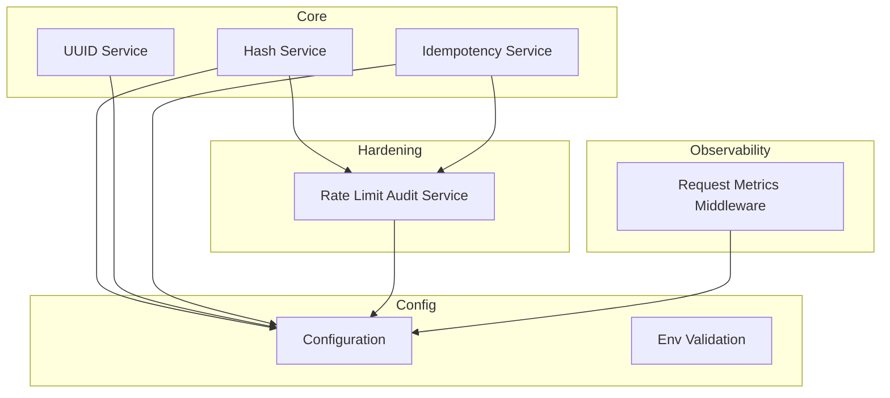
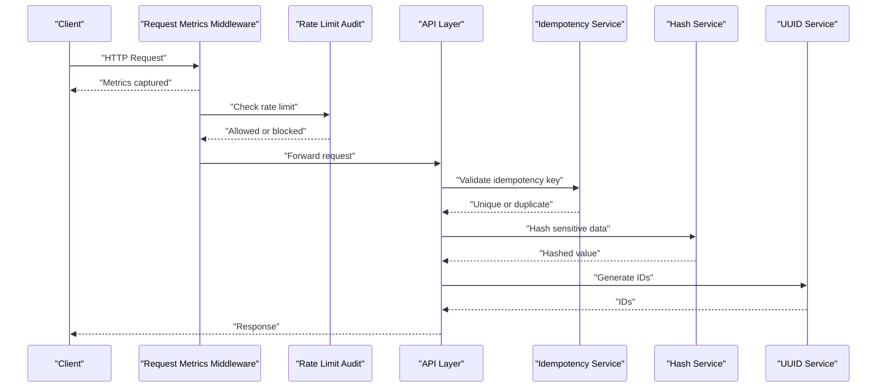
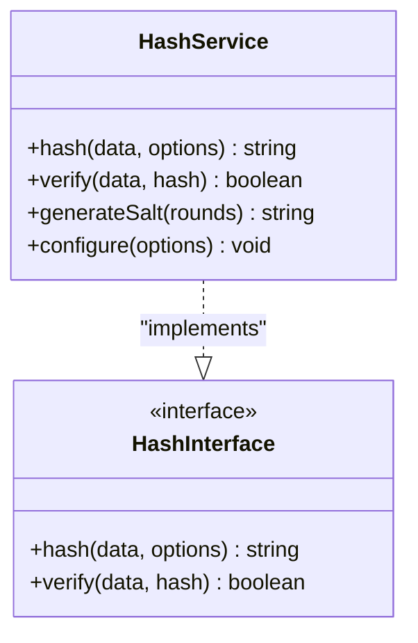
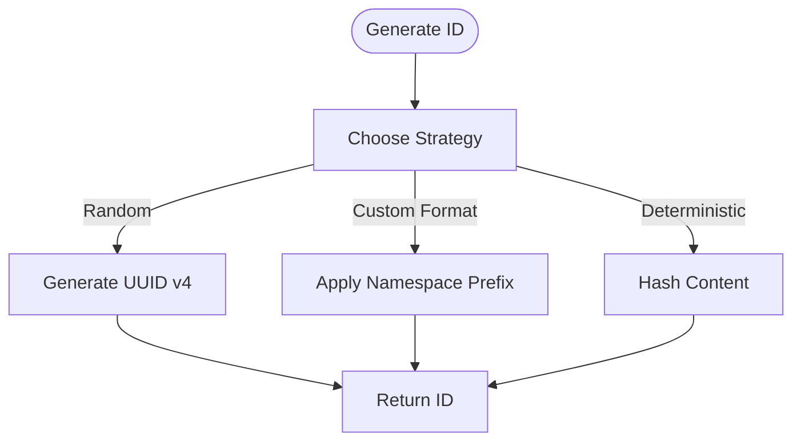
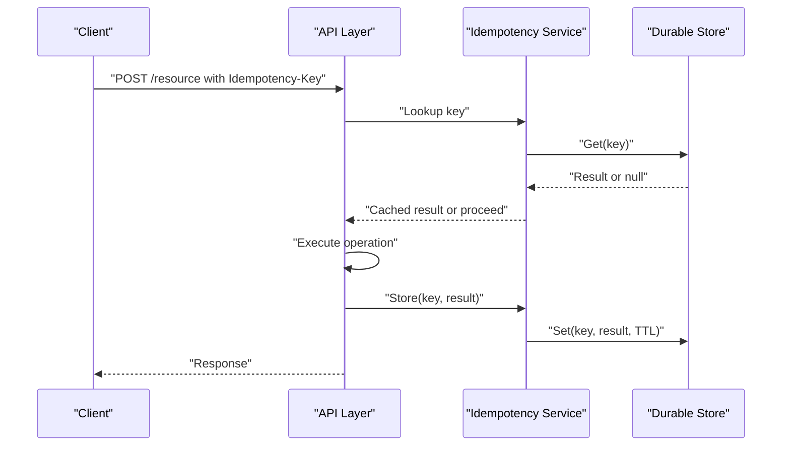
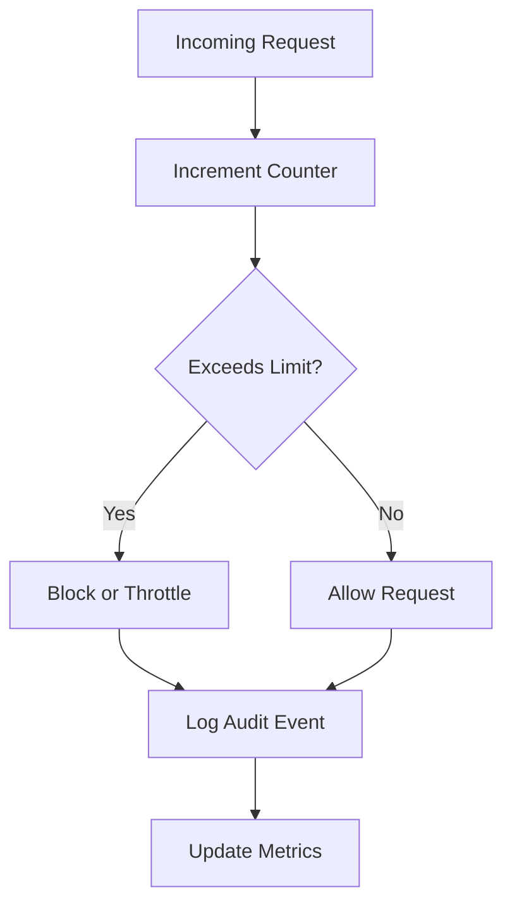
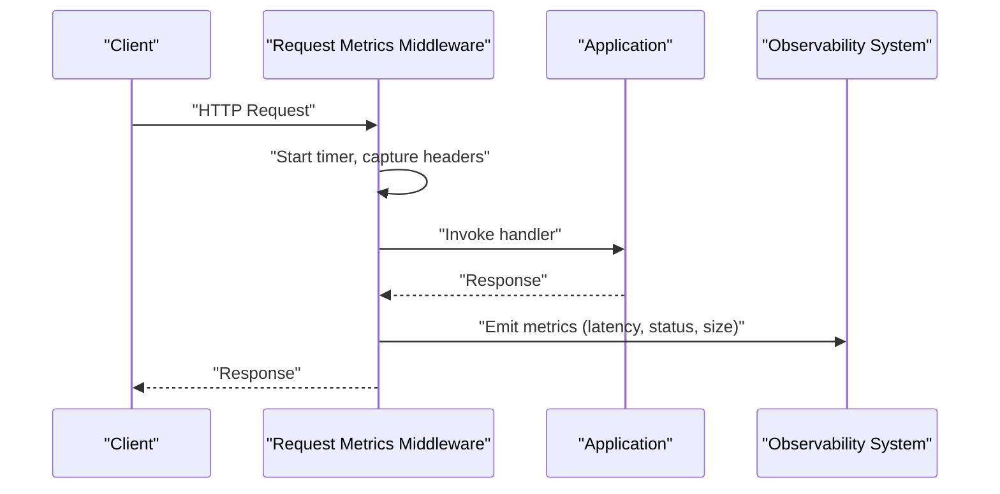
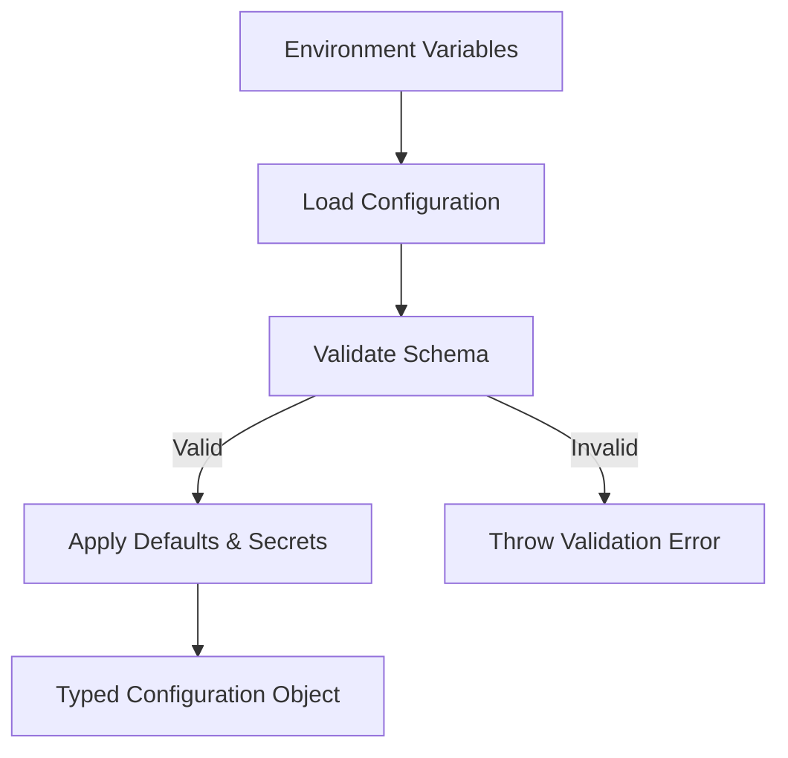
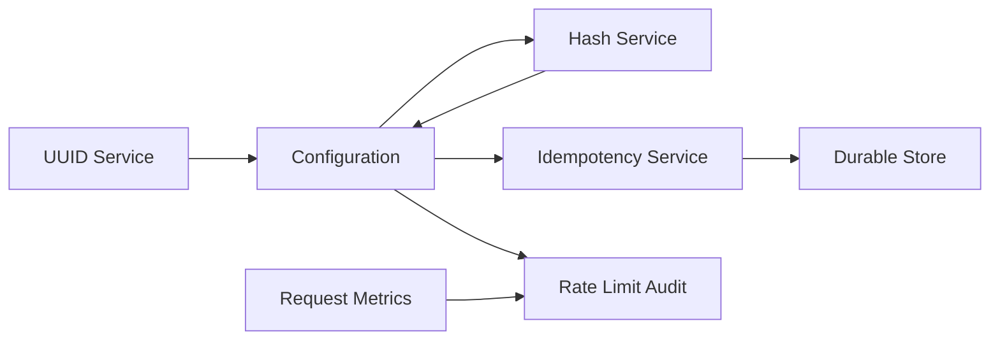

# Security Helpers & Utilities

<cite>
**Referenced Files in This Document**
- [core.module.ts](file://apps/backend/src/core/core.module.ts)
- [hash.service.ts](file://apps/backend/src/core/hash/hash.service.ts)
- [hash.interface.ts](file://apps/backend/src/core/hash/hash.interface.ts)
- [uuid.service.ts](file://apps/backend/src/core/uuid/uuid.service.ts)
- [idempotency.service.ts](file://apps/backend/src/core/idempotency/idempotency.service.ts)
- [rate-limit-audit.service.ts](file://apps/backend/src/hardening/rate-limit-audit.service.ts)
- [configuration.ts](file://apps/backend/src/config/configuration.ts)
- [env.validation.ts](file://apps/backend/src/config/env.validation.ts)
- [request-metrics.middleware.ts](file://apps/backend/src/observability/request-metrics.middleware.ts)
- [SECURITY.md](file://docs/SECURITY.md)
</cite>

## Table of Contents
1. [Introduction](#introduction)
2. [Project Structure](#project-structure)
3. [Core Components](#core-components)
4. [Architecture Overview](#architecture-overview)
5. [Detailed Component Analysis](#detailed-component-analysis)
6. [Dependency Analysis](#dependency-analysis)
7. [Performance Considerations](#performance-considerations)
8. [Troubleshooting Guide](#troubleshooting-guide)
9. [Conclusion](#conclusion)
10. [Appendices](#appendices)

## Introduction
This document provides comprehensive documentation for security-related utilities and helpers implemented in the backend application. It focuses on:
- Hashing service for password encryption and data integrity verification
- UUID generation strategies and custom ID formats
- Idempotency implementation to prevent duplicate operations and ensure request consistency
- Rate limiting, request throttling, and abuse prevention mechanisms
- Examples for implementing custom hash algorithms, generating secure tokens, and validating input data
- Security best practices, input sanitization, and output encoding

The goal is to make these components accessible to both developers and operators while ensuring robust security posture across the system.

## Project Structure
Security-related functionality is primarily organized under the core module and supporting hardening and observability layers:
- Core hashing utilities and interfaces
- UUID generation services
- Idempotency enforcement
- Hardening and rate-limit auditing
- Observability middleware for request metrics
- Configuration and environment validation

**Diagram sources**
- [core.module.ts](file://apps/backend/src/core/core.module.ts)
- [hash.service.ts](file://apps/backend/src/core/hash/hash.service.ts)
- [uuid.service.ts](file://apps/backend/src/core/uuid/uuid.service.ts)
- [idempotency.service.ts](file://apps/backend/src/core/idempotency/idempotency.service.ts)
- [rate-limit-audit.service.ts](file://apps/backend/src/hardening/rate-limit-audit.service.ts)
- [request-metrics.middleware.ts](file://apps/backend/src/observability/request-metrics.middleware.ts)
- [configuration.ts](file://apps/backend/src/config/configuration.ts)
- [env.validation.ts](file://apps/backend/src/config/env.validation.ts)

**Section sources**
- [core.module.ts](file://apps/backend/src/core/core.module.ts)
- [configuration.ts](file://apps/backend/src/config/configuration.ts)
- [env.validation.ts](file://apps/backend/src/config/env.validation.ts)

## Core Components
Key security utilities include:
- Hashing service: Provides password hashing and data integrity verification with configurable algorithms and salt rounds
- UUID service: Generates unique identifiers using standard and custom formats
- Idempotency service: Ensures idempotent execution of critical operations by tracking request signatures
- Rate limit audit service: Monitors and audits rate limiting behavior to detect abuse patterns
- Request metrics middleware: Captures request-level metrics for observability and performance tuning

These components are wired via dependency injection and configuration-driven settings.

**Section sources**
- [hash.service.ts](file://apps/backend/src/core/hash/hash.service.ts)
- [hash.interface.ts](file://apps/backend/src/core/hash/hash.interface.ts)
- [uuid.service.ts](file://apps/backend/src/core/uuid/uuid.service.ts)
- [idempotency.service.ts](file://apps/backend/src/core/idempotency/idempotency.service.ts)
- [rate-limit-audit.service.ts](file://apps/backend/src/hardening/rate-limit-audit.service.ts)
- [request-metrics.middleware.ts](file://apps/backend/src/observability/request-metrics.middleware.ts)

## Architecture Overview
The security architecture integrates hashing, identification, idempotency, rate limiting, and observability into a cohesive pipeline:
- Requests enter through middleware that captures metrics and enforces rate limits
- Business logic uses the hashing service for secure storage and verification
- Idempotency checks prevent duplicate processing based on request fingerprints
- UUIDs provide stable, non-guessable identifiers for resources and sessions
- Configuration and environment validation ensure secure defaults and correct setup

**Diagram sources**
- [request-metrics.middleware.ts](file://apps/backend/src/observability/request-metrics.middleware.ts)
- [rate-limit-audit.service.ts](file://apps/backend/src/hardening/rate-limit-audit.service.ts)
- [idempotency.service.ts](file://apps/backend/src/core/idempotency/idempotency.service.ts)
- [hash.service.ts](file://apps/backend/src/core/hash/hash.service.ts)
- [uuid.service.ts](file://apps/backend/src/core/uuid/uuid.service.ts)

## Detailed Component Analysis

### Hashing Service
The hashing service abstracts cryptographic operations for passwords and data integrity. It supports:
- Configurable algorithms (e.g., bcrypt-like or Argon2 variants)
- Salt rounds and memory cost parameters
- Verification routines for stored hashes
- Extensibility points for custom hash implementations

**Diagram sources**
- [hash.service.ts](file://apps/backend/src/core/hash/hash.service.ts)
- [hash.interface.ts](file://apps/backend/src/core/hash/hash.interface.ts)

Implementation guidance:
- Use strong, modern algorithms suitable for password hashing
- Ensure consistent parameter configuration across environments
- Validate inputs before hashing to avoid malformed data issues
- Avoid logging raw or hashed values unless necessary; prefer structured logs with redaction

Best practices:
- Enforce minimum salt rounds/memory cost based on performance benchmarks
- Rotate algorithms gradually by supporting multiple hash formats during migration
- Implement timing-safe comparisons to prevent timing attacks

**Section sources**
- [hash.service.ts](file://apps/backend/src/core/hash/hash.service.ts)
- [hash.interface.ts](file://apps/backend/src/core/hash/hash.interface.ts)

### UUID Generation Service
The UUID service provides:
- Standard UUID v4 generation for random, non-guessable identifiers
- Custom ID formats tailored to domain needs (e.g., prefixed namespaces)
- Deterministic generation when required (e.g., content-addressable IDs)

**Diagram sources**
- [uuid.service.ts](file://apps/backend/src/core/uuid/uuid.service.ts)

Guidance:
- Prefer UUID v4 for most use cases requiring randomness
- Use deterministic hashing only when reproducibility is essential
- Avoid embedding sensitive information in IDs; keep them opaque

**Section sources**
- [uuid.service.ts](file://apps/backend/src/core/uuid/uuid.service.ts)

### Idempotency Service
The idempotency service ensures that identical requests produce the same result without side effects:
- Accepts an idempotency key derived from request headers/body
- Stores execution state and results in a durable store
- Returns cached responses for duplicate keys within a time window

**Diagram sources**
- [idempotency.service.ts](file://apps/backend/src/core/idempotency/idempotency.service.ts)

Guidance:
- Derive idempotency keys consistently from immutable request parts
- Set appropriate TTLs to balance durability and storage costs
- Handle conflicts gracefully when concurrent requests arrive

**Section sources**
- [idempotency.service.ts](file://apps/backend/src/core/idempotency/idempotency.service.ts)

### Rate Limit Audit Service
The rate limit audit service monitors and reports on rate limiting behavior:
- Tracks request counts per client/IP/user
- Detects anomalies and potential abuse patterns
- Integrates with observability systems for alerts and dashboards

**Diagram sources**
- [rate-limit-audit.service.ts](file://apps/backend/src/hardening/rate-limit-audit.service.ts)

Guidance:
- Use sliding windows or token buckets for accurate rate limiting
- Differentiate limits by endpoint, user role, and resource sensitivity
- Provide actionable feedback to clients (e.g., retry-after headers)

**Section sources**
- [rate-limit-audit.service.ts](file://apps/backend/src/hardening/rate-limit-audit.service.ts)

### Request Metrics Middleware
The request metrics middleware captures request-level telemetry:
- Records latency, status codes, and payload sizes
- Correlates requests with tracing IDs
- Exposes metrics for monitoring and alerting

**Diagram sources**
- [request-metrics.middleware.ts](file://apps/backend/src/observability/request-metrics.middleware.ts)

Guidance:
- Avoid capturing sensitive fields in metrics
- Use sampling for high-volume endpoints
- Integrate with centralized logging and alerting platforms

**Section sources**
- [request-metrics.middleware.ts](file://apps/backend/src/observability/request-metrics.middleware.ts)

### Configuration and Environment Validation
Secure configuration is enforced through:
- Centralized configuration loading with typed schemas
- Environment variable validation to prevent misconfigurations
- Defaults tuned for security and performance

**Diagram sources**
- [configuration.ts](file://apps/backend/src/config/configuration.ts)
- [env.validation.ts](file://apps/backend/src/config/env.validation.ts)

Guidance:
- Never log configuration objects; redact secrets
- Use separate configurations for development, staging, and production
- Enforce minimum security thresholds via validation rules

**Section sources**
- [configuration.ts](file://apps/backend/src/config/configuration.ts)
- [env.validation.ts](file://apps/backend/src/config/env.validation.ts)

## Dependency Analysis
Security components interact through well-defined interfaces and configuration:
- Hashing service depends on configuration for algorithm selection and parameters
- Idempotency service relies on durable storage and consistent key derivation
- Rate limit audit service consumes request metrics and emits audit events
- UUID service is independent but used across modules for identity management

**Diagram sources**
- [hash.service.ts](file://apps/backend/src/core/hash/hash.service.ts)
- [idempotency.service.ts](file://apps/backend/src/core/idempotency/idempotency.service.ts)
- [rate-limit-audit.service.ts](file://apps/backend/src/hardening/rate-limit-audit.service.ts)
- [request-metrics.middleware.ts](file://apps/backend/src/observability/request-metrics.middleware.ts)
- [configuration.ts](file://apps/backend/src/config/configuration.ts)

**Section sources**
- [hash.service.ts](file://apps/backend/src/core/hash/hash.service.ts)
- [idempotency.service.ts](file://apps/backend/src/core/idempotency/idempotency.service.ts)
- [rate-limit-audit.service.ts](file://apps/backend/src/hardening/rate-limit-audit.service.ts)
- [request-metrics.middleware.ts](file://apps/backend/src/observability/request-metrics.middleware.ts)
- [configuration.ts](file://apps/backend/src/config/configuration.ts)

## Performance Considerations
- Hashing: Tune algorithm parameters to balance security and latency; benchmark regularly
- Idempotency: Optimize storage backends for fast lookups and writes; consider caching hot keys
- Rate limiting: Use efficient data structures (e.g., sliding window counters); avoid blocking calls
- Metrics: Sample high-frequency events; batch emissions to reduce overhead
- UUID generation: Prefer built-in generators for performance; avoid unnecessary conversions

[No sources needed since this section provides general guidance]

## Troubleshooting Guide
Common issues and resolutions:
- Hash verification failures: Ensure consistent algorithm and parameters; check for encoding mismatches
- Duplicate operation errors: Verify idempotency key derivation; inspect TTL and storage availability
- Rate limit blocks: Review client quotas; adjust thresholds based on traffic patterns
- Metrics gaps: Confirm middleware registration; validate instrumentation pipelines

For detailed security policies and incident response procedures, refer to the project’s security documentation.

**Section sources**
- [SECURITY.md](file://docs/SECURITY.md)

## Conclusion
The security helpers and utilities provide a robust foundation for protecting sensitive data, preventing abuse, and ensuring reliable operations. By following the recommended practices and leveraging the provided components, teams can maintain a strong security posture while delivering high-performance services.

[No sources needed since this section summarizes without analyzing specific files]

## Appendices

### Example Scenarios
- Implementing a custom hash algorithm: Extend the hashing interface and register the implementation via configuration
- Generating secure tokens: Use UUID v4 for opaque tokens; apply additional entropy if needed
- Validating input data: Combine schema validation with sanitization routines before hashing or storing

[No sources needed since this section provides conceptual examples]