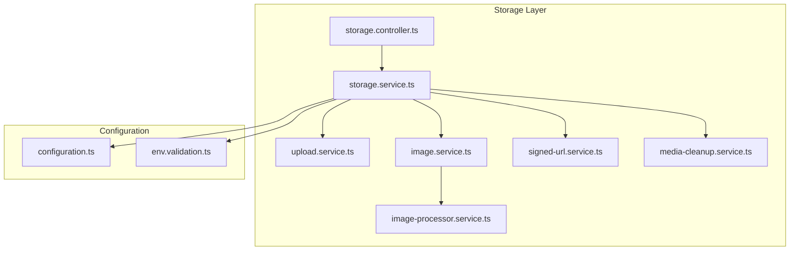
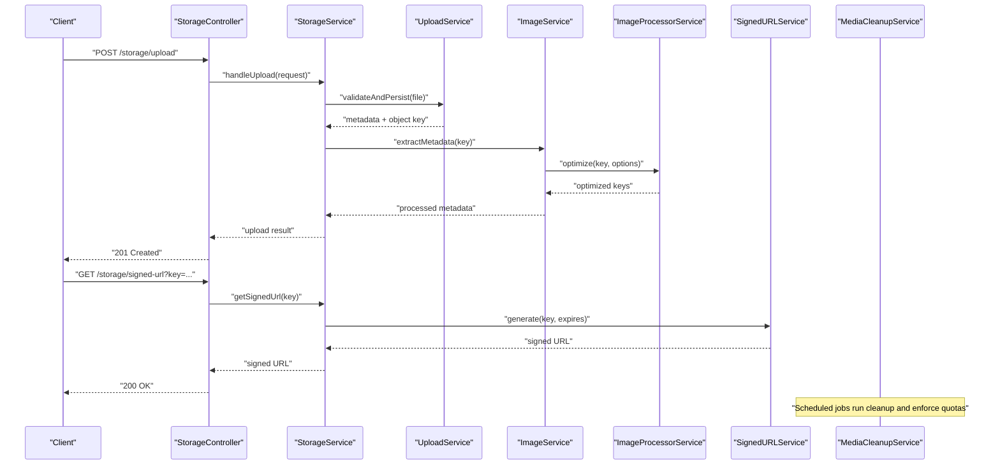
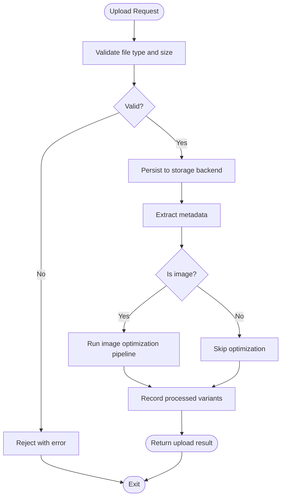
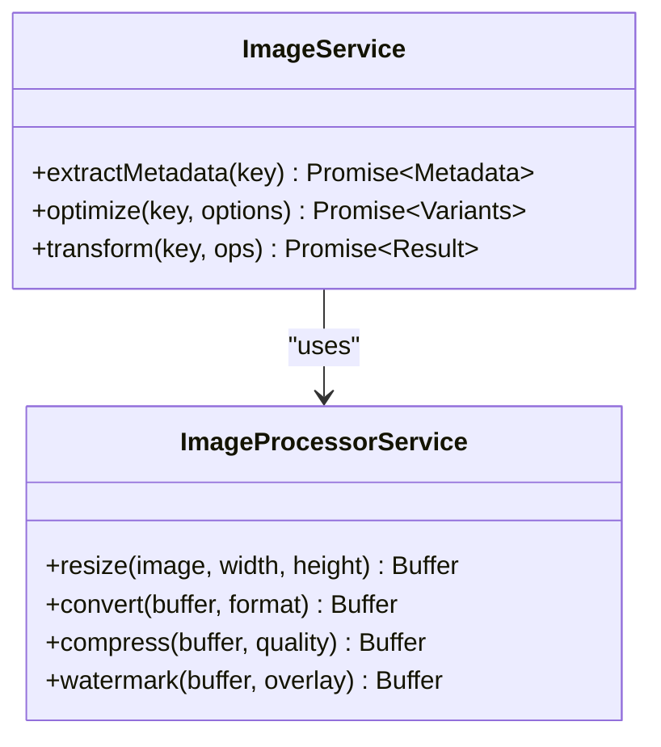
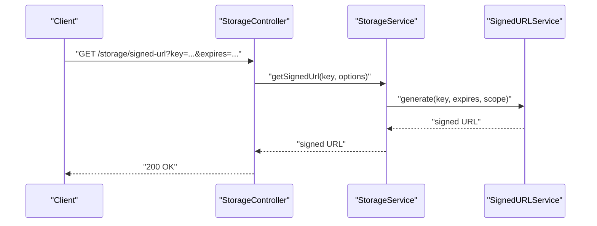
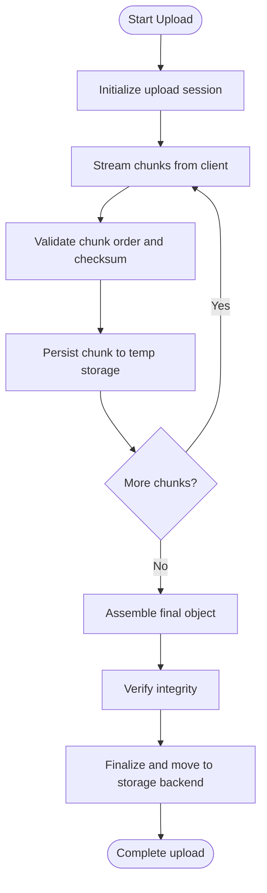
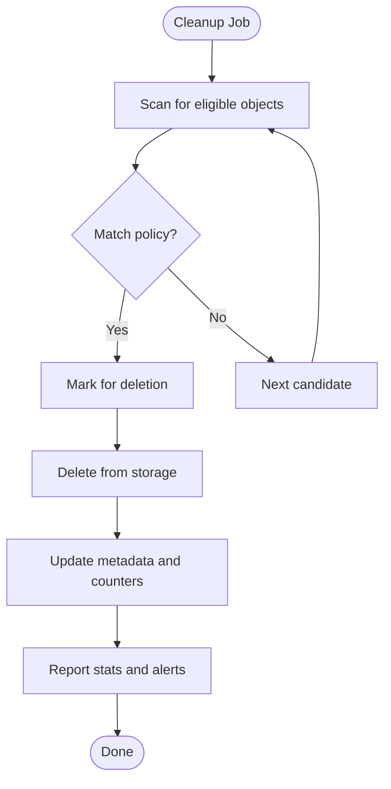
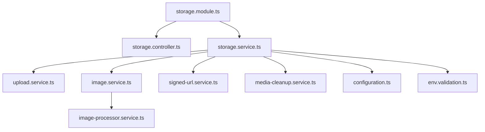

# Storage Services

<cite>
**Referenced Files in This Document**
- [storage.module.ts](file://apps/backend/src/storage/storage.module.ts)
- [storage.service.ts](file://apps/backend/src/storage/storage.service.ts)
- [upload.service.ts](file://apps/backend/src/storage/upload.service.ts)
- [image.service.ts](file://apps/backend/src/storage/image.service.ts)
- [image-processor.service.ts](file://apps/backend/src/storage/image-processor.service.ts)
- [signed-url.service.ts](file://apps/backend/src/storage/signed-url.service.ts)
- [media-cleanup.service.ts](file://apps/backend/src/storage/media-cleanup.service.ts)
- [storage.controller.ts](file://apps/backend/src/storage/storage.controller.ts)
- [configuration.ts](file://apps/backend/src/config/configuration.ts)
- [env.validation.ts](file://apps/backend/src/config/env.validation.ts)
</cite>

## Table of Contents
1. [Introduction](#introduction)
2. [Project Structure](#project-structure)
3. [Core Components](#core-components)
4. [Architecture Overview](#architecture-overview)
5. [Detailed Component Analysis](#detailed-component-analysis)
6. [Dependency Analysis](#dependency-analysis)
7. [Performance Considerations](#performance-considerations)
8. [Troubleshooting Guide](#troubleshooting-guide)
9. [Conclusion](#conclusion)
10. [Appendices](#appendices)

## Introduction
This document describes the storage services layer responsible for file upload handling, metadata extraction, media transformation pipelines, signed URL generation, and operational concerns such as cleanup policies, quotas, and disaster recovery. It covers the storage abstraction interface and concrete implementations for local filesystem and cloud storage (S3), along with CDN integration and caching strategies for static assets.

## Project Structure
The storage subsystem is implemented under apps/backend/src/storage and integrates with configuration and environment validation modules. Key files include:
- Module wiring and dependency injection setup
- Core storage service coordinating uploads and access
- Upload orchestration and validation
- Image processing and optimization pipeline
- Signed URL generation for secure access
- Cleanup and lifecycle management
- Controller endpoints exposing storage operations
- Configuration and environment validation for storage backends

**Diagram sources**
- [storage.controller.ts](file://apps/backend/src/storage/storage.controller.ts)
- [storage.service.ts](file://apps/backend/src/storage/storage.service.ts)
- [upload.service.ts](file://apps/backend/src/storage/upload.service.ts)
- [image.service.ts](file://apps/backend/src/storage/image.service.ts)
- [image-processor.service.ts](file://apps/backend/src/storage/image-processor.service.ts)
- [signed-url.service.ts](file://apps/backend/src/storage/signed-url.service.ts)
- [media-cleanup.service.ts](file://apps/backend/src/storage/media-cleanup.service.ts)
- [configuration.ts](file://apps/backend/src/config/configuration.ts)
- [env.validation.ts](file://apps/backend/src/config/env.validation.ts)

**Section sources**
- [storage.module.ts](file://apps/backend/src/storage/storage.module.ts)
- [configuration.ts](file://apps/backend/src/config/configuration.ts)
- [env.validation.ts](file://apps/backend/src/config/env.validation.ts)

## Core Components
- Storage Service: Central orchestrator for upload, retrieval, transformation, and access control. Coordinates with upload, image processing, signed URL, and cleanup services.
- Upload Service: Validates inputs, enforces size/type limits, handles multipart streams, and persists metadata.
- Image Service and Processor: Extracts metadata, resizes, optimizes, and transforms images into multiple formats.
- Signed URL Service: Generates time-bound, scoped URLs for secure direct access to stored objects.
- Media Cleanup Service: Implements retention policies, garbage collection, and quota enforcement.
- Storage Controller: Exposes HTTP endpoints for upload, download, transformation, and signed URL requests.

Key responsibilities and interactions are detailed in subsequent sections.

**Section sources**
- [storage.service.ts](file://apps/backend/src/storage/storage.service.ts)
- [upload.service.ts](file://apps/backend/src/storage/upload.service.ts)
- [image.service.ts](file://apps/backend/src/storage/image.service.ts)
- [image-processor.service.ts](file://apps/backend/src/storage/image-processor.service.ts)
- [signed-url.service.ts](file://apps/backend/src/storage/signed-url.service.ts)
- [media-cleanup.service.ts](file://apps/backend/src/storage/media-cleanup.service.ts)
- [storage.controller.ts](file://apps/backend/src/storage/storage.controller.ts)

## Architecture Overview
The storage layer follows a modular architecture with clear separation between orchestration, processing, and persistence. The controller exposes REST endpoints that delegate to the storage service, which coordinates specialized services for upload, image processing, and signed URL generation. Configuration and environment validation ensure correct backend selection and parameters.

**Diagram sources**
- [storage.controller.ts](file://apps/backend/src/storage/storage.controller.ts)
- [storage.service.ts](file://apps/backend/src/storage/storage.service.ts)
- [upload.service.ts](file://apps/backend/src/storage/upload.service.ts)
- [image.service.ts](file://apps/backend/src/storage/image.service.ts)
- [image-processor.service.ts](file://apps/backend/src/storage/image-processor.service.ts)
- [signed-url.service.ts](file://apps/backend/src/storage/signed-url.service.ts)
- [media-cleanup.service.ts](file://apps/backend/src/storage/media-cleanup.service.ts)

## Detailed Component Analysis

### Storage Abstraction Interface
The storage abstraction defines a consistent contract for reading, writing, deleting, and generating access URLs across different backends. Implementations include:
- Local Filesystem: Stores files on disk with configurable base paths and permissions.
- Cloud Storage (S3): Uses S3-compatible APIs for durable, scalable object storage.

Key interface methods typically include:
- put(objectKey, streamOrBuffer, metadata)
- get(objectKey)
- delete(objectKey)
- exists(objectKey)
- generateSignedUrl(objectKey, options)
- list(prefix, options)

Concrete implementations encapsulate backend-specific logic while exposing a uniform API to the rest of the application.

**Section sources**
- [storage.service.ts](file://apps/backend/src/storage/storage.service.ts)
- [configuration.ts](file://apps/backend/src/config/configuration.ts)
- [env.validation.ts](file://apps/backend/src/config/env.validation.ts)

### Upload Handling and Metadata Extraction
The upload flow validates incoming files, enforces constraints, and persists them via the storage abstraction. Metadata extraction captures essential properties like MIME type, dimensions, duration, and custom tags.

**Diagram sources**
- [upload.service.ts](file://apps/backend/src/storage/upload.service.ts)
- [image.service.ts](file://apps/backend/src/storage/image.service.ts)
- [image-processor.service.ts](file://apps/backend/src/storage/image-processor.service.ts)

**Section sources**
- [upload.service.ts](file://apps/backend/src/storage/upload.service.ts)
- [image.service.ts](file://apps/backend/src/storage/image.service.ts)

### Image Optimization and Media Transformation Pipeline
The image pipeline extracts metadata, generates optimized variants, and supports transformations such as resizing, format conversion, and quality tuning. It ensures consistent output formats and sizes suitable for web delivery.

**Diagram sources**
- [image.service.ts](file://apps/backend/src/storage/image.service.ts)
- [image-processor.service.ts](file://apps/backend/src/storage/image-processor.service.ts)

**Section sources**
- [image.service.ts](file://apps/backend/src/storage/image.service.ts)
- [image-processor.service.ts](file://apps/backend/src/storage/image-processor.service.ts)

### Signed URL Generation for Secure Access
Signed URLs provide time-limited, scoped access to private objects without exposing credentials. The service constructs cryptographically signed links based on backend capabilities and policy options.

**Diagram sources**
- [storage.controller.ts](file://apps/backend/src/storage/storage.controller.ts)
- [storage.service.ts](file://apps/backend/src/storage/storage.service.ts)
- [signed-url.service.ts](file://apps/backend/src/storage/signed-url.service.ts)

**Section sources**
- [signed-url.service.ts](file://apps/backend/src/storage/signed-url.service.ts)
- [storage.controller.ts](file://apps/backend/src/storage/storage.controller.ts)

### Large File Uploads and Streaming
Large file uploads are handled via streaming to minimize memory usage and improve throughput. The upload service manages chunked transfers, resume support, and integrity checks where applicable.

**Diagram sources**
- [upload.service.ts](file://apps/backend/src/storage/upload.service.ts)
- [storage.service.ts](file://apps/backend/src/storage/storage.service.ts)

**Section sources**
- [upload.service.ts](file://apps/backend/src/storage/upload.service.ts)

### File Permissions and Access Control
Permissions are enforced at both the storage backend and application layers. For local filesystem, appropriate file modes and ownership are set during write operations. For S3, ACLs or bucket policies govern access. Signed URLs further restrict access by time and scope.

Best practices:
- Use least-privilege IAM policies for S3 buckets.
- Enforce server-side encryption and disable public access unless explicitly required.
- Apply per-user scoping to object keys to isolate data.

**Section sources**
- [storage.service.ts](file://apps/backend/src/storage/storage.service.ts)
- [signed-url.service.ts](file://apps/backend/src/storage/signed-url.service.ts)
- [configuration.ts](file://apps/backend/src/config/configuration.ts)

### Storage Quota Management
Quotas limit storage consumption per user or tenant. The cleanup service monitors usage and enforces policies such as soft/hard limits, grace periods, and automatic purging of stale or orphaned files.

Operational considerations:
- Track usage metrics and alert when approaching limits.
- Implement tiered policies (e.g., free vs. premium).
- Provide self-service controls for users to manage their storage.

**Section sources**
- [media-cleanup.service.ts](file://apps/backend/src/storage/media-cleanup.service.ts)
- [storage.service.ts](file://apps/backend/src/storage/storage.service.ts)

### Cleanup Policies and Garbage Collection
Cleanup policies define retention windows, lifecycle rules, and deletion strategies. They handle:
- Expired temporary uploads
- Orphaned variants after source deletion
- Compliance-driven archival and purge schedules

**Diagram sources**
- [media-cleanup.service.ts](file://apps/backend/src/storage/media-cleanup.service.ts)

**Section sources**
- [media-cleanup.service.ts](file://apps/backend/src/storage/media-cleanup.service.ts)

### Disaster Recovery Procedures
Disaster recovery includes backup strategies, restore workflows, and cross-region replication for resilience. Recommended steps:
- Regular snapshots of object stores and database metadata.
- Versioning enabled on S3 buckets to retain historical states.
- Automated restore tests to validate recoverability.
- Runbooks for incident response and rollback procedures.

**Section sources**
- [configuration.ts](file://apps/backend/src/config/configuration.ts)
- [env.validation.ts](file://apps/backend/src/config/env.validation.ts)

### CDN Integration and Caching Strategies
CDN integration accelerates content delivery through edge caching. Strategies include:
- Cache-Control headers tuned per asset type.
- ETags and versioned URLs for cache invalidation.
- Origin shielding and fallback behavior.
- Pre-warming critical assets post-deployment.

Operational tips:
- Use immutable URLs for optimized variants.
- Invalidate caches selectively after updates.
- Monitor hit ratios and latency metrics.

**Section sources**
- [storage.service.ts](file://apps/backend/src/storage/storage.service.ts)
- [image.service.ts](file://apps/backend/src/storage/image.service.ts)

## Dependency Analysis
The storage module wires together controllers, services, and configuration providers. Dependencies are injected via NestJS module patterns, ensuring loose coupling and testability.

**Diagram sources**
- [storage.module.ts](file://apps/backend/src/storage/storage.module.ts)
- [storage.controller.ts](file://apps/backend/src/storage/storage.controller.ts)
- [storage.service.ts](file://apps/backend/src/storage/storage.service.ts)
- [upload.service.ts](file://apps/backend/src/storage/upload.service.ts)
- [image.service.ts](file://apps/backend/src/storage/image.service.ts)
- [image-processor.service.ts](file://apps/backend/src/storage/image-processor.service.ts)
- [signed-url.service.ts](file://apps/backend/src/storage/signed-url.service.ts)
- [media-cleanup.service.ts](file://apps/backend/src/storage/media-cleanup.service.ts)
- [configuration.ts](file://apps/backend/src/config/configuration.ts)
- [env.validation.ts](file://apps/backend/src/config/env.validation.ts)

**Section sources**
- [storage.module.ts](file://apps/backend/src/storage/storage.module.ts)

## Performance Considerations
- Stream large uploads to reduce memory pressure.
- Use parallel processing for image variants where safe.
- Enable compression and efficient codecs (e.g., WebP, AVIF).
- Cache frequently accessed assets at CDN and application levels.
- Monitor I/O bottlenecks and scale storage backends horizontally.

[No sources needed since this section provides general guidance]

## Troubleshooting Guide
Common issues and resolutions:
- Upload failures due to size/type restrictions: Validate client-side and server-side constraints; log rejected payloads.
- Missing metadata: Ensure extraction runs before optimization; verify supported formats.
- Signed URL errors: Check expiration, scope, and backend signing configuration.
- Cleanup not running: Inspect scheduled job status and policy definitions.
- Permission denied: Review IAM policies and file modes; confirm object key scoping.

**Section sources**
- [upload.service.ts](file://apps/backend/src/storage/upload.service.ts)
- [image.service.ts](file://apps/backend/src/storage/image.service.ts)
- [signed-url.service.ts](file://apps/backend/src/storage/signed-url.service.ts)
- [media-cleanup.service.ts](file://apps/backend/src/storage/media-cleanup.service.ts)

## Conclusion
The storage services layer provides a robust, extensible foundation for managing media assets across local and cloud backends. With clear abstractions, comprehensive upload handling, image optimization, secure access via signed URLs, and operational features like cleanup and quotas, it supports scalable and resilient media workflows. Integrating CDN and caching strategies further enhances performance and reliability.

[No sources needed since this section summarizes without analyzing specific files]

## Appendices

### Implementing a Custom Storage Backend
Steps to add a new backend:
- Define an implementation of the storage abstraction interface.
- Register the implementation in the storage module provider configuration.
- Wire environment variables via configuration and validation modules.
- Test read/write/delete/sign operations against the new backend.

**Section sources**
- [storage.module.ts](file://apps/backend/src/storage/storage.module.ts)
- [configuration.ts](file://apps/backend/src/config/configuration.ts)
- [env.validation.ts](file://apps/backend/src/config/env.validation.ts)

### Managing File Permissions
- Local filesystem: Set appropriate umask and ownership; use secure directories.
- S3: Configure bucket policies, ACLs, and IAM roles; prefer signed URLs for private content.
- Application-level checks: Validate user context and resource ownership before operations.

**Section sources**
- [storage.service.ts](file://apps/backend/src/storage/storage.service.ts)
- [signed-url.service.ts](file://apps/backend/src/storage/signed-url.service.ts)

### CDN and Caching Best Practices
- Use immutable URLs for optimized assets.
- Set appropriate Cache-Control and ETag headers.
- Implement cache invalidation hooks after updates.
- Monitor CDN metrics for hit rates and latency.

**Section sources**
- [storage.service.ts](file://apps/backend/src/storage/storage.service.ts)
- [image.service.ts](file://apps/backend/src/storage/image.service.ts)